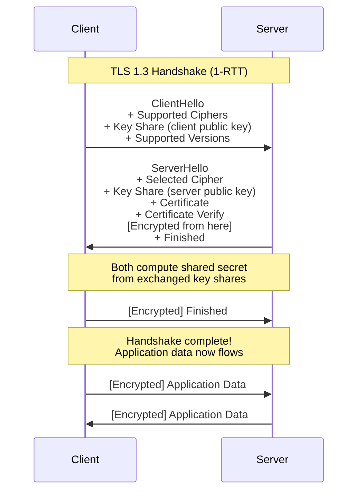
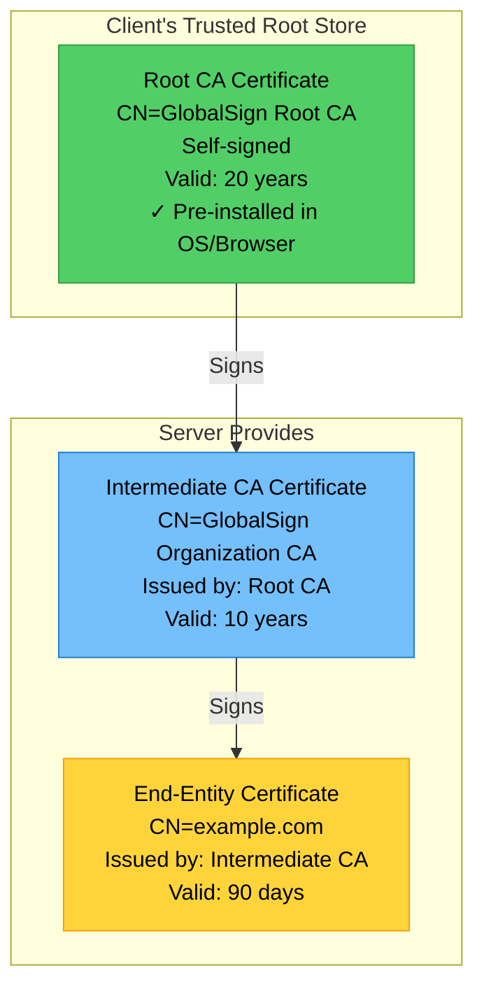
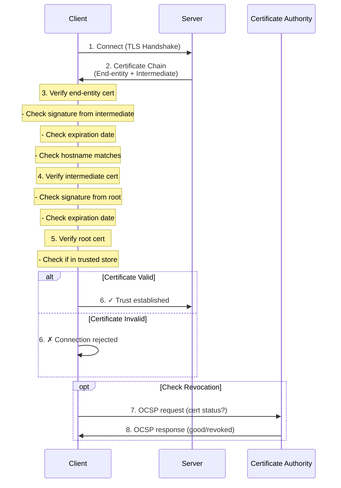

# TLS/SSL

Transport Layer Security (TLS) and its predecessor SSL provide encryption and authentication for network communications. This subtopic covers TLS 1.3, certificates, certificate chains, and HTTP Strict Transport Security (HSTS).

## TLS Overview

TLS provides three security properties: encryption, authentication, and integrity.

### Security Properties

```
TLS Security Properties:

┌──────────────────────────────────────────────┐
│ 1. Encryption (Confidentiality)             │
│    - Symmetric encryption of data            │
│    - Prevents eavesdropping                  │
│    - Algorithms: AES-GCM, ChaCha20-Poly1305 │
├──────────────────────────────────────────────┤
│ 2. Authentication                            │
│    - Verify server identity                  │
│    - Optional client authentication          │
│    - Uses X.509 certificates                │
├──────────────────────────────────────────────┤
│ 3. Integrity                                 │
│    - Detect tampering with data              │
│    - Message Authentication Codes (MAC)      │
│    - Prevents modification attacks           │
└──────────────────────────────────────────────┘
```

## TLS 1.3 Handshake

TLS 1.3 improved security and performance over previous versions. The most significant improvement is the reduction from 2 round trips (RTT) to 1 RTT for the initial handshake.

### TLS 1.3 Handshake Flow



### TLS 1.2 vs TLS 1.3 Comparison

```mermaid
graph LR
    subgraph TLS_12["TLS 1.2 (2-RTT)"]
        C1[Client]
        S1[Server]
        C1 -->|1. ClientHello| S1
        S1 -->|2. ServerHello + Cert| C1
        C1 -->|3. Key Exchange| S1
        S1 -->|4. Finished| C1
    end

    subgraph TLS_13["TLS 1.3 (1-RTT)"]
        C2[Client]
        S2[Server]
        C2 -->|1. ClientHello + KeyShare| S2
        S2 -->|2. ServerHello + KeyShare<br/>[Encrypted] Finished| C2
    end

    style TLS_12 fill:#ffe066
    style TLS_13 fill:#51cf66
```

**TLS 1.3 Improvements:**
- **Faster**: 1 RTT instead of 2 (reduces latency by ~100ms)
- **More secure**: Removed weak cipher suites and algorithms
- **Always encrypted**: Certificate and most handshake messages encrypted
- **Forward secrecy**: Required for all cipher suites (no RSA key exchange)
- **Simpler**: Removed unnecessary features and vulnerable options

### TLS 1.3 Implementation

```python
import ssl
import socket
from typing import Dict

class TLSConfiguration:
    """Secure TLS configuration"""

    @staticmethod
    def create_secure_context() -> ssl.SSLContext:
        """
        Create secure TLS context (server-side)
        """
        # Use TLS 1.3 (or 1.2 minimum)
        context = ssl.SSLContext(ssl.PROTOCOL_TLS_SERVER)

        # Minimum TLS version
        context.minimum_version = ssl.TLSVersion.TLSv1_2
        # Prefer TLS 1.3
        context.maximum_version = ssl.TLSVersion.TLSv1_3

        # Load certificate and private key
        context.load_cert_chain(
            certfile='/path/to/server.crt',
            keyfile='/path/to/server.key'
        )

        # Strong cipher suites only
        context.set_ciphers('ECDHE+AESGCM:ECDHE+CHACHA20:!aNULL:!MD5:!DSS')

        # Require certificate verification
        context.check_hostname = True
        context.verify_mode = ssl.CERT_REQUIRED

        # Load CA certificates for client verification
        context.load_verify_locations('/path/to/ca-bundle.crt')

        return context

    @staticmethod
    def create_client_context() -> ssl.SSLContext:
        """
        Create secure TLS context (client-side)
        """
        context = ssl.create_default_context()

        # Minimum TLS version
        context.minimum_version = ssl.TLSVersion.TLSv1_2

        # Verify server certificate
        context.check_hostname = True
        context.verify_mode = ssl.CERT_REQUIRED

        # Optional: Certificate pinning
        # context.load_verify_locations('/path/to/pinned-cert.pem')

        return context

    @staticmethod
    def secure_socket_wrapper(sock: socket.socket, hostname: str) -> ssl.SSLSocket:
        """
        Wrap socket with TLS (client)
        """
        context = TLSConfiguration.create_client_context()

        # Wrap socket
        secure_sock = context.wrap_socket(
            sock,
            server_hostname=hostname  # For SNI
        )

        return secure_sock


# Example: HTTPS request with TLS 1.3
import requests

def make_secure_request(url: str):
    """Make HTTPS request with strict TLS settings"""
    session = requests.Session()

    # Configure adapter with secure TLS
    from requests.adapters import HTTPAdapter
    from urllib3.util.ssl_ import create_urllib3_context

    class TLSAdapter(HTTPAdapter):
        def init_poolmanager(self, *args, **kwargs):
            context = create_urllib3_context()
            context.minimum_version = ssl.TLSVersion.TLSv1_2
            context.set_ciphers('ECDHE+AESGCM:ECDHE+CHACHA20')
            kwargs['ssl_context'] = context
            return super().init_poolmanager(*args, **kwargs)

    session.mount('https://', TLSAdapter())

    response = session.get(url)
    return response
```

## X.509 Certificates

Certificates bind a public key to an identity (domain name, organization).

### Certificate Structure

```
X.509 Certificate Structure:

┌─────────────────────────────────────────────┐
│ Version: 3                                  │
│ Serial Number: 0x1234...                    │
├─────────────────────────────────────────────┤
│ Signature Algorithm: SHA256-RSA             │
├─────────────────────────────────────────────┤
│ Issuer: CN=Let's Encrypt Authority X3       │
├─────────────────────────────────────────────┤
│ Validity:                                   │
│   Not Before: 2024-01-01 00:00:00          │
│   Not After:  2024-04-01 00:00:00          │
├─────────────────────────────────────────────┤
│ Subject: CN=example.com                     │
├─────────────────────────────────────────────┤
│ Public Key Info:                            │
│   Algorithm: RSA 2048-bit                   │
│   Public Key: (2048-bit modulus)           │
├─────────────────────────────────────────────┤
│ Extensions:                                 │
│   Subject Alternative Names:                │
│     DNS: example.com                        │
│     DNS: www.example.com                    │
│   Key Usage: Digital Signature, Key Encip  │
│   Extended Key Usage: Server Auth           │
│   CRL Distribution Points: ...              │
│   Authority Information Access: ...         │
├─────────────────────────────────────────────┤
│ Signature: (2048-bit signature)             │
└─────────────────────────────────────────────┘
```

### Certificate Validation

```python
import ssl
import socket
from datetime import datetime
from cryptography import x509
from cryptography.hazmat.backends import default_backend

class CertificateValidator:
    """Certificate validation for security"""

    @staticmethod
    def get_server_certificate(hostname: str, port: int = 443) -> x509.Certificate:
        """Retrieve server certificate"""
        # Get PEM certificate
        cert_pem = ssl.get_server_certificate((hostname, port))

        # Parse certificate
        cert = x509.load_pem_x509_certificate(
            cert_pem.encode(),
            default_backend()
        )

        return cert

    @staticmethod
    def validate_certificate(cert: x509.Certificate, hostname: str) -> Dict:
        """
        Validate certificate
        """
        issues = []

        # 1. Check expiration
        now = datetime.utcnow()
        if cert.not_valid_before > now:
            issues.append("Certificate not yet valid")
        if cert.not_valid_after < now:
            issues.append("Certificate expired")

        # 2. Check hostname
        try:
            san_ext = cert.extensions.get_extension_for_oid(
                x509.oid.ExtensionOID.SUBJECT_ALTERNATIVE_NAME
            )
            san_names = san_ext.value.get_values_for_type(x509.DNSName)

            if hostname not in san_names:
                issues.append(f"Hostname {hostname} not in SAN")
        except x509.ExtensionNotFound:
            issues.append("No SAN extension found")

        # 3. Check key usage
        try:
            key_usage = cert.extensions.get_extension_for_oid(
                x509.oid.ExtensionOID.KEY_USAGE
            )
            if not key_usage.value.digital_signature:
                issues.append("Digital signature not allowed")
        except x509.ExtensionNotFound:
            pass

        # 4. Check signature algorithm
        sig_algo = cert.signature_algorithm_oid._name
        weak_algos = ['md5', 'sha1']
        if any(weak in sig_algo.lower() for weak in weak_algos):
            issues.append(f"Weak signature algorithm: {sig_algo}")

        # 5. Check key size
        public_key = cert.public_key()
        if hasattr(public_key, 'key_size'):
            if public_key.key_size < 2048:
                issues.append(f"Key size too small: {public_key.key_size} bits")

        return {
            'valid': len(issues) == 0,
            'issues': issues,
            'subject': cert.subject.rfc4514_string(),
            'issuer': cert.issuer.rfc4514_string(),
            'not_before': cert.not_valid_before,
            'not_after': cert.not_valid_after
        }

    @staticmethod
    def display_certificate_info(cert: x509.Certificate):
        """Display certificate information"""
        print(f"Subject: {cert.subject.rfc4514_string()}")
        print(f"Issuer: {cert.issuer.rfc4514_string()}")
        print(f"Valid from: {cert.not_valid_before}")
        print(f"Valid until: {cert.not_valid_after}")
        print(f"Serial: {hex(cert.serial_number)}")

        # Subject Alternative Names
        try:
            san = cert.extensions.get_extension_for_oid(
                x509.oid.ExtensionOID.SUBJECT_ALTERNATIVE_NAME
            )
            print(f"SAN: {', '.join(san.value.get_values_for_type(x509.DNSName))}")
        except:
            pass
```

## Certificate Chains

Certificates form a chain of trust from end-entity to root CA. The chain establishes trust without requiring every certificate to be pre-installed.

### Chain of Trust



### Certificate Validation Process



**Verification Steps:**
1. End-entity cert signed by intermediate CA
2. Intermediate cert signed by root CA
3. Root cert exists in trusted store
4. All certificates are currently valid (not expired, not revoked)
5. Hostname in end-entity cert matches requested domain

### Chain Verification

```python
from cryptography import x509
from cryptography.hazmat.primitives import hashes
from cryptography.hazmat.primitives.asymmetric import padding

class CertificateChainValidator:
    """Validate certificate chains"""

    def __init__(self, trusted_roots: list):
        self.trusted_roots = trusted_roots

    def verify_chain(self, cert_chain: list) -> bool:
        """
        Verify certificate chain
        cert_chain[0] = end-entity
        cert_chain[1] = intermediate
        cert_chain[2] = root (optional)
        """
        if not cert_chain:
            return False

        # Verify each certificate in chain
        for i in range(len(cert_chain) - 1):
            cert = cert_chain[i]
            issuer_cert = cert_chain[i + 1]

            if not self._verify_signature(cert, issuer_cert):
                return False

        # Verify root is trusted
        root_cert = cert_chain[-1]
        if not self._is_trusted_root(root_cert):
            return False

        # Verify all certificates are valid (not expired)
        now = datetime.utcnow()
        for cert in cert_chain:
            if cert.not_valid_before > now or cert.not_valid_after < now:
                return False

        return True

    def _verify_signature(self, cert: x509.Certificate,
                         issuer_cert: x509.Certificate) -> bool:
        """Verify certificate signature"""
        try:
            issuer_public_key = issuer_cert.public_key()

            # Verify signature
            issuer_public_key.verify(
                cert.signature,
                cert.tbs_certificate_bytes,
                padding.PKCS1v15(),
                cert.signature_hash_algorithm
            )
            return True
        except Exception:
            return False

    def _is_trusted_root(self, cert: x509.Certificate) -> bool:
        """Check if certificate is a trusted root"""
        for trusted in self.trusted_roots:
            if cert.fingerprint(hashes.SHA256()) == trusted.fingerprint(hashes.SHA256()):
                return True
        return False
```

## Certificate Pinning

Certificate pinning hardcodes expected certificates to prevent MITM attacks.

```python
import hashlib
import ssl

class CertificatePinning:
    """Implement certificate pinning"""

    def __init__(self, pinned_hashes: list):
        """
        pinned_hashes: List of expected certificate fingerprints
        """
        self.pinned_hashes = set(pinned_hashes)

    def verify_certificate(self, cert_der: bytes) -> bool:
        """Verify certificate matches pinned hash"""
        # Calculate SHA256 fingerprint
        fingerprint = hashlib.sha256(cert_der).hexdigest()

        # Check against pinned hashes
        return fingerprint in self.pinned_hashes

    @staticmethod
    def get_certificate_fingerprint(hostname: str, port: int = 443) -> str:
        """Get certificate fingerprint for pinning"""
        cert_pem = ssl.get_server_certificate((hostname, port))
        cert_der = ssl.PEM_cert_to_DER_cert(cert_pem)
        fingerprint = hashlib.sha256(cert_der).hexdigest()
        return fingerprint


# Example usage
pinned_hashes = [
    'e3b0c44298fc1c149afbf4c8996fb92427ae41e4649b934ca495991b7852b855',
    '38b060a751ac96384cd9327eb1b1e36a21fdb71114be07434c0cc7bf63f6e1da'  # Backup
]

pinner = CertificatePinning(pinned_hashes)

# In SSL context
def create_pinned_context():
    context = ssl.create_default_context()

    # Custom verification callback
    def verify_callback(conn, cert, errno, depth, ok):
        if depth == 0:  # Leaf certificate
            cert_der = cert.to_cryptography().public_bytes(
                encoding=serialization.Encoding.DER
            )
            return pinner.verify_certificate(cert_der)
        return ok

    # Set verification callback
    context.check_hostname = False
    context.verify_mode = ssl.CERT_REQUIRED
    # Note: Actual implementation requires lower-level SSL libraries

    return context
```

## HTTP Strict Transport Security (HSTS)

HSTS forces browsers to always use HTTPS, preventing SSL stripping attacks.

```python
class HSTSConfiguration:
    """HSTS configuration and implementation"""

    @staticmethod
    def generate_hsts_header(
        max_age: int = 31536000,  # 1 year
        include_subdomains: bool = True,
        preload: bool = False
    ) -> str:
        """
        Generate HSTS header

        max_age: How long (seconds) to remember HTTPS-only
        include_subdomains: Apply to all subdomains
        preload: Submit to HSTS preload list
        """
        header = f"max-age={max_age}"

        if include_subdomains:
            header += "; includeSubDomains"

        if preload:
            header += "; preload"

        return header

    @staticmethod
    def flask_hsts_middleware():
        """Flask middleware for HSTS"""
        from flask import Flask, make_response

        app = Flask(__name__)

        @app.after_request
        def add_hsts(response):
            if request.is_secure:  # Only on HTTPS
                response.headers['Strict-Transport-Security'] = (
                    'max-age=31536000; includeSubDomains; preload'
                )
            return response

        return app

    @staticmethod
    def redirect_http_to_https():
        """Redirect all HTTP traffic to HTTPS"""
        from flask import Flask, redirect, request

        app = Flask(__name__)

        @app.before_request
        def force_https():
            if not request.is_secure:
                url = request.url.replace('http://', 'https://', 1)
                return redirect(url, code=301)

        return app
```

## TLS Best Practices

```python
class TLSBestPractices:
    """TLS security best practices"""

    RECOMMENDATIONS = """
    TLS Security Best Practices:

    1. Protocol Version
       ✓ Use TLS 1.3 (or minimum TLS 1.2)
       ✗ Disable SSL 2.0, SSL 3.0, TLS 1.0, TLS 1.1

    2. Cipher Suites
       ✓ Use AEAD ciphers (AES-GCM, ChaCha20-Poly1305)
       ✓ Use perfect forward secrecy (ECDHE, DHE)
       ✗ Disable RC4, 3DES, MD5, NULL ciphers

    3. Certificates
       ✓ Use 2048-bit RSA or 256-bit ECC
       ✓ Use SHA-256 or better
       ✓ Enable OCSP stapling
       ✗ Don't use MD5 or SHA-1

    4. Certificate Management
       ✓ Automate renewal (Let's Encrypt)
       ✓ Monitor expiration
       ✓ Use short-lived certificates (90 days)
       ✓ Implement certificate pinning for mobile apps

    5. HSTS
       ✓ Enable HSTS with long max-age
       ✓ Include subdomains
       ✓ Consider HSTS preload list

    6. Additional Security
       ✓ Disable TLS compression (CRIME attack)
       ✓ Implement perfect forward secrecy
       ✓ Use secure renegotiation
       ✓ Enable OCSP stapling
    """

    @staticmethod
    def check_tls_configuration(hostname: str, port: int = 443) -> Dict:
        """Check TLS configuration security"""
        import ssl
        import socket

        results = {
            'hostname': hostname,
            'port': port,
            'issues': []
        }

        try:
            context = ssl.create_default_context()
            with socket.create_connection((hostname, port)) as sock:
                with context.wrap_socket(sock, server_hostname=hostname) as ssock:
                    # Get TLS version
                    tls_version = ssock.version()
                    results['tls_version'] = tls_version

                    if tls_version not in ['TLSv1.2', 'TLSv1.3']:
                        results['issues'].append(f"Outdated TLS version: {tls_version}")

                    # Get cipher
                    cipher = ssock.cipher()
                    results['cipher'] = cipher[0] if cipher else None

                    # Check for weak ciphers
                    if cipher and any(weak in cipher[0] for weak in ['RC4', '3DES', 'MD5']):
                        results['issues'].append(f"Weak cipher: {cipher[0]}")

                    # Get certificate
                    cert_der = ssock.getpeercert(binary_form=True)
                    cert = x509.load_der_x509_certificate(cert_der, default_backend())
                    results['certificate'] = {
                        'subject': cert.subject.rfc4514_string(),
                        'issuer': cert.issuer.rfc4514_string(),
                        'not_after': cert.not_valid_after.isoformat()
                    }

        except Exception as e:
            results['error'] = str(e)

        return results
```

## Summary

TLS/SSL provides essential security for network communications:

- **TLS 1.3**: Latest protocol with improved security and performance (1-RTT handshake)
- **Certificates**: X.509 certificates bind public keys to identities, validated in chains
- **Certificate Chains**: Chain of trust from end-entity through intermediate to root CA
- **Certificate Pinning**: Hardcode expected certificates to prevent MITM attacks
- **HSTS**: Force HTTPS connections, prevent SSL stripping attacks
- **Best Practices**: Use TLS 1.3/1.2, strong ciphers, valid certificates, HSTS

Proper TLS configuration is critical for securing data in transit. Always use the latest TLS version, strong cipher suites, and valid certificates from trusted CAs.
