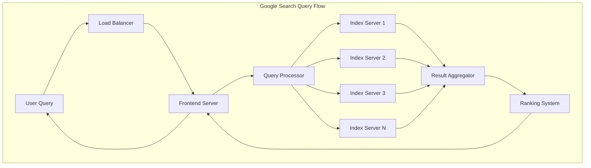
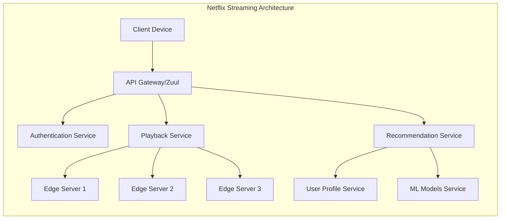

# Introduction to Distributed Systems

## Introduction

Distributed systems represent one of the most fundamental paradigms in modern computing, forming the backbone of virtually every large-scale application and service we interact with daily. At its core, a distributed system is a collection of independent computers that appears to its users as a single coherent system. These computers, often called nodes, communicate and coordinate their actions by passing messages over a network to achieve a common goal.

The importance of distributed systems has grown exponentially over the past few decades. As our digital world has expanded, single computers have become insufficient to handle the massive scale of modern applications. Consider that Google processes over 8.5 billion searches per day, Netflix streams to over 230 million subscribers simultaneously, and Amazon handles millions of transactions during peak shopping events. None of these feats would be possible with a single computer, no matter how powerful.

What makes distributed systems particularly fascinating is their inherent complexity. Unlike centralized systems where all components exist in a single location with shared memory and a common clock, distributed systems must deal with network delays, partial failures, concurrent operations, and the fundamental impossibility of perfect synchronization. These challenges make distributed systems both intellectually compelling and practically essential.

The study of distributed systems encompasses a wide range of topics, from theoretical foundations like the CAP theorem and consensus algorithms to practical engineering concerns like load balancing, fault tolerance, and scalability. Understanding distributed systems is crucial for any software engineer working on modern applications, as the principles apply whether you're building a microservices architecture, designing a database system, or creating a distributed machine learning platform.

## What Defines a Distributed System

A distributed system is characterized by several key properties that distinguish it from traditional centralized systems. Understanding these characteristics is essential for recognizing when you're working with a distributed system and what challenges you'll face.

**Concurrency**: Multiple components execute simultaneously and independently. Unlike a single-threaded application where operations happen sequentially, distributed systems must handle many operations occurring at the same time across different nodes. This concurrency creates challenges in maintaining consistency and coordinating actions.

**Lack of Global Clock**: There is no single, universally agreed-upon time source. Each node in a distributed system has its own clock, and these clocks inevitably drift apart. This seemingly simple issue has profound implications for ordering events, detecting causality, and implementing protocols. Even with time synchronization protocols like NTP (Network Time Protocol), perfect clock synchronization is impossible due to network delays and clock drift.

**Independent Failures**: Components can fail independently without bringing down the entire system. A network switch might fail, a server might crash, or a disk might fill up, all while other parts of the system continue operating. This partial failure model is both a strength (the system can continue functioning) and a challenge (detecting and handling these failures is complex).

**Geographic Distribution**: Nodes may be spread across different data centers, cities, or even continents. This distribution provides benefits like reduced latency for users in different regions and protection against regional failures, but it also introduces significant network delays and makes coordination more expensive.

**Heterogeneity**: Different nodes might have different hardware, operating systems, programming languages, or configurations. A distributed system must work despite this diversity, often through well-defined protocols and interfaces.

## Why Distributed Systems Matter

The shift toward distributed systems isn't just a technological trend; it's driven by fundamental requirements that cannot be met by centralized systems:

**Scale**: Modern applications serve billions of users and process petabytes of data. No single computer can handle this load. Facebook's infrastructure handles over 4 petabytes of data generated daily by its users. Google's search index contains hundreds of billions of web pages. These scales demand distribution across thousands or millions of machines.

**Availability**: Users expect services to be available 24/7/365. Distributed systems achieve high availability by eliminating single points of failure. If one server fails, others can take over its work. Amazon famously quantified that every 100ms of latency costs them 1% in sales, highlighting how downtime directly impacts business.

**Geographic Distribution**: To provide low latency to users worldwide, applications need to be geographically distributed. A user in Tokyo shouldn't have to wait for data to travel from a server in Virginia. Content Delivery Networks (CDNs) like Cloudflare and Akamai place servers in hundreds of locations worldwide to minimize latency.

**Fault Tolerance**: Hardware fails. Network cables get unplugged. Software has bugs. Power outages occur. Distributed systems are designed to continue operating correctly even when components fail. Google designs its systems assuming that hard drives fail frequently, power supplies die, and entire data centers can go offline.

**Resource Sharing**: Distributed systems enable sharing of expensive resources. Cloud computing platforms like AWS, Azure, and Google Cloud allow thousands of organizations to share physical infrastructure, making computing resources accessible and affordable.

**Inherent Distribution**: Some problems are naturally distributed. A bank with branches in multiple cities needs a distributed system. An IoT network with sensors spread across a factory floor is inherently distributed. Social networks connect users across the globe.

## Real-World Examples

Understanding distributed systems becomes more concrete when we examine how major companies build their systems:

### Google: The Pioneer of Web-Scale Distribution

Google's infrastructure is perhaps the most influential example of distributed system design. Their approach has shaped how the entire industry thinks about building large-scale systems.

**Google Search**: When you perform a Google search, your query is processed by a distributed system spanning multiple data centers. The query is parsed and distributed to thousands of servers that hold portions of the search index. These servers work in parallel, searching their local index slices and returning results. A coordinator aggregates these results, ranks them, and returns the top results to you, all in a fraction of a second.

**Google File System (GFS) and Bigtable**: Google developed GFS to store massive amounts of data reliably across thousands of commodity servers. They assume hardware will fail regularly, so data is automatically replicated across multiple machines. Bigtable, built on top of GFS, provides a distributed storage system for structured data, powering services like Gmail, Google Maps, and Google Earth.

**MapReduce and Spanner**: MapReduce revolutionized large-scale data processing by providing a simple programming model that automatically handles distribution and fault tolerance. Spanner takes distribution further by providing a globally distributed database with strong consistency guarantees, using atomic clocks and GPS to provide globally synchronized timestamps.

### Amazon: Reliability at Massive Scale

Amazon's systems handle millions of transactions, especially during events like Prime Day where they processed 300 million items ordered globally in 2021.

**Amazon DynamoDB**: A fully managed NoSQL database service designed for high availability and scalability. DynamoDB automatically spreads data and traffic across multiple servers and data centers. It uses consistent hashing to distribute data and supports both eventual and strong consistency models, allowing developers to make tradeoffs based on their needs.

**Amazon S3**: The Simple Storage Service is one of the largest distributed storage systems in the world, storing trillions of objects. S3 achieves 99.999999999% (11 nines) durability by automatically replicating data across multiple devices in multiple facilities.

**Amazon's Microservices**: Amazon transformed from a monolithic application to a microservices architecture where hundreds of services communicate via well-defined APIs. This distribution allows teams to work independently and deploy changes without affecting the entire system.

### Netflix: Streaming to Millions

Netflix streams to over 230 million subscribers globally, delivering billions of hours of content monthly. Their distributed system must handle massive traffic spikes (like when a popular series releases all episodes) while providing high-quality, uninterrupted streaming.

**Open Connect CDN**: Netflix built its own Content Delivery Network with thousands of servers placed within Internet Service Provider networks worldwide. Popular content is pre-positioned on these edge servers, reducing latency and bandwidth costs.

**Microservices Architecture**: Netflix runs hundreds of microservices in AWS, using tools they've open-sourced like Eureka (service discovery), Hystrix (fault tolerance), and Zuul (API gateway). Each service is independently deployable and scalable.

**Chaos Engineering**: Netflix pioneered chaos engineering with tools like Chaos Monkey, which randomly terminates instances in production to ensure the system can handle failures. This approach has been adopted industry-wide.

## Fundamental Challenges

Building distributed systems introduces challenges that simply don't exist in centralized systems. Understanding these challenges is crucial for designing robust distributed applications:

### Network Unreliability

Networks are fundamentally unreliable. Messages can be delayed, duplicated, reordered, or lost entirely. When you send a message and don't receive a response, you cannot distinguish between several scenarios: the request was lost, the request was received but the response was lost, the remote node crashed before processing the request, or the remote node is just slow.

This uncertainty forces distributed systems to use timeouts, retries, and idempotent operations. An idempotent operation produces the same result whether executed once or multiple times, which is essential when you might need to retry operations.

### Partial Failures

In a centralized system, failures are usually total—the entire system works or it doesn't. In a distributed system, some components can fail while others continue working normally. A database might be unreachable from one service but accessible from another due to network partitioning.

Partial failures make error handling complex. You must design systems that can degrade gracefully, continuing to provide limited functionality when some components fail. This often requires careful thinking about what operations can proceed safely and which must be blocked.

### Concurrency and Consistency

When multiple nodes can modify shared data concurrently, maintaining consistency becomes challenging. If two users try to book the last seat on a flight simultaneously, your system must ensure that only one succeeds, even if the operations happen on different servers in different data centers.

The CAP theorem, which we'll explore in depth later, proves that you cannot simultaneously guarantee consistency, availability, and partition tolerance. This fundamental limitation forces architects to make difficult tradeoffs.

### Clock Synchronization

Without a global clock, ordering events becomes problematic. If Server A timestamps an event at 10:00:01 and Server B timestamps an event at 10:00:00, we cannot assume A's event happened second—Server B's clock might just be ahead.

This challenge has spawned solutions like Lamport clocks and vector clocks, which provide logical ordering without requiring synchronized physical clocks. Google's Spanner uses atomic clocks and GPS to achieve much tighter clock synchronization than typical systems, but even they cannot achieve perfect synchronization.

### Scalability Challenges

Scalability isn't just about handling more load; it's about doing so efficiently. A system is scalable if its performance improves proportionally when you add resources. However, many operations don't scale linearly:

- **Coordination overhead**: The more nodes you have, the more expensive it becomes to coordinate them
- **Data locality**: As data is distributed, fetching related data may require multiple network hops
- **Bottlenecks**: A single component that doesn't scale can limit the entire system's scalability

### Security and Privacy

Distributed systems have larger attack surfaces. Data transmitted between nodes can be intercepted. Authentication and authorization become more complex when requests flow through multiple services. Ensuring data privacy while allowing necessary sharing requires careful design.

## Advantages of Distributed Systems

Despite the challenges, distributed systems offer compelling advantages:

**Horizontal Scalability**: Add more machines to handle increased load, rather than buying increasingly expensive powerful machines (vertical scaling)

**Fault Tolerance**: Redundancy ensures the system continues operating despite component failures

**Low Latency**: Place computation and data close to users geographically

**Cost Effectiveness**: Use commodity hardware instead of expensive specialized machines

**Flexibility**: Mix and match different technologies for different components

**Isolation**: Failures in one component don't necessarily crash the entire system

## Summary

Distributed systems are not an optional technology—they are a necessity for modern computing at scale. From the search engines we use daily to the streaming services we enjoy to the financial systems that process our transactions, distributed systems enable the digital world.

The field of distributed systems combines theoretical computer science with practical engineering. Theoretical results like the CAP theorem and the FLP impossibility result tell us what's fundamentally achievable. Practical systems like Google's Spanner, Amazon's DynamoDB, and Apache Kafka show us how to build robust systems within these theoretical constraints.

Key takeaways:

- Distributed systems consist of independent computers working together as a single coherent system
- They are essential for achieving scale, availability, and fault tolerance
- Major internet companies rely entirely on distributed systems architectures
- Fundamental challenges include network unreliability, partial failures, concurrency, and lack of global clocks
- Understanding distributed systems is crucial for modern software engineering

The following topics will dive deeper into the specific techniques, algorithms, and patterns used to build distributed systems that are reliable, scalable, and maintainable. We'll explore how to coordinate actions across nodes, maintain consistency, handle failures gracefully, and make the right tradeoffs for your specific requirements.
