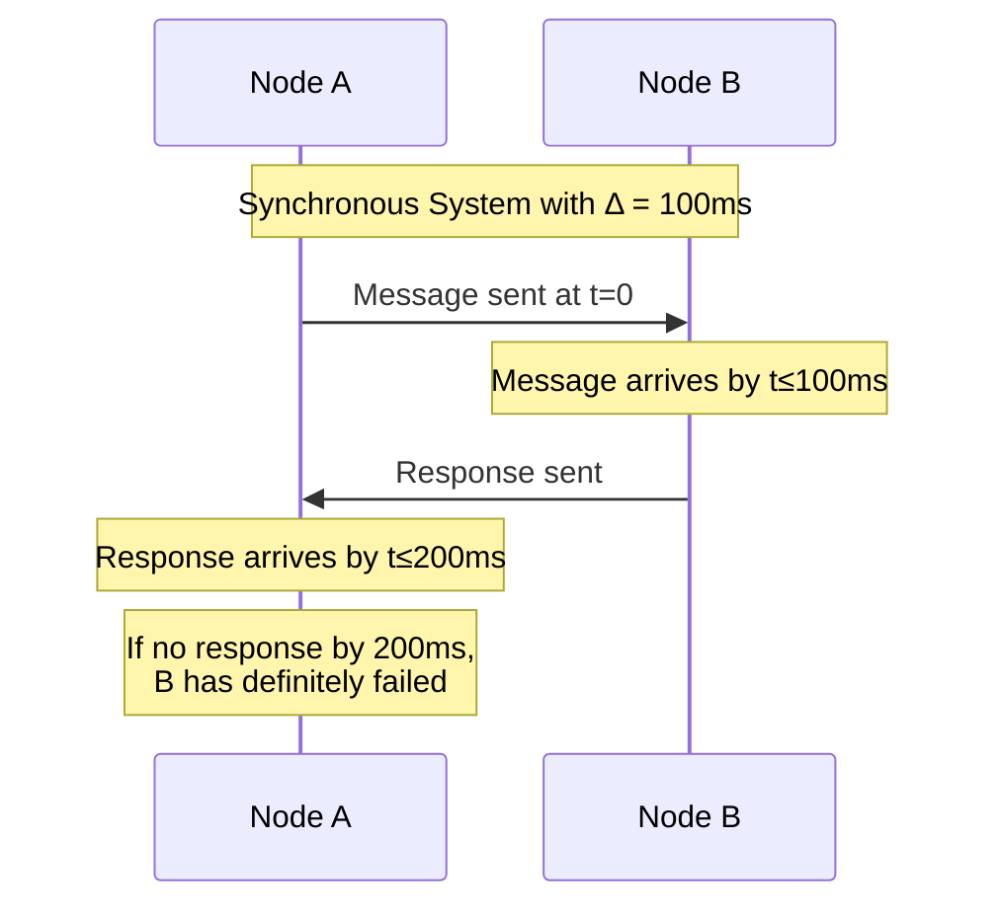
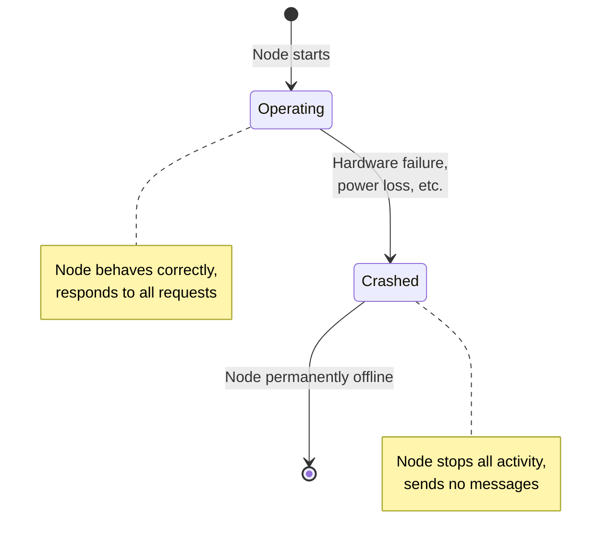
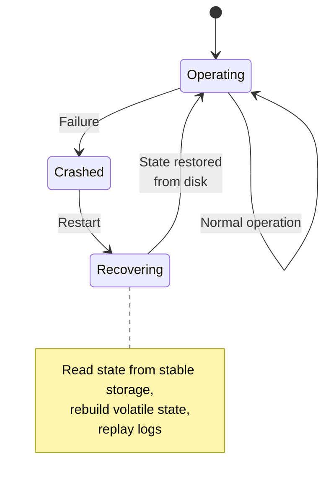
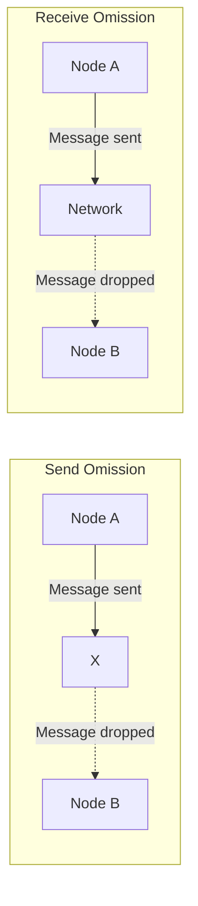
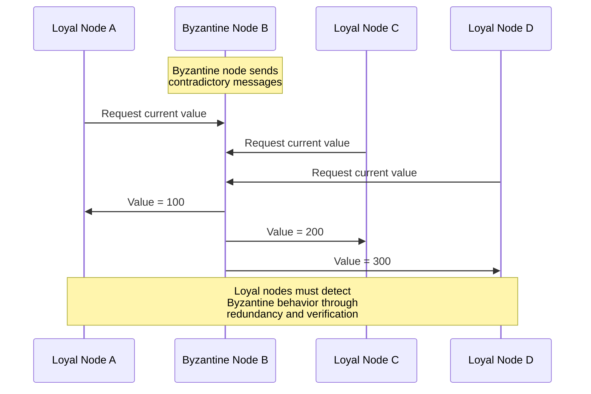
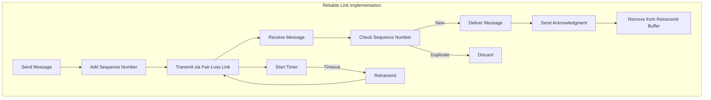
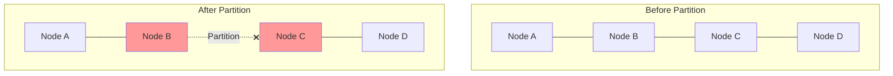

# System Models in Distributed Computing

## Introduction

System models provide the foundational framework for reasoning about distributed systems. Just as physicists use models to simplify complex phenomena and make them tractable for analysis, computer scientists use system models to abstract away irrelevant details and focus on the essential characteristics of distributed systems. These models allow us to prove properties about algorithms, understand their limitations, and make informed design decisions.

A system model defines the assumptions we make about how components behave, how they communicate, and what can go wrong. These assumptions profoundly impact what algorithms are possible and what guarantees we can provide. For instance, an algorithm that works correctly in a synchronous system with reliable communication might fail catastrophically in an asynchronous system with message losses.

Understanding system models is not merely an academic exercise. When building real distributed systems, you must understand which model best matches your deployment environment. A system running on servers within a single data center has very different characteristics from one spanning multiple continents. Network delays in a data center might be measured in microseconds, while cross-continental delays can be hundreds of milliseconds. These differences fundamentally change which algorithms are appropriate.

The three primary dimensions of system models are timing (synchronous vs. asynchronous), failure models (what can go wrong), and network models (how components communicate). Each dimension represents different assumptions and tradeoffs. By carefully choosing our model, we can design algorithms that are provably correct under our assumptions while being practical to implement.

## Synchronous vs Asynchronous Models

The distinction between synchronous and asynchronous models is perhaps the most fundamental divide in distributed systems theory. This distinction centers on what assumptions we can make about timing: how long operations take, how long messages take to be delivered, and how much faster or slower different components' clocks run.

### Synchronous Systems

In a synchronous system, we assume that there are known upper bounds on:

1. **Message delivery time**: Every message sent arrives within a known maximum time $\Delta$
2. **Processing time**: Each step of computation takes at most a known time
3. **Clock drift**: The difference between any two clocks is bounded by a known value

These assumptions might seem restrictive, but they enable powerful capabilities. With these timing guarantees, algorithms can use timeouts to reliably detect failures. If you send a message and don't receive a response within $2\Delta$ (the time for your message to arrive plus the time for the response to return), you can confidently conclude that the recipient has failed.

Real-world examples approximating synchronous systems include:

- **Hard real-time systems** in aerospace and automotive industries where missing deadlines could be catastrophic
- **Tightly coupled systems** within a single machine or rack with controlled network infrastructure
- **Circuit-switched networks** where bandwidth is reserved and guaranteed



The synchronous model enables elegant solutions to problems like consensus and leader election. For example, in a synchronous system, you can implement consensus in $f+1$ rounds where $f$ is the maximum number of failures, using a simple flooding algorithm where nodes repeatedly broadcast their values.

However, the synchronous model has significant limitations:

- **Impractical assumptions**: Most real networks don't have hard upper bounds on message delivery
- **Conservative timeouts**: To avoid false positives, you must set timeouts based on worst-case scenarios, which can make the system slow in common cases
- **Wasted resources**: Reserving resources to guarantee bounds can be inefficient

### Asynchronous Systems

The asynchronous model makes minimal assumptions about timing:

1. **No bounds on message delivery**: Messages eventually arrive but could take arbitrarily long
2. **No bounds on processing time**: Computation proceeds at arbitrary speeds
3. **No synchronized clocks**: Clocks can drift arbitrarily

The asynchronous model better reflects reality for most distributed systems. Internet-based systems, cloud computing environments, and wide-area networks all exhibit asynchronous characteristics. A message between data centers might typically take 50ms but could occasionally take seconds due to network congestion, routing changes, or other issues.

The asynchronous model has profound implications:

**Timeouts are unreliable**: If a message could take arbitrarily long, you can never be certain whether a node has failed or is just slow. This leads to the FLP impossibility result, which proves that deterministic consensus is impossible in an asynchronous system with even a single potential failure.

**Eventual delivery**: Algorithms must be designed around the guarantee that messages will "eventually" arrive, without knowing when "eventually" is.

**Causal ordering**: Without synchronized clocks, we must use logical mechanisms (like Lamport clocks or vector clocks) to establish ordering of events.

```mermaid
sequenceDiagram
    participant A as Node A
    participant B as Node B
    participant C as Node C
    Note over A,B,C: Asynchronous System
    A->>B: Message 1 (arrives in 10ms)
    A->>C: Message 2 (arrives in 200ms)
    Note over C: Message delayed due to<br/>network congestion
    B->>A: Response (arrives in 5ms)
    Note over A: Cannot determine if C failed<br/>or is just slow
    C->>A: Late response arrives
```

Real-world asynchronous systems include:

- **Internet applications**: Where network delays are unpredictable
- **Cloud environments**: Where virtual machines can be paused arbitrarily
- **Mobile systems**: Where connectivity can be intermittent
- **Geo-distributed systems**: Where latencies vary greatly

### Partially Synchronous Systems

Most real systems fall between fully synchronous and fully asynchronous. The **partially synchronous model** captures this reality by assuming:

1. **Bounds exist but are unknown**: There is a bound $\Delta$ on message delivery, but the algorithm doesn't know what it is
2. **Bounds hold eventually**: The system behaves asynchronously for some finite time, then becomes synchronous
3. **Adaptive timeouts**: Systems can adjust timeouts based on observed behavior

This model is more practical than pure synchrony while being more tractable than pure asynchrony. Many modern consensus algorithms like Raft and Paxos are designed for partially synchronous systems.

The partially synchronous model allows for:

- **Failure detection eventually**: Once the system stabilizes, you can detect failures
- **Progress guarantees**: The system makes progress once timing assumptions hold
- **Adaptive behavior**: Algorithms can adjust to observed network conditions

## Failure Models

Distributed systems must be designed with failures in mind. The failure model specifies what types of failures can occur and how components behave when they fail. Choosing the appropriate failure model involves balancing the strength of guarantees against the complexity and performance cost of achieving them.

### Crash Failures (Fail-Stop)

In the crash failure model, also known as fail-stop, nodes operate correctly until they crash. Once crashed, they stop executing and never recover. This is the simplest and most optimistic failure model.

**Characteristics**:
- Node stops responding to all requests
- Node loses all volatile state (memory)
- No incorrect or malicious behavior
- Failure is permanent (or node recovers with amnesia)

**Detection**: In synchronous systems, crash failures can be detected perfectly using timeouts. In asynchronous systems, crash failures cannot be reliably distinguished from slow nodes.

**Examples**:
- Power outage causing server shutdown
- Fatal software bug causing process termination
- Hardware failure rendering node inoperable



Many algorithms are designed for crash failures, including:
- Raft consensus (tolerates f failures with 2f+1 nodes)
- Primary-backup replication
- Gossip protocols

### Crash-Recovery Failures

A more realistic model than pure crash failures is the crash-recovery model, where nodes can crash and later recover, typically using stable storage to preserve critical state across crashes.

**Characteristics**:
- Nodes crash as before but can restart
- Stable storage (disk) persists data across crashes
- Recovery involves reading state from disk and rejoining the system
- Volatile memory is lost on crash

**Complexity**: This model introduces challenges:
- Detecting whether a node has crashed or just recovered
- Ensuring recovered nodes have consistent state
- Handling messages sent to crashed nodes

**Examples**:
- Database servers that persist transactions to disk
- State machine replication with write-ahead logging
- Systems using checkpointing for fault tolerance



### Omission Failures

Omission failures occur when a node fails to send or receive messages that it should have sent or received. This is more subtle than crash failures and can be harder to detect and handle.

**Types**:

1. **Send omission**: Node fails to send a message it was supposed to send
2. **Receive omission**: Node fails to receive a message sent to it
3. **General omission**: Either send or receive omissions

**Causes**:
- Network buffer overflow causing dropped packets
- Transient network failures
- Software bugs in network stack
- Operating system suspending process

**Challenges**:
- Difficult to distinguish from crash failures
- Can lead to inconsistent views of system state
- May be transient (node recovers)



### Byzantine Failures

Byzantine failures represent the most general and challenging failure model. In this model, nodes can behave arbitrarily: they might send contradictory information to different nodes, send corrupted data, or even collude with other faulty nodes to subvert the system.

The name comes from the **Byzantine Generals Problem**, a thought experiment where generals commanding different parts of an army must agree on a battle plan, but some generals might be traitors trying to prevent loyal generals from reaching agreement.

**Characteristics**:
- Nodes can send arbitrary messages
- Nodes can lie about their state
- Nodes can collude with other Byzantine nodes
- Nodes might be malicious or compromised

**Requirements for tolerance**:
- Need $3f + 1$ nodes to tolerate $f$ Byzantine failures
- All messages must be authenticated
- Protocols must verify consistency of information

**Examples**:
- Compromised servers running malicious code
- Hardware failures causing memory corruption
- Adversarial environments like blockchain systems
- Safety-critical systems where malicious behavior must be tolerated



Byzantine fault tolerance is essential for:

- **Blockchain systems**: Where participants may be adversarial
- **Safety-critical systems**: Where incorrect behavior could be catastrophic
- **Financial systems**: Where security is paramount
- **Multi-organization systems**: Where not all participants are trusted

Algorithms for Byzantine fault tolerance include:
- PBFT (Practical Byzantine Fault Tolerance)
- Bitcoin's proof-of-work consensus
- Tendermint consensus
- HotStuff

### Arbitrary Failures

Sometimes called the Byzantine failure model, but can also include non-malicious arbitrary behavior like memory corruption causing random behavior.

## Network Models

The network model specifies how nodes communicate, what guarantees the network provides, and what failures can occur during communication.

### Reliable Links

In the reliable links model, messages sent between correct (non-faulty) nodes are eventually delivered exactly once, without corruption, and in the order sent.

**Properties**:
- **Reliable delivery**: Messages from correct nodes are eventually delivered
- **No duplication**: Each message is delivered at most once
- **No corruption**: Messages arrive unmodified
- **FIFO ordering**: Messages are delivered in the order sent (optional)

This model simplifies algorithm design significantly but doesn't match reality for most networks. Real networks lose packets, can deliver duplicates (due to retransmissions), and can reorder messages.

**Implementation**: TCP provides an approximation of reliable links by:
- Detecting packet loss and retransmitting
- Detecting duplicates and filtering them
- Ensuring in-order delivery within a connection

### Fair-Loss Links

The fair-loss model is more realistic for unreliable networks like UDP:

**Properties**:
- **Fair loss**: If sender sends infinitely many messages, infinitely many are delivered
- **Finite duplication**: Messages can be duplicated but only finitely many times
- **No creation**: Messages aren't created out of thin air

This model captures the behavior of unreliable networks while preventing pathological cases like messages being lost forever or duplicated infinitely.

**Building reliability**: Reliable links can be implemented on top of fair-loss links using:
- Sequence numbers to detect duplicates
- Acknowledgments and retransmissions to ensure delivery
- Timeouts to detect lost messages



### Authenticated Links

In authenticated links, receivers can verify that messages actually came from the claimed sender. This is crucial for Byzantine fault tolerance.

**Properties**:
- Messages cannot be forged
- Receivers can verify sender identity
- Messages cannot be modified in transit without detection

**Implementation**:
- Digital signatures using public-key cryptography
- Message Authentication Codes (MACs) with shared keys
- TLS/SSL for encrypted, authenticated connections

### Network Partitions

A network partition occurs when the network splits into two or more groups that cannot communicate with each other. This is a fundamental challenge in distributed systems.

**Characteristics**:
- Nodes within a partition can communicate
- Nodes in different partitions cannot communicate
- Partitions may be temporary and heal
- Cannot distinguish from widespread failures



**Implications**:
- CAP theorem: Cannot have both consistency and availability during partitions
- Systems must choose how to handle partitions
- Partition detection is challenging in asynchronous systems

**Strategies**:
- **Sacrifice availability**: Stop serving requests to maintain consistency
- **Sacrifice consistency**: Continue serving requests but accept inconsistency
- **Partition-aware**: Different behavior during partitions (e.g., read-only mode)

## Timing Assumptions and Their Impact

The timing assumptions in a system model fundamentally determine what algorithms are possible and what guarantees can be provided.

### Impact on Failure Detection

**Synchronous systems**: Perfect failure detection is possible. If a response doesn't arrive within $2\Delta$, the node has definitely crashed.

**Asynchronous systems**: Perfect failure detection is impossible. You can have:
- **Completeness**: Eventually suspect all crashed nodes
- **Accuracy**: Never suspect correct nodes

But you cannot have both properties simultaneously. This leads to the concept of unreliable failure detectors.

### Impact on Consensus

**Synchronous systems**: Consensus is solvable in $f+1$ rounds where $f$ is the number of failures.

**Asynchronous systems**: The FLP impossibility result proves that deterministic consensus is impossible with even one potential failure.

**Partially synchronous systems**: Consensus is possible but may not always terminate. Algorithms like Paxos and Raft work in this model.

### Impact on Performance

**Synchronous assumptions** enable:
- Predictable latency bounds
- Efficient resource utilization in best case
- Simple timeout-based protocols

But require:
- Conservative timeout values based on worst case
- Possibly wasted resources to guarantee bounds

**Asynchronous assumptions** enable:
- Better average-case performance
- Adapting to actual network conditions
- Working across diverse environments

But require:
- More complex algorithms
- Accepting occasional slow operations
- Sophisticated failure detection

## Choosing the Right Model

Selecting the appropriate system model for your distributed system involves understanding your requirements, environment, and the tradeoffs involved.

### Questions to Consider

1. **What is your deployment environment?**
   - Single data center vs. geo-distributed
   - Controlled network vs. internet
   - Homogeneous vs. heterogeneous hardware

2. **What are your consistency requirements?**
   - Strong consistency (linearizability)
   - Eventual consistency
   - Causal consistency

3. **What are your availability requirements?**
   - Can you sacrifice availability for consistency?
   - Need to serve requests during partitions?
   - Acceptable downtime?

4. **What failures must you tolerate?**
   - Only crash failures?
   - Malicious actors (Byzantine)?
   - Network partitions?

5. **What are your performance requirements?**
   - Latency requirements
   - Throughput requirements
   - Acceptable overhead for fault tolerance

### Practical Recommendations

**For systems within a data center**:
- Use partially synchronous model
- Assume crash-recovery failures
- Use reliable links (TCP)
- Expect rare partitions

**For geo-distributed systems**:
- Use asynchronous model
- Plan for partitions
- Accept eventual consistency in many cases
- Use techniques like CRDTs or conflict resolution

**For blockchain/cryptocurrency**:
- Use asynchronous model
- Assume Byzantine failures
- Need strong consistency
- Accept high overhead for Byzantine fault tolerance

**For most web applications**:
- Use partially synchronous model
- Assume crash-recovery failures
- Design for partition tolerance
- Choose consistency vs. availability based on operation

## Summary

System models provide the foundation for reasoning about distributed systems. They define the rules of the game: what we can assume about timing, what can go wrong, and how components communicate.

Key takeaways:

- **Synchronous systems** provide timing guarantees enabling simple failure detection and consensus, but the assumptions rarely hold in practice
- **Asynchronous systems** make minimal timing assumptions matching most real systems, but make many problems (like consensus) much harder or impossible
- **Partially synchronous systems** balance practicality with tractability, enabling algorithms like Paxos and Raft
- **Failure models** range from simple crash failures to Byzantine failures, with more general models requiring more complex and expensive solutions
- **Network models** define communication guarantees, from reliable FIFO links to fair-loss links with partitions
- **The right model** depends on your specific requirements, environment, and the tradeoffs you're willing to make

Understanding these models is essential for:
- Evaluating whether an algorithm fits your environment
- Understanding the assumptions your system relies on
- Designing systems that are provably correct
- Making informed tradeoffs between consistency, availability, and performance

The models we've discussed form the vocabulary for the rest of our study of distributed systems. When we examine consensus algorithms, replication strategies, and consistency models, we'll always be working within a specific system model with specific assumptions and guarantees.
