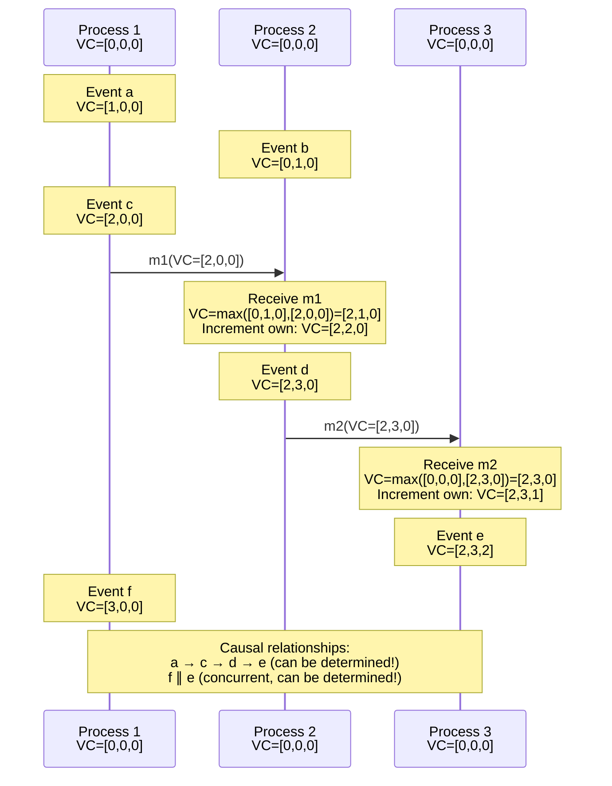

# Vector Clocks

## Introduction

Vector clocks extend Lamport's logical clocks to capture not just the total ordering of events, but the complete causal structure of a distributed system. While Lamport clocks can tell us that if event $a$ happened before event $b$, then $C(a) < C(b)$, they cannot tell us when events are concurrent. Vector clocks solve this fundamental limitation.

The key insight behind vector clocks is elegantly simple: instead of maintaining a single counter, each process maintains a vector of counters - one for each process in the system. When a process executes an event, it increments its own counter in the vector. When it sends a message, it includes its entire vector. When it receives a message, it takes the element-wise maximum of its vector and the received vector, then increments its own counter.

This seemingly small change from a single integer to a vector of integers has profound implications. With vector clocks, we can determine for any two events whether one happened before the other or whether they are concurrent. This ability to detect concurrency is crucial for many distributed systems problems, from conflict detection in replicated databases to causal consistency in distributed storage systems to debugging distributed applications.

Vector clocks have been independently discovered multiple times and are used in production systems including Amazon's Dynamo, Apache Cassandra, Riak, and Volk. They represent the gold standard for tracking causality in distributed systems, though at the cost of increased overhead compared to Lamport clocks.

## The Algorithm

### Vector Clock Rules

Each process $P_i$ maintains a vector clock $VC_i[1..n]$ where $n$ is the number of processes. The vector is updated according to these rules:

**Initialization**: $VC_i[j] = 0$ for all $j \in \{1, ..., n\}$

**Rule 1 (Local events)**: Before executing an event, process $P_i$ increments its own counter:
$$VC_i[i] := VC_i[i] + 1$$

**Rule 2 (Sending messages)**: When process $P_i$ sends message $m$, it includes its current vector:
$$timestamp(m) = VC_i$$

**Rule 3 (Receiving messages)**: When process $P_i$ receives message $m$ with timestamp $VC_m$:
$$VC_i[j] := max(VC_i[j], VC_m[j]) \text{ for all } j$$
$$VC_i[i] := VC_i[i] + 1$$



### Basic Implementation

```python
class VectorClock:
    def __init__(self, process_id, num_processes):
        self.process_id = process_id
        self.num_processes = num_processes
        self.clock = [0] * num_processes

    def increment(self):
        """Increment own counter for local event"""
        self.clock[self.process_id] += 1
        return self.copy()

    def send_event(self):
        """Get vector for sending message"""
        self.clock[self.process_id] += 1
        return self.copy()

    def receive_event(self, received_clock):
        """Update clock on receiving message"""
        # Element-wise maximum
        for i in range(self.num_processes):
            self.clock[i] = max(self.clock[i], received_clock[i])

        # Increment own counter
        self.clock[self.process_id] += 1
        return self.copy()

    def copy(self):
        """Return copy of current clock"""
        return self.clock[:]

    def __repr__(self):
        return f"VC{self.clock}"

# Example usage with 3 processes
p1 = VectorClock(0, 3)  # Process 0
p2 = VectorClock(1, 3)  # Process 1
p3 = VectorClock(2, 3)  # Process 2

# Process 1: Local events
print(f"P1 event a: {p1.increment()}")  # [1,0,0]
print(f"P1 event c: {p1.increment()}")  # [2,0,0]

# Process 1: Send message
send_clock = p1.send_event()
print(f"P1 send: {send_clock}")  # [3,0,0]

# Process 2: Receive message
recv_clock = p2.receive_event(send_clock)
print(f"P2 receive: {recv_clock}")  # [3,1,0]

# Process 2: Local event
print(f"P2 event d: {p2.increment()}")  # [3,2,0]
```

## Comparing Vector Clocks

The power of vector clocks lies in their ability to determine the relationship between any two events.

### Happens-Before Relation

For vector clocks $VC_a$ and $VC_b$:

**$VC_a < VC_b$** (a happened before b) if and only if:
- $VC_a[i] \leq VC_b[i]$ for all $i$, **AND**
- $VC_a[j] < VC_b[j]$ for at least one $j$

**$VC_a = VC_b$** (same event) if and only if:
- $VC_a[i] = VC_b[i]$ for all $i$

**$VC_a \parallel VC_b$** (concurrent) if and only if:
- $VC_a \not< VC_b$ **AND** $VC_b \not< VC_a$

```python
def happens_before(vc_a, vc_b):
    """Check if vc_a happened before vc_b"""
    # All elements of vc_a <= corresponding elements of vc_b
    all_less_equal = all(vc_a[i] <= vc_b[i] for i in range(len(vc_a)))

    # At least one element strictly less
    some_strictly_less = any(vc_a[i] < vc_b[i] for i in range(len(vc_a)))

    return all_less_equal and some_strictly_less

def are_concurrent(vc_a, vc_b):
    """Check if events are concurrent"""
    return not happens_before(vc_a, vc_b) and not happens_before(vc_b, vc_a)

def are_equal(vc_a, vc_b):
    """Check if vector clocks are equal"""
    return all(vc_a[i] == vc_b[i] for i in range(len(vc_a)))

# Examples
vc1 = [2, 3, 0]
vc2 = [4, 5, 1]
vc3 = [2, 1, 4]

print(f"VC{vc1} < VC{vc2}: {happens_before(vc1, vc2)}")  # True
print(f"VC{vc1} ∥ VC{vc3}: {are_concurrent(vc1, vc3)}")  # True
```

### Examples of Comparisons

```python
# Example 1: Causal relationship
a = [1, 0, 0]  # Event a on P1
b = [1, 1, 0]  # Event b on P2 after receiving from P1

print(f"a→b: {happens_before(a, b)}")  # True
# a[0]=1 ≤ b[0]=1, a[1]=0 < b[1]=1, a[2]=0 ≤ b[2]=0
# All ≤ and some <, therefore a→b

# Example 2: Concurrent events
c = [2, 0, 0]  # Event c on P1
d = [0, 2, 0]  # Event d on P2 (no communication)

print(f"c∥d: {are_concurrent(c, d)}")  # True
# c[0]=2 > d[0]=0 (c not ≤ d)
# d[1]=2 > c[1]=0 (d not ≤ c)
# Therefore c∥d

# Example 3: Causality chain
e = [1, 0, 0]
f = [2, 1, 0]  # After e→f communication
g = [2, 1, 1]  # After f→g communication

print(f"e→f: {happens_before(e, f)}")  # True
print(f"f→g: {happens_before(f, g)}")  # True
print(f"e→g: {happens_before(e, g)}")  # True (transitive)
```

## Complete Implementation

### VectorClock Class with Comparison

```python
class VectorClock:
    def __init__(self, process_id, num_processes):
        self.process_id = process_id
        self.num_processes = num_processes
        self.clock = [0] * num_processes

    def increment(self):
        """Increment for local event"""
        self.clock[self.process_id] += 1
        return self.copy()

    def send_event(self):
        """Increment and return clock for sending"""
        self.clock[self.process_id] += 1
        return self.copy()

    def receive_event(self, received_clock):
        """Update on message receive"""
        for i in range(self.num_processes):
            self.clock[i] = max(self.clock[i], received_clock[i])
        self.clock[self.process_id] += 1
        return self.copy()

    def copy(self):
        """Return copy of clock"""
        return self.clock[:]

    def __lt__(self, other):
        """Happens-before: self < other"""
        if isinstance(other, VectorClock):
            other = other.clock

        all_less_equal = all(self.clock[i] <= other[i]
                            for i in range(self.num_processes))
        some_strictly_less = any(self.clock[i] < other[i]
                                for i in range(self.num_processes))

        return all_less_equal and some_strictly_less

    def __eq__(self, other):
        """Equality check"""
        if isinstance(other, VectorClock):
            other = other.clock
        return all(self.clock[i] == other[i]
                  for i in range(self.num_processes))

    def is_concurrent(self, other):
        """Check if concurrent"""
        if isinstance(other, VectorClock):
            other = other.clock

        return (not self < other) and (not other < self)

    def __repr__(self):
        return f"VC{self.clock}"

# Example: Detecting concurrency
p1 = VectorClock(0, 2)
p2 = VectorClock(1, 2)

# Concurrent events
p1.increment()  # P1: [1,0]
p2.increment()  # P2: [0,1]

vc1 = VectorClock(0, 2)
vc1.clock = [1, 0]

vc2 = VectorClock(1, 2)
vc2.clock = [0, 1]

print(f"{vc1} ∥ {vc2}: {vc1.is_concurrent(vc2)}")  # True
```

### Process with Vector Clock

```python
import socket
import threading
import pickle
import time

class VectorClockProcess:
    def __init__(self, process_id, num_processes, port):
        self.id = process_id
        self.num_processes = num_processes
        self.port = port
        self.vc = VectorClock(process_id, num_processes)
        self.events = []
        self.running = True

    def local_event(self, event_name):
        """Execute local event"""
        clock = self.vc.increment()
        event = {
            'type': 'local',
            'name': event_name,
            'clock': clock,
            'process': self.id
        }
        self.events.append(event)
        self.log_event(event)
        return clock

    def send_message(self, dest_port, message):
        """Send message with vector clock"""
        clock = self.vc.send_event()

        msg = {
            'from': self.id,
            'data': message,
            'clock': clock
        }

        event = {
            'type': 'send',
            'name': f"send to port {dest_port}",
            'message': message,
            'clock': clock,
            'process': self.id
        }
        self.events.append(event)
        self.log_event(event)

        # Send via network
        sock = socket.socket(socket.AF_INET, socket.SOCK_DGRAM)
        sock.sendto(pickle.dumps(msg), ('localhost', dest_port))
        sock.close()

    def receive_loop(self):
        """Listen for messages"""
        sock = socket.socket(socket.AF_INET, socket.SOCK_DGRAM)
        sock.bind(('localhost', self.port))
        sock.settimeout(1.0)

        while self.running:
            try:
                data, addr = sock.recvfrom(4096)
                msg = pickle.loads(data)

                # Update vector clock
                clock = self.vc.receive_event(msg['clock'])

                event = {
                    'type': 'receive',
                    'name': f"receive from P{msg['from']}",
                    'message': msg['data'],
                    'clock': clock,
                    'process': self.id,
                    'from': msg['from']
                }
                self.events.append(event)
                self.log_event(event)

            except socket.timeout:
                continue
            except Exception as e:
                print(f"Error: {e}")

        sock.close()

    def log_event(self, event):
        """Log event with vector clock"""
        print(f"[P{self.id}][VC{event['clock']}] {event['type']}: {event['name']}")

    def start(self):
        """Start receiving"""
        thread = threading.Thread(target=self.receive_loop, daemon=True)
        thread.start()

    def stop(self):
        """Stop process"""
        self.running = False

    def analyze_causality(self):
        """Analyze causal relationships between events"""
        print(f"\n=== Causality Analysis for P{self.id} ===")
        for i, event_a in enumerate(self.events):
            for j, event_b in enumerate(self.events):
                if i < j:
                    vc_a = event_a['clock']
                    vc_b = event_b['clock']

                    if happens_before(vc_a, vc_b):
                        print(f"{event_a['name']} → {event_b['name']}")
                    elif are_concurrent(vc_a, vc_b):
                        print(f"{event_a['name']} ∥ {event_b['name']}")

# Example usage
if __name__ == "__main__":
    # Create 3 processes
    p1 = VectorClockProcess(0, 3, 6001)
    p2 = VectorClockProcess(1, 3, 6002)
    p3 = VectorClockProcess(2, 3, 6003)

    # Start all
    p1.start()
    p2.start()
    p3.start()

    time.sleep(0.1)

    # Execute events
    p1.local_event("init")
    p1.send_message(6002, "hello")

    time.sleep(0.1)

    p2.local_event("process")
    p2.send_message(6003, "data")

    time.sleep(0.1)

    p3.local_event("finalize")

    time.sleep(0.5)

    # Analyze causality
    p1.analyze_causality()
    p2.analyze_causality()
    p3.analyze_causality()

    # Stop all
    p1.stop()
    p2.stop()
    p3.stop()
```

## Properties and Correctness

### Fundamental Property

**Theorem**: For any events $a$ and $b$:
$$a \rightarrow b \iff VC(a) < VC(b)$$

This is the key property that makes vector clocks so powerful - they exactly capture the happened-before relation.

**Proof sketch**:

**Forward direction** ($a \rightarrow b \Rightarrow VC(a) < VC(b)$):
Proof by induction on happened-before relation (similar to Lamport clocks, but preserves full causality).

**Reverse direction** ($VC(a) < VC(b) \Rightarrow a \rightarrow b$):
If $VC(a) < VC(b)$, then every counter in $VC(a)$ is ≤ corresponding counter in $VC(b)$, with at least one strictly less. This means $b$'s process has "seen" all events that $a$ has seen, plus additional events. Therefore, there must be a causal path from $a$ to $b$.

### Concurrency Detection

**Corollary**: Events $a$ and $b$ are concurrent if and only if:
$$VC(a) \not< VC(b) \text{ and } VC(b) \not< VC(a)$$

This is the key advantage over Lamport clocks.

```python
# Example: Detecting conflicts in replicated database

class ReplicatedDatabase:
    def __init__(self, replica_id, num_replicas):
        self.replica_id = replica_id
        self.vc = VectorClock(replica_id, num_replicas)
        self.data = {}

    def write(self, key, value):
        """Write with vector clock"""
        clock = self.vc.increment()
        self.data[key] = {'value': value, 'clock': clock}
        return clock

    def merge(self, key, remote_value, remote_clock):
        """Merge remote write"""
        self.vc.receive_event(remote_clock)

        if key not in self.data:
            # No conflict, accept write
            self.data[key] = {'value': remote_value, 'clock': remote_clock}
            return "accepted"

        local_clock = self.data[key]['clock']

        if happens_before(remote_clock, local_clock):
            # Remote write is older, discard
            return "rejected (stale)"

        elif happens_before(local_clock, remote_clock):
            # Remote write is newer, accept
            self.data[key] = {'value': remote_value, 'clock': remote_clock}
            return "accepted (newer)"

        else:
            # Concurrent writes - conflict!
            return "conflict"

# Example: Conflict detection
db1 = ReplicatedDatabase(0, 2)
db2 = ReplicatedDatabase(1, 2)

# Concurrent writes
db1.write('x', 'value1')  # VC=[1,0]
db2.write('x', 'value2')  # VC=[0,1]

# Try to merge - detects conflict!
result = db1.merge('x', 'value2', [0, 1])
print(f"Merge result: {result}")  # "conflict"
```

## Comparison with Lamport Clocks

### Key Differences

| Aspect | Lamport Clocks | Vector Clocks |
|--------|----------------|---------------|
| **Clock size** | 1 integer | N integers (N = # processes) |
| **Storage overhead** | O(1) | O(N) |
| **Message overhead** | O(1) | O(N) |
| **Can detect concurrency** | No | Yes |
| **Ordering** | Total order | Partial order |
| **Causality** | One direction only | Bidirectional |
| **$a \rightarrow b \Rightarrow C(a) < C(b)$** | ✓ | ✓ |
| **$C(a) < C(b) \Rightarrow a \rightarrow b$** | ✗ | ✓ |

### When to Use Each

**Use Lamport clocks when**:
- Need total ordering
- Don't need concurrency detection
- Want minimal overhead
- Number of processes is large
- Examples: Distributed mutual exclusion, timestamp ordering

**Use vector clocks when**:
- Need to detect concurrent events
- Need to preserve causality
- Conflict resolution required
- Number of processes is manageable (< 100s)
- Examples: Replicated databases, version control, causally consistent storage

### Example: Same Scenario

```python
# Lamport clocks
lc1 = LamportClock()
lc2 = LamportClock()

# Concurrent events
t1 = lc1.increment()  # t1 = 1
t2 = lc2.increment()  # t2 = 1

# Cannot detect concurrency: t1 == t2, could be same event or concurrent
print(f"Lamport: Can't determine if concurrent")

# Vector clocks
vc1 = VectorClock(0, 2)
vc2 = VectorClock(1, 2)

# Concurrent events
v1 = vc1.increment()  # [1,0]
v2 = vc2.increment()  # [0,1]

# Can detect concurrency
print(f"Vector: Concurrent = {are_concurrent(v1, v2)}")  # True
```

## Practical Applications

### Replicated Databases

Vector clocks are used in many distributed databases to detect conflicts:

**Amazon Dynamo, Riak, Voldemort**:
```python
class DynamoStyle:
    def __init__(self, node_id, num_nodes):
        self.node_id = node_id
        self.vc = VectorClock(node_id, num_nodes)
        self.versions = {}  # key -> list of (value, vector_clock)

    def put(self, key, value):
        """Write new version"""
        clock = self.vc.increment()
        if key not in self.versions:
            self.versions[key] = []

        # Remove obsolete versions (causally dominated)
        self.versions[key] = [
            (v, vc) for v, vc in self.versions[key]
            if not happens_before(vc, clock)
        ]

        # Add new version
        self.versions[key].append((value, clock))
        return clock

    def get(self, key):
        """Get all concurrent versions"""
        if key not in self.versions:
            return []

        # Return all concurrent versions (siblings)
        return self.versions[key]

    def resolve_conflicts(self, key, resolved_value):
        """Application resolves conflicts"""
        # Get all concurrent versions
        versions = self.get(key)

        # Merge vector clocks
        merged_clock = [0] * self.vc.num_processes
        for _, vc in versions:
            for i in range(len(merged_clock)):
                merged_clock[i] = max(merged_clock[i], vc[i])

        # Update with resolved value
        self.vc.clock = merged_clock
        clock = self.vc.increment()
        self.versions[key] = [(resolved_value, clock)]
```

### Causal Consistency

Ensuring causally related operations are seen in order:

```python
class CausalStore:
    def __init__(self, replica_id, num_replicas):
        self.replica_id = replica_id
        self.vc = VectorClock(replica_id, num_replicas)
        self.data = {}
        self.pending = []  # Buffer for causality violations

    def write(self, key, value):
        """Local write"""
        clock = self.vc.increment()
        self.data[key] = (value, clock)
        return clock

    def apply_remote_write(self, key, value, remote_clock, deps):
        """Apply write from another replica"""
        # Check if dependencies satisfied
        if not self.dependencies_satisfied(deps):
            # Buffer until dependencies arrive
            self.pending.append((key, value, remote_clock, deps))
            return "buffered"

        # Dependencies satisfied, apply write
        self.vc.receive_event(remote_clock)
        self.data[key] = (value, remote_clock)

        # Try to apply buffered writes
        self.apply_pending()

        return "applied"

    def dependencies_satisfied(self, deps):
        """Check if all dependencies are in local store"""
        for dep_key, dep_clock in deps:
            if dep_key not in self.data:
                return False
            local_value, local_clock = self.data[dep_key]
            if not happens_before(dep_clock, local_clock) and dep_clock != local_clock:
                return False
        return True

    def apply_pending(self):
        """Apply pending writes whose dependencies are now satisfied"""
        applied_any = True
        while applied_any:
            applied_any = False
            for item in self.pending[:]:
                key, value, remote_clock, deps = item
                if self.dependencies_satisfied(deps):
                    self.pending.remove(item)
                    self.vc.receive_event(remote_clock)
                    self.data[key] = (value, remote_clock)
                    applied_any = True
```

### Version Control Systems

Vector clocks help track file versions:

```python
class DistributedVCS:
    def __init__(self, user_id, num_users):
        self.user_id = user_id
        self.vc = VectorClock(user_id, num_users)
        self.versions = {}  # file -> (content, vector_clock)

    def commit(self, filename, content):
        """Commit new version"""
        clock = self.vc.increment()
        self.versions[filename] = (content, clock)
        return clock

    def merge(self, filename, remote_content, remote_clock):
        """Merge remote version"""
        if filename not in self.versions:
            # No local version, accept remote
            self.vc.receive_event(remote_clock)
            self.versions[filename] = (remote_content, remote_clock)
            return "accepted"

        local_content, local_clock = self.versions[filename]

        if happens_before(remote_clock, local_clock):
            # Remote is older, keep local
            return "keep_local"

        elif happens_before(local_clock, remote_clock):
            # Remote is newer, accept
            self.vc.receive_event(remote_clock)
            self.versions[filename] = (remote_content, remote_clock)
            return "accept_remote"

        else:
            # Concurrent edits - requires manual merge
            return "conflict_merge_required"
```

## Optimizations

### Vector Clock Size Optimization

For systems with many processes, vector clocks can become large. Optimizations:

**1. Sparse Vector Clocks**: Only include non-zero entries
```python
class SparseVectorClock:
    def __init__(self, process_id):
        self.process_id = process_id
        self.clock = {process_id: 0}  # Only store non-zero entries

    def increment(self):
        """Increment own counter"""
        self.clock[self.process_id] = self.clock.get(self.process_id, 0) + 1
        return dict(self.clock)

    def receive_event(self, received_clock):
        """Merge with received clock"""
        for process_id, count in received_clock.items():
            self.clock[process_id] = max(
                self.clock.get(process_id, 0),
                count
            )
        self.clock[self.process_id] = self.clock.get(self.process_id, 0) + 1
        return dict(self.clock)

    def __repr__(self):
        return f"SVC{dict(self.clock)}"
```

**2. Dynamic Vector Clocks**: Grow size as new processes join
**3. Version Vectors**: Only track processes that have updated an object
**4. Dotted Version Vectors**: More compact representation for replicated data

## Summary

Vector clocks extend Lamport clocks to capture complete causal structure, enabling detection of concurrent events.

Key takeaways:

- **Vector clocks** maintain a vector of counters, one per process
- **Exact causality**: $a \rightarrow b \iff VC(a) < VC(b)$ (bidirectional)
- **Concurrency detection**: Can determine if events are concurrent
- **Overhead**: O(N) storage and message overhead where N is number of processes
- **Applications**: Replicated databases, version control, causal consistency, conflict detection
- **Tradeoffs**: More powerful than Lamport clocks but higher overhead

Use vector clocks when:
- Need to detect concurrent events
- Building replicated databases with conflict detection
- Implementing causal consistency
- Number of processes is manageable

Vector clocks are the gold standard for causality tracking in distributed systems, powering production systems like Dynamo, Cassandra, and Riak.
