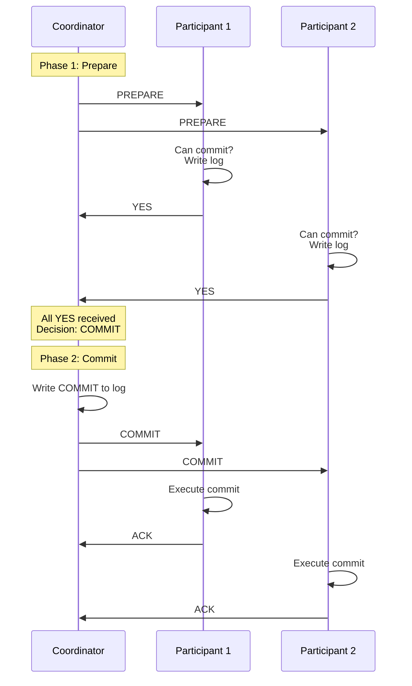

# Two-Phase Commit Protocol

## Introduction

Two-Phase Commit (2PC) is the most widely used protocol for implementing atomic commitment in distributed databases. It ensures that a distributed transaction either commits on all nodes or aborts on all nodes - never leaving the system in an inconsistent state where some nodes committed and others aborted.

The protocol is called "two-phase" because it operates in two distinct phases: a voting phase where participants indicate whether they can commit, and a decision phase where the coordinator makes and distributes the final decision. This simple structure ensures atomicity but at the cost of potential blocking.

## The Protocol

**Phase 1: Voting (Prepare)**
1. Coordinator sends PREPARE to all participants
2. Participants:
   - If can commit: write to log, send YES
   - If cannot commit: send NO

**Phase 2: Decision (Commit/Abort)**
1. Coordinator:
   - If all YES: send COMMIT
   - If any NO: send ABORT
2. Participants execute decision and acknowledge



## Implementation

```python
class TwoPhaseCommitCoordinator:
    def __init__(self, participants):
        self.participants = participants
        self.transaction_id = None

    def execute_transaction(self, operations):
        """Execute distributed transaction with 2PC"""
        self.transaction_id = generate_transaction_id()

        # Phase 1: Prepare
        votes = self.prepare_phase(operations)

        # Make decision
        decision = 'COMMIT' if all(votes) else 'ABORT'

        # Write decision to log (crucial for recovery)
        self.write_to_log(f"DECISION: {decision}")

        # Phase 2: Commit/Abort
        self.decision_phase(decision)

        return decision == 'COMMIT'

    def prepare_phase(self, operations):
        """Phase 1: Send prepare, collect votes"""
        votes = []

        for participant in self.participants:
            try:
                # Send operations to participant
                response = participant.prepare(self.transaction_id, operations)
                votes.append(response == 'YES')

                # Log vote
                self.write_to_log(f"VOTE from {participant.id}: {response}")

            except Timeout:
                # Participant failed to respond - treat as NO
                votes.append(False)
                self.write_to_log(f"TIMEOUT from {participant.id}")

        return votes

    def decision_phase(self, decision):
        """Phase 2: Send decision to all participants"""
        for participant in self.participants:
            try:
                participant.decide(self.transaction_id, decision)
                # Wait for acknowledgment
                ack = participant.wait_for_ack()

            except Timeout:
                # Retry or log for manual recovery
                self.handle_participant_failure(participant, decision)

class TwoPhaseCommitParticipant:
    def __init__(self, participant_id):
        self.id = participant_id
        self.prepared_transactions = {}

    def prepare(self, transaction_id, operations):
        """Phase 1: Prepare to commit"""
        try:
            # Validate operations
            if not self.can_commit(operations):
                self.write_to_log(f"{transaction_id}: VOTE NO")
                return 'NO'

            # Acquire locks, validate constraints
            self.acquire_locks(operations)
            self.validate_operations(operations)

            # Write to log (for recovery)
            self.write_to_log(f"{transaction_id}: PREPARED")

            # Save state for phase 2
            self.prepared_transactions[transaction_id] = operations

            self.write_to_log(f"{transaction_id}: VOTE YES")
            return 'YES'

        except Exception as e:
            self.write_to_log(f"{transaction_id}: ERROR - {e}")
            return 'NO'

    def decide(self, transaction_id, decision):
        """Phase 2: Commit or abort"""
        if decision == 'COMMIT':
            # Execute operations
            operations = self.prepared_transactions[transaction_id]
            self.execute_operations(operations)

            self.write_to_log(f"{transaction_id}: COMMITTED")

        else:  # ABORT
            # Rollback
            if transaction_id in self.prepared_transactions:
                self.rollback(transaction_id)

            self.write_to_log(f"{transaction_id}: ABORTED")

        # Release locks
        self.release_locks(transaction_id)

        # Clean up
        del self.prepared_transactions[transaction_id]

        return 'ACK'
```

## The Blocking Problem

**Critical issue**: Participant blocks if coordinator fails after PREPARE phase

```python
# Participant blocks waiting for decision
def prepare_and_wait(self, tx_id):
    # Phase 1: Vote YES
    self.vote_yes(tx_id)

    # COORDINATOR CRASHES HERE!

    # Phase 2: Wait for decision... forever!
    while True:
        decision = self.wait_for_decision(tx_id)
        # Blocks indefinitely if coordinator dead
        # Cannot commit (might violate atomicity)
        # Cannot abort (coordinator might commit)
        # BLOCKED!
```

**Why blocking is a problem**:
- Holds locks indefinitely
- Prevents other transactions from proceeding
- Reduces availability
- Requires manual intervention

## Recovery Procedures

**Coordinator recovery**:

```python
def coordinator_recovery(self):
    """Recover coordinator after crash"""
    # Read log to determine state
    log_entry = self.read_last_log_entry()

    if log_entry.startswith('DECISION'):
        # Decision made - resend to participants
        decision = log_entry.split(': ')[1]
        self.resend_decision(decision)

    else:
        # No decision made - can safely ABORT
        self.decision_phase('ABORT')
```

**Participant recovery**:

```python
def participant_recovery(self):
    """Recover participant after crash"""
    # Read log
    log_entry = self.read_last_log_entry()

    if 'COMMITTED' in log_entry:
        # Already committed - done
        return

    elif 'ABORTED' in log_entry:
        # Already aborted - done  
        return

    elif 'PREPARED' in log_entry:
        # Voted YES but no decision yet
        # Contact coordinator or other participants
        decision = self.request_decision_from_coordinator()

        if decision:
            self.decide(transaction_id, decision)
        else:
            # Coordinator unavailable - BLOCKED
            self.wait_or_timeout()

    else:
        # No prepare - can safely abort
        self.abort()
```

## Optimizations

**Presumed Abort**: Assume abort if no decision logged (reduces logging)

**Read-Only Optimization**: Read-only participants skip phase 2

**Early Prepare**: Prepare during transaction execution

## Practical Usage

**Distributed Databases**:
- MySQL Cluster
- PostgreSQL distributed transactions
- Oracle distributed transactions

```sql
-- XA transaction example
XA START 'transaction1';
UPDATE accounts SET balance = balance - 100 WHERE id = 1;
XA END 'transaction1';
XA PREPARE 'transaction1';  -- Phase 1
XA COMMIT 'transaction1';   -- Phase 2
```

## Summary

Two-Phase Commit ensures atomic commitment across distributed nodes.

**Advantages**:
- Simple protocol
- Guarantees atomicity
- Widely implemented

**Disadvantages**:
- Blocking if coordinator fails
- High latency (2 rounds of messages)
- Not partition-tolerant

**Key insight**: 2PC sacrifices availability for consistency - exactly what CAP theorem predicts for CP systems.

Modern systems often prefer eventual consistency or use 3PC/Paxos/Raft for better availability.
