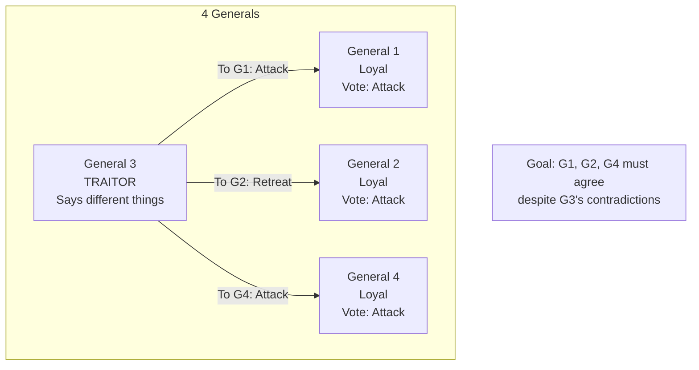

# Byzantine Fault Tolerance

## Introduction

Byzantine Fault Tolerance (BFT) addresses the most challenging failure model in distributed systems: Byzantine failures, where nodes can behave arbitrarily, including maliciously. Unlike crash failures where nodes simply stop, Byzantine failures allow nodes to send contradictory messages, collude with other faulty nodes, or actively try to subvert the system.

The problem is named after the Byzantine Generals Problem, a thought experiment where generals commanding different parts of an army must agree on a battle plan, but some generals might be traitors trying to prevent loyal generals from reaching agreement.

BFT is essential for systems where nodes cannot be trusted: blockchain systems, multi-organization systems, safety-critical systems, and any system facing potential adversaries.

## Byzantine Generals Problem

**Scenario**: $n$ generals surround a city. They must agree to attack or retreat. Some generals might be traitors.

**Requirements**:
1. All loyal generals decide on same plan
2. Small number of traitors cannot cause loyal generals to adopt bad plan



**Impossibility Result**: Cannot solve with 3 or fewer generals if 1 is traitor
**General Result**: Need $n \geq 3f + 1$ nodes to tolerate $f$ Byzantine failures

## Why 3f+1 Nodes?

**Intuition**:
- $f$ nodes can be faulty
- Need $f+1$ honest nodes to form majority against faulty ones
- Need another $f$ nodes to ensure we can reach $f+1$ honest ones even if $f$ nodes are unreachable
- Total: $f + (f+1) + f = 3f + 1$

```python
# Example with f=1
# Need n >= 3(1) + 1 = 4 nodes
# If 1 is Byzantine:
# - 3 honest nodes remain
# - 2 honest nodes can form majority (> 1)
# - Even if 1 node unreachable, still have 2 honest nodes

# With only 3 nodes and f=1:
# - 2 honest, 1 Byzantine
# - Cannot distinguish which 2 are honest
# - Byzantine can create split by sending different messages
```

## Practical Byzantine Fault Tolerance (PBFT)

PBFT, developed by Castro and Liskov in 1999, provides Byzantine fault tolerance in partially synchronous networks.

**Key features**:
- Tolerates $f$ Byzantine failures with $3f+1$ nodes
- Works in partially synchronous networks
- Provides safety always, liveness with synchrony
- Efficient: O(n²) messages per operation

### PBFT Roles

**Primary (Leader)**: Proposes order for operations
**Replicas**: Execute operations and respond to clients
**Client**: Sends requests and waits for $f+1$ matching responses

### PBFT Protocol Phases

**Phase 1: Pre-Prepare** (Primary broadcasts sequence number and request)
**Phase 2: Prepare** (Replicas agree on sequence number)
**Phase 3: Commit** (Replicas commit to executing in order)

```python
class PBFTReplica:
    def __init__(self, replica_id, total_replicas):
        self.id = replica_id
        self.total_replicas = total_replicas
        self.f = (total_replicas - 1) // 3  # Max Byzantine failures

        # State
        self.view = 0  # Current view number
        self.sequence_number = 0
        self.log = []  # Ordered requests

        # Message buffers
        self.pre_prepare_msgs = {}
        self.prepare_msgs = {}
        self.commit_msgs = {}

    def is_primary(self):
        """Check if this replica is primary"""
        return self.id == self.view % self.total_replicas

    def handle_client_request(self, request):
        """Primary receives client request"""
        if not self.is_primary():
            return  # Forward to primary

        # Assign sequence number
        self.sequence_number += 1
        seq = self.sequence_number

        # Create PRE-PREPARE message
        pre_prepare = {
            'type': 'PRE-PREPARE',
            'view': self.view,
            'sequence': seq,
            'request': request,
            'digest': hash(request)
        }

        # Broadcast to all replicas
        self.broadcast_to_replicas(pre_prepare)

        # Process own pre-prepare
        self.handle_pre_prepare(pre_prepare)

    def handle_pre_prepare(self, msg):
        """Replica handles PRE-PREPARE"""
        # Validate PRE-PREPARE
        if not self.validate_pre_prepare(msg):
            return

        # Store pre-prepare
        key = (msg['view'], msg['sequence'])
        self.pre_prepare_msgs[key] = msg

        # Send PREPARE to all replicas
        prepare = {
            'type': 'PREPARE',
            'view': msg['view'],
            'sequence': msg['sequence'],
            'digest': msg['digest'],
            'replica_id': self.id
        }

        self.broadcast_to_replicas(prepare)
        self.handle_prepare(prepare)

    def handle_prepare(self, msg):
        """Handle PREPARE message"""
        key = (msg['view'], msg['sequence'])

        # Collect prepares
        if key not in self.prepare_msgs:
            self.prepare_msgs[key] = []

        self.prepare_msgs[key].append(msg)

        # Check if prepared (received 2f PREPAREs)
        if len(self.prepare_msgs[key]) >= 2 * self.f:
            # Send COMMIT
            commit = {
                'type': 'COMMIT',
                'view': msg['view'],
                'sequence': msg['sequence'],
                'digest': msg['digest'],
                'replica_id': self.id
            }

            self.broadcast_to_replicas(commit)
            self.handle_commit(commit)

    def handle_commit(self, msg):
        """Handle COMMIT message"""
        key = (msg['view'], msg['sequence'])

        # Collect commits
        if key not in self.commit_msgs:
            self.commit_msgs[key] = []

        self.commit_msgs[key].append(msg)

        # Check if committed (received 2f+1 COMMITs)
        if len(self.commit_msgs[key]) >= 2 * self.f + 1:
            # Execute request
            request = self.pre_prepare_msgs[key]['request']
            self.execute_request(request)

    def validate_pre_prepare(self, msg):
        """Validate PRE-PREPARE message"""
        # Check view matches
        if msg['view'] != self.view:
            return False

        # Check sequence number is in range
        # Check digest matches
        # Check signature (if using crypto)

        return True

    def execute_request(self, request):
        """Execute request and send reply to client"""
        result = self.state_machine.execute(request)

        reply = {
            'replica_id': self.id,
            'result': result,
            'view': self.view
        }

        self.send_to_client(request['client'], reply)


class PBFTClient:
    def __init__(self, replicas):
        self.replicas = replicas
        self.f = (len(replicas) - 1) // 3

    def send_request(self, request):
        """Send request to replicas"""
        # Send to all replicas (including primary)
        for replica in self.replicas:
            replica.handle_client_request(request)

        # Wait for f+1 matching responses
        responses = self.collect_responses()

        # Verify f+1 matching responses
        return self.verify_responses(responses)

    def verify_responses(self, responses):
        """Verify f+1 matching responses"""
        # Count matching results
        result_counts = {}

        for response in responses:
            result = response['result']
            result_counts[result] = result_counts.get(result, 0) + 1

        # Check if any result has f+1 occurrences
        for result, count in result_counts.items():
            if count >= self.f + 1:
                return result  # Valid result

        return None  # No consensus
```

## View Changes

When primary is suspected to be Byzantine, replicas initiate view change:

```python
def initiate_view_change(self):
    """Start view change protocol"""
    # Increment view
    new_view = self.view + 1

    # Send VIEW-CHANGE to all replicas
    view_change = {
        'type': 'VIEW-CHANGE',
        'new_view': new_view,
        'replica_id': self.id,
        'prepared_requests': self.get_prepared_requests()
    }

    self.broadcast_to_replicas(view_change)

def handle_view_change_messages(self, messages):
    """Handle VIEW-CHANGE messages"""
    if len(messages) >= 2 * self.f + 1:
        # Received enough view-change messages
        # New primary sends NEW-VIEW
        if self.id == new_view % self.total_replicas:
            new_view_msg = {
                'type': 'NEW-VIEW',
                'view': new_view,
                'view_change_messages': messages,
                'pre_prepares': self.construct_pre_prepares(messages)
            }

            self.broadcast_to_replicas(new_view_msg)
```

## Optimizations

**Tentative Execution**: Execute before commit for lower latency

**Batching**: Process multiple requests in single consensus instance

**Read Optimization**: Read from 2f+1 replicas without full consensus

## Applications

**Blockchain**: Bitcoin, Ethereum use Byzantine fault tolerance

**Safety-Critical Systems**: Aircraft control, medical devices

**Multi-Organization**: Systems where parties don't trust each other

**Distributed Databases**: CockroachDB, Hyperledger Fabric

## Comparison: CFT vs BFT

| Aspect | Crash Fault Tolerance | Byzantine Fault Tolerance |
|--------|----------------------|---------------------------|
| **Failures** | Crash, stop | Arbitrary, malicious |
| **Nodes needed** | 2f+1 | 3f+1 |
| **Message complexity** | O(n) | O(n²) |
| **Performance** | Higher | Lower (more messages) |
| **Use cases** | Trusted environment | Adversarial environment |

## Summary

Byzantine Fault Tolerance provides the strongest fault tolerance, protecting against arbitrary failures.

**Key points**:
- **Byzantine failures**: Arbitrary behavior, including malicious
- **3f+1 requirement**: Need 3f+1 nodes to tolerate f Byzantine failures
- **PBFT**: Practical algorithm with O(n²) messages
- **Applications**: Blockchain, multi-org systems, safety-critical
- **Tradeoff**: Stronger guarantees but higher cost

**When to use BFT**:
- Adversarial environment
- Cannot trust all participants
- Safety is critical
- Can afford overhead (3x+ more nodes)

BFT is essential foundation for blockchain and distributed ledger technologies.
