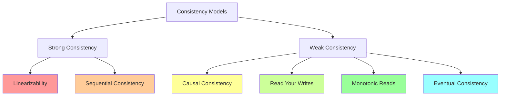
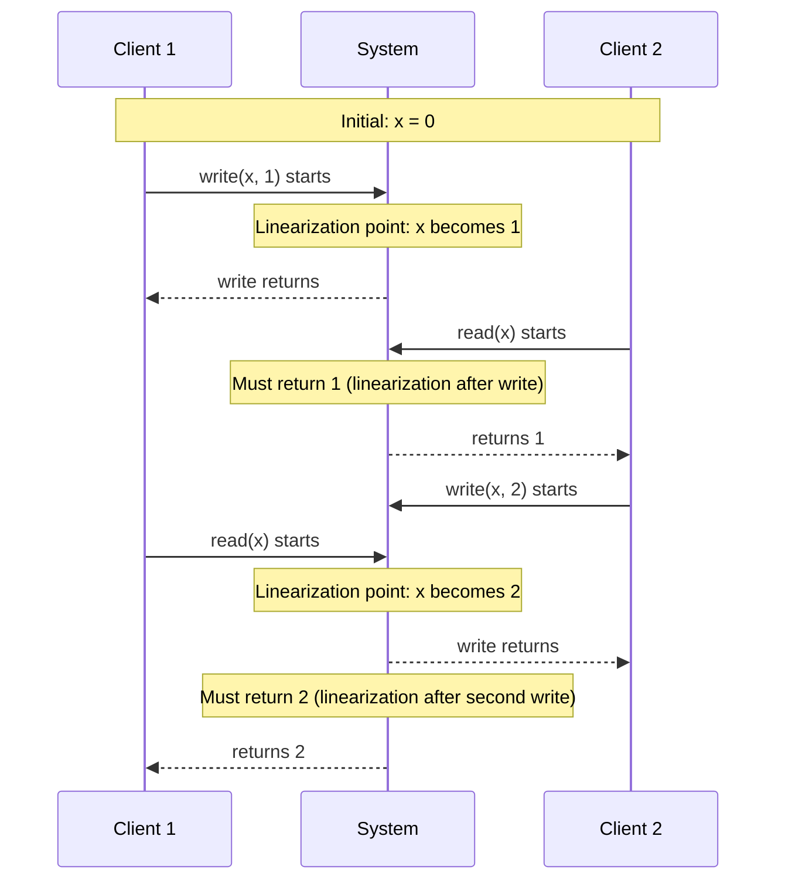
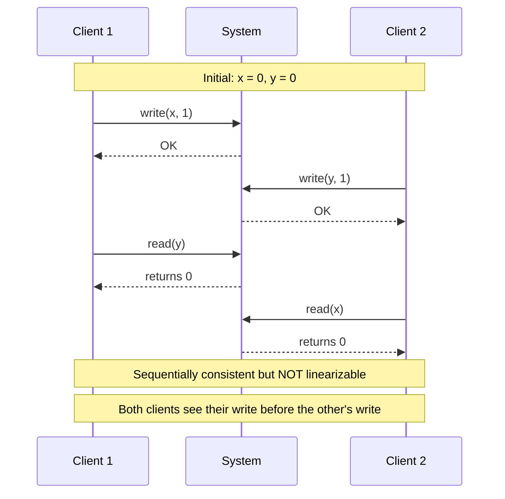
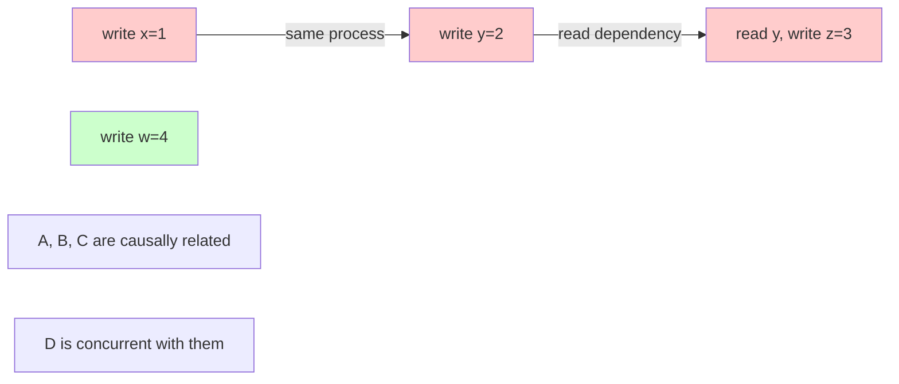
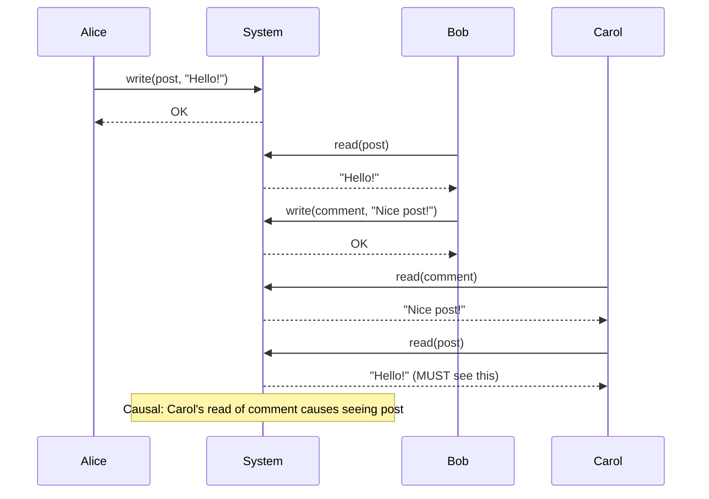
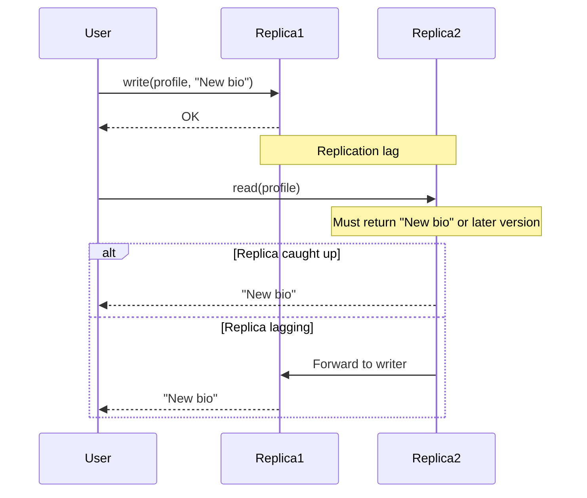
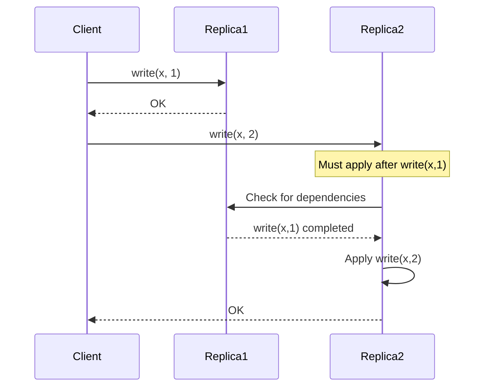
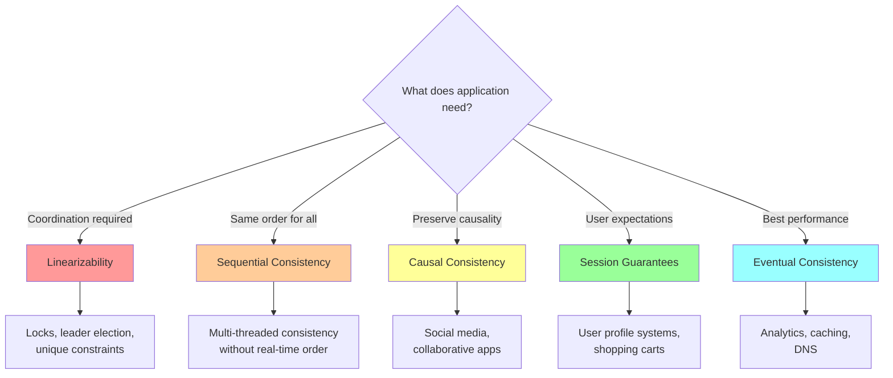

# Consistency Models

Consistency models define the guarantees a distributed system provides about the order and visibility of operations across multiple replicas. These models form a spectrum from strong consistency (where the system behaves as if there's a single copy of data) to weak consistency (where replicas may diverge significantly). Understanding these models is crucial for designing distributed systems that meet application requirements while achieving acceptable performance.

## The Consistency Spectrum

Consistency models can be organized from strongest to weakest:



Each model makes different tradeoffs between consistency guarantees and performance. Stronger models provide better consistency but require more coordination, increasing latency and reducing availability.

## Linearizability

Linearizability, also called atomic consistency or strong consistency, is the strongest consistency model. It makes a distributed system appear as if there's only a single copy of data, with all operations taking effect atomically at some point between their invocation and completion.

### Formal Definition

A system is linearizable if:
1. Each operation appears to take effect instantaneously at some point between its invocation and response (the **linearization point**)
2. The order of non-overlapping operations is preserved
3. All processes agree on the order of operations

Mathematically, for operations $op_1$ and $op_2$:

$$
\text{if } op_1.\text{complete} < op_2.\text{start} \text{ then } op_1 \prec op_2 \text{ in the global order}
$$

### Visualizing Linearizability

Consider this execution with two clients performing operations:



The key property is that once a write completes, all subsequent reads (even from different clients) must see that write or a later one.

### Linearizability Example: Banking

Consider two clients accessing a bank account:

```
Initial: balance = $100

Client A: withdraw($50)  -> OK, balance now $50
Client B: withdraw($50)  -> OK, balance now $0

Linearizable: Withdrawals are serialized; both succeed sequentially
```

In a non-linearizable system:
```
Both clients read balance = $100 concurrently
Both withdraw $50 based on balance = $100
Final balance = $50 (one withdrawal lost!)
```

### Implementation Approaches

**Single-server systems** are trivially linearizable—operations are processed in order on one machine.

**Replicated systems** achieve linearizability through:

1. **Consensus protocols** (Paxos, Raft): All replicas agree on operation order
2. **Chain replication**: Reads from tail, writes acknowledged by tail
3. **Quorum reads and writes** with careful version tracking

### Performance Cost

Linearizability requires coordination, which introduces latency:

$$
\text{Latency}_{\text{linearizable}} \geq \frac{\text{RTT}}{2}
$$

Where RTT is the round-trip time between replicas. This is because achieving consensus on operation order requires at least one round of communication.

For geographically distributed systems with RTT of 100ms+ between continents, this makes linearizability expensive.

### When Linearizability is Necessary

Linearizability is essential for:
- **Distributed locks and leader election**: Exactly one process must acquire the lock
- **Unique constraint enforcement**: Ensuring usernames are unique across all replicas
- **Financial transactions**: Preventing double-spending and maintaining accurate balances
- **Inventory systems**: Preventing overselling of limited stock

## Sequential Consistency

Sequential consistency is slightly weaker than linearizability. It requires all processes to observe operations in the same order, but that order doesn't need to respect real-time ordering.

### Formal Definition

A system is sequentially consistent if:
1. All processes see the same total order of operations
2. Each process's operations appear in that order in the same sequence they were issued

Unlike linearizability, operations don't need to appear in real-time order. If operation A completes before operation B starts, B doesn't necessarily need to come after A in the global order.

### Difference from Linearizability



In this execution:
- **Sequentially consistent**: There's an order where each client's write happens after the other's read
- **Not linearizable**: The writes completed before the reads started, so in real-time the writes must precede the reads

### Why Sequential Consistency is Weaker

Sequential consistency allows different processes to disagree about the relative order of concurrent operations, as long as they agree on each process's individual operation order.

This enables better performance because operations don't need to be timestamped or ordered in real-time—they just need to be applied in a consistent order across all replicas.

### Implementation

Sequential consistency can be achieved through:
- **Lamport clocks**: Assign logical timestamps to operations
- **Single-threaded execution per process**: Each process's operations maintain their order
- **Lazy replication**: Operations propagate asynchronously but are applied in a consistent order

## Causal Consistency

Causal consistency preserves the order of causally related operations while allowing concurrent operations to be seen in different orders by different processes.

### Causality in Distributed Systems

Two operations are causally related if:
1. They're executed by the same process in program order
2. One reads a value written by the other
3. They're transitively related through other operations



### Formal Definition

A system provides causal consistency if:

$$
\text{if } op_1 \to op_2 \text{ (causally related) then all processes observe } op_1 \text{ before } op_2
$$

Concurrent operations (not causally related) can be observed in any order.

### Causal Consistency Example



Carol must see Alice's post because:
- Carol read Bob's comment
- Bob's comment depends on seeing Alice's post
- Therefore, Carol's reads are causally after Alice's post

### Vector Clocks for Causality

Vector clocks track causal relationships:

```
Each process maintains a vector: [P1_count, P2_count, P3_count, ...]

On event at process i:
  - Increment V[i]
  - Send V with messages

On receiving message with V_msg at process i:
  - Update V[j] = max(V[j], V_msg[j]) for all j
  - Increment V[i]
```

Example:
```
Process A:                Process B:
[1,0,0] write x=1
[2,0,0] send to B -----> [0,1,0] receive
                          [2,2,0] write y=2
                          [2,3,0] send to C ----> Process C receives [2,3,0]

Process C knows B's write is causally after A's write
```

### Performance Benefits

Causal consistency is significantly cheaper than linearizability:
- No global coordination required
- Can be implemented with vector clocks (local metadata)
- Operations can complete with one round-trip to local replica

Many applications only need causal consistency:
- Social media (comments must follow posts)
- Collaborative editing (edits preserve dependencies)
- Messaging systems (replies follow messages)

## Session Guarantees

Session guarantees provide consistency within a client's session while allowing weaker guarantees across sessions. These are practical models that match user expectations.

### Read Your Writes

**Guarantee:** If a process writes a value, all subsequent reads by that process will see the written value or a later value.



**Implementation strategies:**

1. **Sticky sessions**: Route all requests from a user to the same replica
2. **Read from leader**: After writing, read from the leader replica for a time window
3. **Version tracking**: Client tracks write versions, only reads from replicas with those versions

```javascript
// Implementation with version tracking
class Client {
  constructor() {
    this.lastWriteVersion = 0;
  }

  async write(key, value) {
    const version = await replica.write(key, value);
    this.lastWriteVersion = Math.max(this.lastWriteVersion, version);
    return version;
  }

  async read(key) {
    // Only read from replicas with version >= lastWriteVersion
    const replicas = await findReplicasWithVersion(this.lastWriteVersion);
    return await replicas[0].read(key);
  }
}
```

### Monotonic Reads

**Guarantee:** If a process reads a value, all subsequent reads will see that value or a later value—never an earlier value.

Without monotonic reads:
```
User reads from Replica A: sees version 5
User reads from Replica B (lagging): sees version 3  // Time going backward!
```

With monotonic reads:
```
User reads from Replica A: sees version 5
User reads from Replica B: system ensures version >= 5
```

**Implementation:**
```javascript
class MonotonicClient {
  constructor() {
    this.lastSeenVersion = 0;
  }

  async read(key) {
    let value, version;
    do {
      const replica = selectReplica();
      ({value, version} = await replica.read(key));
    } while (version < this.lastSeenVersion);

    this.lastSeenVersion = Math.max(this.lastSeenVersion, version);
    return value;
  }
}
```

### Monotonic Writes

**Guarantee:** Writes from a single process are applied in the order they were issued.



### Writes Follow Reads

**Guarantee:** If a process reads a value then performs a write, that write is guaranteed to occur after the read in the global operation order.

Example: commenting on a blog post
```
User reads post version 5
User writes comment referencing post
System ensures: comment is applied after post version 5 is visible
```

This prevents:
```
User reads "Anyone want pizza?"
User writes comment "Yes please!"
Comment appears before question due to replication lag
```

## Choosing a Consistency Model

The choice of consistency model involves fundamental tradeoffs:



### Decision Framework

**Use Linearizability when:**
- Absolute correctness is required (financial systems)
- Coordinating distributed resources (locks, leader election)
- Enforcing global uniqueness constraints
- Small scale or latency-tolerant

**Use Sequential Consistency when:**
- Need total ordering but not real-time ordering
- Multiple processes need coordinated view
- Can tolerate slightly weaker guarantees for better performance

**Use Causal Consistency when:**
- Operations have clear cause-effect relationships
- Social/collaborative applications
- Can't tolerate seeing effects before causes
- Need better performance than sequential consistency

**Use Session Guarantees when:**
- Focus on individual user experience
- Users should see their own actions consistently
- Different users can have different views
- Read-heavy with occasional writes per user

**Use Eventual Consistency when:**
- Temporary inconsistency is acceptable
- Highest performance and availability required
- Read-heavy, write-infrequent workloads
- Can handle conflicts at application level

### Performance Comparison

The performance implications scale with consistency strength:

| Model | Read Latency | Write Latency | Availability |
|-------|-------------|---------------|--------------|
| Linearizability | High (consensus) | High (consensus) | Low (requires quorum) |
| Sequential | Medium (coordination) | Medium (coordination) | Medium |
| Causal | Low (local + vector clock) | Low (local + vector clock) | High |
| Session | Low (sticky routing) | Low (local) | High |
| Eventual | Very Low (local) | Very Low (local) | Very High |

### Real-World Examples

**Google Spanner** provides linearizability using GPS and atomic clocks for global timestamp synchronization.

**Amazon DynamoDB** offers eventual consistency by default with optional strong consistency for reads.

**Facebook's TAO** uses eventual consistency with asynchronous replication across data centers.

**Apache Cassandra** provides tunable consistency where clients choose between eventual and quorum-based consistency per operation.

Understanding these consistency models and their tradeoffs is fundamental to designing distributed systems. The key is matching the consistency model to application requirements—using the weakest model that still satisfies correctness constraints to achieve the best possible performance and availability.
