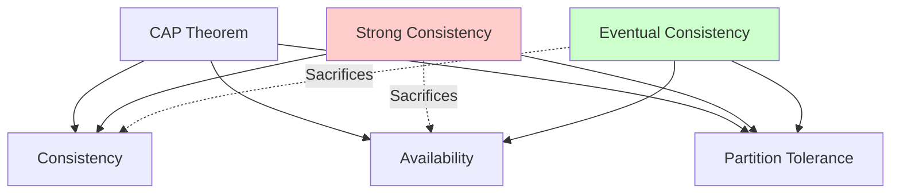
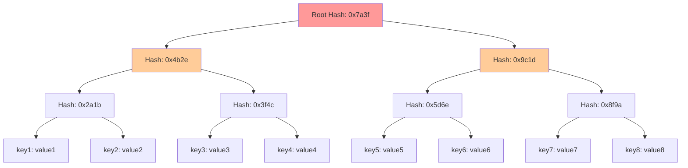
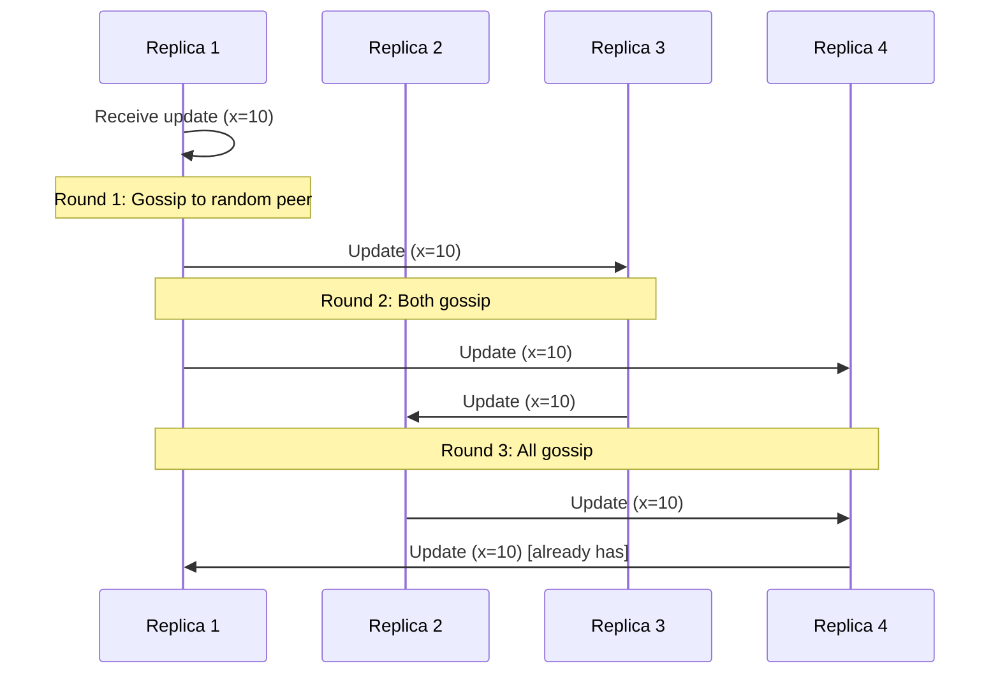
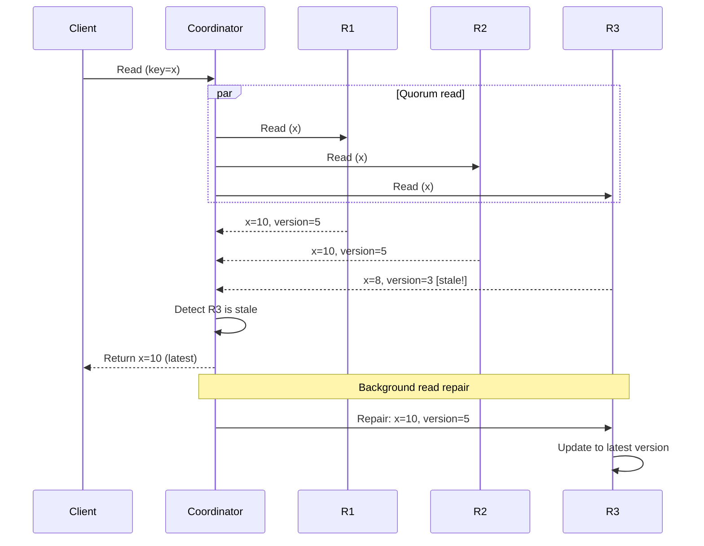
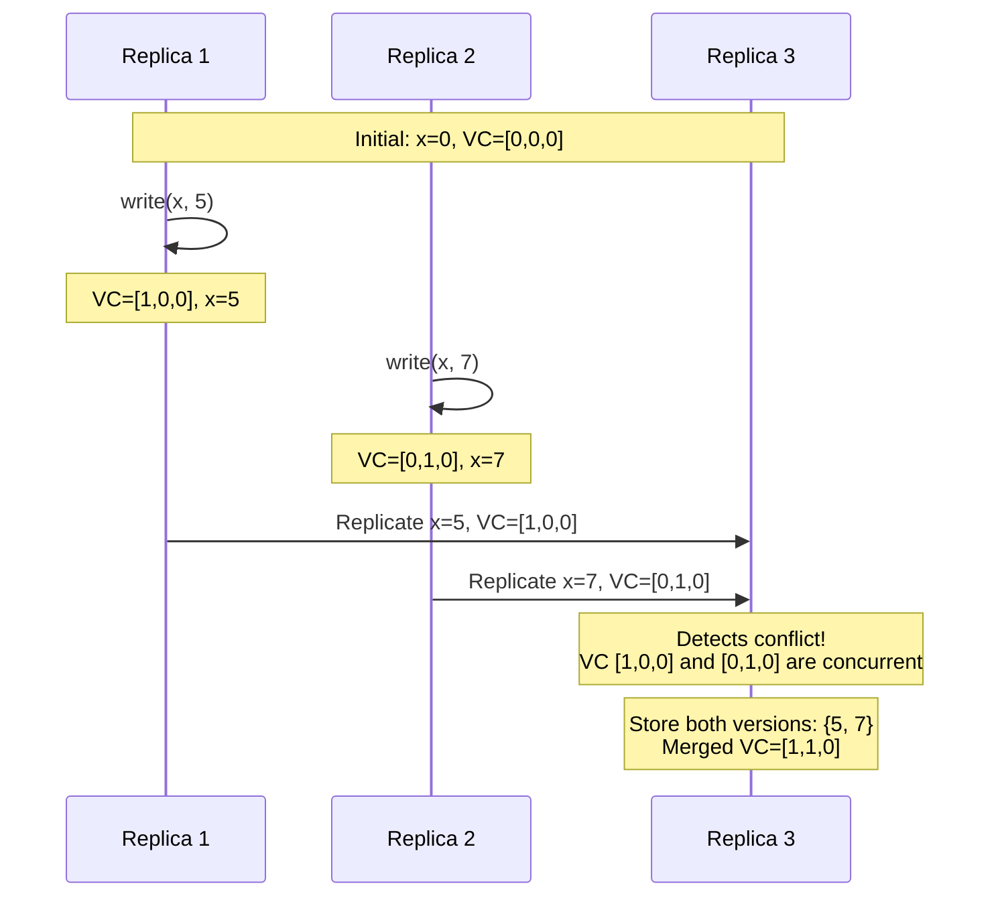

# Eventual Consistency

Eventual consistency represents the weakest consistency model commonly used in distributed systems. It provides a simple guarantee: if no new updates are made to a piece of data, eventually all replicas will converge to the same value. This seemingly weak guarantee enables systems to achieve remarkable availability, scalability, and performance—properties that make eventual consistency the foundation of some of the world's largest distributed systems.

## Definition and Formal Properties

Eventual consistency makes a deceptively simple promise about the future state of replicas without constraining their current state.

### Formal Definition

A system is eventually consistent if:

$$
\forall \text{ replicas } r_i, r_j: \lim_{t \to \infty} (\text{no new writes} \implies \text{state}(r_i) = \text{state}(r_j))
$$

In plain language: Given enough time without new writes, all replicas will eventually agree.

### What Eventual Consistency Does NOT Guarantee

Understanding eventual consistency requires clarity about what it explicitly does NOT promise:

1. **No guarantee on convergence time**: Replicas might disagree for milliseconds, seconds, minutes, or theoretically forever if writes continue
2. **No ordering guarantees**: Different replicas may see operations in different orders
3. **No freshness guarantees**: Reads may return arbitrarily stale data
4. **No atomicity across operations**: Multi-operation transactions may be partially visible

### Strong Eventual Consistency

A stronger variant, **strong eventual consistency** (SEC), adds important guarantees:

$$
\forall \text{ replicas } r_i, r_j: \text{same updates} \implies \text{state}(r_i) = \text{state}(r_j)
$$

Properties of SEC:
- **Convergence**: Replicas with the same updates have the same state
- **Termination**: All update operations eventually complete
- **Conflict-free**: Concurrent updates can be merged deterministically

Conflict-free replicated data types (CRDTs) provide strong eventual consistency.

## Why Eventual Consistency?

The appeal of eventual consistency lies in the fundamental tradeoffs it enables.

### CAP Theorem Tradeoffs

The CAP theorem states that in the presence of network partitions, you must choose between consistency and availability. Eventual consistency chooses availability:



During a network partition:
- **Strong consistency** refuses to serve requests that might violate consistency
- **Eventual consistency** continues serving requests, accepting temporary divergence

### Performance Benefits

Eventual consistency enables dramatically better performance:

**Write latency:** Operations complete locally without coordination:
$$
\text{Latency}_{\text{write}} = \text{Latency}_{\text{local}} + \epsilon
$$

**Read latency:** Reads are served from the nearest replica without quorum checks:
$$
\text{Latency}_{\text{read}} = \text{Latency}_{\text{local}}
$$

**Throughput:** Limited only by individual replica capacity, scales linearly with replicas:
$$
\text{Throughput}_{\text{total}} \approx n \times \text{Throughput}_{\text{replica}}
$$

### Availability During Failures

Eventually consistent systems remain available during failures:
- Single replica failures don't impact availability
- Network partitions don't prevent operations
- Partial system failures are tolerated gracefully

## Anti-Entropy: Achieving Convergence

While eventual consistency promises convergence, it requires active mechanisms to achieve it. Anti-entropy is the process of detecting and resolving differences between replicas.

### Merkle Trees for Efficient Comparison

Comparing entire datasets between replicas is expensive. Merkle trees enable efficient detection of differences:



**Merkle tree construction:**
1. Partition data into blocks
2. Hash each block (leaf nodes)
3. Recursively hash pairs of child hashes up to the root

**Efficient comparison:**
```
Replica A: root hash = 0x7a3f
Replica B: root hash = 0x7a3f
→ Identical, no synchronization needed

Replica A: root hash = 0x7a3f
Replica B: root hash = 0x8b4g
→ Recursively compare subtrees to find differences
```

This reduces comparison complexity from $O(n)$ to $O(\log n)$ for finding differences.

### Anti-Entropy Protocols

**Push-based anti-entropy:**
```
Periodically:
  Select random peer
  Send updates peer doesn't have
```

**Pull-based anti-entropy:**
```
Periodically:
  Select random peer
  Request updates we don't have
```

**Push-pull hybrid:**
```
Periodically:
  Select random peer
  Exchange Merkle tree roots
  If different:
    Identify divergent subtrees
    Synchronize only those subtrees
```

### Gossip Protocols

Gossip (epidemic) protocols spread updates through random peer communication:



**Gossip convergence time:**

With $n$ replicas, an update reaches all replicas in $O(\log n)$ gossip rounds:

$$
\text{Rounds to converge} \approx \log_2(n)
$$

This logarithmic propagation makes gossip extremely efficient even at large scale.

### Practical Anti-Entropy Scheduling

Real systems balance convergence speed against overhead:

**Amazon Dynamo:** Merkle tree anti-entropy runs continuously in background
**Cassandra:** Anti-entropy repair runs on configurable schedule (daily/weekly)
**Riak:** Active anti-entropy with Merkle tree comparison every 15 minutes

The tradeoff:
- **Frequent repair:** Fast convergence but higher CPU/network overhead
- **Infrequent repair:** Lower overhead but longer divergence periods

## Read Repair

Read repair is an opportunistic anti-entropy mechanism that repairs inconsistencies when they're discovered during reads.

### Basic Read Repair

When a client reads with a quorum, the coordinator can detect inconsistencies:



### Read Repair Algorithm

```javascript
async function readWithRepair(key, replicationFactor, quorum) {
  // Read from multiple replicas
  const responses = await Promise.all(
    selectReplicas(replicationFactor).map(r => r.read(key))
  );

  // Find the latest version
  const latest = responses.reduce((max, resp) =>
    resp.version > max.version ? resp : max
  );

  // Return to client immediately
  const result = latest.value;

  // Background repair for stale replicas
  const staleReplicas = responses.filter(r => r.version < latest.version);

  // Async repair (don't wait)
  setImmediate(() => {
    for (const stale of staleReplicas) {
      stale.replica.write(key, latest.value, latest.version);
    }
  });

  return result;
}
```

### Benefits and Limitations

**Benefits:**
- **Zero-cost convergence:** Repairs happen during reads anyway performed
- **Targeted repair:** Only fixes data actually being accessed
- **Automatic:** No operator intervention required

**Limitations:**
- **Cold data stays divergent:** Rarely-read data may never be repaired
- **Read latency impact:** Quorum reads are slower than single-replica reads
- **Incomplete:** Doesn't guarantee all replicas converge

## Vector Clocks for Version Tracking

Vector clocks are the fundamental mechanism for tracking causality and versioning in eventually consistent systems.

### The Version Tracking Problem

Without version information, replicas can't determine the correct order of concurrent updates:

```
Replica A sees: x=5, then x=7
Replica B sees: x=5, then x=6

Which is newer: 7 or 6? Without timestamps, we can't tell!
```

### Vector Clock Structure

A vector clock is a vector of logical timestamps, one per replica:

$$
VC = [T_1, T_2, T_3, \ldots, T_n]
$$

Where $T_i$ is the logical time at replica $i$.

### Vector Clock Operations

**Initialization:**
```javascript
const vc = [0, 0, 0];  // For 3 replicas
```

**Local event (increment own clock):**
```javascript
function localEvent(vc, replicaId) {
  const newVC = [...vc];
  newVC[replicaId]++;
  return newVC;
}

// Replica 0 performs operation
vc = localEvent([0,0,0], 0);  // → [1,0,0]
```

**Send message (include vector clock):**
```javascript
function send(message, vc, replicaId) {
  const sendVC = localEvent(vc, replicaId);
  return { message, vectorClock: sendVC };
}
```

**Receive message (merge clocks):**
```javascript
function receive(localVC, messageVC, replicaId) {
  const mergedVC = localVC.map((t, i) => Math.max(t, messageVC[i]));
  return localEvent(mergedVC, replicaId);
}

// Replica 1 receives message with VC [2,0,1]
// Local VC is [1,3,0]
receive([1,3,0], [2,0,1], 1);  // → [2,4,1]
```

### Comparing Vector Clocks

**Equal:** $VC_1 = VC_2$ if $\forall i: VC_1[i] = VC_2[i]$

**Happens-before:** $VC_1 < VC_2$ if $\forall i: VC_1[i] \leq VC_2[i]$ and $\exists j: VC_1[j] < VC_2[j]$

**Concurrent:** Neither $VC_1 < VC_2$ nor $VC_2 < VC_1$

```javascript
function compare(vc1, vc2) {
  let less = false, greater = false;

  for (let i = 0; i < vc1.length; i++) {
    if (vc1[i] < vc2[i]) less = true;
    if (vc1[i] > vc2[i]) greater = true;
  }

  if (!less && !greater) return 'equal';
  if (less && !greater) return 'before';  // vc1 < vc2
  if (greater && !less) return 'after';   // vc1 > vc2
  return 'concurrent';  // Conflict!
}

compare([1,2,3], [1,2,3]);  // → 'equal'
compare([1,2,2], [1,2,3]);  // → 'before'
compare([1,3,2], [1,2,3]);  // → 'concurrent'
```

### Using Vector Clocks for Versioning

```javascript
class EventuallyConsistentStore {
  constructor(replicaId, numReplicas) {
    this.replicaId = replicaId;
    this.data = new Map();  // key → { value, vectorClock }
    this.clock = new Array(numReplicas).fill(0);
  }

  write(key, value) {
    // Increment local clock
    this.clock[this.replicaId]++;

    // Store with vector clock
    this.data.set(key, {
      value,
      vectorClock: [...this.clock]
    });

    // Replicate to other replicas
    this.replicate(key, value, this.clock);
  }

  receiveUpdate(key, value, vectorClock) {
    const existing = this.data.get(key);

    if (!existing) {
      // No existing version, accept update
      this.data.set(key, { value, vectorClock });
      this.clock = this.mergeClocks(this.clock, vectorClock);
      return;
    }

    const comparison = compare(vectorClock, existing.vectorClock);

    if (comparison === 'after') {
      // New version supersedes old, accept update
      this.data.set(key, { value, vectorClock });
      this.clock = this.mergeClocks(this.clock, vectorClock);
    } else if (comparison === 'concurrent') {
      // Conflict! Store both versions
      this.data.set(key, {
        value: [existing.value, value],  // Keep both
        vectorClock: this.mergeClocks(existing.vectorClock, vectorClock)
      });
    }
    // If 'before' or 'equal', ignore (we have newer or same version)
  }

  mergeClocks(vc1, vc2) {
    return vc1.map((t, i) => Math.max(t, vc2[i]));
  }
}
```

### Example: Concurrent Writes with Vector Clocks



Replica 3 detects the conflict because neither vector clock is greater than the other, indicating concurrent writes. It stores both values and merges the clocks.

### Dotted Version Vectors

Standard vector clocks grow with the number of replicas. **Dotted version vectors** (DVV) optimize this by only tracking the specific update that created a version:

```javascript
// Standard vector clock for 1000 replicas: 1000 integers
[0, 0, 0, ..., 5, ..., 0]  // 1000 elements even if only 1 updated

// Dotted version vector: single (replica, counter) pair
{ replica: 234, counter: 5, base: [0, 0, 3, ...] }
```

This dramatically reduces metadata size for systems with many replicas.

## Practical Considerations

### Convergence Time in Production

Real-world convergence depends on:
- **Gossip frequency:** More frequent gossip = faster convergence
- **Network latency:** Cross-region replication introduces delays
- **System load:** Overloaded replicas may delay anti-entropy
- **Failure rate:** Failed replicas don't participate in convergence

Typical convergence times:
- **Same data center:** Milliseconds to low seconds
- **Cross-region:** Seconds to minutes
- **During failures:** Minutes to hours

### When Eventual Consistency is Appropriate

Eventual consistency works well for:
- **Shopping carts:** Temporary inconsistencies are acceptable
- **Social media feeds:** Perfect ordering isn't required
- **Analytics:** Approximate answers are sufficient
- **DNS:** Stale cache entries are tolerable
- **Session stores:** User-specific data with relaxed consistency

### When NOT to Use Eventual Consistency

Avoid eventual consistency for:
- **Financial transactions:** Requires strong consistency
- **Inventory with limited stock:** Prevents overselling
- **Unique constraints:** Usernames, email addresses must be globally unique
- **Strongly ordered operations:** Where order is semantically critical

Understanding eventual consistency and its implementation mechanisms enables building highly available, scalable distributed systems while being aware of the consistency tradeoffs involved.
