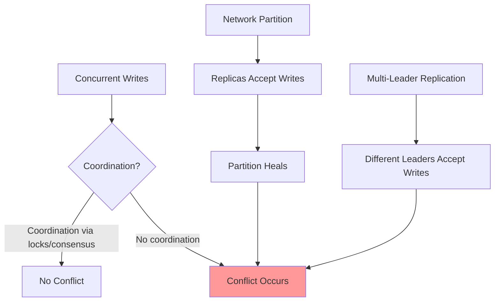
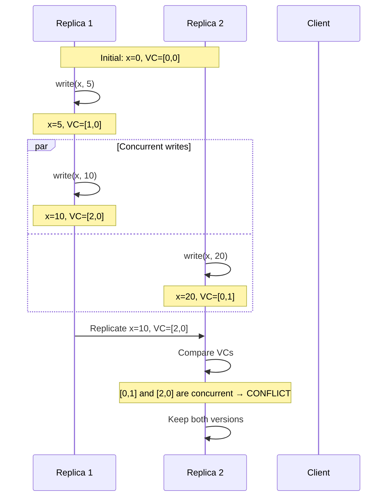
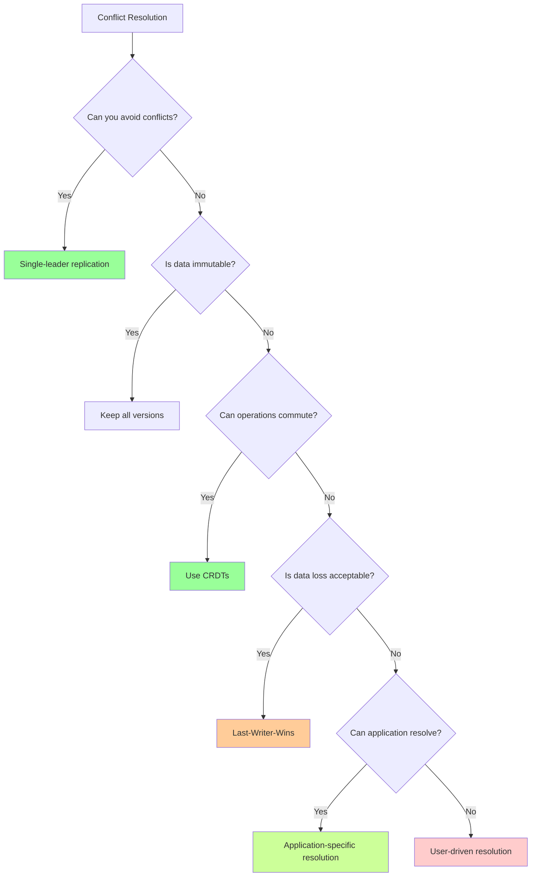

# Conflict Resolution

In eventually consistent and multi-leader replication systems, conflicts are inevitable. When multiple replicas accept concurrent writes to the same data, the system must decide which version to keep, how to merge them, or whether to preserve both. Conflict resolution represents one of the most challenging aspects of distributed system design, requiring careful tradeoffs between simplicity, correctness, and application semantics.

## Understanding Conflicts

Conflicts arise when replicas apply updates in different orders or accept concurrent updates without coordination.

### Types of Conflicts

**Write-Write Conflicts**
```
Time:     t1              t2
Replica A: x = 5     →    x = 7
Replica B: x = 5     →    x = 9

Conflict: Both replicas updated x concurrently
```

**Read-Write Conflicts** (less common in eventually consistent systems)
```
Process 1: Read x=5, then write y based on x=5
Process 2: Write x=10
Process 1's write to y is based on stale read of x
```

**Structural Conflicts** (in multi-version systems)
```
Version tree:
        v1
       /  \
     v2    v3
      |    |
     v4    v5

Conflict: Concurrent branches exist
```

### When Conflicts Occur



The fundamental cause is **concurrent operations without coordination**.

## Last-Writer-Wins (LWW)

Last-writer-wins is the simplest conflict resolution strategy: pick the update with the most recent timestamp and discard others.

### Algorithm

```javascript
class LWWRegister {
  constructor() {
    this.value = null;
    this.timestamp = 0;
  }

  write(value, timestamp) {
    if (timestamp > this.timestamp) {
      this.value = value;
      this.timestamp = timestamp;
    }
    // Silently discard older writes
  }

  read() {
    return this.value;
  }
}
```

### Using Timestamps

**Physical clocks:**
```javascript
function write(key, value) {
  const timestamp = Date.now();  // Milliseconds since epoch
  replicate(key, value, timestamp);
}
```

**Lamport timestamps:**
```javascript
class LamportLWW {
  constructor(replicaId) {
    this.replicaId = replicaId;
    this.lamportClock = 0;
    this.data = new Map();
  }

  write(key, value) {
    this.lamportClock++;
    const timestamp = {
      time: this.lamportClock,
      replica: this.replicaId  // Tie-breaker
    };
    this.data.set(key, { value, timestamp });
  }

  receiveWrite(key, value, remoteTimestamp) {
    // Update local Lamport clock
    this.lamportClock = Math.max(this.lamportClock, remoteTimestamp.time) + 1;

    const existing = this.data.get(key);
    if (!existing || this.isNewer(remoteTimestamp, existing.timestamp)) {
      this.data.set(key, { value, timestamp: remoteTimestamp });
    }
  }

  isNewer(ts1, ts2) {
    if (ts1.time !== ts2.time) return ts1.time > ts2.time;
    return ts1.replica > ts2.replica;  // Deterministic tie-break
  }
}
```

### Advantages

- **Simple to implement:** No complex logic required
- **Fast:** O(1) comparison
- **Deterministic:** All replicas converge to same value
- **No metadata growth:** Only store single timestamp

### Critical Problems

**Data Loss**
```
User A: Update profile bio at t1
User B: Update profile bio at t2 (milliseconds later)

Result: User A's update is permanently lost!
```

LWW **silently discards concurrent writes**, which can be catastrophic:
- Shopping cart items disappear
- User edits are lost
- Configuration changes vanish

**Clock Skew**
```
Server A: Clock is 5 minutes fast
Server B: Clock is correct

Write to A at real-time 10:00 gets timestamp 10:05
Write to B at real-time 10:02 gets timestamp 10:02

Result: Older write from A wins!
```

Physical clocks cannot be perfectly synchronized. Even with NTP, clock skew of seconds is common, leading to incorrect conflict resolution.

### When LWW is Acceptable

Use LWW only when:
- **Data is immutable once written** (write-once, read-many)
- **Losing updates is acceptable** (caching, session storage)
- **Writes are non-concurrent** (single writer per key)
- **Application can handle data loss** (monitoring metrics, logs)

**Never use LWW for:**
- Financial data
- User-generated content
- Inventory systems
- Any data where loss is unacceptable

## Vector Clock-Based Resolution

Vector clocks enable detecting true causality relationships and identifying genuine conflicts.

### Conflict Detection with Vector Clocks



### Multi-Value Resolution

When conflicts are detected, store all concurrent versions:

```javascript
class MultiValueRegister {
  constructor(numReplicas) {
    // Store set of concurrent values with their vector clocks
    this.values = [];  // [{ value, vectorClock }, ...]
  }

  write(value, vectorClock) {
    // Remove causally dominated versions
    this.values = this.values.filter(v =>
      !this.happensBefore(v.vectorClock, vectorClock)
    );

    // Check if new value is dominated by existing
    const isDominated = this.values.some(v =>
      this.happensBefore(vectorClock, v.vectorClock)
    );

    if (!isDominated) {
      // Add new concurrent version
      this.values.push({ value, vectorClock });
    }
  }

  read() {
    // Return all concurrent values (siblings)
    return this.values.map(v => v.value);
  }

  happensBefore(vc1, vc2) {
    let less = false;
    for (let i = 0; i < vc1.length; i++) {
      if (vc1[i] > vc2[i]) return false;  // Not happened-before
      if (vc1[i] < vc2[i]) less = true;
    }
    return less;  // vc1 < vc2
  }
}
```

### Client-Side Conflict Resolution

The system returns all conflicting versions to the client, which must resolve them:

```javascript
async function updateShoppingCart(userId, newItem) {
  // Read current cart
  const versions = await cart.read(userId);

  if (versions.length === 1) {
    // No conflict, simple case
    const items = versions[0];
    items.push(newItem);
    await cart.write(userId, items);
  } else {
    // Conflict! Multiple versions exist
    // Merge: union of all items
    const mergedItems = new Set();
    for (const version of versions) {
      version.forEach(item => mergedItems.add(item));
    }
    mergedItems.add(newItem);

    // Write merged version
    await cart.write(userId, Array.from(mergedItems));
  }
}
```

### Advantages and Disadvantages

**Advantages:**
- **No data loss:** All concurrent updates are preserved
- **Semantic correctness:** Application can resolve based on meaning
- **Flexible:** Different resolution strategies per data type

**Disadvantages:**
- **Complexity:** Application must implement resolution logic
- **User involvement:** May require user to resolve conflicts manually
- **Unbounded growth:** Without merging, versions can proliferate

## Application-Specific Resolution

The most powerful approach is designing conflict resolution based on application semantics.

### Commutative Operations

Design operations that produce the same result regardless of order:

```javascript
// NOT commutative: x = x + 1 then x = x * 2 differs from x = x * 2 then x = x + 1
// x=5 → +1 → *2 = 12
// x=5 → *2 → +1 = 11

// Commutative: Set operations
set.add(5)
set.add(7)
// Same result regardless of order

// Commutative: Counter increments with IDs
counter.increment('user123', 1)
counter.increment('user456', 1)
// Can be applied in any order
```

### Merge Functions

Define semantic merge operations:

```javascript
// Shopping cart merge: Union of items
function mergeShoppingCarts(cart1, cart2) {
  const merged = new Map();

  // Add items from cart1
  for (const [itemId, quantity] of cart1) {
    merged.set(itemId, quantity);
  }

  // Merge items from cart2
  for (const [itemId, quantity] of cart2) {
    const existing = merged.get(itemId) || 0;
    merged.set(itemId, existing + quantity);  // Sum quantities
  }

  return merged;
}

// Document merge: Operational transformation
function mergeDocuments(doc1, doc2, baseDoc) {
  const ops1 = diff(baseDoc, doc1);
  const ops2 = diff(baseDoc, doc2);

  // Transform ops to account for concurrent changes
  const transformed = operationalTransform(ops1, ops2);

  return apply(baseDoc, transformed);
}

// User profile merge: Field-level granularity
function mergeProfiles(profile1, profile2, vectorClock1, vectorClock2) {
  const merged = {};

  for (const field in profile1) {
    const vc1 = vectorClock1[field];
    const vc2 = vectorClock2[field];

    if (happensBefore(vc1, vc2)) {
      merged[field] = profile2[field];  // version 2 is newer
    } else if (happensBefore(vc2, vc1)) {
      merged[field] = profile1[field];  // version 1 is newer
    } else {
      // Concurrent: Use application-specific logic
      merged[field] = resolveConcurrentField(field, profile1[field], profile2[field]);
    }
  }

  return merged;
}
```

### CRDTs: Conflict-Free by Design

Conflict-free replicated data types guarantee convergence through mathematical properties:

```javascript
// G-Counter: Grow-only counter
class GCounter {
  constructor(replicaId, numReplicas) {
    this.replicaId = replicaId;
    this.counts = new Array(numReplicas).fill(0);
  }

  increment() {
    this.counts[this.replicaId]++;
  }

  value() {
    return this.counts.reduce((sum, count) => sum + count, 0);
  }

  merge(other) {
    for (let i = 0; i < this.counts.length; i++) {
      this.counts[i] = Math.max(this.counts[i], other.counts[i]);
    }
  }
}

// PN-Counter: Positive-Negative counter (allows decrements)
class PNCounter {
  constructor(replicaId, numReplicas) {
    this.pos = new GCounter(replicaId, numReplicas);
    this.neg = new GCounter(replicaId, numReplicas);
  }

  increment() { this.pos.increment(); }
  decrement() { this.neg.increment(); }

  value() {
    return this.pos.value() - this.neg.value();
  }

  merge(other) {
    this.pos.merge(other.pos);
    this.neg.merge(other.neg);
  }
}
```

See the dedicated CRDT section for more detailed coverage.

## Domain-Specific Strategies

Different application domains have established conflict resolution patterns:

### Collaborative Editing

**Operational Transformation (OT):**
```javascript
// Transform operations to maintain consistency
function transform(op1, op2) {
  if (op1.type === 'insert' && op2.type === 'insert') {
    if (op1.position < op2.position) {
      return [op1, { ...op2, position: op2.position + op1.text.length }];
    } else {
      return [{ ...op1, position: op1.position + op2.text.length }, op2];
    }
  }
  // ... handle other cases (delete, insert, etc.)
}
```

**CRDT-based (Conflict-free):**
```javascript
// RGA: Replicated Growable Array
class RGA {
  constructor() {
    this.elements = [];  // [{ id, value, visible }, ...]
  }

  insert(position, value, uniqueId) {
    this.elements.splice(position, 0, {
      id: uniqueId,
      value,
      visible: true
    });
  }

  delete(position) {
    this.elements[position].visible = false;  // Tombstone
  }

  toString() {
    return this.elements
      .filter(e => e.visible)
      .map(e => e.value)
      .join('');
  }
}
```

### Distributed Databases

**Cassandra's conflict resolution:**
```sql
-- Last-write-wins at cell level
UPDATE users SET email = 'new@email.com', timestamp = 123456789
WHERE user_id = 'abc';

-- Automatically uses most recent timestamp
```

**Riak's sibling resolution:**
```javascript
// Read returns multiple siblings if conflict exists
const { values, vclock } = await riak.get('bucket', 'key');

if (values.length > 1) {
  // Application resolves conflict
  const merged = mergeValues(values);
  await riak.put('bucket', 'key', merged, vclock);
}
```

### E-Commerce Systems

**Amazon's shopping cart:**
```javascript
// Always favor additions (never lose items due to conflict)
function mergeShoppingCarts(cart1, cart2) {
  const merged = { ...cart1 };

  for (const [item, quantity] of Object.entries(cart2)) {
    if (merged[item]) {
      // Item exists in both: take maximum quantity
      merged[item] = Math.max(merged[item], quantity);
    } else {
      // Item only in cart2: add it
      merged[item] = quantity;
    }
  }

  return merged;
}

// Rationale: Better to show extra item than lose an item user added
```

### Social Media

**Facebook's friend graph:**
```javascript
// Friends are sets: merge via union
function mergeFriendLists(friends1, friends2) {
  return new Set([...friends1, ...friends2]);
}

// Posts use timestamps: newer timestamp wins per post
function mergePosts(posts1, posts2) {
  const merged = new Map();

  for (const post of [...posts1, ...posts2]) {
    const existing = merged.get(post.id);
    if (!existing || post.timestamp > existing.timestamp) {
      merged.set(post.id, post);
    }
  }

  return Array.from(merged.values());
}
```

## Choosing a Resolution Strategy



### Decision Framework

**Prefer stronger approaches:**
1. **Avoid conflicts entirely** (single-leader, serialization)
2. **Make operations commutative** (CRDTs, commutative operations)
3. **Application-specific merge** (semantic resolution)
4. **User-driven resolution** (show conflicts to user)
5. **Last-writer-wins** (only if data loss is acceptable)

### Evaluation Criteria

| Strategy | Correctness | Simplicity | Performance | User Experience |
|----------|-------------|------------|-------------|-----------------|
| Avoid conflicts | Highest | Medium | Lower (coordination) | Best |
| CRDTs | High | Medium | High | Good |
| App-specific | High | Low (complex logic) | High | Good |
| User resolution | High | Low (UI complexity) | High | Poor (manual work) |
| Last-Writer-Wins | Low (data loss) | Highest | Highest | Poor (silent loss) |

## Practical Implementation Patterns

### Versioned Key-Value Store

```javascript
class VersionedKVStore {
  constructor(replicaId, numReplicas) {
    this.replicaId = replicaId;
    this.store = new Map();  // key → [{ value, vclock }, ...]
    this.vectorClock = new Array(numReplicas).fill(0);
  }

  put(key, value, conflictResolver) {
    this.vectorClock[this.replicaId]++;
    const vclock = [...this.vectorClock];

    const siblings = this.store.get(key) || [];

    // Remove causally dominated versions
    const newSiblings = siblings.filter(s =>
      !this.dominates(vclock, s.vclock)
    );

    // Check if new version is dominated
    const isDominated = siblings.some(s =>
      this.dominates(s.vclock, vclock)
    );

    if (!isDominated) {
      newSiblings.push({ value, vclock });
    }

    // Try to resolve conflicts
    if (newSiblings.length > 1 && conflictResolver) {
      const resolved = conflictResolver(newSiblings.map(s => s.value));
      this.store.set(key, [{ value: resolved, vclock }]);
    } else {
      this.store.set(key, newSiblings);
    }
  }

  get(key) {
    return this.store.get(key) || [];
  }

  dominates(vc1, vc2) {
    let greater = false;
    for (let i = 0; i < vc1.length; i++) {
      if (vc1[i] < vc2[i]) return false;
      if (vc1[i] > vc2[i]) greater = true;
    }
    return greater;
  }
}
```

### Automatic Conflict Resolution Pipeline

```javascript
class ConflictResolutionPipeline {
  constructor() {
    this.resolvers = [];
  }

  addResolver(predicate, resolver) {
    this.resolvers.push({ predicate, resolver });
  }

  resolve(conflicts) {
    for (const { predicate, resolver } of this.resolvers) {
      if (predicate(conflicts)) {
        return resolver(conflicts);
      }
    }
    // Fallback: return all conflicts for manual resolution
    return conflicts;
  }
}

// Usage
const pipeline = new ConflictResolutionPipeline();

// Resolver 1: If all values are equal, pick any
pipeline.addResolver(
  conflicts => new Set(conflicts).size === 1,
  conflicts => conflicts[0]
);

// Resolver 2: For numbers, take maximum
pipeline.addResolver(
  conflicts => conflicts.every(c => typeof c === 'number'),
  conflicts => Math.max(...conflicts)
);

// Resolver 3: For arrays, merge via union
pipeline.addResolver(
  conflicts => conflicts.every(Array.isArray),
  conflicts => [...new Set(conflicts.flat())]
);
```

Conflict resolution is both an art and a science, requiring deep understanding of application semantics, user expectations, and distributed systems principles. The best strategy is always the one that avoids conflicts entirely, but when conflicts are unavoidable, thoughtful resolution strategies ensure data integrity and user satisfaction.
