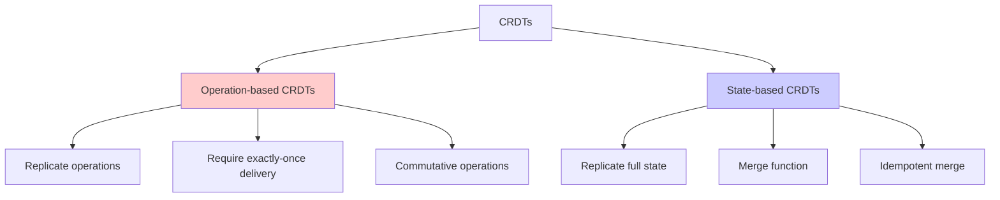
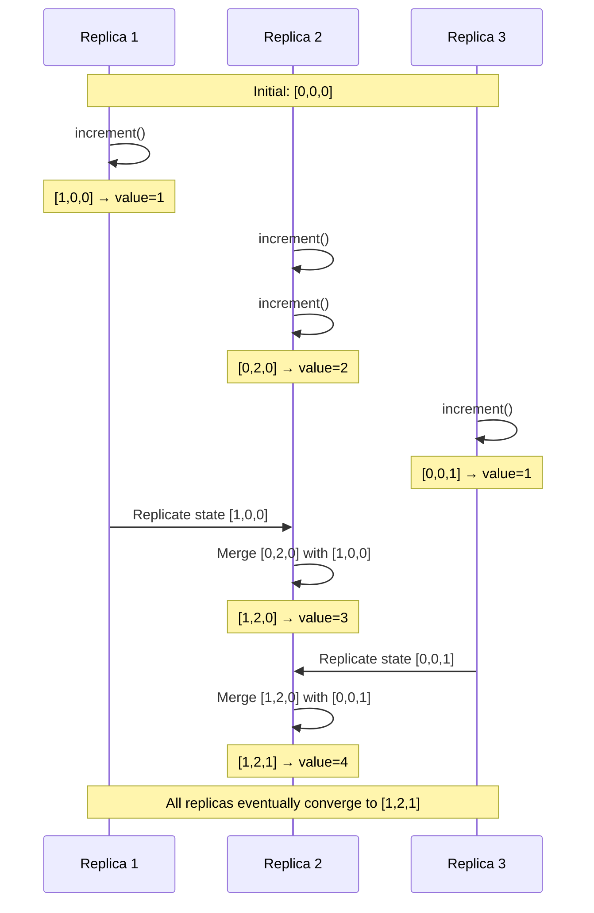
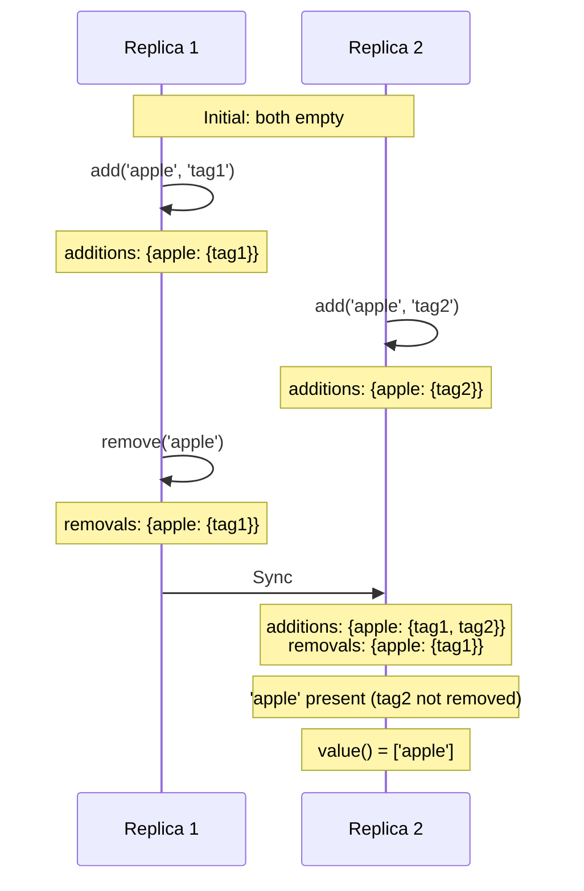

# Conflict-Free Replicated Data Types (CRDTs)

Conflict-Free Replicated Data Types (CRDTs) represent a revolutionary approach to distributed data structures that guarantee strong eventual consistency without requiring coordination between replicas. By encoding conflict resolution into the data type itself through mathematical properties, CRDTs eliminate the need for consensus protocols, enabling high availability and performance while maintaining correctness.

## The CRDT Guarantee

CRDTs provide a remarkable guarantee: replicas can be updated independently without coordination, and they will eventually converge to the same state when they've received the same set of updates.

### Mathematical Foundation

A CRDT must satisfy the **Strong Eventual Consistency** (SEC) property:

$$
\forall \text{ replicas } r_i, r_j: \text{same updates received} \implies \text{state}(r_i) = \text{state}(r_j)
$$

This is achieved through two key properties:

**Commutativity:** Order of operations doesn't matter
$$
f(a, b) = f(b, a)
$$

**Associativity:** Grouping of operations doesn't matter
$$
f(f(a, b), c) = f(a, f(b, c))
$$

**Idempotency:** Applying the same operation multiple times has the same effect as once
$$
f(a, a) = f(a)
$$

### Two Flavors of CRDTs



**State-based CRDTs (CvRDTs):**
- Replicate entire state
- Merge states using join operation
- Tolerant to message loss and duplication
- Higher bandwidth requirements

**Operation-based CRDTs (CmRDTs):**
- Replicate individual operations
- Apply operations in any order
- Require reliable broadcast
- Lower bandwidth requirements

## G-Counter: Grow-Only Counter

The G-Counter is the simplest CRDT, supporting only increments (no decrements).

### State Representation

Each replica maintains a vector tracking increments per replica:

```javascript
class GCounter {
  constructor(replicaId, numReplicas) {
    this.replicaId = replicaId;
    this.counts = new Array(numReplicas).fill(0);
  }

  // Query the current value
  value() {
    return this.counts.reduce((sum, count) => sum + count, 0);
  }

  // Update: increment local counter
  increment(amount = 1) {
    this.counts[this.replicaId] += amount;
  }

  // Merge: take max of each element
  merge(other) {
    const merged = new GCounter(this.replicaId, this.counts.length);
    for (let i = 0; i < this.counts.length; i++) {
      merged.counts[i] = Math.max(this.counts[i], other.counts[i]);
    }
    return merged;
  }

  // Alternative in-place merge
  mergeInPlace(other) {
    for (let i = 0; i < this.counts.length; i++) {
      this.counts[i] = Math.max(this.counts[i], other.counts[i]);
    }
  }
}
```

### Example Execution



### Why G-Counter Works

**Commutativity:**
$$
\max(a, b) = \max(b, a)
$$

**Associativity:**
$$
\max(\max(a, b), c) = \max(a, \max(b, c))
$$

**Idempotency:**
$$
\max(a, a) = a
$$

The merge operation (element-wise max) satisfies all required properties, guaranteeing convergence.

### Limitations

- **Grow-only:** Cannot decrement
- **Space overhead:** Requires one counter per replica
- **Unbounded growth:** Counters only increase

## PN-Counter: Positive-Negative Counter

The PN-Counter extends G-Counter to support decrements by maintaining separate increment and decrement counters.

### State Representation

```javascript
class PNCounter {
  constructor(replicaId, numReplicas) {
    this.replicaId = replicaId;
    this.positive = new GCounter(replicaId, numReplicas);
    this.negative = new GCounter(replicaId, numReplicas);
  }

  // Query: difference between positive and negative
  value() {
    return this.positive.value() - this.negative.value();
  }

  // Update operations
  increment(amount = 1) {
    this.positive.increment(amount);
  }

  decrement(amount = 1) {
    this.negative.increment(amount);
  }

  // Merge both counters independently
  merge(other) {
    const merged = new PNCounter(this.replicaId, this.positive.counts.length);
    merged.positive = this.positive.merge(other.positive);
    merged.negative = this.negative.merge(other.negative);
    return merged;
  }
}
```

### Example: Distributed Like Counter

```javascript
// Social media post with likes and unlikes
class PostLikeCounter {
  constructor(postId, replicaId, numReplicas) {
    this.postId = postId;
    this.counter = new PNCounter(replicaId, numReplicas);
  }

  like() {
    this.counter.increment();
  }

  unlike() {
    this.counter.decrement();
  }

  getLikeCount() {
    return Math.max(0, this.counter.value());  // Don't show negative likes
  }

  sync(otherCounter) {
    this.counter.merge(otherCounter);
  }
}

// Usage across replicas
const r1 = new PostLikeCounter('post123', 0, 3);
const r2 = new PostLikeCounter('post123', 1, 3);

r1.like();  // User on replica 1 likes
r1.like();  // Another user likes
r2.like();  // User on replica 2 likes
r2.unlike(); // User changes mind

r1.sync(r2.counter);  // Replicas sync
console.log(r1.getLikeCount());  // Both show: 2 likes
```

### Mathematical Properties

The value function is:
$$
\text{value}() = \sum_{i=1}^{n} P[i] - \sum_{i=1}^{n} N[i]
$$

Where $P$ is the positive counter vector and $N$ is the negative counter vector.

Since both counters use element-wise max for merging, and subtraction is well-defined, the PN-Counter maintains all CRDT properties.

## LWW-Register: Last-Writer-Wins Register

An LWW-Register stores a single value with an associated timestamp, resolving conflicts by keeping the value with the latest timestamp.

### State Representation

```javascript
class LWWRegister {
  constructor(replicaId) {
    this.replicaId = replicaId;
    this.value = null;
    this.timestamp = 0;
  }

  // Read current value
  read() {
    return this.value;
  }

  // Write with timestamp
  write(value, timestamp = Date.now()) {
    if (timestamp > this.timestamp ||
        (timestamp === this.timestamp && this.compareTieBreaker(value))) {
      this.value = value;
      this.timestamp = timestamp;
    }
  }

  // Merge: keep value with larger timestamp
  merge(other) {
    if (other.timestamp > this.timestamp) {
      this.value = other.value;
      this.timestamp = other.timestamp;
    } else if (other.timestamp === this.timestamp) {
      // Tie-breaker: deterministic choice (e.g., lexicographic)
      if (this.compareTieBreaker(other.value)) {
        this.value = other.value;
      }
    }
  }

  compareTieBreaker(otherValue) {
    // Deterministic tie-breaker
    return JSON.stringify(otherValue) > JSON.stringify(this.value);
  }
}
```

### Hybrid Logical Clocks for Better Ordering

Physical timestamps have issues with clock skew. Hybrid logical clocks combine physical and logical time:

```javascript
class HybridLogicalClock {
  constructor() {
    this.physicalTime = 0;
    this.logicalTime = 0;
  }

  // Generate timestamp for new event
  now() {
    const currentPhysical = Date.now();

    if (currentPhysical > this.physicalTime) {
      this.physicalTime = currentPhysical;
      this.logicalTime = 0;
    } else {
      this.logicalTime++;
    }

    return {
      physical: this.physicalTime,
      logical: this.logicalTime
    };
  }

  // Update clock based on received timestamp
  update(remoteTimestamp) {
    const currentPhysical = Date.now();
    const maxPhysical = Math.max(currentPhysical, this.physicalTime, remoteTimestamp.physical);

    if (maxPhysical === this.physicalTime && maxPhysical === remoteTimestamp.physical) {
      this.logicalTime = Math.max(this.logicalTime, remoteTimestamp.logical) + 1;
    } else if (maxPhysical === this.physicalTime) {
      this.logicalTime++;
    } else if (maxPhysical === remoteTimestamp.physical) {
      this.physicalTime = remoteTimestamp.physical;
      this.logicalTime = remoteTimestamp.logical + 1;
    } else {
      this.physicalTime = maxPhysical;
      this.logicalTime = 0;
    }
  }

  compare(ts1, ts2) {
    if (ts1.physical !== ts2.physical) {
      return ts1.physical - ts2.physical;
    }
    return ts1.logical - ts2.logical;
  }
}

class HLCRegister {
  constructor() {
    this.value = null;
    this.timestamp = { physical: 0, logical: 0 };
    this.clock = new HybridLogicalClock();
  }

  write(value) {
    this.timestamp = this.clock.now();
    this.value = value;
  }

  merge(other) {
    this.clock.update(other.timestamp);
    if (this.clock.compare(other.timestamp, this.timestamp) > 0) {
      this.value = other.value;
      this.timestamp = other.timestamp;
    }
  }
}
```

### Use Cases

LWW-Registers work well for:
- User profile fields (where latest update is desired)
- Configuration values
- Session state
- Cache entries

**Critical limitation:** Like all LWW approaches, this **can lose concurrent writes**. Only use when losing updates is acceptable or writes are naturally serialized.

## OR-Set: Observed-Remove Set

The OR-Set (Observed-Remove Set) is one of the most useful CRDTs, providing a set that supports both additions and removals without conflicts.

### The Challenge with Sets

Naive set implementations don't work:

```javascript
// Broken: Naive set merge
function mergeSets(set1, set2) {
  return new Set([...set1, ...set2]);  // Union
}

// Problem:
Replica 1: add('x')    → {'x'}
Replica 2: remove('x') → {}

Merge: {'x'} ∪ {} = {'x'}
Result: Removal is lost!
```

### OR-Set Algorithm

The key insight: tag each element addition with a unique identifier. An element is in the set if there's an addition that hasn't been observed by any removal.

```javascript
class ORSet {
  constructor() {
    // Map element → Set of unique tags
    this.additions = new Map();
    // Map element → Set of unique tags
    this.removals = new Map();
  }

  // Add element with unique tag
  add(element, uniqueTag = this.generateTag()) {
    if (!this.additions.has(element)) {
      this.additions.set(element, new Set());
    }
    this.additions.get(element).add(uniqueTag);
    return uniqueTag;
  }

  // Remove element (remove all observed tags)
  remove(element) {
    if (!this.additions.has(element)) {
      return;  // Element not in set
    }

    if (!this.removals.has(element)) {
      this.removals.set(element, new Set());
    }

    // Record all current tags as removed
    const tags = this.additions.get(element);
    for (const tag of tags) {
      this.removals.get(element).add(tag);
    }
  }

  // Check membership
  has(element) {
    if (!this.additions.has(element)) {
      return false;
    }

    const addTags = this.additions.get(element);
    const remTags = this.removals.get(element) || new Set();

    // Element is present if any addition hasn't been removed
    for (const tag of addTags) {
      if (!remTags.has(tag)) {
        return true;
      }
    }
    return false;
  }

  // Get all elements
  values() {
    const result = [];
    for (const [element, _] of this.additions) {
      if (this.has(element)) {
        result.push(element);
      }
    }
    return result;
  }

  // Merge two OR-Sets
  merge(other) {
    const merged = new ORSet();

    // Merge additions (union)
    for (const [element, tags] of this.additions) {
      merged.additions.set(element, new Set(tags));
    }
    for (const [element, tags] of other.additions) {
      if (!merged.additions.has(element)) {
        merged.additions.set(element, new Set());
      }
      for (const tag of tags) {
        merged.additions.get(element).add(tag);
      }
    }

    // Merge removals (union)
    for (const [element, tags] of this.removals) {
      merged.removals.set(element, new Set(tags));
    }
    for (const [element, tags] of other.removals) {
      if (!merged.removals.has(element)) {
        merged.removals.set(element, new Set());
      }
      for (const tag of tags) {
        merged.removals.get(element).add(tag);
      }
    }

    return merged;
  }

  generateTag() {
    return `${Date.now()}-${Math.random()}`;
  }
}
```

### OR-Set Example



### Why OR-Set Works

**Add-wins semantics:** If an element is concurrently added and removed, the addition wins. This matches user expectations in most scenarios.

**Mathematical properties:**
- Merge is commutative: `merge(A, B) = merge(B, A)`
- Merge is associative: `merge(merge(A, B), C) = merge(A, merge(B, C))`
- Merge is idempotent: `merge(A, A) = A`

### Use Cases

OR-Sets are ideal for:
- Shopping carts (items can be added/removed)
- Collaborative tag sets
- User groups/permissions
- Favorite lists

## Advanced CRDTs

### LWW-Map: Map with LWW Values

```javascript
class LWWMap {
  constructor() {
    this.map = new Map();  // key → LWWRegister
  }

  set(key, value, timestamp = Date.now()) {
    if (!this.map.has(key)) {
      this.map.set(key, new LWWRegister());
    }
    this.map.get(key).write(value, timestamp);
  }

  get(key) {
    const register = this.map.get(key);
    return register ? register.read() : undefined;
  }

  delete(key) {
    // LWW semantics: set to special tombstone value
    this.set(key, null, Date.now());
  }

  merge(other) {
    const allKeys = new Set([...this.map.keys(), ...other.map.keys()]);

    for (const key of allKeys) {
      const thisReg = this.map.get(key);
      const otherReg = other.map.get(key);

      if (!thisReg) {
        this.map.set(key, otherReg);
      } else if (otherReg) {
        thisReg.merge(otherReg);
      }
    }
  }
}
```

### RGA: Replicated Growable Array

For ordered lists with concurrent insertions:

```javascript
class RGA {
  constructor(replicaId) {
    this.replicaId = replicaId;
    this.elements = [];  // [{ id, value, visible }, ...]
    this.counter = 0;
  }

  insert(index, value) {
    const id = {
      replica: this.replicaId,
      counter: this.counter++
    };

    this.elements.splice(index, 0, {
      id,
      value,
      visible: true
    });

    return id;
  }

  delete(index) {
    const visibleIndex = this.getVisibleIndex(index);
    if (visibleIndex !== -1) {
      this.elements[visibleIndex].visible = false;
    }
  }

  getVisibleIndex(logicalIndex) {
    let count = 0;
    for (let i = 0; i < this.elements.length; i++) {
      if (this.elements[i].visible) {
        if (count === logicalIndex) return i;
        count++;
      }
    }
    return -1;
  }

  toArray() {
    return this.elements
      .filter(e => e.visible)
      .map(e => e.value);
  }

  merge(other) {
    // Merge element lists maintaining order
    const merged = [];
    let i = 0, j = 0;

    while (i < this.elements.length || j < other.elements.length) {
      if (i >= this.elements.length) {
        merged.push(other.elements[j++]);
      } else if (j >= other.elements.length) {
        merged.push(this.elements[i++]);
      } else {
        // Compare IDs to determine order
        if (this.compareIds(this.elements[i].id, other.elements[j].id) < 0) {
          merged.push(this.elements[i++]);
        } else {
          merged.push(other.elements[j++]);
        }
      }
    }

    this.elements = merged;
  }

  compareIds(id1, id2) {
    if (id1.counter !== id2.counter) {
      return id1.counter - id2.counter;
    }
    return id1.replica - id2.replica;
  }
}
```

## CRDT Composition

CRDTs can be composed to build complex data structures:

```javascript
class TodoList {
  constructor(replicaId, numReplicas) {
    // OR-Set for todo IDs
    this.todoIds = new ORSet();

    // Map: todoId → { text: LWWRegister, completed: LWWRegister }
    this.todos = new Map();

    this.replicaId = replicaId;
  }

  addTodo(id, text) {
    this.todoIds.add(id);

    this.todos.set(id, {
      text: new LWWRegister(this.replicaId),
      completed: new LWWRegister(this.replicaId)
    });

    this.todos.get(id).text.write(text);
    this.todos.get(id).completed.write(false);
  }

  updateText(id, newText) {
    if (this.todos.has(id)) {
      this.todos.get(id).text.write(newText);
    }
  }

  toggleCompleted(id) {
    if (this.todos.has(id)) {
      const current = this.todos.get(id).completed.read();
      this.todos.get(id).completed.write(!current);
    }
  }

  removeTodo(id) {
    this.todoIds.remove(id);
  }

  getTodos() {
    return this.todoIds.values().map(id => ({
      id,
      text: this.todos.get(id).text.read(),
      completed: this.todos.get(id).completed.read()
    }));
  }

  merge(other) {
    this.todoIds.merge(other.todoIds);

    for (const [id, registers] of other.todos) {
      if (!this.todos.has(id)) {
        this.todos.set(id, registers);
      } else {
        this.todos.get(id).text.merge(registers.text);
        this.todos.get(id).completed.merge(registers.completed);
      }
    }
  }
}
```

## Performance Considerations

### Space Overhead

CRDTs typically require more storage than non-replicated data structures:

| CRDT Type | Overhead |
|-----------|----------|
| G-Counter | $O(n)$ where $n$ = number of replicas |
| PN-Counter | $O(n)$ |
| OR-Set | $O(m \cdot k)$ where $m$ = elements, $k$ = avg additions per element |
| LWW-Register | $O(1)$ (just timestamp) |

### Garbage Collection

OR-Sets accumulate tombstones. Periodic garbage collection is needed:

```javascript
class ORSetWithGC extends ORSet {
  gc() {
    for (const [element, tags] of this.removals) {
      const addTags = this.additions.get(element);
      if (addTags) {
        // Remove tombstones for tags no longer in additions
        for (const tag of tags) {
          if (!addTags.has(tag)) {
            this.removals.get(element).delete(tag);
          }
        }
      }
    }

    // Remove empty removal sets
    for (const [element, tags] of this.removals) {
      if (tags.size === 0) {
        this.removals.delete(element);
      }
    }
  }
}
```

### Delta-State CRDTs

Instead of sending full state, send only recent changes:

```javascript
class DeltaGCounter extends GCounter {
  constructor(replicaId, numReplicas) {
    super(replicaId, numReplicas);
    this.lastSent = new Array(numReplicas).fill(0);
  }

  // Get changes since last sync
  delta() {
    const delta = new GCounter(this.replicaId, this.counts.length);
    for (let i = 0; i < this.counts.length; i++) {
      delta.counts[i] = this.counts[i] - this.lastSent[i];
      this.lastSent[i] = this.counts[i];
    }
    return delta;
  }

  applyDelta(delta) {
    this.mergeInPlace(delta);
  }
}
```

CRDTs represent a powerful paradigm for building distributed systems that prioritize availability and partition tolerance while maintaining eventual consistency. Their mathematical foundations ensure correctness without coordination, making them ideal for highly available distributed applications.
