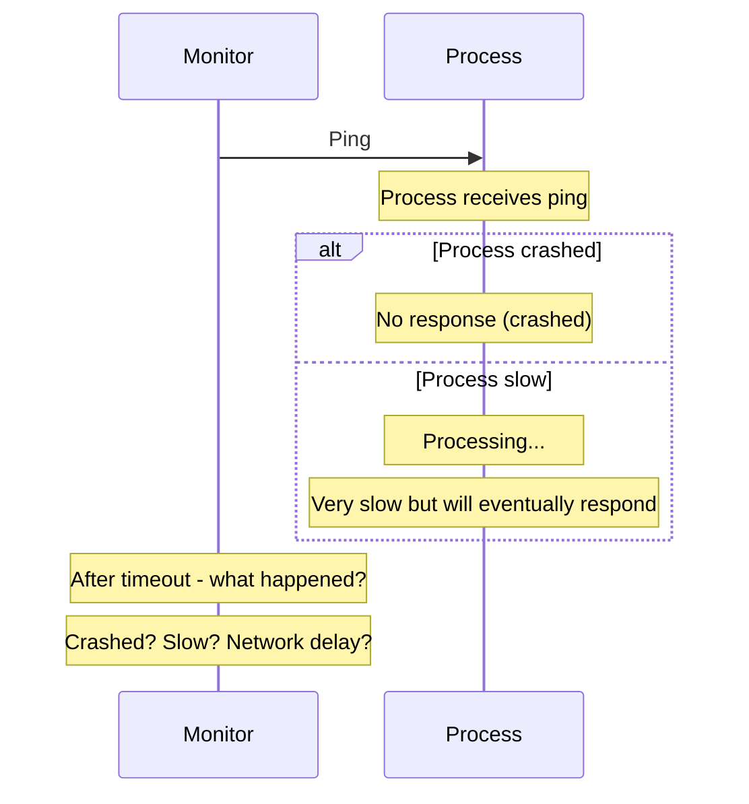
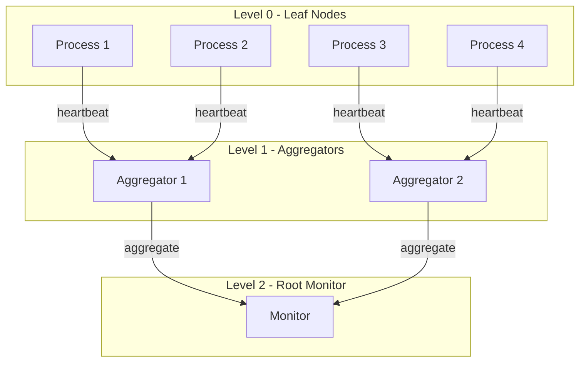
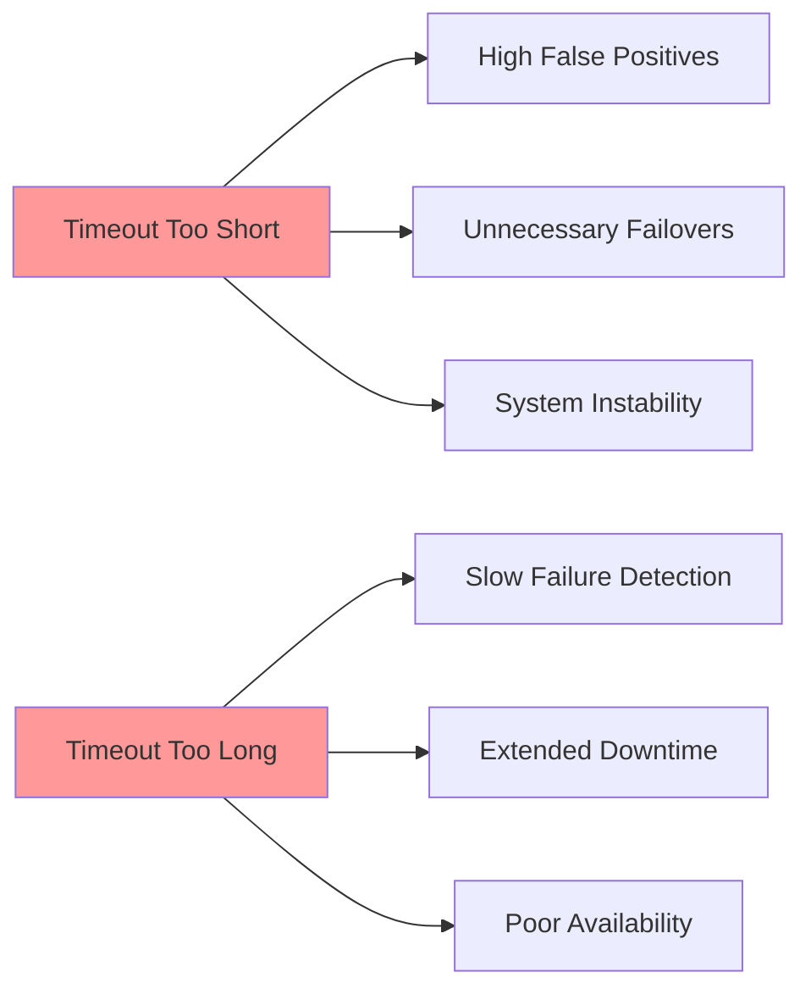
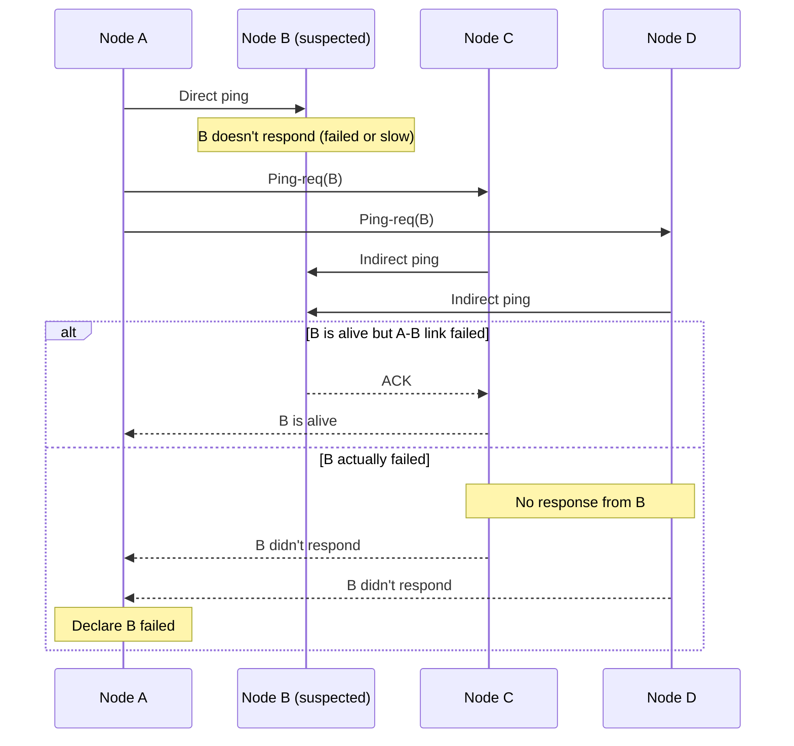

# Failure Detection

Failure detection is one of the most fundamental and challenging problems in distributed systems. The ability to detect when a process has failed is crucial for implementing fault tolerance, but the inherent uncertainty of asynchronous networks makes perfect failure detection impossible. This chapter explores practical failure detection mechanisms that balance the competing goals of quick detection and low false positive rates.

## The Impossibility of Perfect Failure Detection

In asynchronous distributed systems, it is impossible to distinguish between a crashed process and one that is merely slow or temporarily disconnected.

### The FLP Impossibility Result

The Fischer-Lynch-Paterson (FLP) impossibility theorem proves that in an asynchronous system with even one process failure, there is no deterministic algorithm that guarantees consensus in bounded time. This has direct implications for failure detection.

**Why perfect failure detection is impossible:**



The monitor cannot distinguish between:
1. Process crashed and will never respond
2. Process is slow but will eventually respond
3. Network is delayed but message will arrive

### Properties of Failure Detectors

Since perfect failure detection is impossible, we define two key properties:

**Completeness:** Every crashed process is eventually suspected
$$
\forall p: \text{crashed}(p) \implies \Diamond\text{suspected}(p)
$$

**Accuracy:** No correct process is ever suspected
$$
\forall p: \neg\text{crashed}(p) \implies \neg\text{suspected}(p)
$$

In practice, we must make tradeoffs:
- **Strong completeness** vs **weak completeness**
- **Strong accuracy** vs **weak accuracy** vs **eventual accuracy**

## Heartbeat-Based Failure Detection

Heartbeats are the most common failure detection mechanism. Processes periodically send "I'm alive" messages to monitors.

### Basic Heartbeat Protocol

```javascript
class HeartbeatSender {
  constructor(interval = 1000) {
    this.interval = interval;
    this.running = false;
  }

  start(monitors) {
    this.running = true;
    this.sendHeartbeats(monitors);
  }

  async sendHeartbeats(monitors) {
    while (this.running) {
      const heartbeat = {
        sender: this.id,
        timestamp: Date.now(),
        sequenceNumber: this.sequence++
      };

      for (const monitor of monitors) {
        try {
          await monitor.receiveHeartbeat(heartbeat);
        } catch (error) {
          console.log(`Failed to send heartbeat to ${monitor.id}`);
        }
      }

      await this.sleep(this.interval);
    }
  }

  stop() {
    this.running = false;
  }
}

class HeartbeatMonitor {
  constructor(timeout = 5000) {
    this.timeout = timeout;
    this.lastHeartbeat = new Map();  // process ID → timestamp
    this.suspected = new Set();
  }

  receiveHeartbeat(heartbeat) {
    const processId = heartbeat.sender;
    this.lastHeartbeat.set(processId, Date.now());

    // Un-suspect if previously suspected
    if (this.suspected.has(processId)) {
      this.suspected.delete(processId);
      this.onRecover(processId);
    }
  }

  startMonitoring() {
    setInterval(() => {
      const now = Date.now();

      for (const [processId, lastSeen] of this.lastHeartbeat) {
        if (now - lastSeen > this.timeout) {
          if (!this.suspected.has(processId)) {
            this.suspected.add(processId);
            this.onSuspect(processId);
          }
        }
      }
    }, 1000);
  }

  onSuspect(processId) {
    console.log(`Suspected failure: ${processId}`);
  }

  onRecover(processId) {
    console.log(`Process recovered: ${processId}`);
  }
}
```

### Push vs Pull Heartbeats

**Push (active heartbeats):** Monitored process sends heartbeats
```javascript
// Process actively sends heartbeats
class PushHeartbeat {
  async send() {
    await monitor.heartbeat(this.id, Date.now());
  }
}
```

**Pull (ping-ack):** Monitor pings, process responds
```javascript
class PullHeartbeat {
  async monitor(process) {
    try {
      await process.ping();
      this.markAlive(process.id);
    } catch (error) {
      this.markSuspected(process.id);
    }
  }
}
```

**Comparison:**

| Aspect | Push | Pull |
|--------|------|------|
| **Network load** | Higher (continuous messages) | Lower (only when checking) |
| **Detection latency** | Lower (immediate timeout) | Higher (wait for next ping) |
| **Scalability** | Better (no polling) | Worse (must ping all) |
| **Common use** | Large-scale systems | Small clusters |

### Adaptive Timeouts

Fixed timeouts are problematic because network conditions vary. Adaptive timeouts adjust based on observed latencies:

```javascript
class AdaptiveHeartbeatMonitor {
  constructor(initialTimeout = 5000) {
    this.baseTimeout = initialTimeout;
    this.latencies = new Map();  // process ID → [recent latencies]
    this.windowSize = 100;
  }

  receiveHeartbeat(heartbeat) {
    const sent = heartbeat.timestamp;
    const received = Date.now();
    const latency = received - sent;

    // Track latency history
    if (!this.latencies.has(heartbeat.sender)) {
      this.latencies.set(heartbeat.sender, []);
    }

    const history = this.latencies.get(heartbeat.sender);
    history.push(latency);

    // Keep only recent history
    if (history.length > this.windowSize) {
      history.shift();
    }

    this.lastHeartbeat.set(heartbeat.sender, received);
  }

  getTimeout(processId) {
    const history = this.latencies.get(processId);
    if (!history || history.length < 10) {
      return this.baseTimeout;
    }

    // Calculate mean and standard deviation
    const mean = history.reduce((a, b) => a + b) / history.length;
    const variance = history.reduce((sum, val) =>
      sum + Math.pow(val - mean, 2), 0) / history.length;
    const stdDev = Math.sqrt(variance);

    // Timeout = mean + k * stdDev (typically k=3 for 99.7% coverage)
    return mean + 3 * stdDev;
  }

  checkTimeout(processId) {
    const lastSeen = this.lastHeartbeat.get(processId);
    const timeout = this.getTimeout(processId);

    return Date.now() - lastSeen > timeout;
  }
}
```

### Heartbeat Aggregation

In large systems, collecting heartbeats from all processes is expensive. Hierarchical aggregation reduces overhead:



```javascript
class HierarchicalMonitor {
  constructor(level, children) {
    this.level = level;
    this.children = children;
    this.childStatus = new Map();
  }

  receiveHeartbeat(childId, aliveProcesses) {
    // Child aggregator sends list of alive processes
    this.childStatus.set(childId, {
      timestamp: Date.now(),
      aliveProcesses
    });
  }

  getAggregatedStatus() {
    const allAlive = new Set();

    for (const [childId, status] of this.childStatus) {
      if (Date.now() - status.timestamp < this.timeout) {
        // Child is responsive
        for (const processId of status.aliveProcesses) {
          allAlive.add(processId);
        }
      }
    }

    return Array.from(allAlive);
  }

  async sendToParent(parent) {
    const status = this.getAggregatedStatus();
    await parent.receiveHeartbeat(this.id, status);
  }
}
```

## Timeout Strategies

Choosing appropriate timeouts is a critical design decision with fundamental tradeoffs.

### The Timeout Dilemma



### Fixed Timeout Strategy

Simple but inflexible:

```javascript
class FixedTimeout {
  constructor(timeout = 5000) {
    this.timeout = timeout;
  }

  isAlive(lastHeartbeat) {
    return Date.now() - lastHeartbeat < this.timeout;
  }
}

// Problems:
// - Doesn't adapt to network conditions
// - May be too aggressive in slow networks
// - May be too conservative in fast networks
```

### Progressive Timeout Strategy

Multiple timeout thresholds with different actions:

```javascript
class ProgressiveTimeout {
  constructor() {
    this.warningTimeout = 3000;
    this.suspectedTimeout = 5000;
    this.failedTimeout = 10000;
  }

  getStatus(lastHeartbeat) {
    const elapsed = Date.now() - lastHeartbeat;

    if (elapsed < this.warningTimeout) {
      return 'healthy';
    } else if (elapsed < this.suspectedTimeout) {
      return 'warning';  // Log, but don't act
    } else if (elapsed < this.failedTimeout) {
      return 'suspected';  // Reduce traffic to this node
    } else {
      return 'failed';  // Initiate failover
    }
  }
}
```

### Percentile-Based Timeouts

Set timeouts based on observed latency percentiles:

```javascript
class PercentileTimeout {
  constructor(percentile = 99) {
    this.percentile = percentile;
    this.latencyHistory = [];
  }

  recordLatency(latency) {
    this.latencyHistory.push(latency);

    // Keep last 1000 samples
    if (this.latencyHistory.length > 1000) {
      this.latencyHistory.shift();
    }
  }

  getTimeout() {
    if (this.latencyHistory.length < 30) {
      return 5000;  // Default until enough data
    }

    const sorted = [...this.latencyHistory].sort((a, b) => a - b);
    const index = Math.floor(sorted.length * (this.percentile / 100));
    const p99 = sorted[index];

    // Timeout = p99 + safety margin
    return p99 * 1.5;
  }
}
```

## Phi Accrual Failure Detector

The Phi accrual failure detector, used in systems like Apache Cassandra, provides a continuous suspicion level rather than a binary alive/dead judgment.

### Conceptual Foundation

Instead of outputting "alive" or "suspected," the Phi detector outputs a suspicion level $\phi$ that represents confidence in failure:

$$
\phi(t) = -\log_{10}(P(\text{heartbeat arrives} \mid \text{elapsed time} = t))
$$

Higher $\phi$ means higher confidence that the process has failed.

### Implementation

```javascript
class PhiAccrualFailureDetector {
  constructor(threshold = 8, maxSampleSize = 1000, minStdDev = 100) {
    this.threshold = threshold;
    this.maxSampleSize = maxSampleSize;
    this.minStdDev = minStdDev;

    this.intervals = [];  // Inter-arrival times
    this.lastHeartbeat = 0;
  }

  heartbeat(timestamp = Date.now()) {
    if (this.lastHeartbeat !== 0) {
      const interval = timestamp - this.lastHeartbeat;
      this.intervals.push(interval);

      if (this.intervals.length > this.maxSampleSize) {
        this.intervals.shift();
      }
    }

    this.lastHeartbeat = timestamp;
  }

  phi(timestamp = Date.now()) {
    if (this.lastHeartbeat === 0) {
      return 0;  // No data yet
    }

    const timeSinceLastHeartbeat = timestamp - this.lastHeartbeat;

    const mean = this.mean();
    const stdDev = Math.max(this.stdDev(), this.minStdDev);

    // Probability that heartbeat arrives
    const probability = this.cumulativeDistribution(
      timeSinceLastHeartbeat,
      mean,
      stdDev
    );

    // Phi = -log10(1 - probability)
    return -Math.log10(probability);
  }

  isSuspected(timestamp = Date.now()) {
    return this.phi(timestamp) > this.threshold;
  }

  mean() {
    if (this.intervals.length === 0) return 1000;
    return this.intervals.reduce((a, b) => a + b) / this.intervals.length;
  }

  stdDev() {
    if (this.intervals.length === 0) return 100;

    const mean = this.mean();
    const variance = this.intervals.reduce((sum, val) =>
      sum + Math.pow(val - mean, 2), 0) / this.intervals.length;

    return Math.sqrt(variance);
  }

  // Cumulative distribution function (assuming normal distribution)
  cumulativeDistribution(x, mean, stdDev) {
    const z = (x - mean) / stdDev;
    return 1 - this.normalCDF(z);
  }

  normalCDF(z) {
    // Approximation of standard normal CDF
    const t = 1 / (1 + 0.2316419 * Math.abs(z));
    const d = 0.3989423 * Math.exp(-z * z / 2);
    const probability = d * t * (0.3193815 + t * (-0.3565638 + t * (1.781478 + t * (-1.821256 + t * 1.330274))));

    return z > 0 ? 1 - probability : probability;
  }
}

// Usage
const detector = new PhiAccrualFailureDetector(8);

// Receive heartbeats
setInterval(() => detector.heartbeat(), 1000);

// Check suspicion level
setInterval(() => {
  const phi = detector.phi();
  console.log(`Phi: ${phi.toFixed(2)}`);

  if (phi > 8) {
    console.log('Process suspected as failed');
  } else if (phi > 5) {
    console.log('Process experiencing delays');
  }
}, 1000);
```

### Advantages of Phi Accrual

1. **Continuous suspicion level:** Not just binary alive/dead
2. **Adaptive:** Learns from heartbeat history
3. **Tunable:** Adjust threshold based on application needs
4. **Handles variance:** Adapts to networks with variable latency

### Phi Interpretation

| Phi Value | Interpretation | Probability of Failure |
|-----------|----------------|------------------------|
| 0 | No suspicion | ~0% |
| 1 | Low suspicion | ~10% |
| 2 | Moderate | ~1% |
| 3 | High | ~0.1% |
| 8 | Very high (default threshold) | ~0.00001% |
| 10 | Extremely high | ~0.0000001% |

## Gossip-Based Failure Detection

Gossip protocols distribute failure detection across all nodes, avoiding centralized monitors.

### SWIM (Scalable Weakly-consistent Infection-style Process Group Membership)

SWIM combines direct probing with indirect probing to reduce false positives:



```javascript
class SWIMFailureDetector {
  constructor(nodeId, allNodes, pingTimeout = 1000) {
    this.nodeId = nodeId;
    this.allNodes = allNodes;
    this.pingTimeout = pingTimeout;
    this.suspected = new Set();
    this.failed = new Set();
  }

  async startProtocol() {
    setInterval(() => this.protocolPeriod(), 1000);
  }

  async protocolPeriod() {
    // Select random node to probe
    const target = this.selectRandomNode();

    // Direct ping
    try {
      await this.ping(target, this.pingTimeout);
      // Success - target is alive
      this.markAlive(target);
      return;
    } catch (error) {
      // Direct ping failed - try indirect ping
      await this.indirectPing(target);
    }
  }

  async indirectPing(target) {
    // Select k random nodes for indirect probing
    const proxies = this.selectRandomNodes(3, [target, this.nodeId]);

    const results = await Promise.allSettled(
      proxies.map(proxy =>
        this.requestProxyPing(proxy, target)
      )
    );

    // If any proxy got response, target is alive
    const anySuccess = results.some(r => r.status === 'fulfilled' && r.value);

    if (anySuccess) {
      this.markAlive(target);
    } else {
      this.markSuspected(target);
    }
  }

  async requestProxyPing(proxy, target) {
    // Ask proxy to ping target
    return await proxy.sendPingRequest(target);
  }

  markSuspected(nodeId) {
    if (!this.suspected.has(nodeId)) {
      this.suspected.add(nodeId);
      console.log(`Node ${nodeId} suspected`);

      // After timeout, mark as failed
      setTimeout(() => {
        if (this.suspected.has(nodeId)) {
          this.markFailed(nodeId);
        }
      }, 5000);
    }
  }

  markFailed(nodeId) {
    this.suspected.delete(nodeId);
    this.failed.add(nodeId);
    console.log(`Node ${nodeId} declared failed`);
  }

  markAlive(nodeId) {
    this.suspected.delete(nodeId);
    this.failed.delete(nodeId);
  }

  selectRandomNode() {
    const available = this.allNodes.filter(n =>
      n !== this.nodeId && !this.failed.has(n)
    );
    return available[Math.floor(Math.random() * available.length)];
  }

  selectRandomNodes(k, exclude = []) {
    const available = this.allNodes.filter(n => !exclude.includes(n));
    const shuffled = available.sort(() => Math.random() - 0.5);
    return shuffled.slice(0, k);
  }
}
```

### Gossip Membership Propagation

Failed node information spreads through gossip:

```javascript
class GossipMembership {
  constructor(nodeId, allNodes) {
    this.nodeId = nodeId;
    this.members = new Map();  // nodeId → { status, incarnation }

    // Initialize all nodes as alive
    for (const node of allNodes) {
      this.members.set(node, {
        status: 'alive',
        incarnation: 0,
        timestamp: Date.now()
      });
    }
  }

  async gossipPeriod() {
    // Select random subset of nodes
    const targets = this.selectGossipTargets(3);

    for (const target of targets) {
      await this.gossipTo(target);
    }
  }

  async gossipTo(target) {
    const myView = this.getRecentUpdates();

    try {
      const theirView = await target.exchange(myView);
      this.mergeUpdates(theirView);
    } catch (error) {
      // Target unreachable
      this.markSuspected(target.id);
    }
  }

  mergeUpdates(updates) {
    for (const [nodeId, info] of updates) {
      const current = this.members.get(nodeId);

      if (!current || info.incarnation > current.incarnation) {
        // Newer information
        this.members.set(nodeId, info);

        if (info.status === 'failed') {
          this.onNodeFailed(nodeId);
        }
      }
    }
  }

  markSuspected(nodeId) {
    const current = this.members.get(nodeId);
    if (current && current.status === 'alive') {
      this.members.set(nodeId, {
        status: 'suspected',
        incarnation: current.incarnation + 1,
        timestamp: Date.now()
      });
    }
  }

  selectGossipTargets(fanout) {
    const alive = Array.from(this.members.entries())
      .filter(([id, info]) => info.status === 'alive' && id !== this.nodeId)
      .map(([id, _]) => id);

    return this.sample(alive, fanout);
  }

  sample(array, k) {
    const shuffled = array.sort(() => Math.random() - 0.5);
    return shuffled.slice(0, k);
  }
}
```

### Benefits of Gossip-Based Detection

- **Decentralized:** No single point of failure
- **Scalable:** Communication per node is constant
- **Robust:** Tolerates message loss and network partitions
- **Eventually consistent:** All nodes eventually learn of failures

## Practical Considerations

### False Positives vs False Negatives

```javascript
class TunableFailureDetector {
  constructor() {
    this.conservativeMode = false;  // Avoid false positives
  }

  setConservative(enabled) {
    this.conservativeMode = enabled;

    if (enabled) {
      // Longer timeouts, require multiple confirmations
      this.timeout = 30000;
      this.confirmations = 3;
    } else {
      // Faster detection, tolerate some false positives
      this.timeout = 3000;
      this.confirmations = 1;
    }
  }
}
```

### Network Partition Handling

During network partitions, failure detectors may falsely suspect healthy nodes:

```javascript
class PartitionAwareDetector {
  async checkNetworkHealth() {
    const reachable = await this.pingMultipleNodes();

    if (reachable.length < this.quorumSize) {
      // Possibly in minority partition
      // Be conservative about declaring failures
      this.enterSafeMode();
    }
  }

  enterSafeMode() {
    // Increase timeouts, require more confirmations
    this.timeout *= 2;
    console.log('Entering safe mode due to possible partition');
  }
}
```

Failure detection remains an active research area with practical implementations that must carefully balance detection speed, accuracy, and resource overhead. Understanding these tradeoffs is essential for building reliable distributed systems.
