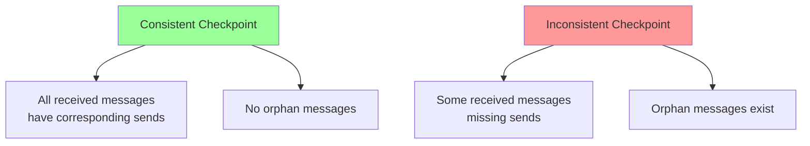
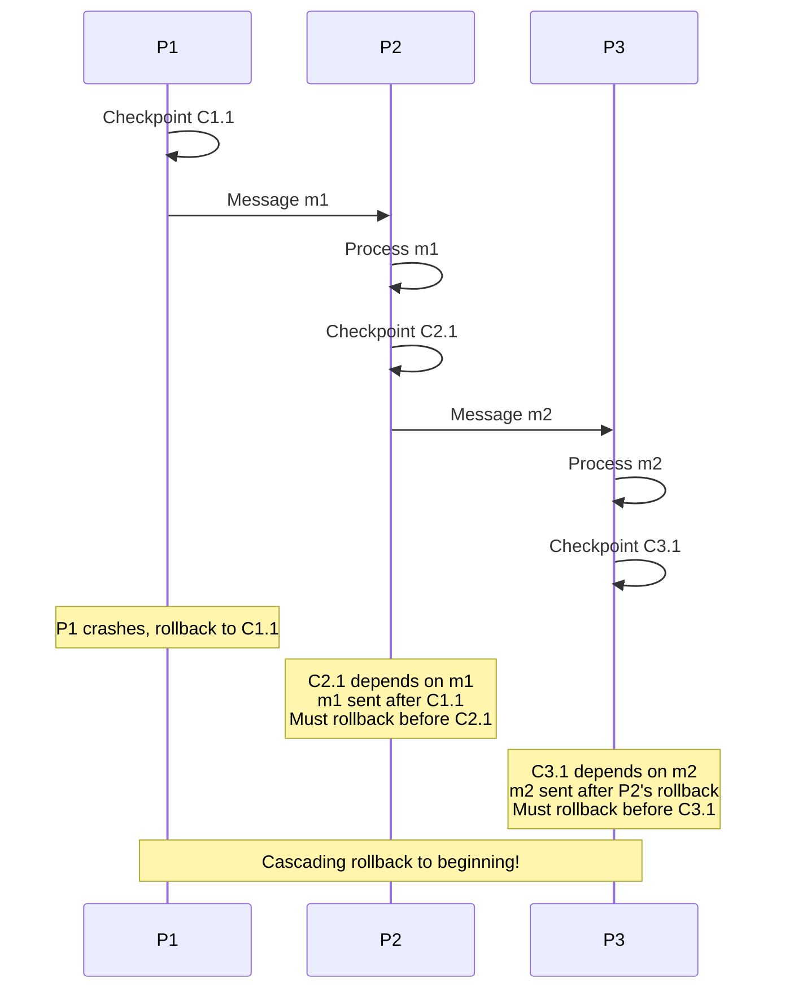
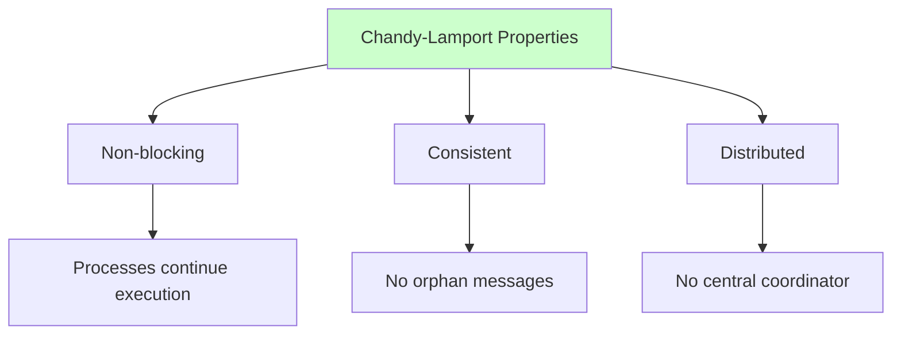

# Checkpointing

Checkpointing is the process of periodically saving the state of a distributed system to stable storage, enabling recovery to a known consistent state after failures. While conceptually simple, checkpointing in distributed systems involves complex tradeoffs between consistency, performance, and storage overhead. This chapter explores various checkpointing strategies and their practical implications.

## Fundamentals of Checkpointing

A checkpoint represents a snapshot of system state at a specific point in time that can be used as a recovery point.

### What to Checkpoint

A complete checkpoint includes:

```javascript
class Checkpoint {
  constructor(processId) {
    this.processId = processId;
    this.timestamp = Date.now();
    this.components = {
      // Application state
      applicationState: {},

      // Process metadata
      metadata: {
        processId,
        version: 0,
        sequenceNumber: 0
      },

      // Communication state
      messageQueue: [],
      sentMessages: new Map(),
      receivedMessages: new Map(),

      // Dependencies
      vectorClock: [],
      causalDependencies: []
    };
  }

  capture(process) {
    // Capture application state
    this.components.applicationState = this.serializeState(process.state);

    // Capture message queues
    this.components.messageQueue = [...process.incomingQueue];

    // Capture vector clock for causal ordering
    this.components.vectorClock = [...process.vectorClock];

    // Capture sent/received message counts
    this.components.metadata.sequenceNumber = process.messageCount;

    return this;
  }

  serializeState(state) {
    return JSON.parse(JSON.stringify(state));
  }

  async persist() {
    const data = JSON.stringify(this.components);
    await storage.write(`/checkpoints/${this.processId}/${this.timestamp}`, data);
  }

  static async load(processId, timestamp) {
    const data = await storage.read(`/checkpoints/${processId}/${timestamp}`);
    const checkpoint = new Checkpoint(processId);
    checkpoint.components = JSON.parse(data);
    return checkpoint;
  }
}
```

### Checkpoint Properties

**Consistency:** A set of checkpoints forms a **consistent global state** if:

$$
\forall \text{ messages } m: \text{receive}(m) \in \text{checkpoint} \implies \text{send}(m) \in \text{checkpoint}
$$

No checkpoint contains a message receipt without the corresponding send.



## Uncoordinated Checkpointing

Each process checkpoints independently without coordinating with others.

### Basic Algorithm

```javascript
class UncoordinatedCheckpointing {
  constructor(processId, checkpointInterval = 60000) {
    this.processId = processId;
    this.checkpointInterval = checkpointInterval;
    this.checkpoints = [];
    this.state = {};
    this.messageCount = 0;
  }

  start() {
    // Periodically save checkpoints
    this.checkpointTimer = setInterval(() => {
      this.takeCheckpoint();
    }, this.checkpointInterval);
  }

  async takeCheckpoint() {
    const checkpoint = new Checkpoint(this.processId);
    checkpoint.capture(this);

    await checkpoint.persist();

    this.checkpoints.push(checkpoint);

    console.log(`Process ${this.processId} checkpoint ${checkpoint.timestamp} saved`);

    // Garbage collect old checkpoints
    this.cleanOldCheckpoints();
  }

  cleanOldCheckpoints() {
    const keepCount = 5;
    if (this.checkpoints.length > keepCount) {
      this.checkpoints = this.checkpoints.slice(-keepCount);
    }
  }

  async recover() {
    if (this.checkpoints.length === 0) {
      console.log('No checkpoints available');
      return;
    }

    // Restore from most recent checkpoint
    const latest = this.checkpoints[this.checkpoints.length - 1];
    this.state = latest.components.applicationState;
    this.messageCount = latest.components.metadata.sequenceNumber;

    console.log(`Recovered to checkpoint ${latest.timestamp}`);
  }
}
```

### Advantages

1. **No coordination overhead:** Each process operates independently
2. **Low latency:** No waiting for other processes
3. **Simple implementation:** Each process manages its own checkpoints

### The Domino Effect

The critical problem with uncoordinated checkpointing:



### Domino Effect Mitigation

**Message logging** prevents the domino effect:

```javascript
class LoggedUncoordinatedCheckpointing {
  constructor(processId) {
    this.processId = processId;
    this.messageLog = [];
    this.state = {};
  }

  async receiveMessage(message) {
    // Log message BEFORE processing
    await this.logMessage(message);

    // Process message
    await this.processMessage(message);
  }

  async logMessage(message) {
    const logEntry = {
      messageId: message.id,
      sender: message.sender,
      content: message.content,
      timestamp: Date.now(),
      vectorClock: message.vectorClock
    };

    this.messageLog.push(logEntry);
    await this.persistLog(logEntry);
  }

  async recover() {
    // Restore from checkpoint
    const checkpoint = await this.loadCheckpoint();
    this.state = checkpoint.state;

    // Replay logged messages since checkpoint
    const messagesToReplay = this.messageLog.filter(
      msg => msg.timestamp > checkpoint.timestamp
    );

    for (const message of messagesToReplay) {
      await this.processMessage(message);
    }
  }

  async persistLog(entry) {
    await storage.append(`/logs/${this.processId}/messages`, entry);
  }
}
```

## Coordinated Checkpointing

Processes coordinate to create a globally consistent checkpoint.

### Two-Phase Coordinated Checkpoint

```javascript
class CoordinatedCheckpointCoordinator {
  constructor(processes) {
    this.processes = processes;
    this.checkpointVersion = 0;
  }

  async initiateCheckpoint() {
    this.checkpointVersion++;
    const version = this.checkpointVersion;

    console.log(`=== Starting coordinated checkpoint ${version} ===`);

    try {
      // Phase 1: Request preparation
      await this.phaseOne(version);

      // Phase 2: Commit checkpoint
      await this.phaseTwo(version);

      console.log(`=== Checkpoint ${version} completed successfully ===`);
    } catch (error) {
      console.error(`Checkpoint ${version} failed:`, error);
      await this.abort(version);
    }
  }

  async phaseOne(version) {
    console.log(`Phase 1: Requesting checkpoint preparation`);

    const prepareRequests = this.processes.map(async (process) => {
      const response = await process.prepareCheckpoint(version);
      if (response.status !== 'prepared') {
        throw new Error(`Process ${process.id} failed to prepare`);
      }
      return response;
    });

    await Promise.all(prepareRequests);
    console.log(`Phase 1: All processes prepared`);
  }

  async phaseTwo(version) {
    console.log(`Phase 2: Committing checkpoint`);

    const commitRequests = this.processes.map(async (process) => {
      await process.commitCheckpoint(version);
    });

    await Promise.all(commitRequests);
    console.log(`Phase 2: All processes committed`);
  }

  async abort(version) {
    console.log(`Aborting checkpoint ${version}`);

    const abortRequests = this.processes.map(async (process) => {
      await process.abortCheckpoint(version);
    });

    await Promise.all(abortRequests);
  }
}

class CoordinatedCheckpointProcess {
  constructor(processId) {
    this.processId = processId;
    this.state = {};
    this.tentativeCheckpoint = null;
    this.committedCheckpoints = [];
  }

  async prepareCheckpoint(version) {
    console.log(`Process ${this.processId}: Preparing checkpoint ${version}`);

    // Stop accepting new messages temporarily
    this.pauseProcessing();

    // Flush any pending messages
    await this.flushMessages();

    // Create tentative checkpoint
    this.tentativeCheckpoint = {
      version,
      state: this.deepCopy(this.state),
      timestamp: Date.now(),
      messageCount: this.messagesSent
    };

    return { status: 'prepared', processId: this.processId };
  }

  async commitCheckpoint(version) {
    if (!this.tentativeCheckpoint || this.tentativeCheckpoint.version !== version) {
      throw new Error(`No tentative checkpoint for version ${version}`);
    }

    console.log(`Process ${this.processId}: Committing checkpoint ${version}`);

    // Persist checkpoint to stable storage
    await this.persistCheckpoint(this.tentativeCheckpoint);

    // Move from tentative to committed
    this.committedCheckpoints.push(this.tentativeCheckpoint);
    this.tentativeCheckpoint = null;

    // Resume normal processing
    this.resumeProcessing();

    console.log(`Process ${this.processId}: Checkpoint ${version} committed`);
  }

  async abortCheckpoint(version) {
    console.log(`Process ${this.processId}: Aborting checkpoint ${version}`);

    this.tentativeCheckpoint = null;
    this.resumeProcessing();
  }

  pauseProcessing() {
    this.paused = true;
  }

  resumeProcessing() {
    this.paused = false;
  }

  deepCopy(obj) {
    return JSON.parse(JSON.stringify(obj));
  }

  async flushMessages() {
    // Ensure all pending sends complete
    await this.waitForPendingSends();
  }
}
```

### Chandy-Lamport Snapshot Algorithm

The Chandy-Lamport algorithm creates a consistent global snapshot without stopping execution:

```javascript
class ChandyLamportSnapshot {
  constructor(processId, channels) {
    this.processId = processId;
    this.channels = channels;  // Map: processId → channel
    this.state = {};

    this.snapshotInProgress = false;
    this.markersSent = new Set();
    this.markersReceived = new Set();
    this.channelStates = new Map();
  }

  async initiateSnapshot() {
    console.log(`Process ${this.processId} initiating snapshot`);

    // Record local state
    this.snapshotState = this.deepCopy(this.state);
    this.snapshotInProgress = true;

    // Send marker on all outgoing channels
    for (const [targetId, channel] of this.channels) {
      await this.sendMarker(channel, targetId);
      this.markersSent.add(targetId);

      // Start recording messages on this channel
      this.channelStates.set(targetId, []);
    }
  }

  async receiveMarker(senderId, channel) {
    if (!this.snapshotInProgress) {
      // First marker received - initiate snapshot
      await this.initiateSnapshot();
    }

    if (!this.markersReceived.has(senderId)) {
      // First marker from this sender
      this.markersReceived.add(senderId);

      // Stop recording on this channel
      const channelState = this.channelStates.get(senderId) || [];
      console.log(`Channel ${senderId}->${this.processId} state: ${channelState.length} messages`);
    }

    // Check if snapshot complete
    if (this.markersReceived.size === this.channels.size) {
      await this.finalizeSnapshot();
    }
  }

  async receiveMessage(senderId, message) {
    if (this.snapshotInProgress &&
        !this.markersReceived.has(senderId)) {
      // Record message in channel state
      this.channelStates.get(senderId).push(message);
    }

    // Process message normally
    await this.processMessage(message);
  }

  async sendMarker(channel, targetId) {
    await channel.send({
      type: 'MARKER',
      snapshotId: this.snapshotId,
      sender: this.processId
    });
  }

  async finalizeSnapshot() {
    console.log(`Process ${this.processId} snapshot complete`);

    const snapshot = {
      processId: this.processId,
      state: this.snapshotState,
      channels: Object.fromEntries(this.channelStates),
      timestamp: Date.now()
    };

    await this.persistSnapshot(snapshot);
    this.snapshotInProgress = false;
  }

  deepCopy(obj) {
    return JSON.parse(JSON.stringify(obj));
  }
}
```

### Properties of Chandy-Lamport

**Advantages:**
- No process suspension required
- Creates consistent global snapshot
- Minimal interference with normal execution

**Guarantees:**
$$
\forall \text{ message } m: \text{receive}(m) \in \text{snapshot} \implies \text{send}(m) \in \text{snapshot}
$$



## Incremental Checkpointing

Instead of saving full state, save only changes since the last checkpoint.

### Copy-on-Write Checkpointing

```javascript
class IncrementalCheckpoint {
  constructor(processId) {
    this.processId = processId;
    this.baseCheckpoint = null;
    this.dirtyPages = new Set();
    this.pageSize = 4096;  // bytes
    this.state = new Map();
  }

  async takeFullCheckpoint() {
    console.log('Taking full checkpoint');

    this.baseCheckpoint = {
      timestamp: Date.now(),
      state: this.deepCopy(this.state),
      version: (this.baseCheckpoint?.version || 0) + 1
    };

    await this.persistCheckpoint(this.baseCheckpoint);

    // Clear dirty tracking
    this.dirtyPages.clear();
  }

  async takeIncrementalCheckpoint() {
    if (!this.baseCheckpoint) {
      return await this.takeFullCheckpoint();
    }

    console.log(`Taking incremental checkpoint (${this.dirtyPages.size} dirty pages)`);

    const incrementalData = {
      baseVersion: this.baseCheckpoint.version,
      timestamp: Date.now(),
      changes: this.getChanges()
    };

    await this.persistIncremental(incrementalData);

    // Clear dirty tracking
    this.dirtyPages.clear();
  }

  write(key, value) {
    this.state.set(key, value);

    // Mark page as dirty
    const pageId = this.getPageId(key);
    this.dirtyPages.add(pageId);
  }

  getChanges() {
    const changes = new Map();

    for (const pageId of this.dirtyPages) {
      const pageKeys = this.getKeysInPage(pageId);

      for (const key of pageKeys) {
        changes.set(key, this.state.get(key));
      }
    }

    return Object.fromEntries(changes);
  }

  async recover() {
    // Load base checkpoint
    this.baseCheckpoint = await this.loadBaseCheckpoint();
    this.state = new Map(Object.entries(this.baseCheckpoint.state));

    // Apply incremental checkpoints in order
    const incrementals = await this.loadIncrementalCheckpoints(
      this.baseCheckpoint.version
    );

    for (const incr of incrementals) {
      for (const [key, value] of Object.entries(incr.changes)) {
        this.state.set(key, value);
      }
    }

    console.log('Recovery from incremental checkpoints complete');
  }

  getPageId(key) {
    const hash = this.hashCode(key);
    return Math.floor(hash / this.pageSize);
  }

  getKeysInPage(pageId) {
    return Array.from(this.state.keys()).filter(
      key => this.getPageId(key) === pageId
    );
  }

  hashCode(str) {
    let hash = 0;
    for (let i = 0; i < str.length; i++) {
      hash = ((hash << 5) - hash) + str.charCodeAt(i);
      hash |= 0;
    }
    return Math.abs(hash);
  }

  deepCopy(map) {
    return JSON.parse(JSON.stringify(Object.fromEntries(map)));
  }
}
```

### Delta Checkpointing

Save only the difference (delta) from the previous checkpoint:

```javascript
class DeltaCheckpointing {
  constructor(processId) {
    this.processId = processId;
    this.checkpoints = [];
    this.state = {};
  }

  async takeCheckpoint() {
    const previousCheckpoint = this.checkpoints[this.checkpoints.length - 1];

    if (!previousCheckpoint) {
      // First checkpoint - save full state
      return await this.takeFullCheckpoint();
    }

    // Compute delta
    const delta = this.computeDelta(previousCheckpoint.state, this.state);

    const checkpoint = {
      type: 'delta',
      timestamp: Date.now(),
      baseVersion: previousCheckpoint.version,
      version: previousCheckpoint.version + 1,
      delta
    };

    await this.persistCheckpoint(checkpoint);
    this.checkpoints.push(checkpoint);

    console.log(`Delta checkpoint: ${Object.keys(delta.modified).length} modifications`);
  }

  computeDelta(oldState, newState) {
    const delta = {
      added: {},
      modified: {},
      deleted: []
    };

    // Find additions and modifications
    for (const [key, value] of Object.entries(newState)) {
      if (!(key in oldState)) {
        delta.added[key] = value;
      } else if (oldState[key] !== value) {
        delta.modified[key] = value;
      }
    }

    // Find deletions
    for (const key of Object.keys(oldState)) {
      if (!(key in newState)) {
        delta.deleted.push(key);
      }
    }

    return delta;
  }

  async recover() {
    // Find base (full) checkpoint
    const baseIndex = this.checkpoints.findIndex(cp => cp.type === 'full');
    if (baseIndex === -1) {
      throw new Error('No base checkpoint found');
    }

    let state = { ...this.checkpoints[baseIndex].state };

    // Apply deltas in sequence
    for (let i = baseIndex + 1; i < this.checkpoints.length; i++) {
      const checkpoint = this.checkpoints[i];

      if (checkpoint.type === 'delta') {
        state = this.applyDelta(state, checkpoint.delta);
      }
    }

    this.state = state;
    console.log('Recovery from delta checkpoints complete');
  }

  applyDelta(state, delta) {
    const newState = { ...state };

    // Apply additions
    Object.assign(newState, delta.added);

    // Apply modifications
    Object.assign(newState, delta.modified);

    // Apply deletions
    for (const key of delta.deleted) {
      delete newState[key];
    }

    return newState;
  }

  async takeFullCheckpoint() {
    const checkpoint = {
      type: 'full',
      timestamp: Date.now(),
      version: this.checkpoints.length,
      state: { ...this.state }
    };

    await this.persistCheckpoint(checkpoint);
    this.checkpoints.push(checkpoint);

    console.log('Full checkpoint taken');
  }
}
```

## Checkpoint Optimization Strategies

### Adaptive Checkpointing

Adjust checkpoint frequency based on system conditions:

```javascript
class AdaptiveCheckpointing {
  constructor(processId) {
    this.processId = processId;
    this.minInterval = 10000;   // 10 seconds
    this.maxInterval = 300000;  // 5 minutes
    this.currentInterval = 60000;  // Start at 1 minute

    this.failureRate = 0;
    this.checkpointCost = 0;
  }

  async start() {
    setInterval(() => {
      this.adjustInterval();
      this.takeCheckpoint();
    }, this.currentInterval);
  }

  adjustInterval() {
    // Increase frequency if failure rate is high
    if (this.failureRate > 0.1) {  // > 10% failure rate
      this.currentInterval = Math.max(
        this.minInterval,
        this.currentInterval * 0.8
      );
    }
    // Decrease frequency if failure rate is low and cost is high
    else if (this.failureRate < 0.01 && this.checkpointCost > 1000) {
      this.currentInterval = Math.min(
        this.maxInterval,
        this.currentInterval * 1.2
      );
    }

    console.log(`Adjusted checkpoint interval to ${this.currentInterval}ms`);
  }

  async takeCheckpoint() {
    const startTime = Date.now();

    // Perform checkpoint
    await this.performCheckpoint();

    // Measure cost
    this.checkpointCost = Date.now() - startTime;
  }

  recordFailure() {
    this.failureRate = (this.failureRate * 0.9) + 0.1;  // Exponential moving average
  }

  recordSuccess() {
    this.failureRate = this.failureRate * 0.95;
  }
}
```

### Garbage Collection of Old Checkpoints

```javascript
class CheckpointGC {
  constructor(retention = 86400000) {  // 24 hours
    this.retention = retention;
    this.checkpoints = [];
  }

  addCheckpoint(checkpoint) {
    this.checkpoints.push(checkpoint);
    this.gc();
  }

  gc() {
    const cutoff = Date.now() - this.retention;

    // Keep at least the 3 most recent checkpoints
    const keep = [];
    const sorted = this.checkpoints.sort((a, b) => b.timestamp - a.timestamp);

    for (let i = 0; i < sorted.length; i++) {
      if (i < 3 || sorted[i].timestamp > cutoff) {
        keep.push(sorted[i]);
      } else {
        this.deleteCheckpoint(sorted[i]);
      }
    }

    this.checkpoints = keep;
  }

  async deleteCheckpoint(checkpoint) {
    await storage.delete(`/checkpoints/${checkpoint.id}`);
    console.log(`Deleted old checkpoint ${checkpoint.id}`);
  }
}
```

Checkpointing is a fundamental technique for fault tolerance in distributed systems. The choice between coordinated and uncoordinated, full and incremental checkpoints depends on application requirements, failure patterns, and performance constraints.
