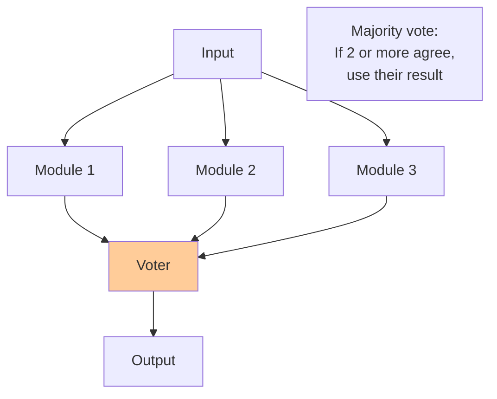

# Replication for Fault Tolerance

Replication is the cornerstone technique for achieving fault tolerance in distributed systems. By maintaining multiple copies of data and computation across independent failure domains, systems can continue operating correctly despite individual component failures. This chapter explores how replication provides fault tolerance through redundancy, voting, and state machine replication.

## N-Modular Redundancy

N-Modular Redundancy (NMR) is a technique where N identical components perform the same computation, and their outputs are compared using a voter to mask failures.

### Triple Modular Redundancy (TMR)

The most common form is TMR, where three components vote on the result:



```javascript
class TripleModularRedundancy {
  constructor(module1, module2, module3) {
    this.modules = [module1, module2, module3];
  }

  async compute(input) {
    // Execute on all three modules in parallel
    const results = await Promise.allSettled(
      this.modules.map(m => m.compute(input))
    );

    // Extract successful results
    const outputs = results
      .filter(r => r.status === 'fulfilled')
      .map(r => r.value);

    if (outputs.length === 0) {
      throw new Error('All modules failed');
    }

    // Vote on result
    return this.majorityVote(outputs);
  }

  majorityVote(outputs) {
    // Count occurrences of each output
    const counts = new Map();

    for (const output of outputs) {
      const key = JSON.stringify(output);
      counts.set(key, (counts.get(key) || 0) + 1);
    }

    // Find majority (at least 2 out of 3)
    for (const [output, count] of counts) {
      if (count >= 2) {
        return JSON.parse(output);
      }
    }

    // No majority - all modules disagree
    throw new Error('No majority agreement among modules');
  }
}

// Usage example
const tmr = new TripleModularRedundancy(
  new ComputeModule(1),
  new ComputeModule(2),
  new ComputeModule(3)
);

const result = await tmr.compute({ x: 5, y: 10 });
// If module 2 fails or returns wrong result,
// modules 1 and 3 form majority
```

### Fault Tolerance Analysis

TMR can tolerate $f = 1$ failure. Generally, NMR requires:

$$
N \geq 2f + 1
$$

To tolerate $f$ crash failures with majority voting.

For Byzantine failures:

$$
N \geq 3f + 1
$$

**Availability improvement:**

If each module has reliability $R$, the system reliability is:

$$
R_{TMR} = R^3 + 3R^2(1-R) = 3R^2 - 2R^3
$$

For $R = 0.9$:
- Single module: 90% reliable
- TMR: $3(0.9)^2 - 2(0.9)^3 = 0.972$ = 97.2% reliable

### N-Version Programming

Different teams implement the same specification independently to avoid common-mode failures:

```javascript
class NVersionProgramming {
  constructor(implementations) {
    this.implementations = implementations;  // Different implementations of same spec
  }

  async execute(input) {
    // Run all implementations
    const results = await Promise.allSettled(
      this.implementations.map(impl => impl.run(input))
    );

    const outputs = results
      .filter(r => r.status === 'fulfilled')
      .map(r => r.value);

    // Use sophisticated voting (not just exact match)
    return this.vote(outputs);
  }

  vote(outputs) {
    // For numeric outputs, use median
    if (outputs.every(o => typeof o === 'number')) {
      return this.median(outputs);
    }

    // For other types, use exact majority
    return this.exactMajority(outputs);
  }

  median(numbers) {
    const sorted = numbers.sort((a, b) => a - b);
    const mid = Math.floor(sorted.length / 2);
    return sorted.length % 2 === 0
      ? (sorted[mid - 1] + sorted[mid]) / 2
      : sorted[mid];
  }

  exactMajority(values) {
    const counts = new Map();
    for (const value of values) {
      const key = JSON.stringify(value);
      counts.set(key, (counts.get(key) || 0) + 1);
    }

    for (const [value, count] of counts) {
      if (count > values.length / 2) {
        return JSON.parse(value);
      }
    }

    throw new Error('No majority');
  }
}
```

## Voting Mechanisms

Voting enables replicated systems to make decisions despite failures or disagreements.

### Quorum-Based Voting

A quorum is a minimum number of votes required to make a decision.

**Read/Write quorums:**

With $N$ replicas, $N_R$ read replicas, and $N_W$ write replicas:

$$
N_R + N_W > N
$$

$$
N_W > N/2
$$

These ensure reads see latest writes and prevent conflicting writes.

```javascript
class QuorumSystem {
  constructor(replicas, readQuorum, writeQuorum) {
    this.replicas = replicas;
    this.N = replicas.length;
    this.NR = readQuorum;
    this.NW = writeQuorum;

    // Verify quorum properties
    if (this.NR + this.NW <= this.N) {
      throw new Error('Read and write quorums must overlap');
    }
    if (this.NW <= this.N / 2) {
      throw new Error('Write quorum must be > N/2');
    }
  }

  async read(key) {
    // Read from NR replicas
    const responses = await this.readFromMultiple(key, this.NR);

    // Return value with highest version
    return this.selectLatest(responses);
  }

  async write(key, value) {
    const version = Date.now();  // Or use vector clock

    // Write to NW replicas
    const acks = await this.writeToMultiple(key, value, version, this.NW);

    if (acks.length >= this.NW) {
      return { success: true, version };
    }

    throw new Error('Failed to achieve write quorum');
  }

  async readFromMultiple(key, count) {
    const promises = this.replicas.map(r => r.read(key));
    const results = await Promise.allSettled(promises);

    const successful = results
      .filter(r => r.status === 'fulfilled')
      .map(r => r.value);

    if (successful.length < count) {
      throw new Error(`Only ${successful.length} reads succeeded, need ${count}`);
    }

    return successful.slice(0, count);
  }

  async writeToMultiple(key, value, version, count) {
    const promises = this.replicas.map(r =>
      r.write(key, value, version)
    );

    const results = await Promise.allSettled(promises);

    const acks = results.filter(r => r.status === 'fulfilled');

    return acks.slice(0, Math.min(acks.length, count));
  }

  selectLatest(responses) {
    let latest = responses[0];

    for (const response of responses) {
      if (response.version > latest.version) {
        latest = response;
      }
    }

    return latest.value;
  }
}

// Example configurations
const highAvailability = new QuorumSystem(
  replicas,
  1,  // Read from 1 (fast reads)
  5   // Write to 5 (strong durability)
);

const balanced = new QuorumSystem(
  replicas,
  3,  // Read from 3
  3   // Write to 3
);
```

### Weighted Voting

Assign different weights to replicas based on reliability or capacity:

```javascript
class WeightedVoting {
  constructor(replicas, weights) {
    this.replicas = replicas;
    this.weights = weights;  // Map: replicaId → weight
    this.totalWeight = Array.from(weights.values()).reduce((a, b) => a + b, 0);
  }

  async read(key) {
    const responses = await this.gatherResponses(key);

    // Group by value and sum weights
    const voteCounts = new Map();

    for (const [replicaId, value] of responses) {
      const weight = this.weights.get(replicaId);
      const key = JSON.stringify(value);

      voteCounts.set(key, (voteCounts.get(key) || 0) + weight);
    }

    // Find value with majority weight
    const majorityThreshold = this.totalWeight / 2;

    for (const [value, totalWeight] of voteCounts) {
      if (totalWeight > majorityThreshold) {
        return JSON.parse(value);
      }
    }

    throw new Error('No weighted majority');
  }
}
```

### Flexible Quorums

Adjust quorum sizes dynamically based on system state:

```javascript
class FlexibleQuorum {
  constructor(replicas) {
    this.replicas = replicas;
    this.failedReplicas = new Set();
  }

  calculateQuorumSize() {
    const available = this.replicas.length - this.failedReplicas.size;
    return Math.floor(available / 2) + 1;
  }

  async read(key) {
    const quorumSize = this.calculateQuorumSize();
    console.log(`Reading with quorum size ${quorumSize}`);

    const responses = await this.readFromAvailable(key, quorumSize);
    return this.selectLatest(responses);
  }

  markFailed(replicaId) {
    this.failedReplicas.add(replicaId);
    console.log(`Replica ${replicaId} failed, ${this.failedReplicas.size} total failures`);
  }

  markRecovered(replicaId) {
    this.failedReplicas.delete(replicaId);
    console.log(`Replica ${replicaId} recovered`);
  }
}
```

## State Machine Replication

State Machine Replication (SMR) ensures all replicas execute the same operations in the same order, maintaining identical state.

### Deterministic State Machines

For SMR to work, operations must be deterministic:

$$
\forall \text{ state } S, \text{ operation } op: \text{apply}(S, op) \text{ produces same result}
$$

```javascript
class StateMachine {
  constructor(initialState = {}) {
    this.state = initialState;
  }

  // Deterministic operations only!
  apply(operation) {
    switch (operation.type) {
      case 'SET':
        this.state[operation.key] = operation.value;
        return { success: true };

      case 'INCREMENT':
        this.state[operation.key] = (this.state[operation.key] || 0) + 1;
        return { value: this.state[operation.key] };

      case 'GET':
        return { value: this.state[operation.key] };

      default:
        throw new Error(`Unknown operation: ${operation.type}`);
    }
  }

  getState() {
    return { ...this.state };
  }
}
```

### Replicated State Machine

```javascript
class ReplicatedStateMachine {
  constructor(replicaId, replicas, consensusProtocol) {
    this.replicaId = replicaId;
    this.replicas = replicas;
    this.consensus = consensusProtocol;

    this.stateMachine = new StateMachine();
    this.log = [];  // Totally-ordered operation log
    this.lastApplied = 0;
  }

  async execute(operation) {
    // Step 1: Achieve consensus on operation order
    const index = await this.consensus.propose(operation);

    // Step 2: Wait for operation to be committed
    await this.waitForCommit(index);

    // Step 3: Apply operation to state machine
    return this.applyOperation(index);
  }

  async waitForCommit(index) {
    while (this.log[index]?.committed !== true) {
      await this.sleep(10);
    }
  }

  applyOperation(index) {
    if (index <= this.lastApplied) {
      // Already applied
      return this.log[index].result;
    }

    // Apply all operations in order up to index
    for (let i = this.lastApplied + 1; i <= index; i++) {
      const operation = this.log[i].operation;
      const result = this.stateMachine.apply(operation);

      this.log[i].result = result;
      this.lastApplied = i;
    }

    return this.log[index].result;
  }

  async receiveOperation(index, operation) {
    // Received operation from consensus protocol
    this.log[index] = {
      operation,
      committed: false
    };
  }

  async commitOperation(index) {
    // Consensus protocol committed this operation
    if (this.log[index]) {
      this.log[index].committed = true;
    }
  }
}
```

### Raft-Based State Machine Replication

```javascript
class RaftRSM {
  constructor(replicaId, peers) {
    this.replicaId = replicaId;
    this.peers = peers;

    this.state = 'follower';  // follower, candidate, or leader
    this.currentTerm = 0;
    this.votedFor = null;
    this.log = [];
    this.commitIndex = 0;
    this.lastApplied = 0;

    this.stateMachine = new StateMachine();

    // Leader-specific state
    this.nextIndex = new Map();   // For each peer, index of next log entry to send
    this.matchIndex = new Map();  // For each peer, index of highest log entry known to be replicated
  }

  async clientRequest(operation) {
    if (this.state !== 'leader') {
      throw new Error('Not leader, redirect to leader');
    }

    // Append to local log
    const entry = {
      term: this.currentTerm,
      index: this.log.length,
      operation
    };

    this.log.push(entry);

    // Replicate to followers
    await this.replicateToFollowers();

    // Wait for majority to replicate
    while (this.commitIndex < entry.index) {
      await this.sleep(10);
    }

    // Apply to state machine
    return this.applyToStateMachine(entry.index);
  }

  async replicateToFollowers() {
    for (const peer of this.peers) {
      const nextIdx = this.nextIndex.get(peer.id) || this.log.length;

      if (nextIdx < this.log.length) {
        // Send AppendEntries RPC
        const entries = this.log.slice(nextIdx);

        try {
          const response = await peer.appendEntries({
            term: this.currentTerm,
            leaderId: this.replicaId,
            prevLogIndex: nextIdx - 1,
            prevLogTerm: this.log[nextIdx - 1]?.term,
            entries,
            leaderCommit: this.commitIndex
          });

          if (response.success) {
            this.nextIndex.set(peer.id, this.log.length);
            this.matchIndex.set(peer.id, this.log.length - 1);
          } else {
            this.nextIndex.set(peer.id, nextIdx - 1);
          }
        } catch (error) {
          console.error(`Failed to replicate to ${peer.id}`);
        }
      }
    }

    // Update commit index if majority replicated
    this.updateCommitIndex();
  }

  updateCommitIndex() {
    // Find highest index replicated on majority
    for (let n = this.log.length - 1; n > this.commitIndex; n--) {
      if (this.log[n].term === this.currentTerm) {
        const replicatedCount = Array.from(this.matchIndex.values())
          .filter(idx => idx >= n)
          .length + 1;  // +1 for self

        if (replicatedCount > this.peers.length / 2) {
          this.commitIndex = n;
          break;
        }
      }
    }
  }

  applyToStateMachine(index) {
    while (this.lastApplied < index) {
      this.lastApplied++;
      const entry = this.log[this.lastApplied];
      const result = this.stateMachine.apply(entry.operation);

      console.log(`Applied operation ${this.lastApplied}: ${entry.operation.type}`);
    }

    return this.log[index].result;
  }

  async appendEntries(request) {
    // Follower receives entries from leader

    // Update term if necessary
    if (request.term > this.currentTerm) {
      this.currentTerm = request.term;
      this.state = 'follower';
      this.votedFor = null;
    }

    // Reject if term is old
    if (request.term < this.currentTerm) {
      return { success: false, term: this.currentTerm };
    }

    // Check log consistency
    if (request.prevLogIndex >= 0) {
      const prevEntry = this.log[request.prevLogIndex];

      if (!prevEntry || prevEntry.term !== request.prevLogTerm) {
        return { success: false };
      }
    }

    // Append new entries
    for (const entry of request.entries) {
      this.log[entry.index] = entry;
    }

    // Update commit index
    if (request.leaderCommit > this.commitIndex) {
      this.commitIndex = Math.min(
        request.leaderCommit,
        this.log.length - 1
      );

      // Apply committed entries
      while (this.lastApplied < this.commitIndex) {
        this.applyToStateMachine(this.lastApplied + 1);
      }
    }

    return { success: true };
  }
}
```

## Fault Tolerance Guarantees

### Availability Under Failures

With $N$ replicas and $f$ tolerated failures:

**Probability system is available:**

$$
P(\text{available}) = \sum_{k=0}^{f} \binom{N}{k} p^k (1-p)^{N-k}
$$

Where $p$ is the probability of a single replica failure.

Example with $N=5$, $f=2$, $p=0.1$:

$$
P(\text{available}) = \binom{5}{0}(0.1)^0(0.9)^5 + \binom{5}{1}(0.1)^1(0.9)^4 + \binom{5}{2}(0.1)^2(0.9)^3 \approx 0.9914
$$

99.14% availability vs 90% for single replica.

### Recovery Time

Mean time to recover from failure:

$$
MTTR = \frac{\text{Data Size}}{\text{Network Bandwidth} \times \text{Number of Sources}}
$$

Replication enables parallel recovery from multiple replicas.

Replication transforms unreliable components into highly available systems through careful application of redundancy, voting, and consistent state management. The choice of replication strategy depends on the specific requirements for consistency, availability, and fault tolerance.
