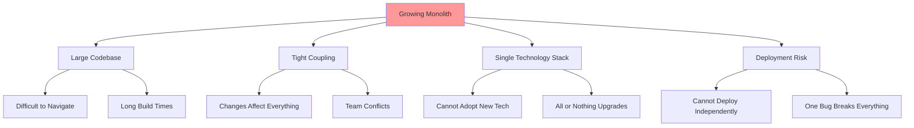
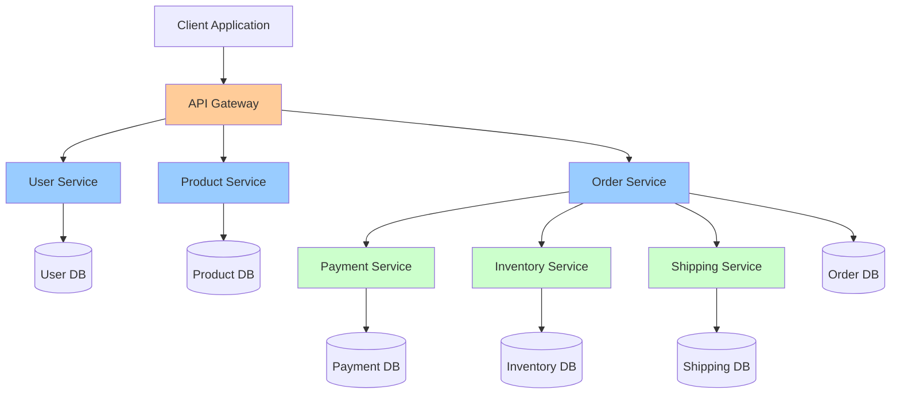
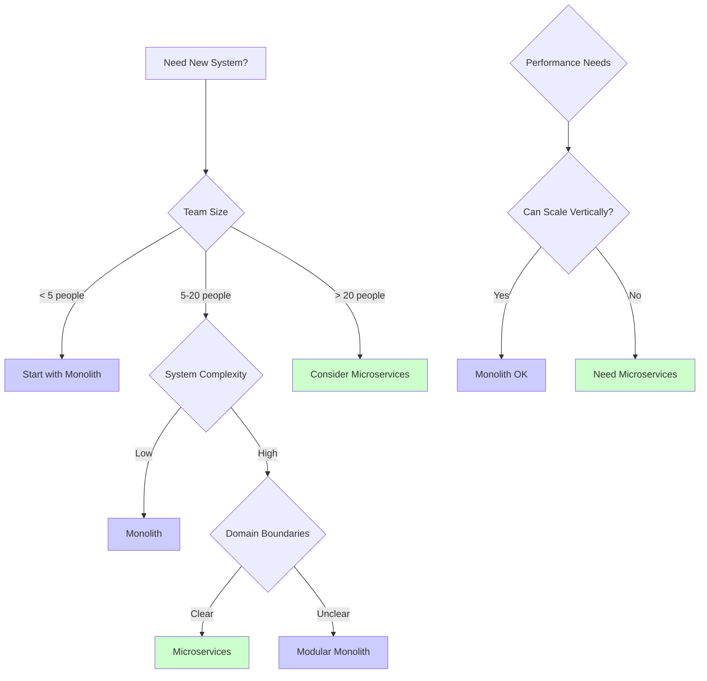

# Introduction to Microservices Architecture

Microservices architecture represents a fundamental shift in how we design and build distributed applications. Rather than building a single monolithic application, microservices decompose the system into small, independent services that communicate over a network. Each service is focused on a specific business capability, can be developed and deployed independently, and can use different technologies. This architectural style has become the dominant pattern for large-scale cloud applications, but it comes with significant complexity that must be carefully considered.

## Monolithic Architecture

A monolithic architecture packages all application functionality into a single deployable unit.

### Characteristics of Monoliths

```javascript
// Monolithic e-commerce application structure
class ECommerceMonolith {
  constructor() {
    // All components in one application
    this.userService = new UserService();
    this.productService = new ProductService();
    this.orderService = new OrderService();
    this.paymentService = new PaymentService();
    this.inventoryService = new InventoryService();
    this.shippingService = new ShippingService();

    // Shared database
    this.database = new Database('ecommerce_db');
  }

  async placeOrder(userId, items) {
    // All operations in single transaction
    const transaction = await this.database.beginTransaction();

    try {
      // User validation
      const user = await this.userService.getUser(userId, transaction);

      // Check inventory
      for (const item of items) {
        await this.inventoryService.checkAvailability(item, transaction);
      }

      // Create order
      const order = await this.orderService.createOrder(user, items, transaction);

      // Process payment
      await this.paymentService.processPayment(order, transaction);

      // Reserve inventory
      await this.inventoryService.reserveItems(items, transaction);

      // Schedule shipping
      await this.shippingService.scheduleShipment(order, transaction);

      await transaction.commit();
      return order;

    } catch (error) {
      await transaction.rollback();
      throw error;
    }
  }
}
```

### Monolith Advantages

**Simplicity:** Single codebase, straightforward development and debugging

**Performance:** In-process method calls, no network overhead

**Transactions:** ACID transactions across all components

**Deployment:** Single deployment unit, simpler operations

**Testing:** Easier end-to-end testing in single process

### Monolith Challenges

As applications grow, monoliths face increasing challenges:



**Scaling limitations:** Must scale entire application even if only one component needs more resources

**Development bottlenecks:** Large teams working on single codebase create merge conflicts and coordination overhead

**Technology lock-in:** Entire application must use same framework and language

**Deployment risk:** Small change requires deploying entire application

## Microservices Architecture

Microservices decompose the application into small, loosely coupled services.

### Microservices Characteristics



### Service Implementation

```javascript
// Order Service - independent microservice
class OrderService {
  constructor() {
    this.database = new Database('order_db');
    this.eventBus = new EventBus('kafka');
    this.paymentClient = new PaymentServiceClient();
    this.inventoryClient = new InventoryServiceClient();
    this.shippingClient = new ShippingServiceClient();
  }

  async createOrder(userId, items) {
    // Service owns its data
    const order = await this.database.orders.create({
      userId,
      items,
      status: 'PENDING',
      createdAt: Date.now()
    });

    // Publish event for other services
    await this.eventBus.publish('OrderCreated', {
      orderId: order.id,
      userId,
      items,
      timestamp: Date.now()
    });

    // Orchestrate other services via API calls
    try {
      await this.reserveInventory(order);
      await this.processPayment(order);
      await this.scheduleShipping(order);

      await this.updateOrderStatus(order.id, 'CONFIRMED');

    } catch (error) {
      await this.updateOrderStatus(order.id, 'FAILED');
      await this.handleOrderFailure(order, error);
      throw error;
    }

    return order;
  }

  async reserveInventory(order) {
    // Call to separate Inventory Service
    const response = await this.inventoryClient.post('/reserve', {
      orderId: order.id,
      items: order.items
    });

    if (!response.success) {
      throw new Error('Inventory reservation failed');
    }
  }

  async processPayment(order) {
    // Call to separate Payment Service
    const response = await this.paymentClient.post('/charge', {
      orderId: order.id,
      amount: order.total,
      userId: order.userId
    });

    if (!response.success) {
      throw new Error('Payment processing failed');
    }
  }

  async scheduleShipping(order) {
    // Call to separate Shipping Service
    await this.shippingClient.post('/schedule', {
      orderId: order.id,
      address: order.shippingAddress
    });
  }
}

// Payment Service - completely independent
class PaymentService {
  constructor() {
    this.database = new Database('payment_db');
    this.stripeClient = new StripeClient();
  }

  async charge(orderId, amount, userId) {
    // Payment service has its own database
    const payment = await this.database.payments.create({
      orderId,
      amount,
      userId,
      status: 'PROCESSING'
    });

    try {
      // Integrate with external payment gateway
      const result = await this.stripeClient.charge({
        amount,
        currency: 'USD',
        metadata: { orderId, userId }
      });

      await this.database.payments.update(payment.id, {
        status: 'COMPLETED',
        transactionId: result.id
      });

      return { success: true, transactionId: result.id };

    } catch (error) {
      await this.database.payments.update(payment.id, {
        status: 'FAILED',
        error: error.message
      });

      return { success: false, error: error.message };
    }
  }
}
```

## Benefits of Microservices

### Independent Scalability

Each service can be scaled independently based on its specific load:

```javascript
class ServiceScaler {
  async scaleService(serviceName, metrics) {
    const currentLoad = await this.getServiceLoad(serviceName);
    const currentInstances = await this.getInstanceCount(serviceName);

    // Scale based on service-specific metrics
    if (serviceName === 'ProductService') {
      // Product catalog gets high read traffic
      if (metrics.requestsPerSecond > 1000) {
        await this.scaleOut(serviceName, currentInstances + 2);
      }
    } else if (serviceName === 'OrderService') {
      // Order processing is CPU-intensive
      if (metrics.cpuUtilization > 70) {
        await this.scaleOut(serviceName, currentInstances + 1);
      }
    } else if (serviceName === 'PaymentService') {
      // Payment must maintain high availability
      await this.ensureMinimumInstances(serviceName, 3);
    }
  }

  async scaleOut(serviceName, targetInstances) {
    console.log(`Scaling ${serviceName} to ${targetInstances} instances`);

    // Deploy new instances
    for (let i = 0; i < targetInstances; i++) {
      await this.kubernetes.deployPod({
        service: serviceName,
        image: `registry/${serviceName}:latest`,
        resources: this.getResourceRequirements(serviceName)
      });
    }
  }
}
```

### Technology Diversity

Different services can use different technologies:

```javascript
// User Service - Node.js + MongoDB
class UserService {
  constructor() {
    this.database = new MongoDB('users');
  }

  async getUser(userId) {
    return await this.database.collection('users').findOne({ _id: userId });
  }
}

// Analytics Service - Python + PostgreSQL
// (Pseudo-code for Python service)
class AnalyticsService:
    def __init__(self):
        self.database = PostgreSQL('analytics')

    def generate_report(self, user_id):
        # Use pandas for data analysis
        query = "SELECT * FROM events WHERE user_id = %s"
        df = pd.read_sql(query, self.database, params=[user_id])
        return df.describe()

// Image Processing Service - Go + Redis
// (Pseudo-code for Go service)
type ImageService struct {
    cache *redis.Client
}

func (s *ImageService) ProcessImage(imageData []byte) error {
    // Use Go's concurrency for fast image processing
    processed := processInParallel(imageData)
    return s.cache.Set("image:" + hash, processed, 24*time.Hour)
}
```

### Team Autonomy

Teams can work independently on their services:

```javascript
class ServiceOwnership {
  constructor() {
    this.teams = {
      'checkout-team': ['OrderService', 'CartService'],
      'payment-team': ['PaymentService', 'BillingService'],
      'inventory-team': ['InventoryService', 'WarehouseService'],
      'shipping-team': ['ShippingService', 'TrackingService']
    };
  }

  async deployService(serviceName, version) {
    const ownerTeam = this.getOwnerTeam(serviceName);

    // Team owns deployment
    console.log(`${ownerTeam} deploying ${serviceName} version ${version}`);

    // Independent deployment pipeline
    await this.runTests(serviceName);
    await this.buildDocker(serviceName, version);
    await this.deployToStaging(serviceName);
    await this.runIntegrationTests(serviceName);

    // Team decides when to promote to production
    if (await this.approvePromotion(ownerTeam)) {
      await this.deployToProduction(serviceName, version);
    }
  }

  getOwnerTeam(serviceName) {
    for (const [team, services] of Object.entries(this.teams)) {
      if (services.includes(serviceName)) {
        return team;
      }
    }
  }
}
```

### Fault Isolation

Failure in one service doesn't bring down the entire system:

```javascript
class ResilientSystem {
  async processRequest(request) {
    try {
      // Primary flow
      const user = await this.userService.getUser(request.userId);
      const recommendations = await this.recommendationService.getRecommendations(user);
      const products = await this.productService.getProducts(recommendations);

      return { user, products };

    } catch (error) {
      // Graceful degradation
      if (error.service === 'RecommendationService') {
        // Recommendation service down - use fallback
        console.log('Recommendation service unavailable, using popular products');
        const products = await this.productService.getPopularProducts();
        return { user, products, fallback: true };
      } else if (error.service === 'ProductService') {
        // Product service down - return cached data
        console.log('Product service unavailable, using cache');
        const cachedProducts = await this.cache.get('popular_products');
        return { user, products: cachedProducts, cached: true };
      } else {
        throw error;
      }
    }
  }
}
```

## Challenges of Microservices

### Distributed System Complexity

```javascript
class DistributedComplexity {
  // Network calls are unreliable
  async callService(serviceUrl, data) {
    try {
      const response = await fetch(serviceUrl, {
        method: 'POST',
        body: JSON.stringify(data),
        timeout: 5000
      });

      return await response.json();

    } catch (error) {
      if (error.code === 'ETIMEDOUT') {
        // Timeout - retry with backoff
        return await this.retryWithBackoff(serviceUrl, data);
      } else if (error.code === 'ECONNREFUSED') {
        // Service down - use circuit breaker
        throw new ServiceUnavailableError(serviceUrl);
      } else {
        throw error;
      }
    }
  }

  async retryWithBackoff(url, data, attempt = 1) {
    const delay = Math.min(1000 * Math.pow(2, attempt), 10000);
    await this.sleep(delay);

    try {
      return await this.callService(url, data);
    } catch (error) {
      if (attempt < 3) {
        return await this.retryWithBackoff(url, data, attempt + 1);
      }
      throw error;
    }
  }
}
```

### Data Consistency

Without distributed transactions, maintaining consistency is challenging:

```javascript
class EventualConsistencyPattern {
  async createOrder(order) {
    // Saga pattern for distributed transaction
    const saga = new Saga();

    try {
      // Step 1: Create order
      const orderId = await saga.execute(
        () => this.orderService.createOrder(order),
        (orderId) => this.orderService.cancelOrder(orderId)
      );

      // Step 2: Reserve inventory
      const reservation = await saga.execute(
        () => this.inventoryService.reserve(order.items),
        (reservation) => this.inventoryService.release(reservation)
      );

      // Step 3: Charge payment
      const payment = await saga.execute(
        () => this.paymentService.charge(order.total),
        (payment) => this.paymentService.refund(payment)
      );

      await saga.commit();
      return { orderId, status: 'COMPLETED' };

    } catch (error) {
      // Compensate all completed steps
      await saga.rollback();
      return { status: 'FAILED', error: error.message };
    }
  }
}
```

### Operational Overhead

Managing many services requires sophisticated tooling:

```javascript
class MicroservicesOperations {
  constructor() {
    this.services = [];
    this.monitoring = new PrometheusMonitoring();
    this.logging = new ELKLogging();
    this.tracing = new JaegerTracing();
  }

  async monitorHealth() {
    for (const service of this.services) {
      const health = await this.checkHealth(service);

      await this.monitoring.recordMetric({
        service: service.name,
        metric: 'health_status',
        value: health.status === 'healthy' ? 1 : 0,
        labels: {
          version: service.version,
          instance: service.instance
        }
      });

      if (health.status !== 'healthy') {
        await this.alertOnCall({
          service: service.name,
          severity: 'critical',
          message: `Service ${service.name} is unhealthy`
        });
      }
    }
  }

  async aggregateLogs(traceId) {
    // Collect logs from all services involved in request
    const logs = await this.logging.query({
      traceId,
      timeRange: 'last_hour'
    });

    // Group by service
    const logsByService = logs.reduce((acc, log) => {
      if (!acc[log.service]) acc[log.service] = [];
      acc[log.service].push(log);
      return acc;
    }, {});

    return logsByService;
  }
}
```

## When to Use Microservices

### Good Candidates for Microservices

**Large, complex applications** with multiple business domains

**High-scale systems** needing independent scaling

**Organizations with multiple teams** requiring autonomy

**Applications requiring** different technologies for different components

**Systems needing** high availability and fault tolerance

### When to Avoid Microservices

**Small applications** where monolith is simpler

**Startups** exploring product-market fit

**Limited operational expertise** in distributed systems

**Strong consistency requirements** across all operations

**Small teams** that benefit from monolith simplicity

### Migration Strategy

```javascript
class MonolithToMicroservices {
  async extractService(serviceName, functionality) {
    console.log(`Extracting ${serviceName} from monolith...`);

    // Step 1: Identify service boundaries
    const boundaries = this.identifyBoundaries(functionality);

    // Step 2: Create new service
    const service = await this.createMicroservice(serviceName, boundaries);

    // Step 3: Implement facade in monolith
    await this.createFacade(serviceName, service.endpoint);

    // Step 4: Gradual migration with feature flags
    await this.enableFeatureFlag(`use_${serviceName}_microservice`, {
      percentage: 10  // Start with 10% of traffic
    });

    // Step 5: Monitor and increase traffic
    await this.monitorAndScale(serviceName);

    // Step 6: Remove from monolith once 100% migrated
    await this.cleanupMonolith(functionality);
  }

  async createFacade(serviceName, endpoint) {
    // Strangler pattern: route calls to new service
    return {
      async call(method, params) {
        const useNewService = await featureFlags.isEnabled(
          `use_${serviceName}_microservice`
        );

        if (useNewService) {
          return await fetch(`${endpoint}/${method}`, {
            method: 'POST',
            body: JSON.stringify(params)
          });
        } else {
          return await legacyMonolith[serviceName][method](params);
        }
      }
    };
  }
}
```

## Decision Framework



Microservices architecture offers powerful benefits in terms of scalability, team autonomy, and technology flexibility, but comes with significant complexity in distributed systems challenges, data consistency, and operational overhead. The decision to adopt microservices should be based on careful analysis of organizational size, system complexity, and operational capabilities rather than following trends.
