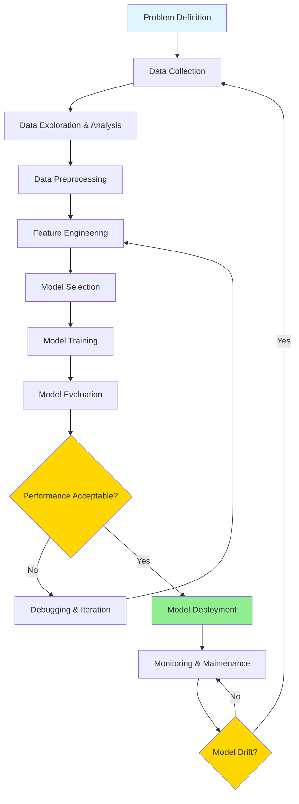
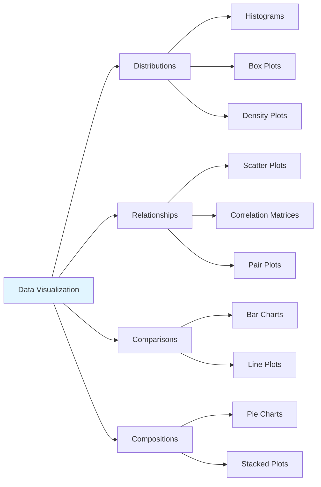
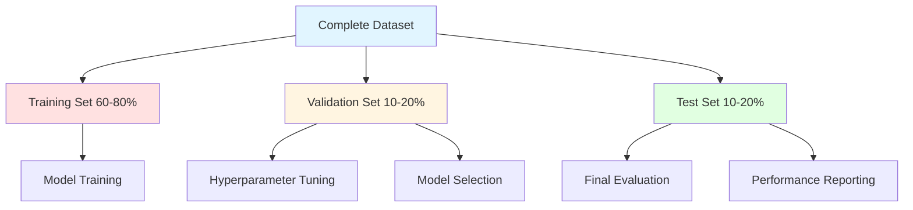
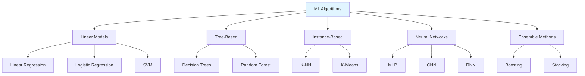
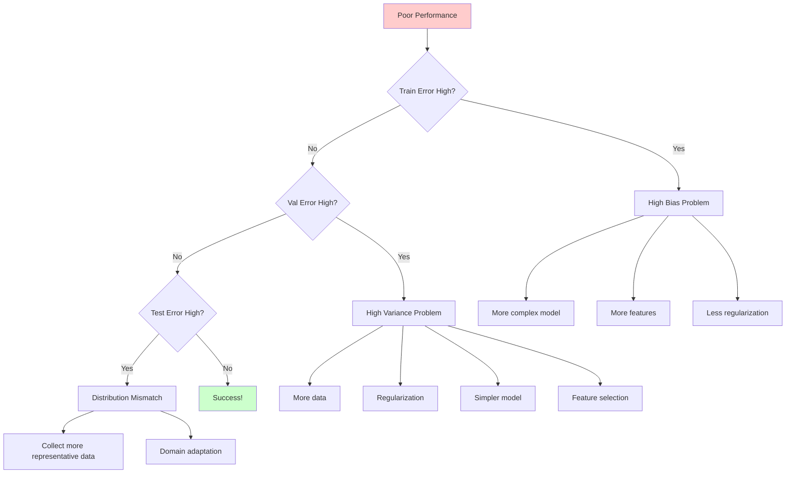

# Machine Learning Workflow

## Introduction

The machine learning workflow is a systematic process that guides practitioners from raw data to deployed models. Understanding this workflow is crucial for successfully executing ML projects, as it provides structure for what can otherwise be a chaotic and iterative process. Each stage builds upon the previous one, and while the workflow appears linear, in practice it involves considerable iteration and refinement.

A successful ML project requires more than just applying algorithms to data. It demands careful planning, thorough data preparation, thoughtful feature engineering, rigorous evaluation, and careful deployment. This comprehensive workflow ensures that models not only perform well on training data but also generalize effectively to real-world scenarios.



## 1. Problem Definition

Before any data work begins, clearly defining the problem is paramount. A well-defined problem guides all subsequent decisions and prevents wasted effort on irrelevant solutions.

### Key Questions to Answer

**What is the business objective?**
- What specific outcome are we trying to achieve?
- How will success be measured from a business perspective?
- What is the return on investment for solving this problem?

**Is ML the right approach?**
- Can the problem be solved with simpler rule-based systems?
- Is there sufficient data available?
- Will the cost of ML development be justified?

**What type of ML problem is this?**
- Classification (discrete categories)
- Regression (continuous values)
- Clustering (grouping similar items)
- Ranking (ordering by relevance)
- Anomaly detection (finding outliers)

**What are the constraints?**
- **Latency requirements**: Real-time vs. batch processing
- **Resource constraints**: Computational budget, memory limits
- **Interpretability needs**: Must decisions be explainable?
- **Regulatory compliance**: Privacy, fairness, audit requirements

### Defining Success Metrics

Success must be quantified through appropriate metrics that align with business objectives.

**For Classification:**
- Accuracy: $$\frac{\text{Correct Predictions}}{\text{Total Predictions}}$$
- Precision: $$\frac{\text{True Positives}}{\text{True Positives} + \text{False Positives}}$$
- Recall: $$\frac{\text{True Positives}}{\text{True Positives} + \text{False Negatives}}$$
- F1 Score: $$2 \cdot \frac{\text{Precision} \cdot \text{Recall}}{\text{Precision} + \text{Recall}}$$

**For Regression:**
- Mean Absolute Error (MAE): $$\frac{1}{n}\sum_{i=1}^{n}|y_i - \hat{y}_i|$$
- Mean Squared Error (MSE): $$\frac{1}{n}\sum_{i=1}^{n}(y_i - \hat{y}_i)^2$$
- Root Mean Squared Error (RMSE): $$\sqrt{\frac{1}{n}\sum_{i=1}^{n}(y_i - \hat{y}_i)^2}$$
- R² Score: $$1 - \frac{\sum_{i}(y_i - \hat{y}_i)^2}{\sum_{i}(y_i - \bar{y})^2}$$

## 2. Data Collection

Data is the foundation of any ML system. The quality and quantity of data often determine the upper bound of model performance.

### Data Sources

**Internal Data:**
- Database records (transactional data, user interactions)
- Log files (application logs, server logs)
- Existing datasets (historical data, archives)

**External Data:**
- Public datasets (UCI ML Repository, Kaggle, government data)
- APIs (social media, weather, financial markets)
- Web scraping (structured data extraction)
- Purchased datasets (commercial data providers)

**Generated Data:**
- Simulations (physics engines, game environments)
- Synthetic data (GANs, data augmentation)
- Crowdsourcing (Amazon MTurk, specialized platforms)

### Data Quality Considerations

**Volume:**
- How much data is needed for reliable training?
- Rule of thumb: At least 10x samples per feature for linear models
- Deep learning often requires thousands to millions of examples

**Variety:**
- Does data cover all relevant scenarios?
- Are edge cases represented?
- Is there diversity in the examples?

**Veracity:**
- How accurate is the data?
- What is the error rate in labels?
- Are there systematic biases?

**Velocity:**
- How quickly does data arrive?
- Is it streaming or batch?
- How fresh must the data be?

### Ethical and Legal Considerations

- **Privacy**: GDPR, CCPA, and other regulations
- **Consent**: Do users know their data is being used?
- **Bias**: Does data reflect historical discrimination?
- **Representativeness**: Are all groups fairly represented?

## 3. Data Exploration and Analysis

Exploratory Data Analysis (EDA) is critical for understanding data characteristics, identifying issues, and informing preprocessing decisions.

### Statistical Analysis

**Univariate Analysis:**
- Distribution of individual features
- Central tendency (mean, median, mode)
- Dispersion (variance, standard deviation, range)
- Skewness and kurtosis

**Bivariate Analysis:**
- Correlation between features: $$\rho_{X,Y} = \frac{\text{Cov}(X,Y)}{\sigma_X \sigma_Y}$$
- Scatter plots for continuous variables
- Cross-tabulation for categorical variables

**Multivariate Analysis:**
- Correlation matrices
- Principal Component Analysis (PCA) for dimensionality
- Heatmaps for identifying patterns

### Data Visualization

Effective visualization reveals patterns invisible in raw numbers:



### Identifying Data Issues

**Missing Values:**
- How much data is missing?
- Is missingness random or systematic?
- Missing Completely At Random (MCAR)
- Missing At Random (MAR)
- Missing Not At Random (MNAR)

**Outliers:**
- Statistical methods (z-score, IQR)
- Domain knowledge validation
- Distinguish between errors and true extremes

**Imbalanced Classes:**
- Class distribution in classification tasks
- Impact on model training and evaluation

## 4. Data Preprocessing

Raw data is rarely suitable for direct model training. Preprocessing transforms data into a format that ML algorithms can effectively learn from.

### Handling Missing Values

**Deletion Methods:**
- **Listwise deletion**: Remove entire rows with missing values
- **Pairwise deletion**: Use available data for each analysis
- **When appropriate**: Missing data is <5% and MCAR

**Imputation Methods:**

**Simple Imputation:**
- Mean/median for numerical features
- Mode for categorical features
- Constant value (e.g., -1, "Unknown")

**Advanced Imputation:**
- K-Nearest Neighbors: $$\hat{x}_i = \frac{1}{k}\sum_{j \in N_k(i)} x_j$$
- Regression imputation: Predict missing values using other features
- Multiple imputation: Generate multiple plausible values
- Deep learning-based imputation (autoencoders)

### Handling Outliers

**Detection Methods:**

**Z-score method:**
$$z = \frac{x - \mu}{\sigma}$$

Values with $$|z| > 3$$ are typically considered outliers.

**IQR method:**
- $$Q_1$$: 25th percentile
- $$Q_3$$: 75th percentile
- $$\text{IQR} = Q_3 - Q_1$$
- Outliers: $$x < Q_1 - 1.5 \cdot \text{IQR}$$ or $$x > Q_3 + 1.5 \cdot \text{IQR}$$

**Treatment Strategies:**
- **Remove**: If data errors or truly exceptional
- **Cap**: Winsorization (cap at percentiles)
- **Transform**: Log transformation to reduce impact
- **Separate model**: Build specialized models for outliers

### Encoding Categorical Variables

ML algorithms require numerical input, necessitating encoding of categorical features.

**Label Encoding:**
- Assign integers to categories: {Red: 0, Green: 1, Blue: 2}
- Suitable for ordinal variables (Small < Medium < Large)
- Risk: Implies ordering for nominal variables

**One-Hot Encoding:**
For a feature with $$k$$ categories, create $$k$$ binary features:

$$\text{Color} = \text{Red} \rightarrow [1, 0, 0]$$
$$\text{Color} = \text{Green} \rightarrow [0, 1, 0]$$
$$\text{Color} = \text{Blue} \rightarrow [0, 0, 1]$$

**Issues:**
- High dimensionality with many categories
- Sparse representations

**Advanced Encoding:**
- **Target encoding**: Replace category with mean target value
- **Frequency encoding**: Replace with category frequency
- **Binary encoding**: Represent as binary numbers
- **Embedding layers**: Learn dense representations (deep learning)

### Data Splitting

Proper data splitting is essential for unbiased evaluation:



**Training Set**: Used to fit model parameters

**Validation Set**: Used for:
- Hyperparameter tuning
- Model selection
- Early stopping
- Architecture decisions

**Test Set**: Used only for final evaluation
- Must remain unseen during development
- Provides unbiased performance estimate

**K-Fold Cross-Validation:**

For small datasets, use k-fold cross-validation:

1. Split data into $$k$$ equal folds
2. Train on $$k-1$$ folds, validate on remaining fold
3. Repeat $$k$$ times, each fold used as validation once
4. Average performance across folds

Performance: $$\text{Score} = \frac{1}{k}\sum_{i=1}^{k} \text{Score}_i$$

## 5. Feature Engineering

Feature engineering is often the difference between mediocre and excellent models. Good features make patterns more apparent to ML algorithms.

### Feature Creation

**Domain-Specific Features:**
- Time-based: hour of day, day of week, seasonality
- Geographic: distance calculations, regional indicators
- Text: word counts, TF-IDF, sentiment scores
- Images: edges, textures, object detection results

**Interaction Features:**
- Polynomial features: $$x_1 \cdot x_2$$, $$x_1^2$$
- Ratios: $$\frac{x_1}{x_2}$$
- Binning: Discretize continuous variables

**Aggregation Features:**
- Statistical summaries: mean, median, std, min, max
- Time windows: rolling averages, cumulative sums
- Group-level features: user-level, category-level statistics

### Feature Transformation

**Scaling:**

**Standardization (Z-score normalization):**
$$x' = \frac{x - \mu}{\sigma}$$
- Results in mean = 0, std = 1
- Suitable for algorithms assuming normal distribution (SVM, neural networks)

**Min-Max Normalization:**
$$x' = \frac{x - x_{\min}}{x_{\max} - x_{\min}}$$
- Results in range [0, 1]
- Suitable when bounded range needed

**Robust Scaling:**
$$x' = \frac{x - \text{median}}{\text{IQR}}$$
- Robust to outliers

**Log Transformation:**
$$x' = \log(x + c)$$
- Reduces right skewness
- Handles multiplicative relationships

### Feature Selection

Not all features improve model performance. Feature selection reduces dimensionality, improves generalization, and speeds training.

**Filter Methods:**
- **Correlation**: Remove highly correlated features
- **Variance threshold**: Remove low-variance features
- **Chi-square test**: For categorical features
- **Mutual information**: Measure dependency between features and target

**Wrapper Methods:**
- **Forward selection**: Start empty, add features iteratively
- **Backward elimination**: Start with all, remove iteratively
- **Recursive Feature Elimination (RFE)**: Recursively remove least important

**Embedded Methods:**
- **L1 Regularization (Lasso)**: Drives irrelevant coefficients to zero
- **Tree-based importance**: Feature importance from decision trees
- **Neural network attention**: Learn feature relevance

### Dimensionality Reduction

**Principal Component Analysis (PCA):**

Transform features into orthogonal principal components:

$$X_{\text{PCA}} = X \cdot W$$

where $$W$$ contains eigenvectors of covariance matrix.

Preserve $$k$$ components explaining most variance:

$$\text{Variance Explained} = \frac{\sum_{i=1}^{k}\lambda_i}{\sum_{i=1}^{n}\lambda_i}$$

**Other Methods:**
- **t-SNE**: For visualization (non-linear)
- **UMAP**: Scalable non-linear reduction
- **Autoencoders**: Neural network-based compression

## 6. Model Selection

Choosing appropriate algorithms depends on problem characteristics, data properties, and practical constraints.

### Algorithm Selection Criteria

**Problem Type:**
- Classification vs. regression
- Supervised vs. unsupervised
- Online vs. batch learning

**Data Characteristics:**
- Sample size (small vs. large)
- Feature dimensionality (low vs. high)
- Data types (numerical, categorical, mixed)
- Linear vs. non-linear relationships

**Practical Constraints:**
- Training time budget
- Inference latency requirements
- Interpretability needs
- Memory constraints

### Common Algorithm Categories



## 7. Model Training

Training involves optimizing model parameters to minimize a loss function on training data.

### Loss Functions

**For Regression:**

**Mean Squared Error:**
$$L(\theta) = \frac{1}{n}\sum_{i=1}^{n}(y_i - f(x_i; \theta))^2$$

**Mean Absolute Error:**
$$L(\theta) = \frac{1}{n}\sum_{i=1}^{n}|y_i - f(x_i; \theta)|$$

**Huber Loss** (robust to outliers):
$$L_\delta(y, f(x)) = \begin{cases}
\frac{1}{2}(y - f(x))^2 & \text{if } |y - f(x)| \leq \delta \\
\delta|y - f(x)| - \frac{1}{2}\delta^2 & \text{otherwise}
\end{cases}$$

**For Classification:**

**Binary Cross-Entropy:**
$$L(\theta) = -\frac{1}{n}\sum_{i=1}^{n}[y_i\log(p_i) + (1-y_i)\log(1-p_i)]$$

**Categorical Cross-Entropy:**
$$L(\theta) = -\frac{1}{n}\sum_{i=1}^{n}\sum_{j=1}^{C}y_{ij}\log(p_{ij})$$

### Optimization Algorithms

**Gradient Descent:**
$$\theta_{t+1} = \theta_t - \alpha \nabla L(\theta_t)$$

where $$\alpha$$ is the learning rate.

**Stochastic Gradient Descent (SGD):**
- Update parameters using one sample at a time
- Faster iterations, noisier updates

**Mini-Batch Gradient Descent:**
- Compromise between batch and SGD
- Update using small batches (e.g., 32, 64, 128 samples)

**Advanced Optimizers:**
- **Momentum**: Accumulate gradients
- **Adam**: Adaptive learning rates per parameter
- **RMSprop**: Root mean square propagation

### Hyperparameter Tuning

Hyperparameters control the learning process but aren't learned from data.

**Search Strategies:**

**Grid Search:**
- Define grid of hyperparameter values
- Evaluate all combinations
- Exhaustive but expensive

**Random Search:**
- Sample random hyperparameter combinations
- Often more efficient than grid search
- Better for high-dimensional spaces

**Bayesian Optimization:**
- Build probabilistic model of performance
- Intelligently select next hyperparameters
- More efficient than random search

**Common Hyperparameters:**
- Learning rate ($$\alpha$$)
- Regularization strength ($$\lambda$$)
- Number of trees/layers
- Batch size
- Number of epochs

## 8. Model Evaluation

Rigorous evaluation ensures models generalize beyond training data.

### Evaluation Metrics

See "Problem Definition" section for detailed metric formulas.

**Key Principles:**
- Use multiple metrics
- Match metrics to business objectives
- Consider class imbalance effects
- Examine per-class performance

### Cross-Validation

**Stratified K-Fold:**
- Maintains class distribution in each fold
- Essential for imbalanced datasets

**Time Series Split:**
- Respect temporal ordering
- Train on past, validate on future
- Prevent information leakage

### Confusion Matrix Analysis

For binary classification:

$$\begin{bmatrix}
TN & FP \\
FN & TP
\end{bmatrix}$$

Analyze error patterns:
- Which classes are confused?
- Are false positives or false negatives more costly?
- Can post-processing address systematic errors?

### Learning Curves

Plot training and validation performance vs. training set size:

**High Bias (Underfitting):**
- Both curves plateau at poor performance
- More data won't help significantly
- Need more complex model

**High Variance (Overfitting):**
- Large gap between training and validation
- More data may help
- Need regularization

## 9. Debugging and Iteration

When models underperform, systematic debugging identifies root causes.

### Diagnostic Workflow



### Common Issues and Solutions

**Underfitting:**
- Increase model complexity
- Add polynomial features
- Reduce regularization
- Train longer

**Overfitting:**
- Collect more training data
- Increase regularization
- Reduce model complexity
- Use ensemble methods
- Apply dropout (neural networks)

**Class Imbalance:**
- Resampling (oversample minority, undersample majority)
- Class weights in loss function
- Generate synthetic samples (SMOTE)
- Use appropriate metrics (F1, AUC-ROC)

## 10. Model Deployment

Deploying models to production requires engineering considerations beyond ML performance.

### Deployment Strategies

**Batch Prediction:**
- Process data in batches (hourly, daily)
- Lower latency requirements
- Suitable for recommendations, reports

**Real-Time Prediction:**
- Low latency (<100ms)
- Individual predictions on demand
- API endpoints, microservices

**Edge Deployment:**
- Models on devices (mobile, IoT)
- Privacy benefits, offline capability
- Requires model compression

### Model Serving

**REST API:**
```
POST /predict
{
  "features": [1.2, 3.4, 5.6]
}

Response:
{
  "prediction": 0.87,
  "confidence": 0.93
}
```

**gRPC:**
- More efficient than REST
- Better for microservices

**Model Optimization:**
- **Quantization**: Reduce precision (float32 → int8)
- **Pruning**: Remove unimportant weights
- **Knowledge distillation**: Train smaller student model
- **Model compilation**: TensorRT, ONNX Runtime

### A/B Testing

Validate model improvements with controlled experiments:

1. Deploy new model to small traffic percentage
2. Compare metrics against baseline
3. Gradually increase traffic if successful
4. Full rollout or rollback based on results

**Statistical Significance:**
Ensure sample size sufficient for detecting meaningful differences.

## 11. Monitoring and Maintenance

Deployed models require ongoing monitoring to maintain performance.

### Key Metrics to Monitor

**Performance Metrics:**
- Accuracy, precision, recall over time
- Latency percentiles (p50, p95, p99)
- Error rates and types

**Data Quality Metrics:**
- Missing value rates
- Feature distributions
- Data volume

**System Metrics:**
- CPU/GPU utilization
- Memory usage
- Request throughput
- Error rates

### Model Drift

**Data Drift:**
$$P_{\text{train}}(X) \neq P_{\text{prod}}(X)$$

Input distributions change over time.

**Concept Drift:**
$$P_{\text{train}}(Y|X) \neq P_{\text{prod}}(Y|X)$$

Relationship between features and target changes.

**Detection Methods:**
- Statistical tests (KS test, chi-square)
- Monitor performance metrics
- Compare feature distributions

**Remediation:**
- Retrain with recent data
- Online learning (continuous updates)
- Ensemble of models from different time periods

### Continuous Learning

Modern ML systems often require continuous improvement:

**Retraining Strategies:**
- **Scheduled retraining**: Weekly, monthly
- **Triggered retraining**: When drift detected
- **Online learning**: Incremental updates

**Data Flywheel:**
1. Deploy model
2. Collect user interactions
3. Generate labels (explicit or implicit)
4. Retrain model with new data
5. Deploy improved model
6. Repeat

## Conclusion

The machine learning workflow provides a structured approach to developing effective ML systems. While presented linearly, the process is highly iterative, with frequent returns to earlier stages based on insights gained during evaluation and deployment.

Success in machine learning requires more than algorithmic knowledge—it demands careful attention to data quality, thoughtful feature engineering, rigorous evaluation, and robust deployment practices. Each stage of the workflow contributes to the final model's performance and reliability.

As ML systems increasingly impact critical decisions, the importance of systematic workflows, reproducibility, and ongoing monitoring cannot be overstated. Mastering this workflow enables practitioners to build models that not only perform well in development but also deliver value in production environments.