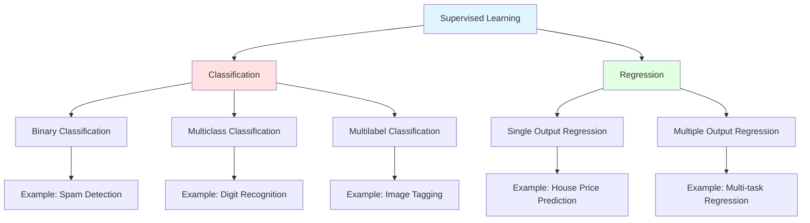
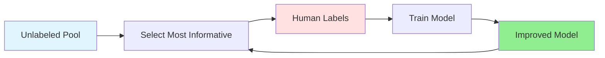
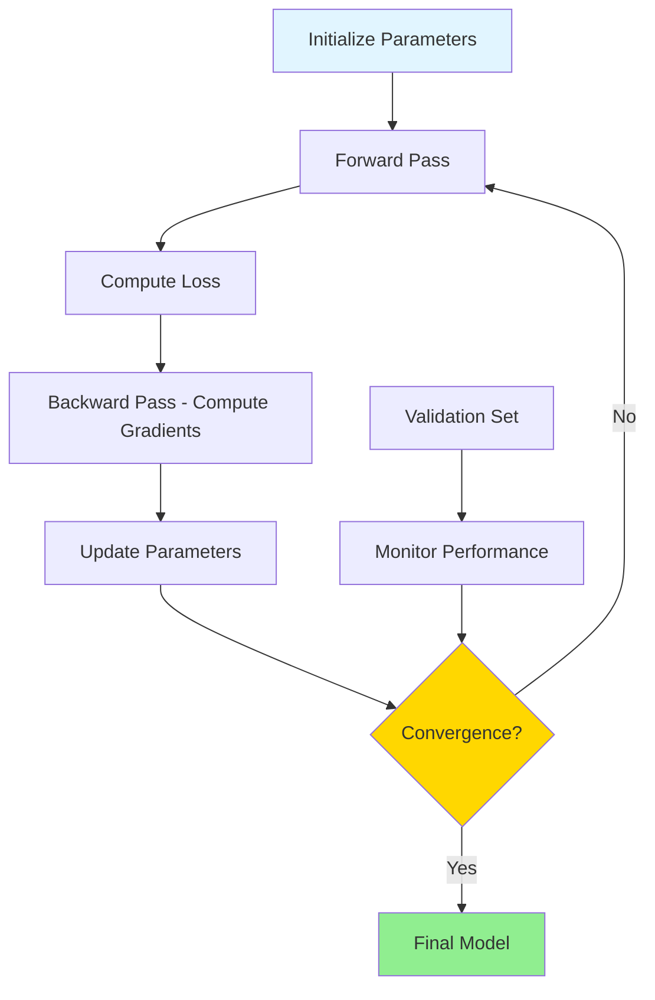

# Supervised Learning

## Introduction

Supervised learning is the most prevalent and well-understood paradigm in machine learning. It forms the foundation for countless applications, from email spam filtering to medical diagnosis, from credit risk assessment to autonomous vehicle perception. The fundamental premise is elegantly simple yet remarkably powerful: learn from labeled examples to make predictions about new, unseen data.

In supervised learning, we provide the algorithm with a training dataset where each example consists of input features (independent variables) and a corresponding output label (dependent variable). The algorithm's task is to discover the underlying relationship between inputs and outputs, creating a model that can generalize this relationship to new examples it has never encountered.

The term "supervised" reflects the fact that learning is guided by correct answers—the labels provide supervision, teaching the algorithm what outputs should correspond to given inputs. This distinguishes supervised learning from unsupervised learning, where no such guidance exists, and from reinforcement learning, where feedback is provided indirectly through rewards.

## Mathematical Framework

### Formal Problem Definition

Let's formalize the supervised learning problem mathematically. We are given:

**Training Dataset:**
$$D = \{(x^{(1)}, y^{(1)}), (x^{(2)}, y^{(2)}), ..., (x^{(n)}, y^{(n)})\}$$

where:
- $$x^{(i)} \in \mathbb{R}^d$$ is the input feature vector for the $$i$$-th example
- $$y^{(i)}$$ is the corresponding label or target value
- $$n$$ is the number of training examples
- $$d$$ is the dimensionality of the feature space

**Objective:**

Find a hypothesis function $$h: \mathcal{X} \rightarrow \mathcal{Y}$$ that maps inputs to outputs, where:
- $$\mathcal{X}$$ is the input space (all possible feature vectors)
- $$\mathcal{Y}$$ is the output space (all possible labels/values)

The hypothesis $$h$$ is typically parameterized by weights $$\theta$$, so we write $$h_\theta(x)$$ or simply $$h(x; \theta)$$.

### Learning as Optimization

Supervised learning is fundamentally an optimization problem. We seek parameters $$\theta$$ that minimize the difference between predictions and true labels.

**Empirical Risk Minimization:**

$$\theta^* = \arg\min_{\theta} \frac{1}{n}\sum_{i=1}^{n} L(h_\theta(x^{(i)}), y^{(i)})$$

where $$L$$ is a loss function measuring the discrepancy between predictions and true values.

**Regularized Risk Minimization:**

To prevent overfitting, we often add a regularization term:

$$\theta^* = \arg\min_{\theta} \left[\frac{1}{n}\sum_{i=1}^{n} L(h_\theta(x^{(i)}), y^{(i)}) + \lambda R(\theta)\right]$$

where:
- $$R(\theta)$$ is a regularization term (e.g., $$||\theta||_2^2$$ for L2 regularization)
- $$\lambda$$ controls the strength of regularization

### Generalization

The ultimate goal isn't to perform well on training data, but to generalize to new, unseen data.

**Expected Risk (True Risk):**

$$R(\theta) = \mathbb{E}_{(x,y) \sim P}[L(h_\theta(x), y)]$$

where $$P$$ is the true underlying distribution of data.

Since we don't know $$P$$, we approximate it using empirical risk on training data. The generalization gap is:

$$\text{Generalization Gap} = R(\theta) - \hat{R}(\theta)$$

where $$\hat{R}(\theta)$$ is the empirical risk on training data.

## Classification vs. Regression

Supervised learning tasks are broadly categorized into classification and regression based on the nature of the output space.



## Classification

Classification involves predicting discrete categorical labels. The output space $$\mathcal{Y}$$ consists of a finite set of classes.

### Binary Classification

The simplest classification scenario with two possible classes, typically labeled 0 and 1 (or -1 and +1).

$$\mathcal{Y} = \{0, 1\}$$

**Examples:**
- Email spam detection (spam or not spam)
- Medical diagnosis (disease present or absent)
- Fraud detection (fraudulent or legitimate)
- Sentiment analysis (positive or negative)

**Decision Boundary:**

Classification models learn a decision boundary that separates classes in feature space. For binary classification:

$$h(x) = \begin{cases}
1 & \text{if } f(x; \theta) > t \\
0 & \text{otherwise}
\end{cases}$$

where $$f(x; \theta)$$ is a scoring function and $$t$$ is a threshold (often 0.5).

**Mathematical Formulation:**

Linear binary classifier:
$$h(x) = \text{sign}(\theta^T x + b)$$

Logistic regression (probabilistic):
$$P(y=1|x) = \sigma(\theta^T x) = \frac{1}{1 + e^{-\theta^T x}}$$

where $$\sigma$$ is the sigmoid function.

**Loss Functions:**

**0-1 Loss (not differentiable):**
$$L_{0-1}(h(x), y) = \begin{cases}
0 & \text{if } h(x) = y \\
1 & \text{if } h(x) \neq y
\end{cases}$$

**Logistic Loss (log loss):**
$$L(h(x), y) = -[y\log(p) + (1-y)\log(1-p)]$$

where $$p = h(x)$$ is the predicted probability.

**Hinge Loss (SVM):**
$$L(h(x), y) = \max(0, 1 - y \cdot f(x))$$

where $$y \in \{-1, +1\}$$.

### Multiclass Classification

Classification with more than two classes.

$$\mathcal{Y} = \{1, 2, ..., K\}$$

where $$K$$ is the number of classes.

**Examples:**
- Digit recognition (0-9, 10 classes)
- Image classification (ImageNet: 1000 classes)
- Document categorization
- Species identification

**Approaches:**

**One-vs-Rest (OvR):**
Train $$K$$ binary classifiers, each distinguishing one class from all others:
- Classifier 1: Class 1 vs. {2, 3, ..., K}
- Classifier 2: Class 2 vs. {1, 3, ..., K}
- ...
- Classifier K: Class K vs. {1, 2, ..., K-1}

Prediction: Choose class with highest confidence.

**One-vs-One (OvO):**
Train $$\frac{K(K-1)}{2}$$ binary classifiers for each pair of classes.

Prediction: Majority voting.

**Softmax Regression (Direct Multiclass):**

Predict probability distribution over classes:

$$P(y=k|x) = \frac{e^{\theta_k^T x}}{\sum_{j=1}^{K} e^{\theta_j^T x}}$$

**Categorical Cross-Entropy Loss:**
$$L = -\sum_{k=1}^{K} y_k \log(p_k)$$

where $$y_k$$ is 1 if the true class is $$k$$, 0 otherwise (one-hot encoding).

### Multilabel Classification

Each example can belong to multiple classes simultaneously.

$$y \in \{0,1\}^K$$

where $$y_k = 1$$ if example belongs to class $$k$$.

**Examples:**
- Image tagging (cat, outdoor, sunny)
- Text categorization (multiple topics)
- Medical diagnosis (multiple conditions)
- Music mood classification

**Approaches:**

**Binary Relevance:**
Treat as $$K$$ independent binary classification problems.

**Classifier Chains:**
Chain binary classifiers, using previous predictions as features.

**Label Powerset:**
Treat each unique label combination as a single class.

### Evaluation Metrics for Classification

**Confusion Matrix:**

For binary classification:

$$\begin{array}{c|c|c}
& \text{Predicted Positive} & \text{Predicted Negative} \\
\hline
\text{Actual Positive} & \text{TP} & \text{FN} \\
\hline
\text{Actual Negative} & \text{FP} & \text{TN}
\end{array}$$

**Accuracy:**
$$\text{Accuracy} = \frac{TP + TN}{TP + TN + FP + FN}$$

**Precision (Positive Predictive Value):**
$$\text{Precision} = \frac{TP}{TP + FP}$$

Interpretation: Of all examples predicted as positive, what fraction are truly positive?

**Recall (Sensitivity, True Positive Rate):**
$$\text{Recall} = \frac{TP}{TP + FN}$$

Interpretation: Of all truly positive examples, what fraction did we identify?

**F1 Score (Harmonic Mean):**
$$F_1 = 2 \cdot \frac{\text{Precision} \cdot \text{Recall}}{\text{Precision} + \text{Recall}} = \frac{2TP}{2TP + FP + FN}$$

**F-beta Score (Generalized):**
$$F_\beta = (1 + \beta^2) \cdot \frac{\text{Precision} \cdot \text{Recall}}{\beta^2 \cdot \text{Precision} + \text{Recall}}$$

where $$\beta > 1$$ favors recall, $$\beta < 1$$ favors precision.

**Specificity (True Negative Rate):**
$$\text{Specificity} = \frac{TN}{TN + FP}$$

**ROC Curve:**

Plot True Positive Rate vs. False Positive Rate at various threshold settings:

$$\text{TPR} = \frac{TP}{TP + FN}, \quad \text{FPR} = \frac{FP}{FP + TN}$$

**AUC-ROC (Area Under ROC Curve):**
- Ranges from 0 to 1
- 0.5 indicates random guessing
- 1.0 indicates perfect classification
- Threshold-independent metric

**Precision-Recall Curve:**

Particularly useful for imbalanced datasets. AUC-PR (Area Under Precision-Recall curve) summarizes the tradeoff.

## Regression

Regression involves predicting continuous numerical values. The output space $$\mathcal{Y}$$ is typically $$\mathbb{R}$$ or $$\mathbb{R}^m$$.

### Single Output Regression

Predict a single continuous value:

$$\mathcal{Y} = \mathbb{R}$$

**Examples:**
- House price prediction
- Temperature forecasting
- Stock price prediction
- Age estimation
- Demand forecasting

**Linear Regression:**

$$h(x) = \theta^T x = \theta_0 + \theta_1 x_1 + \theta_2 x_2 + ... + \theta_d x_d$$

**Loss Function (Mean Squared Error):**
$$L(\theta) = \frac{1}{n}\sum_{i=1}^{n}(h(x^{(i)}) - y^{(i)})^2$$

**Closed-Form Solution (Normal Equation):**
$$\theta^* = (X^T X)^{-1} X^T y$$

where $$X$$ is the design matrix with rows as examples.

### Polynomial Regression

Extend linear regression with polynomial features:

$$h(x) = \theta_0 + \theta_1 x + \theta_2 x^2 + ... + \theta_k x^k$$

Still linear in parameters despite non-linear in input.

### Multiple Output Regression

Predict multiple continuous values simultaneously:

$$\mathcal{Y} = \mathbb{R}^m$$

**Examples:**
- Predicting (latitude, longitude)
- Forecasting multiple related time series
- Multi-task regression problems

**Formulation:**
$$Y = X\Theta + E$$

where $$Y \in \mathbb{R}^{n \times m}$$, $$\Theta \in \mathbb{R}^{d \times m}$$.

### Evaluation Metrics for Regression

**Mean Absolute Error (MAE):**
$$\text{MAE} = \frac{1}{n}\sum_{i=1}^{n}|y^{(i)} - \hat{y}^{(i)}|$$

- Same units as target variable
- Less sensitive to outliers than MSE
- Not differentiable at 0

**Mean Squared Error (MSE):**
$$\text{MSE} = \frac{1}{n}\sum_{i=1}^{n}(y^{(i)} - \hat{y}^{(i)})^2$$

- Penalizes large errors more heavily
- Differentiable everywhere
- Units are squared

**Root Mean Squared Error (RMSE):**
$$\text{RMSE} = \sqrt{\frac{1}{n}\sum_{i=1}^{n}(y^{(i)} - \hat{y}^{(i)})^2}$$

- Same units as target variable
- Interpretable scale

**Mean Absolute Percentage Error (MAPE):**
$$\text{MAPE} = \frac{100\%}{n}\sum_{i=1}^{n}\left|\frac{y^{(i)} - \hat{y}^{(i)}}{y^{(i)}}\right|$$

- Scale-independent
- Undefined when $$y^{(i)} = 0$$
- Asymmetric (over-predictions penalized more)

**R-squared (Coefficient of Determination):**
$$R^2 = 1 - \frac{\sum_{i}(y^{(i)} - \hat{y}^{(i)})^2}{\sum_{i}(y^{(i)} - \bar{y})^2} = 1 - \frac{SS_{res}}{SS_{tot}}$$

where $$\bar{y}$$ is the mean of true values.

- Ranges from $$-\infty$$ to 1
- 1 indicates perfect fit
- 0 indicates model performs no better than predicting mean
- Can be negative for very poor models

**Adjusted R-squared:**
$$R^2_{adj} = 1 - \frac{(1-R^2)(n-1)}{n-p-1}$$

where $$p$$ is the number of predictors.

Penalizes adding irrelevant features.

## The Labeled Data Requirement

Supervised learning's greatest strength—learning from examples with known answers—is also its primary limitation. Acquiring labeled data is often the bottleneck in supervised learning projects.

### The Cost of Labeling

**Human Annotation:**
- Time-intensive: Hours per example for complex tasks
- Expensive: $0.01 to $100+ per label depending on expertise required
- Inconsistent: Inter-annotator disagreement
- Scalability: Difficult to scale to millions of examples

**Expert Annotation:**
Some domains require specialized expertise:
- Medical imaging: Radiologists
- Legal documents: Lawyers
- Scientific data: Domain experts

Cost can be prohibitive: $100-1000 per label.

**Quality vs. Quantity Tradeoff:**

**Option 1: High-quality labels (expensive)**
- Expert annotators
- Multiple annotators per example
- Detailed annotation guidelines
- Quality control processes

**Option 2: Noisy labels at scale (cheaper)**
- Crowdsourcing (Amazon MTurk)
- Weak supervision
- Programmatic labeling
- Noise-robust learning algorithms

### Strategies for Reducing Labeling Requirements

**Active Learning:**

Intelligently select which examples to label:



**Selection Strategies:**
- **Uncertainty sampling**: Label examples model is most uncertain about
- **Query by committee**: Label examples where ensemble disagrees
- **Expected model change**: Label examples that would change model most

**Semi-Supervised Learning:**

Leverage unlabeled data alongside labeled data:
- Self-training: Use model predictions on unlabeled data
- Co-training: Train multiple models on different feature subsets
- Graph-based methods: Propagate labels through similarity graphs

**Transfer Learning:**

Use knowledge from related tasks:
1. Pre-train on large labeled dataset (source domain)
2. Fine-tune on small labeled dataset (target domain)

Effective when source and target domains are related.

**Data Augmentation:**

Create synthetic training examples:
- **Images**: Rotation, flipping, cropping, color jittering
- **Text**: Synonym replacement, back-translation
- **Audio**: Time stretching, pitch shifting, noise injection

Increases effective training set size without new labels.

**Weak Supervision:**

Use imperfect labeling sources:
- Heuristic rules
- Knowledge bases
- Existing models
- Crowdsourced labels

Combine multiple weak sources to create training labels.

## The Training Process

Training a supervised learning model involves iteratively adjusting parameters to minimize loss on training data.

### Training Workflow



### Batch vs. Online Learning

**Batch Learning:**
- Train on entire dataset at once
- All training data available beforehand
- Retraining required for new data
- Suitable for static datasets

**Online Learning:**
- Train incrementally on streaming data
- Update model as new data arrives
- Adapts to changing patterns
- Memory-efficient for large datasets

**Mini-Batch Learning:**
- Compromise between batch and online
- Update using small batches (32, 64, 128 examples)
- Balances computational efficiency and convergence stability

### Gradient Descent Optimization

**Batch Gradient Descent:**

$$\theta_{t+1} = \theta_t - \alpha \nabla_\theta L(\theta_t)$$

$$\nabla_\theta L(\theta) = \frac{1}{n}\sum_{i=1}^{n}\nabla_\theta L(h_\theta(x^{(i)}), y^{(i)})$$

- Computes gradient over entire dataset
- Stable convergence
- Slow for large datasets

**Stochastic Gradient Descent (SGD):**

$$\theta_{t+1} = \theta_t - \alpha \nabla_\theta L(h_\theta(x^{(i)}), y^{(i)})$$

- Computes gradient for single example
- Fast iterations
- Noisy updates, may not converge exactly
- Can escape local minima

**Mini-Batch Gradient Descent:**

$$\theta_{t+1} = \theta_t - \alpha \frac{1}{m}\sum_{i \in \mathcal{B}}\nabla_\theta L(h_\theta(x^{(i)}), y^{(i)})$$

where $$\mathcal{B}$$ is a mini-batch of size $$m$$.

- Best of both worlds
- Efficient matrix operations
- More stable than SGD, faster than batch

### Learning Rate Selection

The learning rate $$\alpha$$ controls step size:

**Too small:** Slow convergence, may get stuck

**Too large:** Overshooting, divergence

**Adaptive Learning Rates:**
- **Learning rate decay**: $$\alpha_t = \frac{\alpha_0}{1 + kt}$$
- **Momentum-based**: Accumulate gradients
- **Per-parameter**: Adam, RMSprop

### Early Stopping

Prevent overfitting by monitoring validation loss:

```
1. Train model while tracking validation loss
2. If validation loss doesn't improve for k epochs:
   - Stop training
   - Return parameters with best validation loss
```

Balances underfitting (stopping too early) and overfitting (training too long).

### Convergence Criteria

**Conditions to stop training:**
- Maximum epochs reached
- Training loss below threshold
- Validation loss stops improving (early stopping)
- Gradient norm below threshold
- Parameter change below threshold

## Handling Imbalanced Data

Many real-world classification problems have imbalanced classes (e.g., fraud detection: 99.9% legitimate, 0.1% fraud).

### Problems with Imbalance

**Accuracy Paradox:**
A model predicting "not fraud" for every example achieves 99.9% accuracy but is useless.

**Biased Learning:**
Models optimize overall accuracy, ignoring minority class.

### Solutions

**Data-Level Approaches:**

**Oversampling Minority Class:**
- Random oversampling: Duplicate minority examples
- SMOTE (Synthetic Minority Over-sampling): Generate synthetic examples

$$x_{\text{new}} = x_i + \lambda(x_j - x_i)$$

where $$x_j$$ is a nearest neighbor of $$x_i$$, $$\lambda \in [0,1]$$.

**Undersampling Majority Class:**
- Random undersampling: Remove majority examples
- Tomek links: Remove borderline majority examples
- EasyEnsemble: Multiple undersampled subsets

**Algorithm-Level Approaches:**

**Class Weights:**

Modify loss function to penalize minority class errors more:

$$L = \sum_{i=1}^{n} w_{y^{(i)}} \cdot L(h(x^{(i)}), y^{(i)})$$

where $$w_k$$ is the weight for class $$k$$, often $$w_k = \frac{n}{n_k}$$ where $$n_k$$ is the number of examples in class $$k$$.

**Threshold Adjustment:**

Adjust decision threshold to favor minority class:

Instead of $$t = 0.5$$, use $$t = 0.3$$ for positive class.

**Evaluation Metrics:**

Use metrics appropriate for imbalanced data:
- Precision, Recall, F1 score
- AUC-ROC, AUC-PR
- Confusion matrix analysis

Avoid relying solely on accuracy.

## Common Supervised Learning Algorithms

### Linear Models
- Linear Regression
- Logistic Regression
- Support Vector Machines (SVM)
- Perceptron

### Tree-Based Models
- Decision Trees
- Random Forests
- Gradient Boosting Machines (XGBoost, LightGBM)

### Instance-Based Models
- K-Nearest Neighbors (KNN)
- Radius-based classifiers

### Probabilistic Models
- Naive Bayes
- Gaussian Discriminant Analysis
- Bayesian Networks

### Neural Networks
- Multi-Layer Perceptrons (MLP)
- Convolutional Neural Networks (CNN)
- Recurrent Neural Networks (RNN)

## Conclusion

Supervised learning is the workhorse of modern machine learning, powering applications from spam filtering to medical diagnosis. Its strength lies in learning directly from labeled examples, but this same strength creates the challenge of acquiring sufficient labeled data.

The distinction between classification (discrete outputs) and regression (continuous outputs) is fundamental, with each requiring different loss functions, evaluation metrics, and modeling approaches. Understanding when to apply each, how to properly evaluate performance, and how to handle challenges like class imbalance is essential for effective supervised learning.

The training process—iteratively optimizing parameters to minimize loss—is conceptually simple but requires careful attention to details like learning rate selection, convergence criteria, and overfitting prevention. Modern supervised learning combines mathematical rigor with practical engineering, demanding both theoretical understanding and empirical skill.

As we progress through this course, we'll explore specific supervised learning algorithms in depth, examining their mathematical foundations, implementation details, and practical applications. The concepts introduced here—loss functions, optimization, evaluation metrics, and data handling—will recur throughout our study of machine learning.