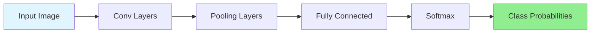
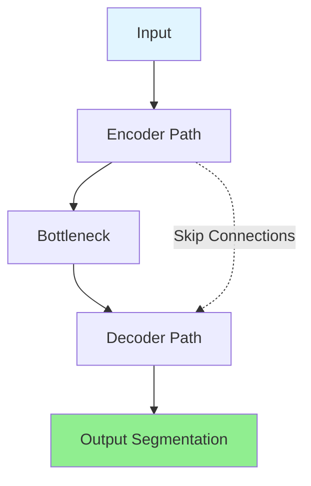
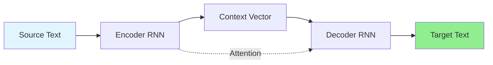

# Machine Learning Applications

## Introduction

Machine learning has transitioned from academic research to transforming virtually every industry and aspect of modern life. What began as theoretical algorithms for pattern recognition has evolved into practical systems that power search engines, enable autonomous vehicles, diagnose diseases, detect fraud, and generate creative content. Understanding these applications provides context for why we study ML algorithms and motivates the techniques we'll learn throughout this course.

The breadth of ML applications is staggering. From the recommendation systems that suggest what to watch on Netflix or buy on Amazon, to the speech recognition that powers voice assistants, to the computer vision systems that enable self-driving cars—machine learning is everywhere. This ubiquity reflects ML's fundamental capability: learning patterns from data and applying them to make predictions or decisions.

In this chapter, we explore major application domains, examining the specific ML techniques used, challenges faced, and real-world impact. We'll see how supervised learning, unsupervised learning, and reinforcement learning combine to solve complex problems across industries.

## Computer Vision

Computer vision aims to enable machines to understand and interpret visual information from images and videos. This field has seen explosive growth with deep learning, achieving human-level or superhuman performance on many tasks.

### Image Classification

**Problem:** Assign one or more labels to an image.

**Examples:**
- Medical imaging: Identifying diseases from X-rays, MRIs, CT scans
- Quality control: Detecting manufacturing defects
- Content moderation: Flagging inappropriate images
- Species identification: Classifying animals or plants

**ML Approaches:**

**Convolutional Neural Networks (CNNs):**

The dominant architecture for image classification:

**Key Architectures:**
- **LeNet-5 (1998):** Digit recognition
- **AlexNet (2012):** ImageNet breakthrough, 8 layers
- **VGGNet (2014):** Deeper networks (16-19 layers)
- **ResNet (2015):** Residual connections, 50-152 layers
- **EfficientNet (2019):** Optimized accuracy-efficiency tradeoff

**Training Process:**

1. **Data Collection:** Gather labeled images (ImageNet: 14M images, 20K categories)
2. **Preprocessing:** Resize, normalize, augment (flip, rotate, crop)
3. **Model Training:** Minimize cross-entropy loss
   $$L = -\sum_{i}\sum_{c}y_{ic}\log(p_{ic})$$
4. **Transfer Learning:** Fine-tune pre-trained models on specific tasks

**Success Story: Medical Imaging**

**Diabetic Retinopathy Detection:**
- Google's model achieved 90% sensitivity and 98% specificity
- Matches or exceeds ophthalmologist performance
- Enables screening in areas lacking specialists

**Impact:** Early detection prevents blindness in millions

### Object Detection

**Problem:** Locate and classify multiple objects within an image.

**Output:** Bounding boxes + class labels

**Applications:**
- Autonomous vehicles: Detecting pedestrians, vehicles, traffic signs
- Surveillance: Tracking people and objects
- Retail: Automated checkout (Amazon Go)
- Sports analytics: Player and ball tracking

**Algorithms:**

**Two-Stage Detectors:**

**R-CNN Family (Region-based CNN):**

1. **Region Proposals:** Generate candidate object regions (Selective Search)
2. **Feature Extraction:** Run CNN on each region
3. **Classification:** Classify region contents
4. **Bounding Box Refinement:** Adjust box coordinates

Evolution:
- **R-CNN (2014):** Slow, separate stages
- **Fast R-CNN (2015):** Share computation across regions
- **Faster R-CNN (2015):** Learn region proposals with RPN (Region Proposal Network)

**One-Stage Detectors:**

**YOLO (You Only Look Once):**

Single pass through network:
1. Divide image into grid
2. Each grid cell predicts bounding boxes and probabilities
3. Post-processing: Non-maximum suppression

**Advantages:**
- Real-time speed (30-60 FPS)
- Global context (sees entire image)

**Trade-off:** Slightly lower accuracy than two-stage methods

**SSD (Single Shot Detector):**
Multiple feature maps at different scales for detecting objects of various sizes.

**Success Story: Autonomous Vehicles**

**Tesla Autopilot / FSD:**
- Detects vehicles, pedestrians, cyclists, lane markings
- Predicts trajectories
- Plans safe paths
- Processes 8 cameras at 36 FPS

**Challenges:**
- Long-tail distribution (rare scenarios)
- Adversarial conditions (fog, rain, night)
- Safety-critical requirements

### Image Segmentation

**Problem:** Classify every pixel in an image.

**Types:**

**Semantic Segmentation:**
- Classify each pixel into categories
- No distinction between instances

**Instance Segmentation:**
- Identify individual object instances
- Separate overlapping objects

**Panoptic Segmentation:**
- Combines semantic and instance segmentation

**Applications:**
- Medical imaging: Tumor segmentation, organ delineation
- Satellite imagery: Land use classification, crop monitoring
- Augmented reality: Background removal, effects
- Robotics: Scene understanding for manipulation

**Architectures:**

**U-Net:**

Encoder-decoder with skip connections:

**FCN (Fully Convolutional Network):**
- Replace fully connected layers with convolutional layers
- Upsample to original resolution

**Mask R-CNN:**
- Extends Faster R-CNN
- Adds mask prediction branch for instance segmentation

**DeepLab:**
- Atrous convolution for multi-scale processing
- CRF (Conditional Random Field) for refinement

### Face Recognition

**Problem:** Identify or verify individuals from facial images.

**Applications:**
- Security: Access control, surveillance
- Authentication: Smartphone unlock, payment verification
- Photo organization: Auto-tagging in Google Photos
- Law enforcement: Suspect identification

**Approaches:**

**Face Detection:** Locate faces in images
- Haar cascades (classical)
- MTCNN (Multi-task Cascaded CNN)
- RetinaFace

**Face Alignment:** Normalize pose and scale
- Detect facial landmarks (eyes, nose, mouth)
- Affine transformation to standard pose

**Face Recognition:** Extract and compare face embeddings

**DeepFace (Facebook, 2014):**
- 97.35% accuracy on LFW dataset
- Approaching human performance (97.53%)

**FaceNet (Google, 2015):**
- Learn embeddings directly via triplet loss
- $$L = \max(||f(A) - f(P)||^2 - ||f(A) - f(N)||^2 + \alpha, 0)$$
  - $$A$$: Anchor image
  - $$P$$: Positive (same person)
  - $$N$$: Negative (different person)
  - $$\alpha$$: Margin

**Verification vs. Identification:**

**Verification (1:1):**
- Is this person who they claim to be?
- Compare embedding to claimed identity
- Threshold on distance

**Identification (1:N):**
- Who is this person?
- Find nearest match in database
- Challenges with large $$N$$

**Ethical Considerations:**
- Privacy concerns
- Bias across demographics (lower accuracy for underrepresented groups)
- Surveillance and civil liberties
- Consent and data usage

## Natural Language Processing (NLP)

NLP enables machines to understand, interpret, and generate human language. Recent advances with transformers and large language models have revolutionized this field.

### Text Classification

**Problem:** Assign categories to text documents.

**Applications:**

**Sentiment Analysis:**
- Product reviews: Positive/Negative/Neutral
- Social media monitoring: Brand perception
- Customer feedback: Identify issues

**Spam Detection:**
- Email filtering
- Comment moderation
- Fraud detection

**Topic Classification:**
- News categorization
- Document organization
- Content routing

**Approaches:**

**Classical ML:**

**Bag-of-Words + Naive Bayes:**

Represent text as word counts:
$$x = [count(word_1), count(word_2), ..., count(word_V)]$$

Naive Bayes classifier:
$$P(C|x) \propto P(C)\prod_{i}P(x_i|C)$$

**TF-IDF + SVM:**

$$\text{TF-IDF}(w, d) = \text{TF}(w, d) \cdot \text{IDF}(w)$$

$$\text{TF}(w, d) = \frac{\text{count}(w, d)}{\text{total words in } d}$$

$$\text{IDF}(w) = \log\frac{\text{total documents}}{\text{documents containing } w}$$

**Deep Learning:**

**RNN/LSTM:**
- Process text sequentially
- Capture long-range dependencies

**CNN for Text:**
- Convolutional filters over word embeddings
- Fast and effective for classification

**Transformers (BERT, RoBERTa):**
- Pre-trained on massive corpora
- Fine-tune on specific classification tasks
- State-of-the-art performance

**Example: BERT Fine-tuning**

1. Start with pre-trained BERT
2. Add classification head
3. Fine-tune on labeled data
4. Achieves 90%+ accuracy on many tasks

### Machine Translation

**Problem:** Translate text from one language to another.

**Applications:**
- Google Translate (100+ languages)
- Real-time conversation translation
- Document translation
- Accessibility (subtitle translation)

**Evolution:**

**Rule-Based (1950s-1990s):**
- Hand-crafted grammar rules
- Dictionaries
- Poor quality, no generalization

**Statistical Machine Translation (1990s-2014):**
- Learn from parallel corpora
- Phrase-based translation
- $$P(target|source) = \arg\max_{target} P(source|target) \cdot P(target)$$

**Neural Machine Translation (2014-present):**

**Seq2Seq with Attention:**

**Transformer Architecture (2017):**
- Self-attention mechanism
- Parallel processing (no sequential bottleneck)
- "Attention is All You Need" paper

**Attention Mechanism:**

$$\text{Attention}(Q, K, V) = \text{softmax}\left(\frac{QK^T}{\sqrt{d_k}}\right)V$$

**Modern Systems:**
- Google Neural Machine Translation
- Facebook M2M-100 (100 languages)
- DeepL (high-quality European languages)

**Quality Metrics:**

**BLEU Score (Bilingual Evaluation Understudy):**

Measures n-gram overlap with reference translations:

$$\text{BLEU} = BP \cdot \exp\left(\sum_{n=1}^{4}w_n\log p_n\right)$$

where $$p_n$$ is modified n-gram precision.

**Limitations:**
- Doesn't capture meaning well
- Can be gamed
- Human evaluation still gold standard

### Question Answering

**Problem:** Answer questions based on text or knowledge.

**Types:**

**Extractive QA:**
- Answer is span of text from document
- SQuAD dataset: "Where was Marie Curie born?" → "Warsaw"

**Generative QA:**
- Generate answer in natural language
- May synthesize from multiple sources

**Open-Domain QA:**
- Answer from general knowledge
- No specific document provided

**Approaches:**

**Reading Comprehension (Extractive):**

**BERT for QA:**
1. Input: [CLS] Question [SEP] Context [SEP]
2. Output: Start and end positions of answer span
3. Fine-tune on SQuAD dataset

**Performance:**
- Human performance: 91% F1
- BERT: 93% F1 (superhuman!)

**Open-Domain QA:**

**Retrieve and Read:**
1. **Retriever:** Find relevant documents (TF-IDF, BM25, dense retrieval)
2. **Reader:** Extract answer from retrieved documents (BERT)

**End-to-End Models:**
- RAG (Retrieval-Augmented Generation)
- Combines retrieval with generation
- GPT-based models with retrieval

### Text Generation

**Problem:** Generate coherent, fluent text.

**Applications:**
- Content creation
- Code generation (GitHub Copilot)
- Dialogue systems (ChatGPT)
- Summarization
- Creative writing

**Language Models:**

**Autoregressive Generation:**

$$P(x_1, ..., x_T) = \prod_{t=1}^{T}P(x_t|x_1, ..., x_{t-1})$$

Generate one token at a time, conditioning on previous tokens.

**GPT (Generative Pre-trained Transformer):**

**Architecture:**
- Transformer decoder
- Unidirectional (causal) attention
- Massive scale (GPT-3: 175B parameters)

**Training:**
1. **Pre-training:** Predict next token on massive text corpus
   $$L = -\sum_{i}\log P(x_i|x_1, ..., x_{i-1})$$
2. **Fine-tuning:** Optional task-specific tuning
3. **Prompting:** Few-shot learning via examples in prompt

**Capabilities:**
- Text completion
- Question answering
- Translation
- Code generation
- Creative writing
- Conversation

**Challenges:**
- Hallucination (generating false information)
- Bias (reflecting training data biases)
- Inconsistency
- Lack of grounding

## Recommendation Systems

Recommendation systems suggest items users might like, powering e-commerce, streaming services, and content platforms.

### Collaborative Filtering

**Problem:** Recommend based on user-item interactions.

**Assumption:** Users with similar past preferences will have similar future preferences.

**Approaches:**

**User-Based Collaborative Filtering:**

1. Find users similar to target user
2. Recommend items those similar users liked

**Similarity Metrics:**

**Cosine Similarity:**
$$\text{sim}(u, v) = \frac{\sum_{i}r_{ui}r_{vi}}{\sqrt{\sum_{i}r_{ui}^2}\sqrt{\sum_{i}r_{vi}^2}}$$

**Pearson Correlation:**
$$\text{sim}(u, v) = \frac{\sum_{i}(r_{ui} - \bar{r}_u)(r_{vi} - \bar{r}_v)}{\sqrt{\sum_{i}(r_{ui} - \bar{r}_u)^2}\sqrt{\sum_{i}(r_{vi} - \bar{r}_v)^2}}$$

**Item-Based Collaborative Filtering:**

1. Find items similar to items user liked
2. Recommend those similar items

**More scalable:** Item similarities more stable than user similarities.

**Matrix Factorization:**

Decompose user-item rating matrix:

$$R \approx U V^T$$

where:
- $$R \in \mathbb{R}^{m \times n}$$: Rating matrix (users × items)
- $$U \in \mathbb{R}^{m \times k}$$: User embeddings
- $$V \in \mathbb{R}^{n \times k}$$: Item embeddings
- $$k$$: Latent dimension

**Predicted Rating:**
$$\hat{r}_{ui} = u_u^T v_i$$

**Loss Function:**
$$L = \sum_{(u,i) \in \text{observed}}\left(r_{ui} - u_u^T v_i\right)^2 + \lambda(||U||^2 + ||V||^2)$$

**Algorithms:**
- SVD (Singular Value Decomposition)
- ALS (Alternating Least Squares)
- SGD (Stochastic Gradient Descent)

**Netflix Prize (2006-2009):**
- $1M prize for 10% improvement
- Winning solution: Ensemble of matrix factorization methods
- Demonstrated power of collaborative filtering

### Content-Based Filtering

**Problem:** Recommend based on item features.

**Approach:**
1. Extract features from items (genre, actors, keywords)
2. Build profile of user preferences
3. Recommend items matching user profile

**Example: Movie Recommendations**

**Item Features:**
$$v_{\text{movie}} = [\text{genre}, \text{actors}, \text{director}, \text{year}, ...]$$

**User Profile:**
$$u_{\text{user}} = \text{avg}(v_{\text{liked movies}})$$

**Score:**
$$\text{score}(u, i) = \text{sim}(u_{\text{user}}, v_{\text{item}})$$

**Advantages:**
- No cold start for new users (use features)
- Explainable (based on item attributes)
- No need for other users' data

**Disadvantages:**
- Limited discovery (recommends similar to past)
- Requires good feature engineering
- Overspecialization

### Hybrid Systems

Combine collaborative and content-based approaches.

**Strategies:**

**Weighted Hybrid:**
$$\text{score} = \alpha \cdot \text{score}_{\text{CF}} + (1-\alpha) \cdot \text{score}_{\text{content}}$$

**Switching:**
- Use content-based for new items (cold start)
- Use collaborative filtering for established items

**Cascade:**
- One method filters candidates
- Another method ranks filtered items

**Feature Augmentation:**
- Use collaborative filtering to generate features
- Feed into content-based model

**Meta-Level:**
- Use content-based to build user profile
- Use profile in collaborative filtering

**Real-World Systems:**

**YouTube:**
- Candidate generation (collaborative filtering)
- Ranking (deep learning on features)
- Freshness, diversity, exploration

**Spotify:**
- Collaborative filtering
- Content-based (audio analysis)
- NLP on playlist titles and descriptions
- Reinforcement learning for playlists

**Amazon:**
- Item-to-item collaborative filtering
- "Customers who bought this also bought..."
- Scalable to millions of items

### Evaluation Metrics

**Offline Metrics:**

**RMSE (Root Mean Squared Error):**
$$\text{RMSE} = \sqrt{\frac{1}{n}\sum_{i=1}^{n}(r_i - \hat{r}_i)^2}$$

**Precision@K:**
$$\text{Precision@K} = \frac{\text{Relevant items in top K}}{K}$$

**Recall@K:**
$$\text{Recall@K} = \frac{\text{Relevant items in top K}}{\text{Total relevant items}}$$

**MAP (Mean Average Precision):**

Average precision across all users.

**NDCG (Normalized Discounted Cumulative Gain):**

Accounts for ranking position:

$$\text{DCG@K} = \sum_{i=1}^{K}\frac{2^{rel_i} - 1}{\log_2(i+1)}$$

**Online Metrics (A/B Testing):**
- Click-through rate (CTR)
- Conversion rate
- User engagement (time spent)
- Long-term retention

## Fraud Detection

Detecting fraudulent transactions, accounts, or activities is critical for financial services, e-commerce, and online platforms.

### Credit Card Fraud

**Problem:** Identify fraudulent credit card transactions in real-time.

**Challenges:**
- **Extreme class imbalance:** <0.1% of transactions are fraudulent
- **Real-time requirements:** Decide within milliseconds
- **Evolving patterns:** Fraudsters adapt to detection
- **Cost asymmetry:** False positives annoy customers, false negatives cost money

**Features:**

**Transaction Features:**
- Amount
- Merchant category
- Location
- Time of day
- Online vs. in-person

**Derived Features:**
- Deviation from typical spending
- Velocity (transactions per time)
- Geographic impossibility (two distant locations in short time)
- Historical patterns

**Approaches:**

**Anomaly Detection:**

**Isolation Forest:**
- Build random trees
- Anomalies are easier to isolate (shorter path length)
- Effective for high-dimensional data

**One-Class SVM:**
- Learn boundary around normal transactions
- Flag points outside boundary as anomalies

**Autoencoders:**
- Train to reconstruct normal transactions
- High reconstruction error indicates anomaly

**Supervised Learning:**

**Random Forests:**
- Handle imbalanced data with class weights
- Feature importance for interpretability
- Ensemble reduces false positives

**Gradient Boosting (XGBoost):**
- State-of-the-art performance
- Handles class imbalance
- Fast inference

**Neural Networks:**
- Deep learning on transaction sequences
- LSTM for temporal patterns
- Graph neural networks for network fraud

**Handling Class Imbalance:**

**Data-Level:**
- Oversample minority class (SMOTE)
- Undersample majority class
- Generate synthetic fraudulent transactions

**Algorithm-Level:**
- Class weights in loss function
- Focal loss (focuses on hard examples)

**Metric Selection:**
- Avoid accuracy (misleading with imbalance)
- Use precision, recall, F1, AUC-PR
- Cost-sensitive metrics (weight false negatives higher)

**Deployment:**

**Real-Time Scoring:**
1. Extract features from transaction
2. Model predicts fraud probability
3. If probability > threshold, flag for review or block
4. If borderline, request additional authentication

**Feedback Loop:**
1. Collect labels (confirmed fraud, customer disputes)
2. Retrain model periodically
3. Monitor performance for drift

**Success Metrics:**
- Fraud detection rate (recall)
- False positive rate (avoid blocking legitimate transactions)
- Revenue saved vs. cost of false positives

### Insurance Fraud

**Types:**
- Application fraud (false information)
- Claims fraud (exaggerating or fabricating claims)
- Staged accidents
- Provider fraud (billing for services not provided)

**ML Approaches:**

**Network Analysis:**
- Build graphs of entities (claimants, providers, vehicles)
- Detect suspicious patterns (fraud rings)
- Graph neural networks

**Anomaly Detection:**
- Identify unusual claim patterns
- Compare to historical norms
- Medical billing outliers

**Text Analysis:**
- NLP on claim descriptions
- Detect inconsistencies
- Similarity to known fraud cases

## Conclusion

Machine learning applications span virtually every domain, from computer vision enabling autonomous vehicles and medical diagnosis, to NLP powering translation and question answering, to recommendation systems personalizing online experiences, to fraud detection protecting financial systems.

Each application domain requires understanding both ML algorithms and domain-specific challenges. Computer vision relies heavily on CNNs and transfer learning. NLP has been revolutionized by transformers and pre-training. Recommendation systems combine collaborative filtering and content-based methods. Fraud detection must handle extreme class imbalance and evolving patterns.

Common themes across applications:
- **Data quality** is paramount
- **Domain knowledge** guides feature engineering and model selection
- **Deployment** requires real-time inference, monitoring, and retraining
- **Evaluation** must match business objectives, not just academic metrics
- **Ethics** matter—bias, fairness, privacy, and accountability

As ML practitioners, understanding these applications motivates our study of algorithms, provides context for technical choices, and reminds us that ML is ultimately about solving real-world problems and creating value. The algorithms we learn are not academic exercises but tools for transforming industries and improving lives.