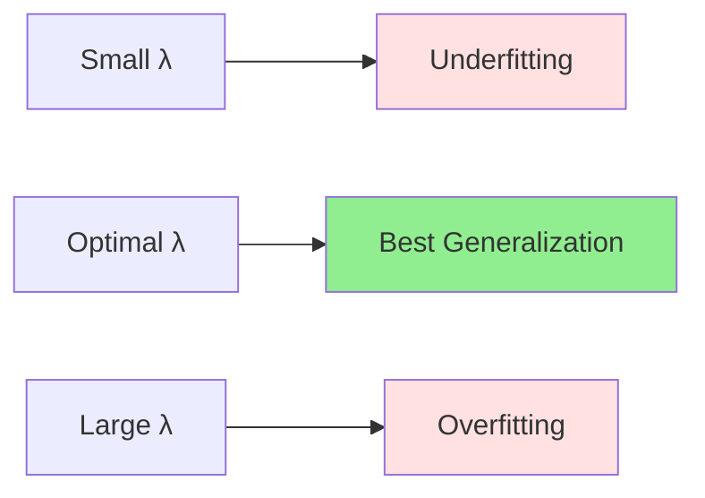

# Regularization in Linear Models

## Introduction

Regularization is one of the most powerful techniques for preventing overfitting and improving model generalization. While we introduced regularization conceptually in the bias-variance tradeoff chapter, here we dive deep into specific regularization techniques for linear models: L1 (Lasso), L2 (Ridge), and Elastic Net.

The fundamental idea behind regularization is to add a penalty term to the loss function that discourages complex models. By penalizing large parameter values, regularization produces simpler models that generalize better to unseen data. This embodies Occam's Razor: among models that fit the data equally well, prefer the simplest.

Regularization isn't just a mathematical trick—it reflects a principled approach to machine learning. In the face of limited data, we need inductive biases that guide learning toward solutions likely to generalize. Regularization provides such biases, encoding preferences for smaller weights, sparser models, or smoother functions.

## The Regularization Framework

### Modified Loss Function

Without regularization:
$$J(\theta) = \frac{1}{2m}\sum_{i=1}^{m}(h_\theta(x^{(i)}) - y^{(i)})^2$$

With regularization:
$$J(\theta) = \underbrace{\frac{1}{2m}\sum_{i=1}^{m}(h_\theta(x^{(i)}) - y^{(i)})^2}_{\text{Data Loss (Fit)}} + \underbrace{\lambda R(\theta)}_{\text{Regularization (Complexity)}}$$

where:
- $$R(\theta)$$: Regularization term (penalty on parameters)
- $$\lambda \geq 0$$: Regularization strength (hyperparameter)

**Trade-off:**
- Small $$\lambda$$: Emphasize data fit (risk overfitting)
- Large $$\lambda$$: Emphasize simplicity (risk underfitting)
- $$\lambda = 0$$: No regularization (ordinary least squares)

### Why Regularization Works

**Bias-Variance Perspective:**
- Increases bias (constrained parameter space)
- Decreases variance (less sensitive to training data)
- Optimal $$\lambda$$ minimizes total error

**Bayesian Interpretation:**
Regularization corresponds to maximum a posteriori (MAP) estimation with prior:
- L2: Gaussian prior $$p(\theta) \propto e^{-\frac{1}{2\sigma^2}||\theta||^2}$$
- L1: Laplace prior $$p(\theta) \propto e^{-\frac{1}{\tau}||\theta||_1}$$

**Preventing Overfitting:**
- Large weights magnify noise in features
- Regularization limits weight magnitudes
- Model focuses on consistent patterns, ignores noise

## L2 Regularization (Ridge Regression)

### Definition

Ridge regression adds the **squared L2 norm** of parameters:

$$J(\theta) = \frac{1}{2m}\sum_{i=1}^{m}(y^{(i)} - \theta^T x^{(i)})^2 + \frac{\lambda}{2}||\theta||_2^2$$

$$||\theta||_2^2 = \sum_{j=1}^{n}\theta_j^2$$

**Note:** Typically exclude the intercept $$\theta_0$$ from regularization:

$$||\theta||_2^2 = \sum_{j=1}^{n}\theta_j^2$$ (excluding $$\theta_0$$)

### Matrix Formulation

$$J(\theta) = \frac{1}{2m}||y - X\theta||^2 + \frac{\lambda}{2}||\theta||^2$$

**Gradient:**

$$\nabla_\theta J = \frac{1}{m}X^T(X\theta - y) + \lambda\theta$$

**Closed-Form Solution:**

Setting gradient to zero:

$$\frac{1}{m}X^T(X\theta - y) + \lambda\theta = 0$$

$$X^T X\theta + m\lambda\theta = X^T y$$

$$(X^T X + m\lambda I)\theta = X^T y$$

$$\theta_{Ridge} = (X^T X + m\lambda I)^{-1}X^T y$$

**Key difference from OLS:**

The term $$m\lambda I$$ ensures $$(X^T X + m\lambda I)$$ is invertible even when $$X^T X$$ is singular!

### Properties

**Shrinkage:**

Ridge regression **shrinks coefficients** toward zero but never exactly to zero.

**Effect on eigenvalues:**

If $$X^T X$$ has eigenvalues $$\{\lambda_1, ..., \lambda_n\}$$, then $$(X^T X + m\lambda I)$$ has eigenvalues $$\{\lambda_1 + m\lambda, ..., \lambda_n + m\lambda\}$$.

**Impact:**
- Small eigenvalues (directions with little variance) are increased most
- Reduces condition number
- Improves numerical stability

**No feature selection:**

All features retained (non-zero coefficients), but less important features have small coefficients.

**Handles multicollinearity:**

When features are correlated, OLS coefficients have high variance. Ridge stabilizes by shrinking coefficients.

### Gradient Descent for Ridge

**Update rule:**

$$\theta = \theta - \alpha\left[\frac{1}{m}X^T(X\theta - y) + \lambda\theta\right]$$

$$\theta = \theta - \alpha\frac{1}{m}X^T(X\theta - y) - \alpha\lambda\theta$$

$$\theta = (1 - \alpha\lambda)\theta - \alpha\frac{1}{m}X^T(X\theta - y)$$

The term $$(1 - \alpha\lambda)$$ implements **weight decay**: parameters shrink by factor $$(1 - \alpha\lambda)$$ each iteration.

### Choosing Lambda

**Cross-Validation:**

1. Define candidate values: $$\lambda \in \{0.001, 0.01, 0.1, 1, 10, 100\}$$
2. For each $$\lambda$$:
   - Train model on training set
   - Evaluate on validation set
3. Choose $$\lambda$$ with best validation performance

**Regularization Path:**

Plot validation error vs. $$\log(\lambda)$$:



**Analytical methods:**

- Generalized Cross-Validation (GCV)
- Akaike Information Criterion (AIC)
- Bayesian Information Criterion (BIC)

## L1 Regularization (Lasso Regression)

### Definition

Lasso (Least Absolute Shrinkage and Selection Operator) adds the **L1 norm** of parameters:

$$J(\theta) = \frac{1}{2m}\sum_{i=1}^{m}(y^{(i)} - \theta^T x^{(i)})^2 + \lambda||\theta||_1$$

$$||\theta||_1 = \sum_{j=1}^{n}|\theta_j|$$

### Key Difference from Ridge

**Sparsity:** Lasso drives some coefficients **exactly to zero**, performing automatic feature selection.

**Why?**

The L1 penalty's geometry at zero creates a "corner" that solutions tend to hit.

**Geometric Intuition:**

Imagine contours of data loss (ellipses) and regularization constraint:
- L2 constraint: Circle ($$\theta_1^2 + \theta_2^2 \leq t$$)
- L1 constraint: Diamond ($$|\theta_1| + |\theta_2| \leq t$$)

The diamond has corners on the axes where some $$\theta_j = 0$$. The loss contours are more likely to first touch the constraint at these corners, yielding sparse solutions.

### No Closed-Form Solution

Unlike Ridge, Lasso has **no analytical solution** due to non-differentiability of $$|\theta_j|$$ at $$\theta_j = 0$$.

**Optimization methods:**
- Coordinate descent
- Proximal gradient methods
- LARS (Least Angle Regression)
- Iterative soft thresholding

### Coordinate Descent for Lasso

Update one parameter at a time while holding others fixed.

**For parameter $$\theta_j$$:**

$$\theta_j = \text{SoftThreshold}\left(\frac{1}{m}\sum_{i}x_j^{(i)}(y^{(i)} - \sum_{k \neq j}\theta_k x_k^{(i)}), \lambda\right)$$

**Soft Thresholding Operator:**

$$\text{SoftThreshold}(z, \lambda) = \begin{cases}
z - \lambda & \text{if } z > \lambda \\
0 & \text{if } |z| \leq \lambda \\
z + \lambda & \text{if } z < -\lambda
\end{cases}$$

**Compact form:**

$$\text{SoftThreshold}(z, \lambda) = \text{sign}(z) \cdot \max(|z| - \lambda, 0)$$

### Properties

**Feature Selection:**

Lasso automatically identifies and removes irrelevant features by setting their coefficients to zero.

**Sparse Solutions:**

Typical for many (or most) coefficients to be exactly zero, especially with large $$\lambda$$.

**Variable Selection:**

Useful when:
- Many features are irrelevant
- Interpretability is important
- Computational efficiency needed (fewer features)

**Limitations:**

**Grouped Variables:**
When features are highly correlated, Lasso tends to select one arbitrarily and ignore others.

**$$n > m$$ problem:**
Lasso selects at most $$m$$ features when $$n > m$$ (more features than examples).

### Choosing Lambda

Same cross-validation approach as Ridge, but with different effects:

**Small $$\lambda$$:**
- Many non-zero coefficients
- Closer to OLS
- Risk overfitting

**Large $$\lambda$$:**
- Very few non-zero coefficients
- Strong feature selection
- Risk underfitting

**Regularization Path:**

As $$\lambda$$ increases from 0:
- Coefficients shrink toward zero
- Some hit zero and stay zero
- More features eliminated

## Elastic Net

### Definition

Elastic Net combines L1 and L2 regularization:

$$J(\theta) = \frac{1}{2m}\sum_{i=1}^{m}(y^{(i)} - \theta^T x^{(i)})^2 + \lambda\left[\frac{1-\alpha}{2}||\theta||_2^2 + \alpha||\theta||_1\right]$$

where:
- $$\lambda$$: Overall regularization strength
- $$\alpha \in [0,1]$$: Mixing parameter
  - $$\alpha = 0$$: Pure Ridge
  - $$\alpha = 1$$: Pure Lasso
  - $$0 < \alpha < 1$$: Mix of both

**Alternative parameterization:**

$$J(\theta) = \frac{1}{2m}\sum_{i=1}^{m}(y^{(i)} - \theta^T x^{(i)})^2 + \lambda_1||\theta||_1 + \lambda_2||\theta||_2^2$$

### Motivation

**Best of both worlds:**

**From L1 (Lasso):**
- Sparse solutions
- Feature selection

**From L2 (Ridge):**
- Handles correlated features better
- Selects groups of correlated features together
- More stable than Lasso

### When to Use Elastic Net

**Highly correlated features:**

Lasso arbitrarily selects one feature from correlated group. Elastic Net selects all or none.

**$$n < m$$ (more features than examples):**

Lasso selects at most $$m$$ features. Elastic Net can select more.

**Grouped selection:**

When domain knowledge suggests features should be selected together.

### Optimization

Similar to Lasso, use coordinate descent or proximal methods.

**Update for $$\theta_j$$:**

$$\theta_j = \frac{\text{SoftThreshold}(z_j, \lambda\alpha)}{1 + \lambda(1-\alpha)}$$

where $$z_j$$ is the partial residual correlation.

### Hyperparameter Tuning

Two hyperparameters: $$\lambda$$ and $$\alpha$$

**Grid search:**

```python
for λ in [0.001, 0.01, 0.1, 1, 10]:
    for α in [0.1, 0.3, 0.5, 0.7, 0.9]:
        train model with (λ, α)
        evaluate on validation set
choose (λ*, α*) with best validation performance
```

**Common practice:**

- Start with $$\alpha = 0.5$$ (equal mix)
- Adjust based on validation performance
- Use nested cross-validation for robust selection

## Comparison of Regularization Methods

### Summary Table

| Aspect | Ridge (L2) | Lasso (L1) | Elastic Net |
|--------|------------|------------|-------------|
| Penalty | $$\sum \theta_j^2$$ | $$\sum \vert\theta_j\vert$$ | Mix of L1 and L2 |
| Sparsity | No | Yes | Yes |
| Feature Selection | No | Yes | Yes |
| Closed-form | Yes | No | No |
| Correlated Features | All retained | Arbitrary selection | Group selection |
| Computational | Fast | Medium | Medium |
| Interpretability | Moderate | High | High |

### Choosing the Right Regularization

**Use Ridge when:**
- All features are potentially relevant
- Features are correlated (multicollinearity)
- Computational speed is priority
- Closed-form solution desired

**Use Lasso when:**
- Many features are irrelevant
- Feature selection is important
- Interpretability is crucial
- Sparse models needed

**Use Elastic Net when:**
- Many correlated features
- Want feature selection but better than Lasso
- $$n < m$$ (more features than samples)
- Grouped feature selection desired

**Default recommendation:**

Start with Elastic Net ($$\alpha = 0.5$$) as it's most robust. Adjust based on validation performance.

## Regularization Effects

### Coefficient Paths

**Ridge:** Coefficients smoothly shrink toward zero as $$\lambda$$ increases, but never reach exactly zero.

**Lasso:** Coefficients hit zero at different $$\lambda$$ values. Creates piecewise linear paths.

**Elastic Net:** Combines smooth shrinkage with sparsity. More features go to zero than Ridge but more stable selection than Lasso.

### Impact on Bias and Variance

**Increasing $$\lambda$$:**

**Bias:** Increases (model constrained, less flexible)

**Variance:** Decreases (less sensitive to training data)

**Training Error:** Increases (worse fit to training data)

**Test Error:** Decreases then increases (U-shaped)

**Optimal $$\lambda$$:** Minimizes test error, balancing bias and variance.

### Standardization Importance

**Regularization is scale-dependent!**

Features with larger scales receive larger penalties.

**Solution:** Standardize features before regularization:

$$x_j' = \frac{x_j - \mu_j}{\sigma_j}$$

**Procedure:**
1. Standardize features on training set
2. Apply same transformation to test set (using training $$\mu$$, $$\sigma$$)
3. Train regularized model
4. (Optional) Transform coefficients back to original scale

### Intercept Term

**Do NOT regularize the intercept $$\theta_0$$!**

Regularizing intercept would make model dependent on target variable scale.

**Implementation:**
- Exclude $$\theta_0$$ from penalty
- Or center target variable (subtract mean) so intercept ≈ 0

## Practical Implementation

### Ridge Regression (Python-style pseudocode)

```python
def ridge_regression(X, y, λ):
    # Add regularization to normal equations
    n = X.shape[1]
    θ = inv(X.T @ X + λ * I) @ X.T @ y
    return θ

def ridge_gradient_descent(X, y, λ, α, epochs):
    m, n = X.shape
    θ = zeros(n)

    for epoch in range(epochs):
        # Gradient with L2 penalty
        gradient = (1/m) * X.T @ (X @ θ - y) + λ * θ
        θ = θ - α * gradient

    return θ
```

### Lasso Regression (Coordinate Descent)

```python
def soft_threshold(z, λ):
    return sign(z) * max(abs(z) - λ, 0)

def lasso_coordinate_descent(X, y, λ, max_iter):
    m, n = X.shape
    θ = zeros(n)

    for iteration in range(max_iter):
        for j in range(n):
            # Compute partial residual
            r = y - X @ θ + X[:, j] * θ[j]

            # Update θ_j
            z_j = (1/m) * X[:, j].T @ r
            θ[j] = soft_threshold(z_j, λ)

    return θ
```

### Cross-Validation for Lambda Selection

```python
def select_lambda_cv(X, y, lambdas, k=5):
    best_λ = None
    best_score = inf

    for λ in lambdas:
        scores = []

        for train_idx, val_idx in k_fold_split(X, k):
            X_train, y_train = X[train_idx], y[train_idx]
            X_val, y_val = X[val_idx], y[val_idx]

            θ = ridge_regression(X_train, y_train, λ)
            error = mse(X_val @ θ, y_val)
            scores.append(error)

        avg_score = mean(scores)
        if avg_score < best_score:
            best_score = avg_score
            best_λ = λ

    return best_λ
```

## Advanced Topics

### Bayesian Interpretation

**Ridge Regression:**

Equivalent to MAP estimation with Gaussian prior:

$$p(\theta) = \mathcal{N}(0, \frac{1}{\lambda}I)$$

The regularization term $$\frac{\lambda}{2}||\theta||^2$$ is the negative log prior.

**Lasso Regression:**

Equivalent to MAP estimation with Laplace prior:

$$p(\theta_j) \propto e^{-\lambda|\theta_j|}$$

Laplace prior has more probability mass at zero, encouraging sparsity.

### Adaptive Lasso

Weights the L1 penalty differently for each coefficient:

$$J(\theta) = \frac{1}{2m}||y - X\theta||^2 + \lambda\sum_{j}w_j|\theta_j|$$

where $$w_j = \frac{1}{|\hat{\theta}_j^{OLS}|^\gamma}$$

**Effect:** Less penalty on large coefficients, more on small ones.

**Advantage:** Oracle property—with large enough data, selects true model.

### Group Lasso

For grouped features, penalize group norms:

$$J(\theta) = \frac{1}{2m}||y - X\theta||^2 + \lambda\sum_{g}||\theta_g||_2$$

**Effect:** Entire groups selected or eliminated together.

**Use case:** Categorical variables (one-hot encoded), polynomial terms.

### Fused Lasso

Penalizes differences between adjacent coefficients:

$$J(\theta) = \frac{1}{2m}||y - X\theta||^2 + \lambda_1||\theta||_1 + \lambda_2\sum_{j}|\theta_j - \theta_{j-1}|$$

**Use case:** Sequential data where adjacent features should have similar coefficients.

## Regularization Beyond Linear Models

While we've focused on linear regression, regularization applies broadly:

**Logistic Regression:** Same L1/L2 penalties on coefficients

**Neural Networks:**
- L2 (weight decay)
- Dropout
- Batch normalization

**Support Vector Machines:** L2 regularization built into formulation

**Decision Trees:** Pruning (implicit regularization)

**General Principle:** Add constraints or penalties to prevent overfitting.

## Conclusion

Regularization is essential for building models that generalize well. By adding penalty terms to the loss function, we guide learning toward simpler solutions that are less prone to overfitting.

**Key takeaways:**

- **Ridge (L2):** Shrinks coefficients, handles multicollinearity, no feature selection
- **Lasso (L1):** Sparse solutions, automatic feature selection, less stable with correlated features
- **Elastic Net:** Combines L1 and L2 benefits, most robust in practice
- **Lambda tuning:** Use cross-validation to select regularization strength
- **Standardization:** Always standardize features before regularization

Understanding regularization deepens our grasp of the bias-variance tradeoff and provides practical tools for improving model performance. As we move to more complex models, these regularization principles will recur in various forms, from dropout in neural networks to tree pruning in random forests.

Regularization transforms machine learning from simply fitting data to building models that generalize. It embodies the principle that simplicity, when balanced with fit, leads to better predictions on unseen data.