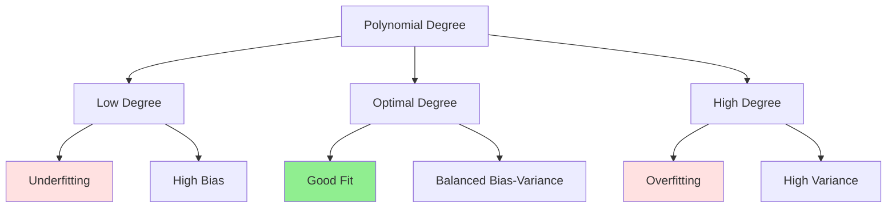

# Polynomial Features

## Introduction

Linear models, by definition, can only capture linear relationships between features and targets. Yet many real-world relationships are inherently non-linear: the trajectory of a ball follows a parabola, the relationship between advertising spend and revenue exhibits diminishing returns, and the value of a house doesn't increase linearly with size. How can we use linear models for non-linear problems?

The answer is polynomial features—transforming input features using polynomial basis functions. By adding squared terms, cubic terms, and interaction terms, we can model complex non-linear relationships while still using linear regression. This technique is powerful because it maintains all the benefits of linear models (interpretability, closed-form solutions, convexity) while dramatically expanding their expressiveness.

Understanding polynomial features is crucial for several reasons: they provide a bridge between linear and non-linear modeling, illustrate the bias-variance tradeoff concretely, demonstrate the curse of dimensionality, and introduce concepts that extend to neural networks and kernel methods. Mastering polynomial regression equips you to model complex relationships without abandoning linear models' advantages.

## From Linear to Polynomial

### Simple Linear Regression

**Model:**

$$y = \theta_0 + \theta_1 x + \epsilon$$

Represents a straight line. Can only model linear relationships.

**Limitations:**

- Cannot capture curvature
- Cannot model peaks or valleys
- Cannot represent periodic patterns
- Poor fit for inherently non-linear data

### Polynomial Regression

**Model (degree $$d$$):**

$$y = \theta_0 + \theta_1 x + \theta_2 x^2 + \theta_3 x^3 + ... + \theta_d x^d + \epsilon$$

**Matrix form:**

$$y = \theta^T \phi(x) + \epsilon$$

where $$\phi(x) = [1, x, x^2, ..., x^d]^T$$ are the polynomial basis functions.

**Key insight:** This is still linear in parameters $$\theta$$!

$$y = \theta_0 \phi_0(x) + \theta_1 \phi_1(x) + ... + \theta_d \phi_d(x)$$

Linear regression can be applied after transforming features.

### Why It Works

**Feature transformation:** Create new features from original features

**Original:** $$x$$

**Transformed:** $$[x, x^2, x^3, ..., x^d]$$

**Then:** Apply linear regression on transformed features

**Result:** Non-linear relationship in original space, linear in transformed space

## Polynomial Basis Functions

### Definition

**Basis function $$\phi_j$$:** Maps input $$x$$ to a new feature

**Polynomial basis:**

$$\phi_j(x) = x^j$$ for $$j = 0, 1, 2, ..., d$$

**Full transformation:**

$$\phi(x) = \begin{bmatrix}
1 \\
x \\
x^2 \\
\vdots \\
x^d
\end{bmatrix}$$

### Properties

**Completeness:** Can approximate any continuous function on a bounded interval (Weierstrass approximation theorem)

**Hierarchy:** Lower degrees capture broad trends, higher degrees capture fine details

**Smoothness:** Infinitely differentiable (smooth curves)

### Example: Quadratic

**Original feature:** $$x$$

**Polynomial features:**

$$\phi_0(x) = 1$$
$$\phi_1(x) = x$$
$$\phi_2(x) = x^2$$

**Model:**

$$y = \theta_0 + \theta_1 x + \theta_2 x^2$$

**Shape:** Parabola
- $$\theta_2 > 0$$: U-shaped (opens upward)
- $$\theta_2 < 0$$: ∩-shaped (opens downward)
- Can model one peak or valley

### Example: Cubic

**Polynomial features:** $$[1, x, x^2, x^3]$$

**Model:**

$$y = \theta_0 + \theta_1 x + \theta_2 x^2 + \theta_3 x^3$$

**Shape:** Can have up to 2 turning points (S-curve or similar)

**Flexibility:** More complex patterns than quadratic

## Multiple Variables with Polynomials

### Two Variables

**Original features:** $$x_1, x_2$$

**Degree-2 polynomial:**

$$y = \theta_0 + \theta_1 x_1 + \theta_2 x_2 + \theta_3 x_1^2 + \theta_4 x_2^2 + \theta_5 x_1 x_2$$

**Terms:**
- **Linear:** $$x_1, x_2$$
- **Quadratic:** $$x_1^2, x_2^2$$
- **Interaction:** $$x_1 x_2$$

**Number of features:**

$$\binom{n + d}{d} = \binom{2 + 2}{2} = 6$$

### General Case

**Original features:** $$n$$

**Polynomial degree:** $$d$$

**Total features (including interactions):**

$$\binom{n + d}{d} = \frac{(n + d)!}{n! \cdot d!}$$

**Example (n=10, d=3):**

$$\binom{13}{3} = 286$$ features!

**Curse of dimensionality:** Feature count grows polynomially with degree and number of original features.

## Interaction Terms

### What Are Interactions?

**Interaction:** Product of two or more features

**Example:** $$x_1 \cdot x_2$$

**Interpretation:** The effect of $$x_1$$ on $$y$$ depends on the value of $$x_2$$ (and vice versa).

### Example: House Price

**Features:**
- $$x_1$$: Size (sq ft)
- $$x_2$$: Quality (1-10)

**Without interaction:**

$$\text{Price} = \theta_0 + \theta_1 \cdot \text{Size} + \theta_2 \cdot \text{Quality}$$

Effect of size is constant regardless of quality.

**With interaction:**

$$\text{Price} = \theta_0 + \theta_1 \cdot \text{Size} + \theta_2 \cdot \text{Quality} + \theta_3 (\text{Size} \times \text{Quality})$$

**Interpretation:**

If $$\theta_3 > 0$$: High-quality large houses are worth more than the sum of their parts (synergy).

**Example values:**
- 1000 sq ft, Quality 5: Price = $$\theta_0 + 1000\theta_1 + 5\theta_2 + 5000\theta_3$$
- 2000 sq ft, Quality 5: Price = $$\theta_0 + 2000\theta_1 + 5\theta_2 + 10000\theta_3$$
- 1000 sq ft, Quality 10: Price = $$\theta_0 + 1000\theta_1 + 10\theta_2 + 10000\theta_3$$

### Higher-Order Interactions

**Three-way interaction:**

$$x_1 \cdot x_2 \cdot x_3$$

Effect of $$x_1$$ depends on both $$x_2$$ and $$x_3$$.

**Interpretation challenges:**

Higher-order interactions become difficult to interpret and justify.

**Practical guideline:** Rarely go beyond two-way interactions unless strong domain knowledge suggests otherwise.

## Training Polynomial Regression

### Data Transformation

**Step 1:** Transform features

```python
from sklearn.preprocessing import PolynomialFeatures

# Create polynomial features up to degree 3
poly = PolynomialFeatures(degree=3, include_bias=True)

# Transform training data
X_poly_train = poly.fit_transform(X_train)

# Transform test data using same transformation
X_poly_test = poly.transform(X_test)
```

**Step 2:** Apply linear regression

```python
from sklearn.linear_model import LinearRegression

# Standard linear regression on polynomial features
model = LinearRegression()
model.fit(X_poly_train, y_train)

# Predict
y_pred = model.predict(X_poly_test)
```

### What PolynomialFeatures Creates

**Example (2 features, degree 2):**

Original: $$[x_1, x_2]$$

Transformed: $$[1, x_1, x_2, x_1^2, x_1 x_2, x_2^2]$$

**Order:**
1. Intercept: $$1$$
2. Linear: $$x_1, x_2$$
3. Interactions + quadratic: $$x_1^2, x_1 x_2, x_2^2$$

### Parameters

**degree:** Maximum degree of polynomial

**interaction_only:** If True, only interaction terms (no $$x^2, x^3$$, etc.)

**include_bias:** If True, include intercept term (1)

**Example (interaction_only=True):**

$$[1, x_1, x_2, x_1 x_2]$$

(Omits $$x_1^2, x_2^2$$)

## Choosing Polynomial Degree

### Bias-Variance Tradeoff

**Low degree (1):**
- High bias (underfitting)
- Low variance
- Cannot capture complex patterns
- Too simple

**Optimal degree:**
- Balanced bias and variance
- Captures true pattern
- Generalizes well

**High degree:**
- Low bias (fits training data well)
- High variance (overfitting)
- Fits noise
- Poor generalization



### Cross-Validation

**Grid search over degrees:**

```python
from sklearn.model_selection import cross_val_score

degrees = [1, 2, 3, 4, 5, 6, 7, 8, 9, 10]
scores = []

for d in degrees:
    poly = PolynomialFeatures(degree=d)
    X_poly = poly.fit_transform(X_train)

    model = LinearRegression()
    cv_scores = cross_val_score(model, X_poly, y_train, cv=5,
                                  scoring='neg_mean_squared_error')
    scores.append(-cv_scores.mean())

optimal_degree = degrees[np.argmin(scores)]
```

**Plot validation error vs. degree:**

Typically see U-shaped curve. Choose degree at minimum.

### Regularization

**For high degrees, use regularization:**

Ridge or Lasso regression prevents overfitting even with many polynomial features.

```python
from sklearn.linear_model import Ridge

poly = PolynomialFeatures(degree=5)
X_poly = poly.fit_transform(X_train)

# Ridge regression to prevent overfitting
model = Ridge(alpha=1.0)
model.fit(X_poly, y_train)
```

**Benefit:** Can use higher degrees (more flexibility) without overfitting.

### Learning Curves

**Plot training and validation error vs. training set size:**

**Underfitting (low degree):**
- Both errors high and similar
- More data doesn't help much

**Overfitting (high degree):**
- Training error low
- Validation error high
- Large gap
- More data helps

**Good fit:**
- Both errors low
- Small gap

## Practical Considerations

### Feature Scaling

**Critical for polynomial features!**

**Problem:** $$x^2, x^3$$ have much larger magnitudes than $$x$$.

**Example:**

$$x = 100 \Rightarrow x^2 = 10000, x^3 = 1000000$$

**Solutions:**

**1. Scale before creating polynomials:**

```python
from sklearn.preprocessing import StandardScaler
from sklearn.pipeline import Pipeline

pipeline = Pipeline([
    ('scaler', StandardScaler()),
    ('poly', PolynomialFeatures(degree=3)),
    ('model', LinearRegression())
])

pipeline.fit(X_train, y_train)
```

**2. Scale after creating polynomials:**

```python
X_poly = PolynomialFeatures(degree=3).fit_transform(X)
X_scaled = StandardScaler().fit_transform(X_poly)
```

**Recommendation:** Scale before polynomials (more interpretable coefficients).

### Computational Cost

**Training:**

Creating polynomial features: $$O(m \cdot n^d)$$

Fitting model: $$O(m \cdot f^2 + f^3)$$ where $$f = \binom{n+d}{d}$$

**High degrees expensive!**

**Prediction:**

$$O(f)$$ per example, where $$f$$ is number of polynomial features.

**Mitigation:**

- Use regularization to handle high degrees
- Feature selection to remove unimportant terms
- Limit degree based on cross-validation

### Interpretability

**Low degree (2-3):** Still interpretable

- $$\theta_2 x^2$$: Curvature
- $$\theta_5 x_1 x_2$$: Interaction

**High degree (>3):** Difficult to interpret

- Many terms
- High-order interactions unclear
- Focus shifts to prediction over interpretation

## Overfitting with Polynomials

### Example: Perfect Fit

**Data:** 5 points

**Degree-4 polynomial:** Can fit perfectly (5 parameters for 5 points)

**Training error:** 0

**Test error:** Likely very high (fits noise)

**Problem:** Model memorizes training data, doesn't learn general pattern.

### Runge's Phenomenon

**High-degree polynomials on evenly-spaced data:**

Exhibit wild oscillations near boundaries.

**Example:** Degree-10 polynomial on $$f(x) = \frac{1}{1 + 25x^2}$$

**Issue:** Polynomial interpolation unstable for high degrees.

**Solution:** Regularization or use other basis functions (splines, radial basis functions).

### Solutions

**1. Limit degree** based on cross-validation

**2. Regularization** (Ridge, Lasso, Elastic Net)

**3. More data** (higher degree needs more data)

**4. Domain knowledge** (choose degree based on problem)

## Beyond Polynomials

### Other Basis Functions

**Polynomials aren't the only option:**

**Fourier basis:**

$$\phi_j(x) = \sin(jx), \cos(jx)$$

Good for periodic data.

**Radial Basis Functions (RBF):**

$$\phi_j(x) = \exp\left(-\frac{||x - \mu_j||^2}{2\sigma^2}\right)$$

Localized bumps. Good for non-periodic data.

**Splines:**

Piecewise polynomials joined smoothly at knots.

More stable than high-degree polynomials.

**Wavelets:**

Localized oscillations. Good for multi-scale features.

### When to Use Each

**Polynomials:**
- Simple global relationships
- Smooth trends
- Small to moderate degrees

**Fourier:**
- Periodic patterns
- Time series
- Signal processing

**RBF:**
- Localized patterns
- Spatial data
- Kernel methods (SVM)

**Splines:**
- Flexible, stable curves
- Avoiding oscillations
- Statistical modeling

## Worked Example

### Problem

**Data:** House size vs. price (non-linear relationship)

**Goal:** Fit polynomial regression, choose optimal degree.

### Step 1: Visualize Data

```python
import matplotlib.pyplot as plt

plt.scatter(X_train, y_train)
plt.xlabel('Size (sq ft)')
plt.ylabel('Price ($1000s)')
plt.show()
```

**Observation:** Curved relationship (not linear).

### Step 2: Try Different Degrees

```python
degrees = [1, 2, 3, 4, 5]
plt.figure(figsize=(15, 3))

for i, d in enumerate(degrees):
    # Create polynomial features
    poly = PolynomialFeatures(degree=d)
    X_poly = poly.fit_transform(X_train)

    # Fit model
    model = LinearRegression()
    model.fit(X_poly, y_train)

    # Predict
    X_plot = np.linspace(X_train.min(), X_train.max(), 100).reshape(-1, 1)
    X_plot_poly = poly.transform(X_plot)
    y_plot = model.predict(X_plot_poly)

    # Plot
    plt.subplot(1, 5, i+1)
    plt.scatter(X_train, y_train, alpha=0.5)
    plt.plot(X_plot, y_plot, 'r-', linewidth=2)
    plt.title(f'Degree {d}')

plt.show()
```

**Observations:**
- Degree 1: Underfits (straight line)
- Degree 2: Good fit
- Degree 3: Slight improvement
- Degree 4-5: Starts to wiggle (overfitting)

### Step 3: Cross-Validation

```python
from sklearn.model_selection import cross_val_score

cv_scores = []

for d in range(1, 11):
    poly = PolynomialFeatures(degree=d)
    X_poly = poly.fit_transform(X_train)

    model = LinearRegression()
    scores = cross_val_score(model, X_poly, y_train, cv=5,
                             scoring='neg_mean_squared_error')
    cv_scores.append(-scores.mean())

plt.plot(range(1, 11), cv_scores, marker='o')
plt.xlabel('Polynomial Degree')
plt.ylabel('Cross-Validation MSE')
plt.title('Model Selection')
plt.show()

optimal_degree = np.argmin(cv_scores) + 1
print(f'Optimal degree: {optimal_degree}')
```

### Step 4: Final Model

```python
# Use optimal degree
poly = PolynomialFeatures(degree=optimal_degree)
X_poly_train = poly.fit_transform(X_train)
X_poly_test = poly.transform(X_test)

# Train
model = LinearRegression()
model.fit(X_poly_train, y_train)

# Evaluate
train_score = model.score(X_poly_train, y_train)
test_score = model.score(X_poly_test, y_test)

print(f'Train R²: {train_score:.4f}')
print(f'Test R²: {test_score:.4f}')
```

## Regularized Polynomial Regression

### Ridge Polynomial Regression

Combining polynomial features with Ridge regularization:

```python
from sklearn.linear_model import RidgeCV

poly = PolynomialFeatures(degree=5)
X_poly_train = poly.fit_transform(X_train)

# Ridge with automatic alpha selection
model = RidgeCV(alphas=[0.01, 0.1, 1, 10, 100])
model.fit(X_poly_train, y_train)

print(f'Best alpha: {model.alpha_}')
```

**Benefits:**
- Can use higher degrees without overfitting
- Automatic complexity control
- Better generalization

### Lasso Polynomial Regression

Lasso performs feature selection on polynomial terms:

```python
from sklearn.linear_model import LassoCV

poly = PolynomialFeatures(degree=5)
X_poly_train = poly.fit_transform(X_train)

model = LassoCV(cv=5)
model.fit(X_poly_train, y_train)

# Check which features selected
selected = np.abs(model.coef_) > 1e-5
feature_names = poly.get_feature_names_out()
print('Selected features:', feature_names[selected])
```

**Benefits:**
- Automatic selection of important polynomial terms
- Sparse solutions
- Interpretable (fewer terms)

## Connection to Neural Networks

### Polynomial Regression as Single-Layer Network

**Polynomial regression:**

$$y = \sum_{j=0}^{d}\theta_j x^j$$

**Neural network perspective:**

- **Input layer:** $$x$$
- **Feature layer:** $$[x, x^2, x^3, ..., x^d]$$ (polynomial features)
- **Output layer:** Linear combination

**Fixed features vs. learned features:**

Polynomial regression uses fixed polynomial basis. Neural networks learn features through hidden layers.

### Universal Approximation

**Polynomial features + linear model** can approximate any continuous function (Weierstrass theorem).

**Neural networks** can also approximate any continuous function (Universal Approximation Theorem).

**Difference:**
- Polynomials: Fixed basis, linear in parameters
- Neural nets: Learned basis, non-linear in parameters

## Conclusion

Polynomial features transform linear models into powerful non-linear regressors. By creating polynomial and interaction terms, we can model complex relationships while maintaining linear models' advantages: closed-form solutions, interpretability, and convex optimization.

**Key takeaways:**

- **Polynomial features:** $$[x, x^2, x^3, ...]$$ enable non-linear modeling
- **Still linear in parameters:** Can use linear regression
- **Degree selection:** Cross-validation to avoid overfitting
- **Feature explosion:** Grows as $$\binom{n+d}{d}$$
- **Scaling essential:** Polynomial terms have vastly different magnitudes
- **Regularization:** Ridge/Lasso prevent overfitting with high degrees
- **Interaction terms:** Model synergistic effects
- **Bias-variance tradeoff:** Low degree underfits, high degree overfits

Polynomial features bridge the gap between linear and non-linear modeling. They demonstrate fundamental ML concepts: feature engineering, the curse of dimensionality, the bias-variance tradeoff, and the importance of regularization. While modern deep learning often replaces manual feature engineering with learned representations, understanding polynomial regression provides essential intuition for machine learning.

As we move to more complex models, remember that even sophisticated neural networks are fundamentally performing non-linear feature transformations—they've simply automated and generalized the feature engineering that polynomial regression performs manually.