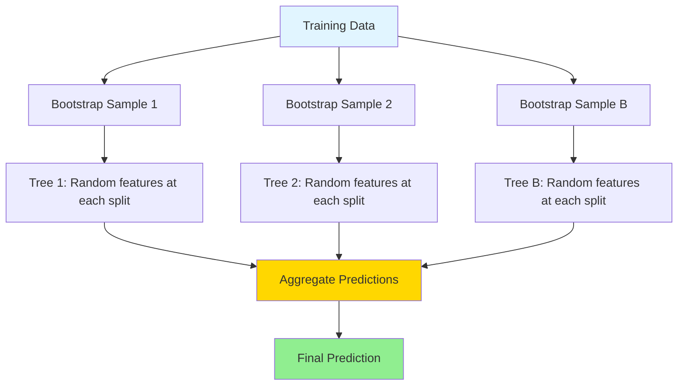

# Random Forests

## Introduction

Random Forests represent one of the most successful and widely-used machine learning algorithms. By combining multiple decision trees through ensemble learning, Random Forests address the fundamental weaknesses of individual trees—instability and overfitting—while preserving their strengths: interpretability, handling of non-linear relationships, and minimal preprocessing requirements.

The "forest" metaphor is apt: just as a forest is more robust than any single tree, a Random Forest is more accurate and stable than any individual decision tree. By training many trees on random subsets of data and features, then averaging their predictions, Random Forests achieve remarkable performance across diverse problems with minimal hyperparameter tuning.

Random Forests excel in practice because they're hard to mess up. They work well out-of-the-box, handle high-dimensional data, provide feature importance estimates, and rarely overfit severely. Understanding Random Forests is essential for any machine learning practitioner, as they serve as a strong baseline and often competitive final model for tabular data.

## Ensemble Learning Fundamentals

### The Wisdom of Crowds

**Core idea:** Combining predictions from multiple models often performs better than any single model.

**Intuition:** Different models make different errors. By averaging predictions, errors cancel out while signal reinforces.

**Mathematical basis:**

For independent predictors with error variance $$\sigma^2$$, the average of $$B$$ predictors has error variance:

$$\text{Var}\left(\frac{1}{B}\sum_{i=1}^{B}f_i\right) = \frac{\sigma^2}{B}$$

**Variance reduction:** By factor of $$B$$ if predictors independent!

**Problem:** Trees trained on same data are highly correlated, reducing benefit.

**Solution:** Random Forests introduce randomness to decorrelate trees.

### Bagging (Bootstrap Aggregating)

**Bootstrap sampling:** Draw $$m$$ samples with replacement from training set of size $$m$$.

**Bagging algorithm:**

1. For $$b = 1$$ to $$B$$:
   - Draw bootstrap sample $$D_b$$ from training data
   - Train model $$f_b$$ on $$D_b$$
2. For prediction:
   - Classification: Majority vote $$\hat{y} = \text{mode}(f_1(x), ..., f_B(x))$$
   - Regression: Average $$\hat{y} = \frac{1}{B}\sum_{b=1}^{B}f_b(x)$$

**Benefits:**

- Reduces variance
- Improves stability
- Parallel training

**Limitation:** Trees still correlated (same features available at each split).

## Random Forest Algorithm

### Key Innovation: Feature Randomness

**At each split, consider only random subset of $$m_{try}$$ features.**

**Typical values:**
- Classification: $$m_{try} = \sqrt{p}$$ where $$p$$ is total features
- Regression: $$m_{try} = p/3$$

**Effect:** Decorrelates trees by forcing diversity in feature selection.



### Algorithm

**Training:**

```
RandomForest(Data D, num_trees B, max_features m_try):
    For b = 1 to B:
        1. Draw bootstrap sample D_b from D (sample with replacement)
        2. Grow tree T_b:
            At each node:
                a. Randomly select m_try features from all p features
                b. Find best split among these m_try features only
                c. Split node using best split
                d. Continue until stopping criterion
        3. Store tree T_b
    Return forest {T_1, T_2, ..., T_B}
```

**Prediction (Classification):**

```
Predict(x):
    predictions = []
    For b = 1 to B:
        predictions.append(T_b.predict(x))
    Return majority_vote(predictions)
```

**Prediction (Regression):**

```
Predict(x):
    predictions = []
    For b = 1 to B:
        predictions.append(T_b.predict(x))
    Return mean(predictions)
```

### Differences from Bagging

| Aspect | Bagging | Random Forest |
|--------|---------|---------------|
| Base learner | Any model | Decision trees |
| Bootstrap | Yes | Yes |
| Feature randomness | No | Yes (key difference!) |
| Correlation | Higher | Lower |
| Variance reduction | Moderate | Stronger |

## Out-of-Bag (OOB) Error Estimation

### Bootstrap Sampling Statistics

**Bootstrap sample:** Draw $$m$$ samples with replacement from $$m$$ training samples.

**Probability a sample is NOT selected:**

$$P(\text{not selected}) = \left(1 - \frac{1}{m}\right)^m \approx \frac{1}{e} \approx 0.368$$

**Result:** About 37% of training samples are not in each bootstrap sample.

These are **Out-of-Bag (OOB)** samples for that tree.

### OOB Error

**For each training example $$x_i$$:**

1. Find all trees where $$x_i$$ was OOB (not in training set)
2. Make prediction using only those trees
3. Compare to true label $$y_i$$

**OOB Error:** Average error across all OOB predictions

**Benefits:**

- **Free validation set:** No need for separate validation data
- **Unbiased estimate:** Similar to cross-validation
- **Efficient:** Computed during training

**Implementation:**

```python
from sklearn.ensemble import RandomForestClassifier

rf = RandomForestClassifier(n_estimators=100, oob_score=True)
rf.fit(X_train, y_train)

print(f'OOB Score: {rf.oob_score_:.4f}')
```

**Use case:** Hyperparameter tuning without validation set.

## Feature Importance

Random Forests provide two types of feature importance.

### Mean Decrease Impurity (MDI)

**For each feature $$f$$:**

$$\text{Importance}(f) = \frac{1}{B}\sum_{b=1}^{B}\sum_{t \in T_b \text{ splits on } f}\frac{m_t}{m}\Delta I_t$$

where:
- $$B$$: Number of trees
- $$m_t$$: Samples at node $$t$$
- $$\Delta I_t$$: Impurity decrease at split $$t$$

**Normalized** to sum to 1.

**Accessing:**

```python
rf = RandomForestClassifier()
rf.fit(X_train, y_train)

importances = rf.feature_importances_
feature_names = ['feature1', 'feature2', 'feature3']

for name, imp in zip(feature_names, importances):
    print(f'{name}: {imp:.4f}')
```

**Bias:** Favors high-cardinality features (many unique values).

### Mean Decrease Accuracy (MDA) / Permutation Importance

**For each feature $$f$$:**

1. Compute OOB accuracy
2. Randomly permute feature $$f$$ in OOB samples
3. Compute OOB accuracy with permuted feature
4. Importance = Decrease in accuracy

**Interpretation:** How much accuracy drops when feature information is destroyed.

**Advantage:** Unbiased, works with any model.

**Implementation:**

```python
from sklearn.inspection import permutation_importance

perm_importance = permutation_importance(rf, X_val, y_val, n_repeats=10)

for i, imp in enumerate(perm_importance.importances_mean):
    print(f'Feature {i}: {imp:.4f} ± {perm_importance.importances_std[i]:.4f}')
```

## Hyperparameters

### Number of Trees (n_estimators)

**More trees:**
- More stable predictions
- Better performance (up to a point)
- Longer training time
- Does NOT cause overfitting (unlike boosting)

**Typical values:** 100-500

**Recommendation:** As many as computational budget allows. Performance plateaus, doesn't degrade.

### Number of Features per Split (max_features)

**Controls randomness and tree correlation.**

**Options:**
- `'sqrt'` or `'auto'`: $$\sqrt{p}$$ (default for classification)
- `'log2'`: $$\log_2(p)$$
- `int`: Specific number
- `float`: Fraction of features
- `None`: All features (becomes bagging)

**Smaller max_features:**
- More randomness
- Less correlation between trees
- Better variance reduction
- Risk: Too random, poor individual trees

**Larger max_features:**
- Less randomness
- More correlation
- Better individual trees
- Risk: Less diversity

**Typical:** $$\sqrt{p}$$ works well for classification, $$p/3$$ for regression.

### Tree Depth and Size

**max_depth:** Maximum depth of each tree

**min_samples_split:** Minimum samples to split node

**min_samples_leaf:** Minimum samples in leaf

**Typical practice:** Grow deep trees (low bias)
- Random Forest's averaging reduces variance
- Don't need aggressive pruning like single trees

**Default:** Often grow until pure leaves or min_samples_leaf reached

### Bootstrap

**bootstrap:** Whether to use bootstrap sampling

**bootstrap=True (default):** Standard Random Forest

**bootstrap=False:** "Random Patches" - random subsets without replacement

### Other Parameters

**max_samples:** If <1.0, fraction of samples to draw for each tree

**class_weight:** Handle class imbalance ('balanced' or custom)

**n_jobs:** Number of parallel jobs (-1 for all cores)

## Advantages of Random Forests

### Excellent Performance

**Often best or near-best** out-of-the-box performance for tabular data.

**Robust to hyperparameters:** Works well with defaults.

### Reduced Overfitting

**Averaging many trees** reduces variance dramatically.

**Hard to overfit severely** (unlike single trees).

### Feature Importance

**Automatic feature importance** helps understand data and select features.

### Handles High Dimensions

**Works well** with many features ($$p$$ large, even $$p > m$$).

### Minimal Preprocessing

**No scaling required:** Tree-based, scale-invariant.

**Handles mixed types:** Numerical and categorical.

### Robustness

**Robust to outliers** (averaging effect).

**Robust to missing values** (surrogate splits or imputation).

### Parallel Training

**Trees independent:** Can train in parallel on multiple cores.

### OOB Error

**Free validation estimate** without separate validation set.

## Disadvantages of Random Forests

### Loss of Interpretability

**Black box:** Cannot visualize forest like single tree.

**Decision logic unclear:** Averaging obscures individual tree paths.

**Mitigation:** Feature importance, partial dependence plots.

### Memory and Speed

**Memory:** Must store $$B$$ trees.

**Prediction slower** than single tree (must query all trees).

**Not ideal for real-time applications** with strict latency requirements.

### Extrapolation

**Cannot extrapolate** beyond training data range.

**Regression predictions bounded** by min/max of training targets.

**Example:** If training targets are [10, 100], predictions always in [10, 100].

### Bias for Categorical Features

**High-cardinality categorical features** receive inflated importance.

**Mitigation:** Permutation importance instead of MDI.

## Practical Implementation

### Basic Usage

```python
from sklearn.ensemble import RandomForestClassifier
from sklearn.model_selection import train_test_split
from sklearn.metrics import accuracy_score, classification_report

# Load data
X, y = load_data()

# Split
X_train, X_test, y_train, y_test = train_test_split(
    X, y, test_size=0.2, random_state=42
)

# Train Random Forest
rf = RandomForestClassifier(
    n_estimators=100,      # Number of trees
    max_features='sqrt',   # Features per split
    max_depth=None,        # Grow full trees
    min_samples_split=2,
    min_samples_leaf=1,
    bootstrap=True,
    oob_score=True,        # Compute OOB error
    n_jobs=-1,             # Use all cores
    random_state=42
)

rf.fit(X_train, y_train)

# Evaluate
y_pred = rf.predict(X_test)
accuracy = accuracy_score(y_test, y_pred)

print(f'Test Accuracy: {accuracy:.4f}')
print(f'OOB Score: {rf.oob_score_:.4f}')
print(classification_report(y_test, y_pred))
```

### Regression Example

```python
from sklearn.ensemble import RandomForestRegressor
from sklearn.metrics import mean_squared_error, r2_score

# Train
rf_reg = RandomForestRegressor(
    n_estimators=100,
    max_features='sqrt',
    n_jobs=-1,
    random_state=42
)

rf_reg.fit(X_train, y_train)

# Predict
y_pred = rf_reg.predict(X_test)

# Evaluate
mse = mean_squared_error(y_test, y_pred)
r2 = r2_score(y_test, y_pred)

print(f'MSE: {mse:.4f}')
print(f'R²: {r2:.4f}')
```

### Hyperparameter Tuning

```python
from sklearn.model_selection import GridSearchCV

param_grid = {
    'n_estimators': [50, 100, 200],
    'max_features': ['sqrt', 'log2', None],
    'max_depth': [10, 20, None],
    'min_samples_split': [2, 5, 10],
    'min_samples_leaf': [1, 2, 4]
}

rf = RandomForestClassifier(random_state=42, n_jobs=-1)

grid_search = GridSearchCV(
    rf, param_grid, cv=5, scoring='accuracy', n_jobs=-1, verbose=2
)

grid_search.fit(X_train, y_train)

print(f'Best parameters: {grid_search.best_params_}')
print(f'Best CV score: {grid_search.best_score_:.4f}')

# Use best model
best_rf = grid_search.best_estimator_
```

### Feature Importance Analysis

```python
import pandas as pd
import matplotlib.pyplot as plt

# Get feature importances
importances = rf.feature_importances_
indices = np.argsort(importances)[::-1]

# Print ranking
print("Feature ranking:")
for f in range(X.shape[1]):
    print(f"{f+1}. feature {indices[f]} ({importances[indices[f]]:.4f})")

# Plot
plt.figure(figsize=(10, 6))
plt.title("Feature Importances")
plt.bar(range(X.shape[1]), importances[indices])
plt.xlabel("Feature Index")
plt.ylabel("Importance")
plt.show()
```

## Extremely Randomized Trees (Extra Trees)

### Modification

**Extra Trees** introduces additional randomness:

1. **No bootstrap:** Uses entire training set for each tree
2. **Random splits:** At each node, randomly select split threshold (not best split)

**Trade-off:**
- More randomness → More decorrelation → Better variance reduction
- Random splits → Worse individual trees → Higher bias

**When to use:**
- High variance problems
- Faster training (no need to find best split)
- Similar or better performance than Random Forest

**Implementation:**

```python
from sklearn.ensemble import ExtraTreesClassifier

et = ExtraTreesClassifier(
    n_estimators=100,
    max_features='sqrt',
    n_jobs=-1,
    random_state=42
)

et.fit(X_train, y_train)
```

## Handling Imbalanced Data

### Class Weights

```python
rf = RandomForestClassifier(
    class_weight='balanced',  # Automatically adjust weights
    n_estimators=100
)
```

**Effect:** Samples from minority class weighted more heavily in loss.

### Balanced Random Forest

```python
from imblearn.ensemble import BalancedRandomForestClassifier

brf = BalancedRandomForestClassifier(
    n_estimators=100,
    sampling_strategy='auto',  # Undersample majority class in each bootstrap
    random_state=42
)

brf.fit(X_train, y_train)
```

### Custom Sampling

Combine with SMOTE or other resampling techniques:

```python
from imblearn.over_sampling import SMOTE
from imblearn.pipeline import Pipeline as ImbPipeline

pipeline = ImbPipeline([
    ('smote', SMOTE(random_state=42)),
    ('rf', RandomForestClassifier(n_estimators=100, random_state=42))
])

pipeline.fit(X_train, y_train)
```

## Partial Dependence Plots

**Visualize relationship** between feature and predictions while marginalizing over other features.

```python
from sklearn.inspection import PartialDependenceDisplay

fig, ax = plt.subplots(figsize=(12, 6))
PartialDependenceDisplay.from_estimator(
    rf, X_train, features=[0, 1, (0, 1)], ax=ax
)
plt.show()
```

**Interpretation:**
- Shows how prediction changes with feature value
- Marginalizes over distribution of other features
- Helps understand feature effects

## Comparison to Other Ensembles

| Method | Base Learner | Training | Combination | Variance | Bias |
|--------|--------------|----------|-------------|----------|------|
| Bagging | Any | Parallel | Average/Vote | Reduced | Same |
| Random Forest | Trees | Parallel | Average/Vote | More reduced | Same |
| Boosting | Weak learners | Sequential | Weighted sum | Reduced | Reduced |
| Stacking | Diverse | Parallel | Meta-learner | Reduced | Reduced |

**Random Forest vs Gradient Boosting:**

| Aspect | Random Forest | Gradient Boosting |
|--------|---------------|-------------------|
| Training | Parallel | Sequential |
| Overfitting | Resistant | Prone (needs tuning) |
| Speed | Fast | Slower |
| Hyperparameter sensitivity | Low | High |
| Performance ceiling | Good | Often better |

## Advanced Topics

### Monitoring Tree Diversity

**Measure correlation between trees:**

```python
from sklearn.metrics import accuracy_score

# Get predictions from each tree
tree_predictions = np.array([tree.predict(X_val) for tree in rf.estimators_])

# Compute pairwise correlations
from scipy.stats import spearmanr
correlations = []

for i in range(len(rf.estimators_)):
    for j in range(i+1, len(rf.estimators_)):
        corr, _ = spearmanr(tree_predictions[i], tree_predictions[j])
        correlations.append(corr)

print(f'Average tree correlation: {np.mean(correlations):.4f}')
```

**Lower correlation → Better ensemble diversity**

### Warm Start

**Add trees incrementally:**

```python
rf = RandomForestClassifier(n_estimators=50, warm_start=True)
rf.fit(X_train, y_train)

# Add more trees
rf.n_estimators = 100
rf.fit(X_train, y_train)  # Reuses previous 50 trees, adds 50 more
```

**Use case:** Incrementally increase trees until OOB error plateaus.

### Probability Calibration

**Random Forest probabilities often well-calibrated**, but can improve:

```python
from sklearn.calibration import CalibratedClassifierCV

rf = RandomForestClassifier(n_estimators=100)
calibrated_rf = CalibratedClassifierCV(rf, cv=5, method='sigmoid')
calibrated_rf.fit(X_train, y_train)

# Get calibrated probabilities
probs = calibrated_rf.predict_proba(X_test)
```

## Common Pitfalls

### Using Too Few Trees

**Problem:** High variance in predictions.

**Solution:** Use at least 100 trees. More is usually better.

### Not Using OOB for Validation

**Problem:** Wasting data on validation set.

**Solution:** Use OOB error, train on all data.

### Over-tuning Hyperparameters

**Problem:** Overfitting to validation set.

**Solution:** Random Forest robust to hyperparameters. Use defaults or minimal tuning.

### Expecting Extrapolation

**Problem:** Predictions outside training range.

**Solution:** Aware of limitation. Consider linear models for extrapolation.

### Ignoring Computational Cost

**Problem:** Very large forests slow in production.

**Solution:** Balance performance and speed. Consider model distillation.

## Practical Tips

### Start with Defaults

Random Forests work remarkably well with default parameters:

```python
rf = RandomForestClassifier()  # Often sufficient!
```

### Use All Your Cores

```python
rf = RandomForestClassifier(n_jobs=-1)  # Utilize parallel processing
```

### Monitor OOB Error

```python
rf = RandomForestClassifier(oob_score=True)
rf.fit(X_train, y_train)
print(f'OOB Score: {rf.oob_score_}')
```

### Feature Engineering Still Helps

Despite Random Forest's power, good features improve performance:
- Domain knowledge features
- Interaction terms
- Transformations

### Check Feature Importance

Always examine feature importance:
- Identifies relevant features
- Suggests feature engineering opportunities
- Validates domain understanding

## Applications

**Tabular Data:** Random Forests excel on structured/tabular data (better than neural networks in many cases).

**Financial Modeling:** Credit scoring, fraud detection, trading strategies.

**Healthcare:** Disease diagnosis, patient risk stratification, treatment response prediction.

**Ecology:** Species distribution modeling, habitat suitability.

**Marketing:** Customer churn prediction, response modeling, lifetime value estimation.

**Computer Vision:** As features for face recognition, object detection (HOG + Random Forest).

## Conclusion

Random Forests represent a pinnacle of ensemble learning—combining simplicity, strong performance, and robustness. By training many decorrelated trees through bootstrap sampling and feature randomness, they dramatically reduce variance while maintaining low bias.

**Key takeaways:**

- **Ensemble of trees:** Combines predictions from many decision trees
- **Bootstrap + feature randomness:** Decorrelates trees, enables variance reduction
- **Out-of-bag error:** Free validation without separate validation set
- **Feature importance:** Automatic assessment of feature relevance
- **Robust and practical:** Works well with defaults, minimal tuning needed
- **Strong baseline:** Often competitive final model for tabular data

Random Forests embody the "wisdom of crowds" in machine learning. While individual trees may be unstable and overfit, their collective wisdom produces remarkably accurate and stable predictions. Understanding Random Forests provides essential insights into ensemble methods and prepares you for advanced techniques like gradient boosting.

For practitioners, Random Forests are often the first model to try after simple baselines. Their combination of strong performance, interpretability through feature importance, and ease of use makes them indispensable in the machine learning toolkit.