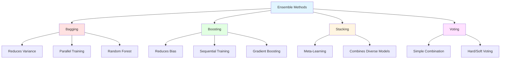

# Ensemble Methods

## Introduction

Ensemble methods combine multiple machine learning models to create a more powerful predictor than any individual model. The fundamental principle is that diverse models make different errors, and by aggregating their predictions, errors cancel while signals reinforce. This "wisdom of crowds" approach has proven remarkably effective across diverse machine learning problems.

The success of ensemble methods is grounded in both theory and practice. Theoretically, ensembles reduce variance, bias, or both depending on the approach. Practically, ensemble methods consistently win competitions and power production systems. Understanding how and why ensembles work is essential for advanced machine learning.

We've already studied two major ensemble methods—Random Forests (bagging trees) and Gradient Boosting. Here, we'll synthesize ensemble concepts, explore additional techniques like stacking and voting, and provide a comprehensive framework for understanding when and how to use ensembles.

## Why Ensembles Work

### Error Decomposition

**Individual model error:**

$$\text{Error} = \text{Bias}^2 + \text{Variance} + \text{Noise}$$

**Ensemble strategies:**
- **Bagging:** Reduces variance
- **Boosting:** Reduces bias
- **Stacking:** Can reduce both

### Variance Reduction (Averaging)

**For independent models with variance $$\sigma^2$$:**

$$\text{Var}\left[\frac{1}{B}\sum_{i=1}^{B}f_i(x)\right] = \frac{\sigma^2}{B}$$

**Key insight:** Variance decreases linearly with ensemble size (if models independent).

**In practice:** Models correlated, but variance still reduces significantly.

### Bias Reduction (Boosting)

**Sequential models correct predecessors' errors:**

Each model focuses on hard examples, gradually reducing bias.

$$F_M(x) = F_0(x) + \sum_{m=1}^{M}\nu h_m(x)$$

### Diversity is Key

**Similar models → correlated errors → little benefit**

**Diverse models → independent errors → large benefit**

**Creating diversity:**
- Different algorithms (SVM, Random Forest, Neural Net)
- Different training data (bootstrap, subsampling)
- Different features (random subsets)
- Different hyperparameters



## Bagging (Bootstrap Aggregating)

### Algorithm

**Training:**

```
For b = 1 to B:
    1. Draw bootstrap sample D_b from training data (sample with replacement)
    2. Train model f_b on D_b
```

**Prediction:**

**Classification:** Majority vote

$$\hat{y} = \text{mode}(f_1(x), f_2(x), ..., f_B(x))$$

**Regression:** Average

$$\hat{y} = \frac{1}{B}\sum_{b=1}^{B}f_b(x)$$

### When Bagging Helps

**High variance models:** Decision trees, neural networks

**Unstable models:** Small changes in data cause large changes in model

**Not helpful for:** Low variance models (e.g., linear regression, Naive Bayes)

### Out-of-Bag (OOB) Error

**Free validation set** from bootstrap sampling.

About 37% of data not in each bootstrap sample.

Use for error estimation without separate validation set.

### Implementation

```python
from sklearn.ensemble import BaggingClassifier, BaggingRegressor
from sklearn.tree import DecisionTreeClassifier

# Bagging with decision trees
bagging = BaggingClassifier(
    base_estimator=DecisionTreeClassifier(),
    n_estimators=100,
    max_samples=1.0,  # Fraction of samples per bootstrap
    max_features=1.0,  # Fraction of features
    bootstrap=True,
    oob_score=True,
    n_jobs=-1,
    random_state=42
)

bagging.fit(X_train, y_train)

# OOB score
print(f'OOB Score: {bagging.oob_score_:.4f}')

# Predictions
y_pred = bagging.predict(X_test)
```

## Boosting

### General Framework

**Sequential ensemble** where each model corrects predecessors.

**Three main approaches:**
1. **AdaBoost:** Reweight misclassified examples
2. **Gradient Boosting:** Fit residuals/gradients
3. **XGBoost/LightGBM:** Optimized gradient boosting

### AdaBoost Recap

```
Initialize weights: w_i = 1/n

For m = 1 to M:
    1. Train weak learner on weighted data
    2. Compute error and learner weight
    3. Update sample weights (increase for errors)

Combine: F(x) = sign(Σ α_m h_m(x))
```

### Gradient Boosting Recap

```
Initialize: F_0(x) = constant

For m = 1 to M:
    1. Compute pseudo-residuals
    2. Fit weak learner to residuals
    3. Update: F_m(x) = F_{m-1}(x) + ν h_m(x)
```

### Implementation

```python
from sklearn.ensemble import AdaBoostClassifier, GradientBoostingClassifier
import xgboost as xgb
import lightgbm as lgb

# AdaBoost
ada = AdaBoostClassifier(
    base_estimator=DecisionTreeClassifier(max_depth=1),
    n_estimators=50,
    learning_rate=1.0
)

# Gradient Boosting (scikit-learn)
gb = GradientBoostingClassifier(
    n_estimators=100,
    learning_rate=0.1,
    max_depth=3,
    subsample=0.8
)

# XGBoost
xgb_model = xgb.XGBClassifier(
    n_estimators=100,
    learning_rate=0.1,
    max_depth=6,
    subsample=0.8,
    colsample_bytree=0.8
)

# LightGBM
lgb_model = lgb.LGBMClassifier(
    n_estimators=100,
    learning_rate=0.05,
    num_leaves=31
)

# Train
ada.fit(X_train, y_train)
gb.fit(X_train, y_train)
xgb_model.fit(X_train, y_train)
lgb_model.fit(X_train, y_train)
```

## Stacking (Stacked Generalization)

### Concept

**Two-level learning:**

1. **Level 0 (Base models):** Train diverse models on data
2. **Level 1 (Meta-model):** Learn to combine base model predictions

**Meta-model learns:** How to best weight and combine base models.

### Algorithm

**Training:**

```
1. Split training data into K folds

2. For each base model m:
    For each fold k:
        Train model on K-1 folds
        Predict on held-out fold
    Concatenate predictions → meta-features for model m

3. Train meta-model on meta-features and original targets
```

**Prediction:**

```
1. Get predictions from all base models
2. Feed predictions to meta-model
3. Return meta-model output
```

### Implementation

```python
from sklearn.ensemble import StackingClassifier
from sklearn.linear_model import LogisticRegression
from sklearn.tree import DecisionTreeClassifier
from sklearn.svm import SVC
from sklearn.neighbors import KNeighborsClassifier

# Define base models (diverse!)
base_models = [
    ('rf', RandomForestClassifier(n_estimators=100, random_state=42)),
    ('svm', SVC(kernel='rbf', probability=True, random_state=42)),
    ('knn', KNeighborsClassifier(n_neighbors=5)),
    ('dt', DecisionTreeClassifier(max_depth=10, random_state=42))
]

# Define meta-model
meta_model = LogisticRegression()

# Create stacking ensemble
stacking = StackingClassifier(
    estimators=base_models,
    final_estimator=meta_model,
    cv=5,  # Cross-validation for meta-features
    n_jobs=-1
)

stacking.fit(X_train, y_train)
y_pred = stacking.predict(X_test)
y_prob = stacking.predict_proba(X_test)
```

### Manual Stacking

```python
from sklearn.model_selection import cross_val_predict

# Base models
rf = RandomForestClassifier(n_estimators=100, random_state=42)
svm = SVC(kernel='rbf', probability=True, random_state=42)
knn = KNeighborsClassifier(n_neighbors=5)

# Generate out-of-fold predictions for training (meta-features)
rf_train_pred = cross_val_predict(rf, X_train, y_train, cv=5, method='predict_proba')
svm_train_pred = cross_val_predict(svm, X_train, y_train, cv=5, method='predict_proba')
knn_train_pred = cross_val_predict(knn, X_train, y_train, cv=5, method='predict_proba')

# Concatenate meta-features
X_train_meta = np.column_stack([rf_train_pred, svm_train_pred, knn_train_pred])

# Train meta-model
meta_model = LogisticRegression()
meta_model.fit(X_train_meta, y_train)

# For test predictions, train base models on full training set
rf.fit(X_train, y_train)
svm.fit(X_train, y_train)
knn.fit(X_train, y_train)

# Get test meta-features
rf_test_pred = rf.predict_proba(X_test)
svm_test_pred = svm.predict_proba(X_test)
knn_test_pred = knn.predict_proba(X_test)

X_test_meta = np.column_stack([rf_test_pred, svm_test_pred, knn_test_pred])

# Final prediction
y_pred = meta_model.predict(X_test_meta)
```

### Choosing Base Models

**Diversity is crucial:**
- Different algorithms (tree, linear, instance-based)
- Different feature representations
- Different hyperparameters

**Good combinations:**
- Random Forest + Gradient Boosting + SVM
- Neural Network + XGBoost + Logistic Regression
- Avoid very similar models

### Choosing Meta-Model

**Common choices:**
- **Logistic Regression:** Simple, interpretable, fast
- **Linear models:** Ridge, Lasso (regularized)
- **Tree models:** Can learn non-linear combinations
- **Neural networks:** Complex meta-learning

**Recommendation:** Start with Logistic Regression.

## Voting

### Hard Voting

**Classification only.**

**Majority vote:**

$$\hat{y} = \text{mode}(f_1(x), f_2(x), ..., f_M(x))$$

**Simple and effective** when models have similar performance.

### Soft Voting

**Classification with probability estimates.**

**Average probabilities:**

$$\hat{y} = \arg\max_c \frac{1}{M}\sum_{m=1}^{M}P_m(y=c|x)$$

**Often better than hard voting** (uses more information).

### Weighted Voting

**Different weights for different models:**

$$\hat{y} = \arg\max_c \sum_{m=1}^{M}w_m P_m(y=c|x)$$

where $$\sum_{m}w_m = 1$$.

**Weights based on:** Validation performance, confidence, expertise.

### Implementation

```python
from sklearn.ensemble import VotingClassifier

# Define models
rf = RandomForestClassifier(n_estimators=100, random_state=42)
svm = SVC(kernel='rbf', probability=True, random_state=42)
knn = KNeighborsClassifier(n_neighbors=5)

# Hard voting
voting_hard = VotingClassifier(
    estimators=[('rf', rf), ('svm', svm), ('knn', knn)],
    voting='hard'
)

# Soft voting
voting_soft = VotingClassifier(
    estimators=[('rf', rf), ('svm', svm), ('knn', knn)],
    voting='soft'
)

# Weighted voting
voting_weighted = VotingClassifier(
    estimators=[('rf', rf), ('svm', svm), ('knn', knn)],
    voting='soft',
    weights=[2, 1, 1]  # RF gets double weight
)

voting_soft.fit(X_train, y_train)
y_pred = voting_soft.predict(X_test)
```

### For Regression

```python
from sklearn.ensemble import VotingRegressor

# Define regressors
rf_reg = RandomForestRegressor(n_estimators=100, random_state=42)
gb_reg = GradientBoostingRegressor(n_estimators=100, random_state=42)
svr = SVR(kernel='rbf')

# Voting regressor (averages predictions)
voting_reg = VotingRegressor(
    estimators=[('rf', rf_reg), ('gb', gb_reg), ('svr', svr)]
)

voting_reg.fit(X_train, y_train)
y_pred = voting_reg.predict(X_test)
```

## Blending

### Similar to Stacking

**Difference:** Uses hold-out validation set instead of cross-validation.

**Simpler but wastes data** (validation set not used for training base models).

### Algorithm

```
1. Split data into train and validation sets

2. Train base models on training set

3. Predict on validation set → meta-features

4. Train meta-model on validation meta-features

5. For test: predict with base models, then meta-model
```

### Implementation

```python
from sklearn.model_selection import train_test_split

# Split for blending
X_train_base, X_val, y_train_base, y_val = train_test_split(
    X_train, y_train, test_size=0.2, random_state=42
)

# Train base models on training set
rf = RandomForestClassifier(n_estimators=100, random_state=42)
svm = SVC(kernel='rbf', probability=True, random_state=42)

rf.fit(X_train_base, y_train_base)
svm.fit(X_train_base, y_train_base)

# Predict on validation set (meta-features)
rf_val_pred = rf.predict_proba(X_val)
svm_val_pred = svm.predict_proba(X_val)
X_val_meta = np.column_stack([rf_val_pred, svm_val_pred])

# Train meta-model
meta_model = LogisticRegression()
meta_model.fit(X_val_meta, y_val)

# Test predictions
rf_test_pred = rf.predict_proba(X_test)
svm_test_pred = svm.predict_proba(X_test)
X_test_meta = np.column_stack([rf_test_pred, svm_test_pred])

y_pred = meta_model.predict(X_test_meta)
```

## Comparison of Ensemble Methods

| Method | Training | Reduces | Diversity | Complexity | Use Case |
|--------|----------|---------|-----------|------------|----------|
| Bagging | Parallel | Variance | Bootstrap | Low | High variance models |
| Boosting | Sequential | Bias | Sequential weighting | Medium | Weak learners |
| Stacking | Parallel | Both | Different algorithms | High | Maximum performance |
| Voting | Parallel | Variance | Different models | Low | Simple combination |
| Blending | Parallel | Both | Different algorithms | Medium | Less data than stacking |

## Practical Guidelines

### When to Use Ensembles

**Use ensembles when:**
- Maximum accuracy needed
- Computational resources available
- Training time not critical
- Have diverse models

**Don't use when:**
- Interpretability critical
- Real-time prediction with strict latency
- Single simple model sufficient
- Training data very limited

### Creating Effective Ensembles

**Diversity strategies:**

1. **Different algorithms:** Tree + Linear + Instance-based
2. **Different data subsets:** Bootstrap, subsampling, feature subsets
3. **Different hyperparameters:** Vary depth, regularization, etc.
4. **Different features:** Use different feature sets or transformations

**Validation:**

Always use cross-validation or hold-out set for:
- Selecting base models
- Tuning hyperparameters
- Training meta-models

**Start simple:**

1. Train individual models
2. Try voting (simplest ensemble)
3. If needed, try stacking
4. Consider boosting for structured data

### Monitoring Ensemble Performance

```python
# Compare individual vs ensemble
models = {
    'RF': RandomForestClassifier(n_estimators=100),
    'SVM': SVC(kernel='rbf', probability=True),
    'KNN': KNeighborsClassifier(n_neighbors=5)
}

# Train and evaluate each
for name, model in models.items():
    model.fit(X_train, y_train)
    score = model.score(X_test, y_test)
    print(f'{name}: {score:.4f}')

# Ensemble
ensemble = VotingClassifier(list(models.items()), voting='soft')
ensemble.fit(X_train, y_train)
ensemble_score = ensemble.score(X_test, y_test)
print(f'Ensemble: {ensemble_score:.4f}')
```

## Advanced Topics

### Dynamic Ensemble Selection

**Choose subset of ensemble members** based on input.

**Idea:** Different models good for different regions of input space.

### Ensemble Pruning

**Remove redundant or poor models** from ensemble.

**Methods:**
- Remove models with high correlation
- Remove lowest-performing models
- Optimize subset selection

### Cascading

**Sequential application:** If confident, stop early; else, use more models.

**Trade-off:** Prediction speed vs accuracy.

## Conclusion

Ensemble methods combine multiple models to achieve better performance than any single model. By leveraging diversity and aggregation, ensembles reduce variance, bias, or both, leading to more accurate and robust predictions.

**Key takeaways:**

- **Diversity is crucial:** Different models make different errors
- **Bagging:** Reduces variance through averaging (Random Forest)
- **Boosting:** Reduces bias through sequential correction (XGBoost)
- **Stacking:** Meta-learning to optimally combine models
- **Voting:** Simple majority or probability averaging
- **Trade-offs:** Complexity and computation vs accuracy

Ensemble methods represent the state-of-the-art for many machine learning tasks, particularly on structured data. Understanding when and how to apply ensembles—and which type to use—is essential for achieving maximum performance in real-world applications.

For practitioners, ensembles offer a reliable path to improved accuracy. Start with strong individual models, combine them intelligently, and validate carefully. While ensembles sacrifice some interpretability and speed, the performance gains often justify these costs in production systems where accuracy is paramount.