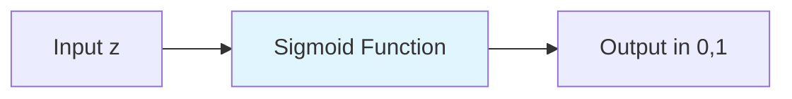
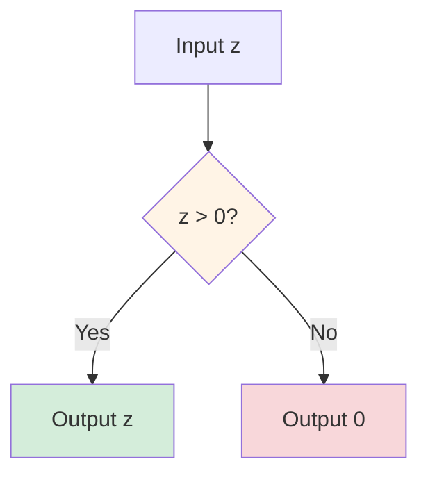
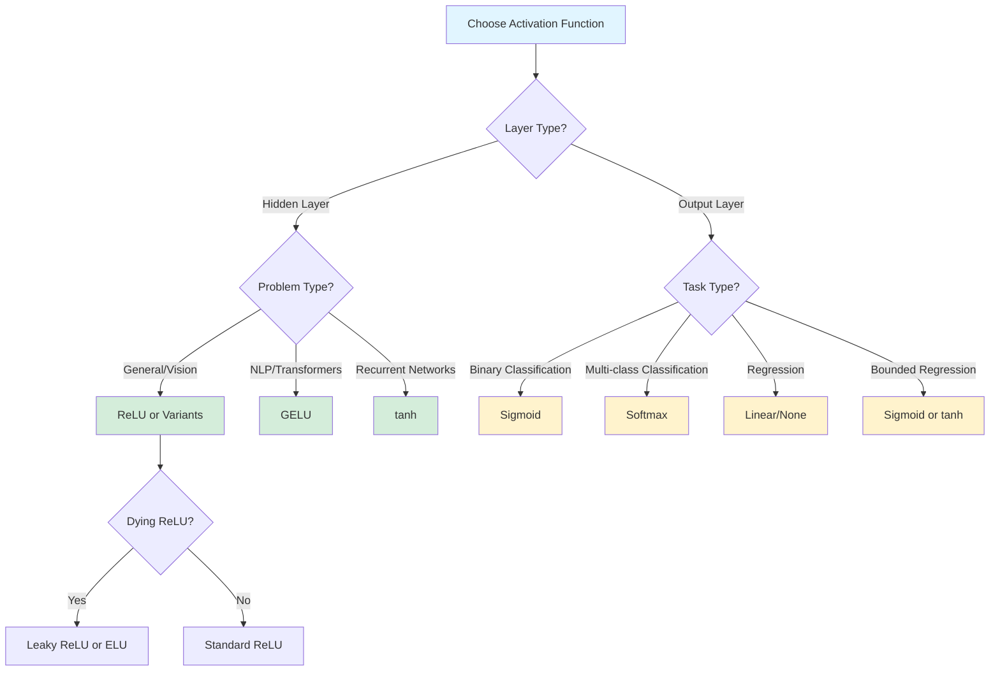

# Activation Functions

Activation functions are mathematical functions applied to the output of neurons in a neural network. They introduce non-linearity into the network, enabling it to learn and represent complex patterns and relationships in data. Without activation functions, a neural network would simply be a linear regression model, regardless of the number of layers.

The choice of activation function significantly impacts the network's learning dynamics, convergence speed, and ability to avoid common training problems like vanishing or exploding gradients. Understanding the properties, advantages, and limitations of different activation functions is crucial for designing effective neural networks.

## Why Non-linearity Matters

The fundamental reason we need non-linear activation functions is that composition of linear functions is still linear. Consider a two-layer network without activation functions:

$$
\mathbf{z}^{[1]} = \mathbf{W}^{[1]}\mathbf{x} + \mathbf{b}^{[1]}
$$

$$
\mathbf{z}^{[2]} = \mathbf{W}^{[2]}\mathbf{z}^{[1]} + \mathbf{b}^{[2]}
$$

Substituting the first equation into the second:

$$
\mathbf{z}^{[2]} = \mathbf{W}^{[2]}(\mathbf{W}^{[1]}\mathbf{x} + \mathbf{b}^{[1]}) + \mathbf{b}^{[2]} = (\mathbf{W}^{[2]}\mathbf{W}^{[1]})\mathbf{x} + (\mathbf{W}^{[2]}\mathbf{b}^{[1]} + \mathbf{b}^{[2]})
$$

This is equivalent to a single linear layer with weights $\mathbf{W}' = \mathbf{W}^{[2]}\mathbf{W}^{[1]}$ and bias $\mathbf{b}' = \mathbf{W}^{[2]}\mathbf{b}^{[1]} + \mathbf{b}^{[2]}$. Adding more layers without non-linearity doesn't increase the model's expressiveness.

## Desirable Properties of Activation Functions

Good activation functions typically exhibit several desirable properties:

1. **Non-linearity**: Essential for learning complex patterns
2. **Differentiability**: Required for gradient-based optimization
3. **Monotonicity**: Helps with convergence in many cases
4. **Smooth gradients**: Prevents gradient-related training issues
5. **Computational efficiency**: Enables faster training
6. **Output range**: Appropriate for the task (bounded vs unbounded)
7. **Zero-centered**: Can help with convergence speed

## Sigmoid Activation Function

The sigmoid (or logistic) function is one of the earliest activation functions used in neural networks. It maps any real-valued number to the range (0, 1).

### Mathematical Definition

$$
\sigma(z) = \frac{1}{1 + e^{-z}}
$$

The derivative is particularly elegant:

$$
\frac{d\sigma(z)}{dz} = \sigma(z)(1 - \sigma(z))
$$



### Properties

**Advantages:**
- Output range (0, 1) is interpretable as probability
- Smooth gradient
- Clear predictions (values close to 0 or 1)

**Disadvantages:**
- **Vanishing gradient problem**: When |z| is large, gradient approaches zero, causing slow learning
- **Not zero-centered**: All outputs are positive, which can lead to zig-zagging dynamics during gradient descent
- **Computationally expensive**: Involves exponential operation

### Implementation

```python
import numpy as np
import matplotlib.pyplot as plt

def sigmoid(z):
    """Sigmoid activation function."""
    return 1 / (1 + np.exp(-z))

def sigmoid_derivative(z):
    """Derivative of sigmoid function."""
    s = sigmoid(z)
    return s * (1 - s)

# Visualization
z = np.linspace(-10, 10, 1000)
y = sigmoid(z)
dy = sigmoid_derivative(z)

plt.figure(figsize=(12, 4))

plt.subplot(1, 2, 1)
plt.plot(z, y, label='Sigmoid', color='blue', linewidth=2)
plt.grid(True, alpha=0.3)
plt.xlabel('z')
plt.ylabel('σ(z)')
plt.title('Sigmoid Activation Function')
plt.legend()

plt.subplot(1, 2, 2)
plt.plot(z, dy, label="Sigmoid Derivative", color='red', linewidth=2)
plt.grid(True, alpha=0.3)
plt.xlabel('z')
plt.ylabel("σ'(z)")
plt.title('Sigmoid Derivative')
plt.legend()

plt.tight_layout()
plt.show()

# Example usage in a neural network layer
class SigmoidLayer:
    def __init__(self):
        self.cache = None

    def forward(self, z):
        """Forward pass."""
        self.cache = z
        return sigmoid(z)

    def backward(self, dA):
        """Backward pass."""
        z = self.cache
        dz = dA * sigmoid_derivative(z)
        return dz

# Test
layer = SigmoidLayer()
z_test = np.array([[-1, 0, 1], [2, 3, 4]])
a_test = layer.forward(z_test)
print("Input z:\n", z_test)
print("\nSigmoid output:\n", a_test)
print("\nGradient (assuming dA=1):\n", layer.backward(np.ones_like(a_test)))
```

### Use Cases

Sigmoid is primarily used in:
- Output layer for binary classification
- LSTM/GRU gate activations
- Historical neural networks (now largely replaced)

## Hyperbolic Tangent (tanh)

The hyperbolic tangent function is similar to sigmoid but maps inputs to the range (-1, 1), making it zero-centered.

### Mathematical Definition

$$
\tanh(z) = \frac{e^z - e^{-z}}{e^z + e^{-z}} = \frac{e^{2z} - 1}{e^{2z} + 1} = 2\sigma(2z) - 1
$$

The derivative:

$$
\frac{d\tanh(z)}{dz} = 1 - \tanh^2(z)
$$

### Properties

**Advantages:**
- Zero-centered output: Helps with convergence
- Stronger gradients than sigmoid (derivatives range from 0 to 1)
- Output range (-1, 1) is symmetric

**Disadvantages:**
- Still suffers from vanishing gradient problem
- Computationally expensive (exponential operations)

### Implementation

```python
def tanh(z):
    """Hyperbolic tangent activation function."""
    return np.tanh(z)

def tanh_derivative(z):
    """Derivative of tanh function."""
    return 1 - np.tanh(z)**2

# Visualization
z = np.linspace(-10, 10, 1000)
y_tanh = tanh(z)
dy_tanh = tanh_derivative(z)

plt.figure(figsize=(12, 4))

plt.subplot(1, 2, 1)
plt.plot(z, y_tanh, label='tanh', color='green', linewidth=2)
plt.axhline(y=0, color='k', linestyle='--', alpha=0.3)
plt.grid(True, alpha=0.3)
plt.xlabel('z')
plt.ylabel('tanh(z)')
plt.title('Tanh Activation Function')
plt.legend()

plt.subplot(1, 2, 2)
plt.plot(z, dy_tanh, label="tanh Derivative", color='orange', linewidth=2)
plt.grid(True, alpha=0.3)
plt.xlabel('z')
plt.ylabel("tanh'(z)")
plt.title('Tanh Derivative')
plt.legend()

plt.tight_layout()
plt.show()

# PyTorch implementation
import torch
import torch.nn as nn

class TanhNetwork(nn.Module):
    def __init__(self, input_size, hidden_size, output_size):
        super(TanhNetwork, self).__init__()
        self.hidden = nn.Linear(input_size, hidden_size)
        self.output = nn.Linear(hidden_size, output_size)
        self.tanh = nn.Tanh()

    def forward(self, x):
        x = self.tanh(self.hidden(x))
        x = self.output(x)
        return x

# Example
model = TanhNetwork(10, 20, 1)
x = torch.randn(5, 10)
output = model(x)
print("Tanh network output shape:", output.shape)
```

### Use Cases

Tanh is commonly used in:
- Hidden layers (better than sigmoid due to zero-centering)
- Recurrent neural networks (RNN, LSTM)
- Networks where zero-centered outputs are beneficial

## Rectified Linear Unit (ReLU)

ReLU has become the default activation function for hidden layers in deep neural networks due to its simplicity and effectiveness.

### Mathematical Definition

$$
\text{ReLU}(z) = \max(0, z) = \begin{cases}
z & \text{if } z > 0 \\
0 & \text{if } z \leq 0
\end{cases}
$$

The derivative:

$$
\frac{d\text{ReLU}(z)}{dz} = \begin{cases}
1 & \text{if } z > 0 \\
0 & \text{if } z \leq 0
\end{cases}
$$



### Properties

**Advantages:**
- **No vanishing gradient**: For positive inputs, gradient is constant (1)
- **Computationally efficient**: Simple max operation
- **Sparse activation**: Approximately 50% of neurons output zero
- **Faster convergence**: Empirically 6x faster than sigmoid/tanh

**Disadvantages:**
- **Dying ReLU problem**: Neurons can "die" and always output zero
- **Not zero-centered**: All outputs are non-negative
- **Unbounded output**: Can lead to exploding activations
- **Non-differentiable at zero**: Though subgradient is used in practice

### Implementation

```python
def relu(z):
    """ReLU activation function."""
    return np.maximum(0, z)

def relu_derivative(z):
    """Derivative of ReLU function."""
    return (z > 0).astype(float)

# Visualization
z = np.linspace(-10, 10, 1000)
y_relu = relu(z)
dy_relu = relu_derivative(z)

plt.figure(figsize=(12, 4))

plt.subplot(1, 2, 1)
plt.plot(z, y_relu, label='ReLU', color='blue', linewidth=2)
plt.grid(True, alpha=0.3)
plt.xlabel('z')
plt.ylabel('ReLU(z)')
plt.title('ReLU Activation Function')
plt.legend()

plt.subplot(1, 2, 2)
plt.plot(z, dy_relu, label="ReLU Derivative", color='red', linewidth=2)
plt.grid(True, alpha=0.3)
plt.xlabel('z')
plt.ylabel("ReLU'(z)")
plt.title('ReLU Derivative')
plt.legend()

plt.tight_layout()
plt.show()

# NumPy implementation in a network
class ReLULayer:
    def __init__(self):
        self.cache = None

    def forward(self, z):
        """Forward pass."""
        self.cache = z
        return np.maximum(0, z)

    def backward(self, dA):
        """Backward pass."""
        z = self.cache
        dz = dA * (z > 0)
        return dz

# Keras example
from tensorflow import keras
from tensorflow.keras import layers

model = keras.Sequential([
    layers.Dense(128, activation='relu', input_shape=(784,)),
    layers.Dense(64, activation='relu'),
    layers.Dense(10, activation='softmax')
])

model.summary()
```

### Dying ReLU Problem

The dying ReLU problem occurs when neurons get stuck always outputting zero. This happens when:

1. Large negative bias causes $z = wx + b < 0$ for all inputs
2. Large gradient update pushes weights into negative territory
3. Once "dead", gradient is always zero, so weights never update

**Solutions:**
- Use smaller learning rates
- Initialize weights carefully (e.g., He initialization)
- Use variants like Leaky ReLU or Parametric ReLU

## Leaky ReLU and Variants

To address the dying ReLU problem, several variants introduce a small slope for negative values.

### Leaky ReLU

$$
\text{LeakyReLU}(z) = \max(\alpha z, z) = \begin{cases}
z & \text{if } z > 0 \\
\alpha z & \text{if } z \leq 0
\end{cases}
$$

where $\alpha$ is a small constant (typically 0.01).

The derivative:

$$
\frac{d\text{LeakyReLU}(z)}{dz} = \begin{cases}
1 & \text{if } z > 0 \\
\alpha & \text{if } z \leq 0
\end{cases}
$$

### Parametric ReLU (PReLU)

PReLU makes $\alpha$ a learnable parameter:

$$
\text{PReLU}(z) = \max(\alpha z, z)
$$

where $\alpha$ is learned during training via backpropagation.

### Exponential Linear Unit (ELU)

$$
\text{ELU}(z) = \begin{cases}
z & \text{if } z > 0 \\
\alpha(e^z - 1) & \text{if } z \leq 0
\end{cases}
$$

ELU has a smooth curve for negative values and becomes closer to zero-mean outputs.

### Implementation

```python
def leaky_relu(z, alpha=0.01):
    """Leaky ReLU activation function."""
    return np.where(z > 0, z, alpha * z)

def leaky_relu_derivative(z, alpha=0.01):
    """Derivative of Leaky ReLU."""
    return np.where(z > 0, 1, alpha)

def elu(z, alpha=1.0):
    """ELU activation function."""
    return np.where(z > 0, z, alpha * (np.exp(z) - 1))

def elu_derivative(z, alpha=1.0):
    """Derivative of ELU."""
    return np.where(z > 0, 1, elu(z, alpha) + alpha)

# Visualization comparison
z = np.linspace(-3, 3, 1000)

plt.figure(figsize=(14, 5))

plt.subplot(1, 2, 1)
plt.plot(z, relu(z), label='ReLU', linewidth=2)
plt.plot(z, leaky_relu(z), label='Leaky ReLU (α=0.01)', linewidth=2)
plt.plot(z, elu(z), label='ELU (α=1.0)', linewidth=2)
plt.axhline(y=0, color='k', linestyle='--', alpha=0.3)
plt.axvline(x=0, color='k', linestyle='--', alpha=0.3)
plt.grid(True, alpha=0.3)
plt.xlabel('z')
plt.ylabel('Activation')
plt.title('ReLU Variants Comparison')
plt.legend()

plt.subplot(1, 2, 2)
plt.plot(z, relu_derivative(z), label='ReLU', linewidth=2)
plt.plot(z, leaky_relu_derivative(z), label='Leaky ReLU (α=0.01)', linewidth=2)
plt.plot(z, elu_derivative(z), label='ELU (α=1.0)', linewidth=2)
plt.grid(True, alpha=0.3)
plt.xlabel('z')
plt.ylabel('Derivative')
plt.title('Derivatives Comparison')
plt.legend()

plt.tight_layout()
plt.show()

# PyTorch implementation
import torch.nn as nn

class AdvancedActivationNetwork(nn.Module):
    def __init__(self, activation='leaky_relu'):
        super(AdvancedActivationNetwork, self).__init__()
        self.fc1 = nn.Linear(784, 256)
        self.fc2 = nn.Linear(256, 128)
        self.fc3 = nn.Linear(128, 10)

        if activation == 'leaky_relu':
            self.activation = nn.LeakyReLU(negative_slope=0.01)
        elif activation == 'prelu':
            self.activation = nn.PReLU()
        elif activation == 'elu':
            self.activation = nn.ELU(alpha=1.0)
        else:
            self.activation = nn.ReLU()

    def forward(self, x):
        x = self.activation(self.fc1(x))
        x = self.activation(self.fc2(x))
        x = self.fc3(x)
        return x

# Compare different activations
for act in ['relu', 'leaky_relu', 'prelu', 'elu']:
    model = AdvancedActivationNetwork(activation=act)
    print(f"\n{act.upper()} Network:")
    print(f"Total parameters: {sum(p.numel() for p in model.parameters())}")
```

### Comparison Table

| Feature | ReLU | Leaky ReLU | PReLU | ELU |
|---------|------|------------|-------|-----|
| Dying neurons | Yes | Reduced | Reduced | No |
| Computational cost | Very low | Very low | Low | Medium |
| Learnable params | No | No | Yes | No |
| Zero-centered | No | Closer | Closer | Yes |
| Smoothness | No | No | No | Yes |

## Gaussian Error Linear Unit (GELU)

GELU is a modern activation function used in state-of-the-art models like BERT and GPT. It provides a smooth approximation to ReLU with stochastic regularization properties.

### Mathematical Definition

$$
\text{GELU}(z) = z \cdot \Phi(z)
$$

where $\Phi(z)$ is the cumulative distribution function of the standard normal distribution:

$$
\Phi(z) = \frac{1}{2}\left[1 + \text{erf}\left(\frac{z}{\sqrt{2}}\right)\right]
$$

A common approximation (used for faster computation):

$$
\text{GELU}(z) \approx 0.5z\left(1 + \tanh\left[\sqrt{\frac{2}{\pi}}\left(z + 0.044715z^3\right)\right]\right)
$$

### Properties

**Advantages:**
- **Smooth**: Differentiable everywhere
- **Non-monotonic**: Can enhance gradient flow
- **Stochastic regularization**: Acts like dropout at each neuron
- **State-of-the-art performance**: Used in transformer models

**Disadvantages:**
- **Computationally expensive**: Involves error function
- **Complex**: Harder to analyze theoretically

### Implementation

```python
from scipy.special import erf

def gelu_exact(z):
    """Exact GELU activation function."""
    return 0.5 * z * (1 + erf(z / np.sqrt(2)))

def gelu_approx(z):
    """Approximate GELU activation function."""
    return 0.5 * z * (1 + np.tanh(np.sqrt(2/np.pi) * (z + 0.044715 * z**3)))

# Visualization
z = np.linspace(-3, 3, 1000)
y_gelu_exact = gelu_exact(z)
y_gelu_approx = gelu_approx(z)

plt.figure(figsize=(12, 4))

plt.subplot(1, 2, 1)
plt.plot(z, y_gelu_exact, label='GELU (exact)', linewidth=2, color='purple')
plt.plot(z, y_gelu_approx, label='GELU (approx)', linewidth=2,
         linestyle='--', color='orange')
plt.plot(z, relu(z), label='ReLU', linewidth=1, alpha=0.5, color='blue')
plt.grid(True, alpha=0.3)
plt.xlabel('z')
plt.ylabel('Activation')
plt.title('GELU vs ReLU')
plt.legend()

plt.subplot(1, 2, 2)
# Numerical derivative for visualization
dz = z[1] - z[0]
dy_gelu = np.gradient(y_gelu_exact, dz)
plt.plot(z, dy_gelu, label="GELU Derivative", linewidth=2, color='purple')
plt.plot(z, relu_derivative(z), label="ReLU Derivative", linewidth=1,
         alpha=0.5, color='blue')
plt.grid(True, alpha=0.3)
plt.xlabel('z')
plt.ylabel('Derivative')
plt.title('GELU Derivative')
plt.legend()

plt.tight_layout()
plt.show()

# PyTorch implementation
import torch
import torch.nn.functional as F

class GELUNetwork(nn.Module):
    def __init__(self, input_size, hidden_size, output_size):
        super(GELUNetwork, self).__init__()
        self.fc1 = nn.Linear(input_size, hidden_size)
        self.fc2 = nn.Linear(hidden_size, hidden_size)
        self.fc3 = nn.Linear(hidden_size, output_size)

    def forward(self, x):
        x = F.gelu(self.fc1(x))
        x = F.gelu(self.fc2(x))
        x = self.fc3(x)
        return x

# Example usage
model = GELUNetwork(784, 512, 10)
x = torch.randn(32, 784)
output = model(x)
print("GELU network output shape:", output.shape)
```

### Use Cases

GELU is primarily used in:
- Transformer models (BERT, GPT, Vision Transformers)
- Natural language processing tasks
- Modern deep learning architectures requiring smooth non-linearity

## Softmax Activation

Softmax is a special activation function used exclusively in the output layer for multi-class classification. It converts a vector of real values into a probability distribution.

### Mathematical Definition

For a vector $\mathbf{z} = [z_1, z_2, \ldots, z_K]$:

$$
\text{softmax}(z_i) = \frac{e^{z_i}}{\sum_{j=1}^K e^{z_j}}
$$

The output satisfies:
- $0 \leq \text{softmax}(z_i) \leq 1$ for all $i$
- $\sum_{i=1}^K \text{softmax}(z_i) = 1$

### Properties

**Advantages:**
- Produces valid probability distribution
- Differentiable (gradient flows to all inputs)
- Emphasizes the largest values

**Disadvantages:**
- Computationally expensive for large $K$
- Can suffer from numerical instability

### Numerical Stability

To prevent overflow, subtract the maximum value:

$$
\text{softmax}(z_i) = \frac{e^{z_i - \max(\mathbf{z})}}{\sum_{j=1}^K e^{z_j - \max(\mathbf{z})}}
$$

### Implementation

```python
def softmax(z):
    """Numerically stable softmax activation function."""
    # Subtract max for numerical stability
    exp_z = np.exp(z - np.max(z, axis=-1, keepdims=True))
    return exp_z / np.sum(exp_z, axis=-1, keepdims=True)

# Example
logits = np.array([[2.0, 1.0, 0.1],
                   [1.0, 3.0, 0.2]])

probs = softmax(logits)
print("Logits:\n", logits)
print("\nSoftmax probabilities:\n", probs)
print("\nSum of probabilities:", probs.sum(axis=1))

# PyTorch example with cross-entropy loss
import torch
import torch.nn as nn

# Create a simple classifier
class MultiClassClassifier(nn.Module):
    def __init__(self, input_size, num_classes):
        super(MultiClassClassifier, self).__init__()
        self.fc1 = nn.Linear(input_size, 128)
        self.fc2 = nn.Linear(128, 64)
        self.fc3 = nn.Linear(64, num_classes)
        self.relu = nn.ReLU()

    def forward(self, x):
        x = self.relu(self.fc1(x))
        x = self.relu(self.fc2(x))
        x = self.fc3(x)  # No softmax here!
        return x

# Note: PyTorch's CrossEntropyLoss includes softmax
model = MultiClassClassifier(20, 5)
criterion = nn.CrossEntropyLoss()

# Example forward pass
inputs = torch.randn(10, 20)
outputs = model(inputs)
targets = torch.randint(0, 5, (10,))

loss = criterion(outputs, targets)
print(f"\nCross-entropy loss: {loss.item():.4f}")

# To get probabilities for inference:
probs = torch.softmax(outputs, dim=1)
predictions = torch.argmax(probs, dim=1)
print(f"Predicted classes: {predictions}")
```

## Choosing the Right Activation Function

Selecting the appropriate activation function depends on the task, network architecture, and empirical performance.



### General Guidelines

**For Hidden Layers:**

1. **Start with ReLU**: It's the default choice for most problems
   - Fast computation
   - Works well in practice
   - Good for deep networks

2. **Try Leaky ReLU or ELU if**:
   - You observe dying ReLU problem
   - Training is unstable
   - You need zero-centered outputs

3. **Use GELU for**:
   - Transformer models
   - NLP tasks
   - When you need smooth non-linearity

4. **Use tanh for**:
   - Recurrent neural networks
   - When outputs need to be zero-centered
   - Smaller networks

**For Output Layers:**

1. **Binary Classification**: Sigmoid
   - Outputs interpretable as probability
   - Use with binary cross-entropy loss

2. **Multi-class Classification**: Softmax
   - Outputs probability distribution
   - Use with categorical cross-entropy

3. **Regression**: Linear (no activation)
   - Unbounded output range
   - Direct prediction of continuous values

4. **Bounded Regression**: Sigmoid or tanh
   - When output must be in specific range
   - Scale to desired bounds

### Practical Comparison

```python
import torch
import torch.nn as nn
import torch.optim as optim
from torch.utils.data import TensorDataset, DataLoader
import time

# Generate synthetic data
np.random.seed(42)
X_train = np.random.randn(1000, 20)
y_train = (X_train.sum(axis=1) > 0).astype(int)

X_train_tensor = torch.FloatTensor(X_train)
y_train_tensor = torch.LongTensor(y_train)

dataset = TensorDataset(X_train_tensor, y_train_tensor)
dataloader = DataLoader(dataset, batch_size=32, shuffle=True)

# Define a flexible network
class FlexibleNetwork(nn.Module):
    def __init__(self, activation_name='relu'):
        super(FlexibleNetwork, self).__init__()
        self.fc1 = nn.Linear(20, 64)
        self.fc2 = nn.Linear(64, 32)
        self.fc3 = nn.Linear(32, 2)

        activations = {
            'relu': nn.ReLU(),
            'leaky_relu': nn.LeakyReLU(),
            'elu': nn.ELU(),
            'gelu': nn.GELU(),
            'tanh': nn.Tanh(),
            'sigmoid': nn.Sigmoid()
        }
        self.activation = activations.get(activation_name, nn.ReLU())

    def forward(self, x):
        x = self.activation(self.fc1(x))
        x = self.activation(self.fc2(x))
        x = self.fc3(x)
        return x

# Train and compare different activations
results = {}

for activation_name in ['relu', 'leaky_relu', 'elu', 'gelu', 'tanh']:
    model = FlexibleNetwork(activation_name)
    criterion = nn.CrossEntropyLoss()
    optimizer = optim.Adam(model.parameters(), lr=0.001)

    start_time = time.time()

    # Train for 10 epochs
    for epoch in range(10):
        for batch_x, batch_y in dataloader:
            optimizer.zero_grad()
            outputs = model(batch_x)
            loss = criterion(outputs, batch_y)
            loss.backward()
            optimizer.step()

    training_time = time.time() - start_time

    # Evaluate
    model.eval()
    with torch.no_grad():
        outputs = model(X_train_tensor)
        _, predicted = torch.max(outputs, 1)
        accuracy = (predicted == y_train_tensor).float().mean().item()

    results[activation_name] = {
        'accuracy': accuracy,
        'time': training_time
    }

    print(f"{activation_name.upper():12} - Accuracy: {accuracy:.4f}, Time: {training_time:.3f}s")

# Summary
print("\nSummary:")
print("=" * 50)
best_acc = max(results.items(), key=lambda x: x[1]['accuracy'])
fastest = min(results.items(), key=lambda x: x[1]['time'])
print(f"Best accuracy: {best_acc[0]} ({best_acc[1]['accuracy']:.4f})")
print(f"Fastest training: {fastest[0]} ({fastest[1]['time']:.3f}s)")
```

## Common Pitfalls and Best Practices

### Pitfalls to Avoid

1. **Using sigmoid/tanh in deep networks**: Causes vanishing gradients
2. **Applying softmax to hidden layers**: Designed only for output layer
3. **Ignoring dying ReLU**: Can severely hamper learning
4. **Inconsistent activation choices**: Mix carefully based on requirements
5. **Not considering computational cost**: GELU/ELU slower than ReLU

### Best Practices

1. **Start simple**: Use ReLU as baseline, optimize if needed
2. **Match output activation to loss**: Sigmoid with BCE, softmax with CCE
3. **Monitor activation statistics**: Check for dead neurons
4. **Experiment systematically**: Test different activations on validation set
5. **Consider architecture**: Transformers benefit from GELU, CNNs from ReLU
6. **Use proper initialization**: He initialization for ReLU, Xavier for tanh

```python
# Good initialization practices
def initialize_network(model, activation_type='relu'):
    """Initialize network weights based on activation function."""
    for module in model.modules():
        if isinstance(module, nn.Linear):
            if activation_type in ['relu', 'leaky_relu', 'elu']:
                # He initialization for ReLU-like activations
                nn.init.kaiming_normal_(module.weight, mode='fan_in',
                                       nonlinearity='relu')
            elif activation_type in ['tanh', 'sigmoid']:
                # Xavier initialization for tanh/sigmoid
                nn.init.xavier_normal_(module.weight)
            elif activation_type == 'gelu':
                # Xavier initialization for GELU
                nn.init.xavier_uniform_(module.weight)

            if module.bias is not None:
                nn.init.zeros_(module.bias)

# Example usage
model = FlexibleNetwork(activation_name='relu')
initialize_network(model, activation_type='relu')
print("Network initialized with He initialization for ReLU")
```

## Conclusion

Activation functions are fundamental building blocks of neural networks, introducing the non-linearity necessary for learning complex patterns. While ReLU remains the default choice for most applications due to its simplicity and effectiveness, understanding the properties and use cases of different activation functions enables you to make informed architectural decisions.

Key takeaways:
- ReLU is the standard for hidden layers in most networks
- Sigmoid and softmax are designed for output layers
- GELU excels in transformer architectures
- Leaky ReLU and ELU address the dying ReLU problem
- Always match activation functions to the task and loss function
- Proper initialization is crucial for different activation types

The choice of activation function should be driven by empirical performance on your specific task, architectural considerations, and computational constraints.
