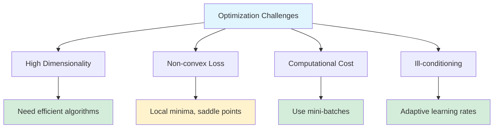
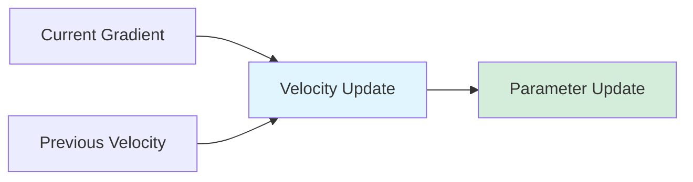
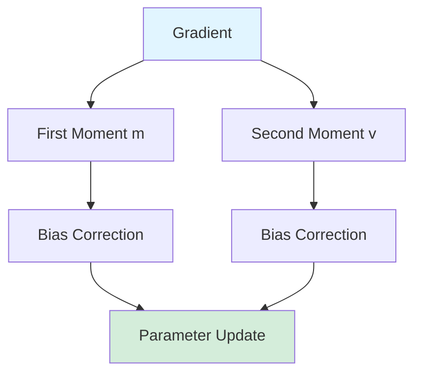
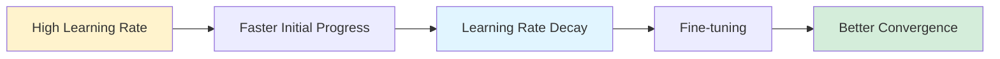
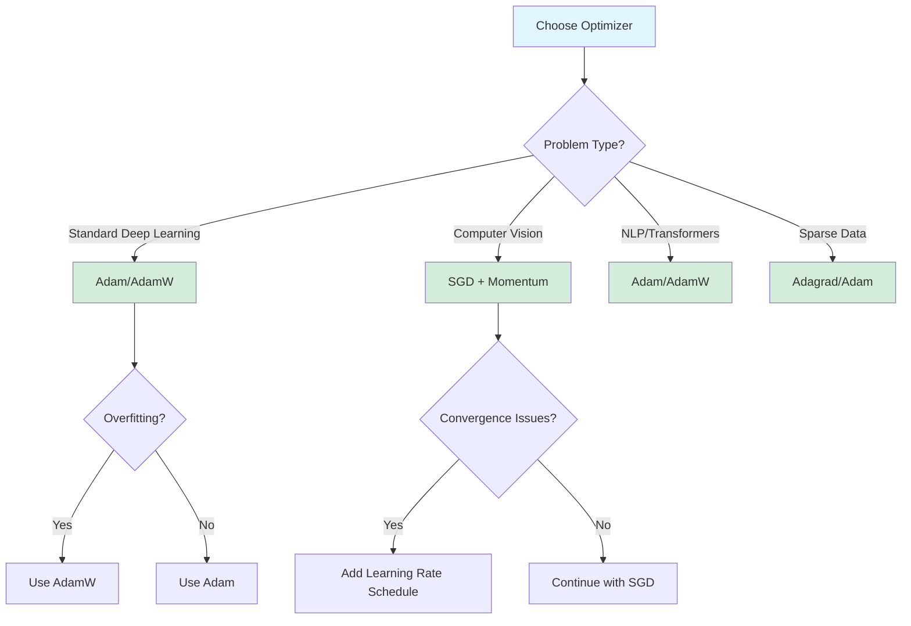

# Optimization Algorithms

Optimization algorithms are the engines that drive neural network training. They determine how the network updates its weights based on the computed gradients to minimize the loss function. The choice of optimization algorithm significantly impacts training speed, convergence stability, and final model performance.

While basic gradient descent provides the foundation, modern deep learning relies on sophisticated optimization algorithms that adapt learning rates, incorporate momentum, and handle sparse gradients efficiently. Understanding these algorithms and their hyperparameters is essential for training effective neural networks.

## The Optimization Problem

Neural network training aims to find parameters $\theta$ that minimize a loss function $\mathcal{L}(\theta)$:

$$
\theta^* = \arg\min_{\theta} \mathcal{L}(\theta)
$$

For a dataset with $m$ examples, the empirical loss is:

$$
\mathcal{L}(\theta) = \frac{1}{m}\sum_{i=1}^m \ell(f_\theta(x^{(i)}), y^{(i)})
$$

where $f_\theta$ is the neural network parameterized by $\theta$, and $\ell$ is the per-example loss.

The gradient of the loss with respect to parameters is:

$$
\nabla_\theta \mathcal{L}(\theta) = \frac{1}{m}\sum_{i=1}^m \nabla_\theta \ell(f_\theta(x^{(i)}), y^{(i)})
$$

## Challenges in Neural Network Optimization

Training neural networks presents several unique challenges:

1. **High dimensionality**: Modern networks have millions or billions of parameters
2. **Non-convexity**: Loss surface has many local minima and saddle points
3. **Computational cost**: Computing gradients over entire dataset is expensive
4. **Ill-conditioning**: Different parameters may require different learning rates
5. **Saddle points**: Plateaus where gradients are near zero but not at minimum
6. **Vanishing/exploding gradients**: Especially in deep networks



## Batch Gradient Descent

Batch gradient descent (BGD) computes the gradient using the entire training dataset before updating parameters.

### Algorithm

At each iteration $t$:

$$
\theta_{t+1} = \theta_t - \eta \nabla_\theta \mathcal{L}(\theta_t)
$$

where $\eta$ is the learning rate.

### Properties

**Advantages:**
- Guaranteed convergence to global minimum for convex problems
- Stable convergence trajectory
- Efficient for small datasets

**Disadvantages:**
- Slow for large datasets (one update per full pass)
- Memory intensive (requires all data in memory)
- Can get stuck in local minima for non-convex problems
- No online learning capability

### Implementation

```python
import numpy as np
import matplotlib.pyplot as plt

def batch_gradient_descent(X, y, learning_rate=0.01, epochs=100):
    """
    Batch Gradient Descent for linear regression.

    Args:
        X: Training features (m x n)
        y: Target values (m x 1)
        learning_rate: Step size
        epochs: Number of iterations

    Returns:
        weights: Learned parameters
        history: Loss history
    """
    m, n = X.shape
    weights = np.zeros((n, 1))
    history = {'loss': [], 'weights': []}

    for epoch in range(epochs):
        # Predict
        predictions = X @ weights

        # Compute loss (MSE)
        loss = (1/(2*m)) * np.sum((predictions - y)**2)
        history['loss'].append(loss)
        history['weights'].append(weights.copy())

        # Compute gradient
        gradient = (1/m) * X.T @ (predictions - y)

        # Update weights
        weights = weights - learning_rate * gradient

        if epoch % 10 == 0:
            print(f"Epoch {epoch}, Loss: {loss:.4f}")

    return weights, history

# Generate synthetic data
np.random.seed(42)
m = 1000
X = np.random.randn(m, 2)
true_weights = np.array([[3.0], [-2.0]])
y = X @ true_weights + 0.5 * np.random.randn(m, 1)

# Add bias term
X_with_bias = np.hstack([np.ones((m, 1)), X])

# Train
weights, history = batch_gradient_descent(X_with_bias, y,
                                         learning_rate=0.1,
                                         epochs=100)

print(f"\nLearned weights: {weights.flatten()}")
print(f"True weights: [0.0, {true_weights.flatten()}]")

# Plot convergence
plt.figure(figsize=(12, 4))

plt.subplot(1, 2, 1)
plt.plot(history['loss'])
plt.xlabel('Epoch')
plt.ylabel('Loss')
plt.title('Batch Gradient Descent Convergence')
plt.grid(True, alpha=0.3)

plt.subplot(1, 2, 2)
weights_array = np.array(history['weights']).squeeze()
plt.plot(weights_array[:, 1], label='Weight 1')
plt.plot(weights_array[:, 2], label='Weight 2')
plt.axhline(y=true_weights[0], color='b', linestyle='--', alpha=0.5)
plt.axhline(y=true_weights[1], color='r', linestyle='--', alpha=0.5)
plt.xlabel('Epoch')
plt.ylabel('Weight Value')
plt.title('Weight Evolution')
plt.legend()
plt.grid(True, alpha=0.3)

plt.tight_layout()
plt.show()
```

## Stochastic Gradient Descent (SGD)

SGD updates parameters using the gradient computed from a single training example at a time, making it much faster than batch gradient descent.

### Algorithm

At each iteration $t$, randomly sample one example $(x^{(i)}, y^{(i)})$:

$$
\theta_{t+1} = \theta_t - \eta \nabla_\theta \ell(f_\theta(x^{(i)}), y^{(i)})
$$

### Properties

**Advantages:**
- Fast updates (one per example)
- Can escape local minima due to noise
- Online learning capability
- Memory efficient

**Disadvantages:**
- Noisy convergence trajectory
- May not converge to exact minimum
- Slower overall convergence than mini-batch methods
- Requires learning rate decay

### Implementation

```python
def stochastic_gradient_descent(X, y, learning_rate=0.01, epochs=100):
    """
    Stochastic Gradient Descent for linear regression.
    """
    m, n = X.shape
    weights = np.zeros((n, 1))
    history = {'loss': []}

    for epoch in range(epochs):
        # Shuffle data
        indices = np.random.permutation(m)
        X_shuffled = X[indices]
        y_shuffled = y[indices]

        for i in range(m):
            # Get single example
            xi = X_shuffled[i:i+1]
            yi = y_shuffled[i:i+1]

            # Predict
            prediction = xi @ weights

            # Compute gradient for single example
            gradient = xi.T @ (prediction - yi)

            # Update weights
            weights = weights - learning_rate * gradient

        # Compute full loss for tracking
        predictions = X @ weights
        loss = (1/(2*m)) * np.sum((predictions - y)**2)
        history['loss'].append(loss)

        if epoch % 10 == 0:
            print(f"Epoch {epoch}, Loss: {loss:.4f}")

    return weights, history

# Train with SGD
weights_sgd, history_sgd = stochastic_gradient_descent(
    X_with_bias, y, learning_rate=0.01, epochs=100
)

print(f"\nSGD Learned weights: {weights_sgd.flatten()}")

# Compare convergence
plt.figure(figsize=(10, 4))
plt.plot(history['loss'], label='Batch GD', linewidth=2)
plt.plot(history_sgd['loss'], label='SGD', linewidth=2, alpha=0.7)
plt.xlabel('Epoch')
plt.ylabel('Loss')
plt.title('Batch GD vs SGD Convergence')
plt.legend()
plt.grid(True, alpha=0.3)
plt.show()
```

## Mini-batch Gradient Descent

Mini-batch gradient descent combines the advantages of batch and stochastic gradient descent by computing gradients on small batches of data.

### Algorithm

At each iteration $t$, sample a mini-batch $\mathcal{B}_t$ of size $b$:

$$
\theta_{t+1} = \theta_t - \eta \frac{1}{|\mathcal{B}_t|}\sum_{i \in \mathcal{B}_t} \nabla_\theta \ell(f_\theta(x^{(i)}), y^{(i)})
$$

Common batch sizes: 32, 64, 128, 256

### Properties

**Advantages:**
- Balance between stability and speed
- Better gradient estimates than SGD
- Efficient use of vectorized operations
- Can leverage GPU parallelization

**Disadvantages:**
- Requires tuning batch size hyperparameter
- Still has noisy gradients (though less than SGD)

### Implementation

```python
def mini_batch_gradient_descent(X, y, batch_size=32,
                               learning_rate=0.01, epochs=100):
    """
    Mini-batch Gradient Descent for linear regression.
    """
    m, n = X.shape
    weights = np.zeros((n, 1))
    history = {'loss': []}

    for epoch in range(epochs):
        # Shuffle data
        indices = np.random.permutation(m)
        X_shuffled = X[indices]
        y_shuffled = y[indices]

        # Process mini-batches
        for i in range(0, m, batch_size):
            # Get mini-batch
            X_batch = X_shuffled[i:i+batch_size]
            y_batch = y_shuffled[i:i+batch_size]
            batch_m = X_batch.shape[0]

            # Predict
            predictions = X_batch @ weights

            # Compute gradient for batch
            gradient = (1/batch_m) * X_batch.T @ (predictions - y_batch)

            # Update weights
            weights = weights - learning_rate * gradient

        # Compute full loss
        predictions = X @ weights
        loss = (1/(2*m)) * np.sum((predictions - y)**2)
        history['loss'].append(loss)

        if epoch % 10 == 0:
            print(f"Epoch {epoch}, Loss: {loss:.4f}")

    return weights, history

# Train with different batch sizes
batch_sizes = [1, 32, 128, m]
results = {}

for bs in batch_sizes:
    weights_mb, history_mb = mini_batch_gradient_descent(
        X_with_bias, y, batch_size=bs,
        learning_rate=0.01, epochs=100
    )
    results[bs] = history_mb

# Plot comparison
plt.figure(figsize=(12, 4))
for bs, hist in results.items():
    label = f'Batch size {bs}' if bs < m else 'Full batch'
    plt.plot(hist['loss'], label=label, linewidth=2)

plt.xlabel('Epoch')
plt.ylabel('Loss')
plt.title('Effect of Batch Size on Convergence')
plt.legend()
plt.grid(True, alpha=0.3)
plt.yscale('log')
plt.show()
```

## Momentum

Momentum accelerates gradient descent by accumulating a velocity vector in directions of persistent gradient reduction, helping to navigate ravines and escape local minima.

### Algorithm

$$
v_t = \beta v_{t-1} + (1-\beta)\nabla_\theta \mathcal{L}(\theta_t)
$$

$$
\theta_{t+1} = \theta_t - \eta v_t
$$

where $\beta$ (typically 0.9) controls how much past gradients influence current update.

### Intuition

Think of momentum as a ball rolling down a hill:
- Accumulates speed in consistent directions
- Dampens oscillations in inconsistent directions
- Can roll through small bumps (local minima)



### Implementation

```python
def sgd_momentum(X, y, batch_size=32, learning_rate=0.01,
                momentum=0.9, epochs=100):
    """
    SGD with Momentum.
    """
    m, n = X.shape
    weights = np.zeros((n, 1))
    velocity = np.zeros((n, 1))
    history = {'loss': []}

    for epoch in range(epochs):
        indices = np.random.permutation(m)
        X_shuffled = X[indices]
        y_shuffled = y[indices]

        for i in range(0, m, batch_size):
            X_batch = X_shuffled[i:i+batch_size]
            y_batch = y_shuffled[i:i+batch_size]
            batch_m = X_batch.shape[0]

            # Compute gradient
            predictions = X_batch @ weights
            gradient = (1/batch_m) * X_batch.T @ (predictions - y_batch)

            # Update velocity
            velocity = momentum * velocity + (1 - momentum) * gradient

            # Update weights
            weights = weights - learning_rate * velocity

        # Track loss
        predictions = X @ weights
        loss = (1/(2*m)) * np.sum((predictions - y)**2)
        history['loss'].append(loss)

    return weights, history

# Compare with and without momentum
weights_no_mom, hist_no_mom = mini_batch_gradient_descent(
    X_with_bias, y, batch_size=32, learning_rate=0.01, epochs=100
)

weights_mom, hist_mom = sgd_momentum(
    X_with_bias, y, batch_size=32, learning_rate=0.01,
    momentum=0.9, epochs=100
)

plt.figure(figsize=(10, 4))
plt.plot(hist_no_mom['loss'], label='SGD without Momentum', linewidth=2)
plt.plot(hist_mom['loss'], label='SGD with Momentum (β=0.9)', linewidth=2)
plt.xlabel('Epoch')
plt.ylabel('Loss')
plt.title('Effect of Momentum')
plt.legend()
plt.grid(True, alpha=0.3)
plt.show()
```

### Nesterov Accelerated Gradient (NAG)

Nesterov momentum looks ahead before computing the gradient:

$$
v_t = \beta v_{t-1} + (1-\beta)\nabla_\theta \mathcal{L}(\theta_t - \eta\beta v_{t-1})
$$

$$
\theta_{t+1} = \theta_t - \eta v_t
$$

This "look-ahead" gradient provides better updates, especially near minima.

```python
def nesterov_momentum(X, y, batch_size=32, learning_rate=0.01,
                     momentum=0.9, epochs=100):
    """
    SGD with Nesterov Momentum.
    """
    m, n = X.shape
    weights = np.zeros((n, 1))
    velocity = np.zeros((n, 1))
    history = {'loss': []}

    for epoch in range(epochs):
        indices = np.random.permutation(m)
        X_shuffled = X[indices]
        y_shuffled = y[indices]

        for i in range(0, m, batch_size):
            X_batch = X_shuffled[i:i+batch_size]
            y_batch = y_shuffled[i:i+batch_size]
            batch_m = X_batch.shape[0]

            # Look ahead
            weights_ahead = weights - learning_rate * momentum * velocity

            # Compute gradient at look-ahead position
            predictions = X_batch @ weights_ahead
            gradient = (1/batch_m) * X_batch.T @ (predictions - y_batch)

            # Update velocity
            velocity = momentum * velocity + (1 - momentum) * gradient

            # Update weights
            weights = weights - learning_rate * velocity

        # Track loss
        predictions = X @ weights
        loss = (1/(2*m)) * np.sum((predictions - y)**2)
        history['loss'].append(loss)

    return weights, history
```

## AdaGrad (Adaptive Gradient)

AdaGrad adapts the learning rate for each parameter based on historical gradients, giving larger updates to infrequent parameters.

### Algorithm

$$
G_t = G_{t-1} + (\nabla_\theta \mathcal{L}(\theta_t))^2
$$

$$
\theta_{t+1} = \theta_t - \frac{\eta}{\sqrt{G_t + \epsilon}}\nabla_\theta \mathcal{L}(\theta_t)
$$

where $G_t$ accumulates squared gradients element-wise, and $\epsilon$ (typically $10^{-8}$) prevents division by zero.

### Properties

**Advantages:**
- No manual learning rate tuning needed
- Works well with sparse gradients
- Different learning rates for each parameter

**Disadvantages:**
- Learning rate monotonically decreases
- Can become infinitesimally small, stopping learning
- Not suitable for non-convex optimization

### Implementation

```python
def adagrad(X, y, batch_size=32, learning_rate=0.1,
           epsilon=1e-8, epochs=100):
    """
    AdaGrad optimizer.
    """
    m, n = X.shape
    weights = np.zeros((n, 1))
    G = np.zeros((n, 1))  # Accumulated squared gradients
    history = {'loss': []}

    for epoch in range(epochs):
        indices = np.random.permutation(m)
        X_shuffled = X[indices]
        y_shuffled = y[indices]

        for i in range(0, m, batch_size):
            X_batch = X_shuffled[i:i+batch_size]
            y_batch = y_shuffled[i:i+batch_size]
            batch_m = X_batch.shape[0]

            # Compute gradient
            predictions = X_batch @ weights
            gradient = (1/batch_m) * X_batch.T @ (predictions - y_batch)

            # Accumulate squared gradients
            G += gradient ** 2

            # Update weights with adaptive learning rate
            weights = weights - (learning_rate / np.sqrt(G + epsilon)) * gradient

        # Track loss
        predictions = X @ weights
        loss = (1/(2*m)) * np.sum((predictions - y)**2)
        history['loss'].append(loss)

    return weights, history

# Train with AdaGrad
weights_ada, hist_ada = adagrad(X_with_bias, y, batch_size=32,
                                learning_rate=0.1, epochs=100)

print(f"AdaGrad Learned weights: {weights_ada.flatten()}")
```

## RMSprop (Root Mean Square Propagation)

RMSprop addresses AdaGrad's diminishing learning rates by using an exponentially decaying average of squared gradients.

### Algorithm

$$
E[g^2]_t = \beta E[g^2]_{t-1} + (1-\beta)(\nabla_\theta \mathcal{L}(\theta_t))^2
$$

$$
\theta_{t+1} = \theta_t - \frac{\eta}{\sqrt{E[g^2]_t + \epsilon}}\nabla_\theta \mathcal{L}(\theta_t)
$$

where $\beta$ (typically 0.9 or 0.99) controls the decay rate.

### Properties

**Advantages:**
- Resolves AdaGrad's diminishing learning rate problem
- Works well for recurrent neural networks
- Adapts learning rates per parameter

**Disadvantages:**
- Still requires manual learning rate tuning
- Can be sensitive to initial learning rate

### Implementation

```python
def rmsprop(X, y, batch_size=32, learning_rate=0.01,
           beta=0.9, epsilon=1e-8, epochs=100):
    """
    RMSprop optimizer.
    """
    m, n = X.shape
    weights = np.zeros((n, 1))
    E_g2 = np.zeros((n, 1))  # Exponential average of squared gradients
    history = {'loss': []}

    for epoch in range(epochs):
        indices = np.random.permutation(m)
        X_shuffled = X[indices]
        y_shuffled = y[indices]

        for i in range(0, m, batch_size):
            X_batch = X_shuffled[i:i+batch_size]
            y_batch = y_shuffled[i:i+batch_size]
            batch_m = X_batch.shape[0]

            # Compute gradient
            predictions = X_batch @ weights
            gradient = (1/batch_m) * X_batch.T @ (predictions - y_batch)

            # Update exponential average of squared gradients
            E_g2 = beta * E_g2 + (1 - beta) * (gradient ** 2)

            # Update weights
            weights = weights - (learning_rate / np.sqrt(E_g2 + epsilon)) * gradient

        # Track loss
        predictions = X @ weights
        loss = (1/(2*m)) * np.sum((predictions - y)**2)
        history['loss'].append(loss)

    return weights, history

# Train with RMSprop
weights_rms, hist_rms = rmsprop(X_with_bias, y, batch_size=32,
                                learning_rate=0.01, epochs=100)

print(f"RMSprop Learned weights: {weights_rms.flatten()}")
```

## Adam (Adaptive Moment Estimation)

Adam combines the benefits of momentum and RMSprop by maintaining exponential moving averages of both gradients (first moment) and squared gradients (second moment).

### Algorithm

$$
m_t = \beta_1 m_{t-1} + (1-\beta_1)\nabla_\theta \mathcal{L}(\theta_t)
$$

$$
v_t = \beta_2 v_{t-1} + (1-\beta_2)(\nabla_\theta \mathcal{L}(\theta_t))^2
$$

Bias-corrected estimates:

$$
\hat{m}_t = \frac{m_t}{1-\beta_1^t}, \quad \hat{v}_t = \frac{v_t}{1-\beta_2^t}
$$

Parameter update:

$$
\theta_{t+1} = \theta_t - \frac{\eta}{\sqrt{\hat{v}_t} + \epsilon}\hat{m}_t
$$

Default hyperparameters: $\beta_1=0.9$, $\beta_2=0.999$, $\epsilon=10^{-8}$



### Properties

**Advantages:**
- Generally works well with default hyperparameters
- Combines benefits of momentum and adaptive learning rates
- Efficient and widely applicable
- Handles sparse gradients well

**Disadvantages:**
- Can have convergence issues in some cases
- May not always find the best minimum
- Computationally more expensive than SGD

### Implementation

```python
def adam(X, y, batch_size=32, learning_rate=0.001,
        beta1=0.9, beta2=0.999, epsilon=1e-8, epochs=100):
    """
    Adam optimizer.
    """
    m, n = X.shape
    weights = np.zeros((n, 1))
    m_t = np.zeros((n, 1))  # First moment
    v_t = np.zeros((n, 1))  # Second moment
    t = 0  # Time step
    history = {'loss': []}

    for epoch in range(epochs):
        indices = np.random.permutation(m)
        X_shuffled = X[indices]
        y_shuffled = y[indices]

        for i in range(0, m, batch_size):
            X_batch = X_shuffled[i:i+batch_size]
            y_batch = y_shuffled[i:i+batch_size]
            batch_m = X_batch.shape[0]
            t += 1

            # Compute gradient
            predictions = X_batch @ weights
            gradient = (1/batch_m) * X_batch.T @ (predictions - y_batch)

            # Update biased first moment estimate
            m_t = beta1 * m_t + (1 - beta1) * gradient

            # Update biased second moment estimate
            v_t = beta2 * v_t + (1 - beta2) * (gradient ** 2)

            # Compute bias-corrected estimates
            m_hat = m_t / (1 - beta1**t)
            v_hat = v_t / (1 - beta2**t)

            # Update weights
            weights = weights - learning_rate * m_hat / (np.sqrt(v_hat) + epsilon)

        # Track loss
        predictions = X @ weights
        loss = (1/(2*m)) * np.sum((predictions - y)**2)
        history['loss'].append(loss)

    return weights, history

# Train with Adam
weights_adam, hist_adam = adam(X_with_bias, y, batch_size=32,
                              learning_rate=0.01, epochs=100)

print(f"Adam Learned weights: {weights_adam.flatten()}")

# Compare all optimizers
plt.figure(figsize=(14, 5))

plt.subplot(1, 2, 1)
plt.plot(hist_no_mom['loss'], label='SGD', linewidth=2)
plt.plot(hist_mom['loss'], label='SGD + Momentum', linewidth=2)
plt.plot(hist_ada['loss'], label='AdaGrad', linewidth=2)
plt.plot(hist_rms['loss'], label='RMSprop', linewidth=2)
plt.plot(hist_adam['loss'], label='Adam', linewidth=2)
plt.xlabel('Epoch')
plt.ylabel('Loss')
plt.title('Optimizer Comparison')
plt.legend()
plt.grid(True, alpha=0.3)

plt.subplot(1, 2, 2)
plt.plot(hist_no_mom['loss'], label='SGD', linewidth=2)
plt.plot(hist_mom['loss'], label='SGD + Momentum', linewidth=2)
plt.plot(hist_ada['loss'], label='AdaGrad', linewidth=2)
plt.plot(hist_rms['loss'], label='RMSprop', linewidth=2)
plt.plot(hist_adam['loss'], label='Adam', linewidth=2)
plt.xlabel('Epoch')
plt.ylabel('Loss (log scale)')
plt.title('Optimizer Comparison (Log Scale)')
plt.legend()
plt.grid(True, alpha=0.3)
plt.yscale('log')

plt.tight_layout()
plt.show()
```

## PyTorch Implementation

```python
import torch
import torch.nn as nn
import torch.optim as optim
from torch.utils.data import TensorDataset, DataLoader

# Convert data to PyTorch tensors
X_tensor = torch.FloatTensor(X_with_bias[:, 1:])  # Remove bias column
y_tensor = torch.FloatTensor(y)

# Create dataset and dataloader
dataset = TensorDataset(X_tensor, y_tensor)
dataloader = DataLoader(dataset, batch_size=32, shuffle=True)

# Define model
class LinearModel(nn.Module):
    def __init__(self, input_dim):
        super(LinearModel, self).__init__()
        self.linear = nn.Linear(input_dim, 1)

    def forward(self, x):
        return self.linear(x)

# Train function
def train_model(optimizer_name, learning_rate=0.01, epochs=100):
    model = LinearModel(X_tensor.shape[1])
    criterion = nn.MSELoss()

    # Select optimizer
    if optimizer_name == 'sgd':
        optimizer = optim.SGD(model.parameters(), lr=learning_rate)
    elif optimizer_name == 'sgd_momentum':
        optimizer = optim.SGD(model.parameters(), lr=learning_rate,
                            momentum=0.9)
    elif optimizer_name == 'adagrad':
        optimizer = optim.Adagrad(model.parameters(), lr=learning_rate)
    elif optimizer_name == 'rmsprop':
        optimizer = optim.RMSprop(model.parameters(), lr=learning_rate)
    elif optimizer_name == 'adam':
        optimizer = optim.Adam(model.parameters(), lr=learning_rate)
    elif optimizer_name == 'adamw':
        optimizer = optim.AdamW(model.parameters(), lr=learning_rate)
    else:
        raise ValueError(f"Unknown optimizer: {optimizer_name}")

    history = []

    for epoch in range(epochs):
        epoch_loss = 0
        for batch_X, batch_y in dataloader:
            # Forward pass
            predictions = model(batch_X)
            loss = criterion(predictions, batch_y)

            # Backward pass
            optimizer.zero_grad()
            loss.backward()
            optimizer.step()

            epoch_loss += loss.item()

        history.append(epoch_loss / len(dataloader))

        if epoch % 10 == 0:
            print(f"Epoch {epoch}, Loss: {history[-1]:.4f}")

    return model, history

# Compare optimizers
optimizers = ['sgd', 'sgd_momentum', 'adagrad', 'rmsprop', 'adam', 'adamw']
results = {}

for opt in optimizers:
    print(f"\n{'='*50}")
    print(f"Training with {opt.upper()}")
    print('='*50)
    model, history = train_model(opt, learning_rate=0.01, epochs=50)
    results[opt] = history

# Plot comparison
plt.figure(figsize=(12, 5))
for opt, history in results.items():
    plt.plot(history, label=opt.upper(), linewidth=2)

plt.xlabel('Epoch')
plt.ylabel('Loss')
plt.title('PyTorch Optimizer Comparison')
plt.legend()
plt.grid(True, alpha=0.3)
plt.yscale('log')
plt.show()
```

## Learning Rate Scheduling

Learning rate scheduling adjusts the learning rate during training to improve convergence and final performance.

### Common Schedules

1. **Step Decay**: Reduce learning rate by factor at specific epochs
$$
\eta_t = \eta_0 \cdot \gamma^{\lfloor t/k \rfloor}
$$

2. **Exponential Decay**: Smooth exponential reduction
$$
\eta_t = \eta_0 \cdot e^{-\lambda t}
$$

3. **Cosine Annealing**: Smooth cosine curve
$$
\eta_t = \eta_{min} + \frac{1}{2}(\eta_{max} - \eta_{min})(1 + \cos(\frac{t\pi}{T}))
$$

4. **Reduce on Plateau**: Reduce when validation loss stops improving



### Implementation

```python
import torch.optim.lr_scheduler as lr_scheduler

# Step decay
model = LinearModel(X_tensor.shape[1])
optimizer = optim.Adam(model.parameters(), lr=0.1)
scheduler = lr_scheduler.StepLR(optimizer, step_size=20, gamma=0.5)

history_step = []
lr_history_step = []

for epoch in range(100):
    epoch_loss = 0
    for batch_X, batch_y in dataloader:
        predictions = model(batch_X)
        loss = criterion(predictions, batch_y)

        optimizer.zero_grad()
        loss.backward()
        optimizer.step()

        epoch_loss += loss.item()

    scheduler.step()
    history_step.append(epoch_loss / len(dataloader))
    lr_history_step.append(optimizer.param_groups[0]['lr'])

# Cosine annealing
model = LinearModel(X_tensor.shape[1])
optimizer = optim.Adam(model.parameters(), lr=0.1)
scheduler = lr_scheduler.CosineAnnealingLR(optimizer, T_max=100, eta_min=0.001)

history_cosine = []
lr_history_cosine = []

for epoch in range(100):
    epoch_loss = 0
    for batch_X, batch_y in dataloader:
        predictions = model(batch_X)
        loss = criterion(predictions, batch_y)

        optimizer.zero_grad()
        loss.backward()
        optimizer.step()

        epoch_loss += loss.item()

    scheduler.step()
    history_cosine.append(epoch_loss / len(dataloader))
    lr_history_cosine.append(optimizer.param_groups[0]['lr'])

# Plot learning rate schedules
fig, axes = plt.subplots(2, 2, figsize=(14, 10))

axes[0, 0].plot(lr_history_step)
axes[0, 0].set_title('Step Decay Learning Rate')
axes[0, 0].set_xlabel('Epoch')
axes[0, 0].set_ylabel('Learning Rate')
axes[0, 0].grid(True, alpha=0.3)

axes[0, 1].plot(lr_history_cosine)
axes[0, 1].set_title('Cosine Annealing Learning Rate')
axes[0, 1].set_xlabel('Epoch')
axes[0, 1].set_ylabel('Learning Rate')
axes[0, 1].grid(True, alpha=0.3)

axes[1, 0].plot(history_step, label='Step Decay')
axes[1, 0].set_title('Loss with Step Decay')
axes[1, 0].set_xlabel('Epoch')
axes[1, 0].set_ylabel('Loss')
axes[1, 0].grid(True, alpha=0.3)
axes[1, 0].legend()

axes[1, 1].plot(history_cosine, label='Cosine Annealing', color='orange')
axes[1, 1].set_title('Loss with Cosine Annealing')
axes[1, 1].set_xlabel('Epoch')
axes[1, 1].set_ylabel('Loss')
axes[1, 1].grid(True, alpha=0.3)
axes[1, 1].legend()

plt.tight_layout()
plt.show()

# ReduceLROnPlateau example
model = LinearModel(X_tensor.shape[1])
optimizer = optim.Adam(model.parameters(), lr=0.1)
scheduler = lr_scheduler.ReduceLROnPlateau(optimizer, mode='min',
                                          factor=0.5, patience=5)

for epoch in range(100):
    epoch_loss = 0
    for batch_X, batch_y in dataloader:
        predictions = model(batch_X)
        loss = criterion(predictions, batch_y)

        optimizer.zero_grad()
        loss.backward()
        optimizer.step()

        epoch_loss += loss.item()

    avg_loss = epoch_loss / len(dataloader)
    scheduler.step(avg_loss)  # Pass validation loss

    if epoch % 10 == 0:
        current_lr = optimizer.param_groups[0]['lr']
        print(f"Epoch {epoch}, Loss: {avg_loss:.4f}, LR: {current_lr:.6f}")
```

## Choosing an Optimizer



### General Guidelines

**Default choice**: Adam with learning rate 0.001
- Works well for most problems
- Good with default hyperparameters
- Efficient and stable

**For best performance**: SGD with momentum + learning rate scheduling
- Often achieves better final performance
- Requires more tuning
- Preferred for image classification

**For sparse gradients**: Adam or Adagrad
- Handle sparse updates well
- Good for NLP tasks

**To reduce overfitting**: AdamW (Adam with weight decay)
- Better regularization than Adam
- Popular for transformers

### Hyperparameter Recommendations

| Optimizer | Learning Rate | Other Params |
|-----------|---------------|--------------|
| SGD | 0.01 - 0.1 | momentum=0.9 |
| Adam | 0.001 | β₁=0.9, β₂=0.999 |
| AdamW | 0.001 | β₁=0.9, β₂=0.999, weight_decay=0.01 |
| RMSprop | 0.001 | β=0.9 |

## Conclusion

Optimization algorithms are critical for training neural networks effectively. While gradient descent provides the foundation, modern variants like Adam and SGD with momentum offer significant improvements in convergence speed and stability.

Key takeaways:
- Adam is the default choice for most problems
- SGD with momentum often achieves best final performance
- Learning rate scheduling can significantly improve results
- Adaptive methods (Adam, RMSprop) require less tuning
- Always monitor training curves to diagnose optimization issues
- Experiment with different optimizers on validation data

The choice of optimizer should be informed by your specific problem, computational constraints, and empirical validation performance.
