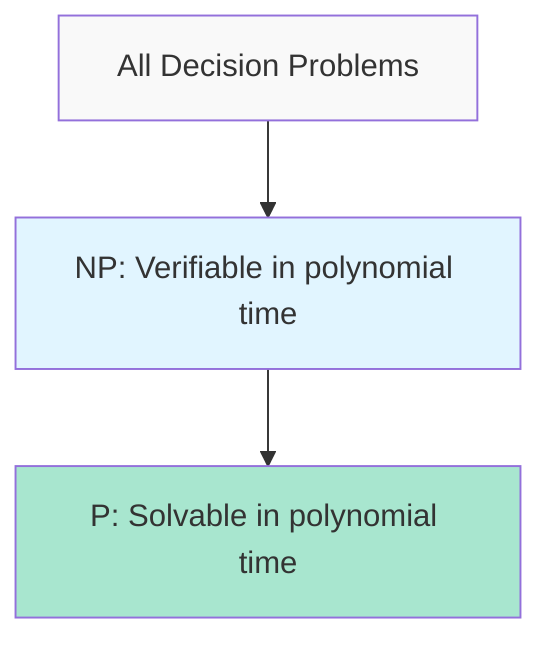
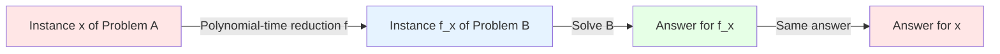
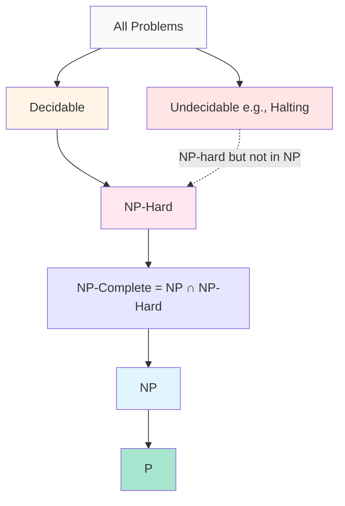
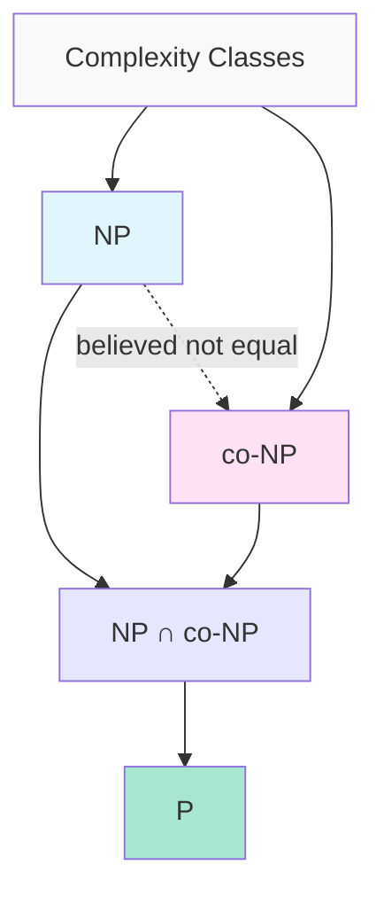

# Complexity Classes: P, NP, NP-Hard, NP-Complete, and co-NP

## Introduction

Computational complexity theory provides a formal framework for understanding the inherent difficulty of computational problems. At the heart of this theory lies the classification of problems into complexity classes based on the resources required to solve them. This classification has profound implications for algorithm design, theoretical computer science, and practical computing.

The P vs NP question, one of the seven Millennium Prize Problems with a $1 million reward, asks whether every problem whose solution can be quickly verified can also be quickly solved. This seemingly simple question has remained unanswered for over 50 years and represents one of the most fundamental open problems in mathematics and computer science.

## Decision Problems and Formal Languages

Before diving into complexity classes, we must precisely define what we mean by a computational problem. In complexity theory, we typically focus on **decision problems** - problems with yes/no answers.

### Decision Problems

A decision problem is a computational problem where the answer is either "yes" or "no". While this might seem restrictive, many optimization and search problems can be recast as decision problems.

**Examples:**
- **Optimization version**: Find the shortest path between two nodes in a graph
- **Decision version**: Is there a path between two nodes of length at most $k$?

- **Optimization version**: Find the maximum clique in a graph
- **Decision version**: Does the graph contain a clique of size at least $k$?

### Formal Languages

Formally, a decision problem can be represented as a language $L \subseteq \Sigma^*$, where $\Sigma$ is an alphabet and $\Sigma^*$ is the set of all finite strings over $\Sigma$. An instance $x$ of the problem is a "yes" instance if $x \in L$ and a "no" instance if $x \notin L$.

For example, the language for the satisfiability problem is:
$$\text{SAT} = \{ \langle \phi \rangle : \phi \text{ is a satisfiable Boolean formula}\}$$

## The Class P: Polynomial Time

### Definition

The complexity class **P** (Polynomial time) consists of all decision problems that can be solved by a deterministic Turing machine in polynomial time.

**Formally:**
$$P = \bigcup_{k \geq 1} \text{TIME}(n^k)$$

where $\text{TIME}(f(n))$ is the class of problems solvable in $O(f(n))$ time.

### Characteristics of P

Problems in P are considered "efficiently solvable" or "tractable" because:

1. **Closure properties**: P is closed under composition, polynomial-time reductions, and various other operations
2. **Robustness**: The definition of P is largely independent of the computational model (Turing machines, RAM model, etc.)
3. **Practical feasibility**: Polynomial-time algorithms are generally practical, especially for small exponents

### Examples of Problems in P

**Sorting**: Given an array of $n$ elements, sort them in non-decreasing order.
- **Algorithm**: Merge sort, quicksort (expected time)
- **Time complexity**: $O(n \log n)$

**Shortest Path**: Given a graph $G = (V, E)$ with edge weights and vertices $s, t$, find the shortest path from $s$ to $t$.
- **Algorithm**: Dijkstra's algorithm (for non-negative weights)
- **Time complexity**: $O((|V| + |E|) \log |V|)$ with binary heap

**Maximum Flow**: Given a flow network, find the maximum flow from source to sink.
- **Algorithm**: Edmonds-Karp algorithm
- **Time complexity**: $O(|V| \cdot |E|^2)$

**Linear Programming**: Given constraints $Ax \leq b$ and objective $c^T x$, find $x$ maximizing $c^T x$.
- **Algorithm**: Ellipsoid method, interior point methods
- **Time complexity**: Polynomial (though with large exponents)

## The Class NP: Nondeterministic Polynomial Time

### Definition

The complexity class **NP** (Nondeterministic Polynomial time) consists of all decision problems where a "yes" answer can be verified in polynomial time given an appropriate certificate (witness).

**Formally:**
$$NP = \bigcup_{k \geq 1} \text{NTIME}(n^k)$$

where $\text{NTIME}(f(n))$ is the class of problems solvable by a nondeterministic Turing machine in $O(f(n))$ time.

### Alternative Characterization: Verification

A problem is in NP if there exists a polynomial-time verifier $V$ and a polynomial $p$ such that:
- If $x \in L$, there exists a certificate $c$ with $|c| \leq p(|x|)$ such that $V(x, c) = $ "yes"
- If $x \notin L$, for all certificates $c$, $V(x, c) = $ "no"

### Examples of Problems in NP

**SAT (Boolean Satisfiability)**: Given a Boolean formula $\phi$, is there an assignment making $\phi$ true?
- **Certificate**: A satisfying assignment
- **Verification**: Evaluate $\phi$ under the assignment in $O(n)$ time

**Hamiltonian Cycle**: Does a graph $G$ have a cycle visiting each vertex exactly once?
- **Certificate**: A sequence of vertices forming such a cycle
- **Verification**: Check that consecutive vertices are connected and all vertices appear exactly once

**Subset Sum**: Given integers $S = \{a_1, \ldots, a_n\}$ and target $t$, is there a subset summing to $t$?
- **Certificate**: The subset $S' \subseteq S$
- **Verification**: Sum the elements of $S'$ and check if it equals $t$

### The Relationship P ⊆ NP

**Theorem**: $P \subseteq NP$

**Proof**: If a problem is in P, we can solve it in polynomial time without any certificate. Therefore, we can certainly verify a solution in polynomial time (ignoring the certificate). Thus, every problem in P is also in NP.

### The P vs NP Question

The central open question in complexity theory is:

**Does P = NP?**

In other words, can every problem whose solution can be quickly verified also be quickly solved?

**Implications if P = NP:**
- All NP problems would have efficient algorithms
- Cryptography as we know it would collapse
- Many optimization problems would become tractable
- Automated theorem proving would be practical

**Consensus**: Most computer scientists believe P ≠ NP, but no proof exists.

## NP-Completeness

### Definition

A problem $L$ is **NP-complete** if:
1. $L \in NP$ (the problem is in NP)
2. For every problem $L' \in NP$, there exists a polynomial-time reduction from $L'$ to $L$ (the problem is NP-hard)

NP-complete problems are the "hardest" problems in NP. If any NP-complete problem can be solved in polynomial time, then P = NP.

### Polynomial-Time Reductions

A problem $A$ polynomial-time reduces to problem $B$ (written $A \leq_p B$) if there exists a polynomial-time computable function $f$ such that:
$$x \in A \iff f(x) \in B$$

**Intuition**: If we have an algorithm for $B$, we can solve $A$ by:
1. Transforming instance $x$ of $A$ to instance $f(x)$ of $B$
2. Running the algorithm for $B$ on $f(x)$
3. Returning the same answer

### The Cook-Levin Theorem

**Theorem (Cook, 1971; Levin, 1973)**: SAT is NP-complete.

This was the first problem proven to be NP-complete and is the foundation for all other NP-completeness proofs.

**Proof Sketch**:
1. **SAT ∈ NP**: Given a satisfying assignment, verify it in polynomial time
2. **SAT is NP-hard**: For any problem $L \in NP$, construct a formula $\phi$ that is satisfiable iff the input is in $L$
   - Encode the computation of the polynomial-time verifier as a Boolean formula
   - The formula is satisfiable iff there exists an accepting computation

### Proving NP-Completeness

To prove a problem $B$ is NP-complete:
1. Show $B \in NP$ (usually straightforward - describe the certificate and verifier)
2. Show $B$ is NP-hard by reducing a known NP-complete problem $A$ to $B$

**Example Chain of Reductions**:
$$\text{SAT} \leq_p \text{3-SAT} \leq_p \text{Clique} \leq_p \text{Vertex Cover} \leq_p \text{Hamiltonian Cycle} \leq_p \text{TSP}$$

## NP-Hardness

### Definition

A problem $L$ is **NP-hard** if every problem in NP can be reduced to $L$ in polynomial time. Crucially, an NP-hard problem does not need to be in NP itself.

**Formally**: $L$ is NP-hard if for all $L' \in NP$, we have $L' \leq_p L$.

### NP-Hard but Not in NP

Some problems are NP-hard but not in NP because they are optimization problems (not decision problems) or because they are even harder than NP.

**Examples:**
- **Traveling Salesman Problem (optimization)**: Find the shortest tour visiting all cities
  - The decision version ("Is there a tour of length ≤ $k$?") is NP-complete
  - The optimization version is NP-hard but not in NP (it's not a decision problem)

- **Halting Problem**: Decide if a Turing machine halts on a given input
  - Undecidable (not even in NP)
  - NP-hard by reduction from any NP problem

## The Class co-NP

### Definition

The complexity class **co-NP** consists of all decision problems whose complements are in NP.

**Formally**: $L \in \text{co-NP} \iff \overline{L} \in NP$

where $\overline{L} = \Sigma^* \setminus L$ is the complement of $L$.

### Characterization

A problem is in co-NP if "no" answers can be efficiently verified. Equivalently, there exists a polynomial-time verifier $V$ such that:
- If $x \notin L$, there exists a certificate $c$ such that $V(x, c) = $ "no"
- If $x \in L$, for all certificates $c$, $V(x, c) \neq $ "no"

### Examples

**UNSAT**: Given a Boolean formula $\phi$, is $\phi$ unsatisfiable?
- **In co-NP**: If $\phi$ is unsatisfiable, there's no satisfying assignment (certificate for "no")
- **Complement of SAT**: SAT asks if $\phi$ is satisfiable

**Tautology**: Given a Boolean formula $\phi$, is $\phi$ true for all assignments?
- **In co-NP**: If $\phi$ is not a tautology, there's a falsifying assignment
- **Certificate**: An assignment making $\phi$ false

**Non-Hamiltonian**: Does a graph $G$ lack a Hamiltonian cycle?
- **In co-NP**: If there's no Hamiltonian cycle, we could verify this (though it's not obvious how)
- **Complement of Hamiltonian Cycle**

### Relationship Between NP and co-NP

**Key Questions:**
1. Is NP = co-NP?
2. Is NP ∩ co-NP = P?

**What We Know:**
- $P \subseteq NP \cap \text{co-NP}$ (problems in P have both certificates for "yes" and "no")
- If $NP = \text{co-NP}$, then the polynomial hierarchy collapses
- Most believe NP ≠ co-NP, but no proof exists

### Problems in NP ∩ co-NP

**Primality Testing**: Is a given number $n$ prime?
- **In NP**: Primes have certificates (though not obvious classically; Pratt certificates)
- **In co-NP**: Composite numbers have certificates (the factors)
- **In P**: AKS primality test (2002)

**Linear Programming**: Is a linear program feasible?
- **In NP**: A feasible solution is a certificate
- **In co-NP**: By duality, an infeasibility certificate exists
- **In P**: Ellipsoid method, interior point methods

## Complexity Class Hierarchy

### Summary of Relationships

$$P \subseteq NP \cap \text{co-NP} \subseteq NP$$
$$P \subseteq NP \cap \text{co-NP} \subseteq \text{co-NP}$$

**Known**:
- $P \subseteq NP$
- $P \subseteq \text{co-NP}$
- If $P = NP$, then $NP = \text{co-NP} = P$

**Unknown**:
- $P \stackrel{?}{=} NP$
- $NP \stackrel{?}{=} \text{co-NP}$
- $P \stackrel{?}{=} NP \cap \text{co-NP}$

### Practical Implications

**If a problem is NP-complete:**
- No known polynomial-time algorithm exists
- Unlikely to find one (unless P = NP)
- Focus on:
  - Approximation algorithms
  - Heuristics for typical cases
  - Exponential algorithms with good constants
  - Parameterized algorithms
  - Special case analysis

**If a problem is in P:**
- Efficient algorithm exists
- Focus on:
  - Improving the exponent
  - Practical optimizations
  - Parallelization

## Mathematical Foundations

### Time Complexity Classes

For a function $f: \mathbb{N} \to \mathbb{N}$:

**Deterministic time:**
$$\text{TIME}(f(n)) = \{L : L \text{ is decided by a TM in } O(f(n)) \text{ time}\}$$

**Nondeterministic time:**
$$\text{NTIME}(f(n)) = \{L : L \text{ is decided by an NTM in } O(f(n)) \text{ time}\}$$

**Polynomial hierarchy:**
$$P = \bigcup_{k \geq 1} \text{TIME}(n^k)$$
$$NP = \bigcup_{k \geq 1} \text{NTIME}(n^k)$$

### Certificate Complexity

For a problem in NP, let $|c|$ be the length of the certificate. Then:
$$|c| = O(p(n)) \text{ for some polynomial } p$$

The verifier runs in time:
$$O(q(n + |c|)) = O(q(n + p(n))) = O(r(n))$$
for some polynomials $q, p, r$.

### Reduction Transitivity

**Theorem**: Polynomial-time reductions are transitive.

If $A \leq_p B$ and $B \leq_p C$, then $A \leq_p C$.

**Proof**: Let $f$ be the reduction from $A$ to $B$ and $g$ be the reduction from $B$ to $C$. Then:
$$x \in A \iff f(x) \in B \iff g(f(x)) \in C$$

Since composition of polynomials is polynomial, $g \circ f$ is computable in polynomial time.

## Conclusion

Understanding complexity classes is fundamental to algorithm design and theoretical computer science. The classification of problems into P, NP, NP-complete, NP-hard, and co-NP provides a framework for:

1. **Assessing problem difficulty**: Knowing a problem is NP-complete tells us not to waste time searching for polynomial-time algorithms
2. **Designing appropriate solutions**: For NP-complete problems, we shift focus to approximation, heuristics, or parameterized algorithms
3. **Theoretical research**: The P vs NP question drives research in complexity theory, cryptography, and algorithm design

The journey from understanding these basic classes to mastering NP-completeness proofs is essential for any serious study of algorithms and computational complexity.
