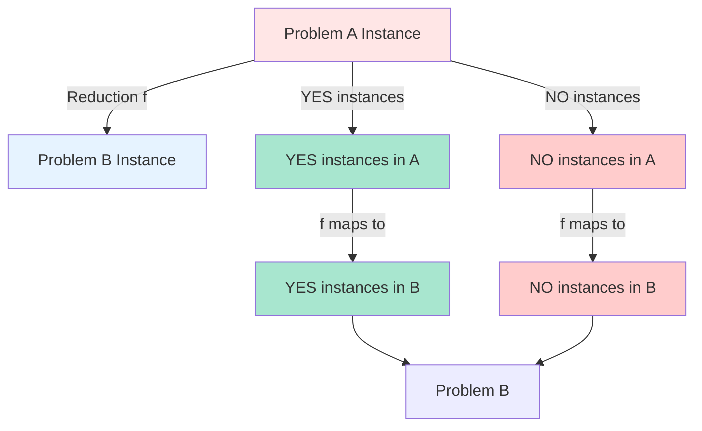

# Polynomial Reductions and the Cook-Levin Theorem

## Introduction

Polynomial-time reductions are the cornerstone of computational complexity theory, providing the mechanism by which we relate the difficulty of different computational problems. Through these reductions, we can establish hierarchies of problem difficulty and, most importantly, identify the hardest problems in NP through NP-completeness proofs.

The Cook-Levin theorem, independently proven by Stephen Cook and Leonid Levin in 1971-1973, represents one of the most significant achievements in theoretical computer science. It established that SAT (Boolean satisfiability) is NP-complete, opening the floodgates for thousands of subsequent NP-completeness results.

## Polynomial-Time Reductions

### Formal Definition

A language $A$ **polynomial-time many-one reduces** to a language $B$ (written $A \leq_p B$) if there exists a polynomial-time computable function $f: \Sigma^* \to \Sigma^*$ such that:

$$x \in A \iff f(x) \in B$$

for all $x \in \Sigma^*$.

The function $f$ is called a **polynomial-time reduction** or **Karp reduction** (named after Richard Karp).

### Properties of Polynomial Reductions

**Theorem (Transitivity)**: If $A \leq_p B$ and $B \leq_p C$, then $A \leq_p C$.

**Proof**: Let $f$ be a reduction from $A$ to $B$ (computable in time $p(n)$) and $g$ be a reduction from $B$ to $C$ (computable in time $q(n)$). Define $h(x) = g(f(x))$.

Time to compute $h$:
- Computing $f(x)$ takes $O(p(n))$ time, producing output of length at most $p(n)$
- Computing $g(f(x))$ takes $O(q(p(n)))$ time
- Total: $O(p(n) + q(p(n)))$, which is polynomial

Correctness:
$$x \in A \iff f(x) \in B \iff g(f(x)) \in C$$

Therefore, $h$ is a polynomial-time reduction from $A$ to $C$. $\square$

**Theorem (Complexity preservation)**: If $A \leq_p B$ and $B \in P$, then $A \in P$.

**Proof**: Given input $x$ for problem $A$:
1. Compute $f(x)$ in polynomial time (say $O(p(n))$)
2. Decide if $f(x) \in B$ in polynomial time (say $O(q(m))$ where $m = |f(x)|$)
3. Return the same answer

Total time: $O(p(n) + q(p(n)))$, which is polynomial. $\square$

**Corollary**: If $A$ is NP-complete, $A \leq_p B$, and $B \in NP$, then $B$ is NP-complete.

This corollary is the basis for most NP-completeness proofs.

### Reduction Strategies

When designing a reduction from problem $A$ to problem $B$, we must:

1. **Transform instances**: Map each instance of $A$ to an instance of $B$
2. **Preserve answers**: Ensure the transformation preserves yes/no answers
3. **Ensure efficiency**: Make the transformation computable in polynomial time
4. **Maintain size**: Keep the output size polynomially bounded



## The Cook-Levin Theorem

### Statement

**Theorem (Cook-Levin)**: SAT is NP-complete.

More precisely:
1. SAT $\in$ NP
2. For every language $L \in$ NP, $L \leq_p$ SAT

### Part 1: SAT ∈ NP

**Proof**: We must show that satisfiability can be verified in polynomial time.

**Certificate**: A truth assignment $\alpha: \{x_1, \ldots, x_n\} \to \{0, 1\}$

**Verifier**:
```
function VerifySAT(φ, α):
    for each variable x_i in φ:
        substitute x_i with α(x_i)

    evaluate φ

    if φ evaluates to true:
        return ACCEPT
    else:
        return REJECT
```

**Time complexity**: $O(|\phi|)$ - we visit each part of the formula once.

Therefore, SAT $\in$ NP. $\square$

### Part 2: Every Problem in NP Reduces to SAT

This is the profound part of the theorem. We must show that for any problem $L \in$ NP, we can construct a polynomial-time reduction to SAT.

**Setup**: Since $L \in$ NP, there exists:
- A polynomial-time verifier $V(x, c)$
- A polynomial $p$ such that certificates have length $|c| \leq p(|x|)$
- $V$ runs in time $q(n)$ for some polynomial $q$

We can assume $V$ is implemented as a Turing machine $M$.

**Goal**: Given input $x$, construct a Boolean formula $\phi_x$ such that:
$$x \in L \iff \phi_x \text{ is satisfiable}$$

**Construction**: The formula $\phi_x$ encodes the computation of $M$ on input $(x, c)$ for all possible certificates $c$.

#### Encoding the Turing Machine Computation

Let $M$ have:
- States $Q = \{q_0, q_1, \ldots, q_s\}$
- Tape alphabet $\Gamma = \{\gamma_0, \gamma_1, \ldots, \gamma_t\}$
- Input alphabet $\Sigma \subseteq \Gamma$
- Transition function $\delta: Q \times \Gamma \to Q \times \Gamma \times \{L, R\}$

For a computation taking at most $q(n)$ steps, we use variables:
- $Q_{i,j,k}$: True if at time $i$, position $j$ has state $q_k$
- $T_{i,j,k}$: True if at time $i$, position $j$ has symbol $\gamma_k$
- $H_{i,j}$: True if at time $i$, the head is at position $j$

#### Formula Construction

The formula $\phi_x$ is the conjunction of several constraints:

**1. Initial configuration**:
$$\phi_{\text{init}} = \bigwedge_{j=0}^{|x|} T_{0,j,x_j} \land H_{0,0} \land Q_{0,0,q_0}$$

This encodes that initially, the tape contains input $x$, the head is at position 0, and the machine is in start state $q_0$.

**2. Single state constraint**:
$$\phi_{\text{single-state}} = \bigwedge_{i,j} \left(\bigvee_{k} Q_{i,j,k}\right) \land \bigwedge_{k \neq k'} \neg(Q_{i,j,k} \land Q_{i,j,k'})$$

At most one state per cell per time (actually exactly zero or one, since only the head position has a state).

**3. Single symbol constraint**:
$$\phi_{\text{single-symbol}} = \bigwedge_{i,j} \left(\bigvee_{k} T_{i,j,k}\right) \land \bigwedge_{k \neq k'} \neg(T_{i,j,k} \land T_{i,j,k'})$$

Exactly one symbol per cell per time.

**4. Transition constraints**:
For each transition $\delta(q_a, \gamma_b) = (q_c, \gamma_d, D)$ where $D \in \{L, R\}$:

$$\phi_{\text{trans}} = \bigwedge_{i,j} (Q_{i,j,a} \land T_{i,j,b} \land H_{i,j}) \Rightarrow (Q_{i+1,j',c} \land T_{i+1,j,d} \land H_{i+1,j'})$$

where $j' = j-1$ if $D = L$ and $j' = j+1$ if $D = R$.

**5. Acceptance constraint**:
$$\phi_{\text{accept}} = \bigvee_{i,j} (Q_{i,j,q_{\text{accept}}})$$

The machine reaches an accepting state.

**Final formula**:
$$\phi_x = \phi_{\text{init}} \land \phi_{\text{single-state}} \land \phi_{\text{single-symbol}} \land \phi_{\text{trans}} \land \phi_{\text{accept}}$$

### Correctness

**Claim**: $x \in L \iff \phi_x$ is satisfiable.

**Proof ($\Rightarrow$)**:
If $x \in L$, there exists a certificate $c$ such that $V(x, c)$ accepts. This accepting computation of $M$ on $(x, c)$ provides a truth assignment to the variables $Q_{i,j,k}$, $T_{i,j,k}$, and $H_{i,j}$ that satisfies $\phi_x$.

**Proof ($\Leftarrow$)**:
If $\phi_x$ is satisfiable, the satisfying assignment corresponds to a valid computation of $M$ (by the transition constraints) that starts correctly (by $\phi_{\text{init}}$) and reaches an accepting state (by $\phi_{\text{accept}}$). The tape contents encode a certificate $c$ for which $V(x, c)$ accepts. Therefore, $x \in L$. $\square$

### Size and Time Analysis

**Number of variables**:
- $O(q(n) \cdot q(n) \cdot |Q|)$ variables of type $Q_{i,j,k}$
- $O(q(n) \cdot q(n) \cdot |\Gamma|)$ variables of type $T_{i,j,k}$
- $O(q(n) \cdot q(n))$ variables of type $H_{i,j}$
- Total: $O(q(n)^2)$ variables

**Formula size**:
Each constraint involves a constant number of variables, and there are $O(q(n)^2)$ constraints for each type. Therefore, $|\phi_x| = O(q(n)^2)$.

**Construction time**:
We can construct $\phi_x$ in time polynomial in $q(n)$, which is polynomial in $n$ since $q$ is polynomial.

Therefore, the reduction is computable in polynomial time. $\square$

## Classic Reductions

### 3-SAT is NP-Complete

**Theorem**: 3-SAT is NP-complete.

**Proof**:
1. **3-SAT $\in$ NP**: Same verifier as SAT
2. **SAT $\leq_p$ 3-SAT**: We reduce general SAT to 3-SAT

**Reduction**: Given a SAT formula $\phi$ in CNF, transform each clause to multiple 3-clauses.

**Case 1**: Clause has 1 literal $(l_1)$:
Create $(l_1 \lor y_1 \lor y_2) \land (l_1 \lor y_1 \lor \neg y_2) \land (l_1 \lor \neg y_1 \lor y_2) \land (l_1 \lor \neg y_1 \lor \neg y_2)$

where $y_1, y_2$ are fresh variables. This is equivalent to $l_1$.

**Case 2**: Clause has 2 literals $(l_1 \lor l_2)$:
Create $(l_1 \lor l_2 \lor y) \land (l_1 \lor l_2 \lor \neg y)$

where $y$ is a fresh variable. This is equivalent to $(l_1 \lor l_2)$.

**Case 3**: Clause has 3 literals $(l_1 \lor l_2 \lor l_3)$:
Keep as is.

**Case 4**: Clause has $k > 3$ literals $(l_1 \lor l_2 \lor \cdots \lor l_k)$:
Create:
$$(l_1 \lor l_2 \lor y_1) \land (\neg y_1 \lor l_3 \lor y_2) \land (\neg y_2 \lor l_4 \lor y_3) \land \cdots \land (\neg y_{k-3} \lor l_{k-1} \lor l_k)$$

where $y_1, \ldots, y_{k-3}$ are fresh variables.

**Correctness**: Each transformation preserves satisfiability. The original clause is satisfied iff at least one literal is true, which corresponds exactly to the new clauses being satisfied.

**Size**: Each original clause of size $k$ produces $O(k)$ new clauses, so the transformation is polynomial.

Therefore, SAT $\leq_p$ 3-SAT, and 3-SAT is NP-complete. $\square$

### Independent Set is NP-Complete

**Problem**: Given a graph $G = (V, E)$ and integer $k$, does $G$ have an independent set of size $k$?

(An independent set is a set of vertices with no edges between them)

**Theorem**: Independent Set is NP-complete.

**Proof**:
1. **Independent Set $\in$ NP**: Certificate is the set $S \subseteq V$. Verify $|S| = k$ and no edge connects vertices in $S$.

2. **3-SAT $\leq_p$ Independent Set**:

**Reduction**: Given a 3-SAT formula $\phi$ with $m$ clauses and $n$ variables, construct graph $G$ as follows:

- For each clause $C_i = (l_{i,1} \lor l_{i,2} \lor l_{i,3})$, create a triangle (3-clique) with vertices labeled by the literals
- Connect vertices labeled $x$ and $\neg x$ (conflicting literals) with edges

Set $k = m$ (one vertex per clause).

```mermaid
graph TD
    subgraph Clause 1: x1 ∨ x2 ∨ ¬x3
    A[x1] --- B[x2]
    B --- C[¬x3]
    C --- A
    end

    subgraph Clause 2: ¬x1 ∨ x3 ∨ x4
    D[¬x1] --- E[x3]
    E --- F[x4]
    F --- D
    end

    A -.conflicting.- D
    C -.conflicting.- E

    style A fill:#a8e6cf
    style C fill:#ffcccc
    style D fill:#ffcccc
    style E fill:#a8e6cf
```

**Correctness ($\Rightarrow$)**:
If $\phi$ is satisfiable, let $\alpha$ be a satisfying assignment. In each clause $C_i$, at least one literal is true under $\alpha$. Select one such literal's vertex from each triangle. These $m$ vertices form an independent set:
- No two are in the same triangle (selected one per triangle)
- No two are conflicting literals (both wouldn't be true under $\alpha$)

**Correctness ($\Leftarrow$)**:
If $G$ has an independent set $S$ of size $m$, then $S$ contains exactly one vertex from each triangle (since triangles are cliques). Set the corresponding literals to true (conflict edges ensure no contradiction). This satisfies $\phi$ since each clause has at least one true literal. $\square$

## Advanced Reduction Techniques

### Gadget-Based Reductions

Many reductions use **gadgets** - small substructures that simulate logical or arithmetic operations.

**Example: XOR gadget for Vertex Cover**

To force exactly one of $x$ or $y$ to be true (XOR), use:

```
    x --- z1 --- y
          |
          z2
```

In vertex cover, we need to cover all edges. Either:
- Select $x$ and $y$ (not XOR)
- Select $z_1$ and $z_2$ (forces neither $x$ nor $y$, or both)

By adding more constraints, we can build complex logical structures.

### Local Replacement

Some reductions work by **local replacement** - substituting parts of one instance with equivalent parts in another problem.

**Example**: Reducing Hamiltonian Path to Hamiltonian Cycle:

Given graph $G$, create $G'$ by:
1. Add new vertex $v$
2. Connect $v$ to all vertices in $G$

$G$ has a Hamiltonian path iff $G'$ has a Hamiltonian cycle (the cycle goes through the path and closes via $v$).

### Blow-Up Constructions

Some reductions create larger instances where structure is replicated or "blown up."

**Example**: In the 3-SAT to Clique reduction, we created triangles for each clause - a "blow-up" of the clause structure.

## Reduction Checklist

When designing a reduction from $A$ to $B$:

1. **Verify $B \in$ NP** (if proving NP-completeness)
2. **Choose a known NP-complete problem** $A$
3. **Design the transformation** $f: A \to B$:
   - Map instances of $A$ to instances of $B$
   - Ensure $f$ is computable in polynomial time
4. **Prove correctness** ($x \in A \iff f(x) \in B$):
   - **Forward direction** ($\Rightarrow$): If $x \in A$, show $f(x) \in B$
   - **Backward direction** ($\Leftarrow$): If $f(x) \in B$, show $x \in A$
5. **Analyze complexity**:
   - Size of $f(x)$ is polynomial in $|x|$
   - Time to compute $f(x)$ is polynomial

## Common Pitfalls

### Pitfall 1: Backward Reduction

**Wrong**: Reducing $B$ to $A$ when trying to prove $B$ is NP-complete.

**Correct**: Reduce a known NP-complete problem $A$ to $B$.

Remember: $A \leq_p B$ means "$B$ is at least as hard as $A$."

### Pitfall 2: Non-Polynomial Blow-Up

**Example**: Creating $2^n$ clauses from $n$ variables.

Even if each clause is created in constant time, the total construction time is exponential.

### Pitfall 3: Incomplete Correctness Proof

You must prove **both directions** of the equivalence $x \in A \iff f(x) \in B$.

Many proofs only show one direction.

## Conclusion

Polynomial-time reductions and the Cook-Levin theorem form the foundation of NP-completeness theory. Through these tools, we can:

1. **Classify problem difficulty**: Determine if a problem is likely intractable
2. **Build a complexity hierarchy**: Create chains of reductions showing relative difficulty
3. **Design algorithms strategically**: Focus efforts on approximation and heuristics for NP-complete problems

The art of designing reductions requires creativity, insight into problem structure, and careful analysis. Mastering these techniques is essential for theoretical computer science and practical algorithm design.
