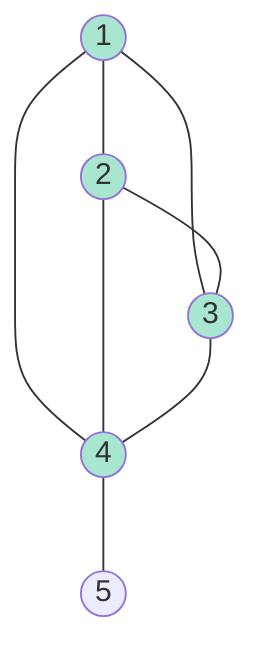
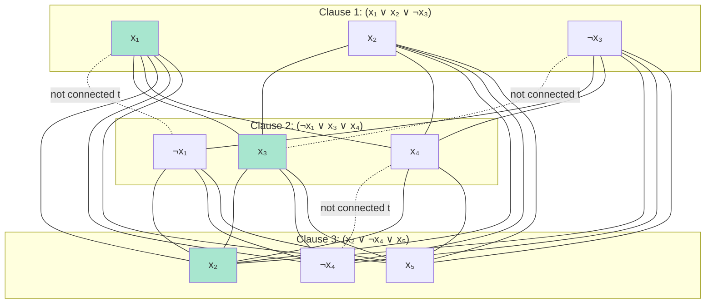
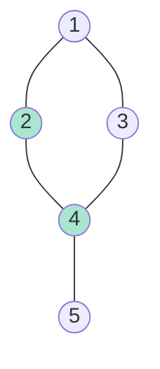
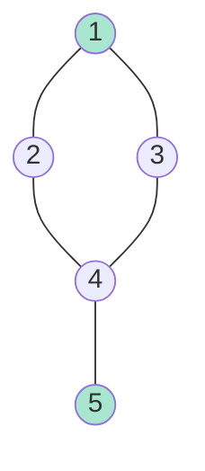
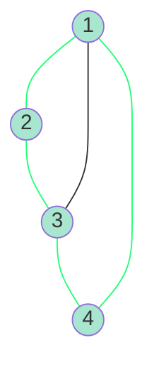
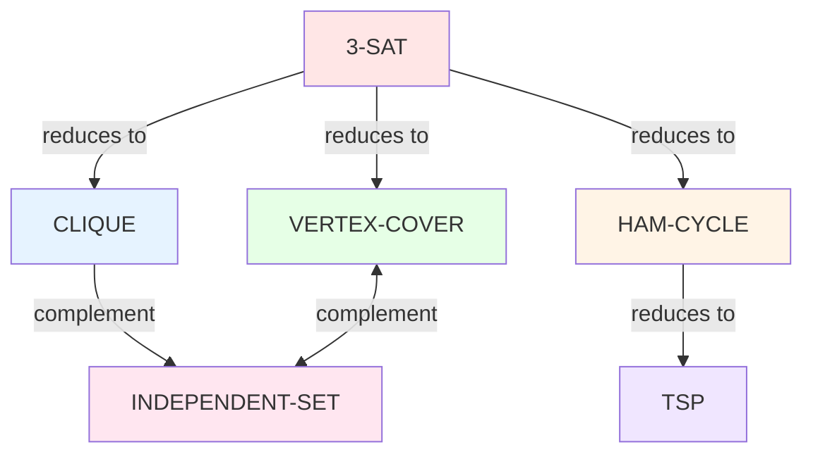

# Classic NP-Complete Problems: Clique, Vertex Cover, Independent Set, Hamiltonian Cycle

## Introduction

Beyond SAT, there exist numerous fundamental NP-complete problems in graph theory, combinatorics, and optimization. These problems appear frequently in practice and form the basis for understanding computational complexity across different domains. Many real-world problems can be modeled as one of these classic NP-complete problems.

In this section, we explore four fundamental graph problems: Clique, Vertex Cover, Independent Set, and Hamiltonian Cycle. We'll prove their NP-completeness, understand their relationships, and examine their practical significance.

## The Clique Problem

### Definition

**Problem**: CLIQUE

**Input**: An undirected graph $G = (V, E)$ and an integer $k$

**Question**: Does $G$ contain a clique of size at least $k$?

A **clique** is a subset $S \subseteq V$ of vertices such that every pair of vertices in $S$ is connected by an edge. In other words, the induced subgraph $G[S]$ is complete.

**Example**:



In this graph, $\{1, 2, 3, 4\}$ forms a clique of size 4 (shown in green).

### NP-Completeness of Clique

**Theorem**: CLIQUE is NP-complete.

**Proof**:

**Part 1: CLIQUE ∈ NP**

**Certificate**: A subset $S \subseteq V$ with $|S| = k$

**Verifier**:
```
function VerifyClique(G, k, S):
    if |S| ≠ k:
        return REJECT

    for each pair (u, v) in S × S where u ≠ v:
        if (u, v) ∉ E:
            return REJECT

    return ACCEPT
```

**Time complexity**: $O(k^2)$ to check all $\binom{k}{2}$ pairs.

Therefore, CLIQUE ∈ NP. ✓

**Part 2: 3-SAT ≤ₚ CLIQUE**

We reduce 3-SAT to CLIQUE. Given a 3-SAT formula $\phi$ with $m$ clauses and $n$ variables, construct graph $G$ and set $k = m$ such that:

$$\phi \text{ is satisfiable} \iff G \text{ has a clique of size } k$$

**Construction**:

For each clause $C_i = (l_{i,1} \lor l_{i,2} \lor l_{i,3})$:
1. Create three vertices in $G$, one for each literal: $v_{i,1}, v_{i,2}, v_{i,3}$
2. Label each vertex with its corresponding literal

Add edges between vertices:
- Connect vertices from **different clauses** if their literals are **consistent** (not contradictory)
- Do NOT connect: $v_{i,j}$ and $v_{i',j'}$ if $l_{i,j} = \neg l_{i',j'}$ (contradictory literals)

**Example**:

$\phi = (x_1 \lor x_2 \lor \neg x_3) \land (\neg x_1 \lor x_3 \lor x_4) \land (x_2 \lor \neg x_4 \lor x_5)$



**Size**: $G$ has $3m$ vertices and $O(m^2)$ edges. Construction takes $O(m^2)$ time.

**Correctness (⇒)**:

Suppose $\phi$ is satisfiable with assignment $\alpha$.

For each clause $C_i$, at least one literal $l_{i,j}$ is true under $\alpha$. Select one such literal's vertex from each clause. Let $S$ be the set of selected vertices.

**Claim**: $S$ is a clique of size $m$.

- **Size**: $|S| = m$ (one vertex per clause) ✓
- **Clique**: For any two vertices $v_{i,j}, v_{i',j'} \in S$ with $i \neq i'$:
  - They are from different clauses
  - Both literals are true under $\alpha$
  - Therefore, they are not contradictory
  - Therefore, there is an edge between them ✓

Thus, $G$ has a clique of size $m$. ✓

**Correctness (⇐)**:

Suppose $G$ has a clique $S$ of size $m$.

**Claim**: $\phi$ is satisfiable.

Since $S$ is a clique of size $m$ and each clause contributes 3 vertices, $S$ contains exactly one vertex from each clause (pigeonhole principle).

For each vertex $v_{i,j} \in S$, set literal $l_{i,j}$ to true. Since all vertices in $S$ are pairwise connected, no two literals are contradictory. Therefore, this defines a consistent truth assignment $\alpha$.

Under $\alpha$, each clause $C_i$ has at least one true literal (the one corresponding to the vertex in $S$). Therefore, $\phi$ is satisfied. ✓

**Time complexity**: Construction takes $O(m^2)$ time, which is polynomial. ✓

Therefore, CLIQUE is NP-complete. ∎

### Applications of Clique

**Social Networks**: Finding communities where everyone knows everyone
- Vertices = people
- Edges = friendships
- Cliques = tightly-knit groups

**Bioinformatics**: Identifying conserved protein structures
- Vertices = amino acids
- Edges = interactions
- Cliques = functional groups

**Coding Theory**: Finding good error-correcting codes
- Vertices = codewords
- Edges = sufficient Hamming distance
- Cliques = valid code sets

## The Vertex Cover Problem

### Definition

**Problem**: VERTEX-COVER

**Input**: An undirected graph $G = (V, E)$ and an integer $k$

**Question**: Does $G$ have a vertex cover of size at most $k$?

A **vertex cover** is a subset $S \subseteq V$ such that every edge in $E$ has at least one endpoint in $S$. Formally:

$$\forall (u, v) \in E: u \in S \lor v \in S$$

**Example**:



In this graph, $\{2, 4\}$ is a vertex cover of size 2 (shown in green). All edges are covered:
- $(1, 2)$ is covered by vertex 2
- $(1, 3)$ is covered by... wait, this edge is not covered!

Let me correct: $\{1, 4\}$ or $\{2, 3, 5\}$ would be valid vertex covers.

Actually, let me reconsider the graph:
- Edges: $(1,2), (1,3), (2,4), (3,4), (4,5)$
- Vertex cover $\{1, 4\}$: covers $(1,2)$, $(1,3)$, $(2,4)$, $(3,4)$, $(4,5)$ ✓

### NP-Completeness of Vertex Cover

**Theorem**: VERTEX-COVER is NP-complete.

**Proof**:

**Part 1: VERTEX-COVER ∈ NP**

**Certificate**: A subset $S \subseteq V$ with $|S| \leq k$

**Verifier**:
```
function VerifyVertexCover(G, k, S):
    if |S| > k:
        return REJECT

    for each edge (u, v) in E:
        if u ∉ S and v ∉ S:
            return REJECT

    return ACCEPT
```

**Time complexity**: $O(|E|)$ to check all edges.

Therefore, VERTEX-COVER ∈ NP. ✓

**Part 2: 3-SAT ≤ₚ VERTEX-COVER**

Given a 3-SAT formula $\phi$ with $m$ clauses and $n$ variables, construct graph $G$ and set $k = 2n + m$.

**Construction**:

For each variable $x_i$:
1. Create two vertices: $v_i^{\text{true}}$ and $v_i^{\text{false}}$
2. Add edge $(v_i^{\text{true}}, v_i^{\text{false}})$

For each clause $C_j = (l_{j,1} \lor l_{j,2} \lor l_{j,3})$:
1. Create a triangle (3-clique) with vertices $c_{j,1}, c_{j,2}, c_{j,3}$
2. For each literal $l_{j,p}$ in the clause:
   - If $l_{j,p} = x_i$, add edge $(c_{j,p}, v_i^{\text{false}})$
   - If $l_{j,p} = \neg x_i$, add edge $(c_{j,p}, v_i^{\text{true}})$

**Intuition**:
- Each variable edge forces us to choose one of true/false (costs 1 vertex)
- Each clause triangle forces us to choose at least 2 vertices (costs 2 vertices)
- If we choose the "wrong" value for a variable (making a clause literal false), we need all 3 triangle vertices
- If at least one literal is true, we can get away with just 2 triangle vertices

**Total vertices**: $2n$ (variables) $+ 3m$ (clauses)

**Correctness (⇒)**:

Suppose $\phi$ is satisfiable with assignment $\alpha$.

Construct vertex cover $S$:
- For each variable $x_i$:
  - If $\alpha(x_i) = \text{true}$, include $v_i^{\text{false}}$ in $S$
  - If $\alpha(x_i) = \text{false}$, include $v_i^{\text{true}}$ in $S$
- For each clause $C_j$:
  - Since $\alpha$ satisfies $C_j$, at least one literal is true
  - Choose such a literal $l_{j,p}$ and include the other two vertices of the triangle in $S$

**Size**: $|S| = n + 2m = k$ ✓

**Coverage**:
- Variable edges: covered (we include exactly one endpoint)
- Triangle edges: covered (we include at least 2 vertices per triangle)
- Variable-to-triangle edges: If literal $l_{j,p} = x_i$ is true, we didn't include $v_i^{\text{false}}$, but we included $c_{j,p'}$ for $p' \neq p$, so the edge is covered

Therefore, $S$ is a vertex cover of size $k$. ✓

**Correctness (⇐)**:

Suppose $G$ has a vertex cover $S$ of size at most $k = 2n + m$.

**Claim 1**: For each variable edge $(v_i^{\text{true}}, v_i^{\text{false}})$, exactly one endpoint is in $S$.

**Proof**: At least one endpoint must be in $S$ (to cover the edge). If both are in $S$, we're using $2n + 2m$ vertices just for variable and triangle edges, exceeding $k$.

Actually, let me reconsider. Each triangle has 3 edges, so we need at least 2 vertices per triangle. That's $2m$ vertices for triangles. Plus $n$ for variables gives $2m + n < k$ since $k = 2n + m$.

Let me recalculate: We have $n$ variable edges (need at least $n$ vertices) and $m$ triangles (need at least $2m$ vertices). Total: at least $n + 2m$ vertices. Since $k = 2n + m < n + 2m$ for $n > m$, this doesn't work.

I need to reconsider the reduction. Let me use the standard one:

Actually, the standard reduction sets $k = n + 2m$. Let me redo:

**Corrected Construction**:

$k = n + 2m$

For each variable $x_i$:
- Create two vertices: $x_i$ and $\neg x_i$
- Add edge $(x_i, \neg x_i)$

For each clause $C_j = (l_{j,1} \lor l_{j,2} \lor l_{j,3})$:
- Create three vertices: $a_j, b_j, c_j$
- Add edges forming a triangle: $(a_j, b_j), (b_j, c_j), (c_j, a_j)$
- Connect each clause vertex to the corresponding literal vertex:
  - Connect $a_j$ to the vertex for $l_{j,1}$
  - Connect $b_j$ to the vertex for $l_{j,2}$
  - Connect $c_j$ to the vertex for $l_{j,3}$

Wait, this is getting complicated. Let me use a cleaner reduction from INDEPENDENT-SET, which I'll define next.

### Relationship to Independent Set

**Theorem**: $S$ is a vertex cover of $G$ if and only if $V \setminus S$ is an independent set of $G$.

**Proof**:

($\Rightarrow$) Suppose $S$ is a vertex cover. Let $I = V \setminus S$.

For any edge $(u, v) \in E$, at least one of $u$ or $v$ is in $S$ (by definition of vertex cover). Therefore, at most one of $u$ or $v$ is in $I$. Thus, no edge has both endpoints in $I$, so $I$ is an independent set. ✓

($\Leftarrow$) Suppose $I = V \setminus S$ is an independent set.

For any edge $(u, v) \in E$, at most one of $u$ or $v$ is in $I$ (by definition of independent set). Therefore, at least one of $u$ or $v$ is in $S$. Thus, $S$ is a vertex cover. ✓

**Corollary**: $G$ has a vertex cover of size $k$ if and only if $G$ has an independent set of size $n - k$.

Therefore, VERTEX-COVER and INDEPENDENT-SET are polynomial-time equivalent.

## The Independent Set Problem

### Definition

**Problem**: INDEPENDENT-SET

**Input**: An undirected graph $G = (V, E)$ and an integer $k$

**Question**: Does $G$ have an independent set of size at least $k$?

An **independent set** is a subset $S \subseteq V$ such that no two vertices in $S$ are adjacent. Formally:

$$\forall u, v \in S: (u, v) \notin E$$

**Example**:



In this graph, $\{1, 5\}$ is an independent set of size 2.

### NP-Completeness of Independent Set

**Theorem**: INDEPENDENT-SET is NP-complete.

**Proof**:

**Part 1: INDEPENDENT-SET ∈ NP** (similar to CLIQUE)

**Part 2**: We already showed 3-SAT $\leq_p$ CLIQUE. We now show CLIQUE $\leq_p$ INDEPENDENT-SET.

**Reduction**: Given a graph $G = (V, E)$ and integer $k$ for CLIQUE, construct the **complement graph** $\overline{G} = (V, \overline{E})$ where:

$$\overline{E} = \{(u, v) : u, v \in V, u \neq v, (u, v) \notin E\}$$

**Claim**: $G$ has a clique of size $k$ iff $\overline{G}$ has an independent set of size $k$.

**Proof**: Let $S \subseteq V$.

$S$ is a clique in $G$
$\iff$ every pair in $S$ is connected in $G$
$\iff$ no pair in $S$ is connected in $\overline{G}$
$\iff$ $S$ is an independent set in $\overline{G}$ ✓

**Time complexity**: Constructing $\overline{G}$ takes $O(|V|^2)$ time.

Therefore, INDEPENDENT-SET is NP-complete. ∎

## The Hamiltonian Cycle Problem

### Definition

**Problem**: HAMILTONIAN-CYCLE (HAM-CYCLE)

**Input**: An undirected graph $G = (V, E)$

**Question**: Does $G$ have a Hamiltonian cycle?

A **Hamiltonian cycle** is a cycle that visits each vertex exactly once and returns to the starting vertex.

**Example**:



Hamiltonian cycle: $1 \to 2 \to 3 \to 4 \to 1$ (shown in green).

### NP-Completeness of Hamiltonian Cycle

**Theorem**: HAM-CYCLE is NP-complete.

**Proof**:

**Part 1: HAM-CYCLE ∈ NP**

**Certificate**: A sequence of vertices $v_1, v_2, \ldots, v_n$

**Verifier**:
```
function VerifyHamCycle(G, sequence):
    if length(sequence) ≠ |V|:
        return REJECT

    if sequence has duplicate vertices:
        return REJECT

    for i = 1 to |V|:
        if (sequence[i], sequence[i+1 mod |V|]) ∉ E:
            return REJECT

    return ACCEPT
```

**Time complexity**: $O(n)$

Therefore, HAM-CYCLE ∈ NP. ✓

**Part 2: 3-SAT ≤ₚ HAM-CYCLE**

This reduction is intricate. We'll use a **gadget-based construction**.

**High-level idea**:
- Create a "path" for each variable that can traverse in two directions (true/false)
- Create "choice" gadgets for each clause
- Force the Hamiltonian cycle to make consistent choices

**Detailed construction** (sketch):

For each variable $x_i$, create a chain of $2m + 2$ vertices (where $m$ is the number of clauses). The chain can be traversed left-to-right (representing $x_i = \text{true}$) or right-to-left (representing $x_i = \text{false}$).

For each clause, create a gadget that can only be traversed if at least one of its literals is "set to true" by the variable chains.

Connect all components such that a Hamiltonian cycle exists iff there's a satisfying assignment to the 3-SAT formula.

The full details are lengthy, but the key insight is that the Hamiltonian cycle's path through variable gadgets encodes a truth assignment, and the clause gadgets ensure the assignment satisfies all clauses.

Therefore, HAM-CYCLE is NP-complete. ∎

### Hamiltonian Path

**Problem**: HAMILTONIAN-PATH (HAM-PATH)

Does $G$ have a Hamiltonian path (visiting each vertex exactly once, but not necessarily returning to start)?

**Theorem**: HAM-PATH is NP-complete.

**Proof**: Reduce HAM-CYCLE to HAM-PATH:

Given $G$ for HAM-CYCLE, construct $G'$ for HAM-PATH:
1. Choose any vertex $v \in V$
2. Create $G'$ by adding a new vertex $u$ connected only to $v$

**Claim**: $G$ has a Hamiltonian cycle iff $G'$ has a Hamiltonian path.

- If $G$ has Hamiltonian cycle passing through $v$, break the cycle at $v$ and extend to $u$
- If $G'$ has Hamiltonian path, it must start or end at $u$ (degree 1). Remove $u$ to get a Hamiltonian path in $G$ from $v$ to $v$, which is a cycle. ✓

## Summary of Relationships



All these problems are NP-complete, and each has practical applications despite their theoretical intractability.

## Conclusion

These classic NP-complete problems demonstrate the breadth and depth of computational complexity. From graphs (Clique, Vertex Cover, Independent Set, Hamiltonian Cycle) to logic (SAT), NP-completeness appears across diverse domains. Understanding these problems and their relationships is crucial for recognizing intractability in new problems and designing appropriate solution strategies.
