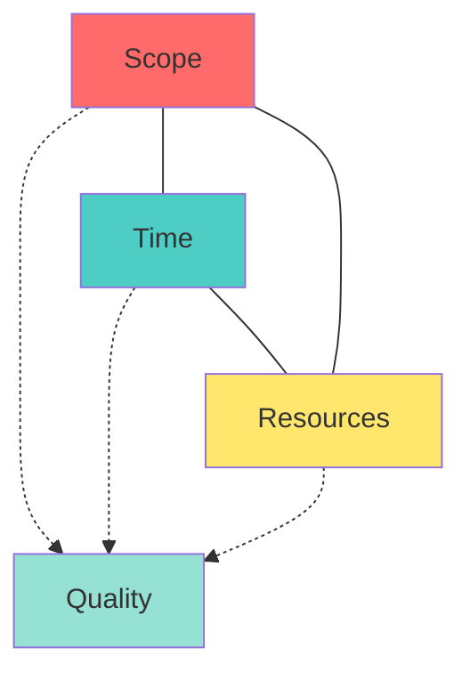
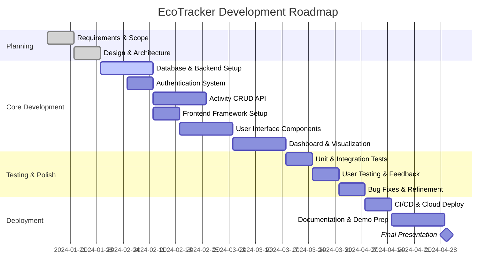

# Scope Definition

## Introduction

Scope definition is the process of establishing clear boundaries for your project—what's included, what's excluded, and what success looks like. It's the difference between a focused, achievable project and an endless pursuit of perfection that never ships. In software engineering, scope is your most valuable resource to manage; time and budget often follow from the scope you define.

For capstone projects, scope definition is particularly critical. You have limited time, limited resources, and typically work alone. An overly ambitious scope leads to a half-finished project, while too narrow a scope fails to demonstrate your capabilities. The art lies in defining a scope that's impressive yet achievable, with clear priorities and contingency plans.

## Learning Objectives

By the end of this lesson, you will be able to:

- Define project scope with clear inclusions and exclusions
- Create a Minimum Viable Product (MVP) definition
- Establish measurable success criteria
- Develop a feature roadmap with release planning
- Identify and manage scope boundaries
- Apply scope management techniques to prevent scope creep
- Create work breakdown structures (WBS)
- Communicate scope effectively to stakeholders

## Understanding Project Scope

### Scope Components

**Product Scope:**
What features and functionality the software will include:
- Core features (must-have)
- Secondary features (should-have)
- Enhancement features (could-have)
- Explicitly excluded features

**Project Scope:**
The work required to deliver the product:
- Development activities
- Testing and quality assurance
- Documentation
- Deployment and infrastructure setup
- Learning and research time
- Stakeholder communication

**Quality Scope:**
Standards and benchmarks the product must meet:
- Performance requirements
- Reliability standards
- Security requirements
- Usability benchmarks
- Code quality metrics

### The Scope Triangle



**Key Principle:** You can't have it all. If you:
- Expand scope → need more time or resources
- Reduce time → must reduce scope or add resources
- Limit resources → must reduce scope or extend time

For capstone projects, time and resources are fixed, so **scope is your primary control lever**.

## Minimum Viable Product (MVP)

### MVP Definition

The MVP is the smallest set of features that:
1. Solves the core problem
2. Delivers value to users
3. Can be built within your timeline
4. Demonstrates your technical capabilities
5. Can be tested and validated

**MVP is NOT:**
- A prototype or demo
- A reduced-quality version
- The first of many planned releases (unless you plan subsequent releases)
- Missing critical functionality

**MVP IS:**
- A complete, working solution to the core problem
- Production-quality for the included features
- Sufficient for evaluation and demonstration
- The foundation for potential future enhancements

### Identifying Your MVP

**Step 1: List all potential features**
Brainstorm everything the system could do without filtering.

**Step 2: Identify the core problem**
What is the single most important problem you're solving?

**Step 3: Determine minimum feature set**
What's the absolute minimum needed to solve that core problem?

**Step 4: Validate with users**
Would users get value from just these core features?

**Step 5: Estimate effort**
Can you build this in your available time?

**Step 6: Refine and finalize**
Adjust based on feasibility and impact.

### MVP Example: Task Management App

**Initial Feature List:**
- Create, edit, delete tasks
- Organize tasks in projects
- Set due dates and reminders
- Assign tasks to team members
- Task dependencies and subtasks
- Time tracking
- Gantt charts and visualizations
- File attachments
- Comments and discussion
- Mobile apps (iOS and Android)
- Email integration
- Third-party integrations (Slack, Google Calendar)
- Advanced reporting and analytics

**Core Problem:**
People need a simple way to track their personal tasks and stay organized.

**MVP Features (Final Scope):**
1. User authentication (email/password)
2. Create, edit, delete tasks
3. Mark tasks as complete/incomplete
4. Set due dates
5. Organize tasks in projects
6. Basic search functionality
7. Responsive web interface

**Explicitly Excluded from MVP:**
- Team collaboration features
- Mobile native apps
- File attachments
- Advanced visualizations
- Third-party integrations
- Time tracking

**Possible Future Enhancements:**
- Priority levels
- Task labels/tags
- Recurring tasks
- Mobile apps
- Collaboration features

## Scope Statement

### Writing a Comprehensive Scope Statement

```markdown
# Project Scope Statement: [Project Name]

## Project Overview
[2-3 sentence description of what the project is and why it exists]

## Objectives
1. [Objective 1 - specific, measurable goal]
2. [Objective 2]
3. [Objective 3]

## Deliverables
### Core Deliverables
- [Deliverable 1: description]
- [Deliverable 2: description]
- [Deliverable 3: description]

### Documentation Deliverables
- Technical documentation
- User documentation
- Source code with comments
- Final presentation/demo

## In-Scope Features
### Must-Have Features (MVP)
1. [Feature 1]
   - [Sub-feature 1a]
   - [Sub-feature 1b]
2. [Feature 2]
3. [Feature 3]

### Should-Have Features (If Time Permits)
1. [Feature 4]
2. [Feature 5]

## Out-of-Scope
Explicitly excluded from this project:
- [Excluded item 1]
- [Excluded item 2]
- [Excluded item 3]

## Success Criteria
The project is successful if:
1. [Criterion 1 - measurable]
2. [Criterion 2 - measurable]
3. [Criterion 3 - measurable]

## Assumptions
- [Assumption 1: e.g., "Users have reliable internet access"]
- [Assumption 2]
- [Assumption 3]

## Constraints
- Timeline: [Start date] to [End date] ([X] weeks)
- Budget: [Amount or "No budget"]
- Technology: [Required technologies or platforms]
- Resources: [Solo project or team, available tools]

## Risks and Mitigation
| Risk | Probability | Impact | Mitigation Strategy |
|------|-------------|--------|---------------------|
| [Risk 1] | Medium | High | [Strategy] |
| [Risk 2] | Low | Medium | [Strategy] |

## Acceptance Criteria
For the project to be accepted and considered complete:
- [ ] All MVP features implemented and working
- [ ] Test coverage of at least [X]%
- [ ] Documentation complete
- [ ] Successfully deployed to [environment]
- [ ] Demo presentation prepared
- [ ] Code reviewed by [advisor/peer]
```

### Example Scope Statement

```markdown
# Project Scope Statement: EcoTracker

## Project Overview
EcoTracker is a web application that helps individuals track and reduce their carbon footprint through daily activity logging and personalized recommendations.

## Objectives
1. Create a functional carbon footprint tracking system with at least 5 activity categories
2. Implement data visualization showing footprint trends over time
3. Deliver a responsive web application deployable to cloud platform
4. Achieve a System Usability Scale (SUS) score of at least 70 from test users

## Deliverables
### Core Deliverables
- Full-stack web application (React frontend, Node.js backend)
- PostgreSQL database with activity and user data
- RESTful API for data management
- Deployed application on Heroku or similar platform

### Documentation Deliverables
- README with setup instructions
- API documentation (OpenAPI/Swagger)
- User guide with screenshots
- Technical architecture document
- Final presentation slides and demo video

## In-Scope Features
### Must-Have Features (MVP)
1. User Management
   - Email/password registration and authentication
   - User profile with basic information
   - Password reset functionality

2. Activity Tracking
   - Log activities in 5 categories: transportation, energy, food, waste, purchases
   - Edit and delete logged activities
   - Default carbon emission factors for common activities

3. Data Visualization
   - Dashboard showing total carbon footprint
   - Line chart showing trend over time (daily, weekly, monthly views)
   - Breakdown by category (pie chart)

4. Recommendations
   - Display 3-5 personalized tips based on user's highest-impact categories
   - Static recommendation database

### Should-Have Features (If Time Permits)
1. Goal setting and progress tracking
2. Comparative statistics (user vs. national average)
3. Achievement badges
4. Export data as CSV

## Out-of-Scope
Explicitly excluded from this project:
- Mobile native applications
- Social features (sharing, friends, leaderboards)
- Real-time data from IoT devices
- Payment or subscription features
- Multi-language support
- Machine learning for custom predictions
- Integration with third-party services

## Success Criteria
The project is successful if:
1. All MVP features are implemented and functional
2. At least 5 real users successfully use the application and provide feedback
3. Application is deployed and accessible via public URL
4. Backend API response time is under 500ms for 95% of requests
5. Application works on Chrome, Firefox, Safari (desktop and mobile)
6. Test coverage exceeds 70% for critical paths
7. Successfully presents a 15-minute demo to evaluation committee

## Assumptions
- Users have access to desktop or mobile web browsers
- Users are willing to manually log activities
- Standard carbon emission factors are acceptable for calculations
- Users are comfortable with English-language interface

## Constraints
- Timeline: January 15 - April 30 (15 weeks)
- Budget: $0 (using free tiers of cloud services)
- Technology: Must use TypeScript, React, Node.js, PostgreSQL
- Resources: Solo project, 15-20 hours per week
- Must comply with academic integrity policies

## Risks and Mitigation
| Risk | Probability | Impact | Mitigation Strategy |
|------|-------------|--------|---------------------|
| Difficulty finding emission data | Medium | High | Start with simplified model, curate reliable sources early |
| Cloud service costs exceed free tier | Low | Medium | Monitor usage, have local deployment backup plan |
| Complexity of data visualization | Medium | Medium | Use established library (Chart.js), start simple |
| Insufficient user testing participants | Medium | Low | Recruit early, use university networks, offer incentives |
| Time overrun on authentication | Low | High | Use established library (Passport.js), allocate 1 week max |

## Acceptance Criteria
For the project to be accepted and considered complete:
- [x] All MVP features implemented and working
- [x] Test coverage of at least 70%
- [x] API documentation complete
- [x] User guide with screenshots complete
- [x] Successfully deployed to cloud platform with public URL
- [x] Positive feedback from at least 3 test users
- [x] 15-minute demo presentation prepared
- [x] Code reviewed by advisor
- [x] Source code submitted to GitHub with proper documentation
```

## Work Breakdown Structure (WBS)

### Creating a WBS

The WBS decomposes your project into manageable work packages:

```mermaid
graph TD
    A[EcoTracker Project] --> B[Planning]
    A --> C[Backend Development]
    A --> D[Frontend Development]
    A --> E[Testing]
    A --> F[Deployment]
    A --> G[Documentation]

    C --> C1[Database Schema]
    C --> C2[Authentication API]
    C --> C3[Activity API]
    C --> C4[Analytics API]

    D --> D1[Component Structure]
    D --> D2[Authentication Pages]
    D --> D3[Dashboard]
    D --> D4[Activity Logging]
    D --> D5[Data Visualization]

    E --> E1[Unit Tests]
    E --> E2[Integration Tests]
    E --> E3[User Testing]

    F --> F1[CI/CD Setup]
    F --> F2[Production Deploy]
    F --> F3[Monitoring Setup]

    G --> G1[API Docs]
    G --> G2[User Guide]
    G --> G3[README]
```



### WBS Best Practices

**Decomposition Guidelines:**
- Break down until tasks are 4-40 hours of work
- Use verb-noun format (e.g., "Design database schema")
- Ensure each package is independently assignable
- Cover 100% of scope
- Avoid overlap between packages

**Organizational Approaches:**
- By deliverable (frontend, backend, database)
- By feature (user auth, activity tracking, visualization)
- By phase (design, development, testing, deployment)
- Hybrid approach often works best

## Feature Prioritization and Roadmap

### Three-Tier Prioritization

**Tier 1: Critical (MVP)**
- Cannot launch without these
- Core value proposition
- Most risky or time-consuming features
- Dependencies for other features

**Tier 2: Important (Post-MVP)**
- Significantly enhance value
- Can be added incrementally
- Improve user experience
- Competitive differentiators

**Tier 3: Nice-to-Have (Future)**
- Polish and refinement
- Edge cases and conveniences
- Experimental features
- Require significant additional work

### Development Roadmap



### Release Planning

**Version 1.0 (MVP) - April 30:**
- User authentication
- Activity logging (5 categories)
- Basic visualization (charts)
- Core recommendations

**Version 1.1 (If Time Allows) - TBD:**
- Goal setting
- Achievement system
- Enhanced visualizations
- Export functionality

**Version 2.0 (Future) - Out of Scope:**
- Social features
- Mobile apps
- IoT integration
- Machine learning predictions

## Managing Scope Boundaries

### Scope Creep Prevention

**Recognition:**
Scope creep occurs when:
- "Quick additions" accumulate
- Requirements change without formal evaluation
- "While we're at it..." features get added
- Nice-to-haves become must-haves
- Stakeholder requests are automatically accepted

**Prevention Strategies:**

**1. Formal Change Control:**
Any scope change must go through:
- Written change request
- Impact analysis (time, dependencies)
- Formal approval decision
- Documentation update
- Schedule adjustment

**2. Scope Gate Questions:**
Before adding anything, ask:
- Is this essential for MVP?
- What's the cost in time and complexity?
- What will we remove to accommodate this?
- Can this wait for a future version?
- Does this serve the core objective?

**3. Parking Lot:**
Maintain a "Future Features" list for good ideas that are out of scope:
- Validates the idea without committing to it
- Prevents forgetting good suggestions
- Defers decision to appropriate time
- Allows focus on current scope

**4. Reference the Scope Statement:**
When pressured to add features:
- Point to the documented scope
- Review success criteria together
- Emphasize fixed timeline
- Offer trade-offs if necessary

### Scope Baseline

Establish a scope baseline after initial approval:

**What to Baseline:**
- Scope statement
- Requirements document
- WBS
- Success criteria
- Timeline

**Version Control:**
- Store baseline documents
- Track all changes
- Maintain change log
- Compare current vs. baseline regularly

**Change Impact Analysis Template:**
```markdown
## Scope Change Request #[Number]

**Requested By:** [Name]
**Date:** [Date]

**Proposed Change:**
[Description of requested change]

**Justification:**
[Why is this needed?]

**Impact Analysis:**
- **Schedule Impact:** +[X] days
- **Features Affected:** [List]
- **Dependencies:** [List]
- **Risks:** [List]

**Alternatives Considered:**
1. [Alternative 1]
2. [Alternative 2]

**Recommendation:**
[ ] Approve and implement
[ ] Defer to future version
[ ] Reject

**Trade-offs:**
If approved, we will defer: [Feature to remove/delay]

**Decision:**
[Approved/Rejected]
**Date:** [Date]
**Approver:** [Name]
```

## Communicating Scope

### Stakeholder Communication

**Initial Scope Presentation:**
1. Present scope statement document
2. Walk through MVP features with examples/mockups
3. Explicitly review out-of-scope items
4. Discuss success criteria
5. Address questions and concerns
6. Obtain formal approval

**Ongoing Communication:**
- Weekly status updates referencing scope
- Highlight completed scope items
- Flag scope risks early
- Discuss potential scope adjustments proactively
- Celebrate milestone completions

### Managing Stakeholder Expectations

**When stakeholders request additions:**

**1. Acknowledge:**
"That's an interesting idea, let me understand it better."

**2. Clarify:**
"Help me understand why this is important and what problem it solves."

**3. Document:**
"Let me add this to our ideas list for consideration."

**4. Analyze:**
"Let me assess the impact on our timeline and current scope."

**5. Present Trade-offs:**
"To add this, we would need to either:
- Extend the deadline by 2 weeks, or
- Remove [existing feature], or
- Defer this to a future version"

**6. Decide Together:**
"Given these trade-offs, what would you recommend?"

## Scope Definition Checklist

### Initial Scope Definition
- [ ] Core problem clearly identified
- [ ] MVP feature set defined
- [ ] Out-of-scope items explicitly listed
- [ ] Success criteria established and measurable
- [ ] Work breakdown structure created
- [ ] Dependencies identified
- [ ] Assumptions documented
- [ ] Constraints acknowledged
- [ ] Risks assessed
- [ ] Timeline aligned with scope

### Scope Documentation
- [ ] Scope statement written and reviewed
- [ ] Requirements linked to scope
- [ ] Stakeholders reviewed and approved
- [ ] Baseline version saved
- [ ] Change control process established

### Ongoing Scope Management
- [ ] Regular scope reviews scheduled
- [ ] Change requests formally evaluated
- [ ] Scope progress tracked
- [ ] Parking lot maintained for future ideas
- [ ] Stakeholders kept informed of scope status

## Common Scope Pitfalls

### Over-Scoping

**Symptoms:**
- Feature list that grows constantly
- No clear prioritization
- Timeline seems impossible
- Stress about completing everything

**Solutions:**
- Ruthlessly prioritize to MVP only
- Apply 80/20 rule (20% of features provide 80% of value)
- Set hard deadlines for scope finalization
- Use time-boxing to limit scope naturally

### Under-Scoping

**Symptoms:**
- Project seems too simple
- Limited technical challenge
- Insufficient to demonstrate capabilities
- Could be completed in a few days

**Solutions:**
- Add quality requirements (performance, security)
- Increase depth in fewer areas rather than breadth
- Add architectural complexity
- Include comprehensive testing and documentation

### Vague Scope

**Symptoms:**
- Difficulty explaining what project does
- Uncertain what "done" looks like
- Disagreement about what's included
- Scope interpreted differently by different people

**Solutions:**
- Write specific, concrete feature descriptions
- Create mockups and examples
- Define measurable success criteria
- Get explicit stakeholder agreement

### Scope Without Constraints

**Symptoms:**
- No explicit timeline
- No resource limitations
- No clear boundaries
- "See how it goes" mentality

**Solutions:**
- Set hard deadlines
- Define resource limits
- Establish must-have vs. nice-to-have
- Create forcing functions for decisions

## Summary

Scope definition is the foundation of successful project delivery. It establishes what you will build, what success looks like, and what's explicitly excluded. A well-defined scope balances ambition with achievability, demonstrating your capabilities while remaining realistic about constraints.

The MVP approach is central to effective scope definition. By identifying the minimum feature set that delivers value, you ensure you have something complete and demonstrable, even if time runs short. Everything beyond the MVP is bonus, not baseline.

Scope management is an ongoing discipline. Throughout your project, you'll face pressure to add features, change direction, or expand goals. A clear scope statement, formal change control process, and disciplined prioritization will help you maintain focus and deliver a complete, polished product.

Remember: shipping a complete, well-executed MVP is infinitely more valuable than an ambitious but unfinished vision. Define your scope wisely, protect it zealously, and execute it excellently.

## Additional Resources

- "The Lean Startup" by Eric Ries - MVP methodology
- PMBOK Guide (Project Management Body of Knowledge) - scope management
- "Scrum: The Art of Doing Twice the Work in Half the Time" - iterative scope
- MoSCoW prioritization technique
- Kanban boards for scope visualization (Trello, Jira)
- Product roadmap tools (ProductPlan, Aha!)
