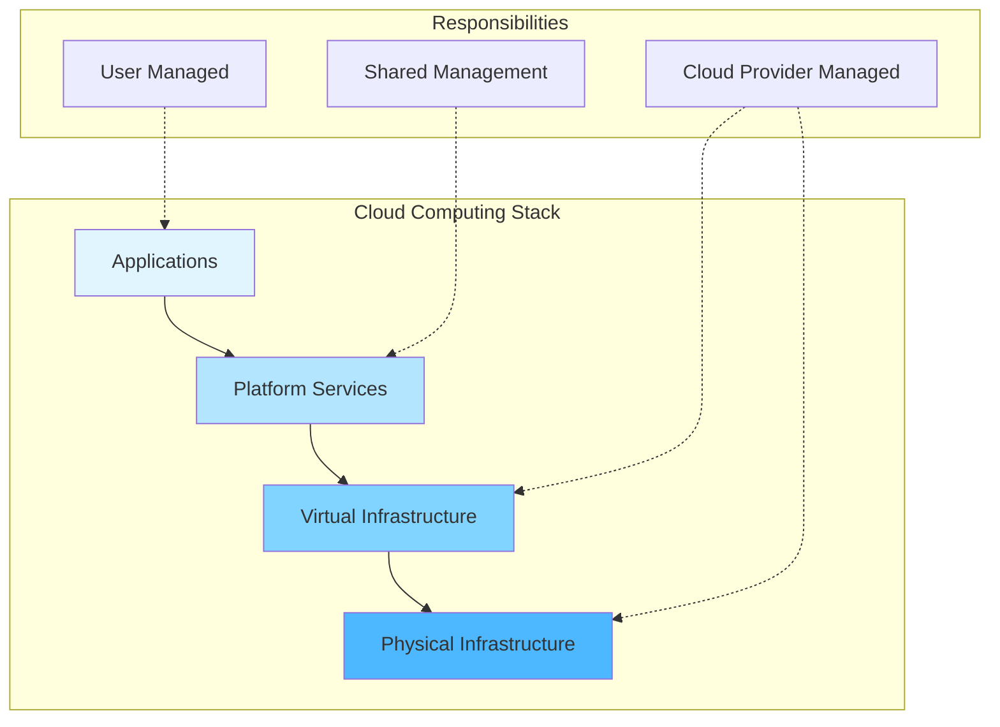

# Introduction to Cloud Computing

## What is Cloud Computing?

Cloud computing represents a fundamental shift in how organizations consume and deliver computing resources. Rather than owning and maintaining physical infrastructure, organizations access computing resources on-demand over the internet, paying only for what they use. This transformation has revolutionized IT operations, enabling unprecedented agility, scalability, and cost efficiency.

At its core, cloud computing is the delivery of computing services including servers, storage, databases, networking, software, analytics, and intelligence over the internet ("the cloud"). These services enable faster innovation, flexible resources, and economies of scale. Organizations typically pay only for cloud services they use, helping lower operating costs, run infrastructure more efficiently, and scale as business needs change.

## The Evolution of Computing Models

Understanding cloud computing requires context about how computing models have evolved:

### 1. Mainframe Era (1960s-1970s)

The mainframe era represented centralized computing where large, expensive computers served multiple users through terminals. Users accessed computing resources through time-sharing, but scalability was limited and costs were prohibitive for most organizations. These systems required significant capital investment and specialized facilities with precise environmental controls.

### 2. Client-Server Era (1980s-1990s)

The client-server model distributed computing between client devices and dedicated servers. This architecture improved resource utilization and user experience but introduced management complexity. Organizations built data centers with multiple servers, creating challenges around capacity planning, hardware maintenance, and infrastructure costs.

### 3. Virtualization Era (2000s)

Server virtualization revolutionized infrastructure utilization by allowing multiple virtual machines to run on single physical servers. This technology improved hardware efficiency, reduced costs, and enabled better disaster recovery. However, organizations still owned and managed the underlying infrastructure.

### 4. Cloud Era (2010s-Present)

Cloud computing abstracts infrastructure ownership entirely. Organizations consume resources as services without managing underlying hardware. This model provides unprecedented flexibility, global reach, and the ability to scale instantly based on demand.

## NIST Definition of Cloud Computing

The National Institute of Standards and Technology (NIST) provides the industry-standard definition of cloud computing. According to NIST Special Publication 800-145, cloud computing is "a model for enabling ubiquitous, convenient, on-demand network access to a shared pool of configurable computing resources that can be rapidly provisioned and released with minimal management effort or service provider interaction."

This definition emphasizes several critical aspects:

**Ubiquitous Access**: Resources are available anywhere with network connectivity, supporting remote work and global operations.

**On-Demand Self-Service**: Users provision resources automatically without requiring human interaction with service providers, enabling agility and rapid deployment.

**Shared Resources**: Multiple customers share a pool of resources, improving efficiency and reducing costs through economies of scale.

**Rapid Provisioning**: Resources can be scaled up or down quickly, often automatically, responding to changing demands.

**Minimal Management**: Service providers handle infrastructure management, allowing customers to focus on applications and business logic.

## Five Essential Characteristics

The NIST definition identifies five essential characteristics that define cloud computing:

### 1. On-Demand Self-Service

Consumers can unilaterally provision computing capabilities such as server time and network storage automatically as needed without requiring human interaction with each service provider. This characteristic fundamentally changes how organizations consume IT resources.

In traditional IT environments, provisioning a new server might take weeks, requiring purchase approvals, hardware ordering, physical installation, and configuration. Cloud computing reduces this to minutes or seconds through self-service portals and APIs. Users authenticate to a cloud console, select desired resources, configure parameters, and deploy instantly.

Self-service extends beyond simple provisioning to include:

- **Automated scaling**: Applications automatically request additional resources during peak demand
- **Self-healing**: Systems detect failures and automatically provision replacement resources
- **Configuration management**: Infrastructure is defined as code, enabling version control and reproducible deployments
- **Cost management**: Users monitor spending and set budget alerts without provider intervention

### 2. Broad Network Access

Capabilities are available over the network and accessed through standard mechanisms that promote use by heterogeneous client platforms including mobile phones, tablets, laptops, and workstations. This ubiquitous access enables new work patterns and global collaboration.

Cloud resources are accessible from anywhere with internet connectivity using standard protocols like HTTPS, SSH, and RDP. This accessibility enables:

- **Remote work**: Employees access corporate resources from anywhere
- **Mobile applications**: Apps connect to cloud backends regardless of location
- **Global collaboration**: Teams across time zones work on shared resources
- **Disaster recovery**: Systems remain accessible even if local infrastructure fails

Network access includes sophisticated features like:

- **Content delivery networks (CDNs)**: Distribute content globally for low-latency access
- **Edge computing**: Process data closer to users for improved performance
- **Software-defined networking**: Programmatically configure network topology
- **Global load balancing**: Route traffic to optimal endpoints based on location and health

### 3. Resource Pooling

The provider's computing resources are pooled to serve multiple consumers using a multi-tenant model, with different physical and virtual resources dynamically assigned and reassigned according to consumer demand. Customers generally have no control or knowledge over the exact location of provided resources but may be able to specify location at a higher level of abstraction.

Multi-tenancy enables cloud providers to achieve economies of scale while maintaining isolation between customers. Key aspects include:

**Physical Resource Sharing**: Multiple customers' workloads run on shared hardware. Hypervisors or containers provide isolation, ensuring one customer cannot access another's data or consume excessive resources.

**Dynamic Allocation**: Resources move between customers based on demand. If one customer scales down, those resources become available to others, maximizing utilization.

**Location Independence**: Customers typically specify regions rather than specific data centers. Providers optimize resource placement based on capacity, cost, and performance goals.

**Statistical Multiplexing**: Providers over-provision resources knowing that not all customers will use maximum capacity simultaneously, similar to how airlines oversell seats knowing some passengers won't show up.

### 4. Rapid Elasticity

Capabilities can be elastically provisioned and released, in some cases automatically, to scale rapidly outward and inward commensurate with demand. To the consumer, the capabilities available for provisioning often appear to be unlimited and can be appropriated in any quantity at any time.

Elasticity distinguishes cloud computing from traditional infrastructure. Organizations no longer over-provision for peak capacity that sits idle most of the time, nor under-provision and risk outages during unexpected spikes.

**Vertical Scaling (Scaling Up/Down)**: Increase or decrease the size of individual resources. For example, upgrading a database from 4 CPU cores to 16 cores to handle increased query load. Vertical scaling typically has limits based on the largest instance sizes available.

**Horizontal Scaling (Scaling Out/In)**: Add or remove resource instances. For example, increasing web server count from 3 to 30 during a traffic surge. Horizontal scaling can theoretically scale indefinitely, limited only by application architecture and budget.

**Auto-scaling**: Automatically adjust resource levels based on metrics like CPU utilization, request rate, or custom application metrics. Auto-scaling policies define thresholds and scaling actions, enabling systems to respond to demand changes without human intervention.

**Scheduled Scaling**: Pre-emptively adjust capacity based on known patterns. For example, e-commerce sites scale up before known sales events, then scale down afterward.

### 5. Measured Service

Cloud systems automatically control and optimize resource use by leveraging a metering capability at some level of abstraction appropriate to the type of service. Resource usage can be monitored, controlled, and reported, providing transparency for both the provider and consumer of the utilized service.

Measured service enables the pay-per-use model and provides visibility into consumption patterns. Key aspects include:

**Granular Metering**: Providers measure specific resource consumption including:
- Compute: CPU-hours, memory-hours, instance-hours
- Storage: Gigabyte-months, IOPS, data transfer
- Network: Bandwidth, requests, data processed
- Specialized services: API calls, database queries, function executions

**Real-time Monitoring**: Customers view current resource consumption and costs through dashboards and APIs, enabling proactive management and cost optimization.

**Cost Allocation**: Organizations tag resources and allocate costs to departments, projects, or environments, providing visibility into spending and enabling chargeback or showback models.

**Usage-based Billing**: Providers charge based on actual consumption rather than flat fees, aligning costs with value. Some services bill by the second, providing extremely granular pricing.

**Capacity Planning**: Historical usage data informs future capacity decisions, helping organizations right-size resources and forecast costs.

## The Cloud Computing Stack

Cloud computing organizes resources into layers, with each layer building on those below it. Understanding this stack is crucial for architecting cloud solutions:

**Physical Infrastructure**: The foundation includes data centers, servers, storage arrays, and network equipment. Cloud providers manage physical security, power, cooling, and hardware maintenance. Customers never directly interact with this layer.

**Virtual Infrastructure**: Virtualization abstracts physical resources into logical units. Hypervisors create virtual machines, software-defined networking virtualizes network functions, and storage virtualization pools disk resources. This layer provides the fundamental building blocks customers consume.

**Platform Services**: Managed services provide higher-level functionality without requiring infrastructure management. Examples include managed databases, message queues, caching services, and authentication systems. These services handle operational concerns like patching, backups, and high availability.

**Applications**: Custom business applications, SaaS offerings, and user-facing services sit atop the stack. This layer focuses on business logic and user experience rather than infrastructure concerns.

## Benefits of Cloud Computing

Cloud computing delivers numerous benefits that have driven widespread adoption across industries:

### Cost Efficiency

Cloud computing transforms capital expenses (CapEx) into operational expenses (OpEx). Instead of purchasing servers, networking equipment, and data center space upfront, organizations pay for resources as they consume them. This shift provides several financial advantages:

**Elimination of Upfront Costs**: No need to invest millions in hardware before launching services. Organizations start small and scale based on success.

**Pay-per-Use Pricing**: Charges align directly with consumption. Idle resources can be shut down, eliminating waste common in traditional data centers where capacity sits unused.

**Reduced Operational Costs**: Cloud providers manage infrastructure, reducing staffing needs for hardware maintenance, security, and data center operations. Organizations redirect resources toward innovation rather than infrastructure management.

**Economies of Scale**: Providers achieve lower per-unit costs through massive scale, savings passed to customers through competitive pricing.

### Agility and Speed

Cloud computing dramatically reduces time from idea to implementation. Traditional infrastructure projects might take months from conception to deployment, involving procurement, installation, and configuration. Cloud resources are available in minutes, accelerating innovation cycles.

**Rapid Experimentation**: Teams quickly test hypotheses without lengthy procurement processes. If experiments fail, resources are decommissioned without sunk costs.

**Faster Time to Market**: Applications deploy globally in hours rather than months, providing competitive advantages in fast-moving markets.

**Continuous Delivery**: Cloud-native tools support automated testing, deployment, and rollback, enabling organizations to ship features multiple times daily.

### Global Reach

Major cloud providers operate data centers worldwide, enabling organizations to deploy applications near users regardless of geographic location. This global infrastructure provides:

**Reduced Latency**: Applications respond faster when running close to users. Cloud providers offer regions on every continent, allowing sub-100ms response times globally.

**Regulatory Compliance**: Data residency requirements vary by jurisdiction. Cloud providers offer region selection, ensuring data stays within required boundaries.

**Disaster Recovery**: Geographic distribution enables robust disaster recovery strategies. Applications automatically fail over to healthy regions if one becomes unavailable.

**Market Expansion**: Organizations enter new markets without establishing local data centers, reducing barriers to global growth.

### Reliability and Availability

Cloud providers invest heavily in reliability, offering service level agreements (SLAs) guaranteeing uptime percentages that would be prohibitively expensive for individual organizations to achieve.

**Redundancy**: Multiple availability zones within regions protect against data center failures. Resources automatically distribute across zones for high availability.

**Automated Failover**: Systems detect failures and reroute traffic to healthy resources without manual intervention.

**Backup and Recovery**: Built-in backup services protect against data loss, with geographic replication ensuring disaster recovery capabilities.

**Monitoring and Alerting**: Sophisticated monitoring detects issues before they impact users, enabling proactive responses.

### Security

While cloud security requires careful configuration, providers invest heavily in security measures exceeding what most organizations can implement independently:

**Physical Security**: Military-grade data center security including biometric access, 24/7 monitoring, and restricted zones.

**Compliance Certifications**: Providers maintain certifications for standards like SOC 2, ISO 27001, HIPAA, and PCI DSS, simplifying customer compliance efforts.

**Encryption**: Built-in encryption for data at rest and in transit, with key management services for secure key storage.

**Identity and Access Management**: Sophisticated authentication and authorization systems including multi-factor authentication, role-based access control, and audit logging.

**DDoS Protection**: Massive network capacity and specialized services absorb distributed denial-of-service attacks that would overwhelm individual organizations.

**Security Expertise**: Dedicated security teams monitor threats, apply patches, and respond to incidents.

## Cloud Computing vs. Traditional IT

Understanding how cloud computing differs from traditional IT infrastructure helps organizations make informed decisions about cloud adoption:

### Capital vs. Operational Expenditure

**Traditional IT**: Large upfront investments in hardware, software licenses, and data center facilities. These capital expenses appear on balance sheets and depreciate over time, typically 3-5 years for servers.

**Cloud Computing**: Pay-as-you-go operational expenses that scale with usage. No upfront investment required, improving cash flow and financial flexibility.

### Capacity Planning

**Traditional IT**: Organizations must predict future capacity needs months or years in advance, often resulting in over-provisioning to handle peak loads. Unused capacity wastes money, while under-provisioning risks outages.

**Cloud Computing**: Elastic scaling adjusts capacity based on actual demand. Organizations right-size resources continuously, eliminating the over-provisioning/under-provisioning dilemma.

### Time to Deploy

**Traditional IT**: Server procurement and deployment takes weeks or months, slowing innovation and time to market.

**Cloud Computing**: Resources available in minutes through self-service portals and APIs, dramatically accelerating development cycles.

### Management Overhead

**Traditional IT**: Organizations manage physical hardware, operating systems, networking, security, and backups, requiring specialized staff and significant operational overhead.

**Cloud Computing**: Providers manage infrastructure, allowing organizations to focus on applications and business logic. Managed services further reduce operational burden.

### Scalability

**Traditional IT**: Scaling requires purchasing, installing, and configuring additional hardware. Scaling down is difficult as organizations are committed to owned equipment.

**Cloud Computing**: Horizontal and vertical scaling happens in minutes, often automatically. Scaling down is as easy as scaling up, optimizing costs continuously.

## Common Misconceptions

Several misconceptions about cloud computing persist despite widespread adoption:

### "Cloud is Always Cheaper"

While cloud computing often reduces total cost of ownership, it's not universally cheaper, especially for steady-state workloads running at high utilization 24/7. Organizations must analyze their specific use cases:

- **Variable workloads benefit most**: Applications with fluctuating demand avoid paying for idle capacity
- **Steady-state workloads may cost more**: Running the same VMs 24/7 for years can exceed traditional infrastructure costs
- **Hidden costs exist**: Data egress charges, premium support, and specialized services add up
- **Optimization is required**: Without active cost management, cloud spending can spiral out of control

### "Cloud is Infinitely Scalable"

While cloud providers offer enormous capacity, practical limits exist:

- **Service quotas**: Providers impose limits on resource counts and rates to prevent abuse
- **Application architecture**: Not all applications are designed to scale horizontally
- **Database constraints**: Traditional relational databases have scaling limits regardless of infrastructure
- **Cost constraints**: Unlimited technical scaling doesn't mean unlimited budget

### "Cloud is Inherently Secure"

Cloud providers offer security features, but security is a shared responsibility. Misconfigurations and poor practices can create vulnerabilities:

- **Shared responsibility model**: Customers must properly configure security controls
- **Public access**: Default settings may expose resources to the internet
- **Identity management**: Weak authentication allows unauthorized access
- **Compliance**: Organizations remain responsible for regulatory compliance

### "Cloud Eliminates IT Jobs"

Cloud computing shifts IT roles rather than eliminating them. Organizations need:

- **Cloud architects**: Design cloud-native solutions
- **DevOps engineers**: Automate deployment and operations
- **Security specialists**: Configure cloud security controls
- **FinOps practitioners**: Optimize cloud spending
- **Application developers**: Build cloud-native applications

## Real-World Cloud Computing Examples

Understanding how organizations use cloud computing illustrates its practical value:

### Netflix

Netflix runs entirely on Amazon Web Services (AWS), streaming billions of hours of content monthly to 200+ million subscribers worldwide. Cloud computing enables:

- **Global content delivery**: Massive CDN infrastructure delivers content with minimal latency
- **Elastic scaling**: Resources scale automatically based on viewing patterns
- **Rapid innovation**: Hundreds of daily deployments test features and personalization algorithms
- **Reliability**: Multi-region architecture ensures availability even during failures

### Spotify

Spotify uses Google Cloud Platform (GCP) to deliver music streaming to 400+ million users. Cloud benefits include:

- **Data analytics**: Process billions of events daily for recommendations
- **Machine learning**: Train models on massive datasets for personalization
- **Global availability**: Serve users across 180+ countries
- **Cost efficiency**: Pay only for storage and compute actually used

### Capital One

Capital One, a major financial institution, migrated entirely to AWS, demonstrating that even highly regulated industries can leverage cloud computing:

- **Regulatory compliance**: Meet financial services regulations using cloud controls
- **Innovation**: Launch new products faster using cloud-native services
- **Cost savings**: Closed data centers, reducing infrastructure costs
- **Security**: Leverage advanced security services unavailable in traditional infrastructure

## Conclusion

Cloud computing represents a fundamental transformation in how organizations consume and deliver technology services. By providing on-demand access to scalable resources with pay-per-use pricing, cloud computing enables unprecedented agility, cost efficiency, and innovation.

The five essential characteristics—on-demand self-service, broad network access, resource pooling, rapid elasticity, and measured service—distinguish cloud computing from traditional IT infrastructure. These characteristics enable new operational models and business strategies impossible with conventional approaches.

However, cloud computing is not a panacea. Organizations must understand the shared responsibility model, actively manage costs, and architect applications appropriately to realize cloud benefits. Success requires new skills, tools, and processes.

As cloud technology continues evolving with innovations like serverless computing, edge computing, and cloud-native development, organizations that master cloud fundamentals will be best positioned to leverage these advances and maintain competitive advantages in increasingly digital markets.
