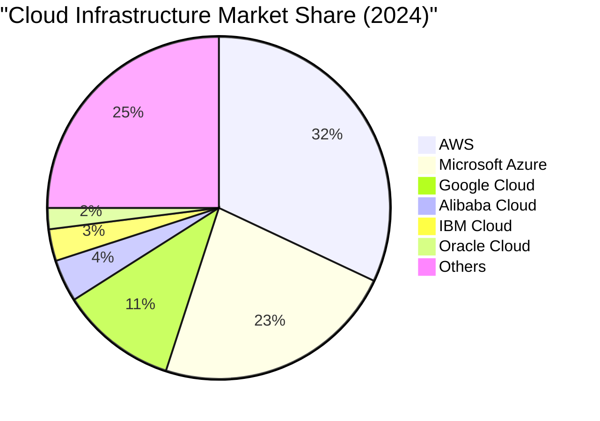

# Cloud Providers Comparison

## Overview of the Cloud Provider Landscape

The cloud computing market is dominated by three major providers—Amazon Web Services (AWS), Microsoft Azure, and Google Cloud Platform (GCP)—collectively holding over 60% market share. However, the ecosystem also includes significant players like IBM Cloud, Oracle Cloud Infrastructure, Alibaba Cloud, and numerous specialized and regional providers. Each provider offers unique strengths, pricing models, and service portfolios tailored to different customer segments and use cases.

Understanding provider differences is crucial for making informed decisions about cloud adoption. Organizations must evaluate providers based on service breadth and depth, pricing structures, geographic presence, compliance certifications, technical capabilities, and ecosystem maturity. This chapter provides detailed comparison of major cloud providers to inform strategic cloud decisions.

## Amazon Web Services (AWS)

### History and Market Position

Launched in 2006 with the introduction of S3 (Simple Storage Service) and EC2 (Elastic Compute Cloud), AWS pioneered cloud computing as we know it today. Amazon leveraged infrastructure built for its e-commerce operations to create a revolutionary new business model: renting computing infrastructure by the hour.

AWS maintains the largest cloud market share at approximately 32%, serving millions of customers from startups to Global 2000 enterprises. The platform's first-mover advantage resulted in the most mature service portfolio, largest customer base, and most extensive partner ecosystem.

### Key Strengths

**Breadth and Depth of Services**: AWS offers over 200 fully-featured services:
- Compute: EC2, Lambda, Elastic Beanstalk, ECS, EKS, Fargate
- Storage: S3, EBS, EFS, FSx, Glacier, Storage Gateway
- Database: RDS, DynamoDB, Aurora, ElastiCache, Neptune, DocumentDB
- Networking: VPC, CloudFront, Route 53, Direct Connect, API Gateway
- Analytics: EMR, Athena, Kinesis, QuickSight, Lake Formation
- Machine Learning: SageMaker, Rekognition, Comprehend, Polly, Lex
- Security: IAM, KMS, Shield, WAF, GuardDuty, Macie
- Developer Tools: CodeCommit, CodeBuild, CodeDeploy, CodePipeline

**Global Infrastructure**: Largest geographic footprint:
- 32 regions worldwide with planned expansion
- 102 availability zones for high availability
- 400+ edge locations for CloudFront CDN
- Submarine cable investments for connectivity
- Local zones in metropolitan areas for ultra-low latency

**Mature Ecosystem**: Largest partner network and marketplace:
- AWS Marketplace with 12,000+ software listings
- Consulting partners (system integrators, managed service providers)
- Technology partners integrating with AWS services
- Training and certification programs
- Extensive documentation and community resources

**Innovation Pace**: Continuous service launches and updates:
- Thousands of new features and services annually
- Customer-driven roadmap via feedback
- Re:Invent conference showcasing innovations
- Quick adoption of emerging technologies

### Popular Services

**Amazon EC2 (Elastic Compute Cloud)**: Industry-leading IaaS offering:
- 400+ instance types across multiple categories:
  - General purpose: t3, m6, m7
  - Compute optimized: c6, c7
  - Memory optimized: r6, r7, x2
  - Storage optimized: i4, d3
  - Accelerated computing: p4 (GPU), inf1 (ML inference)
- Purchasing options:
  - On-demand: pay per second
  - Reserved: 1-3 year commitments with up to 72% discount
  - Spot: spare capacity at up to 90% discount
  - Savings Plans: flexible pricing model

**Amazon S3 (Simple Storage Service)**: Object storage pioneer:
- Virtually unlimited storage capacity
- 99.999999999% (11 nines) durability
- Multiple storage classes for cost optimization:
  - S3 Standard for frequent access
  - S3 Intelligent-Tiering for variable access patterns
  - S3 Standard-IA and One Zone-IA for infrequent access
  - S3 Glacier for long-term archival
- Versioning, lifecycle policies, replication
- Event notifications for automation

**AWS Lambda**: Serverless computing leader:
- Support for multiple languages: Node.js, Python, Java, Go, .NET, Ruby
- Custom runtimes via Lambda Layers
- 15-minute maximum execution time
- 10 GB memory maximum
- Integration with 200+ AWS services
- Event sources: API Gateway, S3, DynamoDB, Kinesis, SQS, SNS

**Amazon RDS (Relational Database Service)**: Managed databases:
- Engines: MySQL, PostgreSQL, MariaDB, Oracle, SQL Server
- Amazon Aurora: MySQL and PostgreSQL compatible with 5x performance
- Automated backups and snapshots
- Multi-AZ deployments for high availability
- Read replicas for scaling reads
- Automated patching and upgrades

### Pricing Model

AWS pioneered pay-as-you-go cloud pricing with several dimensions:

**Compute Pricing**:
- Per-second billing for Linux instances (minimum 1 minute)
- Per-hour billing for Windows and other OS
- Reserved Instances: 1 or 3-year commitments
- Savings Plans: flexible commitment-based discounts
- Spot Instances: bid on spare capacity

**Storage Pricing**:
- Per GB-month for data stored
- Tiered pricing with volume discounts
- Different rates for storage classes
- Requests and data retrieval charges

**Data Transfer**:
- Inbound transfer free
- Outbound to internet charged per GB
- Transfer between regions charged
- Transfer within same region generally free
- CloudFront can reduce transfer costs

**Free Tier**:
- 12-month free tier for new accounts
- Always free tier for limited usage of certain services
- Trial offers for new services

### Ideal Use Cases

**Startups and Innovators**: Comprehensive platform enables rapid development:
- Minimal upfront investment
- Access to cutting-edge services
- Activate for Startups program with credits
- Vibrant startup ecosystem and funding connections

**Enterprise Applications**: Mature services support mission-critical workloads:
- Windows/.NET workloads (despite Microsoft Azure alternative)
- SAP, Oracle, and other enterprise software
- High-performance computing
- Global deployments

**Data-Intensive Workloads**: Strong data and analytics capabilities:
- Big data processing with EMR
- Data warehousing with Redshift
- Data lakes with S3 and Lake Formation
- Real-time analytics with Kinesis

## Microsoft Azure

### History and Market Position

Microsoft Azure, launched in 2010, has grown to become the second-largest cloud provider with approximately 23% market share. Azure benefits from Microsoft's enterprise relationships, particularly organizations heavily invested in Microsoft technologies like Windows Server, SQL Server, Active Directory, and the broader Microsoft 365 ecosystem.

Azure's strategy focuses on hybrid cloud, enabling organizations to extend on-premises Microsoft infrastructure to the cloud seamlessly. This approach particularly appeals to large enterprises with significant Microsoft investments seeking cloud migration paths that preserve existing investments and skills.

### Key Strengths

**Enterprise Integration**: Deep integration with Microsoft ecosystem:
- Seamless Active Directory integration
- Windows Server and SQL Server licensing benefits
- Microsoft 365 integration
- Dynamics 365 integration for ERP and CRM
- On-premises System Center compatibility

**Hybrid Cloud Leadership**: Purpose-built for hybrid scenarios:
- Azure Stack for on-premises Azure deployment
- Azure Arc for managing resources anywhere
- Azure File Sync for file server hybrid scenarios
- Consistent tools and APIs across environments
- Unified identity with Active Directory

**Developer Tools**: Best-in-class development experience:
- Visual Studio integration
- GitHub integration (Microsoft acquired GitHub)
- Azure DevOps for complete CI/CD
- .NET framework optimizations
- Support for multiple languages and frameworks

**Compliance and Certifications**: Extensive compliance portfolio:
- 90+ compliance certifications
- Government cloud offerings (Azure Government, Azure China)
- Industry-specific solutions (healthcare, financial services)
- Regional compliance support

### Popular Services

**Azure Virtual Machines**: Comprehensive IaaS offering:
- Instance series: A (budget), B (burstable), D (general purpose), E (memory optimized), F (compute optimized), N (GPU)
- Support for Windows, Linux, custom images
- Azure Hybrid Benefit: use existing Windows licenses
- Reserved instances for cost savings
- Spot VMs for significant discounts
- Proximity placement groups for low latency

**Azure Blob Storage**: Object storage similar to S3:
- Hot, cool, and archive access tiers
- Hierarchical namespace for data lake scenarios
- Immutable storage for compliance
- Azure Data Lake Storage Gen2 built on Blob Storage
- Integration with Azure data services

**Azure Functions**: Serverless compute platform:
- Consumption plan for pay-per-execution
- Premium plan for advanced scenarios
- Dedicated plan for predictable pricing
- Durable Functions for stateful workflows
- Language support: C#, JavaScript, Python, Java, PowerShell

**Azure SQL Database**: Fully managed relational database:
- Based on SQL Server engine
- Automatic tuning and optimization
- Serverless compute tier
- Hyperscale architecture for massive databases
- Advanced security with Azure AD integration
- Managed Instance for SQL Server compatibility

**Azure Kubernetes Service (AKS)**: Managed Kubernetes:
- Free control plane
- Automatic cluster upgrades
- Azure Monitor integration
- Azure Active Directory integration
- Virtual nodes with ACI for elastic scaling
- Support for Windows and Linux containers

### Pricing Model

Azure pricing structure:

**Compute**:
- Pay-as-you-go per hour or second
- Reserved instances: 1 or 3-year terms with up to 72% savings
- Azure Hybrid Benefit: up to 85% savings with existing licenses
- Spot VMs: up to 90% discount

**Storage**:
- Per GB-month by tier (hot, cool, archive)
- Transactions and data retrieval charges
- Bandwidth charges for egress

**Data Transfer**:
- Inbound free
- Outbound charged per GB with tiering
- ExpressRoute for predictable costs

**Free Tier**:
- 12-month free trial with $200 credit
- Always free services (limited capacity)
- Free tier for many services

**Azure Cost Management**: Built-in cost optimization:
- Cost analysis and budgets
- Recommendations for savings
- Resource optimization insights

### Ideal Use Cases

**Microsoft-Centric Organizations**: Natural fit for Microsoft shops:
- Windows workloads and .NET applications
- SQL Server databases
- Active Directory integration
- Microsoft 365 integration
- Dynamics 365 integration

**Hybrid Cloud Deployments**: Leading hybrid capabilities:
- Gradual migration from on-premises
- Maintaining on-premises presence
- Regulatory requirements for on-premises data
- Azure Stack for consistent experience

**Enterprise Applications**: Strong enterprise credentials:
- SAP certifications
- Large-scale ERP deployments
- Mission-critical Windows workloads
- Government and regulated industries

**Developer-Focused Organizations**: Excellent developer experience:
- .NET development
- Visual Studio users
- GitHub integration
- DevOps practices

## Google Cloud Platform (GCP)

### History and Market Position

Google Cloud Platform, launched commercially in 2011 (building on App Engine from 2008), represents Google's entry into cloud infrastructure. With approximately 11% market share, GCP is the third-largest provider but growing rapidly. Google leverages technologies developed for its own massive-scale operations (Gmail, Search, YouTube, Maps) to offer cutting-edge cloud services.

GCP's strengths lie in data analytics, machine learning, and container technologies (Kubernetes originated at Google). The platform appeals to organizations prioritizing these capabilities and those seeking alternatives to AWS or Azure.

### Key Strengths

**Data and Analytics Excellence**: Born from Google's big data expertise:
- BigQuery for petabyte-scale data warehousing
- Dataflow for stream and batch processing
- Pub/Sub for messaging at Google scale
- Dataproc for managed Hadoop and Spark
- Looker for business intelligence (acquired 2020)

**Machine Learning Leadership**: Advanced AI/ML capabilities:
- Vertex AI for custom model development
- Pre-trained APIs: Vision, Natural Language, Translation, Speech
- AutoML for automated model creation
- TensorFlow integration (Google developed TensorFlow)
- TPUs (Tensor Processing Units) for ML acceleration

**Kubernetes and Containers**: Kubernetes birthplace:
- Google Kubernetes Engine (GKE) with autopilot mode
- Anthos for hybrid and multi-cloud Kubernetes
- Cloud Run for serverless containers
- Artifact Registry for container images

**Network Infrastructure**: Superior global network:
- Premium tier uses Google's private global network
- Lower latency than public internet
- Global load balancing included
- Andromeda SDN for network virtualization

**Pricing Innovation**: Customer-friendly pricing:
- Per-second billing from the start
- Sustained use discounts automatically applied
- Committed use discounts like reserved instances
- Preemptible VMs at 80% discount
- Custom machine types for exact resource matching

### Popular Services

**Compute Engine**: IaaS foundation:
- Standard, high-memory, high-CPU, memory-optimized, compute-optimized instances
- Custom machine types: specify exact vCPU and memory
- Preemptible VMs for fault-tolerant workloads
- Sole-tenant nodes for compliance
- Automatic sustained use discounts
- Live migration for maintenance

**Google Kubernetes Engine (GKE)**: Leading managed Kubernetes:
- Autopilot mode: fully managed, per-pod billing
- Standard mode: node management with Google assistance
- Multi-cluster mesh with Anthos
- Workload Identity for secure service accounts
- Binary Authorization for security
- Automatic scaling and upgrades

**BigQuery**: Serverless data warehouse:
- Analyze petabytes in seconds
- Standard SQL interface
- Separation of storage and compute
- Automatic optimization and caching
- Real-time data ingestion
- Built-in machine learning
- Geospatial analysis support

**Cloud Functions**: Serverless platform:
- Event-driven architecture
- Node.js, Python, Go, Java support
- Integrates with Google Cloud services
- Background functions for async processing
- HTTP functions for REST APIs

**Cloud Storage**: Object storage service:
- Standard, Nearline, Coldline, Archive storage classes
- Automatic storage class transitions
- Strong consistency globally
- Bucket Lock for compliance
- Integration with GCP services

### Pricing Model

**Compute**:
- Per-second billing for all instances
- Sustained use discounts: automatic up to 30% for running instances
- Committed use discounts: 1 or 3-year commitments
- Preemptible VMs: up to 80% discount
- Custom machine types prevent over-provisioning

**Storage**:
- Per GB-month by storage class
- No retrieval fees for Standard class
- Operations and data retrieval for other classes
- Egress charges by volume and destination

**Network**:
- Premium tier: Google's global network
- Standard tier: public internet routing (cheaper)
- Egress charges by destination
- Interconnect for dedicated connectivity

**Free Tier**:
- Always free tier for many services
- $300 credit for new accounts (90 days)
- Trial periods for new services

### Ideal Use Cases

**Data-Intensive Applications**: Unmatched data analytics:
- Real-time analytics with BigQuery
- Data lakes and warehouses
- Log analysis and monitoring
- Business intelligence and reporting

**Machine Learning Projects**: Cutting-edge AI/ML:
- Custom model training
- Pre-trained model APIs
- Computer vision applications
- Natural language processing
- Recommendation engines

**Containerized Applications**: Kubernetes expertise:
- Microservices architectures
- Cloud-native applications
- Hybrid and multi-cloud with Anthos
- Modern CI/CD pipelines

**Startups and Digital Natives**: Appeals to technical organizations:
- Developer-friendly tools
- Modern architecture patterns
- Generous free tiers
- Startup programs with credits

## Other Significant Providers

### IBM Cloud

**Positioning**: Enterprise cloud with strong AI and hybrid capabilities:
- Red Hat acquisition strengthens hybrid cloud with OpenShift
- Watson AI services
- Quantum computing services
- Mainframe integration for legacy systems

**Strengths**:
- Enterprise consulting and support
- Hybrid cloud with Red Hat OpenShift
- Industry-specific solutions
- Strong security and compliance

**Use Cases**:
- Large enterprises with IBM relationships
- Hybrid cloud deployments
- AI and machine learning projects
- Regulated industries

### Oracle Cloud Infrastructure (OCI)

**Positioning**: Database-centric cloud for Oracle customers:
- Optimized for Oracle database workloads
- Autonomous Database with automated management
- Exadata Cloud Service
- Competitive pricing versus AWS/Azure

**Strengths**:
- Best performance for Oracle databases
- Database expertise and tools
- Cost-effective for Oracle workloads
- Bare metal and VM options

**Use Cases**:
- Oracle database migrations
- Organizations with Oracle ERP/CRM systems
- Database-intensive applications
- Cost-conscious Oracle customers

### Alibaba Cloud

**Positioning**: Leading cloud in China and Asia-Pacific:
- Dominant in Chinese market
- Global expansion underway
- Supports Ant Financial and Alibaba e-commerce
- Competitive pricing

**Strengths**:
- China market access and compliance
- Asia-Pacific presence
- E-commerce and retail expertise
- Mobile and IoT services

**Use Cases**:
- Chinese market operations
- Asia-Pacific deployments
- E-commerce and retail
- Organizations requiring Chinese cloud presence

### DigitalOcean

**Positioning**: Developer-focused, simplified cloud:
- Targeting startups and small businesses
- Predictable pricing
- Straightforward service offerings
- Strong developer community

**Strengths**:
- Simple, user-friendly interface
- Excellent documentation
- Predictable pricing
- Quick setup and deployment

**Use Cases**:
- Startups and small businesses
- Developer side projects
- Simple web applications
- Learning and experimentation

## Comparison Matrix

### Service Breadth

**AWS**: Most comprehensive service catalog
- 200+ services covering virtually every use case
- Often first with new service types
- Widest selection of instance types, database engines, etc.

**Azure**: Strong breadth with Microsoft focus
- 100+ services with Microsoft integration
- Growing service catalog rapidly
- Strength in hybrid scenarios

**GCP**: Focused on data, ML, and containers
- Fewer services but high quality
- Specialized in analytics and AI
- Expanding traditional enterprise services

### Pricing Comparison

**Cost Competitiveness**:
- GCP often least expensive for compute (per-second billing, sustained use discounts)
- Azure offers Azure Hybrid Benefit for Microsoft customers
- AWS Reserved Instances and Savings Plans competitive
- Actual costs depend heavily on specific usage patterns

**Pricing Complexity**:
- GCP most transparent with automatic discounts
- AWS most complex with numerous pricing dimensions
- Azure middle ground with some automatic optimizations

### Geographic Presence

**AWS**: Largest footprint
- 32 regions, 102 availability zones
- Most edge locations
- Broadest global coverage

**Azure**: Strong global presence
- 60+ regions (more than AWS but some less full-featured)
- Growing rapidly
- Good coverage in underserved markets

**GCP**: Focused expansion
- 35+ regions
- Premium network tier for global connectivity
- Strategic presence in key markets

### Support and Documentation

**AWS**: Most mature ecosystem
- Extensive documentation
- Largest community
- AWS Marketplace with most offerings
- Most third-party training and certifications

**Azure**: Strong enterprise support
- Microsoft Premier Support legacy
- Good documentation improving rapidly
- Growing marketplace
- Microsoft Learn training platform

**GCP**: Developer-friendly documentation
- Clear, well-organized docs
- Strong community for specific services (Kubernetes, TensorFlow)
- Qwiklabs for hands-on learning

## Selection Framework

### Decision Criteria

**Existing Technology Investments**:
- Heavy Microsoft investment → Azure natural choice
- Oracle databases → Oracle Cloud Infrastructure
- Google Workspace → Consider GCP
- No strong incumbent → AWS (most mature) or multi-cloud

**Specific Workload Requirements**:
- Windows/.NET applications → Azure
- Machine learning and analytics → GCP or AWS
- Kubernetes and containers → GCP
- Broadest service needs → AWS

**Geographic Requirements**:
- Specific country or region coverage → Check provider presence
- China operations → Alibaba Cloud or Azure China
- Multiple regions → AWS broadest coverage

**Skills and Expertise**:
- Existing team skills and certifications
- Training and certification costs
- Hiring pool for specific platforms

**Pricing and Budget**:
- Analyze specific workload costs across providers
- Consider commitment discounts
- Account for data egress costs
- Use provider pricing calculators

**Vendor Relationship and Support**:
- Existing vendor relationships
- Enterprise agreement opportunities
- Support models and SLAs
- Strategic partnerships

### Multi-Cloud Considerations

Many organizations don't limit themselves to one provider:

**Advantages**:
- Avoid vendor lock-in
- Leverage best services from each
- Geographic redundancy across providers
- Negotiating leverage

**Challenges**:
- Increased complexity
- Skills and training across platforms
- Integration between clouds
- Cost management across providers

**Common Patterns**:
- AWS for compute, Azure for Microsoft workloads
- Primary provider with secondary for DR
- Different providers for different business units
- Migration between providers over time

## Future Outlook

### Market Trends

**Continued Growth**: Cloud market expanding 20%+ annually
- On-premises workload migration continuing
- New cloud-native applications
- Emerging markets adoption

**Competition Intensifying**:
- Price competition ongoing
- Service parity races (providers matching competitors' services)
- Differentiation through specialized services
- Regional providers gaining share in specific markets

**Industry Consolidation**:
- Smaller providers acquired or exiting
- Focus on AWS, Azure, GCP long-term
- Specialized providers in niches (edge computing, specific regions)

### Emerging Focus Areas

**Edge Computing**: Bringing compute closer to users
- AWS Wavelength, Azure Edge Zones, Google Cloud Edge
- 5G integration for ultra-low latency
- IoT and industrial applications

**Sustainability**: Reducing environmental impact
- Renewable energy commitments
- Carbon-neutral goals
- Sustainability reporting tools

**Confidential Computing**: Enhanced security
- Encrypted data in use
- Trusted execution environments
- Regulatory and privacy drivers

**Industry-Specific Clouds**: Specialized offerings
- Healthcare clouds (compliance, specialized services)
- Financial services clouds
- Manufacturing and retail clouds

## Conclusion

The cloud provider landscape is dominated by AWS, Azure, and GCP, each with distinct strengths and ideal use cases. AWS offers the most comprehensive service catalog and mature ecosystem. Azure excels in hybrid cloud and Microsoft ecosystem integration. GCP leads in data analytics, machine learning, and Kubernetes.

Organizations should evaluate providers based on specific requirements rather than generic superiority claims. Consider existing technology investments, workload characteristics, geographic needs, team skills, and long-term strategic direction. Many organizations successfully employ multi-cloud strategies, leveraging strengths of multiple providers while managing increased complexity.

As cloud computing matures, provider capabilities increasingly overlap. Success depends less on provider selection and more on cloud architecture, governance, cost optimization, and operational excellence. Organizations should focus on cloud-native design principles, automation, and continuous optimization regardless of provider choice.

The cloud market continues evolving rapidly with new services, pricing models, and capabilities emerging continuously. Stay informed about provider roadmaps, industry trends, and emerging technologies to make strategic decisions that position organizations for long-term success in cloud computing.
