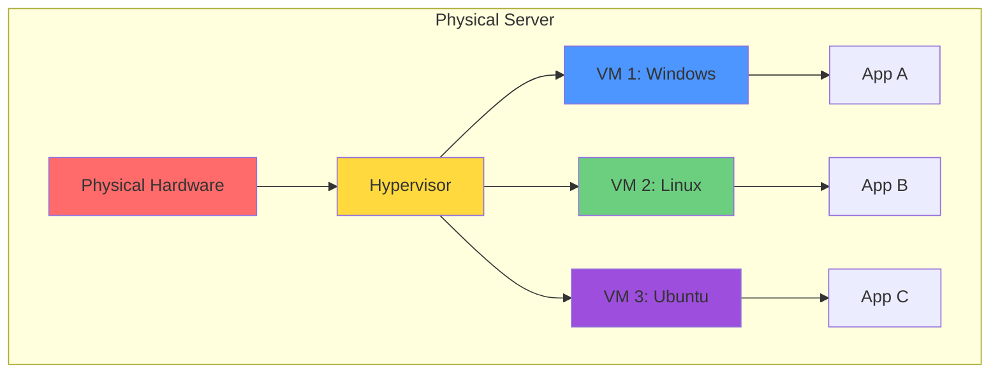
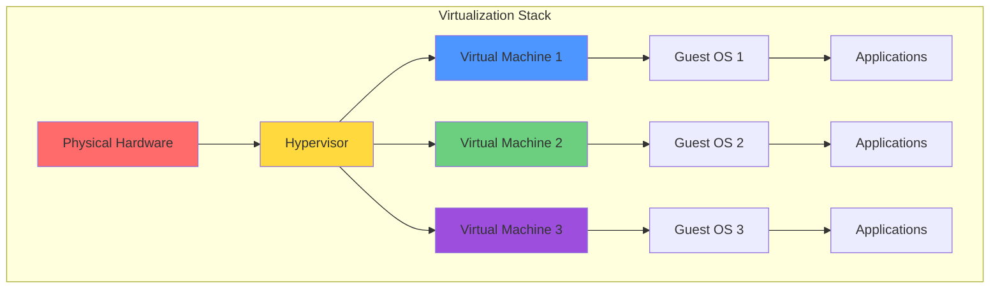

# Introduction to Virtualization

## What is Virtualization?

Virtualization is the creation of virtual versions of computing resources including hardware platforms, operating systems, storage devices, and network resources. At its core, virtualization abstracts physical hardware, allowing multiple isolated virtual environments to run on a single physical machine. This technology forms the foundation of modern cloud computing, enabling the efficient sharing of computing resources among multiple users and applications.

The concept of virtualization dates back to the 1960s with IBM mainframes but experienced renaissance in the 2000s with x86 server virtualization. Today, virtualization is ubiquitous in data centers, enabling cloud providers to offer on-demand computing resources at scale while dramatically improving hardware utilization and operational efficiency.

## Hardware vs Software Virtualization

### Hardware Virtualization

Hardware virtualization involves the abstraction of physical hardware to create virtual machines that behave like independent computers:

**Full Virtualization**: Complete hardware abstraction where guest OS runs unmodified:
- Guest OS believes it's running on physical hardware
- Hypervisor translates guest instructions to host hardware
- No modification to guest OS required
- Examples: VMware ESXi, Microsoft Hyper-V, KVM

**Mechanism**:
The hypervisor intercepts privileged instructions from guest operating systems and emulates their execution. Modern CPUs include hardware assist features (Intel VT-x, AMD-V) that significantly improve performance by allowing direct execution of guest instructions with hypervisor oversight.

**Paravirtualization**: Guest OS modified to cooperate with hypervisor:
- Guest OS knows it's virtualized
- Uses hypercalls instead of privileged instructions
- Better performance than full virtualization (before hardware assist)
- Requires OS modification
- Example: Xen paravirtualization (older approach)

**Hardware-Assisted Virtualization**: CPU features support virtualization:
- **Intel VT-x (Virtualization Technology)**: Introduced 2006
- **AMD-V (AMD Virtualization)**: AMD's equivalent technology
- **EPT/NPT**: Extended Page Tables (Intel) / Nested Page Tables (AMD) for memory virtualization
- **VT-d/AMD-Vi**: I/O virtualization for direct device assignment

These CPU extensions create a new privilege level between userspace and kernel, allowing hypervisors to trap and handle privileged instructions efficiently without binary translation or guest OS modification.

### Software Virtualization

Software virtualization uses application-level virtualization without hardware support:

**Operating System-Level Virtualization**: Share OS kernel among containers:
- Containers share host kernel
- Lightweight compared to VMs
- Fast startup times (seconds vs minutes)
- Lower overhead
- Examples: Docker, LXC, Podman

**Comparison**:
- VMs provide stronger isolation (separate kernels)
- Containers offer better density and performance
- VMs can run different OS types on same host
- Containers must share host OS type (all Linux or all Windows)

**Application Virtualization**: Run applications without full OS install:
- Applications packaged with dependencies
- Isolated from host OS
- Examples: App-V, ThinApp
- Different from containers (no kernel sharing)

**Desktop Virtualization (VDI)**: Virtual desktop infrastructure:
- Desktop OS runs in VM on server
- Users access via thin clients
- Centralized management
- Examples: VMware Horizon, Citrix Virtual Apps and Desktops

## Benefits of Virtualization

### Server Consolidation

Virtualization dramatically improves hardware utilization:

**Traditional Deployment**: One application per physical server:
- Typical server utilization: 10-15%
- Wasted capacity due to isolation requirements
- Over-provisioning for peak loads
- Underutilized infrastructure

**Virtualized Deployment**: Multiple VMs per physical server:
- Server utilization: 60-80%
- Consolidation ratios of 10:1 or higher common
- Better ROI on hardware investment
- Reduced data center space requirements

**Cost Savings**:
- Fewer physical servers to purchase
- Reduced power consumption
- Lower cooling requirements
- Reduced data center space
- Fewer software licenses (some licensed per socket)

**Example**:
A company with 100 physical servers running at 15% utilization can consolidate to 10-15 physical hosts running 100 VMs at 70% utilization, reducing hardware, power, and space costs by 85-90%.

### Isolation and Security

Each VM is isolated from others on the same host:

**Process Isolation**:
- VMs cannot access each other's memory
- Hypervisor enforces resource boundaries
- Compromise of one VM doesn't affect others
- Security vulnerabilities contained

**Resource Allocation**:
- CPU, memory, storage, network reserved per VM
- Prevents resource starvation
- Quality of service guarantees
- Performance isolation

**Multi-Tenancy**:
- Run workloads from different tenants on same hardware
- Cloud providers serve thousands of customers on shared infrastructure
- Security through isolation
- Compliance with data separation requirements

**Testing and Development**:
- Safely test patches and changes
- Isolate malware analysis
- Sandbox untrusted applications
- Disposable development environments

### Flexibility and Agility

Virtualization enables rapid provisioning and reconfiguration:

**Rapid Deployment**:
- Clone existing VMs in minutes
- Template-based provisioning
- Infrastructure as Code (IaC) automation
- Self-service portals for users

**Easy Migration**:
- Move VMs between hosts without downtime (live migration)
- Migrate workloads between data centers
- Cloud migration simplified
- Disaster recovery capabilities

**Snapshots and Cloning**:
- Point-in-time snapshots for backup
- Quick rollback after failed changes
- Clone VMs for testing
- Branch development environments

**Resource Scalability**:
- Adjust CPU and memory allocation
- Add or remove virtual hardware
- Scale up or down based on needs
- Some changes without downtime (hot-add)

### Disaster Recovery and Business Continuity

Virtualization simplifies DR strategies:

**Replication**:
- Replicate VMs to DR site
- Continuous or scheduled replication
- Automated failover capabilities
- Regular DR testing without impact

**Backup and Recovery**:
- VM-level backups capture entire system
- Application-consistent snapshots
- Faster restore times than physical servers
- Restore to different hardware

**High Availability**:
- Automatic restart of VMs on different hosts if hardware fails
- Clustering for critical workloads
- Planned maintenance without downtime (live migration)
- Load balancing across hosts

**Cloud DR**:
- Replicate VMs to cloud providers
- Pay only for storage until failover
- Test DR in cloud without impacting production
- Hybrid DR strategies

### Cost Efficiency

Beyond hardware consolidation, virtualization reduces various costs:

**Capital Expenditure (CapEx)**:
- Fewer servers to purchase
- Reduced networking equipment
- Smaller data center footprint
- Lower initial investment

**Operational Expenditure (OpEx)**:
- Reduced power bills
- Lower cooling costs
- Fewer system administrators needed
- Reduced maintenance contracts

**Software Licensing**:
- Some software licensed per physical CPU
- Consolidation reduces license costs
- Centralized license management
- License mobility and flexibility

**Time Savings**:
- Faster provisioning
- Automated management
- Reduced manual configuration
- More time for strategic initiatives

## Virtualization Architecture

### Virtualization Stack

### Virtual Machine Components

Each VM consists of several virtual hardware components:

**Virtual CPU (vCPU)**:
- Represents CPU resources allocated to VM
- Can over-subscribe physical CPUs (more vCPUs than physical cores)
- Scheduling algorithms allocate physical CPU time
- Modern hypervisors support many vCPUs per VM (128+)

**Virtual Memory (RAM)**:
- Guest OS sees contiguous physical memory
- Hypervisor maps to actual physical memory
- Memory ballooning and compression optimize usage
- Memory over-commitment possible with reclamation techniques

**Virtual Storage**:
- Virtual disks as files on host filesystem
- Formats: VMDK (VMware), VHD/VHDX (Hyper-V), QCOW2 (KVM)
- Thin provisioning allocates space on demand
- Snapshots capture disk state at point in time

**Virtual Network Interface Card (vNIC)**:
- VM sees standard network adapter
- Hypervisor provides virtual switching
- Multiple vNICs per VM
- Various network connectivity options

**Virtual Hardware Abstraction**:
- BIOS/UEFI emulation
- USB controllers
- Graphics adapters
- Sound cards (rarely used in servers)

### Hypervisor Resource Management

Hypervisors manage physical resources among VMs:

**CPU Scheduling**:
- Time-slicing physical CPUs among vCPUs
- Priority-based scheduling
- CPU reservation guarantees
- CPU limits prevent monopolization
- CPU affinity pins VMs to specific cores

**Memory Management**:
- Page sharing (deduplication) for identical memory
- Memory ballooning reclaims unused memory
- Memory compression before paging
- Transparent huge pages for performance
- NUMA awareness for large VMs

**Storage I/O**:
- I/O scheduling and prioritization
- Storage QoS (Quality of Service)
- Caching algorithms
- Multipathing for redundancy
- Storage vMotion/live migration

**Network I/O**:
- Virtual switches connect VMs
- VLANs for segmentation
- Traffic shaping and QoS
- SR-IOV for near-native performance
- Network overlays (VXLAN, etc.)

## Use Cases for Virtualization

### Server Consolidation

Primary use case in enterprise data centers:

**Scenario**: Company has 200 physical servers, each running single application at 10-20% utilization.

**Virtualization Solution**:
- Consolidate to 25 physical hosts
- Each host runs 8 VMs
- Increase utilization to 60-70%
- Reduce from 200 servers to 25

**Results**:
- 87.5% reduction in hardware
- Similar reduction in power, cooling, space
- Simplified management
- Faster provisioning
- Improved DR capabilities

### Development and Testing

Virtual machines ideal for dev/test environments:

**Benefits**:
- Quickly provision environments
- Snapshot before testing
- Clone production for testing
- Isolate each developer
- Automate environment creation

**Example Workflow**:
1. Developer requests environment via portal
2. Automated system clones template
3. Customizes network and storage
4. Developer receives credentials in minutes
5. Developer tests changes
6. Snapshot before risky operations
7. Destroy environment when done

**Cost Savings**:
- No dedicated hardware per developer
- Shut down VMs when not in use
- Clone instead of manual configuration
- Rapid environment turnover

### Legacy Application Support

Run old applications without old hardware:

**Problem**: Application requires Windows Server 2003 which is end-of-life and unsupported.

**Virtual Solution**:
- Run Windows Server 2003 in VM
- Isolate from network (security)
- Run on modern hardware
- Backup and snapshot for preservation
- Eventually migrate or replace

**Benefits**:
- Extend life of legacy applications
- Avoid finding scarce old hardware
- Improve reliability (modern hardware)
- Easier backup and DR
- Time for proper migration

### Virtual Desktop Infrastructure (VDI)

Centralized desktop management:

**Architecture**:
- Desktop OS runs in VMs on servers
- Users connect via thin clients or software
- Centralized storage and management
- Session persistence

**Benefits**:
- Centralized data (doesn't leave data center)
- Access from any device
- Easier management and patching
- Enhanced security
- Support BYOD (Bring Your Own Device)

**Challenges**:
- Significant infrastructure investment
- Careful performance tuning required
- Network dependency
- User experience considerations
- Licensing complexity

### Cloud Infrastructure

Foundation of IaaS offerings:

**How Cloud Providers Use Virtualization**:
- AWS EC2, Azure VMs, Google Compute Engine all use virtualization
- Custom hypervisors optimized for cloud (Xen, KVM, Nitro)
- Massive scale (millions of VMs)
- Multi-tenancy isolation
- Automated provisioning and management

**Customer Benefits**:
- On-demand VM creation
- Pay per use
- Global distribution
- No hardware management
- Elasticity and scaling

## Virtualization vs Containers

Understanding the distinction is crucial:

### Virtual Machines

**Characteristics**:
- Each VM includes full OS
- Strong isolation (separate kernels)
- Slower startup (minutes)
- Higher resource overhead (GB per VM)
- Run different OS types on same host

**Best For**:
- Running different operating systems
- Maximum isolation requirements
- Legacy application support
- Windows applications
- Long-running servers

### Containers

**Characteristics**:
- Share host OS kernel
- Lightweight (MB per container)
- Fast startup (seconds)
- Higher density (100+ per host)
- Must share host OS type

**Best For**:
- Microservices architectures
- Cloud-native applications
- CI/CD pipelines
- Rapid scaling
- DevOps workflows

### Comparison Table

| Aspect | Virtual Machines | Containers |
|--------|-----------------|------------|
| Isolation | Strong (separate kernel) | Process-level |
| Startup Time | Minutes | Seconds |
| Size | Gigabytes | Megabytes |
| Density | 10-100 per host | 100-1000 per host |
| OS Diversity | Different OS types | Same OS type |
| Overhead | Higher | Lower |
| Use Case | General purpose | Cloud-native apps |

### Hybrid Approaches

Many organizations use both:

**VMs for Infrastructure**:
- Database servers
- Windows applications
- Legacy systems
- Security-critical workloads

**Containers for Applications**:
- Web applications
- Microservices
- Stateless services
- Development environments

**Containers in VMs**:
- Run container orchestration (Kubernetes) on VMs
- Balance isolation and efficiency
- Common in cloud environments (EKS, AKS, GKE)

## Performance Considerations

### Virtualization Overhead

Virtualization introduces some performance penalty:

**Typical Overhead**:
- CPU: 2-10% (lower with hardware virtualization)
- Memory: Minimal with modern hypervisors
- Storage I/O: 5-20% (varies by workload)
- Network I/O: 5-15% (near-native with SR-IOV)

**Optimization Techniques**:
- Use paravirtualized drivers
- Enable hardware virtualization (VT-x/AMD-V)
- Use SR-IOV for network and storage
- Proper resource sizing
- Avoid over-subscription for performance-critical VMs

### When NOT to Virtualize

Some workloads better on physical hardware:

**High-Performance Computing (HPC)**:
- Requires maximum CPU performance
- Low latency, high throughput
- Direct hardware access
- Specialized hardware (InfiniBand)

**Real-Time Systems**:
- Precise timing requirements
- Hypervisor scheduling introduces jitter
- Safety-critical applications

**License Restrictions**:
- Some vendors prohibit virtualization
- Oracle database licensing complex
- Per-core licensing expensive

**Maximum Performance Requirements**:
- When every percentage of performance matters
- Low-latency trading systems
- Some database workloads

## Future of Virtualization

### Nested Virtualization

Running hypervisors inside VMs:

**Use Cases**:
- Cloud provider development and testing
- Training and education
- Complex lab environments
- Hypervisor research

**Support**:
- AWS supports nested virtualization on bare metal instances
- Azure supports nested virtualization
- Google Cloud supports nested virtualization
- VMware supports nested ESXi

### Confidential Computing

Hardware-based trusted execution environments:

**Technology**:
- Intel SGX (Software Guard Extensions)
- AMD SEV (Secure Encrypted Virtualization)
- ARM TrustZone

**Benefits**:
- Encrypt VM memory
- Protect from hypervisor compromise
- Enable secure multi-tenancy
- Regulatory compliance for sensitive data

**Use Cases**:
- Financial services
- Healthcare data
- Government workloads
- Multi-party computation

### Disaggregated Infrastructure

Virtualize beyond servers:

**Composable Infrastructure**:
- Pool CPU, memory, storage, network resources
- Compose VMs from disaggregated pools
- Elastic resource allocation
- Optimize resource utilization

**Technologies**:
- Remote Direct Memory Access (RDMA)
- NVMe over Fabrics
- Gen-Z interconnect
- CXL (Compute Express Link)

## Conclusion

Virtualization revolutionized computing by abstracting hardware and enabling efficient resource sharing. By creating virtual machines that run multiple operating systems on a single physical server, virtualization dramatically improves hardware utilization, reduces costs, enhances flexibility, and simplifies disaster recovery.

The benefits of virtualization—server consolidation, isolation, agility, and cost efficiency—drove widespread adoption in enterprise data centers and enabled the cloud computing revolution. Modern cloud providers like AWS, Azure, and Google Cloud build their IaaS offerings on virtualization technology, serving millions of customers on shared infrastructure while maintaining security and isolation.

Understanding virtualization is fundamental to cloud computing. While containers and serverless computing represent newer paradigms, virtualization remains the foundation of cloud infrastructure. Most organizations use a combination of VMs and containers, selecting the appropriate technology based on workload characteristics, isolation requirements, and operational considerations.

As virtualization technology continues advancing with nested virtualization, confidential computing, and disaggregated infrastructure, it will remain central to modern computing for the foreseeable future. Mastering virtualization concepts is essential for anyone working with cloud computing, data center infrastructure, or modern IT operations.
