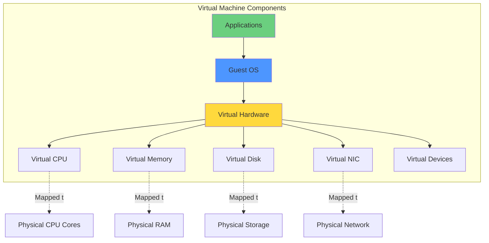
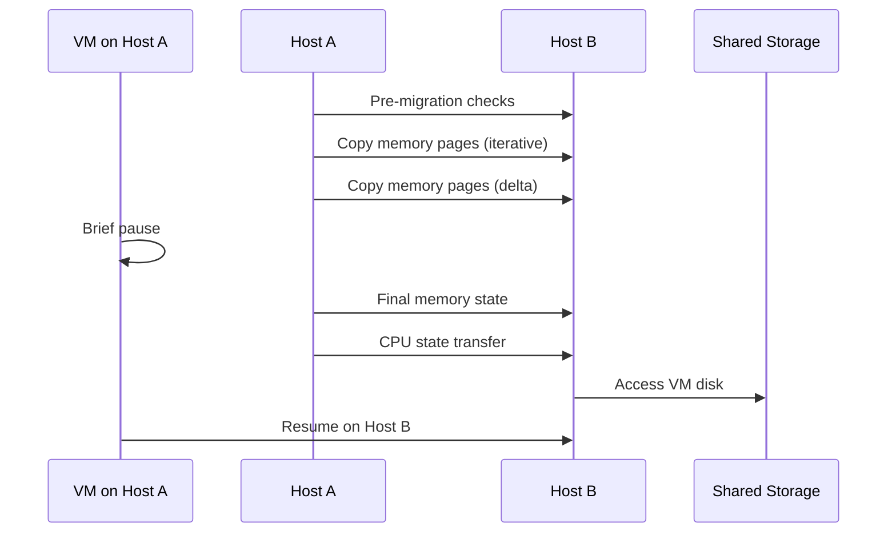

# Virtual Machines

## Virtual Machine Architecture

A virtual machine (VM) is a software-based emulation of a physical computer system that runs an operating system and applications just like a physical machine. VMs are created and managed by hypervisors, which allocate physical resources (CPU, memory, storage, network) to each VM while maintaining isolation between VMs running on the same physical host.

Understanding VM architecture, resource allocation, lifecycle management, and optimization techniques is essential for effective virtualization deployment and management.

## VM Components and Resources

### Virtual CPU (vCPU)

Virtual CPUs represent processing resources allocated to a VM:

**vCPU Allocation**:
- Each vCPU maps to physical CPU threads
- Can allocate multiple vCPUs per VM
- Modern VMs support 100+ vCPUs
- Over-subscription possible (more vCPUs than physical cores)

**vCPU Configuration**:
- Sockets, cores per socket, threads per core
- Matters for licensing (some software licensed per socket)
- NUMA awareness for large VMs
- CPU hot-add support (add vCPUs without shutdown)

**CPU Scheduling**:
- Hypervisor time-slices physical CPUs among vCPUs
- Fair share scheduling by default
- Reservations guarantee minimum CPU
- Limits cap maximum CPU usage
- Shares prioritize VMs during contention

**Best Practices**:
- Start with fewer vCPUs, scale up if needed
- Right-size based on actual usage
- Avoid massive over-subscription (4:1 ratio common limit)
- Monitor CPU ready time (waiting for physical CPU)
- Use CPU affinity sparingly

### Virtual Memory (RAM)

Memory allocation and management for VMs:

**Memory Configuration**:
- Assigned memory appears as continuous physical memory to guest
- Hot-add memory support on some platforms
- NUMA considerations for large VMs (>64GB)
- Memory reservations and limits

**Memory Overcommitment Techniques**:

**Transparent Page Sharing (TPS)**:
- Identifies identical memory pages across VMs
- Merges duplicate pages (one physical copy)
- Common with same-OS VMs
- Security considerations led to restrictions

**Memory Ballooning**:
- VMware Tools/Hyper-V integration services in guest
- Balloon driver reclaims idle memory
- Guest OS decides which memory to release
- Avoids hypervisor swapping

**Memory Compression**:
- Compress memory pages before swapping
- 2:1 or 3:1 compression typical
- CPU trade-off for memory savings
- Faster than disk swapping

**Hypervisor Swapping**:
- Last resort when memory pressure extreme
- Swap VM memory to disk
- Severe performance impact
- Avoid through proper sizing

**Memory Management Best Practices**:
- Size memory based on actual usage plus buffer
- Enable memory ballooning drivers
- Reserve memory for critical VMs
- Monitor memory usage and swap activity
- Use memory shares for prioritization

### Virtual Storage

Virtual disks provide storage to VMs:

**Virtual Disk Formats**:
- **VMDK** (VMware): Widely supported, various subtypes
- **VHD/VHDX** (Microsoft): Hyper-V format, Azure uses VHD
- **QCOW2** (QEMU/KVM): Copy-on-write, snapshots, compression
- **RAW**: Simple format, less features, good performance
- **VDI** (VirtualBox): Oracle VirtualBox format

**Provisioning Types**:

**Thick Provisioning**:
- Allocate full disk space upfront
- Better performance (no growth overhead)
- Easier capacity planning (what you see is allocated)
- Wasted space if not fully utilized

**Thin Provisioning**:
- Allocate space on demand as data written
- Better space efficiency
- Risk of over-subscription
- Slight performance overhead
- Monitor growth to avoid full datastores

**Virtual Disk Types**:
- **System Disk**: Operating system
- **Data Disks**: Application data, databases
- **Temporary Disk**: Ephemeral, lost on restart
- **Independent Disks**: Excluded from snapshots

**Virtual SCSI Controllers**:
- BusLogic (legacy)
- LSI Logic Parallel
- LSI Logic SAS
- Paravirtual SCSI (best performance for VMware)
- SATA, IDE controllers for specific OS

**Storage Best Practices**:
- Use paravirtualized controllers for best performance
- Separate OS and data disks
- Avoid single large disks (split for flexibility)
- Monitor thin provisioned growth
- Regular storage vMotion for balancing

### Virtual Networking

Network connectivity for VMs:

**Virtual Network Interface Cards (vNICs)**:
- E1000 (emulated Intel adapter)
- E1000E (enhanced)
- VMXNET2/VMXNET3 (VMware paravirtualized - best performance)
- Virtio (KVM paravirtualized)
- Multiple vNICs per VM supported

**Virtual Switches**:
- Bridge VMs to physical network
- Internal VM-to-VM communication
- VLAN support for segmentation
- Port mirroring for monitoring
- Traffic shaping and QoS

**Network Features**:
- MAC address assignment (automatic or manual)
- Promiscuous mode (for security tools)
- Forged transmits
- Jumbo frames support (9000 byte MTU)
- SR-IOV for near-native performance

**Network Best Practices**:
- Use paravirtualized NICs
- Separate management, vMotion, and VM traffic
- VLAN segmentation for security
- Multiple physical NICs for redundancy
- Monitor network saturation

## VM Lifecycle Management

### Creating VMs

**Manual Creation**:
1. Specify name and location
2. Select datastore
3. Choose guest OS type
4. Configure virtual hardware (CPU, memory, disk, network)
5. Customize settings (boot order, drivers)
6. Power on and install OS

**Template-Based Creation**:
- Create VM and configure as desired
- Install OS and applications
- Sysprep (Windows) or generalize (Linux)
- Convert to template
- Deploy new VMs from template
- Customization specifications for unique config

**Cloning**:
- Full clone: Independent copy
- Linked clone: Shares base disk, saves space
- Quick provisioning
- Useful for development/testing

**Infrastructure as Code (IaC)**:
- Terraform for cross-platform provisioning
- VMware vRealize Automation
- Ansible for configuration
- Templates in version control

### VM Configuration

**Hardware Configuration**:
- CPU (count, cores, sockets)
- Memory (size, hot-add)
- Disks (add, remove, resize)
- Network adapters (add, configure VLANs)
- USB, serial, parallel ports

**Advanced Settings**:
- Boot options (BIOS vs UEFI)
- Firmware settings
- CPU/memory hot-add
- Latency sensitivity
- VT-x/AMD-V exposure to guest (nested virtualization)

**VM Options**:
- VM name and notes
- Guest OS type
- VMware Tools settings
- Power management
- Advanced parameters

**Resource Allocation**:
- CPU shares, reservations, limits
- Memory shares, reservations, limits
- Storage I/O shares
- Network bandwidth limits

### Starting and Stopping VMs

**Power Operations**:
- **Power On**: Boot VM like physical machine
- **Reset**: Hard reset (like pressing reset button)
- **Power Off**: Hard power off (like pulling plug)
- **Shut Down Guest**: Graceful OS shutdown
- **Restart Guest**: Graceful OS restart
- **Suspend**: Save state to disk, resume later

**Best Practices**:
- Use guest shutdown/restart when possible
- Power off as last resort
- Suspend for quick resume
- Automate with scripts for bulk operations
- Configure VM startup order for dependencies

### Modifying VMs

**Hot Operations** (without downtime):
- Add CPU (if enabled)
- Add memory (if enabled)
- Add/remove virtual disks
- Add/remove network adapters
- Modify network adapter settings

**Cold Operations** (requires shutdown):
- Remove CPU/memory
- Change guest OS type
- Modify BIOS/UEFI settings
- Some advanced configuration changes

**Disk Operations**:
- Extend disk size (online or offline)
- Add disks hot-add (most platforms)
- Storage vMotion to different datastore
- Inflate thin disks
- Convert disk types

### Deleting VMs

**Removal Process**:
1. Power off VM
2. Take final backup if needed
3. Remove from inventory (soft delete)
4. Delete from disk (hard delete)

**Considerations**:
- Snapshots deleted with VM
- Orphaned disks if manually managed
- License implications
- Backup retention policies
- Audit trail requirements

## Live Migration

Move running VMs between hosts without downtime:

### How Live Migration Works

**Migration Process**:
1. **Pre-check**: Verify compatibility, resources, connectivity
2. **Memory Copy**: Iterative copying of memory pages
3. **Tracking**: Track changed pages during copy
4. **Quiesce**: Brief pause of VM (milliseconds)
5. **Final Copy**: Transfer remaining dirty pages and CPU state
6. **Switchover**: Resume on destination host
7. **Cleanup**: Release source resources

**Total Time**: Minutes (memory copy)
**Downtime**: Milliseconds to sub-second

### Live Migration Requirements

**Shared Storage**:
- VMs on SAN, NAS, or distributed storage
- Source and destination access same storage
- Enables fast migration (only memory/state transfers)

**Network Connectivity**:
- High-bandwidth link between hosts (10GbE+)
- Dedicated vMotion/Live Migration network
- Low latency preferred

**Compatible Hardware**:
- Same CPU family (or compatible)
- CPU masking for minor differences
- Enhanced vMotion Compatibility (EVC) mode

**Software Compatibility**:
- Same hypervisor version (or compatible)
- VM hardware version compatibility
- Networking configuration matches

### Storage Migration

Migrate VM storage while running:

**Storage vMotion** (VMware):
- Move virtual disks between datastores
- No shared storage required between source and destination
- Longer duration than compute migration
- Enables storage maintenance, performance optimization

**Live Storage Migration** (Hyper-V):
- Similar to Storage vMotion
- Move VHD/VHDX files
- No downtime required

**Process**:
1. Create mirror of disk on destination
2. Synchronize writes to both copies
3. Final synchronization
4. Switch to destination storage
5. Delete source disk

### Cross-Cloud Migration

Migrate VMs between different environments:

**Use Cases**:
- Data center to cloud migration
- Cross-region migration
- Disaster recovery failover
- Cloud repatriation

**Challenges**:
- Different hypervisors
- Network connectivity (WAN latency)
- Large data transfers
- Security and compliance

**Solutions**:
- VMware Cloud on AWS (same hypervisor)
- Azure Migrate
- AWS Migration Hub
- Specialized tools (Zerto, Veeam)

## Resource Allocation and QoS

### CPU Resource Controls

**Shares**:
- Relative priority during contention
- High: 2000 shares
- Normal: 1000 shares
- Low: 500 shares
- Custom: any value

**Reservations**:
- Guaranteed CPU allocation
- MHz or percentage
- Admission control prevents overcommitment
- Critical VMs should have reservations

**Limits**:
- Maximum CPU usage cap
- Specified in MHz or percentage
- Use sparingly (prevents scaling)
- Useful for cost controls in cloud

### Memory Resource Controls

Similar controls for memory:

**Shares**: Prioritization during memory contention
**Reservations**: Guaranteed memory allocation
**Limits**: Maximum memory cap

**Additional Settings**:
- Memory overhead reservation
- Swap file location
- Memory affinity (NUMA)

### Storage I/O Control (SIOC)

Prioritize storage access:

**Storage Shares**:
- High, Normal, Low, Custom
- Applies during I/O congestion
- Per-VM or per-disk configuration

**IOPS Limits**:
- Cap maximum IOPS
- Prevent noisy neighbors
- Useful in multi-tenant environments

### Network I/O Control (NIOC)

Prioritize network traffic:

**Traffic Types**:
- vMotion traffic
- Management traffic
- VM traffic
- Storage traffic (iSCSI, NFS)
- Replication traffic

**Controls**:
- Bandwidth reservations
- Traffic shaping
- QoS tagging
- Shares for prioritization

## VM Performance Optimization

### Right-Sizing

Match VM resources to actual needs:

**CPU Right-Sizing**:
- Monitor CPU utilization over time
- Peak vs average usage
- CPU ready time (waiting for CPU)
- Start small, scale up if needed
- Too many vCPUs can hurt performance (scheduling overhead)

**Memory Right-Sizing**:
- Monitor active memory vs consumed memory
- Memory swapping indicators
- Ballooning activity
- Guest OS paging
- Provide enough for working set plus buffer

**Monitoring Tools**:
- vRealize Operations
- Azure Advisor
- AWS Compute Optimizer
- Third-party tools (Turbonomic, Densify)
- Custom monitoring (Prometheus, Grafana)

### Performance Best Practices

**VM Configuration**:
- Use paravirtualized drivers
- Latest VM hardware version
- Install guest tools (VMware Tools, Integration Services)
- Appropriate guest OS selection
- NUMA optimization for large VMs

**Storage Performance**:
- Use paravirtual SCSI controller
- Separate OS and data disks
- Place high I/O workloads on fast storage
- Avoid snapshots on production VMs
- Storage DRS for automatic balancing

**Network Performance**:
- VMXNET3 or virtio NICs
- Jumbo frames for high throughput
- SR-IOV for maximum performance
- Multiple NICs for bandwidth
- Separate management and data traffic

**Application Tuning**:
- Configure applications for virtualized environment
- Adjust application memory settings
- Database-specific optimizations
- Disable unnecessary services
- Monitor application-level metrics

### Troubleshooting Performance

**Common Issues**:

**High CPU Ready**:
- Too many vCPUs competing for physical cores
- Solution: Reduce vCPU count or add hosts

**Memory Swapping**:
- Insufficient physical memory
- Solution: Add memory or reduce VMs

**Storage Latency**:
- Slow storage or overloaded arrays
- Solution: Move to faster storage, balance VMs

**Network Contention**:
- Insufficient network bandwidth
- Solution: Additional NICs, 10GbE+, network balancing

**Tools**:
- esxtop/resxtop (VMware)
- Performance Monitor (Windows)
- top/iostat (Linux)
- Hypervisor performance graphs
- Application-specific tools

## VM Backup and Recovery

### Backup Strategies

**Image-Level Backup**:
- Backup entire VM as unit
- Quick restore
- Consistent state
- Large backup size

**File-Level Backup**:
- Backup individual files/folders
- Granular restore
- Requires agent in guest
- Smaller backup size

**Application-Aware Backup**:
- Database consistency (VSS for Windows)
- Transaction log management
- Application quiescing
- Clean recovery state

### Backup Methods

**Snapshot-Based Backup**:
1. Create VM snapshot
2. Backup from snapshot
3. Delete snapshot
4. VM continues running

**Changed Block Tracking (CBT)**:
- Incremental backups
- Only backup changed blocks
- Reduces backup time and size
- Supported by most backup tools

**Replication**:
- Continuous VM replication to DR site
- Near-zero RPO (Recovery Point Objective)
- Quick failover
- Higher cost

### Backup Tools

**VMware**:
- Veeam Backup & Replication (market leader)
- Commvault
- Veritas NetBackup
- Rubrik
- Cohesity

**Hyper-V**:
- Veeam
- Windows Server Backup
- Azure Backup
- Third-party tools

**KVM**:
- Bacula
- Amanda
- Proxmox Backup
- Custom scripts

### Disaster Recovery

**RPO/RTO Requirements**:
- RPO: Recovery Point Objective (data loss tolerance)
- RTO: Recovery Time Objective (downtime tolerance)
- Determine for each workload
- Architect DR solution to meet requirements

**DR Strategies**:
- **Backup and Restore**: High RPO/RTO, low cost
- **Pilot Light**: Minimal resources, moderate RPO/RTO
- **Warm Standby**: Resources running, lower RTO
- **Hot Site**: Active-active, minimal RPO/RTO, high cost

## Conclusion

Virtual machines are the fundamental building blocks of virtualized infrastructure and IaaS cloud services. Understanding VM architecture, resource allocation, lifecycle management, performance optimization, and backup strategies is essential for anyone working with virtualization or cloud computing.

Key takeaways include proper resource allocation (avoiding both over and under-provisioning), using paravirtualized drivers for best performance, implementing live migration capabilities for maintenance flexibility, and establishing comprehensive backup and DR strategies. Modern hypervisors provide robust VM management capabilities, but success requires understanding best practices and continuous monitoring and optimization.

As organizations increasingly adopt cloud computing, VM management skills remain relevant. Whether running on-premises virtualized infrastructure, IaaS cloud services (EC2, Azure VMs, Compute Engine), or hybrid environments, the concepts and practices covered in this chapter form the foundation for effective virtualization management.
