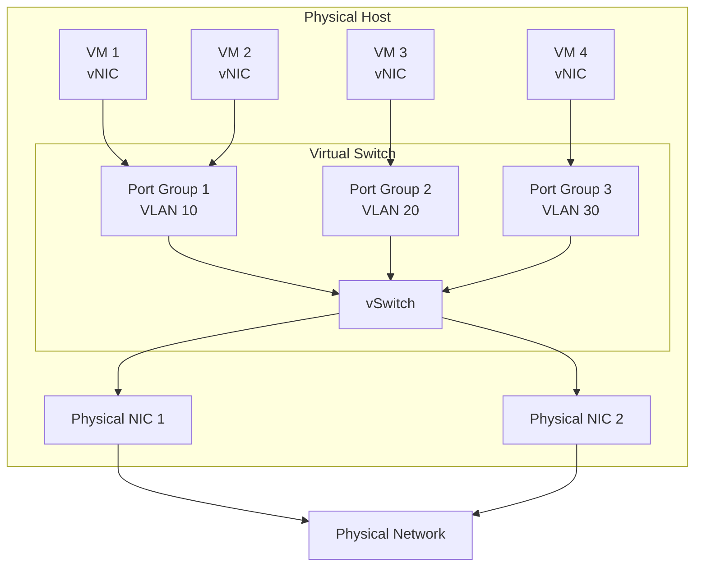
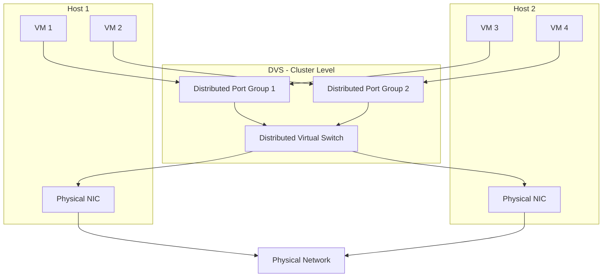
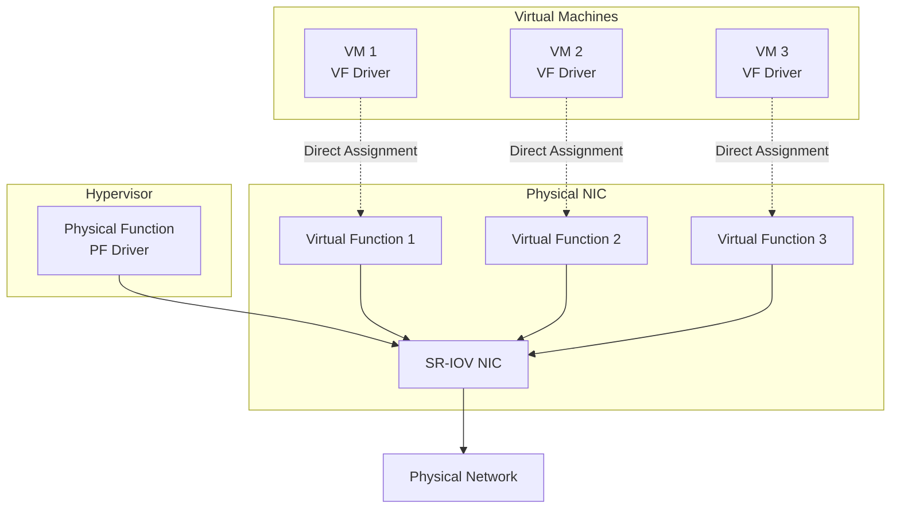

# Virtual Machine Networking

Virtual machine networking is a critical component of virtualized infrastructure, enabling communication between VMs, hosts, physical networks, and external resources. Understanding VM networking is essential for designing secure, performant, and scalable virtualized environments. This section explores virtual networking concepts, architectures, and implementation strategies.

## Virtual Network Components

### Virtual Network Interface Cards (vNICs)

Virtual NICs are software-based network adapters that provide network connectivity to virtual machines. Each VM can have one or more vNICs, similar to physical servers with multiple network cards.

**vNIC Characteristics**:
- **MAC Address**: Each vNIC has a unique MAC address, which can be automatically generated or manually assigned
- **Driver Support**: Requires appropriate drivers in the guest OS (e.g., vmxnet3 for VMware, virtio for KVM)
- **Performance**: Modern vNICs support advanced features like TCP offload, jumbo frames, and SR-IOV
- **Multiple NICs**: VMs can have multiple vNICs for network segmentation (e.g., management, production, backup)

**vNIC Types**:
- **Emulated NICs**: Software-emulated physical NICs (e.g., E1000) with broad compatibility but lower performance
- **Paravirtualized NICs**: Optimized virtual NICs (e.g., VMXNET3, virtio-net) with better performance
- **SR-IOV**: Direct hardware access for near-native performance

### Virtual Switches (vSwitch)

Virtual switches are software-based network switches that connect virtual machines to each other and to physical networks. They operate at Layer 2 of the OSI model, similar to physical switches.



**vSwitch Features**:
- **Port Groups**: Logical groupings of ports with common configuration (VLAN, security, traffic shaping)
- **VLAN Support**: 802.1Q VLAN tagging for network segmentation
- **Link Aggregation**: Combining multiple physical NICs for increased bandwidth and redundancy
- **Traffic Shaping**: QoS policies to control bandwidth allocation
- **Security Policies**: MAC address filtering, promiscuous mode control, forged transmits prevention

### Port Groups

Port groups are logical containers that define network configuration policies applied to connected VMs. They simplify network management by applying consistent settings to multiple VMs.

**Port Group Configuration**:
- **VLAN ID**: VLAN tagging (0-4095, where 0 = no VLAN)
- **Security**: Promiscuous mode, MAC address changes, forged transmits
- **Traffic Shaping**: Average bandwidth, peak bandwidth, burst size
- **NIC Teaming**: Load balancing and failover policies
- **Network I/O Control**: Shares-based traffic prioritization

## Virtual Switch Types

### Standard Virtual Switch (vSwitch)

Standard vSwitches are basic virtual switches configured individually on each host. They provide essential Layer 2 switching functionality.

**Characteristics**:
- **Per-Host Configuration**: Each host has independent vSwitch configuration
- **Management**: Requires manual configuration on each host for consistency
- **Features**: Basic switching, VLAN tagging, link aggregation, traffic shaping
- **Use Cases**: Small deployments, isolated hosts, basic networking requirements

**VMware Standard Switch Example**:
```bash
# Create standard vSwitch
esxcli network vswitch standard add --vswitch-name=vSwitch1

# Add uplink (physical NIC)
esxcli network vswitch standard uplink add --uplink-name=vmnic1 --vswitch-name=vSwitch1

# Create port group
esxcli network vswitch standard portgroup add --portgroup-name=Production --vswitch-name=vSwitch1

# Set VLAN
esxcli network vswitch standard portgroup set --portgroup-name=Production --vlan-id=100
```

### Distributed Virtual Switch (DVS)

Distributed virtual switches provide centralized management and advanced networking features across multiple hosts in a cluster. They offer consistent configuration and enhanced capabilities.

**Characteristics**:
- **Centralized Management**: Single configuration point for all hosts in cluster
- **Consistency**: Automatic synchronization of network settings across hosts
- **Advanced Features**: Network I/O control, port mirroring, NetFlow, LACP
- **vMotion Compatibility**: Network configuration moves with VMs during migration
- **Use Cases**: Enterprise deployments, clusters, environments requiring advanced networking

**Key Features**:
- **Network I/O Control (NIOC)**: Prioritize traffic types (VM traffic, vMotion, storage, management)
- **Port Mirroring**: Copy traffic from one port to another for monitoring
- **NetFlow**: Export network flow data for analysis
- **LACP Support**: Link Aggregation Control Protocol for dynamic link aggregation
- **Private VLANs**: Additional isolation within VLANs



### Open vSwitch (OVS)

Open vSwitch is an open-source virtual switch supporting advanced features like OpenFlow, VXLAN, and GRE tunneling. It's widely used in cloud environments and SDN deployments.

**Key Features**:
- **OpenFlow Support**: Programmable forwarding with SDN controllers
- **Network Virtualization**: VXLAN, GRE, STT tunneling protocols
- **Advanced QoS**: Policing and shaping with hierarchical token buckets
- **Port Mirroring**: SPAN, RSPAN, ERSPAN
- **Database**: OVSDB protocol for management and configuration

## Network Topologies

### Bridged Networking

Bridged networking connects VMs directly to the physical network, making them appear as physical devices on the same network segment.

**Characteristics**:
- VMs receive IP addresses from the physical network DHCP server
- Direct access to network services (file shares, printers)
- VMs are visible and accessible from the physical network
- Use case: Production servers, services requiring direct network access

**Configuration Example (KVM)**:
```bash
# Create bridge interface
ip link add br0 type bridge
ip link set br0 up

# Add physical interface to bridge
ip link set eth0 master br0

# Configure VM with bridged network
<interface type='bridge'>
  <source bridge='br0'/>
  <model type='virtio'/>
</interface>
```

### NAT Networking

Network Address Translation (NAT) provides outbound connectivity for VMs while hiding them behind the host's IP address. VMs can access external networks but are not directly accessible from outside.

**Characteristics**:
- VMs use private IP addresses (e.g., 192.168.x.x)
- Host performs NAT for outbound traffic
- Inbound access requires port forwarding
- Use case: Development environments, isolated workloads, security-sensitive applications

### Host-Only Networking

Host-only networking creates an isolated network between VMs and the host, with no external connectivity.

**Characteristics**:
- VMs can communicate with each other and the host
- No access to physical network or internet
- Complete network isolation
- Use case: Testing, development, security labs, isolated environments

### Internal Networking

Internal networking creates isolated networks between VMs only, without host access.

**Characteristics**:
- VMs on the same internal network can communicate
- No host or external access
- Multiple isolated internal networks possible
- Use case: Multi-tier applications, DMZ simulation, security testing

## Advanced Networking Features

### VLAN Configuration

VLANs provide network segmentation within virtual environments, enabling traffic isolation and security.

**VLAN Tagging Modes**:
- **Virtual Switch Tagging (VST)**: vSwitch handles VLAN tagging (most common)
- **External Switch Tagging (EST)**: Physical switch performs tagging
- **Virtual Guest Tagging (VGT)**: Guest OS handles VLAN tagging

**VMware VLAN Configuration**:
```bash
# Set VLAN on port group
esxcli network vswitch standard portgroup set --portgroup-name=WebServers --vlan-id=100
esxcli network vswitch standard portgroup set --portgroup-name=AppServers --vlan-id=200
esxcli network vswitch standard portgroup set --portgroup-name=DBServers --vlan-id=300

# VLAN trunk (all VLANs)
esxcli network vswitch standard portgroup set --portgroup-name=Trunk --vlan-id=4095
```

### NIC Teaming and Load Balancing

NIC teaming combines multiple physical NICs for increased bandwidth and redundancy.

**Load Balancing Policies**:
- **Route Based on Originating Port ID**: Simple, uses originating virtual port ID (default)
- **Route Based on IP Hash**: Uses source/destination IP for distribution (requires LACP on switch)
- **Route Based on Source MAC Hash**: Uses source MAC address
- **Use Explicit Failover Order**: No load balancing, uses specified failover order
- **Route Based on Physical NIC Load**: Monitors NIC utilization and distributes traffic (DVS only)

**Failover Detection**:
- **Link Status Only**: Detects physical link failures (default)
- **Beacon Probing**: Sends beacon packets to detect failures beyond direct link

### SR-IOV (Single Root I/O Virtualization)

SR-IOV allows a single physical NIC to present multiple virtual functions (VFs) that can be directly assigned to VMs, bypassing the hypervisor for near-native performance.

**SR-IOV Architecture**:


**Benefits**:
- Near-native network performance
- Reduced CPU overhead
- Lower latency
- Hardware-accelerated features (checksumming, segmentation)

**Limitations**:
- Limited vMotion support (requires special configuration)
- Requires SR-IOV capable NICs and drivers
- Number of VFs limited by hardware (typically 64-256 per NIC)

### Network I/O Control (NIOC)

NIOC prioritizes different types of traffic on distributed virtual switches using shares-based allocation.

**Traffic Types**:
- VM traffic (production workloads)
- vMotion traffic (live migration)
- iSCSI storage traffic
- NFS storage traffic
- Management traffic
- Fault tolerance traffic
- Replication traffic

**Configuration**:
```bash
# Enable NIOC on DVS (VMware)
# Set shares for traffic types:
# - VM Traffic: High (100 shares)
# - vMotion: Normal (50 shares)
# - Management: Low (25 shares)
# - Storage (iSCSI): High (100 shares)
```

## Network Security

### Security Policies

Virtual switches enforce security policies to prevent unauthorized network access and attacks.

**Policy Types**:
- **Promiscuous Mode**: Reject (default) or Accept - controls whether VMs can see all network traffic
- **MAC Address Changes**: Reject or Accept (default) - prevents MAC spoofing
- **Forged Transmits**: Reject or Accept (default) - prevents VMs from sending frames with spoofed source MAC

**Best Practices**:
```bash
# Disable promiscuous mode (VMware)
esxcli network vswitch standard portgroup policy security set \
  --portgroup-name=Production \
  --allow-promiscuous=false

# Prevent MAC changes
esxcli network vswitch standard portgroup policy security set \
  --portgroup-name=Production \
  --allow-mac-change=false

# Prevent forged transmits
esxcli network vswitch standard portgroup policy security set \
  --portgroup-name=Production \
  --allow-forged-transmits=false
```

### Network Segmentation

Proper network segmentation isolates workloads and limits attack surfaces.

**Segmentation Strategies**:
- **VLAN Segmentation**: Separate VLANs for different tiers (web, app, database)
- **Port Group Isolation**: Different port groups for different security zones
- **Private VLANs**: Additional isolation within VLANs (promiscuous, isolated, community)
- **Firewall Rules**: Virtual firewalls between network segments

### Virtual Firewalls

Virtual firewalls provide distributed security at the VM network interface level.

**Examples**:
- **VMware NSX Distributed Firewall**: Micro-segmentation at the vNIC level
- **AWS Security Groups**: Stateful firewall rules for EC2 instances
- **Azure Network Security Groups**: Layer 4 firewall for virtual networks
- **iptables/nftables**: Linux-based host firewalls

## Network Performance Optimization

### Best Practices

1. **Use Paravirtualized NICs**: Deploy virtio-net (KVM) or VMXNET3 (VMware) for better performance
2. **Enable TCP Offload**: Offload checksumming and segmentation to NIC hardware
3. **Configure Jumbo Frames**: Increase MTU to 9000 for reduced overhead (ensure physical network support)
4. **Implement NIC Teaming**: Increase bandwidth and provide redundancy
5. **Separate Traffic Types**: Use separate physical NICs or VLANs for storage, management, and VM traffic
6. **Monitor Network Utilization**: Track bandwidth, packet drops, errors
7. **Right-Size vNICs**: Match vNIC count and bandwidth to workload requirements

### Monitoring and Troubleshooting

**Key Metrics**:
- **Throughput**: Bandwidth utilization (Mbps/Gbps)
- **Packet Rate**: Packets per second (pps)
- **Latency**: Round-trip time (RTT)
- **Packet Loss**: Dropped packets percentage
- **Errors**: CRC errors, collisions, overruns

**Troubleshooting Tools**:
```bash
# Check vSwitch configuration (VMware)
esxcli network vswitch standard list

# Monitor network statistics
esxcli network nic stats get -n vmnic0

# Packet capture
tcpdump -i vmnic0 -w capture.pcap

# Performance testing
iperf3 -c server_ip -t 60 -i 5
```

## Cloud Provider Implementations

### AWS VPC Networking

AWS Virtual Private Cloud provides isolated network environments with virtual routers, subnets, and gateways.

**Key Components**:
- **VPC**: Logically isolated virtual network
- **Subnets**: IP address ranges within VPC (public/private)
- **Internet Gateway**: Enables internet access for public subnets
- **NAT Gateway**: Provides outbound internet for private subnets
- **Elastic Network Interface (ENI)**: Virtual network interface for EC2 instances
- **Security Groups**: Stateful firewall at instance level
- **Network ACLs**: Stateless firewall at subnet level

### Azure Virtual Networks

Azure Virtual Networks (VNet) provide network isolation and segmentation for Azure resources.

**Key Components**:
- **VNet**: Isolated network with address space
- **Subnets**: Subdivisions of VNet address space
- **Network Interface (NIC)**: Virtual NIC attached to VMs
- **Network Security Groups (NSG)**: Layer 4 firewall rules
- **VNet Peering**: Connect VNets for resource sharing
- **Virtual Network Gateway**: VPN and ExpressRoute connectivity

### GCP VPC Networking

Google Cloud Platform Virtual Private Cloud offers global software-defined networking.

**Key Components**:
- **VPC Network**: Global virtual network resource
- **Subnets**: Regional IP address ranges
- **Firewall Rules**: Stateful firewall policies
- **Routes**: Custom route tables
- **Cloud NAT**: Managed NAT service
- **Cloud Load Balancing**: Global load balancing

## Summary

Virtual machine networking is a foundational element of virtualized infrastructure, providing connectivity, segmentation, and security for virtual workloads. Key takeaways:

- **Virtual switches** connect VMs to each other and physical networks with features like VLAN support, traffic shaping, and security policies
- **Distributed virtual switches** provide centralized management and advanced features for enterprise deployments
- **Network topologies** (bridged, NAT, host-only, internal) serve different use cases and security requirements
- **Advanced features** like SR-IOV, NIC teaming, and NIOC optimize performance and availability
- **Security policies** and segmentation protect workloads from unauthorized access and attacks
- **Cloud providers** offer managed virtual networking with global reach and integrated security

Understanding virtual networking enables you to design robust, secure, and performant virtual infrastructures that meet modern application requirements.
