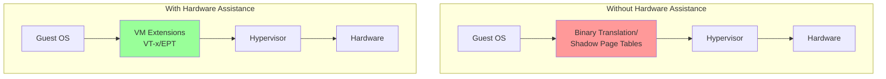
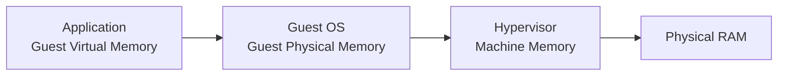
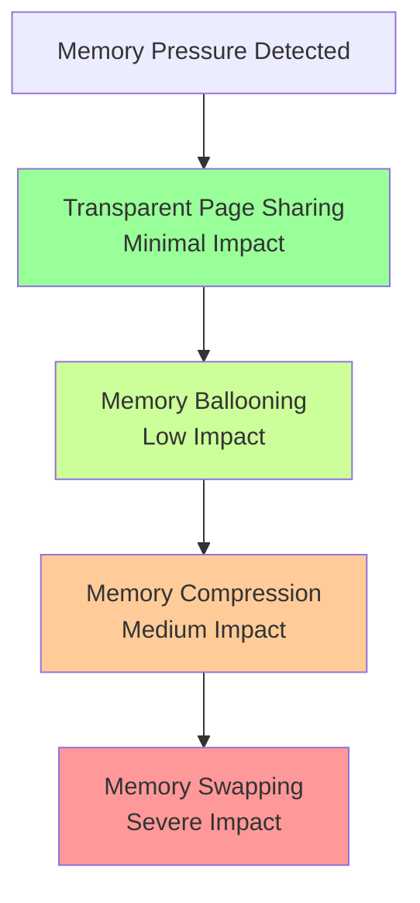
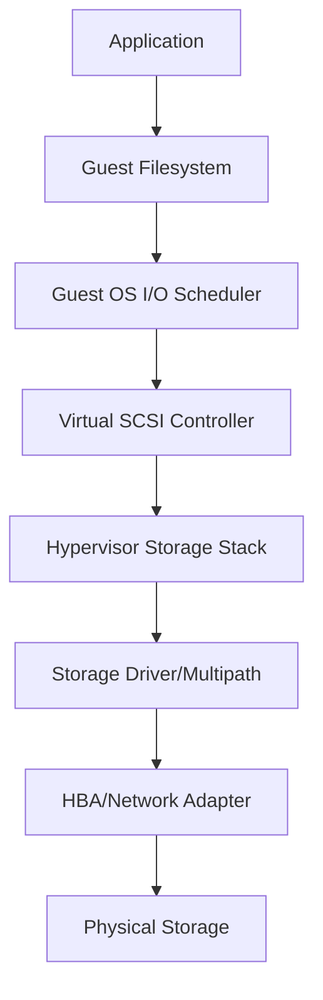
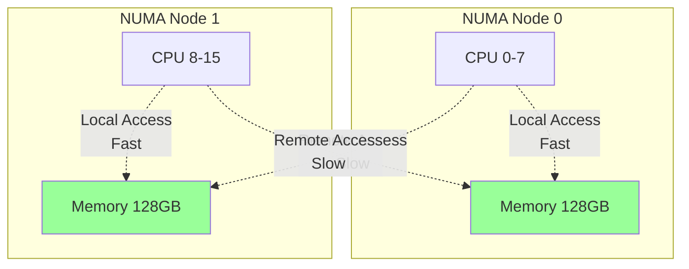

# Virtualization Performance and Optimization

Virtualization introduces an abstraction layer between hardware and guest operating systems, which can impact performance. Understanding performance characteristics, monitoring methodologies, and optimization techniques is essential for maintaining high-performing virtual environments. This section explores performance considerations and best practices for virtualized infrastructures.

## Performance Overhead

### Virtualization Tax

Virtualization overhead, often called the "virtualization tax," represents the performance cost of the hypervisor layer. Modern virtualization technologies have minimized this overhead significantly.

**Historical vs. Modern Overhead**:
- **Early Virtualization (2000s)**: 20-30% overhead for CPU-intensive workloads
- **Hardware-Assisted Virtualization**: 5-10% overhead with Intel VT-x/AMD-V
- **Modern Paravirtualization**: 1-5% overhead with optimized drivers
- **Container Virtualization**: <1% overhead (near-native performance)

**Sources of Overhead**:
- Context switching between guest and hypervisor
- I/O device emulation
- Memory management (page table virtualization)
- Interrupt handling
- Network packet processing

### Hardware-Assisted Virtualization

Modern CPUs include extensions specifically designed to reduce virtualization overhead.

**Intel VT-x / AMD-V (CPU Virtualization)**:
- Hardware support for VM execution
- Eliminates binary translation overhead
- Enables efficient privilege level transitions
- Mandatory for 64-bit guests

**Intel EPT / AMD RVI (Memory Virtualization)**:
- Extended Page Tables / Rapid Virtualization Indexing
- Hardware-accelerated memory address translation
- Eliminates shadow page table overhead
- Significant performance improvement for memory-intensive workloads

**Intel VT-d / AMD-Vi (I/O Virtualization)**:
- Direct device assignment to VMs
- DMA remapping for security
- Interrupt remapping
- Enables SR-IOV and GPU passthrough



## CPU Performance

### CPU Scheduling

Hypervisors schedule virtual CPU (vCPU) time on physical CPU (pCPU) cores using sophisticated scheduling algorithms.

**VMware CPU Scheduling**:
- **Proportional Share-Based**: Allocates CPU time based on shares
- **Co-Scheduling**: Ensures vCPUs in SMP VMs run simultaneously (deprecated in modern versions)
- **Relaxed Co-Scheduling**: Allows asynchronous vCPU scheduling with better efficiency

**CPU Scheduler Metrics**:
- **%RDY (Ready Time)**: Time VM is ready to run but waiting for pCPU
  - Healthy: <5%
  - Warning: 5-10%
  - Critical: >10%
- **%CSTP (Co-Stop)**: Time vCPUs wait for co-scheduling
  - Should be <3%
- **%MLMTD (CPU Limit)**: Time constrained by CPU limit setting

### CPU Resource Controls

**Shares**:
- Relative priority during contention (high: 2000, normal: 1000, low: 500)
- Only active during CPU contention
- Example: VM with 2000 shares gets 2x CPU time compared to VM with 1000 shares

**Reservations**:
- Guaranteed CPU resources (MHz or GHz)
- Reduces cluster capacity (reserved CPU cannot be used elsewhere)
- Use sparingly for critical applications

**Limits**:
- Maximum CPU usage cap
- Prevents VM from consuming more than specified CPU
- Use carefully (can cause performance issues if set too low)

### CPU Optimization Best Practices

1. **Right-Size vCPUs**:
   - Don't over-provision vCPUs
   - Start with 1-2 vCPUs and scale up based on actual usage
   - More vCPUs ≠ better performance (increases scheduling overhead)

   ```bash
   # Monitor vCPU usage
   esxtop
   # Press 'c' for CPU view
   # Check %USED, %RDY, %CSTP
   ```

2. **Enable CPU Hot Add** (if supported):
   - Add vCPUs without VM downtime
   - Requires guest OS support

3. **Use CPU Affinity Sparingly**:
   - Pins vCPUs to specific pCPUs
   - Reduces scheduler flexibility
   - Only use for specific workloads (NUMA-sensitive applications)

4. **Configure CPU Reservations for Critical VMs**:
   ```bash
   # Set CPU reservation (PowerCLI)
   Get-VM -Name "CriticalVM" | Set-VMResourceConfiguration -CpuReservationMhz 4000
   ```

5. **Monitor CPU Ready Time**:
   ```bash
   # Query CPU ready time (VMware)
   esxtop -b -d 5 -n 12 | grep CPU
   ```

6. **Disable Unnecessary Hardware**:
   - Remove unused devices (floppy, CD-ROM, parallel ports)
   - Reduces device emulation overhead

## Memory Performance

### Memory Virtualization

Hypervisors manage memory through multiple layers of address translation.

**Memory Address Types**:
- **Guest Virtual Memory**: Application view of memory
- **Guest Physical Memory**: Guest OS view of memory
- **Machine Memory**: Actual physical RAM



### Memory Management Techniques

**Transparent Page Sharing (TPS)**:
- Identifies identical memory pages across VMs
- Merges duplicate pages to save physical memory
- Security concerns led to it being disabled by default (salting)
- Effectiveness decreased with modern workloads

**Memory Ballooning**:
- Hypervisor inflates "balloon" driver inside guest OS
- Guest OS releases memory to balloon
- Hypervisor reclaims physical memory
- Graceful memory reclamation (guest OS makes decisions)

**Memory Compression**:
- Compresses memory pages before swapping to disk
- 2:1 to 4:1 compression ratio typical
- CPU overhead vs. disk I/O trade-off
- Activated before swapping

**Memory Swapping**:
- Last resort for memory reclamation
- Swaps guest memory to disk (.vswp file)
- Severe performance impact
- Indicates host memory pressure



### Memory Resource Controls

**Shares**:
- Relative priority during memory contention
- High: 20 shares per MB, Normal: 10, Low: 5

**Reservations**:
- Guaranteed physical memory
- Prevents ballooning and swapping for reserved memory
- Critical for performance-sensitive applications

**Limits**:
- Maximum physical memory allocation
- Triggers memory reclamation techniques when exceeded

### Memory Optimization Best Practices

1. **Avoid Memory Over-Commitment in Production**:
   - Keep memory usage <80% of host capacity
   - Leave headroom for spikes and maintenance

2. **Set Memory Reservations for Critical VMs**:
   ```bash
   # Set memory reservation (PowerCLI)
   Get-VM -Name "DatabaseVM" | Set-VMResourceConfiguration -MemReservationGB 32
   ```

3. **Monitor Memory Metrics**:
   ```bash
   # esxtop memory view
   esxtop
   # Press 'm' for memory view
   # Check MCTLSZ (balloon), SWCUR (swap), ZIP (compression)
   ```

4. **Size VM Memory Appropriately**:
   - Monitor actual memory usage in guest OS
   - Remove unused memory allocation
   - Use memory hot add for flexibility

5. **Enable Large Memory Pages**:
   - 2MB pages instead of 4KB
   - Reduces TLB misses
   - Automatic in most modern hypervisors

6. **Disable TPS Salting for Trusted Environments**:
   ```bash
   # Disable TPS salting (VMware)
   esxcli system settings advanced set -o /Mem/ShareForceSalting -i 0
   ```

## Storage Performance

### Storage I/O Path

Understanding the I/O path helps identify performance bottlenecks.

**Storage I/O Stack**:


### Storage Performance Metrics

**Key Metrics**:
- **IOPS**: Input/Output Operations Per Second
  - Read IOPS, Write IOPS, Random vs. Sequential
- **Latency**: Time to complete I/O operation
  - DAVG (Device Average Latency): Storage array latency
  - KAVG (Kernel Average Latency): Hypervisor latency
  - GAVG (Guest Average Latency): Total latency seen by guest
  - **Healthy**: <20ms
  - **Warning**: 20-50ms
  - **Critical**: >50ms
- **Throughput**: MB/s or GB/s
- **Outstanding I/Os**: Queue depth

### Storage Optimization Best Practices

1. **Use Paravirtualized Storage Controllers**:
   - VMware PVSCSI: Up to 600,000 IOPS per controller
   - VirtIO SCSI: High performance for KVM
   - Requires driver installation in guest OS

2. **Configure Multiple Virtual Disks**:
   - Spread I/O across multiple SCSI controllers
   - Maximum 15 disks per PVSCSI controller
   - 4 PVSCSI controllers per VM maximum

3. **Align Guest Partitions**:
   - Misalignment can reduce performance by 30-50%
   - Modern OSes align automatically (Windows Server 2008+, Linux 2.6.25+)

   ```bash
   # Check alignment (Linux)
   parted /dev/sda align-check optimal 1

   # Windows: diskpart
   list disk
   select disk 0
   list partition
   # Check offset divisible by 4096
   ```

4. **Use Native Block Size**:
   - Match guest filesystem block size to storage array block size
   - Typically 4KB or 8KB

5. **Enable Storage Acceleration**:
   - VAAI (VMware vStorage APIs for Array Integration)
   - Hardware offload for cloning, zeroing, locking

6. **Configure Multipathing**:
   ```bash
   # Set PSP to Round Robin for active-active arrays
   esxcli storage nmp device set --device naa.xxx --psp VMW_PSP_RR

   # Set IOPS limit for path switching
   esxcli storage nmp psp roundrobin deviceconfig set --device naa.xxx --iops 1 --type iops
   ```

7. **Monitor Storage Latency**:
   ```bash
   # esxtop storage view
   esxtop
   # Press 'd' for disk adapter view
   # Press 'u' for disk VM view
   # Check DAVG/cmd, KAVG/cmd, GAVG/cmd
   ```

8. **Use SSD/Flash for Latency-Sensitive Workloads**:
   - Databases, transaction processing, VDI
   - NVMe for ultra-low latency requirements

## Network Performance

### Network I/O Path

**Network Stack**:
- Guest OS network stack
- Virtual NIC (vNIC)
- Virtual switch (vSwitch)
- Physical NIC (pNIC)
- Physical network

### Network Optimization Best Practices

1. **Use Paravirtualized Network Adapters**:
   - VMXNET3 (VMware): Up to 10 Gbps per vNIC
   - VirtIO-net (KVM): High performance
   - E1000E: Emulated, lower performance (avoid in production)

2. **Enable Jumbo Frames**:
   - Increase MTU to 9000 for reduced overhead
   - Must be enabled on guest, vSwitch, pNIC, and physical network

   ```bash
   # Set MTU on vSwitch (VMware)
   esxcli network vswitch standard set -v vSwitch0 -m 9000

   # Set MTU on VMkernel adapter
   esxcli network ip interface set -i vmk0 -m 9000

   # Guest OS (Linux)
   ip link set eth0 mtu 9000
   ```

3. **Configure Network I/O Control (NIOC)**:
   - Prioritize critical traffic types
   - Distributed vSwitch feature (VMware)

4. **Use SR-IOV for Maximum Performance**:
   - Direct hardware access
   - Near-native performance
   - Trade-off: Reduced vMotion flexibility

5. **Enable Network Offload Features**:
   - TCP Segmentation Offload (TSO)
   - Large Receive Offload (LRO)
   - Checksum Offload

6. **Implement NIC Teaming**:
   - Increase bandwidth
   - Provide redundancy
   - Use appropriate load balancing policy

7. **Monitor Network Metrics**:
   ```bash
   # esxtop network view
   esxtop
   # Press 'n' for network view
   # Check %DRPTX (transmit drops), %DRPRX (receive drops)
   ```

## NUMA Optimization

### NUMA Architecture

Non-Uniform Memory Access (NUMA) divides CPUs and memory into nodes, where memory access is faster for local memory than remote memory.



### NUMA Best Practices

1. **Size VMs to Fit Within NUMA Nodes**:
   - Check host NUMA configuration
   - Size VMs ≤ NUMA node size when possible

   ```bash
   # Check NUMA configuration (VMware)
   esxcli hardware memory get

   # View NUMA topology
   vsish -e cat /hardware/numa/info
   ```

2. **Enable NUMA Home Node**:
   - Assigns VM to specific NUMA node
   - Reduces remote memory access

3. **Use vNUMA for Large VMs**:
   - Exposes NUMA topology to guest OS
   - Allows NUMA-aware applications to optimize
   - Automatically enabled for VMs with >8 vCPUs

4. **Monitor NUMA Locality**:
   ```bash
   # Check NUMA statistics
   esxtop
   # Press 'm' for memory view
   # Check N%L (NUMA local memory percentage)
   # Healthy: >80%
   ```

## Performance Monitoring and Troubleshooting

### Key Performance Indicators (KPIs)

**CPU**:
- CPU Utilization (%): <80% average
- CPU Ready Time (%): <5%
- CPU Co-Stop (%): <3%

**Memory**:
- Memory Utilization (%): <80%
- Ballooning (MB): 0 (acceptable under load)
- Swapping (MB): 0 (always investigate)
- Compression (MB): Minimal

**Storage**:
- Average Latency (ms): <20ms
- IOPS: Within array capabilities
- Throughput (MB/s): Within limits
- Queue Depth: <32 (depends on storage)

**Network**:
- Utilization (%): <70% of link capacity
- Packet Drops (%): <1%
- Latency (ms): <5ms (LAN)

### Monitoring Tools

**VMware**:
- **esxtop**: Real-time performance monitoring
- **vCenter Performance Charts**: Historical metrics
- **vRealize Operations**: Advanced analytics and capacity planning
- **esxcli**: Command-line statistics

**Hyper-V**:
- **Performance Monitor**: Real-time counters
- **System Center Operations Manager**: Enterprise monitoring
- **PowerShell**: Scripted monitoring

**KVM**:
- **virsh**: VM statistics
- **virt-top**: Top-like VM monitoring
- **Prometheus + Grafana**: Metrics collection and visualization
- **libvirt**: API for monitoring

### Troubleshooting Methodology

1. **Identify Symptoms**: Performance degradation, timeouts, errors

2. **Collect Data**: Metrics, logs, configurations
   ```bash
   # Generate support bundle (VMware)
   vm-support

   # Performance snapshot
   esxtop -b -d 5 -n 720 > esxtop.csv
   ```

3. **Analyze Metrics**: Compare against baselines and thresholds

4. **Isolate Root Cause**: CPU, memory, storage, or network bottleneck

5. **Implement Solution**: Right-size, optimize configuration, add resources

6. **Validate Fix**: Monitor metrics after changes

## Performance Testing

### Benchmarking Tools

**CPU**:
- **Geekbench**: Cross-platform CPU benchmark
- **SPEC CPU**: Industry-standard CPU benchmark
- **sysbench**: Multi-threaded CPU test

**Memory**:
- **STREAM**: Memory bandwidth benchmark
- **mbw**: Memory bandwidth test

**Storage**:
- **fio**: Flexible I/O tester
  ```bash
  # Random 4K read IOPS test
  fio --name=randread --ioengine=libaio --rw=randread --bs=4k \
      --numjobs=4 --size=10G --runtime=60 --group_reporting
  ```
- **iometer**: Windows I/O benchmark
- **CrystalDiskMark**: Windows sequential/random tests

**Network**:
- **iperf3**: Network throughput testing
  ```bash
  # Server
  iperf3 -s

  # Client
  iperf3 -c server_ip -t 60 -P 4
  ```
- **netperf**: Network performance measurement

## Summary

Virtualization performance optimization requires understanding the abstraction layers, monitoring key metrics, and applying best practices. Key takeaways:

- **Hardware-assisted virtualization** (VT-x, EPT, VT-d) minimizes virtualization overhead to <5%
- **CPU optimization** focuses on right-sizing vCPUs, monitoring ready time, and using shares/reservations appropriately
- **Memory management** uses techniques like ballooning, compression, and swapping, with proper sizing to avoid performance degradation
- **Storage performance** depends on controller type, alignment, multipathing, and latency monitoring
- **Network optimization** uses paravirtualized NICs, jumbo frames, and SR-IOV for maximum throughput
- **NUMA awareness** improves performance for large VMs by reducing remote memory access
- **Continuous monitoring** with tools like esxtop, vCenter, and custom scripts ensures optimal performance
- **Performance testing** with benchmarking tools validates configurations and identifies bottlenecks

Understanding and applying these principles ensures your virtual infrastructure delivers the performance required for modern workloads.
