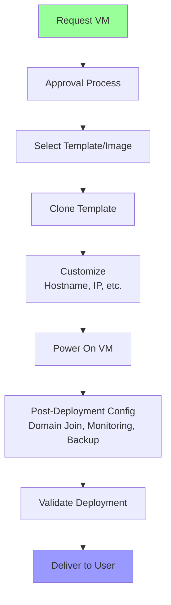
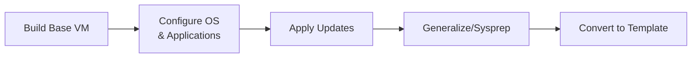
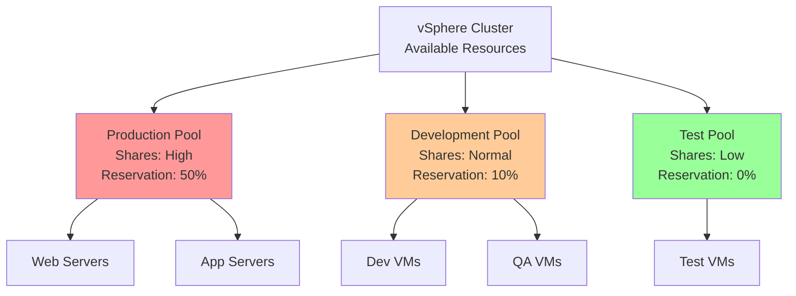
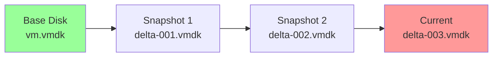
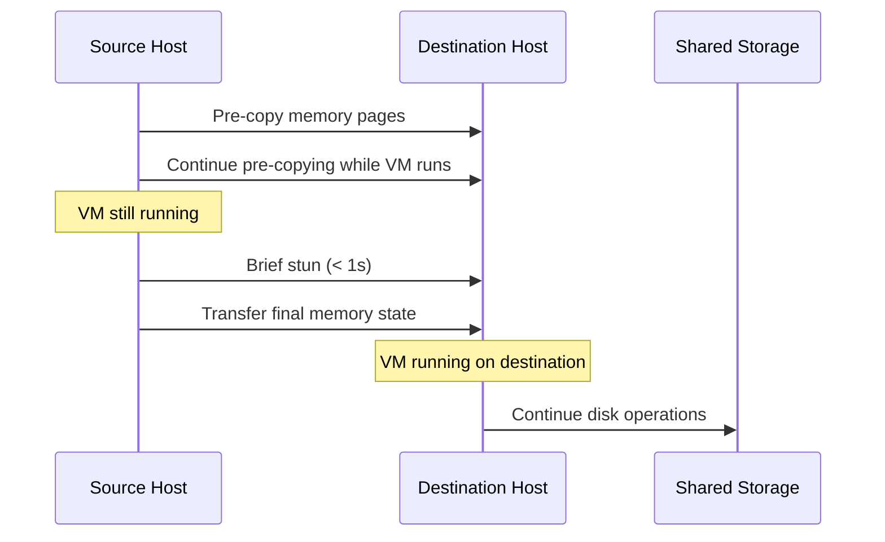

# Virtual Machine Management

Effective virtual machine management is crucial for maintaining reliable, secure, and efficient virtualized infrastructure. This section covers VM lifecycle management, automation, templates, resource management, and operational best practices for managing virtual environments at scale.

## VM Lifecycle Management

### VM Creation

Virtual machine creation involves defining compute, memory, storage, and network configurations.

**Creation Methods**:

1. **Manual Creation (GUI)**:
   - vSphere Client, Hyper-V Manager, virt-manager
   - Point-and-click interface
   - Use case: One-off VMs, small deployments

2. **Command-Line Creation**:
   ```bash
   # VMware PowerCLI
   New-VM -Name "WebServer01" -VMHost "esxi01.domain.com" \
     -Datastore "datastore1" -DiskGB 100 -MemoryGB 8 -NumCpu 4 \
     -NetworkName "Production" -GuestId "ubuntu64Guest"

   # KVM virsh
   virt-install --name webserver01 \
     --ram 8192 --vcpus 4 --disk path=/var/lib/libvirt/images/web01.qcow2,size=100 \
     --network network=default --os-variant ubuntu20.04 \
     --graphics none --console pty,target_type=serial

   # Hyper-V PowerShell
   New-VM -Name "WebServer01" -MemoryStartupBytes 8GB \
     -BootDevice VHD -NewVHDPath "C:\VMs\web01.vhdx" \
     -NewVHDSizeBytes 100GB -Generation 2 -Switch "Production"
   ```

3. **Template-Based Deployment**:
   - Clone from pre-configured templates
   - Fastest, most consistent method
   - Use case: Production deployments, standardization

4. **Infrastructure as Code (IaC)**:
   - Terraform, CloudFormation, ARM templates
   - Version-controlled, repeatable deployments
   - Use case: DevOps workflows, multi-cloud environments

### VM Provisioning Workflow



### VM Configuration Changes

**Modifying Running VMs**:
- **CPU Hot Add**: Add vCPUs without shutdown (requires guest OS support)
- **Memory Hot Add**: Increase memory online (requires guest OS support)
- **Hot Extend**: Expand virtual disks online
- **Network Changes**: Add/remove vNICs online

**Configuration Constraints**:
- Some changes require VM shutdown (reducing CPUs/memory, changing hardware version)
- Guest OS must support hot add features
- Application restart may be needed to utilize new resources

```bash
# VMware: Enable CPU and memory hot add
Get-VM "WebServer01" | Set-VM -MemoryHotAddEnabled $true -CpuHotAddEnabled $true

# Add vCPU to running VM
Get-VM "WebServer01" | Set-VM -NumCpu 8

# Increase memory
Get-VM "WebServer01" | Set-VM -MemoryGB 16
```

### VM Deletion

**Deletion Process**:
1. **Shutdown VM gracefully**
2. **Remove from inventory** (VM still exists on storage)
3. **Delete from disk** (permanently removes VM files)

**Best Practices**:
- Take final snapshot or backup before deletion
- Verify VM is no longer needed (check with stakeholders)
- Document deletion (change management)
- Remove from monitoring, backup, and documentation

```bash
# VMware: Remove VM from inventory and delete files
Get-VM "OldServer" | Stop-VM -Confirm:$false
Get-VM "OldServer" | Remove-VM -DeletePermanently -Confirm:$false

# KVM: Undefine and delete storage
virsh destroy oldserver
virsh undefine oldserver --remove-all-storage
```

## Templates and Cloning

### VM Templates

Templates are master copies of VMs used for rapid, consistent deployment. They cannot be powered on or modified directly.

**Template Creation Process**:



**Preparation Steps**:

1. **Build and Configure Base VM**:
   - Install OS with minimal packages
   - Configure standard settings (timezone, locale)
   - Install VMware Tools / Integration Services / qemu-guest-agent
   - Apply security hardening

2. **Install Standard Software**:
   - Monitoring agents
   - Antivirus
   - Backup agents
   - Configuration management agents (Ansible, Puppet, Chef)

3. **Apply Updates and Patches**:
   - OS patches
   - Application updates
   - Driver updates

4. **Sysprep / Generalize**:
   - **Windows**: Run sysprep to remove unique identifiers
     ```cmd
     C:\Windows\System32\Sysprep\sysprep.exe /generalize /oobe /shutdown
     ```
   - **Linux**: Clean up unique identifiers manually or with virt-sysprep
     ```bash
     # Remove SSH host keys
     rm -f /etc/ssh/ssh_host_*

     # Remove machine-id
     truncate -s 0 /etc/machine-id

     # Remove network rules
     rm -f /etc/udev/rules.d/70-persistent-net.rules

     # Clean package cache
     apt-get clean
     yum clean all

     # Remove bash history
     history -c
     rm -f /root/.bash_history
     ```

5. **Convert to Template**:
   ```bash
   # VMware: Convert VM to template
   Get-VM "BaseTemplate" | Set-VM -ToTemplate -Confirm:$false

   # Create template from existing VM (leaves original intact)
   New-Template -Name "Ubuntu2004Template" -VM "BaseVM" -Location "Templates"
   ```

### Cloning

**Full Clone**:
- Complete independent copy
- No dependency on source
- Requires full disk space allocation

**Linked Clone**:
- References base disk (parent)
- Stores only differences (delta disks)
- Fast creation, space-efficient
- Dependent on parent (cannot delete parent)
- Use case: VDI, testing environments

```bash
# VMware: Deploy from template
New-VM -Name "WebServer02" -Template "Ubuntu2004Template" \
  -Datastore "datastore1" -VMHost "esxi01.domain.com"

# KVM: Clone VM
virt-clone --original base-ubuntu --name webserver02 --auto-clone

# Create linked clone (VMware)
New-VM -Name "TestVM" -VM "BaseVM" -LinkedClone \
  -ReferenceSnapshot "ClonePoint" -VMHost "esxi01.domain.com"
```

### Customization Specifications

Customization specs automate post-deployment configuration (hostname, IP address, domain join).

**Customization Spec Components**:
- Computer name (fixed or generated)
- Network settings (DHCP or static IP)
- Windows license key
- Domain/workgroup settings
- Administrator password
- Timezone and locale
- Run-once commands

```bash
# VMware: Create customization spec
New-OSCustomizationSpec -Name "LinuxStaticIP" -OSType Linux \
  -DnsServer "192.168.1.10","192.168.1.11" -Domain "domain.com" \
  -NamingScheme vm

# Deploy with customization
New-VM -Name "WebServer03" -Template "Ubuntu2004Template" \
  -OSCustomizationSpec "LinuxStaticIP" -Datastore "datastore1"
```

## Resource Management

### Resource Pools

Resource pools provide hierarchical resource management and isolation for groups of VMs.



**Resource Pool Benefits**:
- Hierarchical resource allocation
- Isolation between workload types
- Simplified resource management
- Delegation of administrative control

**Resource Pool Configuration**:
```bash
# VMware: Create resource pool
New-ResourcePool -Name "Production" -Location "Cluster01" \
  -CpuSharesLevel High -MemSharesLevel High \
  -CpuReservationMhz 50000 -MemReservationGB 256

# Move VM to resource pool
Move-VM -VM "WebServer01" -Destination "Production"
```

### Shares, Reservations, and Limits

**Shares**:
- Relative priority during resource contention
- High: 2x Normal, Normal: 1x, Low: 0.5x
- Only matter when resources are constrained

**Reservations**:
- Guaranteed minimum resources
- Reduces available cluster capacity
- Use for critical applications requiring consistent performance

**Limits**:
- Maximum resource cap
- Prevents resource overconsumption
- Use cautiously (can artificially constrain performance)

**Configuration Example**:
```bash
# Set CPU and memory configuration
Get-VM "DatabaseServer" | Set-VMResourceConfiguration \
  -CpuReservationMhz 8000 -CpuLimitMhz 16000 -CpuSharesLevel High \
  -MemReservationGB 64 -MemLimitGB 128 -MemSharesLevel High
```

### Distributed Resource Scheduler (DRS)

DRS automatically balances VM workloads across cluster hosts for optimal resource utilization.

**DRS Features**:
- **Initial Placement**: Places new VMs on optimal hosts
- **Load Balancing**: Migrates VMs to balance cluster load
- **Automation Levels**:
  - Manual: Provides recommendations, no automatic action
  - Partially Automated: Automatic initial placement, manual migration approval
  - Fully Automated: Automatic placement and migration

**DRS Rules**:
- **Affinity Rules**: Keep VMs together on same host
- **Anti-Affinity Rules**: Keep VMs on separate hosts (for HA)
- **VM-Host Affinity**: Constrain VMs to specific hosts
- **DRS Groups**: Group VMs and hosts for rules

```bash
# Create anti-affinity rule (keep VMs on separate hosts)
New-DrsRule -Name "SeparateDBServers" -Cluster "Cluster01" \
  -VM (Get-VM "DB01","DB02") -KeepTogether $false -Enabled $true
```

### High Availability (HA)

HA automatically restarts VMs on surviving hosts when host failures occur.

**HA Features**:
- **Host Monitoring**: Detects host failures and restarts VMs
- **VM Monitoring**: Detects VM and application failures and restarts VMs
- **Admission Control**: Ensures capacity for failover
- **Proactive HA**: Migrates VMs away from degraded hosts

**Admission Control Policies**:
- **Percentage of Cluster Resources**: Reserve percentage for failover
- **Slot Policy**: Calculate slot size and reserve slots
- **Dedicated Failover Hosts**: Reserve specific hosts for failover

## Snapshots and Backup

### Snapshot Management

Snapshots capture point-in-time state of VMs for testing and recovery.

**Snapshot Types**:
- **Crash-Consistent**: Disk state only (default)
- **Application-Consistent**: Quiesces applications using VSS/scripts
- **Memory Snapshot**: Includes VM memory state

**Snapshot Chain**:


**Snapshot Best Practices**:
- **Limit Duration**: Delete within 24-72 hours
- **Avoid Long Chains**: Maximum 2-3 snapshots deep
- **Monitor Size**: Snapshots grow with changes
- **No Production Use**: Not a backup solution
- **Performance Impact**: Impacts I/O performance

**Snapshot Operations**:
```bash
# Create snapshot
New-Snapshot -VM "TestVM" -Name "Pre-Update" -Description "Before applying updates" -Memory

# Revert to snapshot
Set-VM -VM "TestVM" -Snapshot (Get-Snapshot -VM "TestVM" -Name "Pre-Update")

# Delete specific snapshot
Remove-Snapshot -Snapshot (Get-Snapshot -VM "TestVM" -Name "Pre-Update") -Confirm:$false

# Delete all snapshots
Get-Snapshot -VM "TestVM" | Remove-Snapshot -Confirm:$false

# Consolidate snapshots (commit deltas to base disk)
# This happens automatically when deleting snapshots
```

### Backup Strategies

**Backup Methods**:

1. **Image-Based Backup** (Recommended):
   - Agent-less backup using hypervisor APIs
   - Captures entire VM (OS, apps, data)
   - Fast recovery (full VM restore)
   - Examples: Veeam, Commvault, Cohesity, Rubrik

2. **Agent-Based Backup**:
   - In-guest backup agent
   - File-level or application-aware backup
   - Granular recovery
   - Examples: Backup Exec, NetBackup

3. **Snapshot-Based Backup**:
   - Leverages storage array snapshots
   - Fast backup and recovery
   - Requires compatible storage

4. **Replication**:
   - Continuous or scheduled VM replication
   - Near-zero RPO possible
   - Examples: vSphere Replication, Hyper-V Replica, Zerto

**Backup Schedule Example**:
- **Full Backup**: Weekly (Sunday)
- **Incremental Backup**: Daily (Monday-Saturday)
- **Retention**: 4 weeks daily, 12 months monthly
- **Testing**: Quarterly restore tests

## Migration

### Cold Migration

Moving powered-off VMs between hosts or datastores.

**Characteristics**:
- VM must be powered off
- Simplest migration method
- No special requirements
- Use case: Maintenance windows, storage migrations

```bash
# VMware: Migrate powered-off VM
Move-VM -VM "Server01" -Destination (Get-VMHost "esxi02.domain.com") -Datastore "datastore2"
```

### vMotion / Live Migration

Moving running VMs between hosts without downtime.

**Requirements**:
- Shared storage (or Storage vMotion)
- Compatible CPUs (same vendor, similar features)
- Gigabit+ network (10GbE recommended)
- vMotion network configured

**vMotion Process**:


**Migration Commands**:
```bash
# VMware: vMotion
Move-VM -VM "WebServer01" -Destination (Get-VMHost "esxi02.domain.com")

# Storage vMotion (change datastore while running)
Move-VM -VM "WebServer01" -Datastore "datastore2"

# Combined vMotion and Storage vMotion
Move-VM -VM "WebServer01" -Destination (Get-VMHost "esxi02.domain.com") -Datastore "datastore2"

# Hyper-V: Live Migration
Move-VM -Name "WebServer01" -DestinationHost "hyperv02.domain.com"

# KVM: Live Migration
virsh migrate --live webserver01 qemu+ssh://kvm02/system
```

### Cross-Cloud Migration

Migrating VMs between different cloud platforms or from on-premises to cloud.

**Migration Tools**:
- **VMware HCX**: Hybrid cloud migration and mobility
- **Azure Migrate**: On-premises to Azure
- **AWS Migration Hub**: On-premises to AWS
- **Google Cloud Migrate**: On-premises to GCP
- **RVTools**: VM inventory and planning

**Migration Strategies**:
- **Lift and Shift**: Migrate as-is to cloud
- **Replatform**: Minor modifications for cloud
- **Refactor**: Redesign for cloud-native architecture

## Automation and Orchestration

### Infrastructure as Code (IaC)

Define and provision infrastructure using code for repeatability and version control.

**Terraform Example**:
```hcl
# VMware vSphere provider
provider "vsphere" {
  vsphere_server = "vcenter.domain.com"
  user           = var.vsphere_user
  password       = var.vsphere_password
}

# Create VM from template
resource "vsphere_virtual_machine" "web" {
  name             = "webserver01"
  resource_pool_id = data.vsphere_resource_pool.pool.id
  datastore_id     = data.vsphere_datastore.datastore.id
  num_cpus         = 4
  memory           = 8192
  guest_id         = "ubuntu64Guest"

  network_interface {
    network_id = data.vsphere_network.network.id
  }

  disk {
    label            = "disk0"
    size             = 100
    thin_provisioned = true
  }

  clone {
    template_uuid = data.vsphere_virtual_machine.template.id
  }
}
```

### Configuration Management

Automate OS and application configuration using tools like Ansible, Puppet, or Chef.

**Ansible Playbook Example**:
```yaml
---
- name: Configure web servers
  hosts: webservers
  become: yes
  tasks:
    - name: Install Apache
      apt:
        name: apache2
        state: present
        update_cache: yes

    - name: Start Apache service
      service:
        name: apache2
        state: started
        enabled: yes

    - name: Deploy website
      copy:
        src: /local/path/index.html
        dest: /var/www/html/index.html
        owner: www-data
        mode: '0644'
```

### API Automation

Programmatic management using REST APIs or SDKs.

**PowerCLI Script Example**:
```powershell
# Connect to vCenter
Connect-VIServer -Server vcenter.domain.com -User admin -Password $password

# Create multiple VMs from template
$vmNames = "web01","web02","web03"
foreach ($vmName in $vmNames) {
    New-VM -Name $vmName -Template "Ubuntu2004Template" `
      -Datastore "datastore1" -VMHost "esxi01.domain.com" `
      -OSCustomizationSpec "LinuxStatic"

    Start-VM -VM $vmName
}

# Configure resource settings
Get-VM -Name $vmNames | Set-VMResourceConfiguration `
  -CpuSharesLevel High -MemSharesLevel High

# Disconnect
Disconnect-VIServer -Confirm:$false
```

## Monitoring and Alerting

### Key Metrics

**Performance Metrics**:
- CPU: Utilization, ready time, co-stop
- Memory: Utilization, ballooning, swapping, compression
- Storage: IOPS, latency, throughput
- Network: Throughput, packet drops, errors

**Health Metrics**:
- VM power state
- Guest OS heartbeat
- VMware Tools / Integration Services status
- Storage capacity
- Snapshot age and size

### Alerting

Configure alerts for proactive issue detection.

**Alert Examples**:
- CPU ready time > 10% for 5 minutes
- Memory ballooning > 1GB
- Storage latency > 50ms
- Datastore capacity < 10% free
- Snapshots older than 72 hours
- VM power state change
- Host connection state change

## Best Practices Summary

1. **Standardization**:
   - Use templates for consistency
   - Implement naming conventions
   - Document configurations

2. **Resource Management**:
   - Right-size VMs (avoid over-provisioning)
   - Use resource pools for workload isolation
   - Set reservations only when necessary
   - Monitor resource utilization

3. **Availability**:
   - Enable HA for critical VMs
   - Use anti-affinity rules for redundant VMs
   - Implement proper backup and DR strategies
   - Test recovery procedures regularly

4. **Performance**:
   - Monitor key metrics continuously
   - Use DRS for load balancing
   - Optimize storage and network configurations
   - Apply latest patches and drivers

5. **Security**:
   - Limit VM-VM communication
   - Use network segmentation
   - Implement least privilege access
   - Keep VMware Tools / Integration Services updated
   - Regular patching and hardening

6. **Automation**:
   - Use IaC for infrastructure provisioning
   - Automate configuration with Ansible/Puppet/Chef
   - Implement CI/CD pipelines for VM deployments
   - Script repetitive tasks

## Summary

Virtual machine management encompasses the entire VM lifecycle from creation through deletion, with focus on operational efficiency, automation, and best practices. Key takeaways:

- **Lifecycle management** includes creation, configuration, maintenance, and deletion with various methods (GUI, CLI, templates, IaC)
- **Templates and cloning** enable rapid, consistent deployment with customization specs for post-deployment configuration
- **Resource management** uses shares, reservations, and limits with resource pools for hierarchical control
- **DRS and HA** automate load balancing and provide high availability for critical workloads
- **Snapshots** enable point-in-time recovery but should be short-lived and used carefully
- **Backup strategies** require image-based backups with tested recovery procedures
- **Migration technologies** (vMotion, live migration) enable zero-downtime workload mobility
- **Automation with IaC** and configuration management tools ensures consistency and speeds deployments
- **Monitoring and alerting** provide visibility into performance and health for proactive management

Effective VM management combines technical knowledge, automation, and operational discipline to deliver reliable, performant virtual infrastructure at scale.
