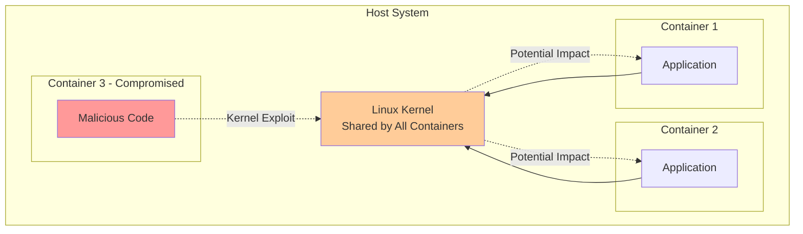

# Container Security

Container security is critical for protecting applications, data, and infrastructure from vulnerabilities and attacks. While containers provide isolation, they share the host kernel and require careful configuration to maintain security. This section covers container security principles, best practices, and tools for securing containerized environments.

## Security Fundamentals

### Shared Kernel Risk

All containers on a host share the same kernel, creating potential attack surfaces.



### Defense in Depth

Implement multiple layers of security controls:
- Image security (trusted sources, vulnerability scanning)
- Runtime security (least privilege, resource limits)
- Network security (isolation, encryption)
- Host security (hardened OS, updates)
- Monitoring and auditing (logging, intrusion detection)

## Image Security

### Use Trusted Base Images

```dockerfile
# Bad: Unknown source
FROM random-user/ubuntu

# Good: Official images
FROM ubuntu:20.04
FROM node:16-alpine
FROM python:3.9-slim

# Good: Verified publisher
FROM mcr.microsoft.com/dotnet/aspnet:6.0
```

**Verify Image Signatures**:
```bash
# Enable Docker Content Trust
export DOCKER_CONTENT_TRUST=1

# Pull signed images only
docker pull nginx:latest
```

### Minimize Image Size

Smaller images have fewer vulnerabilities and attack surfaces.

```dockerfile
# Large image (~1GB)
FROM ubuntu:20.04
RUN apt-get update && apt-get install -y python3 python3-pip
COPY . /app
RUN pip3 install -r requirements.txt

# Small image (~50MB)
FROM python:3.9-alpine
COPY requirements.txt .
RUN pip install --no-cache-dir -r requirements.txt
COPY . /app
CMD ["python", "app.py"]
```

### Multi-Stage Builds

Remove build tools from production images.

```dockerfile
# Build stage with compilers and build tools
FROM node:16 AS builder
WORKDIR /app
COPY package*.json ./
RUN npm ci
COPY . .
RUN npm run build

# Production stage with only runtime
FROM node:16-alpine
WORKDIR /app
COPY --from=builder /app/dist ./dist
COPY --from=builder /app/node_modules ./node_modules
USER node
CMD ["node", "dist/index.js"]
```

### Scan Images for Vulnerabilities

```bash
# Docker Scout (built-in)
docker scout cves nginx:latest
docker scout recommendations nginx:latest

# Trivy
trivy image nginx:latest
trivy image --severity HIGH,CRITICAL myapp:latest

# Clair
clairctl analyze myapp:latest

# Anchore
anchore-cli image add myapp:latest
anchore-cli image vuln myapp:latest all

# Snyk
snyk container test nginx:latest
```

**CI/CD Integration**:
```yaml
# GitHub Actions example
- name: Run Trivy vulnerability scanner
  uses: aquasecurity/trivy-action@master
  with:
    image-ref: 'myapp:${{ github.sha }}'
    severity: 'CRITICAL,HIGH'
    exit-code: '1'  # Fail build on vulnerabilities
```

### Keep Images Updated

```bash
# Rebuild images regularly
docker build --pull --no-cache -t myapp:latest .

# Automated rebuilds
# - Schedule weekly/monthly rebuilds
# - Monitor base image updates
# - Automate dependency updates (Dependabot, Renovate)
```

## Runtime Security

### Run as Non-Root User

**Never run containers as root in production**.

```dockerfile
# Create non-root user
FROM node:16-alpine

RUN addgroup -g 1001 -S nodejs && \
    adduser -S nodejs -u 1001

WORKDIR /app
COPY --chown=nodejs:nodejs . .

USER nodejs

CMD ["node", "app.js"]
```

**Enforce non-root at runtime**:
```bash
# Run as specific user
docker run --user 1000:1000 myapp

# Block root user
docker run --user nobody myapp
```

### Drop Capabilities

Linux capabilities allow fine-grained privilege control.

```bash
# Drop all capabilities, add only required
docker run \
  --cap-drop=ALL \
  --cap-add=NET_BIND_SERVICE \
  nginx

# Common capabilities:
# NET_BIND_SERVICE: Bind to ports < 1024
# CHOWN: Change file ownership
# DAC_OVERRIDE: Bypass file permission checks
# SETGID/SETUID: Change user/group IDs
```

**Dockerfile**:
```dockerfile
# Document required capabilities
LABEL capabilities="NET_BIND_SERVICE"
```

### Read-Only Root Filesystem

Prevent container from modifying its filesystem.

```bash
# Read-only root filesystem
docker run --read-only nginx

# With writable tmp directory
docker run --read-only --tmpfs /tmp nginx

# Docker Compose
services:
  app:
    read_only: true
    tmpfs:
      - /tmp
      - /var/run
```

### Resource Limits

Prevent resource exhaustion attacks.

```bash
# CPU and memory limits
docker run \
  --cpus="1.5" \
  --memory="1g" \
  --memory-swap="1g" \
  --pids-limit=100 \
  myapp

# Docker Compose
services:
  app:
    deploy:
      resources:
        limits:
          cpus: '1.5'
          memory: 1G
        reservations:
          cpus: '1'
          memory: 512M
```

### Seccomp Profiles

Seccomp (Secure Computing Mode) restricts system calls.

```bash
# Default seccomp profile (recommended)
docker run --security-opt seccomp=/path/to/profile.json myapp

# Unconfined (avoid in production)
docker run --security-opt seccomp=unconfined myapp
```

**Custom Seccomp Profile**:
```json
{
  "defaultAction": "SCMP_ACT_ERRNO",
  "architectures": ["SCMP_ARCH_X86_64"],
  "syscalls": [
    {
      "names": [
        "read", "write", "open", "close", "stat",
        "fstat", "lstat", "poll", "lseek", "mmap"
      ],
      "action": "SCMP_ACT_ALLOW"
    }
  ]
}
```

### AppArmor and SELinux

Mandatory Access Control (MAC) systems.

```bash
# AppArmor (Ubuntu/Debian)
docker run --security-opt apparmor=docker-default myapp

# Custom AppArmor profile
docker run --security-opt apparmor=my-profile myapp

# SELinux (RHEL/CentOS)
docker run --security-opt label=level:s0:c100,c200 myapp

# Disable SELinux (not recommended)
docker run --security-opt label=disable myapp
```

### No New Privileges

Prevent privilege escalation.

```bash
# Disable setuid/setgid
docker run --security-opt no-new-privileges:true myapp

# Docker Compose
services:
  app:
    security_opt:
      - no-new-privileges:true
```

## Network Security

### Network Isolation

Isolate containers using custom networks.

```bash
# Create isolated networks
docker network create frontend
docker network create backend
docker network create database

# Frontend tier (public-facing)
docker run -d --name nginx --network frontend -p 80:80 nginx

# Application tier (frontend + backend)
docker run -d --name app --network backend myapp
docker network connect frontend app

# Database tier (backend only, no external access)
docker run -d --name postgres --network database postgres
docker network connect backend postgres
```

### Internal Networks

Prevent external access.

```bash
# Create internal network (no default gateway)
docker network create --internal db-network

# Containers can communicate internally but not externally
docker run -d --name db --network db-network postgres
docker run -d --name cache --network db-network redis
```

### Encrypted Overlay Networks

```bash
# Docker Swarm encrypted overlay
docker network create --driver overlay --opt encrypted secure-net
```

### Limit Port Exposure

```bash
# Bad: Expose to all interfaces
docker run -p 3306:3306 mysql

# Good: Expose to localhost only
docker run -p 127.0.0.1:3306:3306 mysql

# Better: Don't expose, use network
docker network create app-net
docker run -d --name mysql --network app-net mysql
docker run -d --name app --network app-net myapp
```

## Secrets Management

### Never Hard-Code Secrets

```dockerfile
# Bad: Hard-coded secrets
ENV DB_PASSWORD=secretpassword

# Bad: Secrets in code
COPY .env /app/.env
```

### Use Environment Variables (Development Only)

```bash
# Development only (secrets visible in inspect)
docker run -e DB_PASSWORD=secret myapp

# Docker Compose (development)
services:
  app:
    environment:
      DB_PASSWORD: ${DB_PASSWORD}
```

### Docker Secrets (Swarm Mode)

```bash
# Create secret
echo "my-secret-password" | docker secret create db_password -

# Use secret in service
docker service create \
  --name myapp \
  --secret db_password \
  myimage

# In container: secret available at /run/secrets/db_password
```

**docker-compose.yml (Swarm mode)**:
```yaml
version: '3.8'

services:
  db:
    image: postgres:14
    secrets:
      - db_password
    environment:
      POSTGRES_PASSWORD_FILE: /run/secrets/db_password

secrets:
  db_password:
    external: true
```

### External Secret Managers

```bash
# HashiCorp Vault
vault kv get secret/db/password

# AWS Secrets Manager
aws secretsmanager get-secret-value --secret-id db-password

# Azure Key Vault
az keyvault secret show --vault-name myvault --name db-password

# Kubernetes Secrets
kubectl create secret generic db-password --from-literal=password=secret
```

## Security Scanning and Monitoring

### Runtime Security

**Falco** - Runtime threat detection:
```yaml
# Falco rule: Detect shell in container
- rule: Shell in Container
  desc: Alert if shell is spawned in container
  condition: >
    spawned_process and container and
    proc.name in (bash, sh, zsh)
  output: >
    Shell spawned in container (user=%user.name container=%container.name
    shell=%proc.name parent=%proc.pname)
  priority: WARNING
```

**Sysdig** - Container monitoring and security:
```bash
# Monitor container activity
sysdig -c topprocs_cpu

# Detect suspicious activity
sysdig -c spy_users
```

### Image Scanning in CI/CD

```yaml
# GitLab CI example
image-scan:
  stage: test
  script:
    - docker build -t $CI_REGISTRY_IMAGE:$CI_COMMIT_SHA .
    - trivy image --severity HIGH,CRITICAL --exit-code 1 $CI_REGISTRY_IMAGE:$CI_COMMIT_SHA
```

### Logging and Auditing

```bash
# Enable audit logging
dockerd --log-level=debug

# Centralized logging
docker run -d \
  --log-driver=syslog \
  --log-opt syslog-address=tcp://logserver:514 \
  myapp

# Docker Compose
services:
  app:
    logging:
      driver: syslog
      options:
        syslog-address: "tcp://logserver:514"
        tag: "{{.Name}}/{{.ID}}"
```

## Host Security

### Keep Host Updated

```bash
# Ubuntu/Debian
sudo apt update && sudo apt upgrade

# RHEL/CentOS
sudo yum update

# Update Docker Engine
sudo apt update && sudo apt install docker-ce docker-ce-cli containerd.io
```

### Docker Daemon Security

**/etc/docker/daemon.json**:
```json
{
  "icc": false,
  "userland-proxy": false,
  "live-restore": true,
  "log-level": "info",
  "no-new-privileges": true,
  "selinux-enabled": true,
  "userns-remap": "default"
}
```

### User Namespaces

Remap container root to non-root on host.

```json
{
  "userns-remap": "default"
}
```

```bash
# Restart Docker
sudo systemctl restart docker

# Container root (UID 0) maps to host UID 100000+
```

### Disable Inter-Container Communication

```json
{
  "icc": false
}
```

Requires explicit links or custom networks for container communication.

### TLS for Docker Daemon

```bash
# Generate certificates
openssl genrsa -out ca-key.pem 4096
openssl req -new -x509 -days 365 -key ca-key.pem -sha256 -out ca.pem

# Configure daemon
{
  "tls": true,
  "tlscacert": "/etc/docker/ca.pem",
  "tlscert": "/etc/docker/server-cert.pem",
  "tlskey": "/etc/docker/server-key.pem"
}
```

## Security Best Practices Checklist

### Build Time

- [ ] Use official or trusted base images
- [ ] Use specific image tags (avoid `latest`)
- [ ] Minimize image size (alpine, slim variants)
- [ ] Multi-stage builds to remove build tools
- [ ] Scan images for vulnerabilities
- [ ] No secrets in images (no ENV, no COPY .env)
- [ ] Create non-root user
- [ ] Use .dockerignore

### Runtime

- [ ] Run as non-root user (`--user` or `USER` directive)
- [ ] Read-only root filesystem (`--read-only`)
- [ ] Drop all capabilities (`--cap-drop=ALL`)
- [ ] No new privileges (`--security-opt no-new-privileges`)
- [ ] Resource limits (CPU, memory, PIDs)
- [ ] Use seccomp, AppArmor, or SELinux
- [ ] Network isolation (custom networks)
- [ ] Limit port exposure
- [ ] Use secrets management
- [ ] Enable logging

### Host Security

- [ ] Keep host OS updated
- [ ] Keep Docker Engine updated
- [ ] Enable user namespaces
- [ ] Disable inter-container communication (icc: false)
- [ ] Use TLS for Docker daemon
- [ ] Restrict Docker daemon access
- [ ] Enable audit logging
- [ ] Use Docker Bench Security

## Security Tools

### Docker Bench Security

```bash
# Run security audit
docker run -it --net host --pid host --userns host --cap-add audit_control \
  -e DOCKER_CONTENT_TRUST=$DOCKER_CONTENT_TRUST \
  -v /etc:/etc:ro \
  -v /usr/bin/containerd:/usr/bin/containerd:ro \
  -v /usr/bin/runc:/usr/bin/runc:ro \
  -v /usr/lib/systemd:/usr/lib/systemd:ro \
  -v /var/lib:/var/lib:ro \
  -v /var/run/docker.sock:/var/run/docker.sock:ro \
  --label docker_bench_security \
  docker/docker-bench-security
```

### Trivy

```bash
# Scan image
trivy image nginx:latest

# Scan filesystem
trivy fs /path/to/project

# Scan config files
trivy config .

# CI/CD integration
trivy image --exit-code 1 --severity CRITICAL myapp:latest
```

### Clair

```bash
# Scan with Clair
clairctl analyze --local myapp:latest
clairctl report myapp:latest
```

## Summary

Container security requires a comprehensive approach covering the entire container lifecycle. Key takeaways:

- **Image security**: Use trusted sources, scan for vulnerabilities, minimize size, use multi-stage builds
- **Runtime security**: Run as non-root, drop capabilities, use read-only filesystems, enforce resource limits
- **Network security**: Isolate with custom networks, limit port exposure, use encrypted networks
- **Secrets management**: Never hard-code secrets, use environment variables cautiously, prefer secret managers
- **Host security**: Keep updated, enable user namespaces, configure daemon securely, use TLS
- **Monitoring**: Implement runtime threat detection, centralized logging, and continuous scanning
- **Tools**: Docker Bench Security, Trivy, Falco, Sysdig for comprehensive security coverage

Security is not a one-time task but an ongoing process requiring vigilance, updates, and continuous improvement.
