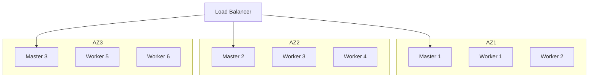

# Kubernetes Production Best Practices

Running Kubernetes in production requires careful planning, security hardening, monitoring, and operational excellence. This section covers essential best practices for production deployments.

## High Availability

**Multi-Master Setup**: 3+ control plane nodes
**Node Distribution**: Spread across availability zones
**Resource Planning**: Over-provision for failures

**Cluster Architecture**:


## Security Best Practices

**Network Policies**: Enforce micro-segmentation
```yaml
apiVersion: networking.k8s.io/v1
kind: NetworkPolicy
metadata:
  name: default-deny-all
spec:
  podSelector: {}
  policyTypes:
  - Ingress
  - Egress
```

**Pod Security**: Enable restricted Pod Security Standards
**RBAC**: Least privilege access
**Secrets**: External secret management (Vault, AWS Secrets Manager)
**Image Scanning**: Scan images in CI/CD
**Admission Controllers**: Use ValidatingWebhookConfiguration

## Resource Management

**Resource Requests and Limits**: Always set for production
```yaml
resources:
  requests:
    memory: "256Mi"
    cpu: "250m"
  limits:
    memory: "512Mi"
    cpu: "500m"
```

**ResourceQuotas**: Per namespace limits
**LimitRanges**: Default resource constraints
**Pod Disruption Budgets**: Ensure availability during updates

## Monitoring and Logging

**Metrics**: Prometheus + Grafana
```bash
# Install Prometheus stack
helm install prometheus prometheus-community/kube-prometheus-stack
```

**Logging**: EFK (Elasticsearch, Fluentd, Kibana) or Loki
**Distributed Tracing**: Jaeger, Zipkin
**Alerting**: Alert Manager, PagerDuty integration

**Key Metrics**:
- Node CPU/Memory utilization
- Pod restart rates
- API server latency
- etcd performance
- Network traffic
- Storage usage

## Backup and Disaster Recovery

**etcd Backup**:
```bash
ETCDCTL_API=3 etcdctl snapshot save snapshot.db \
  --endpoints=https://127.0.0.1:2379 \
  --cacert=/etc/kubernetes/pki/etcd/ca.crt \
  --cert=/etc/kubernetes/pki/etcd/server.crt \
  --key=/etc/kubernetes/pki/etcd/server.key
```

**Velero**: Backup cluster resources and volumes
```bash
velero backup create my-backup
velero restore create --from-backup my-backup
```

## Deployment Strategies

**Rolling Update**:
```yaml
strategy:
  type: RollingUpdate
  rollingUpdate:
    maxSurge: 1
    maxUnavailable: 0
```

**Blue-Green**: Full environment swap
**Canary**: Gradual traffic shift (Istio, Flagger)
**A/B Testing**: Traffic splitting by rules

## GitOps

**ArgoCD**: Declarative GitOps
```bash
kubectl create namespace argocd
kubectl apply -n argocd -f https://raw.githubusercontent.com/argoproj/argo-cd/stable/manifests/install.yaml
```

**FluxCD**: Alternative GitOps tool

## Cost Optimization

**Right-Sizing**: Match requests to actual usage
**Spot Instances**: Use for fault-tolerant workloads
**Cluster Autoscaler**: Scale nodes based on demand
```yaml
apiVersion: autoscaling.k8s.io/v1
kind: ClusterAutoscaler
spec:
  scaleDown:
    enabled: true
    delayAfterAdd: 10m
```

**Resource Cleanup**: Remove unused resources
**Namespace Quotas**: Prevent resource waste

## Observability

**Metrics**: Prometheus for metrics collection
**Logs**: Centralized logging (ELK, Loki)
**Traces**: Distributed tracing (Jaeger)
**Service Mesh**: Istio, Linkerd for advanced observability

## Update Management

**Kubernetes Upgrades**:
- Test in staging first
- Upgrade one minor version at a time
- Backup etcd before upgrade
- Drain nodes before updating

**Application Updates**:
- Use semantic versioning
- Automated rollback on failure
- Gradual rollout with health checks

## Configuration Management

**External Secrets**: Integrate with vault
```yaml
apiVersion: external-secrets.io/v1beta1
kind: SecretStore
metadata:
  name: vault-backend
spec:
  provider:
    vault:
      server: "https://vault.example.com"
      path: "secret"
      version: "v2"
      auth:
        kubernetes:
          mountPath: "kubernetes"
          role: "my-role"
```

**Config Versioning**: Track ConfigMap/Secret changes
**Immutable ConfigMaps**: Prevent accidental modifications

## Multi-Tenancy

**Namespaces**: Logical isolation
**NetworkPolicies**: Network isolation
**ResourceQuotas**: Resource limits per tenant
**RBAC**: Tenant-specific permissions

## Compliance and Auditing

**Audit Logging**: Enable Kubernetes audit logs
**Policy Enforcement**: OPA (Open Policy Agent)
```yaml
apiVersion: constraints.gatekeeper.sh/v1beta1
kind: K8sRequiredLabels
metadata:
  name: require-env-label
spec:
  match:
    kinds:
    - apiGroups: ["apps"]
      kinds: ["Deployment"]
  parameters:
    labels: ["environment"]
```

**Compliance Scanning**: Kube-bench, Kube-hunter

## Checklist

**Before Production**:
- [ ] Multi-master setup (HA)
- [ ] Node distribution across AZs
- [ ] RBAC configured
- [ ] NetworkPolicies enforced
- [ ] Pod Security Standards enabled
- [ ] Resource requests/limits set
- [ ] Health probes configured
- [ ] Monitoring installed
- [ ] Logging configured
- [ ] Backup strategy implemented
- [ ] Disaster recovery tested
- [ ] Update procedures documented
- [ ] Incident response plan

**Ongoing**:
- [ ] Regular security scans
- [ ] Patch management
- [ ] Capacity planning
- [ ] Cost optimization
- [ ] Performance tuning
- [ ] Backup validation
- [ ] Audit log review

## Summary

Production Kubernetes requires HA architecture, comprehensive security, robust monitoring, backup strategies, and operational discipline. Following these best practices ensures reliable, secure, and efficient clusters.
