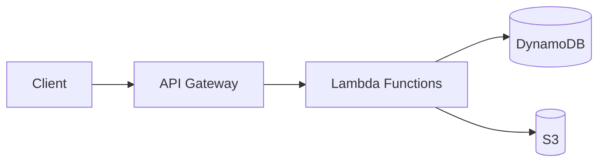
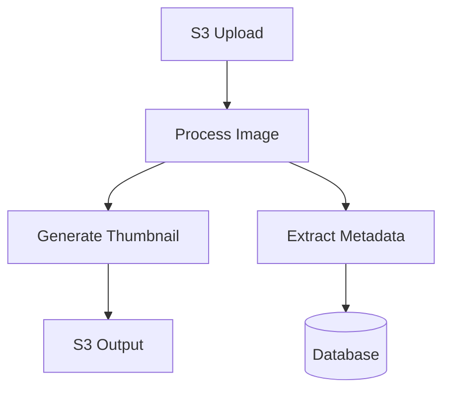
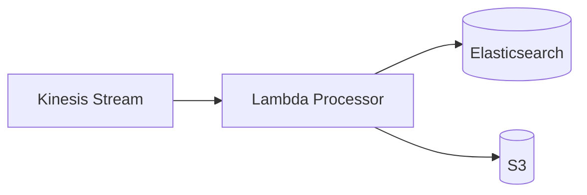

# Serverless Architectures

Serverless architectures combine FaaS, managed services, and event-driven patterns to build scalable, cost-effective applications without managing infrastructure.

## Common Patterns

### API Backend



**Implementation**:
- API Gateway for HTTP routing
- Lambda functions for business logic
- DynamoDB for data storage
- S3 for static assets

### Event-Driven Processing



### Stream Processing



## Microservices Architecture

Each microservice as independent Lambda functions:

```yaml
# Serverless Framework
service: ecommerce

functions:
  createOrder:
    handler: orders.create
    events:
      - http:
          path: /orders
          method: post

  getOrder:
    handler: orders.get
    events:
      - http:
          path: /orders/{id}
          method: get

  processPayment:
    handler: payments.process
    events:
      - sns: order-created

  sendNotification:
    handler: notifications.send
    events:
      - sqs: payment-completed
```

## Async Processing

**Queue-Based**:
```python
# Producer (API)
import boto3

sqs = boto3.client('sqs')

def handler(event, context):
    sqs.send_message(
        QueueUrl='https://sqs.region.amazonaws.com/account/queue',
        MessageBody=json.dumps({'order_id': order_id})
    )
    return {'statusCode': 202, 'body': 'Processing'}
```

```python
# Consumer (Worker)
def handler(event, context):
    for record in event['Records']:
        message = json.loads(record['body'])
        # Process order
        process_order(message['order_id'])
```

## CQRS Pattern

Separate read and write operations:

```python
# Command (Write)
def create_order(event, context):
    order = validate_order(event)
    dynamodb.put_item(Table='Orders', Item=order)
    sns.publish(Topic='order-created', Message=order)

# Query (Read)
def get_orders(event, context):
    # Read from optimized read model
    return elasticsearch.search(index='orders')
```

**When to Use CQRS**:

CQRS (Command Query Responsibility Segregation) is particularly valuable in serverless architectures when:

**Use CQRS When**:
- **High read/write ratio**: Different scaling requirements for reads vs writes (e.g., 1000:1 read/write ratio)
- **Complex queries**: Need denormalized data or multiple indexes for efficient queries
- **Event sourcing**: Building audit trails or need to replay events
- **Different consistency requirements**: Writes need strong consistency, reads can be eventually consistent
- **Performance optimization**: Reads from optimized read models (Elasticsearch, Redis) while writes go to source of truth

**Example Scenario**:
```python
# E-commerce order system
# Command: Create order (write-optimized)
def create_order_command(event, context):
    order = {
        'order_id': generate_id(),
        'user_id': event['user_id'],
        'items': event['items'],
        'timestamp': datetime.now().isoformat()
    }

    # Write to source of truth (DynamoDB)
    dynamodb.put_item(Table='Orders', Item=order)

    # Publish event for read model updates
    sns.publish(
        TopicArn='order-events',
        Message=json.dumps({
            'type': 'OrderCreated',
            'order': order
        })
    )

    return {'statusCode': 201, 'order_id': order['order_id']}

# Query: Search orders (read-optimized)
def search_orders_query(event, context):
    # Query from Elasticsearch (optimized for search)
    results = elasticsearch.search(
        index='orders',
        body={
            'query': {
                'bool': {
                    'must': [
                        {'match': {'user_id': event['user_id']}},
                        {'range': {'timestamp': {'gte': event['start_date']}}}
                    ]
                }
            }
        }
    )
    return {'statusCode': 200, 'orders': results['hits']['hits']}

# Read model updater (eventual consistency)
def update_read_model(event, context):
    for record in event['Records']:
        message = json.loads(record['Sns']['Message'])

        if message['type'] == 'OrderCreated':
            # Update Elasticsearch
            elasticsearch.index(
                index='orders',
                id=message['order']['order_id'],
                body=message['order']
            )

            # Update user statistics cache
            redis.hincrby(f"user:{message['order']['user_id']}", 'order_count', 1)
```

**Benefits in This Example**:
- Writes go directly to DynamoDB (fast, strongly consistent)
- Reads come from Elasticsearch (full-text search, aggregations)
- User stats cached in Redis (instant access)
- Each store optimized for its purpose
- Scales independently based on load

**Avoid CQRS When**:
- Simple CRUD applications with similar read/write patterns
- Small-scale applications where complexity outweighs benefits
- Strong consistency required for all operations
- Team lacks experience with eventual consistency

## Fan-Out Pattern

Single event triggers multiple functions:

```python
# Publisher
sns.publish(
    TopicArn='arn:aws:sns:region:account:new-user',
    Message=json.dumps(user_data)
)

# Subscribers (multiple Lambdas)
# - SendWelcomeEmail
# - CreateUserProfile
# - SendToAnalytics
# - UpdateCRM
```

## Saga Pattern

Distributed transactions across services:

```python
# Order saga orchestrator
def create_order_saga(event, context):
    try:
        # Reserve inventory
        inventory_response = lambda_client.invoke(
            FunctionName='reserve-inventory',
            Payload=json.dumps(order)
        )

        # Process payment
        payment_response = lambda_client.invoke(
            FunctionName='process-payment',
            Payload=json.dumps(order)
        )

        # Confirm order
        confirm_order(order)

    except Exception as e:
        # Compensation: rollback
        compensate_inventory(order)
        compensate_payment(order)
        raise
```

## Choosing the Right Pattern

**API Backend Pattern**:
- **Use for**: RESTful APIs, CRUD operations, mobile/web backends
- **Benefits**: Simple to implement, auto-scaling, pay-per-request
- **Considerations**: Cold starts may affect latency (use provisioned concurrency for critical paths)

**Event-Driven Processing Pattern**:
- **Use for**: File processing, ETL pipelines, reactive workflows
- **Benefits**: Decoupled components, automatic retry, parallel processing
- **Considerations**: Eventual consistency, potential for duplicate events (design for idempotency)

**Stream Processing Pattern**:
- **Use for**: Real-time analytics, IoT data, log processing, clickstream analysis
- **Benefits**: Real-time processing, ordered records, built-in checkpointing
- **Considerations**: Batch size tuning needed, error handling affects entire batch

**Microservices Pattern**:
- **Use for**: Complex applications, independent team ownership, polyglot requirements
- **Benefits**: Independent deployment, technology flexibility, team autonomy
- **Considerations**: Distributed system complexity, inter-service communication overhead

**Async Queue Pattern**:
- **Use for**: Background jobs, email sending, report generation, rate-limited APIs
- **Benefits**: Decouples producer/consumer, handles load spikes, built-in retry
- **Considerations**: Eventual processing, message ordering (FIFO queues available)

**CQRS Pattern**:
- **Use for**: High-read systems, complex queries, audit requirements, event sourcing
- **Benefits**: Optimized read/write models, independent scaling, flexible queries
- **Considerations**: Eventual consistency, increased complexity, multiple data stores

**Fan-Out Pattern**:
- **Use for**: Notifications, multi-step workflows, parallel processing
- **Benefits**: Parallel execution, failure isolation, easy to add subscribers
- **Considerations**: No guaranteed ordering, duplicate events possible

**Saga Pattern**:
- **Use for**: Distributed transactions, multi-step business processes, compensating actions
- **Benefits**: Eventual consistency, failure recovery, long-running processes
- **Considerations**: Complex compensation logic, increased latency

**Decision Matrix**:
| Requirement | Recommended Pattern |
|-------------|-------------------|
| Simple API | API Backend |
| File upload triggers processing | Event-Driven |
| Real-time data streams | Stream Processing |
| Independent services | Microservices |
| Background tasks | Async Queue |
| High read/write ratio | CQRS |
| Multiple downstream actions | Fan-Out |
| Multi-step transactions | Saga |

## Best Practices

**1. Idempotency**: Handle duplicate events
```python
def handler(event, context):
    request_id = event['request_id']

    # Check if already processed
    if dynamodb.get_item(Key={'id': request_id}):
        return {'statusCode': 200, 'body': 'Already processed'}

    # Process and store
    result = process(event)
    dynamodb.put_item(Item={'id': request_id, 'result': result})
    return result
```

**2. Circuit Breaker**: Fail fast on errors
```python
from circuitbreaker import circuit

@circuit(failure_threshold=5, recovery_timeout=60)
def call_external_api():
    response = requests.get('https://api.example.com')
    return response.json()
```

**3. Dead Letter Queues**: Handle failures
```yaml
functions:
  processor:
    handler: handler.process
    events:
      - sqs:
          arn: arn:aws:sqs:region:account:main-queue
    onError: arn:aws:sqs:region:account:dlq
```

**4. Retry Logic**: Exponential backoff
```python
import time
from functools import wraps

def retry(max_attempts=3, delay=1):
    def decorator(func):
        @wraps(func)
        def wrapper(*args, **kwargs):
            for attempt in range(max_attempts):
                try:
                    return func(*args, **kwargs)
                except Exception as e:
                    if attempt == max_attempts - 1:
                        raise
                    time.sleep(delay * (2 ** attempt))
        return wrapper
    return decorator
```

## Complete Example: Image Processing Service

```python
# 1. Upload Handler
def upload_handler(event, context):
    for record in event['Records']:
        bucket = record['s3']['bucket']['name']
        key = record['s3']['object']['key']

        # Trigger processing
        sns.publish(
            TopicArn='image-uploaded',
            Message=json.dumps({'bucket': bucket, 'key': key})
        )
```

```python
# 2. Thumbnail Generator
import boto3
from PIL import Image
import io

def generate_thumbnail(event, context):
    message = json.loads(event['Records'][0]['Sns']['Message'])

    # Download image
    s3 = boto3.client('s3')
    obj = s3.get_object(Bucket=message['bucket'], Key=message['key'])
    img = Image.open(io.BytesIO(obj['Body'].read()))

    # Generate thumbnail
    img.thumbnail((200, 200))

    # Upload thumbnail
    buffer = io.BytesIO()
    img.save(buffer, 'JPEG')
    buffer.seek(0)

    s3.put_object(
        Bucket=message['bucket'],
        Key=f"thumbnails/{message['key']}",
        Body=buffer
    )
```

```python
# 3. Metadata Extractor
def extract_metadata(event, context):
    message = json.loads(event['Records'][0]['Sns']['Message'])

    # Extract EXIF data
    metadata = extract_exif(message['bucket'], message['key'])

    # Store in DynamoDB
    dynamodb = boto3.resource('dynamodb')
    table = dynamodb.Table('ImageMetadata')
    table.put_item(Item={
        'image_id': message['key'],
        'metadata': metadata,
        'timestamp': str(datetime.now())
    })
```

```yaml
# serverless.yml
service: image-processor

functions:
  uploadHandler:
    handler: upload.handler
    events:
      - s3:
          bucket: images
          event: s3:ObjectCreated:*

  thumbnailGenerator:
    handler: thumbnail.handler
    events:
      - sns: image-uploaded

  metadataExtractor:
    handler: metadata.handler
    events:
      - sns: image-uploaded

resources:
  Resources:
    ImageMetadataTable:
      Type: AWS::DynamoDB::Table
      Properties:
        TableName: ImageMetadata
        AttributeDefinitions:
          - AttributeName: image_id
            AttributeType: S
        KeySchema:
          - AttributeName: image_id
            KeyType: HASH
        BillingMode: PAY_PER_REQUEST
```

## Summary

Serverless architectures leverage FaaS and managed services to build scalable, event-driven systems. Key patterns include API backends, event processing, CQRS, fan-out, and sagas. Choosing the right pattern depends on your specific requirements: consistency needs, scaling characteristics, complexity tolerance, and team expertise. Best practices ensure reliability through idempotency, circuit breakers, retries, and proper error handling.
