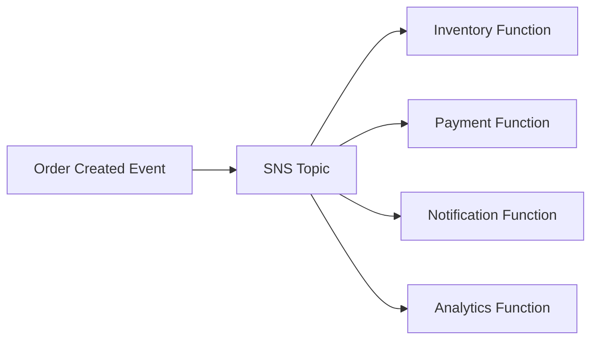
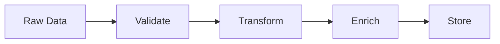
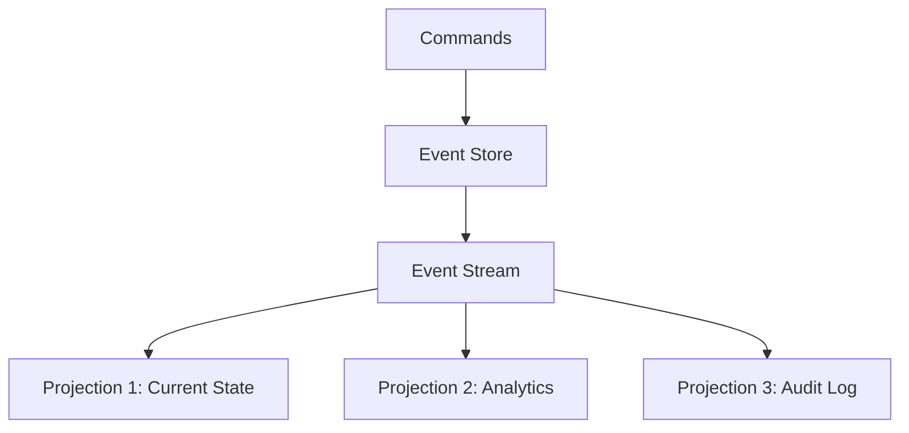

# Event-Driven Serverless

Event-driven architectures use events to trigger and communicate between decoupled services.

## Event Sources

**S3**: Object created/deleted/modified
**DynamoDB**: Stream of table changes
**SNS**: Pub/sub messaging
**SQS**: Queue-based messaging
**Kinesis**: Real-time data streams
**EventBridge**: Custom events and scheduling
**API Gateway**: HTTP requests

## Event Sources Deep Dive

### S3 Event Notifications

S3 can trigger Lambda functions when objects are created, deleted, or modified. This is useful for image processing, data validation, and backup operations.

```python
def process_s3_event(event, context):
    for record in event['Records']:
        bucket = record['s3']['bucket']['name']
        key = record['s3']['object']['key']
        event_name = record['eventName']

        if 'ObjectCreated' in event_name:
            # Process new file
            process_file(bucket, key)
        elif 'ObjectRemoved' in event_name:
            # Clean up related resources
            cleanup_metadata(key)
```

### DynamoDB Streams

DynamoDB Streams capture item-level changes in DynamoDB tables, enabling real-time processing, replication, and materialized views.

```python
def process_dynamodb_stream(event, context):
    for record in event['Records']:
        if record['eventName'] == 'INSERT':
            new_item = record['dynamodb']['NewImage']
            # Handle new item
            send_welcome_email(new_item)
        elif record['eventName'] == 'MODIFY':
            old_item = record['dynamodb']['OldImage']
            new_item = record['dynamodb']['NewImage']
            # Handle update
            audit_change(old_item, new_item)
        elif record['eventName'] == 'REMOVE':
            old_item = record['dynamodb']['OldImage']
            # Handle deletion
            archive_data(old_item)
```

### SNS (Simple Notification Service)

SNS provides pub/sub messaging where multiple subscribers can receive the same message. It supports fan-out patterns and cross-service communication.

```python
import boto3

sns = boto3.client('sns')

# Publisher
def publish_order_event(order):
    sns.publish(
        TopicArn='arn:aws:sns:us-east-1:123456789012:orders',
        Message=json.dumps(order),
        MessageAttributes={
            'event_type': {'DataType': 'String', 'StringValue': 'ORDER_CREATED'},
            'priority': {'DataType': 'Number', 'StringValue': '1'}
        }
    )

# Subscriber
def handle_order_notification(event, context):
    for record in event['Records']:
        message = json.loads(record['Sns']['Message'])
        attributes = record['Sns']['MessageAttributes']
        process_order(message, attributes)
```

### SQS (Simple Queue Service)

SQS provides reliable queue-based messaging with features like visibility timeout, dead-letter queues, and FIFO ordering.

```python
# Lambda polls SQS automatically
def process_queue_message(event, context):
    for record in event['Records']:
        message_body = json.loads(record['body'])
        receipt_handle = record['receiptHandle']

        try:
            process_task(message_body)
            # Message automatically deleted on success
        except Exception as e:
            # Message goes back to queue or DLQ after retries
            raise e
```

### Kinesis Data Streams

Kinesis enables real-time processing of streaming data with ordering guarantees per shard.

```python
def process_kinesis_stream(event, context):
    for record in event['Records']:
        # Kinesis data is base64 encoded
        payload = base64.b64decode(record['kinesis']['data'])
        data = json.loads(payload)

        # Process streaming data
        analyze_metrics(data)
        update_dashboard(data)
```

## Event Patterns

Event-driven architectures use several common patterns to solve different integration challenges.

### Fan-Out Pattern

One event triggers multiple independent functions for parallel processing.



```python
# Publisher
def create_order(order_data):
    # Save order
    order_id = save_order(order_data)

    # Publish event to SNS
    sns.publish(
        TopicArn=os.environ['ORDER_TOPIC_ARN'],
        Message=json.dumps({
            'order_id': order_id,
            'customer_id': order_data['customer_id'],
            'items': order_data['items'],
            'total': order_data['total']
        })
    )

# Multiple subscribers process independently
def reserve_inventory(event, context):
    order = extract_order(event)
    for item in order['items']:
        inventory.reserve(item['sku'], item['quantity'])

def process_payment(event, context):
    order = extract_order(event)
    payment_gateway.charge(order['customer_id'], order['total'])

def send_notification(event, context):
    order = extract_order(event)
    email.send(order['customer_id'], 'order_confirmation', order)
```

### Fan-In Pattern

Multiple events or sources aggregate into a single function for coordinated processing.

```python
# Using SQS to aggregate events
def aggregate_data_sources(event, context):
    results = []

    for record in event['Records']:
        message = json.loads(record['body'])
        source = message['source']
        data = message['data']

        # Aggregate from multiple sources
        if source == 'api':
            results.append(transform_api_data(data))
        elif source == 'database':
            results.append(transform_db_data(data))
        elif source == 'file':
            results.append(transform_file_data(data))

    # Process aggregated results
    generate_report(results)
```

### Pipeline Pattern

Chain of processing steps where each function passes results to the next.



```python
# Step 1: Validate
def validate_data(event, context):
    data = event['data']
    if is_valid(data):
        sqs.send_message(
            QueueUrl=os.environ['TRANSFORM_QUEUE'],
            MessageBody=json.dumps(data)
        )

# Step 2: Transform
def transform_data(event, context):
    for record in event['Records']:
        data = json.loads(record['body'])
        transformed = apply_transformations(data)
        sqs.send_message(
            QueueUrl=os.environ['ENRICH_QUEUE'],
            MessageBody=json.dumps(transformed)
        )

# Step 3: Enrich
def enrich_data(event, context):
    for record in event['Records']:
        data = json.loads(record['body'])
        enriched = add_metadata(data)
        sqs.send_message(
            QueueUrl=os.environ['STORE_QUEUE'],
            MessageBody=json.dumps(enriched)
        )

# Step 4: Store
def store_data(event, context):
    for record in event['Records']:
        data = json.loads(record['body'])
        dynamodb.put_item(TableName='ProcessedData', Item=data)
```

## Event Sourcing

Event sourcing stores all changes to application state as a sequence of events. Instead of storing current state, you store the events that led to that state.



### Event Sourcing Example

```python
# Event store using DynamoDB
def store_event(aggregate_id, event_type, event_data):
    table = dynamodb.Table('EventStore')
    table.put_item(Item={
        'aggregate_id': aggregate_id,
        'timestamp': int(time.time() * 1000),
        'event_type': event_type,
        'event_data': event_data,
        'version': get_next_version(aggregate_id)
    })

    # Publish to stream for projections
    kinesis.put_record(
        StreamName='events',
        Data=json.dumps({
            'aggregate_id': aggregate_id,
            'event_type': event_type,
            'event_data': event_data
        }),
        PartitionKey=aggregate_id
    )

# Rebuild state from events
def get_account_balance(account_id):
    table = dynamodb.Table('EventStore')
    response = table.query(
        KeyConditionExpression=Key('aggregate_id').eq(account_id),
        ScanIndexForward=True  # Chronological order
    )

    balance = 0
    for event in response['Items']:
        if event['event_type'] == 'ACCOUNT_OPENED':
            balance = event['event_data']['initial_balance']
        elif event['event_type'] == 'FUNDS_DEPOSITED':
            balance += event['event_data']['amount']
        elif event['event_type'] == 'FUNDS_WITHDRAWN':
            balance -= event['event_data']['amount']

    return balance

# Projection: Maintain current state view
def update_account_projection(event, context):
    for record in event['Records']:
        payload = base64.b64decode(record['kinesis']['data'])
        event_data = json.loads(payload)

        account_id = event_data['aggregate_id']
        current_balance = get_current_balance_from_projection(account_id)

        if event_data['event_type'] == 'FUNDS_DEPOSITED':
            new_balance = current_balance + event_data['event_data']['amount']
        elif event_data['event_type'] == 'FUNDS_WITHDRAWN':
            new_balance = current_balance - event_data['event_data']['amount']

        # Update projection table
        update_projection(account_id, new_balance)
```

## EventBridge

AWS EventBridge is a serverless event bus that enables event-driven architectures with powerful routing and transformation capabilities.

### EventBridge Rules and Patterns

```python
# Creating an EventBridge rule
import boto3

events = boto3.client('events')

# Rule with pattern matching
events.put_rule(
    Name='OrdersOverThreshold',
    EventPattern=json.dumps({
        'source': ['com.myapp.orders'],
        'detail-type': ['Order Placed'],
        'detail': {
            'total': [{'numeric': ['>', 1000]}]
        }
    }),
    State='ENABLED'
)

# Add Lambda target
events.put_targets(
    Rule='OrdersOverThreshold',
    Targets=[{
        'Id': '1',
        'Arn': 'arn:aws:lambda:us-east-1:123456789012:function:ProcessLargeOrder'
    }]
)

# Publishing custom events
def publish_order_event(order):
    events.put_events(
        Entries=[{
            'Source': 'com.myapp.orders',
            'DetailType': 'Order Placed',
            'Detail': json.dumps({
                'order_id': order['id'],
                'customer_id': order['customer_id'],
                'total': order['total'],
                'items': order['items']
            }),
            'EventBusName': 'default'
        }]
    )
```

### Cross-Account Event Routing

```python
# Send events to partner accounts
events.put_events(
    Entries=[{
        'Source': 'com.myapp.inventory',
        'DetailType': 'Stock Updated',
        'Detail': json.dumps({'sku': 'ABC123', 'quantity': 100}),
        'EventBusName': 'arn:aws:events:us-east-1:partner-account:event-bus/partner-bus'
    }]
)
```

## Error Handling in Event-Driven Systems

Proper error handling is critical in event-driven architectures to prevent data loss and ensure system reliability.

### Dead Letter Queues

```python
# Configure DLQ for Lambda
# In SAM template:
"""
Resources:
  ProcessOrderFunction:
    Type: AWS::Serverless::Function
    Properties:
      DeadLetterQueue:
        Type: SQS
        TargetArn: !GetAtt OrderDLQ.Arn
      EventInvokeConfig:
        MaximumRetryAttempts: 2
        DestinationConfig:
          OnFailure:
            Type: SQS
            Destination: !GetAtt OrderDLQ.Arn
"""

# Process DLQ messages
def process_dlq(event, context):
    for record in event['Records']:
        failed_message = json.loads(record['body'])

        # Log for investigation
        logger.error(f"Failed message: {failed_message}")

        # Attempt recovery or alert
        if can_recover(failed_message):
            retry_with_fixes(failed_message)
        else:
            alert_on_call_team(failed_message)
```

### Idempotency

```python
# Using DynamoDB for idempotency
def process_payment_idempotent(event, context):
    request_id = event['request_id']

    # Check if already processed
    table = dynamodb.Table('IdempotencyStore')
    response = table.get_item(Key={'request_id': request_id})

    if 'Item' in response:
        # Already processed, return cached result
        return response['Item']['result']

    # Process payment
    result = process_payment(event['payment_data'])

    # Store result with TTL
    table.put_item(Item={
        'request_id': request_id,
        'result': result,
        'ttl': int(time.time()) + 86400  # 24 hours
    })

    return result
```

## Testing Event-Driven Systems

### Unit Testing

```python
import unittest
from unittest.mock import patch, MagicMock

class TestOrderProcessor(unittest.TestCase):
    @patch('boto3.client')
    def test_process_order_event(self, mock_boto):
        # Mock SNS client
        mock_sns = MagicMock()
        mock_boto.return_value = mock_sns

        # Test event
        event = {
            'Records': [{
                'Sns': {
                    'Message': json.dumps({'order_id': '123', 'total': 100})
                }
            }]
        }

        # Execute
        result = process_order(event, None)

        # Assert
        self.assertEqual(result['statusCode'], 200)
        mock_sns.publish.assert_called_once()
```

### Integration Testing

```python
# Test with LocalStack
def test_event_flow_integration():
    # Setup LocalStack SQS
    sqs = boto3.client('sqs', endpoint_url='http://localhost:4566')
    queue_url = sqs.create_queue(QueueName='test-queue')['QueueUrl']

    # Send test message
    sqs.send_message(
        QueueUrl=queue_url,
        MessageBody=json.dumps({'test': 'data'})
    )

    # Verify processing
    messages = sqs.receive_message(QueueUrl=queue_url)
    assert len(messages.get('Messages', [])) == 1
```

## Patterns

**Fan-Out**: One event triggers multiple functions
**Fan-In**: Multiple events aggregate to one function
**Pipeline**: Chain of processing steps
**Event Sourcing**: Store events as source of truth
**CQRS**: Separate read and write models

## Example: Order Processing

```python
# Event: OrderCreated
def on_order_created(event, context):
    order = parse_event(event)

    # Publish domain events
    sns.publish(Topic='inventory-reserve', Message=order)
    sns.publish(Topic='payment-process', Message=order)
    sns.publish(Topic='notification-send', Message=order)
```

## Summary

Event-driven serverless enables loose coupling, scalability, and resilience through asynchronous event processing. By understanding event sources, patterns, and best practices for error handling and testing, you can build robust event-driven architectures that scale automatically and respond to changes in real-time.
