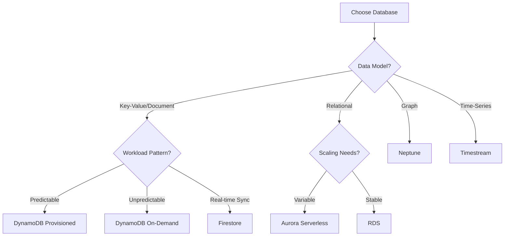

# Serverless Databases

Serverless databases scale automatically, charge based on usage, and require no infrastructure management.

## AWS DynamoDB

NoSQL database with auto-scaling and pay-per-request pricing.

```python
import boto3

dynamodb = boto3.resource('dynamodb')
table = dynamodb.Table('Users')

# Put item
table.put_item(Item={'userId': '123', 'name': 'Alice'})

# Get item
response = table.get_item(Key={'userId': '123'})

# Query
response = table.query(
    KeyConditionExpression=Key('userId').eq('123')
)

# Scan
response = table.scan(
    FilterExpression=Attr('age').gt(18)
)
```

## DynamoDB Deep Dive

### Data Modeling in DynamoDB

DynamoDB uses a key-value and document data model. Understanding partition keys, sort keys, and indexes is crucial for optimal performance.

#### Partition Keys and Sort Keys

```python
# Table with composite primary key
"""
Table: Orders
Partition Key: customerId (HASH)
Sort Key: orderDate (RANGE)
"""

# Put item with composite key
table = dynamodb.Table('Orders')
table.put_item(Item={
    'customerId': 'CUST-123',
    'orderDate': '2025-01-15T10:30:00Z',
    'orderId': 'ORD-456',
    'total': 299.99,
    'items': [
        {'sku': 'PROD-A', 'quantity': 2, 'price': 99.99},
        {'sku': 'PROD-B', 'quantity': 1, 'price': 100.01}
    ]
})

# Query all orders for a customer
response = table.query(
    KeyConditionExpression=Key('customerId').eq('CUST-123')
)

# Query orders for a customer in date range
response = table.query(
    KeyConditionExpression=Key('customerId').eq('CUST-123') &
                          Key('orderDate').between('2025-01-01', '2025-01-31')
)
```

#### Global Secondary Indexes (GSI)

GSIs allow querying on non-key attributes with different partition and sort keys.

```python
# Create table with GSI
"""
Table: Orders
Primary Key: customerId (HASH), orderDate (RANGE)

GSI: OrderStatusIndex
  Partition Key: status (HASH)
  Sort Key: orderDate (RANGE)
"""

# Query by status using GSI
response = table.query(
    IndexName='OrderStatusIndex',
    KeyConditionExpression=Key('status').eq('PENDING')
)

# Query pending orders in date range
response = table.query(
    IndexName='OrderStatusIndex',
    KeyConditionExpression=Key('status').eq('PENDING') &
                          Key('orderDate').gt('2025-01-01')
)
```

#### Local Secondary Indexes (LSI)

LSIs use the same partition key as the base table but a different sort key.

```python
# Table with LSI
"""
Table: Users
Primary Key: userId (HASH), registrationDate (RANGE)

LSI: EmailIndex
  Partition Key: userId (HASH)
  Sort Key: email (RANGE)
"""

# Query using LSI
response = table.query(
    IndexName='EmailIndex',
    KeyConditionExpression=Key('userId').eq('USER-123')
)
```

### Capacity Modes

DynamoDB offers two capacity modes to optimize cost and performance.

#### On-Demand Mode

Pay per request with automatic scaling. Best for unpredictable workloads.

```python
# Create table with on-demand billing
dynamodb_client = boto3.client('dynamodb')

dynamodb_client.create_table(
    TableName='Products',
    BillingMode='PAY_PER_REQUEST',
    KeySchema=[
        {'AttributeName': 'productId', 'KeyType': 'HASH'}
    ],
    AttributeDefinitions=[
        {'AttributeName': 'productId', 'AttributeType': 'S'}
    ]
)

# No capacity units to manage
# Automatically handles any level of traffic
# Charged per read/write request
```

#### Provisioned Mode

Specify read and write capacity units. Best for predictable workloads with auto-scaling.

```python
# Create table with provisioned capacity
dynamodb_client.create_table(
    TableName='Products',
    BillingMode='PROVISIONED',
    ProvisionedThroughput={
        'ReadCapacityUnits': 5,
        'WriteCapacityUnits': 5
    },
    KeySchema=[
        {'AttributeName': 'productId', 'KeyType': 'HASH'}
    ],
    AttributeDefinitions=[
        {'AttributeName': 'productId', 'AttributeType': 'S'}
    ]
)

# Configure auto-scaling
autoscaling = boto3.client('application-autoscaling')

# Register scalable target
autoscaling.register_scalable_target(
    ServiceNamespace='dynamodb',
    ResourceId='table/Products',
    ScalableDimension='dynamodb:table:ReadCapacityUnits',
    MinCapacity=5,
    MaxCapacity=100
)

# Create scaling policy
autoscaling.put_scaling_policy(
    PolicyName='ProductsReadScaling',
    ServiceNamespace='dynamodb',
    ResourceId='table/Products',
    ScalableDimension='dynamodb:table:ReadCapacityUnits',
    PolicyType='TargetTrackingScaling',
    TargetTrackingScalingPolicyConfiguration={
        'TargetValue': 70.0,  # Target 70% utilization
        'PredefinedMetricSpecification': {
            'PredefinedMetricType': 'DynamoDBReadCapacityUtilization'
        }
    }
)
```

### DynamoDB Streams and Change Data Capture

DynamoDB Streams capture item-level changes and trigger Lambda functions for real-time processing.

```python
# Enable streams on table
dynamodb_client.update_table(
    TableName='Orders',
    StreamSpecification={
        'StreamEnabled': True,
        'StreamViewType': 'NEW_AND_OLD_IMAGES'  # Capture before and after
    }
)

# Process stream events
def process_order_stream(event, context):
    for record in event['Records']:
        event_name = record['eventName']  # INSERT, MODIFY, REMOVE

        if event_name == 'INSERT':
            new_image = record['dynamodb']['NewImage']
            # Send order confirmation
            send_confirmation_email(new_image)

        elif event_name == 'MODIFY':
            old_image = record['dynamodb']['OldImage']
            new_image = record['dynamodb']['NewImage']

            # Check if status changed
            if old_image['status']['S'] != new_image['status']['S']:
                # Update search index
                update_elasticsearch(new_image)
                # Send status update notification
                notify_customer(new_image)

        elif event_name == 'REMOVE':
            old_image = record['dynamodb']['OldImage']
            # Archive deleted order
            archive_to_s3(old_image)
```

### Advanced DynamoDB Patterns

#### Single-Table Design

Store multiple entity types in one table for optimal performance.

```python
# Single table design
"""
Table: AppData
Partition Key: PK
Sort Key: SK

Entity Types:
- User: PK=USER#{userId}, SK=PROFILE
- Order: PK=USER#{userId}, SK=ORDER#{orderId}
- Product: PK=PRODUCT#{productId}, SK=METADATA
"""

# Store user
table.put_item(Item={
    'PK': 'USER#123',
    'SK': 'PROFILE',
    'type': 'user',
    'name': 'Alice',
    'email': 'alice@example.com'
})

# Store user's order
table.put_item(Item={
    'PK': 'USER#123',
    'SK': 'ORDER#456',
    'type': 'order',
    'total': 299.99,
    'status': 'PENDING'
})

# Query user and all their orders in one request
response = table.query(
    KeyConditionExpression=Key('PK').eq('USER#123')
)
# Returns both PROFILE and all ORDERs
```

#### Conditional Writes

Ensure data consistency with conditional expressions.

```python
# Optimistic locking with version number
def update_product_price(product_id, new_price, expected_version):
    try:
        table.update_item(
            Key={'productId': product_id},
            UpdateExpression='SET price = :price, version = :new_version',
            ConditionExpression='version = :expected_version',
            ExpressionAttributeValues={
                ':price': new_price,
                ':new_version': expected_version + 1,
                ':expected_version': expected_version
            }
        )
        return True
    except ClientError as e:
        if e.response['Error']['Code'] == 'ConditionalCheckFailedException':
            # Version mismatch - someone else updated it
            return False
        raise

# Prevent duplicate writes
def create_order_idempotent(order_id, order_data):
    try:
        table.put_item(
            Item={
                'orderId': order_id,
                **order_data
            },
            ConditionExpression='attribute_not_exists(orderId)'
        )
    except ClientError as e:
        if e.response['Error']['Code'] == 'ConditionalCheckFailedException':
            # Order already exists
            pass
```

## Aurora Serverless

Auto-scaling relational database (MySQL/PostgreSQL compatible).

**Features**:
- Automatic start/stop based on activity
- Scales capacity based on load
- Charged per second of usage
- Data API for HTTP-based queries

### Aurora Serverless v2

Aurora Serverless v2 provides instant scaling and better price-performance compared to v1.

```python
import boto3

rds = boto3.client('rds-data')

# Execute SQL using Data API (no connection management)
response = rds.execute_statement(
    resourceArn='arn:aws:rds:us-east-1:123456789012:cluster:my-cluster',
    secretArn='arn:aws:secretsmanager:us-east-1:123456789012:secret:my-secret',
    database='mydb',
    sql='SELECT * FROM products WHERE category = :category',
    parameters=[
        {'name': 'category', 'value': {'stringValue': 'electronics'}}
    ]
)

# Batch operations
rds.batch_execute_statement(
    resourceArn='arn:aws:rds:us-east-1:123456789012:cluster:my-cluster',
    secretArn='arn:aws:secretsmanager:us-east-1:123456789012:secret:my-secret',
    database='mydb',
    sql='INSERT INTO orders (customer_id, total) VALUES (:customer_id, :total)',
    parameterSets=[
        [
            {'name': 'customer_id', 'value': {'stringValue': 'CUST-1'}},
            {'name': 'total', 'value': {'doubleValue': 99.99}}
        ],
        [
            {'name': 'customer_id', 'value': {'stringValue': 'CUST-2'}},
            {'name': 'total', 'value': {'doubleValue': 149.99}}
        ]
    ]
)
```

### Aurora Serverless Features

**Automatic Pause and Resume**: Database pauses after period of inactivity.

```yaml
# CloudFormation configuration
Resources:
  AuroraCluster:
    Type: AWS::RDS::DBCluster
    Properties:
      Engine: aurora-mysql
      EngineMode: serverless
      ScalingConfiguration:
        MinCapacity: 1
        MaxCapacity: 16
        AutoPause: true
        SecondsUntilAutoPause: 300  # 5 minutes
```

**Use Cases**:
- Development and test environments
- Infrequent or unpredictable workloads
- Applications with variable traffic
- New applications with unknown capacity needs

## Firebase/Firestore

Document database with real-time sync and offline support.

### Firestore Real-Time Sync

```javascript
// Firestore real-time listener
import { collection, onSnapshot, query, where } from 'firebase/firestore';

// Listen to collection changes
const q = query(
  collection(db, 'orders'),
  where('status', '==', 'pending')
);

const unsubscribe = onSnapshot(q, (snapshot) => {
  snapshot.docChanges().forEach((change) => {
    if (change.type === 'added') {
      console.log('New order: ', change.doc.data());
      updateUI(change.doc.data());
    }
    if (change.type === 'modified') {
      console.log('Modified order: ', change.doc.data());
      updateUI(change.doc.data());
    }
    if (change.type === 'removed') {
      console.log('Removed order: ', change.doc.data());
      removeFromUI(change.doc.id);
    }
  });
});
```

### Firestore Offline Support

```javascript
import { enableIndexedDbPersistence } from 'firebase/firestore';

// Enable offline persistence
enableIndexedDbPersistence(db)
  .catch((err) => {
    if (err.code == 'failed-precondition') {
      // Multiple tabs open
    } else if (err.code == 'unimplemented') {
      // Browser doesn't support
    }
  });

// Queries work offline with cached data
const orders = await getDocs(
  query(collection(db, 'orders'))
);
// Returns cached data if offline
```

## CosmosDB (Azure)

Multi-model database with global distribution.

**Features**:
- Multiple APIs (SQL, MongoDB, Cassandra, Gremlin, Table)
- Global distribution with multi-region writes
- Guaranteed latency and throughput SLAs
- Automatic indexing

## Choosing the Right Database

### Decision Matrix



### Database Selection Criteria

**Choose DynamoDB when**:
- Need single-digit millisecond latency
- Key-value or document data model works
- Unpredictable scaling requirements
- Fully managed NoSQL preferred

**Choose Aurora Serverless when**:
- Need relational database (SQL)
- Variable or unpredictable workload
- Want automatic scaling and pause/resume
- Existing SQL applications

**Choose Firestore when**:
- Building mobile or web applications
- Need real-time synchronization
- Require offline support
- Want simple client SDKs

**Choose Neptune when**:
- Graph data model (relationships)
- Social networks or recommendation engines
- Fraud detection patterns

## Database Access from Lambda

### Connection Pooling Challenges

Lambda functions scale horizontally, creating many database connections.

```python
# WRONG: Creates new connection per invocation
def lambda_handler(event, context):
    conn = psycopg2.connect(
        host=os.environ['DB_HOST'],
        database=os.environ['DB_NAME']
    )
    # Process request
    conn.close()
```

### Solution: RDS Proxy

RDS Proxy manages connection pooling, reducing overhead and improving scalability.

```python
# Use RDS Proxy endpoint
import psycopg2

# Connection outside handler (reused across invocations)
conn = None

def get_connection():
    global conn
    if conn is None or conn.closed:
        conn = psycopg2.connect(
            host=os.environ['RDS_PROXY_ENDPOINT'],  # RDS Proxy
            database=os.environ['DB_NAME'],
            user=os.environ['DB_USER'],
            password=os.environ['DB_PASSWORD']
        )
    return conn

def lambda_handler(event, context):
    conn = get_connection()
    cursor = conn.cursor()

    cursor.execute('SELECT * FROM products WHERE id = %s', (event['id'],))
    result = cursor.fetchone()

    return {'statusCode': 200, 'body': json.dumps(result)}
```

### RDS Proxy Benefits

**Connection Pooling**: Reuses connections across Lambda invocations
**Automatic Scaling**: Handles connection bursts
**Failover Support**: Automatic failover to standby instances
**IAM Authentication**: Use IAM roles instead of passwords

```python
# IAM authentication with RDS Proxy
import boto3
import psycopg2

rds_client = boto3.client('rds')

def get_auth_token():
    return rds_client.generate_db_auth_token(
        DBHostname=os.environ['RDS_PROXY_ENDPOINT'],
        Port=5432,
        DBUsername=os.environ['DB_USER']
    )

def get_connection_with_iam():
    token = get_auth_token()
    conn = psycopg2.connect(
        host=os.environ['RDS_PROXY_ENDPOINT'],
        database=os.environ['DB_NAME'],
        user=os.environ['DB_USER'],
        password=token,
        sslmode='require'
    )
    return conn
```

### DynamoDB Best Practices for Lambda

```python
# Reuse DynamoDB client
import boto3

# Outside handler - reused across invocations
dynamodb = boto3.resource('dynamodb')
table = dynamodb.Table('Products')

def lambda_handler(event, context):
    # Use batch operations for efficiency
    with table.batch_writer() as batch:
        for item in event['items']:
            batch.put_item(Item=item)

    # Use ProjectionExpression to fetch only needed attributes
    response = table.get_item(
        Key={'productId': event['id']},
        ProjectionExpression='productId, name, price'
    )

    return response['Item']
```

## Firestore (Google)

Document database with real-time sync and offline support.

## CosmosDB (Azure)

Multi-model database with global distribution.

## Summary

Serverless databases eliminate operational overhead while providing automatic scaling, high availability, and pay-per-use pricing. Choose DynamoDB for flexible NoSQL with predictable performance, Aurora Serverless for relational workloads with variable traffic, and Firestore for real-time mobile/web applications. Understanding data modeling, capacity modes, and connection management ensures optimal performance and cost efficiency.
