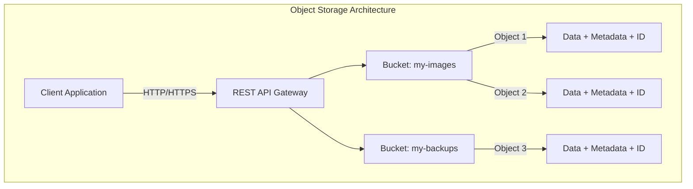
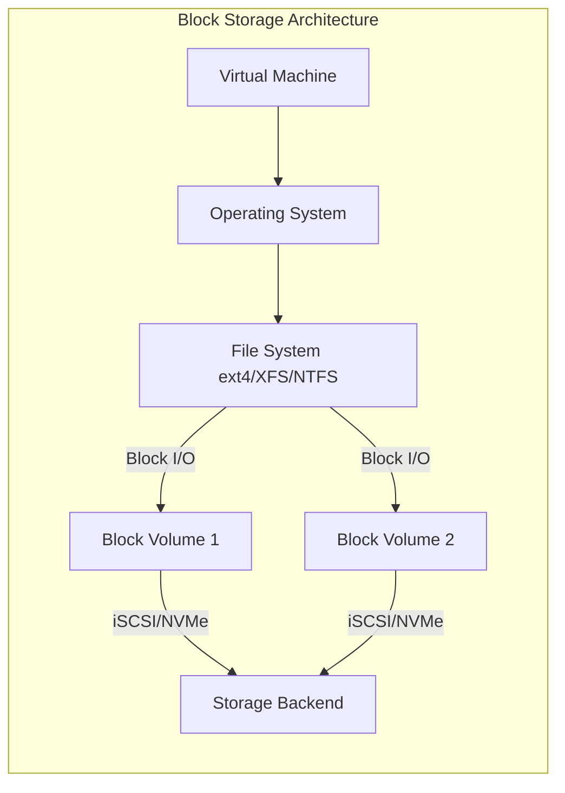
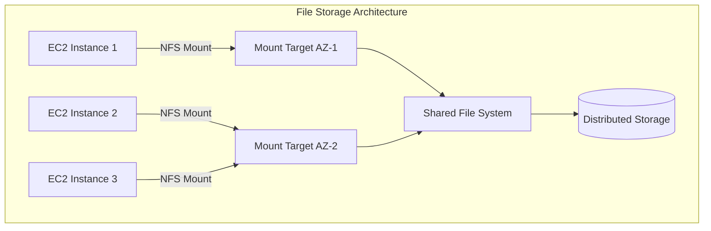
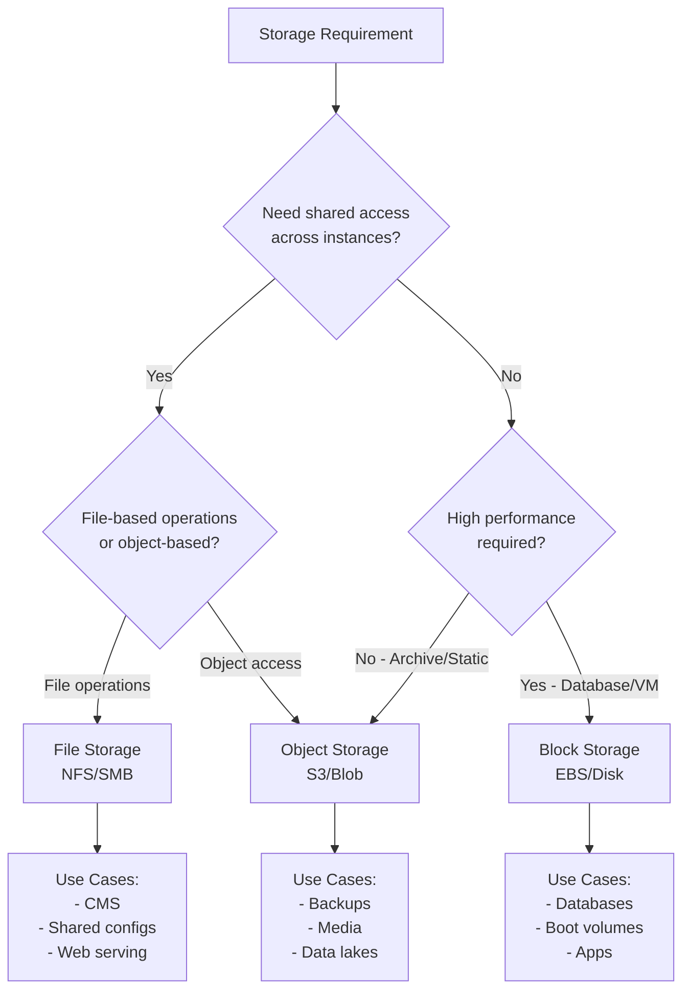

# Cloud Storage Types

Cloud storage is a fundamental component of cloud computing infrastructure, providing scalable, durable, and cost-effective data storage solutions. Unlike traditional on-premises storage, cloud storage eliminates the need for physical hardware management, offers virtually unlimited capacity, and provides pay-as-you-go pricing models. Understanding the different types of cloud storage is essential for architecting efficient cloud solutions.

Modern cloud platforms offer three primary storage paradigms, each designed for specific access patterns and use cases: object storage for unstructured data, block storage for high-performance applications, and file storage for shared access scenarios. Choosing the right storage type impacts not only performance and cost but also the overall architecture of your cloud applications.

## Object Storage

Object storage is designed for storing unstructured data as discrete objects, each containing the data itself, associated metadata, and a unique identifier. Unlike traditional file systems with hierarchical directory structures, object storage uses a flat namespace where objects are accessed via unique keys or URLs.

### Architecture and Design

Object storage systems organize data into buckets (or containers) that hold objects. Each object consists of:

- **Data**: The actual content (files, images, videos, backups, etc.)
- **Metadata**: Key-value pairs describing the object (content type, creation date, custom attributes)
- **Unique Identifier**: A globally unique key or URL used to retrieve the object

Objects are immutable - when you update an object, you create a new version rather than modifying it in place. This design enables exceptional durability and scalability.

### How Object Storage Works

Object storage systems distribute data across multiple servers and data centers, providing high availability and durability. When you upload an object:

1. The object is received via HTTP/HTTPS REST API
2. Data is broken into chunks and distributed across multiple storage nodes
3. Multiple replicas are created (typically 3+ copies across different availability zones)
4. Metadata is indexed for efficient retrieval
5. A unique identifier (key) is assigned or provided by the client

Access is exclusively through API calls (REST, SDKs, CLI) using HTTP methods (GET, PUT, DELETE). There is no concept of mounting or attaching storage - all operations are over the network.

### Performance Characteristics

Object storage prioritizes scalability and durability over performance:

- **Throughput**: Excellent for large sequential reads/writes (GB/s possible)
- **IOPS**: Lower random I/O performance (hundreds to low thousands)
- **Latency**: Higher latency (10-100ms) due to network and API overhead
- **Scalability**: Virtually unlimited - stores exabytes of data

### Use Cases and Examples

**Ideal for**:
- Static website hosting (HTML, CSS, JavaScript, images)
- Backup and disaster recovery archives
- Data lakes for big data analytics
- Media storage (photos, videos, audio files)
- Software distribution (application packages, updates)
- Log aggregation and long-term retention
- Machine learning dataset storage

**Not suitable for**:
- Databases requiring frequent updates
- Applications needing low-latency random access
- File systems with hierarchical directory operations
- Workloads requiring file locking

## Block Storage

Block storage provides persistent, low-latency storage volumes that attach to virtual machine instances. It presents storage as raw block devices similar to physical hard drives, allowing operating systems to format them with any file system and use them for any purpose.

### How Block Storage Works

Block storage divides data into fixed-size blocks (typically 512 bytes to 64 KB), each with a unique address. The storage volume appears to the operating system as a local disk device (e.g., /dev/sda, /dev/xvdf).

**Key Technologies**:
- **SCSI Protocol**: Small Computer System Interface for block-level communication
- **iSCSI**: Internet SCSI for block storage over IP networks
- **Fibre Channel**: High-speed network technology for storage networking
- **NVMe**: Non-Volatile Memory Express for ultra-low latency SSD access

When a VM reads or writes data:

1. Application makes file system call
2. OS file system translates to block-level operations
3. Block storage driver sends I/O commands over network (iSCSI/NVMe)
4. Storage backend processes the request
5. Data is returned to the application

### Performance Characteristics

Block storage offers the highest performance among cloud storage types:

- **IOPS**: Input/Output Operations Per Second
  - Standard SSD: 3,000-16,000 IOPS
  - Provisioned IOPS SSD: Up to 64,000+ IOPS
  - HDD: 250-500 IOPS

- **Throughput**: Data transfer rate
  - SSD: 125 MB/s to 1,000+ MB/s
  - Throughput-optimized HDD: Up to 500 MB/s
  - Cold HDD: Up to 250 MB/s

- **Latency**: Time for single I/O operation
  - SSD: Sub-millisecond to low single-digit milliseconds
  - HDD: 10-20 milliseconds

These characteristics make block storage ideal for performance-sensitive applications that require consistent, low-latency access.

### Use Cases and Examples

**Ideal for**:
- Relational databases (MySQL, PostgreSQL, Oracle)
- NoSQL databases (MongoDB, Cassandra)
- Operating system boot volumes
- Transactional applications requiring ACID properties
- Enterprise applications (SAP, ERP systems)
- Development and test environments
- Container persistent storage

**Not suitable for**:
- Shared file access across multiple instances
- Unstructured data archives
- Simple static content delivery

## File Storage

File storage provides a fully-managed, shared file system accessible by multiple compute instances simultaneously. It implements standard file system protocols (NFS, SMB/CIFS) that allow applications to interact with storage using familiar file and directory operations.

### Network File Systems

File storage uses network protocols to enable shared access:

**NFS (Network File System)**:
- UNIX/Linux native protocol
- Supports POSIX file permissions
- Used by AWS EFS, GCP Filestore
- NFSv4.1 common in cloud environments
- Enables concurrent read/write access

**SMB/CIFS (Server Message Block/Common Internet File System)**:
- Windows native protocol
- Active Directory integration
- Used by Azure Files, AWS FSx for Windows
- Supports Windows ACLs and attributes
- Compatible with Windows, Linux, macOS

### Shared Access Patterns

File storage excels at scenarios requiring concurrent access:

- **Read-Heavy Workloads**: Multiple instances reading the same files (web content, media libraries)
- **Collaborative Editing**: Multiple users/applications modifying files with file locking
- **Shared Application Data**: Configuration files, shared libraries, templates
- **Home Directories**: User home directories accessible from any instance
- **Content Management**: Media files, documents, assets accessed by multiple systems

File systems handle concurrency through:
- **File Locking**: Prevents simultaneous writes to the same file
- **Atomic Operations**: Ensures operations complete fully or not at all
- **Consistency Models**: Strong consistency for reads after writes

### Performance Characteristics

File storage balances shared access with reasonable performance:

- **Throughput**:
  - Bursting: Scales with file system size (50 MB/s per TB)
  - Provisioned: Fixed throughput regardless of size
  - Elastic: Automatically scales to workload demands

- **IOPS**:
  - General Purpose: Thousands of operations per second
  - Max I/O: Optimized for tens of thousands of IOPS

- **Latency**:
  - Single-digit milliseconds for most operations
  - Higher than block storage due to network and protocol overhead

### Use Cases and Examples

**Ideal for**:
- Web serving and content management systems
- Shared development environments
- Big data analytics (Hadoop, Spark)
- Media processing workflows
- Application configuration and shared libraries
- Container storage for stateful applications
- Lift-and-shift migrations of NFS/SMB workloads

**Not suitable for**:
- High-performance databases requiring maximum IOPS
- Single-instance applications where block storage is more cost-effective
- Object storage use cases (backups, archives)

## Detailed Comparison

| Feature | Object Storage | Block Storage | File Storage |
|---------|---------------|---------------|--------------|
| **Access Method** | HTTP/S REST API | Block device (iSCSI/NVMe) | NFS/SMB protocols |
| **Access Pattern** | Web/API-based | Direct attach to VM | Network mount |
| **Concurrent Access** | Unlimited reads, eventual consistency | Single instance (typically) | Multiple instances |
| **IOPS** | Hundreds to low thousands | 3,000 to 64,000+ | Thousands to tens of thousands |
| **Throughput** | GB/s possible | 125 MB/s to 1+ GB/s | 50 MB/s to several GB/s |
| **Latency** | 10-100ms | <1ms to few ms | Few ms to 10ms+ |
| **Scalability** | Virtually unlimited (exabytes) | Limited by volume size (TBs) | TBs to PBs |
| **Durability** | 99.999999999% (11 9's) | 99.8-99.999% | 99.99%+ |
| **Cost** | Lowest ($/GB) | Medium to high | Medium to high |
| **Data Organization** | Flat namespace, key-value | Raw blocks, file system | Hierarchical directories |
| **Typical Use Case** | Archives, media, backups | Databases, boot volumes | Shared files, web content |
| **AWS Example** | S3 | EBS | EFS |
| **Azure Example** | Blob Storage | Managed Disks | Azure Files |
| **GCP Example** | Cloud Storage | Persistent Disks | Filestore |

## Choosing the Right Storage Type

Selecting the appropriate storage type requires analyzing your application's requirements:

### Decision Framework

### Selection Criteria

**Choose Object Storage when**:
- Storing unstructured data (media, logs, backups)
- Requiring massive scalability (TBs to PBs)
- Cost is a primary concern
- Access is primarily read-heavy or write-once-read-many
- Integration with web applications via REST API
- Implementing data lakes or analytics pipelines

**Choose Block Storage when**:
- Running databases requiring high IOPS and low latency
- Deploying transactional applications
- Needing boot volumes for virtual machines
- Single-instance applications with structured data
- Requiring file system flexibility (ext4, XFS, NTFS)
- Low-latency access is critical

**Choose File Storage when**:
- Multiple instances need concurrent access to the same data
- Migrating NFS/SMB-based applications to cloud
- Implementing shared development or content management environments
- Applications expect traditional file system semantics
- Requiring POSIX compliance and file locking
- Deploying containerized stateful applications

### Hybrid Approaches

Many applications use multiple storage types:

- **Web Application**: Object storage for static assets (images, CSS, JS), block storage for database, file storage for user uploads
- **Big Data Pipeline**: Object storage for raw data lake, block storage for processing nodes, file storage for shared configurations
- **Video Platform**: Object storage for video files, block storage for database/transcoding servers, file storage for shared media processing

## Summary

Cloud storage types represent different trade-offs between performance, cost, scalability, and access patterns. Object storage provides unlimited scalability and low cost for unstructured data accessed via APIs. Block storage delivers high performance and low latency for databases and applications requiring direct-attached storage. File storage enables shared access across multiple instances using familiar file system protocols.

Understanding these storage paradigms and their characteristics is essential for designing efficient, cost-effective cloud architectures. The key is matching storage type to workload requirements, often using a combination of all three to optimize different aspects of your application.
