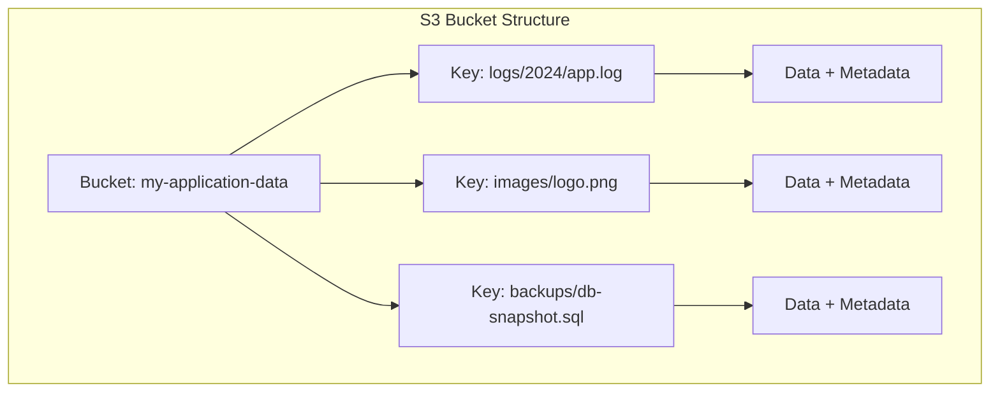
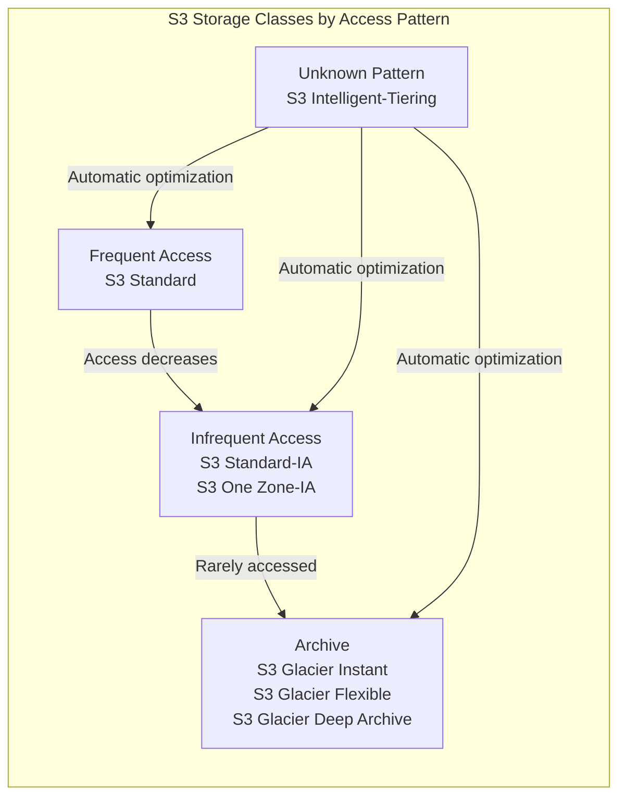

# Object Storage (S3)

Amazon Simple Storage Service (S3) is the most widely-used object storage platform in cloud computing, setting the industry standard for durability, scalability, and feature richness. S3 provides virtually unlimited storage capacity with an HTTP-based REST API, making it accessible from any application capable of making web requests. Understanding S3's architecture, storage classes, and features is essential for building cost-effective, scalable cloud applications.

S3 has become the backbone of many cloud architectures, serving as the foundation for data lakes, backup solutions, static website hosting, and content delivery networks. Its simple yet powerful design has been emulated by competitors like Azure Blob Storage and Google Cloud Storage, making S3 concepts transferable across cloud platforms.

## Introduction to S3 and Object Storage Concepts

S3 stores data as objects within containers called buckets. Each object consists of the data itself, metadata describing the data, and a unique key that identifies the object within the bucket.

### Core Concepts

**Buckets**:
- Containers for objects, similar to top-level folders
- Globally unique names across all AWS accounts
- Region-specific storage location
- Up to 100 buckets per account (soft limit)
- Bucket names must be DNS-compliant (3-63 characters, lowercase, no underscores)

**Objects**:
- Individual pieces of data stored in S3
- Can be any type of file: documents, images, videos, backups
- Maximum object size: 5 TB
- Each object consists of:
  - **Key**: The name/path of the object (e.g., "documents/report.pdf")
  - **Value**: The data itself (the file content)
  - **Metadata**: Key-value pairs describing the object
  - **Version ID**: If versioning is enabled
  - **Access Control**: Permissions for the object

**Object Keys and Prefixes**:
While S3 uses a flat namespace, you can simulate folders using key prefixes:
- Key: `photos/2024/vacation/beach.jpg`
- Prefix: `photos/2024/vacation/`
- Object name: `beach.jpg`



### Durability and Availability

S3 provides exceptional durability and availability guarantees:

- **Durability**: 99.999999999% (11 nines) - your data will not be lost
  - S3 automatically replicates objects across multiple devices in multiple facilities
  - Designed to sustain the loss of data in two facilities simultaneously

- **Availability**: 99.99% - your data is accessible when needed
  - Service Level Agreement guarantees uptime
  - Varies slightly by storage class

## Buckets and Objects

### Bucket Operations

Creating and configuring buckets is the first step in using S3:

```bash
# Create a bucket
aws s3 mb s3://my-unique-bucket-name --region us-west-2

# List all buckets
aws s3 ls

# Remove empty bucket
aws s3 rb s3://my-bucket

# Remove bucket and all contents (dangerous!)
aws s3 rb s3://my-bucket --force
```

### Object Operations

Working with objects uses standard CRUD operations:

```bash
# Upload a file (PUT)
aws s3 cp document.pdf s3://my-bucket/documents/document.pdf

# Upload with metadata
aws s3 cp photo.jpg s3://my-bucket/photos/photo.jpg \
  --metadata author=john,camera=canon

# Download a file (GET)
aws s3 cp s3://my-bucket/documents/document.pdf ./local-document.pdf

# Copy objects between buckets
aws s3 cp s3://source-bucket/file.txt s3://dest-bucket/file.txt

# Delete an object
aws s3 rm s3://my-bucket/documents/old-file.pdf

# List objects in a bucket
aws s3 ls s3://my-bucket/

# List objects with prefix (folder-like listing)
aws s3 ls s3://my-bucket/documents/

# Sync directory to S3 (like rsync)
aws s3 sync ./local-folder s3://my-bucket/remote-folder

# Sync with delete (remove files from S3 not in local)
aws s3 sync ./local-folder s3://my-bucket/remote-folder --delete
```

### Object Metadata

S3 supports two types of metadata:

**System Metadata**:
- Controlled by AWS
- Examples: Content-Type, Content-Length, Last-Modified, ETag
- Set automatically or through headers

**User-Defined Metadata**:
- Custom key-value pairs prefixed with `x-amz-meta-`
- Stored with the object
- Retrieved when downloading

```bash
# Upload with custom metadata
aws s3api put-object \
  --bucket my-bucket \
  --key data.json \
  --body data.json \
  --metadata project=alpha,version=1.2,author=alice

# Retrieve object metadata
aws s3api head-object --bucket my-bucket --key data.json
```

## Storage Classes

S3 offers multiple storage classes optimized for different access patterns and cost requirements. Choosing the right storage class can significantly reduce costs while maintaining appropriate performance.



### S3 Standard

**Characteristics**:
- Default storage class
- Low latency, high throughput
- Replicated across at least 3 Availability Zones
- 99.99% availability SLA
- No retrieval fees

**Pricing** (approximate):
- Storage: $0.023 per GB/month (first 50 TB)
- Requests: $0.0004 per 1,000 PUT/POST, $0.0004 per 10,000 GET

**Use Cases**:
- Frequently accessed data
- Dynamic website content
- Content distribution
- Big data analytics
- Mobile and gaming applications

### S3 Standard-IA (Infrequent Access)

**Characteristics**:
- Lower storage cost, higher retrieval cost
- Same low latency as Standard when accessed
- 99.9% availability SLA
- Minimum storage duration: 30 days
- Minimum object size: 128 KB

**Pricing** (approximate):
- Storage: $0.0125 per GB/month
- Requests: $0.01 per 1,000 PUT/POST, $0.001 per 1,000 GET
- Retrieval: $0.01 per GB

**Use Cases**:
- Long-term backups
- Disaster recovery files
- Data accessed monthly or less frequently
- Archive data needing immediate access

### S3 One Zone-IA

**Characteristics**:
- Stored in a single Availability Zone
- 20% lower cost than Standard-IA
- 99.5% availability SLA
- Same access performance as Standard-IA
- Data lost if AZ is destroyed

**Use Cases**:
- Secondary backup copies
- Reproducible data (can be regenerated)
- Non-critical, infrequently accessed data

### S3 Glacier Instant Retrieval

**Characteristics**:
- Archive storage with millisecond retrieval
- 68% lower cost than Standard-IA
- Minimum storage duration: 90 days
- Same performance as Standard when retrieved

**Use Cases**:
- Medical images, news archives
- Rarely accessed data requiring immediate retrieval
- Compliance archives needing instant access

### S3 Glacier Flexible Retrieval

**Characteristics**:
- Low-cost archive storage
- Retrieval times: minutes to hours
- Three retrieval options:
  - Expedited: 1-5 minutes
  - Standard: 3-5 hours
  - Bulk: 5-12 hours
- Minimum storage duration: 90 days

**Pricing** (approximate):
- Storage: $0.0036 per GB/month
- Expedited retrieval: $0.03 per GB + $0.01 per request
- Standard retrieval: $0.01 per GB + $0.05 per 1,000 requests
- Bulk retrieval: $0.0025 per GB + $0.025 per 1,000 requests

**Use Cases**:
- Long-term archives
- Digital preservation
- Regulatory archives
- Tape replacement

### S3 Glacier Deep Archive

**Characteristics**:
- Lowest cost storage class
- Retrieval times: 12-48 hours
- Two retrieval options:
  - Standard: 12 hours
  - Bulk: 48 hours
- Minimum storage duration: 180 days

**Pricing** (approximate):
- Storage: $0.00099 per GB/month (~$1 per TB/month)
- Standard retrieval: $0.02 per GB + $0.10 per 1,000 requests
- Bulk retrieval: $0.0025 per GB + $0.025 per 1,000 requests

**Use Cases**:
- Compliance archives (7-10 year retention)
- Digital preservation
- Data rarely or never accessed
- Tape migration projects

### S3 Intelligent-Tiering

**Characteristics**:
- Automatically moves objects between tiers based on access patterns
- Four access tiers:
  - Frequent Access (automatic): same as Standard
  - Infrequent Access (automatic): objects not accessed for 30 days
  - Archive Instant Access (automatic): objects not accessed for 90 days
  - Archive Access (optional): objects not accessed for 90-730 days
  - Deep Archive Access (optional): objects not accessed for 180-730 days
- No retrieval fees
- Small monthly monitoring fee: $0.0025 per 1,000 objects

**Use Cases**:
- Unknown or changing access patterns
- Data lakes
- Long-lived data with unpredictable access
- Simplified storage management

## Lifecycle Policies

Lifecycle policies automate transitioning objects between storage classes or deleting them after a specified time. This reduces costs by moving data to cheaper storage as it ages.

### Lifecycle Configuration Example

```yaml
# Lifecycle policy structure
LifecycleConfiguration:
  Rules:
    - Id: "ArchiveOldLogs"
      Status: Enabled
      Prefix: "logs/"
      Transitions:
        - Days: 30
          StorageClass: STANDARD_IA
        - Days: 90
          StorageClass: GLACIER_IR
        - Days: 365
          StorageClass: DEEP_ARCHIVE
      Expiration:
        Days: 2555  # 7 years

    - Id: "DeleteTempFiles"
      Status: Enabled
      Prefix: "temp/"
      Expiration:
        Days: 7

    - Id: "CleanupMultipartUploads"
      Status: Enabled
      AbortIncompleteMultipartUpload:
        DaysAfterInitiation: 7
```

### Applying Lifecycle Policies

```bash
# Create lifecycle policy JSON file
cat > lifecycle.json << 'EOF'
{
  "Rules": [
    {
      "Id": "MoveToGlacier",
      "Status": "Enabled",
      "Filter": {
        "Prefix": "archives/"
      },
      "Transitions": [
        {
          "Days": 30,
          "StorageClass": "GLACIER"
        }
      ]
    }
  ]
}
EOF

# Apply lifecycle policy to bucket
aws s3api put-bucket-lifecycle-configuration \
  --bucket my-bucket \
  --lifecycle-configuration file://lifecycle.json

# Get current lifecycle policy
aws s3api get-bucket-lifecycle-configuration --bucket my-bucket

# Delete lifecycle policy
aws s3api delete-bucket-lifecycle --bucket my-bucket
```

### Best Practices for Lifecycle Policies

1. **Start with longer retention periods** and adjust based on access patterns
2. **Use tags** to apply different policies to different object groups
3. **Test policies** on a small subset before applying broadly
4. **Monitor transitions** using CloudWatch metrics
5. **Consider versioning** - lifecycle policies can apply to current and previous versions

## Versioning and MFA Delete

Versioning protects against accidental deletions and overwrites by keeping multiple versions of each object.

### How Versioning Works

When enabled, S3 assigns a unique version ID to each object:

1. **First upload**: Object gets version ID (e.g., `111111`)
2. **Overwrite**: New version created (e.g., `222222`), old version retained
3. **Delete**: Delete marker added, object appears deleted but versions remain
4. **Restore**: Remove delete marker to restore object

```bash
# Enable versioning
aws s3api put-bucket-versioning \
  --bucket my-bucket \
  --versioning-configuration Status=Enabled

# Check versioning status
aws s3api get-bucket-versioning --bucket my-bucket

# List all versions of objects
aws s3api list-object-versions --bucket my-bucket

# Download specific version
aws s3api get-object \
  --bucket my-bucket \
  --key document.pdf \
  --version-id abc123xyz \
  document-v1.pdf

# Delete specific version (permanent)
aws s3api delete-object \
  --bucket my-bucket \
  --key document.pdf \
  --version-id abc123xyz
```

### MFA Delete

MFA Delete adds an extra layer of protection by requiring multi-factor authentication to:
- Permanently delete object versions
- Suspend or reactivate versioning

```bash
# Enable MFA Delete (requires root account and MFA device)
aws s3api put-bucket-versioning \
  --bucket my-bucket \
  --versioning-configuration Status=Enabled,MFADelete=Enabled \
  --mfa "arn:aws:iam::123456789012:mfa/root-account-mfa-device 123456"

# Delete object with MFA
aws s3api delete-object \
  --bucket my-bucket \
  --key important-file.txt \
  --version-id abc123 \
  --mfa "arn:aws:iam::123456789012:mfa/root-account-mfa-device 654321"
```

## Access Control

S3 provides multiple layers of access control to secure your data.

### IAM Policies

IAM policies control who can perform actions on S3 resources:

```json
{
  "Version": "2012-10-17",
  "Statement": [
    {
      "Effect": "Allow",
      "Action": [
        "s3:GetObject",
        "s3:PutObject"
      ],
      "Resource": "arn:aws:s3:::my-bucket/user-uploads/*"
    },
    {
      "Effect": "Allow",
      "Action": "s3:ListBucket",
      "Resource": "arn:aws:s3:::my-bucket",
      "Condition": {
        "StringLike": {
          "s3:prefix": "user-uploads/*"
        }
      }
    }
  ]
}
```

### Bucket Policies

Bucket policies define permissions at the bucket level and can grant access across AWS accounts:

```json
{
  "Version": "2012-10-17",
  "Statement": [
    {
      "Sid": "PublicReadAccess",
      "Effect": "Allow",
      "Principal": "*",
      "Action": "s3:GetObject",
      "Resource": "arn:aws:s3:::my-bucket/public/*"
    },
    {
      "Sid": "RequireSSL",
      "Effect": "Deny",
      "Principal": "*",
      "Action": "s3:*",
      "Resource": "arn:aws:s3:::my-bucket/*",
      "Condition": {
        "Bool": {
          "aws:SecureTransport": "false"
        }
      }
    }
  ]
}
```

```bash
# Apply bucket policy
aws s3api put-bucket-policy \
  --bucket my-bucket \
  --policy file://bucket-policy.json

# Get bucket policy
aws s3api get-bucket-policy --bucket my-bucket

# Delete bucket policy
aws s3api delete-bucket-policy --bucket my-bucket
```

### Access Control Lists (ACLs)

Legacy access control mechanism, less flexible than bucket policies:

```bash
# Make object public
aws s3api put-object-acl \
  --bucket my-bucket \
  --key photo.jpg \
  --acl public-read

# Grant read access to another AWS account
aws s3api put-object-acl \
  --bucket my-bucket \
  --key data.csv \
  --grant-read 'id="other-account-canonical-id"'
```

Best practice: Use IAM policies and bucket policies instead of ACLs when possible.

## Pre-signed URLs

Pre-signed URLs provide temporary access to private S3 objects without requiring AWS credentials. They're perfect for allowing users to upload or download files securely.

### Generating Pre-signed URLs

```bash
# Generate pre-signed URL for downloading (valid for 1 hour)
aws s3 presign s3://my-bucket/private-document.pdf --expires-in 3600

# Output: https://my-bucket.s3.amazonaws.com/private-document.pdf?AWSAccessKeyId=...&Signature=...&Expires=...

# Generate pre-signed URL for uploading
aws s3 presign s3://my-bucket/uploads/new-file.jpg \
  --expires-in 600 \
  --http-method PUT
```

Using pre-signed URLs in applications:

```bash
# Upload file using pre-signed URL
curl -X PUT -T file.jpg "https://my-bucket.s3.amazonaws.com/uploads/file.jpg?AWSAccessKeyId=...&Signature=...&Expires=..."

# Download file using pre-signed URL
curl "https://my-bucket.s3.amazonaws.com/private-document.pdf?AWSAccessKeyId=...&Signature=...&Expires=..." -o document.pdf
```

**Use Cases**:
- Temporary file sharing
- User file uploads without AWS credentials
- Time-limited content access
- Download links in emails

## S3 Transfer Acceleration

Transfer Acceleration uses Amazon CloudFront's globally distributed edge locations to accelerate uploads to S3. Data is routed through edge locations and then transferred to S3 over AWS's optimized network.

```bash
# Enable Transfer Acceleration
aws s3api put-bucket-accelerate-configuration \
  --bucket my-bucket \
  --accelerate-configuration Status=Enabled

# Upload using Transfer Acceleration
aws s3 cp large-file.zip s3://my-bucket/large-file.zip \
  --endpoint-url https://my-bucket.s3-accelerate.amazonaws.com
```

**Benefits**:
- 50-500% faster uploads from geographically distant locations
- Particularly effective for large files (> 100 MB)
- No additional changes to applications needed

**Costs**:
- Additional $0.04-$0.08 per GB transferred through acceleration

## Cross-Region Replication

Cross-Region Replication (CRR) automatically replicates objects between buckets in different AWS regions. This provides disaster recovery, compliance, and reduced latency for global access.

```yaml
# Replication configuration
ReplicationConfiguration:
  Role: arn:aws:iam::123456789012:role/s3-replication-role
  Rules:
    - Id: "ReplicateAll"
      Status: Enabled
      Priority: 1
      DeleteMarkerReplication:
        Status: Enabled
      Filter:
        Prefix: ""
      Destination:
        Bucket: arn:aws:s3:::destination-bucket
        ReplicationTime:
          Status: Enabled
          Time:
            Minutes: 15
        Metrics:
          Status: Enabled
          EventThreshold:
            Minutes: 15
```

```bash
# Enable replication (requires versioning on both buckets)
aws s3api put-bucket-versioning \
  --bucket source-bucket \
  --versioning-configuration Status=Enabled

aws s3api put-bucket-versioning \
  --bucket destination-bucket \
  --versioning-configuration Status=Enabled

# Apply replication configuration
aws s3api put-bucket-replication \
  --bucket source-bucket \
  --replication-configuration file://replication.json
```

**Requirements**:
- Versioning enabled on both source and destination buckets
- IAM role with permissions to replicate objects
- Different regions for CRR (same region uses Same-Region Replication - SRR)

## Event Notifications

S3 can trigger events when objects are created, deleted, or restored, enabling event-driven architectures.

### Event Types

- `s3:ObjectCreated:*` - Any object creation (Put, Post, Copy, CompleteMultipartUpload)
- `s3:ObjectRemoved:*` - Object deletion
- `s3:ObjectRestore:*` - Glacier object restoration
- `s3:Replication:*` - Replication events

### Notification Destinations

**AWS Lambda**:
```json
{
  "LambdaFunctionConfigurations": [
    {
      "Id": "ProcessImages",
      "LambdaFunctionArn": "arn:aws:lambda:us-east-1:123456789012:function:ProcessImage",
      "Events": ["s3:ObjectCreated:*"],
      "Filter": {
        "Key": {
          "FilterRules": [
            {"Name": "prefix", "Value": "images/"},
            {"Name": "suffix", "Value": ".jpg"}
          ]
        }
      }
    }
  ]
}
```

**SQS Queue**:
```json
{
  "QueueConfigurations": [
    {
      "QueueArn": "arn:aws:sqs:us-east-1:123456789012:s3-events",
      "Events": ["s3:ObjectCreated:*"]
    }
  ]
}
```

**SNS Topic**:
```json
{
  "TopicConfigurations": [
    {
      "TopicArn": "arn:aws:sns:us-east-1:123456789012:s3-notifications",
      "Events": ["s3:ObjectRemoved:*"]
    }
  ]
}
```

```bash
# Configure event notifications
aws s3api put-bucket-notification-configuration \
  --bucket my-bucket \
  --notification-configuration file://notifications.json
```

### Use Cases

- **Image Processing**: Trigger Lambda to create thumbnails when images are uploaded
- **Data Pipeline**: Start ETL jobs when new data files arrive
- **Backup Verification**: Verify backup integrity when objects are created
- **Compliance Logging**: Log all deletions to audit trail
- **Workflow Automation**: Start processing workflows based on file uploads

## Summary

Amazon S3 is a versatile, highly durable object storage service that forms the foundation of many cloud architectures. Its multiple storage classes enable cost optimization while maintaining appropriate performance levels for different data access patterns. Key features like versioning, lifecycle policies, replication, and event notifications make S3 suitable for a wide range of use cases from simple file storage to complex data lake implementations.

Understanding S3's capabilities and properly configuring buckets, access controls, and lifecycle policies is essential for building efficient, secure, and cost-effective cloud applications. Whether storing backups, hosting static websites, building data lakes, or implementing disaster recovery solutions, S3 provides the scalability and features needed for modern cloud storage requirements.
