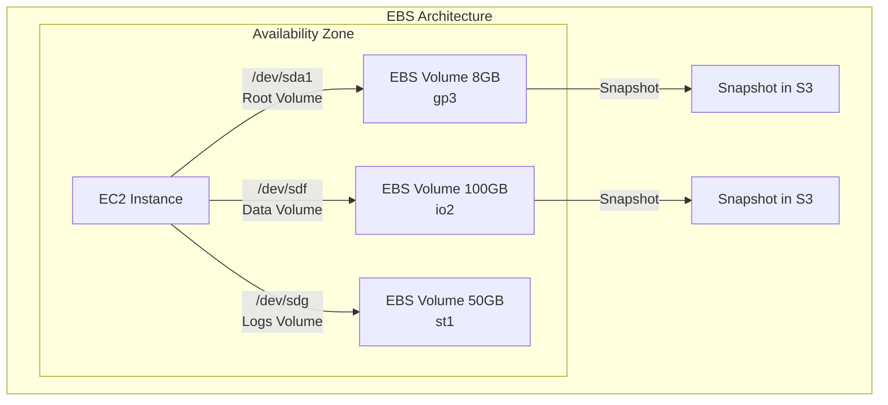
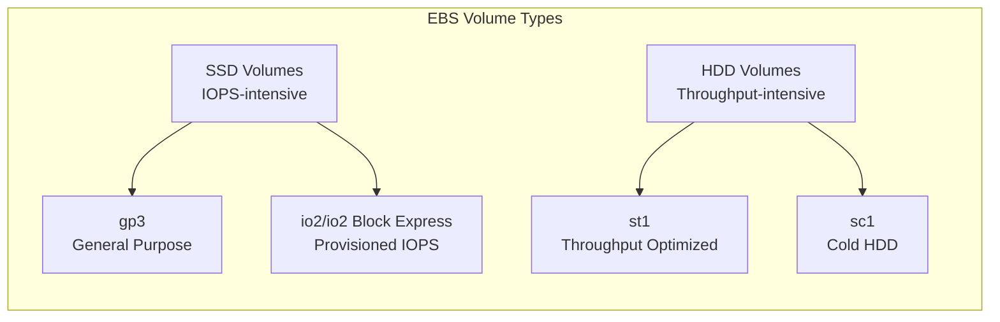
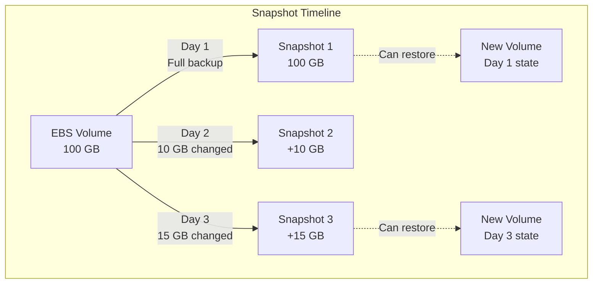
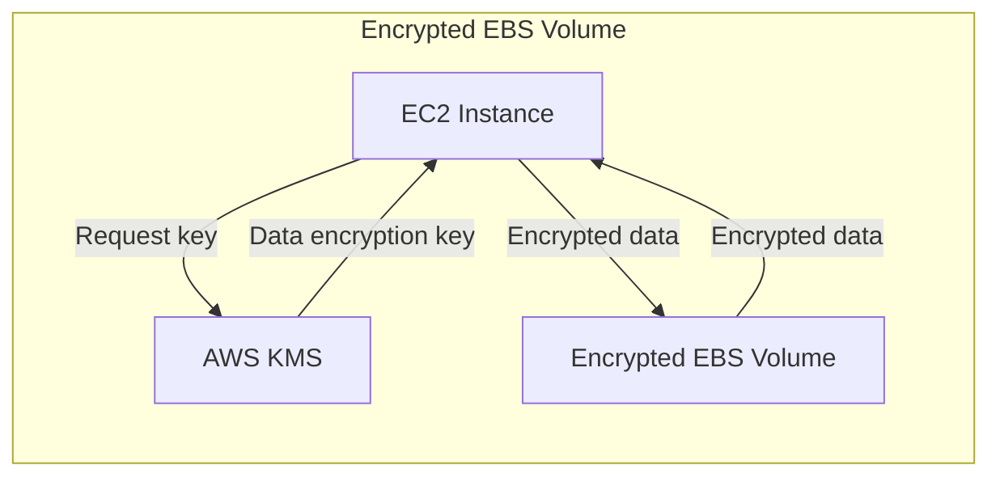

# Block Storage (EBS)

Amazon Elastic Block Store (EBS) provides persistent block-level storage volumes for use with Amazon EC2 instances. Unlike ephemeral instance storage that disappears when an instance terminates, EBS volumes persist independently and can be attached, detached, and reattached to different instances. Understanding EBS volume types, performance characteristics, and management strategies is essential for building high-performance, reliable cloud applications.

EBS is the foundation for many AWS workloads, serving as boot volumes for EC2 instances, storage for databases, and persistent storage for applications requiring low-latency, high-throughput access. Each EBS volume is automatically replicated within its Availability Zone to protect against hardware failures, providing a durability of 99.8% to 99.9% annually.

## Introduction to EBS and Block Storage

EBS provides raw block-level storage that appears to EC2 instances as locally attached volumes. The operating system can format these volumes with any file system (ext4, XFS, NTFS) and use them like physical hard drives.

### Core Concepts

**Volumes**:
- Block storage devices that can be attached to EC2 instances
- Size ranges from 1 GB to 64 TB (depending on volume type)
- Exist independently of instances - persist after instance termination
- Can only be attached to one instance at a time (except for Multi-Attach enabled io2 volumes)
- Located in a specific Availability Zone

**Snapshots**:
- Point-in-time backups of EBS volumes stored in Amazon S3
- Incremental backups - only changed blocks are saved after the first snapshot
- Can be used to create new volumes in any Availability Zone
- Serve as the foundation for disaster recovery and volume migration

**Volume Attachment**:
- Volumes attach to instances as block devices (/dev/sdf, /dev/sdg, etc.)
- Instance can have multiple volumes attached
- Root volumes (boot drives) delete by default when instance terminates
- Additional volumes persist by default unless configured otherwise



### Performance Characteristics

EBS volumes are characterized by three key performance metrics:

**IOPS (Input/Output Operations Per Second)**:
- Measures the number of read/write operations per second
- Critical for transactional databases and high-concurrency applications
- SSD volumes (gp3, io2) optimized for IOPS
- Each I/O operation is up to 256 KB (larger operations count as multiple IOPS)

**Throughput (MB/s)**:
- Measures the amount of data transferred per second
- Important for large sequential reads/writes
- HDD volumes (st1, sc1) optimized for throughput
- Streaming, big data, and log processing benefit from high throughput

**Latency**:
- Time between requesting and completing an I/O operation
- SSD volumes provide sub-millisecond latency
- HDD volumes have higher latency (10-20ms)
- Network latency between instance and EBS adds minimal overhead with EBS-optimized instances

## Volume Types

EBS offers multiple volume types optimized for different workload characteristics. Choosing the right volume type balances performance requirements with cost.



### gp3: General Purpose SSD

The default and most cost-effective SSD volume type, suitable for a wide variety of workloads.

**Performance Characteristics**:
- Baseline: 3,000 IOPS and 125 MB/s throughput (regardless of volume size)
- Scalable: Up to 16,000 IOPS and 1,000 MB/s throughput
- IOPS and throughput can be provisioned independently
- Latency: Single-digit milliseconds

**Specifications**:
- Volume size: 1 GB - 16 TB
- Max IOPS per volume: 16,000
- Max throughput per volume: 1,000 MB/s
- IOPS-to-throughput ratio: Flexible (unlike gp2)

**Pricing** (approximate):
- Storage: $0.08 per GB-month
- Additional IOPS beyond 3,000: $0.005 per IOPS-month
- Additional throughput beyond 125 MB/s: $0.04 per MB/s-month

**Use Cases**:
- Boot volumes for virtual desktops
- Development and test environments
- Low-latency interactive applications
- Medium-sized databases (MySQL, PostgreSQL)
- General-purpose workloads with balanced price/performance

**Example Configuration**:
```bash
# Create 100GB gp3 volume with 5,000 IOPS and 250 MB/s throughput
aws ec2 create-volume \
  --availability-zone us-east-1a \
  --size 100 \
  --volume-type gp3 \
  --iops 5000 \
  --throughput 250 \
  --tag-specifications 'ResourceType=volume,Tags=[{Key=Name,Value=app-data}]'
```

### io2: Provisioned IOPS SSD

High-performance SSD volumes designed for I/O-intensive workloads requiring sustained IOPS performance and low latency.

**Performance Characteristics**:
- Provisioned IOPS: Specify exact IOPS requirements
- Sub-millisecond latency
- 99.999% durability (10x better than gp3)
- IOPS:GB ratio up to 500:1 (io2 Block Express: 1000:1)

**Specifications**:
- Volume size: 4 GB - 16 TB (io2), 4 GB - 64 TB (io2 Block Express)
- Max IOPS per volume: 64,000 (io2), 256,000 (io2 Block Express)
- Max throughput per volume: 1,000 MB/s (io2), 4,000 MB/s (io2 Block Express)
- Multi-Attach: Supported (attach to up to 16 Nitro-based instances)

**Pricing** (approximate):
- Storage: $0.125 per GB-month
- Provisioned IOPS: $0.065 per IOPS-month
- io2 Block Express: $0.125 per GB-month + $0.065 per IOPS-month

**Use Cases**:
- Large relational databases (Oracle, SQL Server, MySQL, PostgreSQL)
- NoSQL databases (MongoDB, Cassandra)
- Mission-critical business applications
- SAP HANA and other in-memory databases
- Applications requiring sustained IOPS performance
- Multi-attach scenarios (shared storage for clusters)

**Example Configuration**:
```bash
# Create 500GB io2 volume with 32,000 IOPS
aws ec2 create-volume \
  --availability-zone us-east-1a \
  --size 500 \
  --volume-type io2 \
  --iops 32000 \
  --multi-attach-enabled \
  --tag-specifications 'ResourceType=volume,Tags=[{Key=Name,Value=database-volume}]'
```

### st1: Throughput Optimized HDD

Low-cost HDD volume designed for frequently accessed, throughput-intensive workloads with large sequential I/O.

**Performance Characteristics**:
- Throughput-oriented: Optimized for large sequential reads/writes
- Baseline: 40 MB/s per TB (minimum 125 MB/s)
- Burst: 250 MB/s per TB (maximum 500 MB/s)
- Higher latency than SSD (10-20ms)

**Specifications**:
- Volume size: 125 GB - 16 TB
- Max throughput per volume: 500 MB/s
- Max IOPS per volume: 500
- Cannot be used as boot volume

**Pricing** (approximate):
- Storage: $0.045 per GB-month

**Use Cases**:
- Big data processing (Hadoop, Kafka)
- Data warehouses
- Log processing
- ETL workloads
- Streaming workloads (video processing)
- Large sequential scan operations

**Example Configuration**:
```bash
# Create 2TB st1 volume for big data processing
aws ec2 create-volume \
  --availability-zone us-east-1a \
  --size 2000 \
  --volume-type st1 \
  --tag-specifications 'ResourceType=volume,Tags=[{Key=Name,Value=hadoop-data}]'
```

### sc1: Cold HDD

Lowest cost HDD volume for infrequently accessed workloads where cost is more important than performance.

**Performance Characteristics**:
- Lowest cost per GB
- Baseline: 12 MB/s per TB (minimum 12 MB/s)
- Burst: 80 MB/s per TB (maximum 250 MB/s)
- Higher latency than st1

**Specifications**:
- Volume size: 125 GB - 16 TB
- Max throughput per volume: 250 MB/s
- Max IOPS per volume: 250
- Cannot be used as boot volume

**Pricing** (approximate):
- Storage: $0.015 per GB-month

**Use Cases**:
- Infrequently accessed data
- Long-term archive storage requiring occasional access
- Scenarios where lowest cost is the primary requirement
- Backup storage with infrequent retrieval

**Example Configuration**:
```bash
# Create 1TB sc1 volume for backups
aws ec2 create-volume \
  --availability-zone us-east-1a \
  --size 1000 \
  --volume-type sc1 \
  --tag-specifications 'ResourceType=volume,Tags=[{Key=Name,Value=backup-archive}]'
```

### Volume Type Comparison

| Feature | gp3 | io2 | st1 | sc1 |
|---------|-----|-----|-----|-----|
| **Technology** | SSD | SSD | HDD | HDD |
| **Max IOPS** | 16,000 | 64,000 (256,000 BE) | 500 | 250 |
| **Max Throughput** | 1,000 MB/s | 1,000 MB/s (4,000 BE) | 500 MB/s | 250 MB/s |
| **Latency** | Single-digit ms | Sub-millisecond | 10-20ms | 10-20ms |
| **Durability** | 99.8-99.9% | 99.999% | 99.8-99.9% | 99.8-99.9% |
| **Cost/GB** | $0.08 | $0.125 | $0.045 | $0.015 |
| **Boot Volume** | Yes | Yes | No | No |
| **Multi-Attach** | No | Yes | No | No |
| **Best For** | General purpose | Databases, critical apps | Big data, streaming | Archives, backups |

## Snapshots and Backup Strategies

EBS snapshots are incremental backups stored in Amazon S3, providing durable, cost-effective backup and recovery capabilities.

### How Snapshots Work

1. **First Snapshot**: Full copy of all data on the volume
2. **Subsequent Snapshots**: Only blocks that have changed since the last snapshot
3. **Deletion**: Snapshots are organized so you can delete any snapshot without affecting others
4. **Storage**: Compressed and stored in S3 (you pay only for changed blocks)



### Creating and Managing Snapshots

```bash
# Create snapshot of volume
aws ec2 create-snapshot \
  --volume-id vol-1234567890abcdef0 \
  --description "Database backup 2024-01-15" \
  --tag-specifications 'ResourceType=snapshot,Tags=[{Key=Name,Value=db-backup-20240115}]'

# List snapshots
aws ec2 describe-snapshots --owner-ids self

# List snapshots for specific volume
aws ec2 describe-snapshots \
  --filters "Name=volume-id,Values=vol-1234567890abcdef0"

# Create volume from snapshot (can be in different AZ)
aws ec2 create-volume \
  --availability-zone us-east-1b \
  --snapshot-id snap-0123456789abcdef0 \
  --volume-type gp3 \
  --tag-specifications 'ResourceType=volume,Tags=[{Key=Name,Value=restored-volume}]'

# Copy snapshot to another region (disaster recovery)
aws ec2 copy-snapshot \
  --source-region us-east-1 \
  --source-snapshot-id snap-0123456789abcdef0 \
  --destination-region us-west-2 \
  --description "DR copy to us-west-2"

# Delete snapshot
aws ec2 delete-snapshot --snapshot-id snap-0123456789abcdef0
```

### Backup Strategies

**Automated Backups with Data Lifecycle Manager (DLM)**:
DLM automates snapshot creation, retention, and deletion:

```bash
# Create lifecycle policy (requires JSON file)
cat > lifecycle-policy.json << 'EOF'
{
  "PolicyDetails": {
    "PolicyType": "EBS_SNAPSHOT_MANAGEMENT",
    "ResourceTypes": ["VOLUME"],
    "TargetTags": [
      {
        "Key": "Backup",
        "Value": "Daily"
      }
    ],
    "Schedules": [
      {
        "Name": "DailySnapshots",
        "CreateRule": {
          "Interval": 24,
          "IntervalUnit": "HOURS",
          "Times": ["03:00"]
        },
        "RetainRule": {
          "Count": 7
        },
        "CopyTags": true
      }
    ]
  }
}
EOF

aws dlm create-lifecycle-policy \
  --description "Daily snapshots with 7-day retention" \
  --state ENABLED \
  --execution-role-arn arn:aws:iam::123456789012:role/AWSDataLifecycleManagerDefaultRole \
  --policy-details file://lifecycle-policy.json
```

**Best Practices**:
1. **Tag volumes** that require backups (e.g., Backup=Daily)
2. **Schedule snapshots** during low-traffic periods
3. **Test restores** regularly to verify backup integrity
4. **Implement retention policies** to control costs
5. **Copy critical snapshots** to another region for disaster recovery
6. **Encrypt snapshots** for sensitive data (copies of encrypted volumes are automatically encrypted)

## Encryption

EBS encryption provides data protection at rest and in transit between volumes and instances.

### Encryption Features

- **At-Rest Encryption**: Data encrypted on the volume using AES-256
- **In-Transit Encryption**: Data encrypted between EC2 instance and EBS volume
- **Transparent**: No application changes required
- **Performance**: Minimal impact on IOPS or throughput
- **Key Management**: Uses AWS Key Management Service (KMS)

### Encryption Workflow



### Managing Encrypted Volumes

```bash
# Create encrypted volume with default KMS key
aws ec2 create-volume \
  --availability-zone us-east-1a \
  --size 100 \
  --volume-type gp3 \
  --encrypted

# Create encrypted volume with custom KMS key
aws ec2 create-volume \
  --availability-zone us-east-1a \
  --size 100 \
  --volume-type gp3 \
  --encrypted \
  --kms-key-id arn:aws:kms:us-east-1:123456789012:key/12345678-1234-1234-1234-123456789012

# Enable encryption by default for new volumes
aws ec2 enable-ebs-encryption-by-default --region us-east-1

# Check encryption by default status
aws ec2 get-ebs-encryption-by-default --region us-east-1

# Create encrypted snapshot from unencrypted volume
aws ec2 copy-snapshot \
  --source-region us-east-1 \
  --source-snapshot-id snap-unencrypted123 \
  --destination-region us-east-1 \
  --encrypted \
  --kms-key-id arn:aws:kms:us-east-1:123456789012:key/12345678-1234-1234-1234-123456789012
```

**Key Points**:
- Snapshots of encrypted volumes are automatically encrypted
- Volumes created from encrypted snapshots are automatically encrypted
- Cannot directly convert unencrypted volume to encrypted (must create snapshot, copy with encryption, create new volume)
- Encryption is free (only pay for KMS key usage: $1/month per key + $0.03 per 10,000 requests)

## Performance Optimization

Maximizing EBS performance requires understanding and optimizing multiple factors.

### Pre-warming Volumes

New volumes created from snapshots load data lazily - blocks are loaded when first accessed. Pre-warming reads all blocks to ensure consistent performance.

```bash
# Pre-warm volume on Linux (read every block)
sudo dd if=/dev/xvdf of=/dev/null bs=1M

# Alternative: fio (Flexible I/O tester)
sudo fio --filename=/dev/xvdf --rw=read --bs=128k --iodepth=32 \
  --ioengine=libaio --direct=1 --name=volume-initialize
```

Pre-warming is unnecessary for:
- Volumes created from scratch (not from snapshots)
- Volumes with EBS Fast Snapshot Restore (FSR) enabled

### RAID Configurations

RAID (Redundant Array of Independent Disks) combines multiple EBS volumes for increased performance or redundancy.

**RAID 0 (Striping)**: Increased performance
- Combines multiple volumes for aggregate IOPS and throughput
- No redundancy - if one volume fails, all data is lost
- Use case: High-performance temporary storage, increased throughput

```bash
# Create RAID 0 array with 4 volumes
sudo mdadm --create --verbose /dev/md0 --level=0 --raid-devices=4 \
  /dev/xvdf /dev/xvdg /dev/xvdh /dev/xvdi

# Create filesystem
sudo mkfs.ext4 /dev/md0

# Mount RAID array
sudo mkdir /mnt/raid0
sudo mount /dev/md0 /mnt/raid0
```

**RAID 1 (Mirroring)**: Increased redundancy
- Mirrors data across multiple volumes
- Provides redundancy within same AZ (EBS already replicates within AZ)
- Generally unnecessary - EBS provides built-in redundancy
- Use case: Extremely critical data requiring additional protection

**Performance Benefits**:
- 4x gp3 volumes (1TB each): 12,000 IOPS → 48,000 IOPS aggregate
- Throughput increases linearly (4x 250 MB/s = 1,000 MB/s)

### EBS-Optimized Instances

EBS-optimized instances provide dedicated network bandwidth for EBS traffic, preventing contention with regular network traffic.

**Benefits**:
- Dedicated bandwidth between instance and EBS
- Consistent performance
- Reduced latency
- Most modern instance types are EBS-optimized by default

**Bandwidth by Instance Type** (examples):
- t3.medium: 2,085 Mbps (260 MB/s)
- m5.xlarge: 4,750 Mbps (593 MB/s)
- c5.4xlarge: 4,750 Mbps (593 MB/s)
- r5.8xlarge: 10,000 Mbps (1,250 MB/s)

```bash
# Launch EBS-optimized instance
aws ec2 run-instances \
  --image-id ami-0abcdef1234567890 \
  --instance-type m5.xlarge \
  --ebs-optimized \
  --key-name my-key-pair
```

### I/O Credits and Bursting

gp3 and st1 volumes have baseline performance but can burst to higher performance using I/O credits:

**gp3 Bursting** (for volumes < 1TB):
- No bursting - consistent 3,000 IOPS and 125 MB/s baseline

**st1 Bursting**:
- Baseline: 40 MB/s per TB
- Burst: 250 MB/s per TB (up to 500 MB/s max)
- I/O credit balance allows sustained bursting

Monitor burst balance:
```bash
# CloudWatch metric: BurstBalance
aws cloudwatch get-metric-statistics \
  --namespace AWS/EBS \
  --metric-name BurstBalance \
  --dimensions Name=VolumeId,Value=vol-1234567890abcdef0 \
  --start-time 2024-01-15T00:00:00Z \
  --end-time 2024-01-15T23:59:59Z \
  --period 3600 \
  --statistics Average
```

## Multi-Attach Capability

io2 volumes support Multi-Attach, allowing a single volume to be attached to up to 16 Nitro-based instances simultaneously within the same Availability Zone.

### Use Cases

- **Clustered Applications**: Shared storage for clustered databases or applications
- **High Availability**: Multiple instances accessing shared storage
- **Concurrent Write Applications**: Applications designed for concurrent writes with cluster-aware file systems

### Requirements

- io2 or io2 Block Express volume type
- Nitro-based EC2 instances
- All instances in same Availability Zone
- Cluster-aware file system (GFS2, GPFS) or application-level coordination

### Configuration

```bash
# Create Multi-Attach enabled io2 volume
aws ec2 create-volume \
  --availability-zone us-east-1a \
  --size 1000 \
  --volume-type io2 \
  --iops 50000 \
  --multi-attach-enabled \
  --tag-specifications 'ResourceType=volume,Tags=[{Key=Name,Value=cluster-shared-storage}]'

# Attach to first instance
aws ec2 attach-volume \
  --volume-id vol-1234567890abcdef0 \
  --instance-id i-instance1 \
  --device /dev/sdf

# Attach to second instance (same volume)
aws ec2 attach-volume \
  --volume-id vol-1234567890abcdef0 \
  --instance-id i-instance2 \
  --device /dev/sdf
```

**Limitations**:
- Cannot enable Multi-Attach on existing volumes
- Cannot create snapshots of Multi-Attach enabled volumes while attached to multiple instances
- Requires application or file system to coordinate writes

## Volume Management Examples

### Complete Volume Lifecycle

```bash
# 1. Create volume
VOLUME_ID=$(aws ec2 create-volume \
  --availability-zone us-east-1a \
  --size 100 \
  --volume-type gp3 \
  --iops 4000 \
  --throughput 250 \
  --encrypted \
  --tag-specifications 'ResourceType=volume,Tags=[{Key=Name,Value=production-data}]' \
  --query 'VolumeId' \
  --output text)

echo "Created volume: $VOLUME_ID"

# 2. Wait for volume to be available
aws ec2 wait volume-available --volume-ids $VOLUME_ID

# 3. Attach to instance
aws ec2 attach-volume \
  --volume-id $VOLUME_ID \
  --instance-id i-1234567890abcdef0 \
  --device /dev/sdf

# 4. Wait for attachment
aws ec2 wait volume-in-use --volume-ids $VOLUME_ID

# 5. Format and mount (on EC2 instance)
sudo mkfs -t ext4 /dev/xvdf
sudo mkdir /mnt/data
sudo mount /dev/xvdf /mnt/data

# 6. Add to /etc/fstab for persistent mounting
echo "/dev/xvdf /mnt/data ext4 defaults,nofail 0 2" | sudo tee -a /etc/fstab

# 7. Create snapshot for backup
SNAPSHOT_ID=$(aws ec2 create-snapshot \
  --volume-id $VOLUME_ID \
  --description "Backup of production data volume" \
  --tag-specifications 'ResourceType=snapshot,Tags=[{Key=Name,Value=production-data-backup}]' \
  --query 'SnapshotId' \
  --output text)

echo "Created snapshot: $SNAPSHOT_ID"

# 8. Modify volume (increase size)
aws ec2 modify-volume --volume-id $VOLUME_ID --size 200

# 9. Extend file system (on EC2 instance after modification completes)
sudo resize2fs /dev/xvdf
```

### Monitoring Volume Performance

```bash
# Get volume metrics (IOPS)
aws cloudwatch get-metric-statistics \
  --namespace AWS/EBS \
  --metric-name VolumeReadOps \
  --dimensions Name=VolumeId,Value=$VOLUME_ID \
  --start-time 2024-01-15T00:00:00Z \
  --end-time 2024-01-15T23:59:59Z \
  --period 300 \
  --statistics Sum

# Get throughput metrics
aws cloudwatch get-metric-statistics \
  --namespace AWS/EBS \
  --metric-name VolumeReadBytes \
  --dimensions Name=VolumeId,Value=$VOLUME_ID \
  --start-time 2024-01-15T00:00:00Z \
  --end-time 2024-01-15T23:59:59Z \
  --period 300 \
  --statistics Sum
```

## Summary

Amazon EBS provides high-performance, persistent block storage essential for cloud applications requiring low-latency, high-throughput access. Understanding the different volume types - from cost-effective gp3 for general workloads to high-performance io2 for demanding databases - enables optimal architecture decisions balancing performance and cost.

Key capabilities like snapshots for backup and disaster recovery, encryption for data protection, Multi-Attach for clustered applications, and performance optimization techniques like RAID and EBS-optimized instances make EBS a versatile storage solution. Proper volume selection, configuration, and management are fundamental skills for cloud architects and engineers building reliable, performant applications on AWS.
