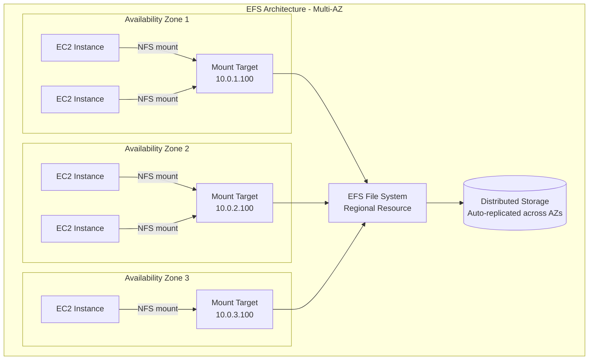
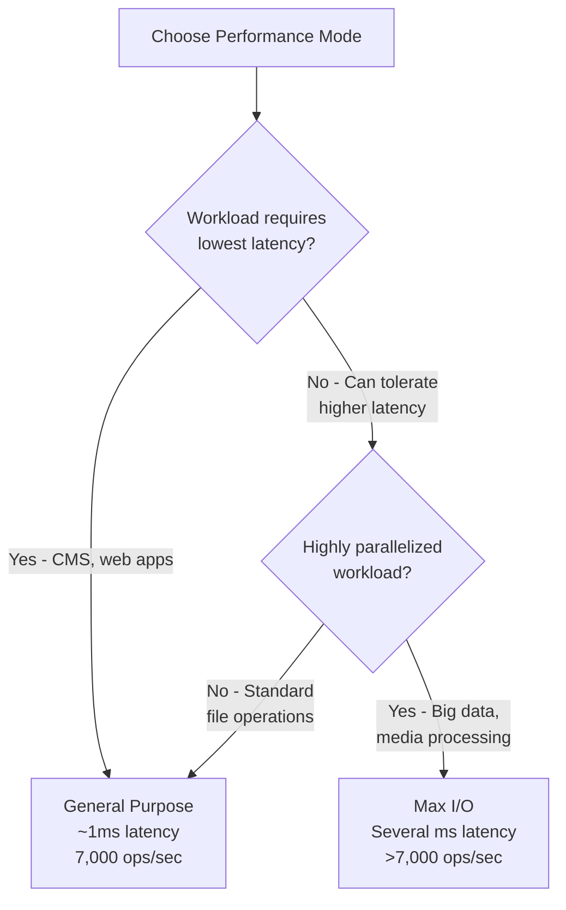

# File Storage (EFS)

Amazon Elastic File System (EFS) provides a fully-managed, scalable, elastic file storage service for use with AWS Cloud services and on-premises resources. Unlike EBS volumes that attach to single instances, EFS implements a shared file system accessible concurrently by thousands of EC2 instances across multiple Availability Zones. Understanding EFS's architecture, performance modes, and use cases is essential for building scalable applications requiring shared file access.

EFS implements the Network File System (NFS) v4 protocol, making it compatible with existing Linux applications and tools without modification. The file system automatically grows and shrinks as files are added and removed, eliminating the need for capacity planning. This elasticity, combined with high availability and durability, makes EFS ideal for content management systems, web serving, development environments, and containerized applications.

## Introduction to EFS and Shared File Systems

EFS provides a POSIX-compliant file system that multiple compute instances can access simultaneously over the network. This shared access model differs fundamentally from block storage, enabling collaboration, centralized data management, and simplified application architecture.

### Core Concepts

**File Systems**:
- Managed NFS file systems that can be mounted by multiple instances
- Automatically scale from gigabytes to petabytes
- Region-specific resource spanning multiple Availability Zones
- Pay only for storage used (no pre-provisioning required)
- Support standard file system operations (read, write, delete, directory management)

**Mount Targets**:
- Network endpoints in each Availability Zone for accessing the file system
- Instances connect to mount targets via NFS protocol
- Each mount target has an IP address in the subnet
- Security groups control access to mount targets
- Highly available within each AZ

**Access Points**:
- Application-specific entry points into the file system
- Enforce user identity and root directory for applications
- Enable multi-tenant access to shared file systems
- Simplify management for containerized and serverless applications



### POSIX Compliance

EFS is fully POSIX-compliant, supporting:
- **File Locking**: Advisory and mandatory locks for coordination
- **Strong Consistency**: Read-after-write consistency for all operations
- **File Permissions**: Standard Unix permissions (owner, group, other)
- **Symbolic Links**: Soft and hard links
- **File Attributes**: Standard metadata (timestamps, ownership, permissions)
- **Directory Operations**: Create, delete, rename directories

This compliance ensures existing Linux applications work without modification.

## How EFS Works

### Mount Targets and Network Access

Mount targets are network interfaces that provide access to the EFS file system from within a VPC. Each mount target resides in a specific subnet within an Availability Zone.

**Mount Target Architecture**:
1. Create mount target in each AZ where you have instances
2. Mount target gets IP address from subnet
3. Instances in that AZ connect to local mount target (lowest latency)
4. Security group on mount target controls access (port 2049 for NFS)
5. All mount targets connect to same shared file system

**Creating Mount Targets**:
```bash
# Create EFS file system
FILE_SYSTEM_ID=$(aws efs create-file-system \
  --performance-mode generalPurpose \
  --throughput-mode elastic \
  --encrypted \
  --tags Key=Name,Value=shared-app-storage \
  --query 'FileSystemId' \
  --output text)

echo "Created file system: $FILE_SYSTEM_ID"

# Create mount target in AZ 1
aws efs create-mount-target \
  --file-system-id $FILE_SYSTEM_ID \
  --subnet-id subnet-12345678 \
  --security-groups sg-abcdef12

# Create mount target in AZ 2
aws efs create-mount-target \
  --file-system-id $FILE_SYSTEM_ID \
  --subnet-id subnet-87654321 \
  --security-groups sg-abcdef12

# Create mount target in AZ 3
aws efs create-mount-target \
  --file-system-id $FILE_SYSTEM_ID \
  --subnet-id subnet-11223344 \
  --security-groups sg-abcdef12
```

### Security Groups Configuration

Security groups must allow NFS traffic on port 2049:

```bash
# Create security group for EFS mount targets
SG_ID=$(aws ec2 create-security-group \
  --group-name efs-mount-target-sg \
  --description "Security group for EFS mount targets" \
  --vpc-id vpc-12345678 \
  --query 'GroupId' \
  --output text)

# Allow NFS from EC2 instances (using EC2 security group)
aws ec2 authorize-security-group-ingress \
  --group-id $SG_ID \
  --protocol tcp \
  --port 2049 \
  --source-group sg-ec2instances

# Or allow from specific CIDR
aws ec2 authorize-security-group-ingress \
  --group-id $SG_ID \
  --protocol tcp \
  --port 2049 \
  --cidr 10.0.0.0/16
```

### Mounting EFS File Systems

Instances mount EFS file systems using standard Linux mount commands:

```bash
# Install NFS client (Amazon Linux 2)
sudo yum install -y amazon-efs-utils

# Create mount point
sudo mkdir /mnt/efs

# Mount using EFS mount helper (recommended)
sudo mount -t efs -o tls $FILE_SYSTEM_ID:/ /mnt/efs

# Or mount using NFS without encryption
sudo mount -t nfs4 -o nfsvers=4.1,rsize=1048576,wsize=1048576,hard,timeo=600,retrans=2,noresvport \
  fs-12345678.efs.us-east-1.amazonaws.com:/ /mnt/efs

# Mount specific directory using access point
sudo mount -t efs -o tls,accesspoint=fsap-12345678 $FILE_SYSTEM_ID:/ /mnt/efs

# Add to /etc/fstab for automatic mounting on boot
echo "$FILE_SYSTEM_ID:/ /mnt/efs efs _netdev,tls,iam 0 0" | sudo tee -a /etc/fstab

# Verify mount
df -h /mnt/efs
```

**Mount Options**:
- `tls`: Encrypt data in transit using TLS
- `iam`: Use IAM for authentication
- `accesspoint`: Mount via specific access point
- `rsize/wsize`: Read/write buffer sizes (performance tuning)
- `_netdev`: Ensures file system mounts after network is available

## Performance Modes

EFS offers two performance modes optimized for different workload characteristics. The mode is selected at file system creation and cannot be changed later.

### General Purpose Mode

The default mode suitable for most workloads, optimized for latency-sensitive operations.

**Characteristics**:
- Low latency: ~1ms for file operations
- Lower throughput per operation
- Ideal for latency-sensitive workloads
- Supports up to 7,000 file operations per second
- No additional cost

**Use Cases**:
- Web serving and content management
- Development and testing environments
- Home directories
- General-purpose file sharing
- Applications requiring low latency

**Creation**:
```bash
aws efs create-file-system \
  --performance-mode generalPurpose \
  --tags Key=Name,Value=web-content
```

### Max I/O Mode

Optimized for highly parallelized workloads that can tolerate slightly higher latencies in exchange for higher aggregate throughput.

**Characteristics**:
- Higher latency: Several milliseconds for file operations
- Higher aggregate throughput
- Scales to higher levels of IOPS
- Supports more than 7,000 operations per second
- No additional cost

**Use Cases**:
- Big data analytics (Hadoop, Spark)
- Media processing workflows
- Genomics analysis
- Large-scale content rendering
- Highly parallelized applications with many concurrent operations

**Creation**:
```bash
aws efs create-file-system \
  --performance-mode maxIO \
  --tags Key=Name,Value=big-data-processing
```

### Choosing Performance Mode



**Best Practice**: Start with General Purpose mode. Monitor the `PercentIOLimit` CloudWatch metric - if it consistently reaches 100%, consider recreating with Max I/O mode.

## Throughput Modes

EFS provides three throughput modes that determine how the file system scales its throughput capacity. Unlike performance modes, some throughput modes can be changed after creation.

### Bursting Throughput

Default mode where throughput scales with file system size, with the ability to burst to higher levels.

**How it Works**:
- Baseline: 50 MB/s per TB of storage (minimum 1 MB/s)
- Burst: Up to 100 MB/s per TB (with burst credits)
- Burst credits accumulate when below baseline
- All file systems can burst to at least 100 MB/s
- Standard storage class earns credits at 50 MB/s baseline

**Examples**:
- 100 GB file system: 1 MB/s baseline, bursts to 100 MB/s
- 1 TB file system: 50 MB/s baseline, bursts to 100 MB/s
- 5 TB file system: 250 MB/s baseline, bursts to 500 MB/s

**Pricing**:
- No additional throughput cost
- Pay only for storage

**Use Cases**:
- Variable workloads with periodic spikes
- File systems with predictable size growth
- Cost-sensitive applications

**Creation**:
```bash
aws efs create-file-system \
  --performance-mode generalPurpose \
  --throughput-mode bursting \
  --tags Key=Name,Value=variable-workload
```

**Monitoring Burst Credits**:
```bash
# Check burst credit balance
aws cloudwatch get-metric-statistics \
  --namespace AWS/EFS \
  --metric-name BurstCreditBalance \
  --dimensions Name=FileSystemId,Value=$FILE_SYSTEM_ID \
  --start-time 2024-01-15T00:00:00Z \
  --end-time 2024-01-15T23:59:59Z \
  --period 3600 \
  --statistics Average
```

### Provisioned Throughput

Fixed throughput independent of file system size, suitable for workloads with high throughput requirements relative to storage size.

**How it Works**:
- Specify exact throughput needed (1-1024 MB/s)
- Throughput available regardless of file system size
- Change throughput capacity as needed
- Can switch between Provisioned and Bursting modes (once per 24 hours)

**Pricing**:
- Storage: Standard EFS storage pricing
- Throughput: $6.00 per MB/s per month

**Use Cases**:
- Small file systems requiring high throughput
- Consistent high-throughput workloads
- Applications where throughput needs exceed burst capacity

**Creation and Modification**:
```bash
# Create with provisioned throughput
aws efs create-file-system \
  --performance-mode generalPurpose \
  --throughput-mode provisioned \
  --provisioned-throughput-in-mibps 100 \
  --tags Key=Name,Value=high-throughput-app

# Modify throughput
aws efs update-file-system \
  --file-system-id $FILE_SYSTEM_ID \
  --provisioned-throughput-in-mibps 200

# Switch to bursting mode
aws efs update-file-system \
  --file-system-id $FILE_SYSTEM_ID \
  --throughput-mode bursting
```

**Example Calculation**:
- 100 GB file system needs sustained 100 MB/s
- Bursting mode: 1 MB/s baseline (insufficient)
- Provisioned mode: 100 MB/s × $6/MB/s = $600/month for throughput
- Plus storage: 100 GB × $0.30/GB = $30/month
- Total: $630/month

### Elastic Throughput

Automatically scales throughput up or down based on workload, simplifying management while optimizing costs.

**How it Works**:
- Automatically scales to meet application needs
- Throughput scales up to 3 GB/s for reads, 1 GB/s for writes
- No need to provision or monitor throughput
- Pay only for throughput used (read and write separately)

**Pricing**:
- Storage: Standard EFS storage pricing
- Read throughput: $0.03 per GB transferred
- Write throughput: $0.06 per GB transferred
- No idle throughput charges

**Use Cases**:
- Unpredictable workloads
- Spiky workloads with variable throughput needs
- Simplified management without capacity planning
- Most workloads (recommended default for new applications)

**Creation**:
```bash
aws efs create-file-system \
  --performance-mode generalPurpose \
  --throughput-mode elastic \
  --tags Key=Name,Value=elastic-workload
```

**Comparison Example**:
```
Scenario: 1 TB file system, 10 GB/day writes, 50 GB/day reads

Bursting Mode:
- Storage: 1024 GB × $0.30 = $307.20/month
- Throughput: Included
- Total: $307.20/month

Elastic Mode:
- Storage: 1024 GB × $0.30 = $307.20/month
- Write throughput: 10 GB/day × 30 days × $0.06 = $18/month
- Read throughput: 50 GB/day × 30 days × $0.03 = $45/month
- Total: $370.20/month

Provisioned Mode (50 MB/s):
- Storage: $307.20/month
- Throughput: 50 MB/s × $6 = $300/month
- Total: $607.20/month
```

## Storage Classes

EFS offers two storage classes to optimize costs based on access patterns, with automatic lifecycle management to transition files between them.

### Standard Storage Class

Default storage class for frequently accessed files.

**Characteristics**:
- Lowest latency access
- Replicated across multiple Availability Zones
- 99.99% availability SLA
- 11 nines (99.999999999%) durability

**Pricing**:
- $0.30 per GB-month (us-east-1)

**Use Cases**:
- Actively used files
- Frequently accessed data
- Performance-critical applications

### Infrequent Access (IA) Storage Class

Lower-cost storage for files not accessed frequently.

**Characteristics**:
- Same durability and availability as Standard
- Lower storage cost
- Access fee charged when reading/writing
- Automatically used with lifecycle management

**Pricing**:
- $0.025 per GB-month (us-east-1) - 92% cheaper than Standard
- $0.01 per GB accessed (read or write)

**Use Cases**:
- Infrequently accessed files
- Long-term storage
- Backup and archive files accessed occasionally

### Lifecycle Management

Automatically transition files to IA storage class based on access patterns.

**Lifecycle Policies**:
- Transition to IA after: 7, 14, 30, 60, or 90 days of no access
- Transition back to Standard on access (if configured)
- Applied at file level, not file system level
- No charge for lifecycle transitions

**Configuration**:
```bash
# Enable lifecycle management (transition to IA after 30 days)
aws efs put-lifecycle-configuration \
  --file-system-id $FILE_SYSTEM_ID \
  --lifecycle-policies \
    TransitionToIA=AFTER_30_DAYS,TransitionToPrimaryStorageClass=AFTER_1_ACCESS

# Lifecycle policy options
# TransitionToIA: AFTER_7_DAYS, AFTER_14_DAYS, AFTER_30_DAYS, AFTER_60_DAYS, AFTER_90_DAYS
# TransitionToPrimaryStorageClass: AFTER_1_ACCESS (move back to Standard after first access)

# Get current lifecycle policy
aws efs describe-lifecycle-configuration --file-system-id $FILE_SYSTEM_ID

# Disable lifecycle management
aws efs put-lifecycle-configuration \
  --file-system-id $FILE_SYSTEM_ID \
  --lifecycle-policies
```

**Cost Optimization Example**:
```
1 TB file system with lifecycle policy (30 days to IA):
- 800 GB frequently accessed (remains in Standard): 800 × $0.30 = $240/month
- 200 GB infrequently accessed (moved to IA): 200 × $0.025 = $5/month
- IA access: 10 GB/month × $0.01 = $0.10/month
- Total: $245.10/month (vs $300/month all Standard)
- Savings: $54.90/month (18% reduction)
```

## Access Points

Access Points simplify managing multi-tenant access to shared file systems by providing application-specific entry points.

### Access Point Features

- **Root Directory**: Enforce specific directory as root for application
- **User/Group ID**: Override POSIX user and group IDs
- **Permissions Enforcement**: Set ownership and permissions for root directory
- **IAM Integration**: Use IAM policies to control access
- **Path Isolation**: Applications see only their designated path

### Use Cases

- **Multi-tenant SaaS Applications**: Isolate each customer to their own directory
- **Container Environments**: Provide each container with its own namespace
- **Serverless Applications**: Lambda functions accessing specific paths
- **Simplified Permissions**: Enforce permissions without modifying applications

### Creating Access Points

```bash
# Create access point for application A
AP_A=$(aws efs create-access-point \
  --file-system-id $FILE_SYSTEM_ID \
  --posix-user Uid=1001,Gid=1001 \
  --root-directory \
    "Path=/app-a,CreationInfo={OwnerUid=1001,OwnerGid=1001,Permissions=755}" \
  --tags Key=Name,Value=app-a-access \
  --query 'AccessPointId' \
  --output text)

# Create access point for application B
AP_B=$(aws efs create-access-point \
  --file-system-id $FILE_SYSTEM_ID \
  --posix-user Uid=1002,Gid=1002 \
  --root-directory \
    "Path=/app-b,CreationInfo={OwnerUid=1002,OwnerGid=1002,Permissions=755}" \
  --tags Key=Name,Value=app-b-access \
  --query 'AccessPointId' \
  --output text)

# Mount using access point
sudo mount -t efs -o tls,accesspoint=$AP_A $FILE_SYSTEM_ID:/ /mnt/app-a
sudo mount -t efs -o tls,accesspoint=$AP_B $FILE_SYSTEM_ID:/ /mnt/app-b
```

### IAM Policies for Access Points

```json
{
  "Version": "2012-10-17",
  "Statement": [
    {
      "Effect": "Allow",
      "Action": [
        "elasticfilesystem:ClientMount",
        "elasticfilesystem:ClientWrite"
      ],
      "Resource": "arn:aws:elasticfilesystem:us-east-1:123456789012:file-system/fs-12345678",
      "Condition": {
        "StringEquals": {
          "elasticfilesystem:AccessPointArn": "arn:aws:elasticfilesystem:us-east-1:123456789012:access-point/fsap-app-a"
        }
      }
    }
  ]
}
```

## Security

EFS provides multiple layers of security for protecting data.

### Encryption

**At Rest**:
- AES-256 encryption using AWS KMS
- Enabled at file system creation (cannot be changed)
- Uses AWS managed key or customer managed key
- No performance impact
- Transparent to applications

```bash
# Create encrypted file system with AWS managed key
aws efs create-file-system \
  --encrypted \
  --performance-mode generalPurpose \
  --throughput-mode elastic

# Create encrypted file system with customer managed key
aws efs create-file-system \
  --encrypted \
  --kms-key-id arn:aws:kms:us-east-1:123456789012:key/12345678-1234-1234-1234-123456789012 \
  --performance-mode generalPurpose \
  --throughput-mode elastic
```

**In Transit**:
- TLS 1.2 encryption between clients and EFS
- Enabled using mount option `tls`
- Uses certificates from AWS Certificate Manager (ACM)

```bash
# Mount with encryption in transit
sudo mount -t efs -o tls $FILE_SYSTEM_ID:/ /mnt/efs
```

### VPC Access Control

- EFS mount targets reside in VPC subnets
- Security groups control network access
- Cannot be accessed from internet (private only)
- VPN or Direct Connect required for on-premises access

### IAM Authorization

Control which IAM principals can perform file system operations:

```json
{
  "Version": "2012-10-17",
  "Statement": [
    {
      "Effect": "Allow",
      "Principal": {
        "AWS": "arn:aws:iam::123456789012:role/ECSTaskRole"
      },
      "Action": [
        "elasticfilesystem:ClientMount",
        "elasticfilesystem:ClientWrite"
      ],
      "Resource": "arn:aws:elasticfilesystem:us-east-1:123456789012:file-system/fs-12345678"
    }
  ]
}
```

## Cross-Region Replication

EFS supports cross-region replication for disaster recovery and compliance.

**Features**:
- Automatic, continuous replication to another region
- Near real-time recovery point objective (RPO)
- Read-only destination file system during replication
- Can fail over by making destination writable

**Configuration**:
```bash
# Enable replication to another region
aws efs create-replication-configuration \
  --source-file-system-id $FILE_SYSTEM_ID \
  --destinations Region=us-west-2

# Describe replication status
aws efs describe-replication-configurations \
  --file-system-id $FILE_SYSTEM_ID

# Delete replication configuration
aws efs delete-replication-configuration \
  --source-file-system-id $FILE_SYSTEM_ID
```

**Use Cases**:
- Disaster recovery (RPO of seconds to minutes)
- Compliance requirements for data replication
- Multi-region application deployments
- Geographic redundancy

## FSx Alternatives

While EFS provides NFS file storage, AWS offers FSx services for other file system types:

### Amazon FSx for Windows File Server

Fully managed Windows-native file system supporting SMB protocol.

**Features**:
- Native Windows file system (NTFS)
- SMB protocol (2.0-3.1.1)
- Active Directory integration
- Windows-specific features (DFS, shadow copies, ACLs)
- SSD and HDD storage options

**Use Cases**:
- Windows applications requiring SMB
- .NET applications
- SQL Server databases
- SharePoint, Exchange
- Windows home directories

**Comparison to EFS**:
- FSx for Windows: SMB protocol, Windows integration
- EFS: NFS protocol, Linux integration

### Amazon FSx for Lustre

High-performance file system for compute-intensive workloads.

**Features**:
- Sub-millisecond latencies
- Throughput up to hundreds of GB/s
- Millions of IOPS
- S3 integration for data repository
- POSIX-compliant

**Use Cases**:
- High-performance computing (HPC)
- Machine learning training
- Media processing and transcoding
- Electronic design automation (EDA)
- Genomics analysis

**Comparison to EFS**:
- FSx for Lustre: Extreme performance, temporary processing
- EFS: Moderate performance, persistent shared storage

**Performance Comparison**:
| Feature | EFS General Purpose | EFS Max I/O | FSx for Lustre |
|---------|-------------------|-------------|----------------|
| Latency | ~1ms | Several ms | Sub-millisecond |
| Throughput | Up to 10 GB/s | Up to 10+ GB/s | 100+ GB/s |
| IOPS | 7,000+ | 500,000+ | Millions |
| Protocol | NFS v4.1 | NFS v4.1 | Lustre |

## Complete EFS Deployment Example

End-to-end example of setting up EFS for a web application:

```bash
#!/bin/bash

# 1. Create EFS file system
FILE_SYSTEM_ID=$(aws efs create-file-system \
  --performance-mode generalPurpose \
  --throughput-mode elastic \
  --encrypted \
  --lifecycle-policies TransitionToIA=AFTER_30_DAYS \
  --tags Key=Name,Value=web-app-content Key=Environment,Value=production \
  --query 'FileSystemId' \
  --output text)

echo "Created file system: $FILE_SYSTEM_ID"

# 2. Wait for file system to be available
aws efs describe-file-systems --file-system-id $FILE_SYSTEM_ID --query 'FileSystems[0].LifeCycleState'

# 3. Create security group for mount targets
SG_ID=$(aws ec2 create-security-group \
  --group-name efs-web-app-sg \
  --description "EFS mount target security group" \
  --vpc-id vpc-12345678 \
  --query 'GroupId' \
  --output text)

# Allow NFS from web server security group
aws ec2 authorize-security-group-ingress \
  --group-id $SG_ID \
  --protocol tcp \
  --port 2049 \
  --source-group sg-webservers

# 4. Create mount targets in each AZ
aws efs create-mount-target \
  --file-system-id $FILE_SYSTEM_ID \
  --subnet-id subnet-az1 \
  --security-groups $SG_ID

aws efs create-mount-target \
  --file-system-id $FILE_SYSTEM_ID \
  --subnet-id subnet-az2 \
  --security-groups $SG_ID

aws efs create-mount-target \
  --file-system-id $FILE_SYSTEM_ID \
  --subnet-id subnet-az3 \
  --security-groups $SG_ID

# 5. Create access point for web content
ACCESS_POINT_ID=$(aws efs create-access-point \
  --file-system-id $FILE_SYSTEM_ID \
  --posix-user Uid=48,Gid=48 \
  --root-directory Path=/web-content,CreationInfo={OwnerUid=48,OwnerGid=48,Permissions=755} \
  --tags Key=Name,Value=web-content-ap \
  --query 'AccessPointId' \
  --output text)

echo "Created access point: $ACCESS_POINT_ID"

# 6. Mount on EC2 instances (run on each web server)
# sudo yum install -y amazon-efs-utils
# sudo mkdir -p /var/www/html
# sudo mount -t efs -o tls,accesspoint=$ACCESS_POINT_ID $FILE_SYSTEM_ID:/ /var/www/html
# echo "$FILE_SYSTEM_ID:/ /var/www/html efs _netdev,tls,accesspoint=$ACCESS_POINT_ID 0 0" | sudo tee -a /etc/fstab

# 7. Set up cross-region replication for DR
aws efs create-replication-configuration \
  --source-file-system-id $FILE_SYSTEM_ID \
  --destinations Region=us-west-2

echo "EFS setup complete!"
echo "File System ID: $FILE_SYSTEM_ID"
echo "Access Point ID: $ACCESS_POINT_ID"
echo "Mount command: sudo mount -t efs -o tls,accesspoint=$ACCESS_POINT_ID $FILE_SYSTEM_ID:/ /mnt/efs"
```

## Summary

Amazon EFS provides a fully-managed, elastic, shared file system ideal for applications requiring concurrent access from multiple compute instances. Its support for the NFS v4.1 protocol ensures compatibility with existing Linux applications, while features like automatic scaling, lifecycle management, and access points simplify operations and reduce costs.

Understanding EFS's performance modes, throughput modes, and storage classes enables optimal configuration for different workload characteristics. General Purpose mode with Elastic throughput and lifecycle management to IA storage provides an excellent default configuration for most applications, balancing performance, simplicity, and cost.

EFS excels at use cases like content management systems, web serving, containerized applications, and shared development environments. For Windows workloads or extreme performance requirements, AWS offers complementary services like FSx for Windows File Server and FSx for Lustre. Together, these file storage services provide comprehensive solutions for diverse cloud storage needs.