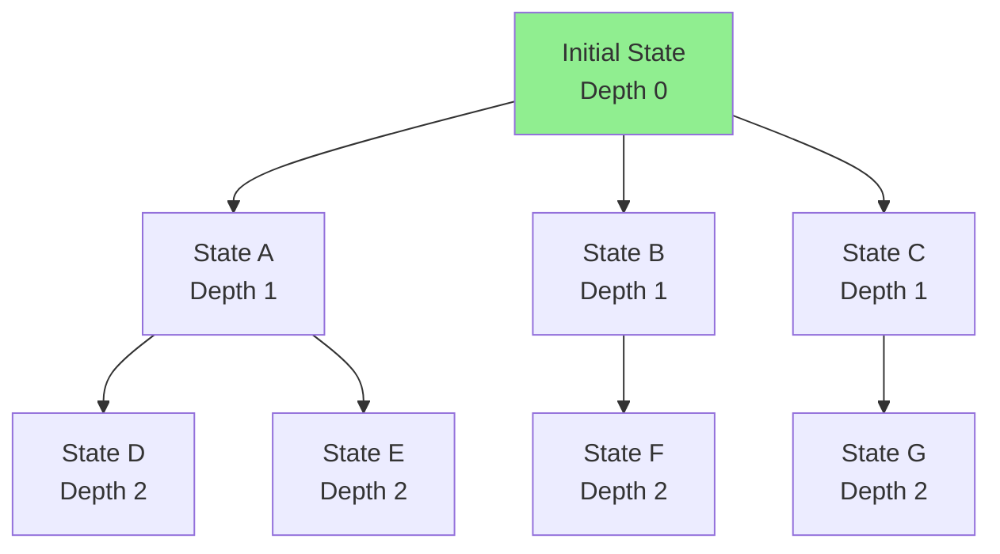
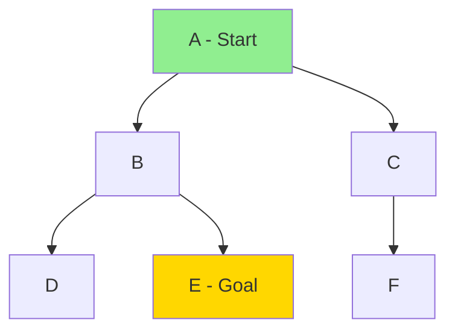
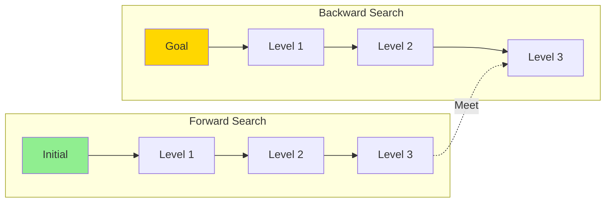

# Uninformed Search Strategies

## Introduction

Uninformed search strategies, also called blind search or brute-force search, explore the state space without using problem-specific knowledge beyond the problem definition. These algorithms have access only to the problem structure—states, actions, transition model, goal test—but no additional information about which states are more promising than others.

Despite this limitation, uninformed search algorithms provide the foundation for all search techniques and remain essential tools in AI. They guarantee finding solutions (when they exist) under certain conditions, serve as baselines for evaluating more sophisticated methods, and work when heuristic knowledge is unavailable or unreliable.

The key uninformed search strategies differ in the order they explore states: breadth-first search explores all states at depth $d$ before any at depth $d+1$, depth-first search explores as deeply as possible before backtracking, uniform-cost search expands the lowest-cost node, and iterative deepening combines the benefits of both breadth-first and depth-first approaches. Each has distinct properties regarding completeness, optimality, time complexity, and space complexity.

Understanding uninformed search requires examining how algorithms maintain the frontier (the set of unexplored nodes), how they avoid revisiting states, and how different exploration orders affect performance. We'll analyze each algorithm's behavior on sample problems, prove key properties, and understand when each is most appropriate.

## Breadth-First Search (BFS)

Breadth-First Search explores the state space level by level, expanding all nodes at depth $d$ before any nodes at depth $d+1$. This systematic exploration uses a FIFO (first-in, first-out) queue for the frontier.

### Algorithm

```python
from collections import deque

def breadth_first_search(problem):
    """
    Breadth-first search implementation.

    Args:
        problem: Search problem with initial state, actions, result, goal_test

    Returns:
        Solution path as list of actions, or None if no solution
    """
    # Node structure: (state, parent, action, path_cost)
    initial_node = (problem.initial, None, None, 0)

    # Check if initial state is goal
    if problem.goal_test(problem.initial):
        return []

    # Frontier as FIFO queue
    frontier = deque([initial_node])

    # Explored set to avoid revisiting states
    explored = set()

    while frontier:
        # Remove first node from frontier (FIFO)
        node = frontier.popleft()
        state, parent, action, cost = node

        # Add to explored set
        explored.add(state)

        # Expand node: generate successors
        for action in problem.actions(state):
            child_state = problem.result(state, action)

            # Skip if already explored or in frontier
            if child_state not in explored and not in_frontier(frontier, child_state):
                child_node = (child_state, node, action, cost + 1)

                # Goal test
                if problem.goal_test(child_state):
                    return extract_solution(child_node)

                frontier.append(child_node)

    return None  # No solution found

def in_frontier(frontier, state):
    """Check if state is in frontier."""
    return any(node[0] == state for node in frontier)

def extract_solution(node):
    """Extract solution path from goal node."""
    path = []
    while node[2] is not None:  # While action is not None
        path.append(node[2])
        node = node[1]  # Move to parent
    path.reverse()
    return path
```

### Example: 8-Puzzle

```
Initial:          Goal:
┌───┬───┬───┐    ┌───┬───┬───┐
│ 7 │ 2 │ 4 │    │   │ 1 │ 2 │
├───┼───┼───┤    ├───┼───┼───┤
│ 5 │   │ 6 │    │ 3 │ 4 │ 5 │
├───┼───┼───┤    ├───┼───┼───┤
│ 8 │ 3 │ 1 │    │ 6 │ 7 │ 8 │
└───┴───┴───┘    └───┴───┴───┘
```

BFS explores states by increasing depth:
- Depth 0: Initial state
- Depth 1: All states reachable in 1 move (up to 4 states)
- Depth 2: All states reachable in 2 moves (up to 16 states)
- ...continues until goal found



### Properties

**Completeness**: Yes (if branching factor $b$ is finite)
- BFS will eventually explore every reachable state
- If a solution exists at finite depth, BFS will find it

**Optimality**: Yes (if path cost = depth, i.e., uniform step costs)
- BFS finds shallowest goal first
- For uniform costs, shallowest = lowest cost
- Not optimal for varying step costs

**Time Complexity**: $O(b^d)$
- $b$ = branching factor (average number of successors)
- $d$ = depth of shallowest goal
- Explores all nodes at depths $0, 1, 2, ..., d$
- Total nodes: $1 + b + b^2 + ... + b^d = O(b^d)$

**Space Complexity**: $O(b^d)$
- Must store all nodes at current depth in frontier
- At depth $d$, frontier contains $O(b^d)$ nodes
- Explored set also grows to $O(b^d)$
- **Space is the major limitation of BFS**

### Complexity Example

For 8-puzzle with $b \approx 3$ and $d = 20$:
- Nodes explored: $3^{20} \approx 3.5$ billion
- Memory required: ~100 GB (assuming 30 bytes/node)
- **BFS is infeasible for large search spaces!**

## Depth-First Search (DFS)

Depth-First Search explores as deeply as possible along each branch before backtracking. It uses a LIFO (last-in, first-out) stack for the frontier.

### Algorithm

```python
def depth_first_search(problem, max_depth=float('inf')):
    """
    Depth-first search implementation.

    Args:
        problem: Search problem
        max_depth: Maximum depth to search (prevents infinite loops)

    Returns:
        Solution path or None
    """
    initial_node = (problem.initial, None, None, 0)

    if problem.goal_test(problem.initial):
        return []

    # Frontier as LIFO stack
    frontier = [initial_node]

    # Explored set
    explored = set()

    while frontier:
        # Remove last node from frontier (LIFO)
        node = frontier.pop()
        state, parent, action, depth = node

        # Check depth limit
        if depth > max_depth:
            continue

        # Add to explored
        explored.add(state)

        # Expand node
        for act in problem.actions(state):
            child_state = problem.result(state, act)

            if child_state not in explored and not in_frontier(frontier, child_state):
                child_node = (child_state, node, act, depth + 1)

                if problem.goal_test(child_state):
                    return extract_solution(child_node)

                frontier.append(child_node)

    return None
```

### Recursive Implementation

DFS is naturally expressed recursively:

```python
def dfs_recursive(problem, state, path, explored, max_depth=float('inf')):
    """Recursive DFS implementation."""
    if problem.goal_test(state):
        return path

    if len(path) >= max_depth:
        return None

    explored.add(state)

    for action in problem.actions(state):
        child = problem.result(state, action)

        if child not in explored:
            result = dfs_recursive(problem, child, path + [action], explored, max_depth)
            if result is not None:
                return result

    return None

# Usage
explored = set()
solution = dfs_recursive(problem, problem.initial, [], explored)
```

### Example Trace



DFS exploration order: A → B → D (dead end, backtrack) → E (goal found)

BFS would explore: A → B, C → D, E, F (more states before finding goal)

### Properties

**Completeness**: No (in infinite spaces or with cycles)
- Can get stuck in infinite branch
- Can loop infinitely if no cycle detection
- Complete in finite state spaces with cycle detection

**Optimality**: No
- Finds first goal encountered, not necessarily shallowest
- May find deep goal when shallow goal exists

**Time Complexity**: $O(b^m)$
- $m$ = maximum depth of search tree
- Can be much larger than $d$ (depth of shallowest goal)
- In worst case, explores entire tree

**Space Complexity**: $O(bm)$
- Only stores path from root to current node
- Plus siblings of nodes on path
- Linear in maximum depth (much better than BFS!)
- **Space advantage is DFS's main benefit**

### Depth-Limited Search

To prevent infinite descent, limit maximum depth:

```python
def depth_limited_search(problem, limit):
    """DFS with depth limit."""
    def recursive_dls(state, depth):
        if problem.goal_test(state):
            return []
        elif depth == 0:
            return 'cutoff'  # Depth limit reached
        else:
            cutoff_occurred = False
            for action in problem.actions(state):
                child = problem.result(state, action)
                result = recursive_dls(child, depth - 1)

                if result == 'cutoff':
                    cutoff_occurred = True
                elif result is not None:
                    return [action] + result

            return 'cutoff' if cutoff_occurred else None

    return recursive_dls(problem.initial, limit)
```

**Problem**: Choosing appropriate depth limit is difficult
- Too shallow: Miss solutions
- Too deep: Wastes time/space
- **Solution**: Iterative Deepening

## Uniform-Cost Search (UCS)

Uniform-Cost Search expands the node with the lowest path cost. It generalizes BFS to handle varying step costs.

### Algorithm

```python
import heapq

def uniform_cost_search(problem):
    """
    Uniform-cost search using priority queue.

    Args:
        problem: Search problem with step costs

    Returns:
        Solution path or None
    """
    # Node: (path_cost, state, parent, action)
    initial_node = (0, problem.initial, None, None)

    if problem.goal_test(problem.initial):
        return []

    # Priority queue: min-heap by path cost
    frontier = [initial_node]
    heapq.heapify(frontier)

    # Dictionary to track best cost to each state
    explored = {}

    while frontier:
        # Pop node with lowest path cost
        cost, state, parent, action = heapq.heappop(frontier)

        # Goal test when removing from frontier (not when adding)
        if problem.goal_test(state):
            return extract_solution_ucs((cost, state, parent, action))

        # Skip if we've found cheaper path to this state
        if state in explored and explored[state] <= cost:
            continue

        explored[state] = cost

        # Expand
        for act in problem.actions(state):
            child = problem.result(state, act)
            child_cost = cost + problem.step_cost(state, act, child)

            # Only add if not explored or found cheaper path
            if child not in explored or child_cost < explored.get(child, float('inf')):
                child_node = (child_cost, child, (cost, state, parent, action), act)
                heapq.heappush(frontier, child_node)

    return None

def extract_solution_ucs(node):
    """Extract solution from UCS node."""
    path = []
    while node[3] is not None:  # While action exists
        path.append(node[3])
        node = node[2]  # parent node
    path.reverse()
    return path
```

### Example: Romania Route Planning

```
         Arad
        /    \
      140    118
      /        \
   Sibiu    Timisoara
     |          |
     99        111
     |          |
  Fagaras    Lugoj
     |          |
    211        70
     |          |
 Bucharest  Mehadia
```

**BFS** would find: Arad → Sibiu → Fagaras → Bucharest (total: 450)

**UCS** finds optimal: Arad → Sibiu → Rimnicu Vilcea → Pitesti → Bucharest (total: 418)

### Properties

**Completeness**: Yes (if step costs ≥ ε > 0)
- Positive step costs prevent infinite loops with zero-cost cycles

**Optimality**: Yes
- Always expands lowest-cost path first
- When goal is expanded, it's on optimal path
- **Proof**: Suppose suboptimal goal $G_2$ expanded before optimal $G_1$. Then $cost(G_2) > cost(G_1)$. But UCS expands lowest cost first, so $cost(G_2) \leq cost(G_1)$. Contradiction! ∎

**Time Complexity**: $O(b^{1 + \lfloor C^*/\epsilon \rfloor})$
- $C^*$ = cost of optimal solution
- $\epsilon$ = minimum step cost
- Explores all nodes with $cost < C^*$

**Space Complexity**: $O(b^{1 + \lfloor C^*/\epsilon \rfloor})$
- Stores all generated nodes in frontier

### UCS vs BFS

**When to use UCS**:
- Step costs vary
- Want optimal solution
- Can afford space

**When to use BFS**:
- Uniform step costs
- BFS is simpler and faster when costs are uniform

## Iterative Deepening Depth-First Search (IDDFS)

Iterative Deepening combines the space efficiency of DFS with the completeness and optimality of BFS. It runs depth-limited search with increasing depth limits.

### Algorithm

```python
def iterative_deepening_search(problem, max_depth=100):
    """
    Iterative deepening depth-first search.

    Runs depth-limited search with increasing limits: 0, 1, 2, ...
    """
    for depth in range(max_depth):
        result = depth_limited_search(problem, depth)

        if result != 'cutoff':
            return result

    return None  # No solution within max_depth

def depth_limited_search(problem, limit):
    """Depth-limited search (helper for IDDFS)."""
    def recursive_dls(state, depth, path):
        if problem.goal_test(state):
            return path
        elif depth == 0:
            return 'cutoff'
        else:
            cutoff_occurred = False
            for action in problem.actions(state):
                child = problem.result(state, action)
                result = recursive_dls(child, depth - 1, path + [action])

                if result == 'cutoff':
                    cutoff_occurred = True
                elif result is not None:
                    return result

            return 'cutoff' if cutoff_occurred else None

    return recursive_dls(problem.initial, limit, [])
```

### Example: Search Progression

```
Depth 0: Check initial state
Depth 1: Explore 1 level deep
Depth 2: Explore 2 levels deep
Depth 3: Explore 3 levels deep
...until goal found
```

**Seems wasteful**: Revisits states multiple times!

**Actually efficient**: Most nodes are at deepest level

### Node Generation Count

For tree with branching factor $b$ and solution at depth $d$:

Nodes generated at each iteration:
- Depth 0: 1
- Depth 1: $1 + b = 1 + b$
- Depth 2: $1 + b + b^2$
- Depth $d$: $1 + b + b^2 + ... + b^d$

Total nodes generated:
$$N = (d+1) \cdot 1 + d \cdot b + (d-1) \cdot b^2 + ... + 1 \cdot b^d$$

For large $b$, dominated by last term: $O(b^d)$

**Same asymptotic complexity as BFS**, but uses only $O(bd)$ space!

### Overhead Analysis

Ratio of IDDFS to DFS node generations:

$$\frac{1 + 2b + 3b^2 + ... + db^{d-1} + (d+1)b^d}{1 + b + b^2 + ... + b^d}$$

For $b = 10$, $d = 5$:
- DFS generates: 111,111 nodes
- IDDFS generates: 123,456 nodes
- Overhead: Only 11%!

Most nodes are at deepest level, so regeneration overhead is minimal.

### Properties

**Completeness**: Yes (in finite state spaces)

**Optimality**: Yes (for uniform step costs)
- Finds shallowest goal like BFS

**Time Complexity**: $O(b^d)$
- Same as BFS asymptotically

**Space Complexity**: $O(bd)$
- Like DFS, linear in depth
- **Best of both worlds!**

**When to use**: Default choice for large state spaces with uniform costs

## Bidirectional Search

Bidirectional Search runs two simultaneous searches: forward from initial state and backward from goal state. They meet in the middle.

### Concept



### Algorithm

```python
def bidirectional_search(problem):
    """
    Bidirectional search: forward from initial, backward from goal.

    Requires: Reversible actions for backward search
    """
    if problem.goal_test(problem.initial):
        return []

    # Forward frontier and explored
    frontier_f = deque([(problem.initial, None, None)])
    explored_f = {problem.initial: (None, None)}

    # Backward frontier and explored
    frontier_b = deque([(problem.goal, None, None)])
    explored_b = {problem.goal: (None, None)}

    while frontier_f and frontier_b:
        # Expand forward
        if frontier_f:
            state_f, parent_f, action_f = frontier_f.popleft()

            # Check if meets backward search
            if state_f in explored_b:
                return combine_paths(explored_f, explored_b, state_f)

            for action in problem.actions(state_f):
                child = problem.result(state_f, action)
                if child not in explored_f:
                    frontier_f.append((child, state_f, action))
                    explored_f[child] = (state_f, action)

        # Expand backward
        if frontier_b:
            state_b, parent_b, action_b = frontier_b.popleft()

            # Check if meets forward search
            if state_b in explored_f:
                return combine_paths(explored_f, explored_b, state_b)

            for action in problem.reverse_actions(state_b):
                child = problem.reverse_result(state_b, action)
                if child not in explored_b:
                    frontier_b.append((child, state_b, action))
                    explored_b[child] = (state_b, action)

    return None

def combine_paths(explored_f, explored_b, meeting_state):
    """Combine forward and backward paths at meeting point."""
    # Construct forward path
    path_f = []
    state = meeting_state
    while explored_f[state][0] is not None:
        path_f.append(explored_f[state][1])
        state = explored_f[state][0]
    path_f.reverse()

    # Construct backward path
    path_b = []
    state = meeting_state
    while explored_b[state][0] is not None:
        path_b.append(reverse_action(explored_b[state][1]))
        state = explored_b[state][0]

    return path_f + path_b
```

### Complexity Advantage

**Regular BFS**: Explores $O(b^d)$ nodes to depth $d$

**Bidirectional**: Each search explores to depth $d/2$
- Forward: $O(b^{d/2})$
- Backward: $O(b^{d/2})$
- Total: $O(2 \cdot b^{d/2}) = O(b^{d/2})$

**Exponential speedup**: $b^{d/2} \ll b^d$ for large $b$ and $d$

**Example**: $b = 10$, $d = 6$
- BFS: $10^6 = 1,000,000$ nodes
- Bidirectional: $2 \cdot 10^3 = 2,000$ nodes
- **500× reduction!**

### Challenges

1. **Backward search**: Requires ability to generate predecessors
   - Some problems have irreversible actions
   - Generating predecessors may be difficult

2. **Multiple goal states**: Backward search from which goal?
   - Need to know goal state(s) explicitly
   - Can't just have goal test

3. **Checking intersection**: Must efficiently check if searches have met
   - Hash tables for explored sets

4. **Space complexity**: Still $O(b^{d/2})$, both searches store states

## Comparison of Uninformed Search Strategies

| Algorithm | Complete? | Optimal? | Time | Space |
|-----------|-----------|----------|------|-------|
| BFS | Yes* | Yes** | $O(b^d)$ | $O(b^d)$ |
| DFS | No*** | No | $O(b^m)$ | $O(bm)$ |
| Depth-Limited | No | No | $O(b^l)$ | $O(bl)$ |
| Iterative Deepening | Yes* | Yes** | $O(b^d)$ | $O(bd)$ |
| Uniform-Cost | Yes**** | Yes | $O(b^{C^*/\epsilon})$ | $O(b^{C^*/\epsilon})$ |
| Bidirectional | Yes* | Yes** | $O(b^{d/2})$ | $O(b^{d/2})$ |

*If $b$ is finite
**If step costs are uniform
***Can be made complete with cycle detection in finite spaces
****If step costs ≥ $\epsilon > 0$

Legend:
- $b$ = branching factor
- $d$ = depth of shallowest goal
- $m$ = maximum depth
- $l$ = depth limit
- $C^*$ = cost of optimal solution
- $\epsilon$ = minimum step cost

## Choosing a Search Strategy

**Decision Factors**:

1. **Space available**:
   - Limited → DFS or Iterative Deepening
   - Abundant → BFS or UCS

2. **Step costs**:
   - Uniform → BFS or IDDFS
   - Variable → UCS

3. **Solution depth**:
   - Shallow → BFS
   - Deep → IDDFS (avoid wasting space)

4. **Optimality requirement**:
   - Need optimal → BFS (uniform costs) or UCS (variable costs)
   - Any solution → DFS

5. **State space size**:
   - Small → Any algorithm works
   - Large → IDDFS (best space efficiency)

**Recommended Defaults**:
- **Uniform costs, large space**: Iterative Deepening DFS
- **Variable costs**: Uniform-Cost Search
- **Small state space**: BFS
- **Known goal location**: Bidirectional Search

## Practical Considerations

### Avoiding Repeated States

**Graph Search** vs **Tree Search**:

Tree search can revisit states, causing:
- Redundant work
- Infinite loops (in graphs with cycles)
- Exponential blowup

Graph search maintains explored set:
```python
explored = set()

while frontier:
    node = frontier.pop()

    if node.state in explored:
        continue  # Skip already explored

    explored.add(node.state)
    # ... expand node
```

**Cost**: Space to store explored set
**Benefit**: Avoid redundant exploration

### Implementation Optimizations

**1. Lazy Evaluation**: Don't generate all successors at once
```python
def successors_generator(state):
    for action in actions(state):
        yield (action, result(state, action))
```

**2. Path Reconstruction**: Store parent pointers, not full paths
```python
node = {'state': s, 'parent': parent_node, 'action': a}
```

**3. Hash Functions**: Efficient state comparison
```python
def state_hash(state):
    return hash(tuple(state))  # For list/array states
```

**4. Priority Queue Efficiency**: Use binary heap
```python
import heapq
heapq.heappush(frontier, (priority, node))
```

## Conclusion

Uninformed search strategies provide foundational algorithms for exploring state spaces without domain knowledge. Each algorithm makes different trade-offs between completeness, optimality, time complexity, and space complexity.

**Breadth-First Search** systematically explores by depth, guaranteeing optimality for uniform costs but requiring exponential space. **Depth-First Search** uses linear space by exploring deeply but sacrifices completeness and optimality. **Uniform-Cost Search** handles varying costs, finding optimal solutions at the expense of space. **Iterative Deepening** brilliantly combines BFS's optimality with DFS's space efficiency, making it the default choice for many problems. **Bidirectional Search** offers exponential speedup when applicable.

Understanding these algorithms' properties—proven through careful analysis of completeness, optimality, and complexity—enables informed algorithm selection. The comparison table and decision factors guide practitioners to appropriate choices for specific problems.

While uninformed search works without heuristic knowledge, it explores blindly, often inefficiently. The next step in search algorithms introduces heuristic functions that guide search toward promising states, dramatically improving performance on many problems.
