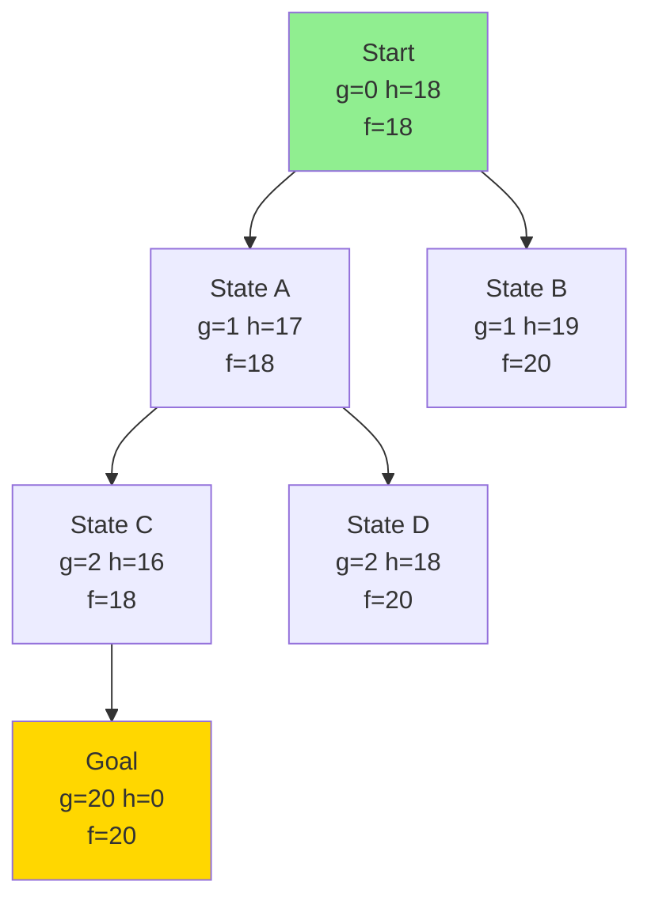

# Informed Search and A*

## Introduction

Informed search strategies use problem-specific knowledge beyond the problem definition to find solutions more efficiently than uninformed search. This knowledge comes in the form of a **heuristic function** $h(n)$ that estimates the cost from node $n$ to the nearest goal. By using heuristics to guide search toward promising states, informed algorithms can solve problems that are intractable for uninformed search.

The most important informed search algorithm is A*, which combines the actual cost to reach a node with the heuristic estimate of the remaining cost. A* is **optimal** (finds lowest-cost solutions) and **optimally efficient** (expands the minimum number of nodes necessary for optimality) under certain conditions on the heuristic function.

Understanding informed search requires grasping two key concepts: **admissibility** (heuristics never overestimate true cost) and **consistency** (heuristics satisfy a triangle inequality). These properties determine whether A* finds optimal solutions and how efficiently it does so.

## Heuristic Functions

A heuristic function $h(n)$ estimates the cost of the cheapest path from node $n$ to a goal state.

**Definition**: $h: States \to \mathbb{R}^+$

where $h(n)$ approximates $h^*(n)$, the true optimal cost from $n$ to goal.

**Examples**:

### 8-Puzzle Heuristics

**Manhattan Distance** (sum of distances of tiles from goal positions):
```python
def manhattan_distance(state, goal):
    distance = 0
    for i in range(3):
        for j in range(3):
            if state[i][j] != 0:  # Ignore blank
                # Find goal position of this tile
                goal_pos = find_position(goal, state[i][j])
                distance += abs(i - goal_pos[0]) + abs(j - goal_pos[1])
    return distance
```

**Example**:
```
Current:          Goal:
┌───┬───┬───┐    ┌───┬───┬───┐
│ 7 │ 2 │ 4 │    │   │ 1 │ 2 │
├───┼───┼───┤    ├───┼───┼───┤
│ 5 │   │ 6 │    │ 3 │ 4 │ 5 │
├───┼───┼───┤    ├───┼───┼───┤
│ 8 │ 3 │ 1 │    │ 6 │ 7 │ 8 │
└───┴───┴───┘    └───┴───┴───┘

Tile 7: (0,0) → (2,1) = |0-2| + |0-1| = 3
Tile 2: (0,1) → (0,2) = |0-0| + |1-2| = 1
... (sum all)
h = 18
```

**Misplaced Tiles** (count of tiles not in goal position):
```python
def misplaced_tiles(state, goal):
    count = 0
    for i in range(3):
        for j in range(3):
            if state[i][j] != 0 and state[i][j] != goal[i][j]:
                count += 1
    return count
```

**Comparison**:
- Manhattan Distance: More informative (larger values, closer to true cost)
- Misplaced Tiles: Less informative but faster to compute

### Route Planning Heuristics

**Straight-Line Distance** to goal:
```python
def straight_line_distance(city, goal):
    # Euclidean distance on map
    x1, y1 = coordinates[city]
    x2, y2 = coordinates[goal]
    return ((x2 - x1)**2 + (y2 - y1)**2)**0.5
```

**Properties**: Never overestimates (can't travel faster than straight line)

## Greedy Best-First Search

Greedy Best-First Search expands the node that appears closest to goal according to $h(n)$.

### Algorithm

```python
import heapq

def greedy_best_first_search(problem, heuristic):
    initial_node = (heuristic(problem.initial), 0, problem.initial, None, None)
    
    if problem.goal_test(problem.initial):
        return []
    
    # Priority queue: min-heap by h(n)
    frontier = [initial_node]
    explored = set()
    
    while frontier:
        h_val, cost, state, parent, action = heapq.heappop(frontier)
        
        if problem.goal_test(state):
            return extract_solution((h_val, cost, state, parent, action))
        
        explored.add(state)
        
        for act in problem.actions(state):
            child = problem.result(state, act)
            if child not in explored:
                child_h = heuristic(child)
                child_node = (child_h, cost + 1, child, 
                             (h_val, cost, state, parent, action), act)
                heapq.heappush(frontier, child_node)
    
    return None
```

### Properties

**Completeness**: No (can get stuck in loops)
- Even with explored set, may explore infinite path

**Optimality**: No
- Finds any goal, not necessarily cheapest
- Greedy choice may lead to suboptimal solution

**Example of Suboptimality**:
```
     Start
      / \
    1/   \100
    /     \
   A       B
   |       |
   |100    |1
   |       |
   Goal    Goal
   
h(A) = 100
h(B) = 1

Greedy chooses: Start → B → Goal (cost 101)
Optimal: Start → A → Goal (cost 101... wait, same!)
Better example:

     S
    / \
   1/   \2  
  /     \
 A       B
 |       |
99|      |1
 |       |
 G       G

h(A) = 1
h(B) = 2

Greedy: S → A → G (cost 100)
Optimal: S → B → G (cost 3)
```

**Time/Space**: $O(b^m)$ where $m$ is maximum depth
- Can be reduced with good heuristic

**Advantage**: Very fast when heuristic is good
**Disadvantage**: Not optimal, not complete

## A* Search

A* Search combines actual cost $g(n)$ with heuristic estimate $h(n)$ using evaluation function:

$$f(n) = g(n) + h(n)$$

where:
- $g(n)$ = actual cost from start to $n$
- $h(n)$ = estimated cost from $n$ to goal
- $f(n)$ = estimated total cost of path through $n$

A* expands nodes in order of increasing $f(n)$ value.

### Algorithm

```python
import heapq

def a_star_search(problem, heuristic):
    initial_h = heuristic(problem.initial)
    initial_node = (initial_h, 0, problem.initial, None, None)
    # Node format: (f, g, state, parent, action)
    
    if problem.goal_test(problem.initial):
        return []
    
    frontier = [initial_node]
    explored = {}  # Maps state to best g value found
    
    while frontier:
        f, g, state, parent, action = heapq.heappop(frontier)
        
        # Goal test when removing from frontier
        if problem.goal_test(state):
            return extract_solution((f, g, state, parent, action))
        
        # Skip if found better path to this state
        if state in explored and explored[state] <= g:
            continue
        
        explored[state] = g
        
        for act in problem.actions(state):
            child = problem.result(state, act)
            child_g = g + problem.step_cost(state, act, child)
            child_h = heuristic(child)
            child_f = child_g + child_h
            
            if child not in explored or child_g < explored.get(child, float('inf')):
                child_node = (child_f, child_g, child, 
                             (f, g, state, parent, action), act)
                heapq.heappush(frontier, child_node)
    
    return None
```

### Example: 8-Puzzle with Manhattan Distance

```
Start: h=18, g=0, f=18
  ↓ (move blank up)
State A: h=17, g=1, f=18
  ↓ (move blank left)
State B: h=16, g=2, f=18
...
Goal: h=0, g=20, f=20
```

A* explores states with lowest $f$ value first, finding optimal 20-move solution.



## Admissibility

A heuristic $h(n)$ is **admissible** if it never overestimates the true cost to reach a goal:

$$h(n) \leq h^*(n) \quad \forall n$$

where $h^*(n)$ is the true optimal cost from $n$ to nearest goal.

**Intuition**: Optimistic heuristic (thinks goal is closer than it really is)

### Examples

**Admissible**:
- Manhattan distance for 8-puzzle (can't move tiles diagonally)
- Straight-line distance for route finding (can't go through obstacles)
- Number of misplaced tiles (each requires at least 1 move)

**Not Admissible**:
- $h(n) = 2 \times$ Manhattan distance (overestimates)
- Random positive number (no relationship to true cost)

### Theorem: A* with Admissible Heuristic is Optimal

**Theorem**: If $h(n)$ is admissible, A* using tree search is optimal.

**Proof**:
Suppose A* returns suboptimal goal $G_2$ before optimal goal $G_1$.

Let $n$ be a node on optimal path to $G_1$ currently in frontier.

We have:
$$f(G_2) = g(G_2) + h(G_2) = g(G_2) + 0 = g(G_2)$$

Since $G_2$ is suboptimal: $g(G_2) > g(G_1)$

For node $n$ on path to $G_1$:
$$f(n) = g(n) + h(n) \leq g(n) + h^*(n) = g(G_1)$$

(Equality holds when $n$ is on optimal path)

Therefore: $f(n) \leq g(G_1) < g(G_2) = f(G_2)$

So $f(n) < f(G_2)$, meaning A* should expand $n$ before $G_2$.

But we assumed A* expanded $G_2$ first. Contradiction! ∎

**Conclusion**: A* cannot return suboptimal solution with admissible $h$.

## Consistency (Monotonicity)

A heuristic $h(n)$ is **consistent** (or monotonic) if for every node $n$ and successor $n'$ via action $a$:

$$h(n) \leq c(n, a, n') + h(n')$$

where $c(n, a, n')$ is the step cost from $n$ to $n'$.

**Triangle Inequality Interpretation**:

```
      n
     / \
  h(n)  \ c(n,a,n')
   /     \
Goal ← h(n') n'
```

The estimated cost from $n$ should be ≤ step cost plus estimated cost from $n'$.

**Consistency implies Admissibility**:

Proof by induction on path length:
- Base case: At goal, $h(goal) = 0 \leq h^*(goal) = 0$ ✓
- Inductive: If $h(n') \leq h^*(n')$, then:
  $$h(n) \leq c(n,n') + h(n') \leq c(n,n') + h^*(n') = h^*(n)$$ ✓

**Property**: With consistent heuristic, A* expands nodes in order of increasing $f$ value.

### Example: Manhattan Distance is Consistent

For any move in 8-puzzle:
- Moving a tile changes Manhattan distance by at most ±1
- Step cost = 1
- $h(n) \leq 1 + h(n')$ always holds ✓

## A* Optimality Proof (Graph Search)

With consistent heuristic, A* using graph search is optimal.

**Key Lemma**: If $h$ is consistent, when A* expands node $n$, it has found optimal path to $n$.

**Proof**:
Suppose A* expands $n$ via suboptimal path with cost $g(n) > g^*(n)$.

Then there exists better path to $n$ with some node $n'$ still in frontier.

For $n'$ on optimal path:
$$f(n') = g(n') + h(n') \leq g^*(n) + h(n) = f(n)$$

So A* should expand $n'$ before $n$. Contradiction! ∎

**Optimality**: When A* selects goal for expansion, it's on optimal path.

## Comparing Heuristics

Given two admissible heuristics $h_1$ and $h_2$:

$h_2$ **dominates** $h_1$ if $h_2(n) \geq h_1(n)$ for all $n$.

**Theorem**: If $h_2$ dominates $h_1$, A* with $h_2$ expands fewer or equal nodes.

**Proof**:
A* expands all nodes with $f(n) < C^*$ (cost of optimal solution).

$f_1(n) = g(n) + h_1(n)$ vs $f_2(n) = g(n) + h_2(n)$

Since $h_2(n) \geq h_1(n)$: $f_2(n) \geq f_1(n)$

Nodes with $f_1(n) < C^*$ but $f_2(n) \geq C^*$ are expanded by $h_1$ but not $h_2$. ∎

**Example**: Manhattan distance dominates misplaced tiles
- Manhattan: $h = 18$
- Misplaced: $h = 8$
- A* with Manhattan expands fewer nodes

### Effective Branching Factor

Measure of heuristic quality:

If A* expands $N$ nodes to depth $d$, effective branching factor $b^*$ satisfies:
$$N = 1 + b^* + (b^*)^2 + ... + (b^*)^d$$

Better heuristics have lower $b^*$.

**Example Results**:
- $h_1$ (misplaced): $b^* = 2.79$
- $h_2$ (Manhattan): $b^* = 1.42$

Manhattan is much better!

## Weighted A* and Speed-Optimality Tradeoff

**Weighted A***: $f(n) = g(n) + W \times h(n)$ where $W > 1$

**Effect**:
- $W = 1$: Standard A* (optimal)
- $W > 1$: More greedy, faster but suboptimal
- $W = \infty$: Greedy best-first

**Bound**: Solution cost ≤ $W \times$ optimal cost

**Use case**: When speed matters more than optimality

```python
def weighted_a_star(problem, heuristic, weight=1.5):
    # Same as A* but:
    child_f = child_g + weight * child_h
```

## IDA* (Iterative Deepening A*)

Combines iterative deepening with A* evaluation function.

**Idea**: Depth-limited search with $f$-value threshold instead of depth.

```python
def ida_star(problem, heuristic):
    threshold = heuristic(problem.initial)
    path = [problem.initial]
    
    while True:
        result, new_threshold = search(problem, path, 0, threshold, heuristic)
        if result is not None:
            return result
        if new_threshold == float('inf'):
            return None
        threshold = new_threshold

def search(problem, path, g, threshold, heuristic):
    node = path[-1]
    f = g + heuristic(node)
    
    if f > threshold:
        return None, f
    
    if problem.goal_test(node):
        return path, None
    
    min_threshold = float('inf')
    for action in problem.actions(node):
        child = problem.result(node, action)
        if child not in path:
            path.append(child)
            result, t = search(problem, path, g + 1, threshold, heuristic)
            if result is not None:
                return result, None
            min_threshold = min(min_threshold, t)
            path.pop()
    
    return None, min_threshold
```

**Space Complexity**: $O(d)$ (linear!)
**Time Complexity**: Same asymptotic as A*
**Use**: When A* requires too much memory

## Memory-Bounded A*: RBFS and SMA*

**RBFS** (Recursive Best-First Search):
- Like IDA* but remembers $f$ values
- Avoids regenerating same states

**SMA*** (Simplified Memory-Bounded A*):
- Uses all available memory
- Drops worst leaf nodes when memory full
- Re-generates if needed later

**Trade-off**: Time vs space

## Conclusion

Informed search dramatically improves efficiency over uninformed search by using heuristic functions to guide search toward goals. A* is the premier informed search algorithm, guaranteed to find optimal solutions when using admissible (or consistent) heuristics.

Key insights:
- **Heuristic quality matters**: Better heuristics (higher values while remaining admissible) expand fewer nodes
- **Admissibility ensures optimality**: Never overestimating guarantees finding best solution
- **Consistency enables efficient graph search**: Triangle inequality allows safe pruning
- **Dominating heuristics are better**: Higher h values mean fewer expansions

A* represents an optimal search algorithm in a precise sense: no algorithm using the same heuristic and returning optimal solutions can expand fewer nodes. This makes A* a gold standard for many search problems, from game playing to robot path planning to puzzle solving.

The remaining challenge is designing good heuristic functions—this is addressed in heuristic design techniques.
