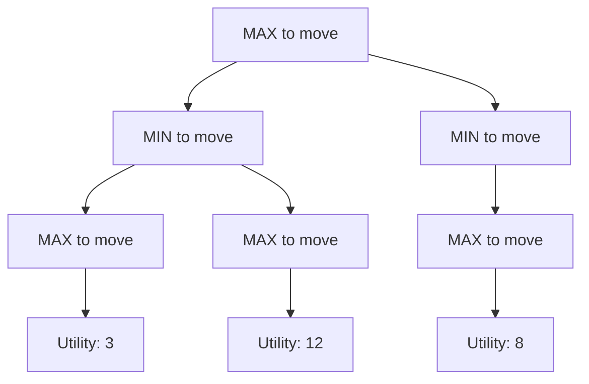

# Game Theory Introduction

## Introduction

Adversarial search handles environments with competing agents—games where one agent's gain is another's loss. Unlike single-agent search, where we only need to find a path to a goal state, adversarial search requires us to model opponent behavior and develop strategies that perform well against rational, intelligent opponents who are actively working against our objectives.

The study of games has been central to artificial intelligence since its inception. Games provide a controlled environment with clearly defined rules, measurable outcomes, and challenging strategic depth. They serve as ideal testbeds for developing AI algorithms that must reason about uncertainty, plan multiple moves ahead, and adapt to opponent strategies. From checkers to chess to Go, game-playing programs have consistently pushed the boundaries of what AI can achieve.

Game theory provides the mathematical framework for analyzing strategic interactions between rational decision-makers. In the context of AI, it gives us the tools to formally specify games, reason about optimal strategies, and prove properties about game-playing algorithms. Understanding these foundations is essential before diving into specific algorithms like minimax and alpha-beta pruning.

## Two-Player Games

A two-player game can be formally defined as a search problem with the following components:

**Components**:
- **Initial state** $s_0$: The starting configuration of the game (e.g., standard chess opening position)
- **Players**: Conventionally called MAX and MIN, who alternate taking turns
- **Actions**: $ACTIONS(s)$ returns the set of legal moves available in state $s$
- **Transition model**: $RESULT(s, a)$ returns the new state after applying action $a$ in state $s$
- **Terminal test**: $TERMINAL(s)$ returns true if the game has ended in state $s$
- **Utility function**: $UTILITY(s, p)$ gives the numerical payoff for player $p$ in terminal state $s$

The MAX player aims to maximize the utility value, while the MIN player aims to minimize it. This convention works perfectly for zero-sum games where one player's gain is exactly the other's loss.

**Example: Tic-Tac-Toe Implementation**:
```python
class TicTacToe:
    def __init__(self):
        self.board = [' '] * 9  # 3x3 board stored as flat list
        self.player = 'X'  # Current player

    def actions(self):
        """Return list of available positions (empty cells)"""
        return [i for i, cell in enumerate(self.board) if cell == ' ']

    def result(self, action):
        """Return new board state after making a move"""
        new_board = self.board.copy()
        new_board[action] = self.player
        return new_board

    def terminal(self):
        """Check if game has ended (win or draw)"""
        # Check all possible winning lines
        lines = [
            [0,1,2], [3,4,5], [6,7,8],  # rows
            [0,3,6], [1,4,7], [2,5,8],  # cols
            [0,4,8], [2,4,6]  # diagonals
        ]
        for line in lines:
            if self.board[line[0]] == self.board[line[1]] == self.board[line[2]] != ' ':
                return True
        return ' ' not in self.board  # Draw if board full

    def utility(self):
        """Returns 1 if X wins, -1 if O wins, 0 if draw"""
        lines = [
            [0,1,2], [3,4,5], [6,7,8],
            [0,3,6], [1,4,7], [2,5,8],
            [0,4,8], [2,4,6]
        ]
        for line in lines:
            if self.board[line[0]] == self.board[line[1]] == self.board[line[2]]:
                if self.board[line[0]] == 'X':
                    return 1
                elif self.board[line[0]] == 'O':
                    return -1
        return 0  # Draw or game not over
```

This formalization allows us to precisely describe any turn-based game and apply general-purpose algorithms to find optimal strategies.

## Zero-Sum Games

**Definition**: A game is zero-sum if $UTILITY(s, MAX) = -UTILITY(s, MIN)$ for all terminal states $s$.

In zero-sum games, one player's gain is exactly balanced by the other player's loss. The total utility is always zero—hence the name. This property dramatically simplifies analysis because we only need to track a single utility value rather than separate values for each player.

**Classic Examples**:
- **Chess**: Checkmate gives +1 to the winner, -1 to the loser, draw is 0 for both
- **Checkers**: Similar win/loss/draw outcomes
- **Go**: Territory difference determines the outcome
- **Poker (heads-up)**: Money won by one player equals money lost by the other

**Non-Zero-Sum Games**: Not all games are zero-sum. In the famous prisoner's dilemma, both players can benefit from cooperation or both can suffer from mutual defection. These games require different solution concepts and cannot be solved with minimax alone. The Nash equilibrium concept generalizes to these more complex strategic situations.

## Game Trees

Game trees provide a visual and computational representation of all possible play sequences in a game.

**Structure**:
- **Nodes**: Represent game states
- **Edges**: Represent actions or moves
- **Levels**: Alternate between MAX's turn and MIN's turn
- **Leaf nodes**: Terminal states with known utility values



**Key Terminology**:
- **Ply**: One move by one player (note: in chess terminology, a "move" often means one move by each player, so a ply is a "half-move")
- **Search depth** $d$: Number of plies to search ahead
- **Branching factor** $b$: Average number of legal moves per position

The size of the game tree grows exponentially with depth: $b^d$ nodes at depth $d$. For chess with $b \approx 35$ and typical game length of 80 moves (160 plies), the complete game tree contains approximately $35^{160} \approx 10^{240}$ positions—vastly more than atoms in the observable universe!

## Perfect vs Imperfect Information

**Perfect Information Games**: All players can see the complete game state at all times.
- **Examples**: Chess, Go, tic-tac-toe, checkers, Connect Four
- **Characteristics**: No hidden information, no randomness (in pure versions)
- **Algorithms**: Can use minimax and its variants directly
- **Complexity**: Still computationally challenging due to tree size

**Imperfect Information Games**: Some information is hidden from players.
- **Examples**: Poker (hidden cards), Bridge (partner's and opponents' cards), Scrabble (tiles not yet drawn)
- **Characteristics**: Must reason about what opponent might know or have
- **Algorithms**: Require belief states (probability distributions over possible true states), expectiminimax for chance nodes
- **Complexity**: Even harder than perfect information games due to uncertainty

## Deterministic vs Stochastic

**Deterministic Games**: Outcomes depend only on player actions, no chance elements.
- **Examples**: Chess, Go, checkers, tic-tac-toe
- **Characteristic**: Pure skill determines outcome
- **Analysis**: Can use minimax to find optimal strategy

**Stochastic Games**: Include elements of chance like dice rolls or card draws.
- **Examples**: Backgammon, Monopoly, card games
- **Characteristic**: Mix of skill and luck
- **Analysis**: Requires expectiminimax to handle chance nodes
- **Evaluation**: Must compute expected values over probability distributions

## Nash Equilibrium

The Nash equilibrium is a fundamental concept in game theory, named after mathematician John Nash.

**Definition**: A strategy profile (one strategy for each player) where no player can improve their payoff by unilaterally changing their strategy, assuming all other players keep their strategies fixed.

For two-player zero-sum games with optimal play:
- Both players follow the minimax strategy
- This strategy profile forms a Nash equilibrium
- The value of the game is well-defined (the utility both players can guarantee)
- Neither player can exploit the other if both play optimally

**Example**: In tic-tac-toe, perfect play by both players leads to a draw. If one player deviates from optimal strategy, the opponent can potentially win, but cannot improve beyond a draw if the opponent also plays optimally.

The minimax theorem, proved by John von Neumann, guarantees that every finite two-player zero-sum game has a Nash equilibrium (possibly in mixed strategies, where players randomize their moves).

## Key Takeaways

1. **Game formalization**: Games are defined by initial state, actions, transitions, terminal test, and utility function
2. **Zero-sum property**: Simplifies analysis by making utilities symmetric
3. **Game trees**: Exponential growth makes exhaustive search impractical for complex games
4. **Information structure**: Perfect vs imperfect information determines applicable algorithms
5. **Randomness**: Stochastic games require expected value calculations
6. **Optimality**: Nash equilibrium provides the solution concept for rational play

## Conclusion

Adversarial search extends single-agent search to competitive environments. Key differences include the need to model opponent behavior, develop strategies rather than just finding action sequences, and optimize utility functions rather than simply reaching goal states. Game trees represent the space of possible play sequences, providing the foundation for algorithms like minimax that can find optimal strategies. Understanding these game-theoretic foundations is essential for developing effective game-playing AI and reasoning about strategic interactions more broadly.
