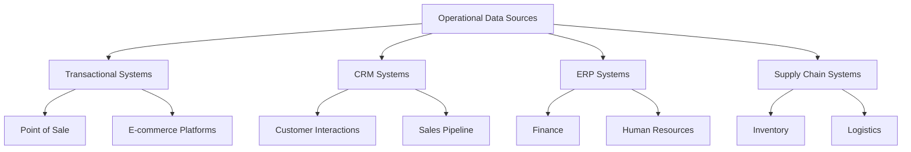
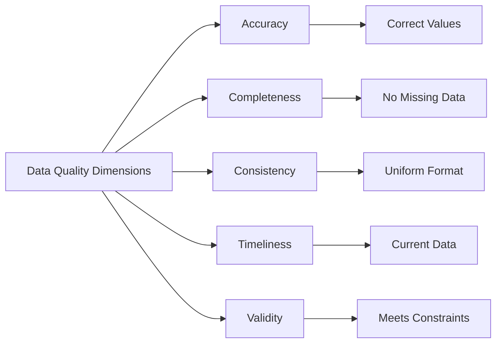

# Data Sources

## Introduction

Data is the foundation of all data science and analytics work. Understanding where data comes from, how to access it, and what types of data sources exist is crucial for any data scientist. This lesson explores the diverse landscape of data sources available for analysis, from traditional databases to modern streaming platforms.

Data sources can be broadly categorized into internal sources (generated within an organization) and external sources (obtained from third parties or public repositories). Each type of data source has unique characteristics, access methods, quality considerations, and legal implications.

## Types of Data Sources

### Primary Data Sources

Primary data is collected directly from the source for a specific purpose. This type of data is original and collected firsthand by researchers or organizations.

**Characteristics:**
- Collected for specific research objectives
- Direct control over collection methodology
- Higher reliability for intended purpose
- More expensive and time-consuming to collect

**Examples:**
- Surveys and questionnaires
- Experiments and clinical trials
- Sensor readings and IoT devices
- User interaction logs
- Transaction records

### Secondary Data Sources

Secondary data has been collected by someone else for a different purpose but can be repurposed for your analysis.

**Characteristics:**
- Already available and processed
- Cost-effective and time-saving
- May not perfectly match your needs
- Quality depends on original collection methods

**Examples:**
- Government statistics and census data
- Academic research publications
- Industry reports and market research
- Historical archives
- Social media data

## Structured vs. Unstructured Data Sources

### Structured Data

Structured data is highly organized and easily searchable in relational databases and spreadsheets.

```python
import pandas as pd
import numpy as np

# Example: Creating structured data
structured_data = pd.DataFrame({
    'customer_id': [1, 2, 3, 4, 5],
    'name': ['Alice', 'Bob', 'Charlie', 'Diana', 'Eve'],
    'age': [25, 30, 35, 28, 42],
    'purchase_amount': [150.50, 200.00, 175.25, 300.00, 125.75],
    'purchase_date': pd.to_datetime(['2024-01-15', '2024-01-16',
                                      '2024-01-17', '2024-01-18',
                                      '2024-01-19'])
})

print("Structured Data Example:")
print(structured_data)
print("\nData Types:")
print(structured_data.dtypes)
```

### Semi-Structured Data

Semi-structured data doesn't fit into rigid tables but has some organizational properties.

```python
import json

# Example: JSON data (semi-structured)
json_data = {
    "customer": {
        "id": 12345,
        "name": "John Doe",
        "email": "john@example.com",
        "purchases": [
            {"item": "laptop", "price": 999.99, "date": "2024-01-15"},
            {"item": "mouse", "price": 25.50, "date": "2024-01-16"}
        ],
        "preferences": {
            "newsletter": True,
            "categories": ["electronics", "books"]
        }
    }
}

# Converting to DataFrame
df = pd.json_normalize(json_data)
print("Semi-Structured Data Flattened:")
print(df)
```

### Unstructured Data

Unstructured data has no predefined format or organization.

```python
# Example: Processing unstructured text data
from collections import Counter
import re

unstructured_text = """
Data science is an interdisciplinary field that uses scientific methods,
processes, algorithms and systems to extract knowledge and insights from
structured and unstructured data. Data science is related to data mining,
machine learning and big data.
"""

# Basic text analysis
words = re.findall(r'\b\w+\b', unstructured_text.lower())
word_freq = Counter(words)

print("Most Common Words:")
for word, count in word_freq.most_common(10):
    print(f"{word}: {count}")
```

## Data Source Categories

### Operational Data Sources



Operational data sources capture day-to-day business operations:

```python
# Simulating operational data extraction
class OperationalDataSource:
    def __init__(self, source_name):
        self.source_name = source_name
        self.data = []

    def collect_transaction_data(self, num_records=100):
        """Simulate collecting transaction data"""
        np.random.seed(42)

        self.data = pd.DataFrame({
            'transaction_id': range(1, num_records + 1),
            'timestamp': pd.date_range('2024-01-01',
                                       periods=num_records,
                                       freq='H'),
            'product_id': np.random.randint(1, 50, num_records),
            'quantity': np.random.randint(1, 10, num_records),
            'amount': np.random.uniform(10, 500, num_records).round(2),
            'customer_id': np.random.randint(1000, 2000, num_records)
        })

        return self.data

    def get_summary(self):
        """Get summary statistics"""
        if len(self.data) == 0:
            return "No data collected"

        summary = {
            'total_transactions': len(self.data),
            'total_revenue': self.data['amount'].sum(),
            'avg_transaction_value': self.data['amount'].mean(),
            'date_range': (self.data['timestamp'].min(),
                          self.data['timestamp'].max())
        }
        return summary

# Usage
pos_system = OperationalDataSource("Point of Sale")
transactions = pos_system.collect_transaction_data(100)

print("Operational Data Sample:")
print(transactions.head())
print("\nSummary:")
print(pos_system.get_summary())
```

### External Data Sources

External data sources provide context and enrichment for internal data:

```python
# Example: Accessing public data sources
class ExternalDataCollector:
    def __init__(self):
        self.sources = {}

    def add_source(self, name, url, description):
        """Register an external data source"""
        self.sources[name] = {
            'url': url,
            'description': description,
            'last_accessed': None
        }

    def simulate_weather_data(self):
        """Simulate weather data from external API"""
        dates = pd.date_range('2024-01-01', periods=30, freq='D')

        weather_data = pd.DataFrame({
            'date': dates,
            'temperature': np.random.normal(20, 5, 30).round(1),
            'humidity': np.random.uniform(40, 80, 30).round(1),
            'precipitation': np.random.exponential(2, 30).round(2),
            'wind_speed': np.random.uniform(5, 25, 30).round(1)
        })

        return weather_data

    def simulate_economic_data(self):
        """Simulate economic indicators"""
        dates = pd.date_range('2024-01-01', periods=12, freq='M')

        economic_data = pd.DataFrame({
            'month': dates,
            'gdp_growth': np.random.normal(2.5, 0.5, 12).round(2),
            'unemployment_rate': np.random.normal(5.0, 0.3, 12).round(2),
            'inflation_rate': np.random.normal(3.0, 0.4, 12).round(2),
            'interest_rate': np.random.normal(4.5, 0.2, 12).round(2)
        })

        return economic_data

# Usage
collector = ExternalDataCollector()
collector.add_source('OpenWeather', 'https://openweathermap.org/api',
                     'Weather data API')
collector.add_source('World Bank', 'https://data.worldbank.org',
                     'Economic indicators')

weather = collector.simulate_weather_data()
economics = collector.simulate_economic_data()

print("Weather Data Sample:")
print(weather.head())
print("\nEconomic Data Sample:")
print(economics.head())
```

## Real-Time vs. Batch Data Sources

### Real-Time Data Sources

Real-time data sources provide continuous streams of data:

```python
from datetime import datetime, timedelta

class RealTimeDataStream:
    def __init__(self, source_name):
        self.source_name = source_name
        self.buffer = []
        self.max_buffer_size = 1000

    def generate_event(self):
        """Generate a single event"""
        event = {
            'timestamp': datetime.now(),
            'event_type': np.random.choice(['click', 'view', 'purchase', 'logout']),
            'user_id': np.random.randint(1, 10000),
            'session_id': np.random.randint(1, 1000),
            'value': np.random.uniform(0, 100)
        }
        return event

    def stream_events(self, duration_seconds=5, events_per_second=10):
        """Simulate streaming events"""
        events = []
        end_time = datetime.now() + timedelta(seconds=duration_seconds)

        while datetime.now() < end_time:
            for _ in range(events_per_second):
                events.append(self.generate_event())

        return pd.DataFrame(events)

    def get_windowed_aggregates(self, events_df, window_seconds=1):
        """Calculate aggregates over time windows"""
        events_df['window'] = events_df['timestamp'].dt.floor(f'{window_seconds}S')

        aggregates = events_df.groupby(['window', 'event_type']).agg({
            'user_id': 'count',
            'value': ['sum', 'mean', 'max']
        }).reset_index()

        return aggregates

# Usage
stream = RealTimeDataStream("Website Events")
events = stream.stream_events(duration_seconds=2, events_per_second=50)

print(f"Collected {len(events)} events")
print("\nSample Events:")
print(events.head(10))

# Get aggregates
aggregates = stream.get_windowed_aggregates(events, window_seconds=1)
print("\nWindowed Aggregates:")
print(aggregates.head())
```

### Batch Data Sources

Batch data sources are processed at scheduled intervals:

```python
class BatchDataSource:
    def __init__(self, source_name, schedule='daily'):
        self.source_name = source_name
        self.schedule = schedule
        self.batches = []

    def generate_batch(self, batch_date):
        """Generate a batch of data for a specific date"""
        np.random.seed(int(batch_date.strftime('%Y%m%d')))

        batch_size = np.random.randint(1000, 5000)

        batch = pd.DataFrame({
            'record_id': range(1, batch_size + 1),
            'batch_date': batch_date,
            'metric_a': np.random.normal(100, 15, batch_size),
            'metric_b': np.random.exponential(50, batch_size),
            'category': np.random.choice(['A', 'B', 'C', 'D'], batch_size),
            'status': np.random.choice(['active', 'inactive'], batch_size)
        })

        return batch

    def process_batch_range(self, start_date, end_date):
        """Process multiple batches"""
        dates = pd.date_range(start_date, end_date, freq='D')

        for date in dates:
            batch = self.generate_batch(date)
            self.batches.append(batch)

        # Combine all batches
        combined = pd.concat(self.batches, ignore_index=True)
        return combined

# Usage
batch_source = BatchDataSource("Daily Reports", schedule='daily')
data = batch_source.process_batch_range('2024-01-01', '2024-01-07')

print(f"Total records across all batches: {len(data)}")
print("\nBatch Summary:")
print(data.groupby('batch_date').size())
print("\nSample Data:")
print(data.head())
```

## Data Source Quality Considerations



Evaluating data source quality:

```python
class DataQualityAssessor:
    def __init__(self, data):
        self.data = data
        self.quality_report = {}

    def assess_completeness(self):
        """Check for missing values"""
        missing = self.data.isnull().sum()
        missing_pct = (missing / len(self.data) * 100).round(2)

        self.quality_report['completeness'] = {
            'missing_counts': missing.to_dict(),
            'missing_percentages': missing_pct.to_dict(),
            'overall_completeness': (100 - missing_pct.mean()).round(2)
        }

    def assess_consistency(self):
        """Check for data consistency issues"""
        issues = []

        # Check for duplicate IDs
        if 'id' in self.data.columns or 'customer_id' in self.data.columns:
            id_col = 'id' if 'id' in self.data.columns else 'customer_id'
            duplicates = self.data[id_col].duplicated().sum()
            issues.append(f"Duplicate IDs: {duplicates}")

        # Check for negative values where not expected
        numeric_cols = self.data.select_dtypes(include=[np.number]).columns
        for col in numeric_cols:
            if col.endswith('_amount') or col.endswith('_price'):
                negatives = (self.data[col] < 0).sum()
                if negatives > 0:
                    issues.append(f"Negative {col}: {negatives}")

        self.quality_report['consistency'] = issues

    def assess_validity(self):
        """Check if values meet expected constraints"""
        validity_issues = []

        # Check date ranges
        date_cols = self.data.select_dtypes(include=['datetime64']).columns
        for col in date_cols:
            future_dates = (self.data[col] > pd.Timestamp.now()).sum()
            if future_dates > 0:
                validity_issues.append(f"Future dates in {col}: {future_dates}")

        self.quality_report['validity'] = validity_issues

    def generate_report(self):
        """Generate comprehensive quality report"""
        self.assess_completeness()
        self.assess_consistency()
        self.assess_validity()

        return self.quality_report

# Example usage
test_data = pd.DataFrame({
    'customer_id': [1, 2, 2, 4, 5],
    'name': ['Alice', 'Bob', None, 'Diana', 'Eve'],
    'age': [25, 30, 35, -5, 42],
    'purchase_amount': [150.50, 200.00, 175.25, 300.00, None],
    'purchase_date': pd.to_datetime(['2024-01-15', '2024-01-16',
                                      '2024-01-17', '2026-01-18',
                                      '2024-01-19'])
})

assessor = DataQualityAssessor(test_data)
quality_report = assessor.generate_report()

print("Data Quality Report:")
print(json.dumps(quality_report, indent=2, default=str))
```

## Data Source Documentation

```python
class DataSourceCatalog:
    def __init__(self):
        self.catalog = []

    def register_source(self, source_info):
        """Register a new data source"""
        required_fields = ['name', 'type', 'description', 'owner',
                          'update_frequency', 'format']

        for field in required_fields:
            if field not in source_info:
                raise ValueError(f"Missing required field: {field}")

        source_info['registered_date'] = datetime.now()
        self.catalog.append(source_info)

    def get_catalog_df(self):
        """Get catalog as DataFrame"""
        return pd.DataFrame(self.catalog)

    def search_sources(self, keyword):
        """Search for data sources"""
        df = self.get_catalog_df()
        mask = df['description'].str.contains(keyword, case=False, na=False)
        return df[mask]

# Usage
catalog = DataSourceCatalog()

catalog.register_source({
    'name': 'Customer Transactions',
    'type': 'Database',
    'description': 'Daily customer purchase transactions',
    'owner': 'Sales Department',
    'update_frequency': 'Real-time',
    'format': 'SQL Database',
    'schema': 'customers.transactions',
    'retention_period': '7 years'
})

catalog.register_source({
    'name': 'Weather Data',
    'type': 'API',
    'description': 'Historical and current weather information',
    'owner': 'External Provider',
    'update_frequency': 'Hourly',
    'format': 'JSON',
    'endpoint': 'https://api.weather.com/v1',
    'authentication': 'API Key'
})

print("Data Source Catalog:")
print(catalog.get_catalog_df())
```

## Best Practices

1. **Document all data sources** - Maintain a catalog with metadata
2. **Assess data quality** - Regularly evaluate source reliability
3. **Understand licensing** - Know what you can and cannot do with the data
4. **Version control** - Track changes in data sources over time
5. **Security and privacy** - Ensure compliance with regulations
6. **Backup strategies** - Maintain copies of critical data sources
7. **Monitor freshness** - Track when data was last updated
8. **Test connectivity** - Regularly verify access to data sources

## Summary

Understanding data sources is fundamental to successful data science projects. Key takeaways:

- Data sources vary widely in type, structure, and quality
- Primary data offers control but requires more resources
- Secondary data is cost-effective but may need validation
- Real-time sources enable immediate insights but require different infrastructure
- Batch sources are easier to manage but less timely
- Quality assessment is critical for reliable analysis
- Proper documentation ensures reproducibility and knowledge sharing

The choice of data sources significantly impacts the quality and reliability of your analysis. Always evaluate sources carefully, understand their limitations, and implement appropriate quality controls.
