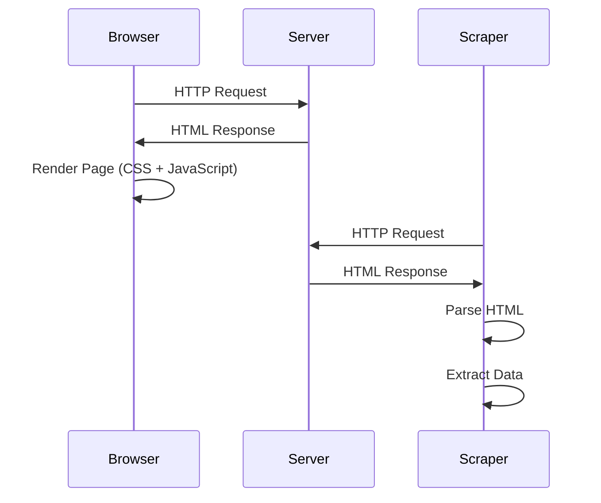
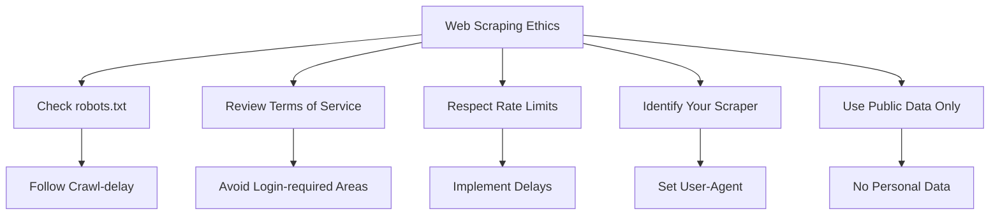

# Web Scraping

## Introduction

Web scraping is the automated process of extracting data from websites. As the web has become the world's largest repository of information, web scraping has become an essential skill for data scientists. Whether you're gathering product prices, news articles, social media posts, or research data, web scraping enables you to collect vast amounts of information that would be impractical to gather manually.

However, web scraping comes with important ethical and legal considerations. Not all websites permit scraping, and even when allowed, scrapers must be designed to minimize server load and respect the site's terms of service.

## Web Scraping Fundamentals

### How Websites Work



Understanding the request-response cycle is crucial for effective web scraping:

```python
import requests
from bs4 import BeautifulSoup
import pandas as pd
import time

# Basic HTTP request
class WebScraper:
    def __init__(self, base_url):
        self.base_url = base_url
        self.session = requests.Session()
        # Set a user agent to identify your scraper
        self.session.headers.update({
            'User-Agent': 'Mozilla/5.0 (Educational Data Science Scraper)'
        })

    def fetch_page(self, url, max_retries=3):
        """Fetch a web page with retry logic"""
        for attempt in range(max_retries):
            try:
                response = self.session.get(url, timeout=10)
                response.raise_for_status()  # Raise exception for bad status codes
                return response
            except requests.exceptions.RequestException as e:
                if attempt == max_retries - 1:
                    print(f"Failed to fetch {url}: {e}")
                    return None
                time.sleep(2 ** attempt)  # Exponential backoff
        return None

    def get_page_content(self, url):
        """Get the HTML content of a page"""
        response = self.fetch_page(url)
        if response:
            return response.text
        return None

# Example usage
scraper = WebScraper("https://example.com")
html_content = scraper.get_page_content("https://example.com")

if html_content:
    print(f"Retrieved {len(html_content)} characters of HTML")
```

## HTML Parsing with BeautifulSoup

BeautifulSoup is the most popular Python library for parsing HTML:

```python
from bs4 import BeautifulSoup
import re

class HTMLParser:
    def __init__(self, html_content):
        self.soup = BeautifulSoup(html_content, 'html.parser')

    def extract_text(self, selector):
        """Extract text using CSS selector"""
        elements = self.soup.select(selector)
        return [elem.get_text(strip=True) for elem in elements]

    def extract_links(self, base_url=""):
        """Extract all links from the page"""
        links = []
        for link in self.soup.find_all('a', href=True):
            href = link['href']
            # Convert relative URLs to absolute
            if href.startswith('/'):
                href = base_url.rstrip('/') + href
            links.append({
                'url': href,
                'text': link.get_text(strip=True),
                'title': link.get('title', '')
            })
        return links

    def extract_tables(self):
        """Extract all tables from the page"""
        tables = []
        for table in self.soup.find_all('table'):
            # Extract headers
            headers = [th.get_text(strip=True)
                      for th in table.find_all('th')]

            # Extract rows
            rows = []
            for tr in table.find_all('tr'):
                cells = [td.get_text(strip=True)
                        for td in tr.find_all(['td', 'th'])]
                if cells:
                    rows.append(cells)

            if headers or rows:
                tables.append({
                    'headers': headers,
                    'rows': rows
                })
        return tables

    def extract_metadata(self):
        """Extract page metadata"""
        metadata = {
            'title': self.soup.title.string if self.soup.title else None,
            'meta_description': None,
            'meta_keywords': None
        }

        # Extract meta tags
        for meta in self.soup.find_all('meta'):
            if meta.get('name') == 'description':
                metadata['meta_description'] = meta.get('content')
            elif meta.get('name') == 'keywords':
                metadata['meta_keywords'] = meta.get('content')

        return metadata

# Example HTML for demonstration
sample_html = """
<html>
<head>
    <title>Sample E-commerce Page</title>
    <meta name="description" content="Shop the best products">
</head>
<body>
    <div class="product">
        <h2 class="product-title">Laptop</h2>
        <span class="price">$999.99</span>
        <p class="description">High-performance laptop</p>
    </div>
    <div class="product">
        <h2 class="product-title">Mouse</h2>
        <span class="price">$29.99</span>
        <p class="description">Wireless mouse</p>
    </div>
    <table>
        <tr><th>Product</th><th>Stock</th></tr>
        <tr><td>Laptop</td><td>15</td></tr>
        <tr><td>Mouse</td><td>50</td></tr>
    </table>
</body>
</html>
"""

parser = HTMLParser(sample_html)

# Extract product information
products = parser.extract_text('.product-title')
prices = parser.extract_text('.price')

print("Products and Prices:")
for product, price in zip(products, prices):
    print(f"{product}: {price}")

# Extract tables
tables = parser.extract_tables()
print(f"\nFound {len(tables)} table(s)")
for table in tables:
    df = pd.DataFrame(table['rows'][1:], columns=table['headers'])
    print(df)
```

## Advanced Scraping Techniques

### Handling Pagination

```python
class PaginatedScraper(WebScraper):
    def scrape_all_pages(self, start_url, max_pages=None):
        """Scrape data from multiple pages"""
        all_data = []
        current_url = start_url
        page_count = 0

        while current_url and (max_pages is None or page_count < max_pages):
            print(f"Scraping page {page_count + 1}: {current_url}")

            # Fetch page
            html = self.get_page_content(current_url)
            if not html:
                break

            # Parse page
            parser = HTMLParser(html)

            # Extract data (customize based on site structure)
            page_data = self.extract_page_data(parser)
            all_data.extend(page_data)

            # Find next page link
            current_url = self.find_next_page(parser)
            page_count += 1

            # Respectful crawling - delay between requests
            time.sleep(1)

        return all_data

    def extract_page_data(self, parser):
        """Extract data from a single page - override in subclass"""
        # This is a template method
        return []

    def find_next_page(self, parser):
        """Find the next page URL - override in subclass"""
        # Look for common pagination patterns
        soup = parser.soup

        # Pattern 1: "Next" button
        next_link = soup.find('a', text=re.compile(r'Next', re.I))
        if next_link and next_link.get('href'):
            return next_link['href']

        # Pattern 2: Page numbers
        current_page = soup.find('span', class_='current-page')
        if current_page:
            next_sibling = current_page.find_next_sibling('a')
            if next_sibling and next_sibling.get('href'):
                return next_sibling['href']

        return None

# Example implementation
class ProductScraper(PaginatedScraper):
    def extract_page_data(self, parser):
        """Extract product data"""
        products = []
        soup = parser.soup

        for product_div in soup.find_all('div', class_='product'):
            product = {
                'title': product_div.find('h2', class_='product-title').get_text(strip=True),
                'price': product_div.find('span', class_='price').get_text(strip=True),
                'description': product_div.find('p', class_='description').get_text(strip=True)
            }
            products.append(product)

        return products

# Usage
# scraper = ProductScraper("https://example.com")
# products = scraper.scrape_all_pages("https://example.com/products", max_pages=5)
# products_df = pd.DataFrame(products)
```

### Handling Dynamic Content (JavaScript-rendered)

```python
# For JavaScript-heavy sites, you need a headless browser
# This example shows the concept (requires selenium)

"""
from selenium import webdriver
from selenium.webdriver.common.by import By
from selenium.webdriver.support.ui import WebDriverWait
from selenium.webdriver.support import expected_conditions as EC

class DynamicScraper:
    def __init__(self):
        # Setup headless Chrome
        options = webdriver.ChromeOptions()
        options.add_argument('--headless')
        options.add_argument('--no-sandbox')
        self.driver = webdriver.Chrome(options=options)

    def scrape_dynamic_page(self, url, wait_selector):
        try:
            self.driver.get(url)

            # Wait for dynamic content to load
            wait = WebDriverWait(self.driver, 10)
            wait.until(EC.presence_of_element_located(
                (By.CSS_SELECTOR, wait_selector)
            ))

            # Get page source after JavaScript execution
            html = self.driver.page_source
            return html

        except Exception as e:
            print(f"Error scraping {url}: {e}")
            return None

    def scroll_to_load_more(self, scroll_pause_time=2):
        # Scroll down to trigger infinite scroll
        last_height = self.driver.execute_script(
            "return document.body.scrollHeight"
        )

        while True:
            # Scroll down
            self.driver.execute_script(
                "window.scrollTo(0, document.body.scrollHeight);"
            )

            # Wait for new content
            time.sleep(scroll_pause_time)

            # Calculate new scroll height
            new_height = self.driver.execute_script(
                "return document.body.scrollHeight"
            )

            if new_height == last_height:
                break

            last_height = new_height

    def close(self):
        self.driver.quit()
"""

# Simpler approach for some dynamic content: API inspection
class APIBackedScraper:
    """
    Many modern websites load data via APIs.
    Inspect network tab to find these endpoints.
    """
    def __init__(self):
        self.session = requests.Session()

    def fetch_from_api(self, api_url, params=None):
        """
        Directly call the underlying API instead of scraping HTML
        """
        try:
            response = self.session.get(api_url, params=params)
            response.raise_for_status()
            return response.json()
        except Exception as e:
            print(f"API request failed: {e}")
            return None

# Example: Many sites use JSON APIs
api_scraper = APIBackedScraper()
# api_data = api_scraper.fetch_from_api(
#     "https://example.com/api/products",
#     params={"page": 1, "limit": 20}
# )
```

## Data Extraction Patterns

### Structured Data Extraction

```python
import re
from datetime import datetime

class DataExtractor:
    @staticmethod
    def clean_price(price_str):
        """Extract numeric price from string"""
        # Remove currency symbols and commas
        cleaned = re.sub(r'[^\d.]', '', price_str)
        try:
            return float(cleaned)
        except ValueError:
            return None

    @staticmethod
    def clean_text(text):
        """Clean and normalize text"""
        # Remove extra whitespace
        text = re.sub(r'\s+', ' ', text)
        # Remove special characters
        text = text.strip()
        return text

    @staticmethod
    def extract_date(date_str, format=None):
        """Parse date from various formats"""
        common_formats = [
            '%Y-%m-%d',
            '%d/%m/%Y',
            '%m/%d/%Y',
            '%B %d, %Y',
            '%d %B %Y'
        ]

        if format:
            try:
                return datetime.strptime(date_str, format)
            except ValueError:
                pass

        for fmt in common_formats:
            try:
                return datetime.strptime(date_str, fmt)
            except ValueError:
                continue

        return None

    @staticmethod
    def extract_rating(rating_str):
        """Extract numeric rating"""
        # Look for patterns like "4.5 out of 5" or "4.5/5"
        match = re.search(r'(\d+\.?\d*)', rating_str)
        if match:
            return float(match.group(1))
        return None

# Example usage
extractor = DataExtractor()

# Sample scraped data
raw_data = [
    {'price': '$1,299.99', 'rating': '4.5 out of 5', 'date': '2024-01-15'},
    {'price': '€899.00', 'rating': '4/5', 'date': 'January 20, 2024'},
    {'price': '£749.50', 'rating': '3.8★', 'date': '25/01/2024'}
]

# Clean data
cleaned_data = []
for item in raw_data:
    cleaned_data.append({
        'price': extractor.clean_price(item['price']),
        'rating': extractor.extract_rating(item['rating']),
        'date': extractor.extract_date(item['date'])
    })

df = pd.DataFrame(cleaned_data)
print("Cleaned Data:")
print(df)
```

### Robust Error Handling

```python
class RobustScraper(WebScraper):
    def __init__(self, base_url):
        super().__init__(base_url)
        self.errors = []
        self.successful_scrapes = 0
        self.failed_scrapes = 0

    def scrape_with_error_handling(self, url):
        """Scrape with comprehensive error handling"""
        try:
            # Fetch page
            response = self.fetch_page(url)
            if not response:
                self.log_error(url, "Failed to fetch page")
                return None

            # Parse HTML
            soup = BeautifulSoup(response.text, 'html.parser')

            # Extract data with try-except for each field
            data = {}

            try:
                data['title'] = soup.find('h1').get_text(strip=True)
            except AttributeError:
                self.log_error(url, "Title not found")
                data['title'] = None

            try:
                data['price'] = soup.find('span', class_='price').get_text(strip=True)
            except AttributeError:
                self.log_error(url, "Price not found")
                data['price'] = None

            # Validate data
            if self.validate_data(data):
                self.successful_scrapes += 1
                return data
            else:
                self.log_error(url, "Data validation failed")
                return None

        except Exception as e:
            self.log_error(url, f"Unexpected error: {str(e)}")
            return None

    def log_error(self, url, error_message):
        """Log scraping errors"""
        self.errors.append({
            'url': url,
            'error': error_message,
            'timestamp': datetime.now()
        })
        self.failed_scrapes += 1

    def validate_data(self, data):
        """Validate extracted data"""
        # Check if required fields are present
        required_fields = ['title', 'price']

        for field in required_fields:
            if field not in data or data[field] is None:
                return False

        return True

    def get_error_report(self):
        """Generate error report"""
        if not self.errors:
            return "No errors encountered"

        error_df = pd.DataFrame(self.errors)
        return {
            'total_errors': len(self.errors),
            'success_rate': self.successful_scrapes /
                          (self.successful_scrapes + self.failed_scrapes) * 100,
            'errors': error_df
        }
```

## Rate Limiting and Politeness

```python
import time
from collections import deque
from datetime import datetime, timedelta

class PoliteScraper(WebScraper):
    def __init__(self, base_url, requests_per_minute=30):
        super().__init__(base_url)
        self.requests_per_minute = requests_per_minute
        self.request_times = deque()

    def rate_limited_request(self, url):
        """Make request with rate limiting"""
        # Clean old timestamps
        cutoff_time = datetime.now() - timedelta(minutes=1)
        while self.request_times and self.request_times[0] < cutoff_time:
            self.request_times.popleft()

        # Check if we need to wait
        if len(self.request_times) >= self.requests_per_minute:
            # Calculate wait time
            oldest_request = self.request_times[0]
            wait_time = (oldest_request + timedelta(minutes=1) - datetime.now()).total_seconds()

            if wait_time > 0:
                print(f"Rate limit reached. Waiting {wait_time:.2f} seconds...")
                time.sleep(wait_time)

        # Make request
        self.request_times.append(datetime.now())
        return self.fetch_page(url)

    def respect_robots_txt(self):
        """
        Check robots.txt for crawling rules
        """
        robots_url = f"{self.base_url}/robots.txt"
        try:
            response = requests.get(robots_url)
            if response.status_code == 200:
                print("robots.txt content:")
                print(response.text)
                return response.text
        except Exception as e:
            print(f"Could not fetch robots.txt: {e}")
        return None

# Example of checking robots.txt
scraper = PoliteScraper("https://example.com", requests_per_minute=20)
# robots_content = scraper.respect_robots_txt()
```

## Storing Scraped Data

```python
import json
import csv
from pathlib import Path

class DataStorage:
    def __init__(self, output_dir='scraped_data'):
        self.output_dir = Path(output_dir)
        self.output_dir.mkdir(exist_ok=True)

    def save_to_json(self, data, filename):
        """Save data to JSON file"""
        filepath = self.output_dir / filename

        with open(filepath, 'w', encoding='utf-8') as f:
            json.dump(data, f, indent=2, ensure_ascii=False, default=str)

        print(f"Saved {len(data)} records to {filepath}")

    def save_to_csv(self, data, filename):
        """Save data to CSV file"""
        if not data:
            return

        filepath = self.output_dir / filename
        df = pd.DataFrame(data)
        df.to_csv(filepath, index=False, encoding='utf-8')

        print(f"Saved {len(data)} records to {filepath}")

    def save_incrementally(self, data, filename, mode='append'):
        """Save data incrementally to avoid memory issues"""
        filepath = self.output_dir / filename

        df = pd.DataFrame([data])  # Single record

        if mode == 'append' and filepath.exists():
            df.to_csv(filepath, mode='a', header=False, index=False)
        else:
            df.to_csv(filepath, mode='w', header=True, index=False)

    def load_from_json(self, filename):
        """Load data from JSON file"""
        filepath = self.output_dir / filename

        with open(filepath, 'r', encoding='utf-8') as f:
            return json.load(f)

# Usage
storage = DataStorage('scraped_data')

sample_products = [
    {'name': 'Laptop', 'price': 999.99, 'rating': 4.5},
    {'name': 'Mouse', 'price': 29.99, 'rating': 4.0},
    {'name': 'Keyboard', 'price': 79.99, 'rating': 4.7}
]

# storage.save_to_json(sample_products, 'products.json')
# storage.save_to_csv(sample_products, 'products.csv')
```

## Legal and Ethical Considerations



Best practices checklist:

```python
class EthicalScrapingChecklist:
    """
    Checklist for ethical web scraping
    """
    @staticmethod
    def get_checklist():
        return {
            'legal_compliance': [
                'Read and understand the website Terms of Service',
                'Check if the site has an API (use it instead of scraping)',
                'Verify that scraping is not explicitly prohibited',
                'Ensure compliance with GDPR, CCPA, and other regulations',
                'Do not scrape copyrighted content for commercial use'
            ],
            'technical_politeness': [
                'Check and respect robots.txt',
                'Implement rate limiting (10-30 requests/minute)',
                'Use appropriate delays between requests (1-2 seconds)',
                'Set a meaningful User-Agent string',
                'Handle errors gracefully',
                'Scrape during off-peak hours when possible'
            ],
            'data_handling': [
                'Only collect data you actually need',
                'Do not scrape personal or sensitive information',
                'Store data securely',
                'Respect user privacy',
                'Have a data retention policy'
            ],
            'ongoing_maintenance': [
                'Monitor your scraper for errors',
                'Update scraper when site structure changes',
                'Stop scraping if requested by site owner',
                'Keep logs of scraping activities'
            ]
        }

    @staticmethod
    def print_checklist():
        checklist = EthicalScrapingChecklist.get_checklist()
        for category, items in checklist.items():
            print(f"\n{category.upper()}:")
            for item in items:
                print(f"  □ {item}")

# Print the checklist
EthicalScrapingChecklist.print_checklist()
```

## Complete Scraping Example

```python
# Complete example: Scraping with all best practices
class ProductionScraper:
    def __init__(self, config):
        self.config = config
        self.scraper = PoliteScraper(
            config['base_url'],
            requests_per_minute=config['rate_limit']
        )
        self.storage = DataStorage(config['output_dir'])
        self.extractor = DataExtractor()

    def run(self, urls):
        """Run complete scraping pipeline"""
        print("Starting scraping process...")
        print(f"URLs to scrape: {len(urls)}")

        all_data = []
        errors = []

        for i, url in enumerate(urls):
            print(f"\nProcessing {i+1}/{len(urls)}: {url}")

            try:
                # Fetch with rate limiting
                response = self.scraper.rate_limited_request(url)

                if response:
                    # Parse
                    soup = BeautifulSoup(response.text, 'html.parser')

                    # Extract data
                    data = self.extract_data(soup, url)

                    if data:
                        all_data.append(data)
                        # Save incrementally
                        self.storage.save_incrementally(
                            data,
                            'products.csv'
                        )
                else:
                    errors.append({'url': url, 'error': 'Failed to fetch'})

            except Exception as e:
                errors.append({'url': url, 'error': str(e)})

            # Progress update
            if (i + 1) % 10 == 0:
                print(f"Progress: {i+1}/{len(urls)} completed")

        # Save final results
        self.storage.save_to_json(all_data, 'products_final.json')

        if errors:
            self.storage.save_to_json(errors, 'errors.json')

        print(f"\nScraping complete!")
        print(f"Successful: {len(all_data)}")
        print(f"Failed: {len(errors)}")

        return all_data

    def extract_data(self, soup, url):
        """Extract and clean data from parsed HTML"""
        # Implement extraction logic
        pass

# Configuration
config = {
    'base_url': 'https://example.com',
    'rate_limit': 20,
    'output_dir': 'scraped_products'
}

# scraper = ProductionScraper(config)
# results = scraper.run(url_list)
```

## Summary

Web scraping is a powerful technique for data collection, but it must be done responsibly:

- Always check robots.txt and terms of service
- Implement rate limiting and delays
- Use proper error handling and retry logic
- Clean and validate extracted data
- Store data efficiently
- Respect website resources and user privacy
- Consider using official APIs when available
- Document your scraping process

Master these techniques and you'll be able to gather valuable data while maintaining ethical standards and legal compliance.
