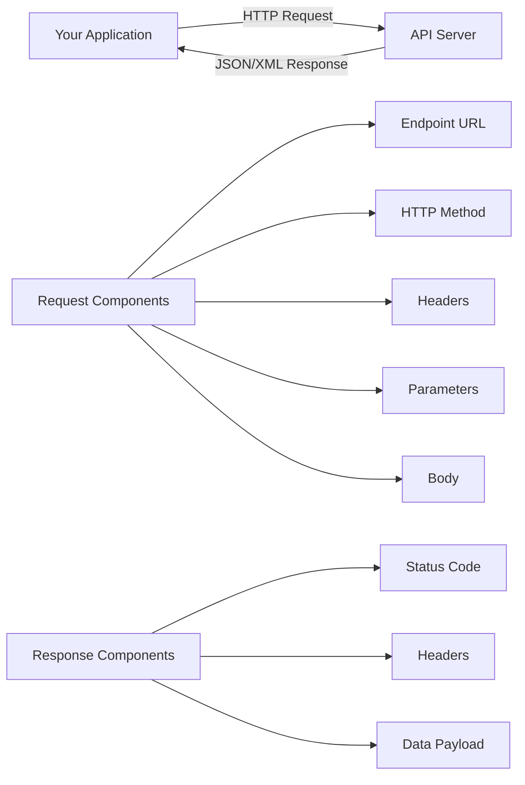

# APIs and Data Access

## Introduction

Application Programming Interfaces (APIs) are the preferred method for accessing data from modern web services. Unlike web scraping, which extracts data from HTML pages designed for humans, APIs provide structured data specifically designed for programmatic access. APIs offer numerous advantages: they're more reliable, faster, officially supported, and respect rate limits explicitly.

Understanding how to work with APIs is essential for data scientists, as many valuable data sources—from social media platforms to financial services to government databases—provide API access to their data.

## What is an API?

An API is a set of rules and protocols that allows different software applications to communicate with each other. In the context of data science, we primarily work with REST (Representational State Transfer) APIs that use HTTP requests.



### HTTP Methods

```python
import requests
import json
from datetime import datetime

class APIClient:
    """Base class for API interactions"""

    def __init__(self, base_url, api_key=None):
        self.base_url = base_url.rstrip('/')
        self.api_key = api_key
        self.session = requests.Session()

        # Set default headers
        self.session.headers.update({
            'User-Agent': 'DataScience-API-Client/1.0',
            'Accept': 'application/json'
        })

        if api_key:
            self.session.headers.update({
                'Authorization': f'Bearer {api_key}'
            })

    def get(self, endpoint, params=None):
        """
        GET request - Retrieve data
        """
        url = f"{self.base_url}/{endpoint}"
        response = self.session.get(url, params=params)
        return self._handle_response(response)

    def post(self, endpoint, data=None, json_data=None):
        """
        POST request - Create new resource
        """
        url = f"{self.base_url}/{endpoint}"
        response = self.session.post(url, data=data, json=json_data)
        return self._handle_response(response)

    def put(self, endpoint, data=None, json_data=None):
        """
        PUT request - Update existing resource
        """
        url = f"{self.base_url}/{endpoint}"
        response = self.session.put(url, data=data, json=json_data)
        return self._handle_response(response)

    def delete(self, endpoint):
        """
        DELETE request - Remove resource
        """
        url = f"{self.base_url}/{endpoint}"
        response = self.session.delete(url)
        return self._handle_response(response)

    def _handle_response(self, response):
        """Handle API response"""
        try:
            response.raise_for_status()
            return response.json()
        except requests.exceptions.HTTPError as e:
            print(f"HTTP Error: {e}")
            print(f"Response: {response.text}")
            return None
        except json.JSONDecodeError:
            return response.text

# Example usage
# client = APIClient("https://api.example.com", api_key="your_key_here")
# data = client.get("users", params={"limit": 10})
```

## Working with Real-World APIs

### REST API Example

```python
import pandas as pd
import time

class GitHubAPI:
    """
    Example: Interacting with GitHub API
    """
    def __init__(self, token=None):
        self.base_url = "https://api.github.com"
        self.client = APIClient(self.base_url, api_key=token)

    def get_user(self, username):
        """Get user information"""
        return self.client.get(f"users/{username}")

    def get_user_repos(self, username, sort='updated'):
        """Get user's repositories"""
        return self.client.get(
            f"users/{username}/repos",
            params={'sort': sort, 'per_page': 100}
        )

    def search_repositories(self, query, sort='stars', per_page=30):
        """Search repositories"""
        return self.client.get(
            "search/repositories",
            params={
                'q': query,
                'sort': sort,
                'per_page': per_page
            }
        )

    def get_repo_stats(self, owner, repo):
        """Get repository statistics"""
        # Get basic repo info
        repo_info = self.client.get(f"repos/{owner}/{repo}")

        if not repo_info:
            return None

        # Get languages
        languages = self.client.get(f"repos/{owner}/{repo}/languages")

        # Get contributors
        contributors = self.client.get(f"repos/{owner}/{repo}/contributors")

        return {
            'name': repo_info.get('name'),
            'stars': repo_info.get('stargazers_count'),
            'forks': repo_info.get('forks_count'),
            'open_issues': repo_info.get('open_issues_count'),
            'watchers': repo_info.get('watchers_count'),
            'language': repo_info.get('language'),
            'languages': languages,
            'contributors_count': len(contributors) if contributors else 0,
            'created_at': repo_info.get('created_at'),
            'updated_at': repo_info.get('updated_at')
        }

# Usage example
# github = GitHubAPI(token="your_github_token")
# repos = github.search_repositories("machine learning", sort="stars")
# print(f"Found {len(repos.get('items', []))} repositories")
```

### Pagination Handling

```python
class PaginatedAPIClient(APIClient):
    """Handle paginated API responses"""

    def get_all_pages(self, endpoint, params=None, max_pages=None):
        """
        Fetch all pages of paginated results
        """
        all_results = []
        page = 1
        params = params or {}

        while True:
            # Add pagination parameter
            params['page'] = page
            params.setdefault('per_page', 100)

            # Make request
            response = self.get(endpoint, params=params)

            if not response:
                break

            # Handle different pagination styles
            if isinstance(response, dict):
                if 'items' in response:
                    # GitHub-style pagination
                    items = response['items']
                    all_results.extend(items)

                    if len(items) < params['per_page']:
                        break
                elif 'data' in response:
                    # Generic data wrapper
                    items = response['data']
                    all_results.extend(items)

                    if not response.get('next_page'):
                        break
                else:
                    all_results.append(response)
                    break
            elif isinstance(response, list):
                # Direct list response
                all_results.extend(response)
                if len(response) < params['per_page']:
                    break
            else:
                break

            page += 1

            # Respect max_pages limit
            if max_pages and page > max_pages:
                break

            # Rate limiting pause
            time.sleep(0.5)

        return all_results

    def get_with_cursor(self, endpoint, params=None):
        """
        Cursor-based pagination (common in modern APIs)
        """
        all_results = []
        cursor = None
        params = params or {}

        while True:
            if cursor:
                params['cursor'] = cursor

            response = self.get(endpoint, params=params)

            if not response or not isinstance(response, dict):
                break

            # Extract data
            data = response.get('data', [])
            all_results.extend(data)

            # Get next cursor
            cursor = response.get('next_cursor')
            if not cursor:
                break

            time.sleep(0.5)

        return all_results

# Example
# client = PaginatedAPIClient("https://api.example.com", api_key="key")
# all_users = client.get_all_pages("users", max_pages=5)
# print(f"Retrieved {len(all_users)} users")
```

## Rate Limiting and Quotas

```python
import time
from collections import deque
from datetime import datetime, timedelta
import threading

class RateLimitedAPI(APIClient):
    """API client with built-in rate limiting"""

    def __init__(self, base_url, api_key=None,
                 requests_per_second=10,
                 requests_per_hour=1000):
        super().__init__(base_url, api_key)

        self.requests_per_second = requests_per_second
        self.requests_per_hour = requests_per_hour

        # Track request timestamps
        self.second_window = deque()
        self.hour_window = deque()
        self.lock = threading.Lock()

    def _check_rate_limit(self):
        """Check and enforce rate limits"""
        with self.lock:
            now = datetime.now()

            # Clean old timestamps
            second_ago = now - timedelta(seconds=1)
            hour_ago = now - timedelta(hours=1)

            while self.second_window and self.second_window[0] < second_ago:
                self.second_window.popleft()

            while self.hour_window and self.hour_window[0] < hour_ago:
                self.hour_window.popleft()

            # Check limits
            if len(self.second_window) >= self.requests_per_second:
                sleep_time = (self.second_window[0] + timedelta(seconds=1) - now).total_seconds()
                if sleep_time > 0:
                    print(f"Rate limit: sleeping {sleep_time:.2f}s")
                    time.sleep(sleep_time)

            if len(self.hour_window) >= self.requests_per_hour:
                sleep_time = (self.hour_window[0] + timedelta(hours=1) - now).total_seconds()
                if sleep_time > 0:
                    print(f"Hourly quota: sleeping {sleep_time:.2f}s")
                    time.sleep(sleep_time)

            # Record this request
            now = datetime.now()
            self.second_window.append(now)
            self.hour_window.append(now)

    def get(self, endpoint, params=None):
        """Rate-limited GET request"""
        self._check_rate_limit()
        return super().get(endpoint, params)

    def get_quota_status(self):
        """Get current quota usage"""
        with self.lock:
            now = datetime.now()

            # Clean old timestamps
            self.second_window = deque([
                t for t in self.second_window
                if t > now - timedelta(seconds=1)
            ])
            self.hour_window = deque([
                t for t in self.hour_window
                if t > now - timedelta(hours=1)
            ])

            return {
                'requests_last_second': len(self.second_window),
                'requests_last_hour': len(self.hour_window),
                'second_limit': self.requests_per_second,
                'hour_limit': self.requests_per_hour,
                'second_remaining': self.requests_per_second - len(self.second_window),
                'hour_remaining': self.requests_per_hour - len(self.hour_window)
            }

# Example
# api = RateLimitedAPI(
#     "https://api.example.com",
#     api_key="key",
#     requests_per_second=5,
#     requests_per_hour=100
# )
```

## Authentication Methods

```python
class AuthenticatedAPI:
    """Examples of different authentication methods"""

    @staticmethod
    def api_key_in_header(base_url, api_key):
        """API Key in Authorization header"""
        session = requests.Session()
        session.headers.update({
            'Authorization': f'Bearer {api_key}'
        })
        return session

    @staticmethod
    def api_key_in_query(base_url, api_key):
        """API Key as query parameter"""
        session = requests.Session()
        # Add api_key to all requests
        session.params = {'api_key': api_key}
        return session

    @staticmethod
    def basic_auth(base_url, username, password):
        """HTTP Basic Authentication"""
        session = requests.Session()
        session.auth = (username, password)
        return session

    @staticmethod
    def oauth2_client_credentials(token_url, client_id, client_secret):
        """
        OAuth 2.0 Client Credentials Flow
        """
        # Request access token
        response = requests.post(
            token_url,
            data={
                'grant_type': 'client_credentials',
                'client_id': client_id,
                'client_secret': client_secret
            }
        )

        if response.status_code == 200:
            token_data = response.json()
            access_token = token_data['access_token']

            # Create authenticated session
            session = requests.Session()
            session.headers.update({
                'Authorization': f'Bearer {access_token}'
            })

            return session, token_data

        return None, None

# Example usage
# session = AuthenticatedAPI.api_key_in_header(
#     "https://api.example.com",
#     "your_api_key"
# )
```

## Error Handling and Retries

```python
import requests
from requests.adapters import HTTPAdapter
from urllib3.util.retry import Retry

class RobustAPIClient(APIClient):
    """API client with retry logic and error handling"""

    def __init__(self, base_url, api_key=None, max_retries=3):
        super().__init__(base_url, api_key)

        # Configure retry strategy
        retry_strategy = Retry(
            total=max_retries,
            backoff_factor=1,  # Wait 1, 2, 4 seconds between retries
            status_forcelist=[429, 500, 502, 503, 504],
            allowed_methods=["HEAD", "GET", "OPTIONS", "POST"]
        )

        adapter = HTTPAdapter(max_retries=retry_strategy)
        self.session.mount("http://", adapter)
        self.session.mount("https://", adapter)

    def _handle_response(self, response):
        """Enhanced response handling with detailed errors"""
        try:
            response.raise_for_status()

            # Try to parse JSON
            try:
                return response.json()
            except json.JSONDecodeError:
                return response.text

        except requests.exceptions.HTTPError as e:
            error_info = {
                'status_code': response.status_code,
                'reason': response.reason,
                'url': response.url
            }

            # Parse error message from response
            try:
                error_data = response.json()
                error_info['message'] = error_data.get('message', str(e))
                error_info['details'] = error_data
            except:
                error_info['message'] = str(e)

            print(f"API Error: {json.dumps(error_info, indent=2)}")
            return None

        except requests.exceptions.Timeout:
            print(f"Request timeout for {response.url}")
            return None

        except requests.exceptions.RequestException as e:
            print(f"Request failed: {e}")
            return None

    def safe_get(self, endpoint, params=None, default=None):
        """
        Safe GET request that returns default value on error
        """
        try:
            result = self.get(endpoint, params)
            return result if result is not None else default
        except Exception as e:
            print(f"Exception in safe_get: {e}")
            return default

# Example
# api = RobustAPIClient("https://api.example.com", max_retries=5)
# data = api.safe_get("users/123", default={'error': 'User not found'})
```

## Data Transformation and Processing

```python
import pandas as pd

class APIDataProcessor:
    """Process and transform API responses"""

    @staticmethod
    def flatten_json(data, prefix=''):
        """Flatten nested JSON structure"""
        flattened = {}

        for key, value in data.items():
            new_key = f"{prefix}{key}" if prefix else key

            if isinstance(value, dict):
                flattened.update(
                    APIDataProcessor.flatten_json(value, f"{new_key}_")
                )
            elif isinstance(value, list):
                if value and isinstance(value[0], dict):
                    # Handle list of objects
                    for i, item in enumerate(value):
                        flattened.update(
                            APIDataProcessor.flatten_json(
                                item, f"{new_key}_{i}_"
                            )
                        )
                else:
                    # Simple list
                    flattened[new_key] = value
            else:
                flattened[new_key] = value

        return flattened

    @staticmethod
    def api_to_dataframe(api_response, record_path=None):
        """
        Convert API response to pandas DataFrame
        """
        if isinstance(api_response, list):
            # List of records
            return pd.DataFrame(api_response)

        elif isinstance(api_response, dict):
            if record_path:
                # Extract nested records
                records = api_response
                for key in record_path.split('.'):
                    records = records.get(key, [])
                return pd.DataFrame(records)
            else:
                # Single record or needs flattening
                return pd.DataFrame([api_response])

        return pd.DataFrame()

    @staticmethod
    def normalize_dates(df, date_columns):
        """Convert date strings to datetime objects"""
        for col in date_columns:
            if col in df.columns:
                df[col] = pd.to_datetime(df[col], errors='coerce')
        return df

    @staticmethod
    def extract_nested_field(df, column, new_column, nested_key):
        """Extract nested field from JSON column"""
        if column in df.columns:
            df[new_column] = df[column].apply(
                lambda x: x.get(nested_key) if isinstance(x, dict) else None
            )
        return df

# Example usage
sample_api_response = {
    'users': [
        {
            'id': 1,
            'name': 'Alice',
            'email': 'alice@example.com',
            'address': {'city': 'New York', 'country': 'USA'},
            'created_at': '2024-01-15T10:30:00Z'
        },
        {
            'id': 2,
            'name': 'Bob',
            'email': 'bob@example.com',
            'address': {'city': 'London', 'country': 'UK'},
            'created_at': '2024-01-16T14:20:00Z'
        }
    ]
}

processor = APIDataProcessor()

# Convert to DataFrame
df = processor.api_to_dataframe(sample_api_response, record_path='users')
print("Basic DataFrame:")
print(df)

# Extract nested fields
df = processor.extract_nested_field(df, 'address', 'city', 'city')
df = processor.extract_nested_field(df, 'address', 'country', 'country')

# Normalize dates
df = processor.normalize_dates(df, ['created_at'])

print("\nProcessed DataFrame:")
print(df)
print("\nData Types:")
print(df.dtypes)
```

## Building a Complete API Data Pipeline

```python
class APIDataPipeline:
    """
    Complete pipeline for API data collection
    """
    def __init__(self, config):
        self.api = RateLimitedAPI(
            config['base_url'],
            api_key=config.get('api_key'),
            requests_per_second=config.get('rate_limit_second', 10),
            requests_per_hour=config.get('rate_limit_hour', 1000)
        )
        self.processor = APIDataProcessor()
        self.cache = {}

    def fetch_and_process(self, endpoint, params=None,
                         record_path=None, date_columns=None):
        """
        Fetch data from API and process it
        """
        # Check cache
        cache_key = f"{endpoint}_{str(params)}"
        if cache_key in self.cache:
            print(f"Using cached data for {endpoint}")
            return self.cache[cache_key]

        # Fetch data
        print(f"Fetching data from {endpoint}")
        data = self.api.get(endpoint, params)

        if not data:
            print("No data received")
            return pd.DataFrame()

        # Process data
        df = self.processor.api_to_dataframe(data, record_path)

        if date_columns:
            df = self.processor.normalize_dates(df, date_columns)

        # Cache result
        self.cache[cache_key] = df

        return df

    def fetch_multiple_endpoints(self, endpoints_config):
        """
        Fetch data from multiple endpoints and combine
        """
        dataframes = {}

        for name, config in endpoints_config.items():
            print(f"\nFetching {name}...")
            df = self.fetch_and_process(
                config['endpoint'],
                params=config.get('params'),
                record_path=config.get('record_path'),
                date_columns=config.get('date_columns')
            )
            dataframes[name] = df

            print(f"Retrieved {len(df)} records for {name}")

        return dataframes

    def merge_data(self, dataframes, merge_config):
        """
        Merge multiple dataframes based on configuration
        """
        if not merge_config:
            return dataframes

        result = None
        for merge in merge_config:
            left = dataframes[merge['left']]
            right = dataframes[merge['right']]

            if result is None:
                result = pd.merge(
                    left, right,
                    on=merge['on'],
                    how=merge.get('how', 'inner')
                )
            else:
                result = pd.merge(
                    result, right,
                    on=merge['on'],
                    how=merge.get('how', 'inner')
                )

        return result

    def save_results(self, df, filename, format='csv'):
        """Save processed data"""
        if format == 'csv':
            df.to_csv(filename, index=False)
        elif format == 'json':
            df.to_json(filename, orient='records', indent=2)
        elif format == 'parquet':
            df.to_parquet(filename, index=False)

        print(f"Saved {len(df)} records to {filename}")

# Example configuration
pipeline_config = {
    'base_url': 'https://api.example.com',
    'api_key': 'your_api_key',
    'rate_limit_second': 5,
    'rate_limit_hour': 100
}

endpoints_config = {
    'users': {
        'endpoint': 'users',
        'params': {'status': 'active'},
        'record_path': 'data',
        'date_columns': ['created_at', 'updated_at']
    },
    'orders': {
        'endpoint': 'orders',
        'params': {'limit': 1000},
        'record_path': 'data',
        'date_columns': ['order_date']
    }
}

# pipeline = APIDataPipeline(pipeline_config)
# data = pipeline.fetch_multiple_endpoints(endpoints_config)
```

## API Documentation and Discovery

```python
class APIExplorer:
    """
    Tools for exploring and documenting APIs
    """
    def __init__(self, base_url):
        self.base_url = base_url
        self.client = APIClient(base_url)

    def test_endpoint(self, endpoint, method='GET', **kwargs):
        """Test an API endpoint"""
        print(f"\nTesting {method} {endpoint}")

        try:
            if method == 'GET':
                response = self.client.get(endpoint, **kwargs)
            elif method == 'POST':
                response = self.client.post(endpoint, **kwargs)

            print("Response received:")
            print(json.dumps(response, indent=2)[:500])  # First 500 chars

            return response

        except Exception as e:
            print(f"Error: {e}")
            return None

    def discover_structure(self, response):
        """Analyze response structure"""
        if isinstance(response, dict):
            structure = {
                'type': 'object',
                'keys': list(response.keys()),
                'nested': {}
            }

            for key, value in response.items():
                structure['nested'][key] = type(value).__name__

                if isinstance(value, dict):
                    structure['nested'][key] = self.discover_structure(value)
                elif isinstance(value, list) and value:
                    structure['nested'][key] = {
                        'type': 'array',
                        'item_type': type(value[0]).__name__,
                        'length': len(value)
                    }

            return structure

        return type(response).__name__

# Example
# explorer = APIExplorer("https://api.github.com")
# response = explorer.test_endpoint("users/octocat")
# structure = explorer.discover_structure(response)
# print(json.dumps(structure, indent=2))
```

## Summary

Working with APIs is essential for modern data science:

- APIs provide structured, reliable access to data
- Understanding HTTP methods and authentication is crucial
- Rate limiting prevents overuse and respects API quotas
- Pagination handling ensures complete data collection
- Error handling and retries improve reliability
- Data transformation prepares API responses for analysis
- Documentation and testing facilitate API exploration

Best practices:
- Read API documentation thoroughly
- Use official client libraries when available
- Implement proper error handling and retries
- Respect rate limits and quotas
- Cache responses when appropriate
- Monitor API usage and costs
- Keep API keys secure
- Version your API integration code

APIs are the foundation of data collection in modern data science workflows, enabling access to vast amounts of structured data from services worldwide.
