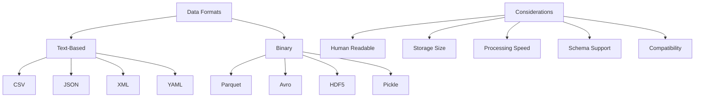

# Data Formats and Serialization

## Introduction

Data comes in many formats, each with unique characteristics, advantages, and use cases. Understanding different data formats is crucial for data scientists, as you'll frequently need to read, write, transform, and exchange data across systems. The choice of data format impacts storage efficiency, processing speed, interoperability, and ease of use.

This lesson explores common data formats, their strengths and weaknesses, and practical techniques for working with each format in Python.



## CSV (Comma-Separated Values)

CSV is the most common format for tabular data, simple and widely supported but limited in capabilities.

```python
import pandas as pd
import numpy as np
import csv
from io import StringIO

class CSVHandler:
    """Handle CSV file operations"""

    @staticmethod
    def read_csv(filepath, **kwargs):
        """Read CSV file with pandas"""
        # Common parameters
        return pd.read_csv(
            filepath,
            encoding=kwargs.get('encoding', 'utf-8'),
            sep=kwargs.get('sep', ','),
            header=kwargs.get('header', 0),
            names=kwargs.get('names'),
            dtype=kwargs.get('dtype'),
            parse_dates=kwargs.get('parse_dates'),
            na_values=kwargs.get('na_values'),
            skiprows=kwargs.get('skiprows'),
            nrows=kwargs.get('nrows')
        )

    @staticmethod
    def write_csv(df, filepath, **kwargs):
        """Write DataFrame to CSV"""
        df.to_csv(
            filepath,
            index=kwargs.get('index', False),
            encoding=kwargs.get('encoding', 'utf-8'),
            sep=kwargs.get('sep', ','),
            header=kwargs.get('header', True),
            mode=kwargs.get('mode', 'w'),
            compression=kwargs.get('compression')
        )

    @staticmethod
    def read_csv_chunks(filepath, chunk_size=10000):
        """Read large CSV in chunks"""
        chunks = []
        for chunk in pd.read_csv(filepath, chunksize=chunk_size):
            # Process each chunk
            chunks.append(chunk)
        return pd.concat(chunks, ignore_index=True)

    @staticmethod
    def handle_encoding_issues(filepath):
        """Handle common encoding problems"""
        encodings = ['utf-8', 'latin1', 'cp1252', 'iso-8859-1']

        for encoding in encodings:
            try:
                df = pd.read_csv(filepath, encoding=encoding)
                print(f"Successfully read with encoding: {encoding}")
                return df
            except UnicodeDecodeError:
                continue

        raise ValueError("Unable to decode file with common encodings")

# Create sample CSV data
sample_data = pd.DataFrame({
    'id': range(1, 6),
    'name': ['Alice', 'Bob', 'Charlie', 'Diana', 'Eve'],
    'age': [25, 30, 35, 28, 42],
    'salary': [50000.0, 60000.0, 75000.0, 55000.0, 80000.0],
    'hire_date': pd.to_datetime(['2020-01-15', '2019-03-20', '2018-07-10',
                                  '2021-02-01', '2017-11-05'])
})

# Save to CSV
csv_handler = CSVHandler()
csv_handler.write_csv(sample_data, 'sample_data.csv')
print("Sample CSV created")

# Read CSV with specific options
df = csv_handler.read_csv(
    'sample_data.csv',
    parse_dates=['hire_date'],
    dtype={'id': int, 'age': int}
)
print("\nCSV Data:")
print(df)
print("\nData Types:")
print(df.dtypes)

# Advanced CSV operations
class AdvancedCSV:
    """Advanced CSV handling techniques"""

    @staticmethod
    def detect_delimiter(filepath, num_lines=5):
        """Automatically detect CSV delimiter"""
        with open(filepath, 'r') as f:
            sample = ''.join([f.readline() for _ in range(num_lines)])

        sniffer = csv.Sniffer()
        delimiter = sniffer.sniff(sample).delimiter
        return delimiter

    @staticmethod
    def clean_csv_data(df):
        """Clean common CSV issues"""
        # Remove leading/trailing whitespace from string columns
        string_cols = df.select_dtypes(include=['object']).columns
        df[string_cols] = df[string_cols].apply(lambda x: x.str.strip())

        # Convert empty strings to NaN
        df.replace('', np.nan, inplace=True)

        # Remove duplicate rows
        df.drop_duplicates(inplace=True)

        return df

    @staticmethod
    def merge_csv_files(file_list, output_file):
        """Merge multiple CSV files"""
        dfs = []
        for file in file_list:
            df = pd.read_csv(file)
            dfs.append(df)

        combined = pd.concat(dfs, ignore_index=True)
        combined.to_csv(output_file, index=False)
        return combined

# Example
adv_csv = AdvancedCSV()
cleaned = adv_csv.clean_csv_data(df.copy())
print("\nCleaned CSV Data:")
print(cleaned)
```

## JSON (JavaScript Object Notation)

JSON is ideal for hierarchical and nested data structures, widely used in APIs and web applications.

```python
import json

class JSONHandler:
    """Handle JSON operations"""

    @staticmethod
    def read_json(filepath):
        """Read JSON file"""
        with open(filepath, 'r', encoding='utf-8') as f:
            return json.load(f)

    @staticmethod
    def write_json(data, filepath, indent=2):
        """Write data to JSON file"""
        with open(filepath, 'w', encoding='utf-8') as f:
            json.dump(data, f, indent=indent, ensure_ascii=False, default=str)

    @staticmethod
    def json_to_dataframe(json_data, normalize=True):
        """Convert JSON to DataFrame"""
        if normalize:
            # Flatten nested JSON
            return pd.json_normalize(json_data)
        else:
            return pd.DataFrame(json_data)

    @staticmethod
    def dataframe_to_json(df, orient='records'):
        """
        Convert DataFrame to JSON
        orient options: 'records', 'index', 'columns', 'values', 'table'
        """
        return df.to_json(orient=orient, date_format='iso', indent=2)

# Sample nested JSON data
json_data = {
    'users': [
        {
            'id': 1,
            'name': 'Alice Johnson',
            'contact': {
                'email': 'alice@email.com',
                'phone': '555-0001'
            },
            'orders': [
                {'order_id': 101, 'total': 999.99, 'items': 2},
                {'order_id': 102, 'total': 299.99, 'items': 1}
            ],
            'metadata': {
                'registration_date': '2023-01-15',
                'loyalty_tier': 'gold',
                'preferences': ['electronics', 'books']
            }
        },
        {
            'id': 2,
            'name': 'Bob Smith',
            'contact': {
                'email': 'bob@email.com',
                'phone': '555-0002'
            },
            'orders': [
                {'order_id': 103, 'total': 599.99, 'items': 3}
            ],
            'metadata': {
                'registration_date': '2023-02-20',
                'loyalty_tier': 'silver',
                'preferences': ['clothing', 'sports']
            }
        }
    ]
}

json_handler = JSONHandler()

# Save to file
json_handler.write_json(json_data, 'sample_data.json')

# Read and flatten
loaded = json_handler.read_json('sample_data.json')
df_normalized = json_handler.json_to_dataframe(loaded['users'])
print("Normalized JSON Data:")
print(df_normalized)

# Working with nested structures
class NestedJSONProcessor:
    """Process complex nested JSON structures"""

    @staticmethod
    def extract_nested_field(data, path):
        """
        Extract nested field using dot notation
        e.g., 'users.0.contact.email'
        """
        keys = path.split('.')
        result = data

        for key in keys:
            if isinstance(result, list):
                result = result[int(key)]
            elif isinstance(result, dict):
                result = result.get(key)
            else:
                return None

        return result

    @staticmethod
    def flatten_completely(data, parent_key='', sep='_'):
        """Recursively flatten nested JSON"""
        items = []

        if isinstance(data, dict):
            for k, v in data.items():
                new_key = f"{parent_key}{sep}{k}" if parent_key else k

                if isinstance(v, dict):
                    items.extend(
                        NestedJSONProcessor.flatten_completely(v, new_key, sep).items()
                    )
                elif isinstance(v, list) and v and isinstance(v[0], dict):
                    # Handle list of dicts
                    for i, item in enumerate(v):
                        items.extend(
                            NestedJSONProcessor.flatten_completely(
                                item, f"{new_key}{sep}{i}", sep
                            ).items()
                        )
                else:
                    items.append((new_key, v))
        else:
            items.append((parent_key, data))

        return dict(items)

    @staticmethod
    def parse_json_lines(filepath):
        """Parse JSON Lines format (one JSON per line)"""
        data = []
        with open(filepath, 'r') as f:
            for line in f:
                if line.strip():
                    data.append(json.loads(line))
        return data

# Example
processor = NestedJSONProcessor()

# Extract nested field
email = processor.extract_nested_field(json_data, 'users.0.contact.email')
print(f"\nExtracted email: {email}")

# Completely flatten
first_user = json_data['users'][0]
flattened = processor.flatten_completely(first_user)
print("\nCompletely Flattened:")
for key, value in flattened.items():
    print(f"  {key}: {value}")
```

## XML (eXtensible Markup Language)

XML is common in enterprise systems and document-based data exchange.

```python
import xml.etree.ElementTree as ET
from xml.dom import minidom

class XMLHandler:
    """Handle XML operations"""

    @staticmethod
    def parse_xml(filepath):
        """Parse XML file"""
        tree = ET.parse(filepath)
        root = tree.getroot()
        return root

    @staticmethod
    def xml_to_dict(element):
        """Convert XML element to dictionary"""
        result = {element.tag: {}}

        # Add attributes
        if element.attrib:
            result[element.tag]['@attributes'] = element.attrib

        # Add children
        children = list(element)
        if children:
            child_dict = {}
            for child in children:
                child_data = XMLHandler.xml_to_dict(child)
                child_tag = list(child_data.keys())[0]

                if child_tag in child_dict:
                    # Multiple children with same tag
                    if not isinstance(child_dict[child_tag], list):
                        child_dict[child_tag] = [child_dict[child_tag]]
                    child_dict[child_tag].append(child_data[child_tag])
                else:
                    child_dict[child_tag] = child_data[child_tag]

            result[element.tag].update(child_dict)
        elif element.text and element.text.strip():
            result[element.tag] = element.text.strip()

        return result

    @staticmethod
    def dict_to_xml(data, root_name='root'):
        """Convert dictionary to XML"""
        root = ET.Element(root_name)

        def build_tree(parent, data):
            if isinstance(data, dict):
                for key, value in data.items():
                    if key == '@attributes':
                        parent.attrib.update(value)
                    else:
                        if isinstance(value, list):
                            for item in value:
                                child = ET.SubElement(parent, key)
                                build_tree(child, item)
                        else:
                            child = ET.SubElement(parent, key)
                            build_tree(child, value)
            else:
                parent.text = str(data)

        build_tree(root, data)
        return root

    @staticmethod
    def prettify_xml(element):
        """Return pretty-printed XML string"""
        rough_string = ET.tostring(element, encoding='unicode')
        reparsed = minidom.parseString(rough_string)
        return reparsed.toprettyxml(indent="  ")

# Create sample XML
xml_data = """<?xml version="1.0"?>
<catalog>
    <product id="1">
        <name>Laptop</name>
        <category>Electronics</category>
        <price currency="USD">999.99</price>
        <stock>50</stock>
    </product>
    <product id="2">
        <name>Mouse</name>
        <category>Electronics</category>
        <price currency="USD">29.99</price>
        <stock>200</stock>
    </product>
</catalog>"""

# Save to file
with open('sample_data.xml', 'w') as f:
    f.write(xml_data)

xml_handler = XMLHandler()

# Parse XML
root = xml_handler.parse_xml('sample_data.xml')

# Extract data to list
products = []
for product in root.findall('product'):
    products.append({
        'id': product.get('id'),
        'name': product.find('name').text,
        'category': product.find('category').text,
        'price': float(product.find('price').text),
        'currency': product.find('price').get('currency'),
        'stock': int(product.find('stock').text)
    })

df_xml = pd.DataFrame(products)
print("XML Data as DataFrame:")
print(df_xml)

# Convert to dict
xml_dict = xml_handler.xml_to_dict(root)
print("\nXML as Dictionary:")
print(json.dumps(xml_dict, indent=2))
```

## Parquet (Columnar Binary Format)

Parquet is optimized for analytical workloads, offering compression and fast columnar access.

```python
class ParquetHandler:
    """Handle Parquet file operations"""

    @staticmethod
    def write_parquet(df, filepath, compression='snappy'):
        """
        Write DataFrame to Parquet
        compression options: 'snappy', 'gzip', 'brotli', 'lz4', 'zstd'
        """
        df.to_parquet(
            filepath,
            compression=compression,
            index=False,
            engine='pyarrow'
        )

    @staticmethod
    def read_parquet(filepath, columns=None):
        """Read Parquet file"""
        return pd.read_parquet(
            filepath,
            columns=columns,
            engine='pyarrow'
        )

    @staticmethod
    def compare_formats(df, base_filename):
        """Compare different formats"""
        import os

        results = {}

        # CSV
        csv_file = f"{base_filename}.csv"
        df.to_csv(csv_file, index=False)
        results['csv'] = os.path.getsize(csv_file)

        # JSON
        json_file = f"{base_filename}.json"
        df.to_json(json_file, orient='records')
        results['json'] = os.path.getsize(json_file)

        # Parquet (uncompressed)
        parquet_file = f"{base_filename}_uncompressed.parquet"
        df.to_parquet(parquet_file, compression=None)
        results['parquet_uncompressed'] = os.path.getsize(parquet_file)

        # Parquet (snappy)
        parquet_snappy = f"{base_filename}_snappy.parquet"
        df.to_parquet(parquet_snappy, compression='snappy')
        results['parquet_snappy'] = os.path.getsize(parquet_snappy)

        # Parquet (gzip)
        parquet_gzip = f"{base_filename}_gzip.parquet"
        df.to_parquet(parquet_gzip, compression='gzip')
        results['parquet_gzip'] = os.path.getsize(parquet_gzip)

        return results

# Create larger dataset for comparison
large_df = pd.DataFrame({
    'id': range(10000),
    'name': [f'User_{i}' for i in range(10000)],
    'value': np.random.randn(10000),
    'category': np.random.choice(['A', 'B', 'C', 'D'], 10000),
    'timestamp': pd.date_range('2024-01-01', periods=10000, freq='1min')
})

parquet_handler = ParquetHandler()

# Compare formats
print("File Size Comparison:")
sizes = parquet_handler.compare_formats(large_df, 'comparison')
for format_name, size in sorted(sizes.items(), key=lambda x: x[1]):
    print(f"  {format_name}: {size:,} bytes ({size/1024:.2f} KB)")

# Parquet advantages demonstration
parquet_handler.write_parquet(large_df, 'large_data.parquet')

# Read specific columns only (columnar advantage)
import time

start = time.time()
subset = parquet_handler.read_parquet('large_data.parquet', columns=['id', 'value'])
parquet_time = time.time() - start

print(f"\nParquet column subset read time: {parquet_time:.4f} seconds")
print(f"Read {len(subset)} rows, {len(subset.columns)} columns")
```

## Other Data Formats

```python
import pickle
import yaml

class AdditionalFormats:
    """Handle additional data formats"""

    @staticmethod
    def pickle_save(obj, filepath):
        """Save Python object with pickle"""
        with open(filepath, 'wb') as f:
            pickle.dump(obj, f)

    @staticmethod
    def pickle_load(filepath):
        """Load pickled object"""
        with open(filepath, 'rb') as f:
            return pickle.load(f)

    @staticmethod
    def yaml_save(data, filepath):
        """Save data as YAML"""
        with open(filepath, 'w') as f:
            yaml.dump(data, f, default_flow_style=False)

    @staticmethod
    def yaml_load(filepath):
        """Load YAML file"""
        with open(filepath, 'r') as f:
            return yaml.safe_load(f)

# Example: Configuration in YAML
config = {
    'database': {
        'host': 'localhost',
        'port': 5432,
        'name': 'analytics_db'
    },
    'api': {
        'base_url': 'https://api.example.com',
        'timeout': 30,
        'retry_attempts': 3
    },
    'processing': {
        'batch_size': 1000,
        'num_workers': 4,
        'features': ['feature1', 'feature2', 'feature3']
    }
}

formats = AdditionalFormats()

# Save as YAML
formats.yaml_save(config, 'config.yaml')
print("Configuration saved as YAML")

# Load YAML
loaded_config = formats.yaml_load('config.yaml')
print("\nLoaded Configuration:")
print(yaml.dump(loaded_config, default_flow_style=False))
```

## Format Conversion Utilities

```python
class FormatConverter:
    """Convert between different data formats"""

    @staticmethod
    def csv_to_json(csv_file, json_file, orient='records'):
        """Convert CSV to JSON"""
        df = pd.read_csv(csv_file)
        df.to_json(json_file, orient=orient, indent=2)

    @staticmethod
    def json_to_csv(json_file, csv_file):
        """Convert JSON to CSV"""
        df = pd.read_json(json_file)
        df.to_csv(csv_file, index=False)

    @staticmethod
    def csv_to_parquet(csv_file, parquet_file):
        """Convert CSV to Parquet"""
        df = pd.read_csv(csv_file)
        df.to_parquet(parquet_file)

    @staticmethod
    def excel_to_csv(excel_file, csv_file, sheet_name=0):
        """Convert Excel to CSV"""
        df = pd.read_excel(excel_file, sheet_name=sheet_name)
        df.to_csv(csv_file, index=False)

    @staticmethod
    def auto_convert(input_file, output_file):
        """Automatically detect format and convert"""
        import os

        _, input_ext = os.path.splitext(input_file)
        _, output_ext = os.path.splitext(output_file)

        # Read input
        if input_ext == '.csv':
            df = pd.read_csv(input_file)
        elif input_ext == '.json':
            df = pd.read_json(input_file)
        elif input_ext == '.parquet':
            df = pd.read_parquet(input_file)
        elif input_ext in ['.xlsx', '.xls']:
            df = pd.read_excel(input_file)
        else:
            raise ValueError(f"Unsupported input format: {input_ext}")

        # Write output
        if output_ext == '.csv':
            df.to_csv(output_file, index=False)
        elif output_ext == '.json':
            df.to_json(output_file, orient='records', indent=2)
        elif output_ext == '.parquet':
            df.to_parquet(output_file)
        elif output_ext in ['.xlsx', '.xls']:
            df.to_excel(output_file, index=False)
        else:
            raise ValueError(f"Unsupported output format: {output_ext}")

        print(f"Converted {input_file} to {output_file}")

# Example conversions
converter = FormatConverter()

# CSV to JSON
converter.csv_to_json('sample_data.csv', 'converted.json')
print("Converted CSV to JSON")

# CSV to Parquet
converter.csv_to_parquet('sample_data.csv', 'converted.parquet')
print("Converted CSV to Parquet")
```

## Format Selection Guide

```python
class FormatSelector:
    """Help select appropriate data format"""

    @staticmethod
    def recommend_format(characteristics):
        """
        Recommend format based on characteristics
        characteristics: dict with keys like 'size', 'structure', 'use_case'
        """
        recommendations = []

        # Size considerations
        if characteristics.get('size') == 'large':
            recommendations.append({
                'format': 'Parquet',
                'reason': 'Efficient compression and columnar storage for large datasets'
            })

        # Structure considerations
        if characteristics.get('structure') == 'nested':
            recommendations.append({
                'format': 'JSON',
                'reason': 'Native support for nested/hierarchical data'
            })
        elif characteristics.get('structure') == 'flat':
            recommendations.append({
                'format': 'CSV',
                'reason': 'Simple and universal for flat tabular data'
            })

        # Use case considerations
        if characteristics.get('use_case') == 'analytics':
            recommendations.append({
                'format': 'Parquet',
                'reason': 'Optimized for analytical queries'
            })
        elif characteristics.get('use_case') == 'web_api':
            recommendations.append({
                'format': 'JSON',
                'reason': 'Standard format for web APIs'
            })
        elif characteristics.get('use_case') == 'data_exchange':
            recommendations.append({
                'format': 'CSV',
                'reason': 'Universal compatibility'
            })

        # Human readability
        if characteristics.get('human_readable'):
            recommendations.append({
                'format': 'JSON or YAML',
                'reason': 'Easy to read and edit manually'
            })

        return recommendations

# Example usage
selector = FormatSelector()

scenarios = [
    {
        'name': 'Large Analytics Dataset',
        'chars': {'size': 'large', 'use_case': 'analytics', 'structure': 'flat'}
    },
    {
        'name': 'API Response Data',
        'chars': {'structure': 'nested', 'use_case': 'web_api'}
    },
    {
        'name': 'Configuration File',
        'chars': {'human_readable': True, 'size': 'small'}
    }
]

for scenario in scenarios:
    print(f"\n{scenario['name']}:")
    recommendations = selector.recommend_format(scenario['chars'])
    for rec in recommendations:
        print(f"  - {rec['format']}: {rec['reason']}")
```

## Summary

Understanding data formats is essential for effective data science work:

**CSV:**
- Simple, universal, human-readable
- Limited to flat tabular data
- No schema or data type enforcement
- Good for: Simple data exchange, spreadsheet compatibility

**JSON:**
- Supports nested structures
- Human-readable
- Widely used in web applications
- Good for: APIs, configuration files, hierarchical data

**XML:**
- Highly structured with schema support
- Verbose but powerful
- Common in enterprise systems
- Good for: Document-centric data, complex structures

**Parquet:**
- Columnar binary format
- Excellent compression
- Fast analytical queries
- Good for: Large datasets, data warehouses, analytics

**Format Selection Criteria:**
- Data size and volume
- Data structure (flat vs. nested)
- Performance requirements
- Interoperability needs
- Human readability requirements
- Storage constraints

Choose formats based on your specific use case, balancing factors like performance, compatibility, and ease of use.
